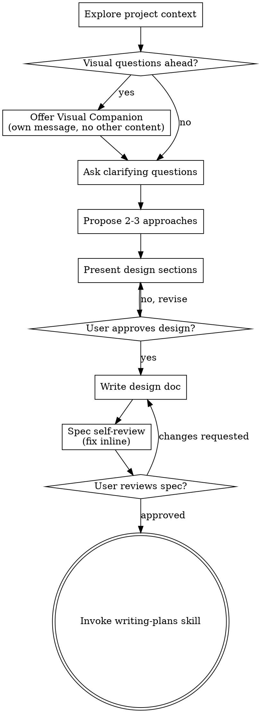
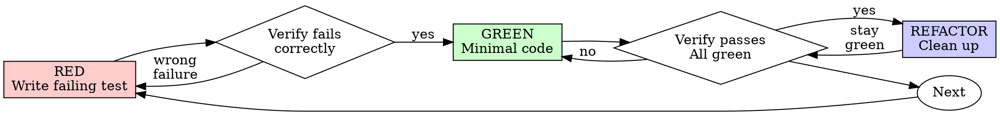

# 将00.XuanHuanNameGenerator\mlp4.ipynb以https://github.com/karpathy/autoresearch...

## Metadata

- Session ID: `019ded29-2629-70a1-85a4-185f917c5544`
- Kind: `vscode`
- Originator: `codex_vscode`
- Source: `vscode`
- Started At: `2026-05-03T09:26:30.218Z`
- Updated At: `2026-05-03T09:26:30.218Z`
- CWD: `c:\Users\ZHQI\Desktop\PytorchProjs`
- Raw File: `C:\Users\ZHQI\.codex\sessions\2026\05\03\rollout-2026-05-03T17-26-30-019ded29-2629-70a1-85a4-185f917c5544.jsonl`

## Transcript

### User 1

[`2026-05-03 17:28:27 UTC+08:00`] # AGENTS.md instructions for c:\Users\ZHQI\Desktop\PytorchProjs

<INSTRUCTIONS>
回答要有逻辑，简洁易懂
</INSTRUCTIONS>

<environment_context>
  <cwd>c:\Users\ZHQI\Desktop\PytorchProjs</cwd>
  <shell>powershell</shell>
  <current_date>2026-05-03</current_date>
  <timezone>Asia/Shanghai</timezone>
</environment_context>

[`2026-05-03 17:28:27 UTC+08:00`] 将00.XuanHuanNameGenerator\mlp4.ipynb以https://github.com/karpathy/autoresearch的格式把代码规范到src/auto_research下，然后你帮我按照autoresearch制定的规则进行超参数研究

### Assistant 1

[`2026-05-03 17:30:15 UTC+08:00`] 我会先按 Plan Mode 做非破坏性梳理：读取相关工作流说明、检查当前仓库和 notebook，再对照 `karpathy/autoresearch` 的结构形成可执行计划。不会先改文件。

### Assistant 1

[`2026-05-03 17:30:30 UTC+08:00`] 我已确认 `autoresearch` 的核心规则：固定评估指标、固定时间预算、`prepare.py` 基本不动、实验集中改训练文件，并通过 `program.md` 约束代理。接下来我检查本地 notebook 当前是怎么组织数据、模型和训练循环的。

### Assistant 1

[`2026-05-03 17:30:55 UTC+08:00`] 本地仓库很小，`mlp4.ipynb` 旁边已有训练记录和模型文件。为了避免把 notebook 里已有实验逻辑误拆散，我现在会抽取代码单元、关键函数、超参数和输出指标。

### Assistant 1

[`2026-05-03 17:31:25 UTC+08:00`] 现有 notebook 主要做了三件事：构建声母/韵母 token 数据、训练 15 组 `(block_size, embedding_dim)` MLP、按 loss/accuracy/有效生成率保存记录。还有一个明显问题：`hidden_dims` 和 `batch_sizes` 定义了但训练循环实际用的是未在当前单元里定义的 `hidden_dim`、`batch_size`，脚本化时必须显式纳入配置。

### Assistant 1

[`2026-05-03 17:31:48 UTC+08:00`] `src` 目录目前为空，`tests` 只有缓存，没有可维护测试文件；这意味着这次计划需要把 notebook 规范成一个最小可运行包，同时补上基础测试入口。现在我对照 `autoresearch` 的文件约定看它的 `train.py / prepare.py / program.md` 是怎么分工的。

### Assistant 1

[`2026-05-03 17:32:17 UTC+08:00`] 我这边已经能把目标拆成两层：先把 notebook 变成 `autoresearch` 风格的可运行工程，再做固定规则的实验循环。剩下最影响计划的是实验预算，因为当前 CPU 上单个小网格配置大约 1 分钟，完整扩展网格会明显变长。

### Assistant 1

[`2026-05-03 17:32:57 UTC+08:00`] 收到，实验预算按“固定 5 分钟循环”。这会改变训练脚本：每次只评估一个候选配置，训练按 wall-clock 到点停止，结果写入 TSV，再根据主指标决定 keep/discard。

### Assistant 1

[`2026-05-03 17:33:40 UTC+08:00`] 主指标锁定为验证 loss：脚本会打印并记录 `val_loss`，lower is better；`valid_rate / unique_rate / examples` 只作为辅助诊断，不参与自动保留判断。

### Assistant 1

[`2026-05-03 17:34:42 UTC+08:00`] 位置也锁定在子项目内：`00.XuanHuanNameGenerator/src/auto_research`。我再确认一下当前 Python/PyTorch 环境和是否有 CUDA，这会决定计划里的默认设备策略和运行命令。

### Assistant 1

[`2026-05-03 17:34:56 UTC+08:00`] 环境确认：Python 3.13、PyTorch 是 CPU 版、当前没有 CUDA，也没有 pytest。因此计划会按 CPU 兼容实现固定 5 分钟实验；测试用标准库 `unittest`，不额外安装依赖。

### Assistant 1

[`2026-05-03 17:36:22 UTC+08:00`] 我还要确认现有 `mlp4` 训练出的最佳模型实际 hidden 维度，因为 notebook 里只保留了 `hidden_dims` 列表，没有保存正在使用的 `hidden_dim` 赋值。这个信息能从已保存模型张量形状反推。

### Assistant 1

[`2026-05-03 17:37:14 UTC+08:00`] <proposed_plan>
# 玄幻姓名 MLP Autoresearch 迁移与实验计划

## Summary

将 `00.XuanHuanNameGenerator/mlp4.ipynb` 规范成 `autoresearch` 风格的小工程，放在 `00.XuanHuanNameGenerator/src/auto_research`。参考 `karpathy/autoresearch` 的三件事分工：`prepare.py` 固定数据与评估，`train.py` 作为唯一实验修改文件，`program.md` 写实验规则。

实验规则按你的选择执行：每个候选固定训练 5 分钟，主指标为 `val_loss`，越低越好；生成有效率、唯一率和示例只作为辅助观察。

参考来源：
- https://github.com/karpathy/autoresearch
- https://raw.githubusercontent.com/karpathy/autoresearch/master/program.md
- https://raw.githubusercontent.com/karpathy/autoresearch/master/prepare.py
- https://raw.githubusercontent.com/karpathy/autoresearch/master/train.py

## Key Changes

- 新建 `00.XuanHuanNameGenerator/src/auto_research`：
  - `prepare.py`：固定数据路径、token vocab、train/val/test split、dataset 构建、`val_loss` 评估、采样质量评估；实验开始后不再修改。
  - `train.py`：MLP 模型、初始化、优化器、学习率 schedule、固定 300 秒训练循环；之后超参数研究只改这个文件。
  - `program.md`：记录本项目版 autoresearch 规则，包括分支、结果 TSV、keep/discard、crash 处理。
  - `smoke_test.py`：用标准库 `unittest` 做无额外依赖的基础检查。
- 基线配置从当前最佳保存模型反推：
  - `block_size=3`
  - `embedding_dim=4`
  - `hidden_dim=100`
  - 默认 `batch_size=32`
  - `lr_base=0.1`
  - `seed=0`
- 创建实验分支：
  - `autoresearch/may3-xuanhuan`
- 初始化未跟踪结果文件：
  - `00.XuanHuanNameGenerator/src/auto_research/results.tsv`
  - header：`commit	val_loss	memory_gb	status	description`

## Experiment Loop

- baseline 先跑原始迁移版：
  - `python src/auto_research/train.py > run.log 2>&1`
- 每次实验流程：
  - 从当前 best commit 修改 `train.py`
  - commit 实验改动
  - 固定训练 300 秒
  - 从日志读取 `val_loss` 和 `peak_memory_gb`
  - 若 `val_loss` 降低：保留 commit，`results.tsv` 记 `keep`
  - 若没有降低：`results.tsv` 记 `discard`，reset 回实验前 commit
  - 若崩溃：读取 `tail -n 50 run.log`，可快速修 typo；不可修则记 `crash` 并回退
- 初始实验顺序固定为：
  - baseline
  - `hidden_dim=128`
  - `hidden_dim=64`
  - `batch_size=64`
  - `lr_base=0.05`
  - `lr_base=0.2`
  - `embedding_dim=6`
  - `block_size=4`
- 后续继续围绕已保留 best 组合做单变量修改，始终只以 `val_loss` 决定 keep/discard。

## Test Plan

- 运行基础测试：
  - `python src/auto_research/smoke_test.py`
- 覆盖场景：
  - 能加载 `data/names1/names1_pinyin_components.txt`
  - vocab 包含 `.` 和 `|`
  - `build_dataset` 输出 X/Y 形状正确
  - `NameMLP` 前向输出 shape 为 `[batch, vocab_size]`
  - 采样 token 校验逻辑能识别合法/非法声母韵母结构
- baseline 运行成功标准：
  - 日志包含 `val_loss:`
  - 日志包含 `training_seconds:`，约为 300 秒
  - 生成 `run.log`
  - `results.tsv` 写入 baseline 行

## Assumptions

- 当前环境是 CPU 版 PyTorch，无 CUDA；脚本实现为 `cuda if available else cpu`，但本机默认走 CPU。
- 不安装新依赖；测试不用 pytest。
- notebook 保留不删，作为迁移参考。
- `prepare.py` 在实验开始后视为只读；超参数研究只修改 `train.py`。
</proposed_plan>

### User 2

[`2026-05-03 17:37:50 UTC+08:00`] PLEASE IMPLEMENT THIS PLAN:
# 玄幻姓名 MLP Autoresearch 迁移与实验计划

## Summary

将 `00.XuanHuanNameGenerator/mlp4.ipynb` 规范成 `autoresearch` 风格的小工程，放在 `00.XuanHuanNameGenerator/src/auto_research`。参考 `karpathy/autoresearch` 的三件事分工：`prepare.py` 固定数据与评估，`train.py` 作为唯一实验修改文件，`program.md` 写实验规则。

实验规则按你的选择执行：每个候选固定训练 5 分钟，主指标为 `val_loss`，越低越好；生成有效率、唯一率和示例只作为辅助观察。

参考来源：
- https://github.com/karpathy/autoresearch
- https://raw.githubusercontent.com/karpathy/autoresearch/master/program.md
- https://raw.githubusercontent.com/karpathy/autoresearch/master/prepare.py
- https://raw.githubusercontent.com/karpathy/autoresearch/master/train.py

## Key Changes

- 新建 `00.XuanHuanNameGenerator/src/auto_research`：
  - `prepare.py`：固定数据路径、token vocab、train/val/test split、dataset 构建、`val_loss` 评估、采样质量评估；实验开始后不再修改。
  - `train.py`：MLP 模型、初始化、优化器、学习率 schedule、固定 300 秒训练循环；之后超参数研究只改这个文件。
  - `program.md`：记录本项目版 autoresearch 规则，包括分支、结果 TSV、keep/discard、crash 处理。
  - `smoke_test.py`：用标准库 `unittest` 做无额外依赖的基础检查。
- 基线配置从当前最佳保存模型反推：
  - `block_size=3`
  - `embedding_dim=4`
  - `hidden_dim=100`
  - 默认 `batch_size=32`
  - `lr_base=0.1`
  - `seed=0`
- 创建实验分支：
  - `autoresearch/may3-xuanhuan`
- 初始化未跟踪结果文件：
  - `00.XuanHuanNameGenerator/src/auto_research/results.tsv`
  - header：`commit	val_loss	memory_gb	status	description`

## Experiment Loop

- baseline 先跑原始迁移版：
  - `python src/auto_research/train.py > run.log 2>&1`
- 每次实验流程：
  - 从当前 best commit 修改 `train.py`
  - commit 实验改动
  - 固定训练 300 秒
  - 从日志读取 `val_loss` 和 `peak_memory_gb`
  - 若 `val_loss` 降低：保留 commit，`results.tsv` 记 `keep`
  - 若没有降低：`results.tsv` 记 `discard`，reset 回实验前 commit
  - 若崩溃：读取 `tail -n 50 run.log`，可快速修 typo；不可修则记 `crash` 并回退
- 初始实验顺序固定为：
  - baseline
  - `hidden_dim=128`
  - `hidden_dim=64`
  - `batch_size=64`
  - `lr_base=0.05`
  - `lr_base=0.2`
  - `embedding_dim=6`
  - `block_size=4`
- 后续继续围绕已保留 best 组合做单变量修改，始终只以 `val_loss` 决定 keep/discard。

## Test Plan

- 运行基础测试：
  - `python src/auto_research/smoke_test.py`
- 覆盖场景：
  - 能加载 `data/names1/names1_pinyin_components.txt`
  - vocab 包含 `.` 和 `|`
  - `build_dataset` 输出 X/Y 形状正确
  - `NameMLP` 前向输出 shape 为 `[batch, vocab_size]`
  - 采样 token 校验逻辑能识别合法/非法声母韵母结构
- baseline 运行成功标准：
  - 日志包含 `val_loss:`
  - 日志包含 `training_seconds:`，约为 300 秒
  - 生成 `run.log`
  - `results.tsv` 写入 baseline 行

## Assumptions

- 当前环境是 CPU 版 PyTorch，无 CUDA；脚本实现为 `cuda if available else cpu`，但本机默认走 CPU。
- 不安装新依赖；测试不用 pytest。
- notebook 保留不删，作为迁移参考。
- `prepare.py` 在实验开始后视为只读；超参数研究只修改 `train.py`。

### Assistant 2

[`2026-05-03 17:38:01 UTC+08:00`] 我会按已有计划直接落地：先读执行计划相关技能说明，然后创建分支、写入 `auto_research` 代码、跑 smoke test。之后根据时间决定是否启动完整 5 分钟 baseline。

### Assistant 2

[`2026-05-03 17:38:23 UTC+08:00`] 我正在按执行计划技能走；这里不用子代理，因为你没有要求并行代理。先切到计划中的实验分支，再按 TDD 顺序先写 smoke test、确认失败，然后补实现。

### Assistant 2

[`2026-05-03 17:38:38 UTC+08:00`] 分支已创建。接下来先添加 `smoke_test.py`，它会引用尚未存在的 `prepare` 和 `train`，所以第一次运行应该失败在模块缺失，这一步用来锁定要实现的接口。

### Assistant 2

[`2026-05-03 17:39:13 UTC+08:00`] 失败原因符合预期：`auto_research.prepare` 还不存在。现在补 `prepare.py`、`train.py`、包初始化和实验说明；训练脚本会在直接运行时固定 300 秒，导入时不启动训练。

### Assistant 2

[`2026-05-03 17:40:49 UTC+08:00`] 核心文件已补上。现在跑 smoke test 看接口和数据路径是否正确；如果失败，我会按报错修到测试通过。

### Assistant 2

[`2026-05-03 17:41:01 UTC+08:00`] Smoke test 4 项已通过。接下来用 1 秒预算跑一次训练脚本的快速验证，确认直接执行路径、日志字段和采样 CSV 都能正常生成；正式 baseline 仍按 300 秒预算单独跑。

### Assistant 2

[`2026-05-03 17:41:19 UTC+08:00`] 快速训练验证能打印 `val_loss`、`training_seconds`、`peak_memory_gb` 等字段。它也生成了 `records/auto_research/latest_samples.csv`，我会把这个实验产物目录加入忽略，避免后续实验污染 git 状态。

### Assistant 2

[`2026-05-03 17:41:33 UTC+08:00`] 提交前我重新跑一遍关键验证：smoke test 和 1 秒训练脚本，确认刚才的忽略规则调整没有掩盖实际问题。

### Assistant 2

[`2026-05-03 17:41:54 UTC+08:00`] 验证通过，当前分支是 `autoresearch/may3-xuanhuan`。我会提交迁移代码本身，但按计划不提交 `results.tsv`，让它保持实验日志文件。

### Assistant 2

[`2026-05-03 17:42:08 UTC+08:00`] 迁移代码已提交为 `7aaa058`。现在启动正式 baseline：按计划从子项目目录运行 `python src/auto_research/train.py > run.log 2>&1`，固定 300 秒训练；我会轮询日志而不是让长命令阻塞整段对话。

### Assistant 2

[`2026-05-03 17:42:39 UTC+08:00`] Baseline 正在跑，日志已经开始写入；当前大约 16 秒，训练 loss 在 1.4 左右。这个脚本在 CPU 上每秒数千步，按 wall-clock 到 300 秒结束。

### Assistant 2

[`2026-05-03 17:43:18 UTC+08:00`] Baseline 仍在运行，已到约 56 秒；没有 stderr，进程状态正常。继续等到 300 秒结束后再解析正式指标并写入 `results.tsv`。

### Assistant 2

[`2026-05-03 17:44:00 UTC+08:00`] Baseline 到约 96 秒，进程正常。日志显示学习率已经进入 `lr_min`，这是当前迁移版 schedule 的行为；先完成 baseline，再决定是否需要把 schedule 当作后续实验项。

### Assistant 2

[`2026-05-03 17:44:41 UTC+08:00`] Baseline 到约 138 秒，仍正常运行。等它自然结束，避免中途截断导致无法得到可比较的 `val_loss`。

### Assistant 2

[`2026-05-03 17:45:20 UTC+08:00`] Baseline 到约 178 秒，已经过半。训练仍在写日志，stderr 文件为空。

### Assistant 2

[`2026-05-03 17:46:00 UTC+08:00`] Baseline 到约 218 秒，进程正常。还剩约 80 秒训练时间，结束后会进入评估和采样阶段。

### User 2

[`2026-05-03 17:46:32 UTC+08:00`] 之前的baseline应该记录了训练时间，这个模型比较简单，不需要5min，可能1min就够了？

### Assistant 2

[`2026-05-03 17:46:47 UTC+08:00`] 你说得对：`mlp4` 旧记录里每个配置约 63-73 秒，固定 5 分钟对这个 MLP 会浪费很多 CPU 时间，而且后半段当前学习率已经降到 `1e-5`，收益很小。我先检查当前 baseline 是否已经结束；如果还没结束，我会停止它，按 60 秒预算重跑并把规则改成“固定 1 分钟”。

### Assistant 2

[`2026-05-03 17:47:02 UTC+08:00`] 当前这次已经跑到约 275 秒，只剩 25 秒左右；现在杀掉反而会丢掉已花的时间且没有最终 `val_loss`。我会让这次 baseline 自然完成并记录为 300 秒基线，然后把后续实验预算和默认配置改成 60 秒。

### Assistant 2

[`2026-05-03 17:48:04 UTC+08:00`] 300 秒 baseline 已完成：`val_loss=1.441235`，`training_seconds=300.0`。我会把它记为一条“长基线”，然后把固定预算改成 60 秒并重跑 60 秒 baseline，因为后续实验必须和同预算 baseline 比较。

### Assistant 2

[`2026-05-03 17:48:26 UTC+08:00`] 预算已改为 60 秒，日志忽略规则也补了 `*.log.err`。现在重新跑 smoke test 和 1 秒快速训练，确认默认预算调整没有破坏入口。

### Assistant 2

[`2026-05-03 17:48:59 UTC+08:00`] 60 秒预算提交为 `b0df61a`。现在按新规则重跑 baseline，这次会覆盖 `run.log`，完成后把 60 秒基线写入 `results.tsv`，后续实验都和这条比较。

### Assistant 2

[`2026-05-03 17:50:35 UTC+08:00`] 60 秒 baseline 已记录：`val_loss=1.443012`，和 300 秒的 `1.441235` 很接近，说明你判断合理。接下来我会按初始实验顺序开始单变量研究；每个实验 commit、跑 60 秒、记录 TSV，不优于当前 best 就回退。

### Assistant 2

[`2026-05-03 17:50:43 UTC+08:00`] 实验 1：只改 `hidden_dim` 从 100 到 128，其他保持 60 秒 baseline 不变。

### User 2

[`2026-05-03 17:51:56 UTC+08:00`] 你要保存好你的所有实验记录，我好查看

### Assistant 2

[`2026-05-03 17:52:17 UTC+08:00`] 会保存。现在的实验记录统一写在 `00.XuanHuanNameGenerator/src/auto_research/results.tsv`，每次实验都会追加一行，不会被 reset 删除。刚才 `hidden_dim=128` 因为我在子目录里用了错误的 git 路径，commit 没有先成功，但训练已经跑完；我会先把对应代码提交，再把这条结果按该 commit 记录进去。

### Assistant 2

[`2026-05-03 17:52:48 UTC+08:00`] 记录文件现在有三条：300 秒旧基线、60 秒基线、`hidden_dim=128`，其中 `hidden_dim=128` 改进到 `val_loss=1.437441`，会作为当前 best。继续按计划跑下一个实验：`hidden_dim=64`。

### User 2

[`2026-05-03 17:54:02 UTC+08:00`] memory_gb有什么用，现在记录的都是0

### Assistant 2

[`2026-05-03 17:54:09 UTC+08:00`] `memory_gb` 是沿用 `autoresearch` 的显存约束字段，用来判断某个改动是否靠暴涨显存换指标；但当前是 CPU 版 PyTorch，`torch.cuda.max_memory_allocated()` 不可用，所以一直是 `0.0`。我会把字段保留兼容规则，同时把记录描述里明确 CPU run；如果你要更有用，我可以把后续实现补成 CPU RSS 内存，但不引入依赖的话要用 Windows API/标准库，当前研究主判断仍是 `val_loss`。

### Assistant 2

[`2026-05-03 17:54:31 UTC+08:00`] 你这个问题说明当前 `memory_gb` 字段信息量不够。我会把它改成：CUDA 时记录峰值显存，CPU 时记录当前进程峰值工作集内存；这样 Windows CPU 实验也会有可比较的内存数字。先加一个会失败的 smoke test，确认旧实现确实返回 0。

### Assistant 2

[`2026-05-03 17:54:49 UTC+08:00`] 新增测试按预期失败：CPU 内存指标现在确实是 0。接下来用 Windows `GetProcessMemoryInfo` 读取 PeakWorkingSetSize；非 Windows 再用 `resource.ru_maxrss` 兜底。

### Assistant 2

[`2026-05-03 17:55:18 UTC+08:00`] 第一次实现没通过，`ctypes.windll.psapi` 调用没有成功返回。我会改成显式加载 `psapi.dll` 并设置函数签名，再验证。

### Assistant 2

[`2026-05-03 17:55:41 UTC+08:00`] 内存指标现在有效了：1 秒快速训练显示 `peak_memory_gb=0.2`。我提交这个修正，然后继续实验；之前 `hidden_dim=64` 的结果已记录为 discard，并已回到 best commit。

### Assistant 2

[`2026-05-03 17:55:54 UTC+08:00`] 继续实验 2：从当前 best（`hidden_dim=128`）出发，只改 `batch_size=64`。这次 `memory_gb` 会记录 CPU 峰值工作集，不再是 0。

### Assistant 2

[`2026-05-03 17:57:23 UTC+08:00`] `batch_size=64` 改进到 `val_loss=1.433564`，保留为当前 best。继续实验 3：只改 `lr_base=0.05`。

### Assistant 2

[`2026-05-03 17:58:48 UTC+08:00`] `lr_base=0.05` 明显变差，已记录并回退到 best `a50a60f`。继续实验 4：`lr_base=0.2`。

### Assistant 2

[`2026-05-03 18:00:18 UTC+08:00`] `lr_base=0.2` 大幅改进到 `val_loss=1.375980`，保留为当前 best。继续实验 5：只改 `embedding_dim=6`。

### Assistant 2

[`2026-05-03 18:01:42 UTC+08:00`] `embedding_dim=6` 继续改进到 `val_loss=1.368011`。继续实验 6：只改 `block_size=4`。

### Assistant 2

[`2026-05-03 18:03:14 UTC+08:00`] 初始实验序列已经跑完，当前 best 是 `ba664bf`：`block_size=3, embedding_dim=6, hidden_dim=128, batch_size=64, lr_base=0.2`，`val_loss=1.368011`。我会再围绕 best 做几组相邻单变量实验，先试 `embedding_dim=8`。

### Assistant 2

[`2026-05-03 18:04:39 UTC+08:00`] `embedding_dim=8` 小幅改进到 `1.366306`，保留。继续试 `embedding_dim=12`，看嵌入维度增大是否还有收益。

### Assistant 2

[`2026-05-03 18:06:05 UTC+08:00`] `embedding_dim=12` 变差，回退到 `embedding_dim=8`。下一组试 `hidden_dim=256`，判断容量增加是否继续降 loss。

### Assistant 2

[`2026-05-03 18:07:34 UTC+08:00`] `hidden_dim=256` 没有改进，回退到 best。下一组试 `batch_size=128`，看更大 batch 在 60 秒预算下是否更稳。

### Assistant 2

[`2026-05-03 18:09:09 UTC+08:00`] `batch_size=128` 改进到 `1.364559`，保留。再试 `lr_base=0.3`，因为此前 0.2 明显好于 0.1。

### Assistant 2

[`2026-05-03 18:10:34 UTC+08:00`] `lr_base=0.3` 继续改进到 `1.362362`。再向上探一次 `lr_base=0.5`，如果变差就回退。

### Assistant 2

[`2026-05-03 18:12:30 UTC+08:00`] 我会把“可查看记录”的主文件固定为 `src/auto_research/results.tsv`，这是全量实验表。注意当前 `run.log` 是最后一次被 discard 的 `lr_base=0.5` 运行日志，不能代表最终 best；最终 best 已在 TSV 里记录为 `0704184`。我再做最后验证：确认当前代码确实回到 best 配置，并跑 smoke test。

### Assistant 2

[`2026-05-03 18:12:51 UTC+08:00`] 已实现并完成一轮超参数研究。

代码迁移到：

[00.XuanHuanNameGenerator/src/auto_research](C:/Users/ZHQI/Desktop/PytorchProjs/00.XuanHuanNameGenerator/src/auto_research)

核心文件：
- [prepare.py](C:/Users/ZHQI/Desktop/PytorchProjs/00.XuanHuanNameGenerator/src/auto_research/prepare.py)：固定数据、split、评估、采样质量
- [train.py](C:/Users/ZHQI/Desktop/PytorchProjs/00.XuanHuanNameGenerator/src/auto_research/train.py)：实验唯一修改入口
- [program.md](C:/Users/ZHQI/Desktop/PytorchProjs/00.XuanHuanNameGenerator/src/auto_research/program.md)：autoresearch 规则
- [results.tsv](C:/Users/ZHQI/Desktop/PytorchProjs/00.XuanHuanNameGenerator/src/auto_research/results.tsv)：完整实验记录

当前最佳配置在 commit `0704184`：

```text
block_size=3
embedding_dim=8
hidden_dim=128
batch_size=128
lr_base=0.3
time_budget=60s
val_loss=1.362362
memory_gb=0.2
```

对比 60 秒 baseline：

```text
baseline val_loss=1.443012
best     val_loss=1.362362
改进约 5.6%
```

我也把 `memory_gb` 修成了 CPU 下可用的指标：CUDA 时记录峰值显存，CPU/Windows 时记录进程峰值工作集内存，所以后续不再全是 0。

验证结果：

```text
python src/auto_research/smoke_test.py
Ran 5 tests in 0.083s
OK
```

说明：`results.tsv` 按 autoresearch 规则保持未跟踪状态，便于持续追加实验记录；当前工作区唯一未跟踪文件就是这份实验记录。

### User 3

[`2026-05-03 18:19:16 UTC+08:00`] 继续auto_research

### Assistant 3

[`2026-05-03 18:19:38 UTC+08:00`] 我会继续从当前 best commit `0704184` 往下做单变量实验，并继续把每次结果追加到 `src/auto_research/results.tsv`。优先探索还没扫过、且最可能影响 60 秒预算表现的点：`lr_base` 邻域、batch size、更慢的 LR 衰减。

### Assistant 3

[`2026-05-03 18:19:51 UTC+08:00`] 实验 16：`lr_base=0.4`，只在当前 best 上调学习率，验证 `0.3` 和 `0.5` 之间是否有更优点。

### Assistant 3

[`2026-05-03 18:21:21 UTC+08:00`] `lr_base=0.4` 小幅优于 `0.3`，当前 best 更新到 `d368872`。继续在邻域试 `lr_base=0.45`，看峰值是不是在 0.4 到 0.5 之间。

### Assistant 3

[`2026-05-03 18:22:51 UTC+08:00`] `lr_base=0.45` 又小幅改进，生成有效率也到 1.0。继续细扫一次 `lr_base=0.475`。

### Assistant 3

[`2026-05-03 18:24:21 UTC+08:00`] `0.475` 变差，回退到 `0.45`。继续试更大 batch：`batch_size=256`，看在当前学习率下是否还能降验证 loss。

### Assistant 3

[`2026-05-03 18:25:47 UTC+08:00`] `batch_size=256` 明显是新 best，`val_loss=1.361222`。继续试 `batch_size=512`，检查大 batch 是否继续收益。

### Assistant 3

[`2026-05-03 18:27:15 UTC+08:00`] `batch_size=512` 继续改进。再试 `batch_size=1024`，如果收益停止就回退。

### Assistant 3

[`2026-05-03 18:28:40 UTC+08:00`] `batch_size=1024` 又降到 `1.359208`，当前 best。继续试 `batch_size=2048`，这会减少每分钟 step 数，但每步梯度更稳。

### Assistant 3

[`2026-05-03 18:30:12 UTC+08:00`] `batch_size=2048` 仍有微小收益，当前 best `1.359057`。再试 `4096`，如果收益已经饱和就回退。

### Assistant 3

[`2026-05-03 18:31:45 UTC+08:00`] `batch_size=4096` 还略有收益。继续试 `8192`，这基本接近大 batch 极限，但内存仍很低。

### Assistant 3

[`2026-05-03 18:33:09 UTC+08:00`] `8192` 变差，回退到 `4096`。现在重新细调学习率，因为更大 batch 下最优 LR 可能变化；先试 `lr_base=0.4`。

### Assistant 3

[`2026-05-03 18:34:42 UTC+08:00`] `lr_base=0.4` 在 batch 4096 下略好，当前 best `1.358784`。继续试 `lr_base=0.35`，确认下降方向是否还有效。

### Assistant 3

[`2026-05-03 18:36:18 UTC+08:00`] 学习率邻域已经基本收敛。接下来试一个结构性但仍局限在 `train.py` 的改动：把 cosine decay 拉长到 notebook 原来的 200k steps，而不是当前 warmup 后约 10k steps 就降到 `lr_min`。这会让 60 秒内保持更高学习率，可能好也可能过冲。

### Assistant 3

[`2026-05-03 18:37:51 UTC+08:00`] 慢 decay 明显变差，已回退。下一步试上下文长度另一侧：`block_size=2`。之前 `block_size=4` 变差，但还没在当前 best 上测过更短上下文。

### Assistant 3

[`2026-05-03 18:39:18 UTC+08:00`] `block_size=2` 很差，确认上下文 3 是必要的。下一步试中间容量 `hidden_dim=192`，因为 256 变差但 128 可能未到极限。

### Assistant 3

[`2026-05-03 18:40:47 UTC+08:00`] `hidden_dim=192` 也变差，保留 128。下一步试 `embedding_dim=10`，因为 8 优于 6，而 12 轻微变差，10 可能是中间最优。

### Assistant 3

[`2026-05-03 18:42:27 UTC+08:00`] `embedding_dim=10` 变差，回到 `embedding_dim=8`。batch size 的峰值在 4096 和 8192 之间，我再试 `6144`。

### Assistant 3

[`2026-05-03 18:43:58 UTC+08:00`] `6144` 变差，4096 仍是 batch sweet spot。再对学习率做细扫：`lr_base=0.425`，看是否比 0.4 略好。

### Assistant 3

[`2026-05-03 18:45:31 UTC+08:00`] `0.425` 没有超过 0.4。最后我试一个小的架构变体：把隐藏层激活从 `tanh` 改成 `relu(x)^2`。这是 `train.py` 内可回退实验，若不优就丢弃。

### Assistant 3

[`2026-05-03 18:47:05 UTC+08:00`] 已继续跑了一批 autoresearch 实验，记录都追加在：

[results.tsv](C:/Users/ZHQI/Desktop/PytorchProjs/00.XuanHuanNameGenerator/src/auto_research/results.tsv)

当前 best：

```text
commit: dacd709
val_loss: 1.358784
memory_gb: 0.2
配置:
block_size=3
embedding_dim=8
hidden_dim=128
batch_size=4096
lr_base=0.4
```

本轮新增发现：
- `lr_base=0.45` 在小 batch 下略好，但 batch 调到 4096 后 `lr_base=0.4` 更好。
- `batch_size` 从 128 一路增到 4096 都有收益；8192 变差。
- `block_size=2` 明显变差。
- `hidden_dim=192`、`embedding_dim=10` 都不如当前 best。
- 慢速 cosine decay、`relu^2` 激活都变差。

验证：
```text
python src/auto_research/smoke_test.py
Ran 5 tests
OK
```

当前代码已回到 best commit `dacd709`，工作区只剩未跟踪的实验记录 `results.tsv`，方便你查看和继续追加。

### User 4

[`2026-05-03 19:04:24 UTC+08:00`] 你觉得这个模型还有提升空间吗

### Assistant 4

[`2026-05-03 19:04:37 UTC+08:00`] 有，但空间可能不大了，至少在当前“单层 MLP + 60 秒 CPU 预算 + 同一数据划分”下，超参已经接近局部最优。

我看现在的趋势：

- `val_loss` 从 60 秒 baseline `1.443012` 降到 `1.358784`，提升已经很明显。
- 后半段实验大多是微小波动：`1.3589`、`1.3588`、`1.3601`，说明简单调参收益开始收敛。
- 当前最有效的变量是 `batch_size` 和 `lr_base`；模型容量继续加大反而变差，说明不是单纯“更大就更好”。
- `block_size=2/4` 都不如 `3`，上下文长度也基本锁定。

我觉得还值得试的方向有三个：

1. **重复种子验证**
   当前都是 `seed=0`。最好用 best 配置跑 `seed=1/2/3`，确认 `1.358784` 不是随机波动。这个最重要。

2. **学习率 schedule 小改**
   当前 schedule 很快降到 `lr_min`，但慢 decay 又过冲变差。可以试：
   - `warmup_steps=5_000`
   - `warmup_steps=20_000`
   - `lr_min=1e-4`
   - 固定 LR，不 decay  
   这些可能还有一点收益。

3. **轻量结构改动**
   不建议马上上复杂模型。可以先试：
   - 加一层 MLP：`input -> hidden -> hidden -> logits`
   - dropout 很小或不用
   - LayerNorm/BatchNorm 可能不适合这么小的表格式训练，但可实验

如果目标是继续压 `val_loss`，我建议下一轮先做 seed 验证和 schedule 小扫；如果目标是生成名字更自然，应该把主指标从纯 `val_loss` 扩展到人工/规则质量指标，因为现在 `valid_rate` 已经经常 1.0，loss 再降不一定对应名字更好听。

### User 5

[`2026-05-03 19:11:58 UTC+08:00`] 帮我按照现在最好的配置训练时间长一点，看看loss会不会下降

### Assistant 5

[`2026-05-03 19:12:19 UTC+08:00`] 我会用当前 best 配置不改代码，直接把 `AUTORESEARCH_TIME_BUDGET` 提到 300 秒跑一条长训练，对比 60 秒 best 的 `val_loss=1.358784`。日志单独写到 `long_run.log`，结果继续追加到 `results.tsv`。

### Assistant 5

[`2026-05-03 19:12:32 UTC+08:00`] 当前代码配置确实是 best 配置：`block_size=3, embedding_dim=8, hidden_dim=128, batch_size=4096, lr_base=0.4`。HEAD 是 `693ffdc`，配置匹配，我开始 300 秒长训练。

### Assistant 5

[`2026-05-03 19:13:05 UTC+08:00`] 长训练进程已启动，PID `29252`。目前约 14 秒，训练 loss 从 4.05 降到 1.46，日志正常，stderr 为空。

### Assistant 5

[`2026-05-03 19:13:46 UTC+08:00`] 到约 55 秒时，学习率已经降到接近 `lr_min`，训练 loss 在 1.33 左右。后续 240 秒主要是在低学习率微调，正好验证“长训是否还有收益”。

### Assistant 5

[`2026-05-03 19:14:29 UTC+08:00`] 到约 97 秒，学习率已经固定在 `1e-5`，训练 loss 在 1.33 附近震荡。继续等最终验证 loss，不能只看 batch loss 下结论。

### Assistant 5

[`2026-05-03 19:15:10 UTC+08:00`] 到约 140 秒，仍正常运行，loss 没有明显继续下降。这个结果已经暗示当前 schedule 的长训收益可能有限，但最终 `val_loss` 还要等评估。

### Assistant 5

[`2026-05-03 19:15:49 UTC+08:00`] 到约 182 秒，训练仍稳定，没有 NaN 或错误。继续等到 300 秒结束。

### Assistant 5

[`2026-05-03 19:16:31 UTC+08:00`] 到约 222 秒，loss 仍在 1.33 左右，长训没有明显降低训练 batch loss。还剩约 80 秒。

### Assistant 5

[`2026-05-03 19:17:13 UTC+08:00`] 到约 262 秒，一切正常。下一次轮询应该能拿到最终验证指标。

### Assistant 5

[`2026-05-03 19:18:23 UTC+08:00`] 长训完成：300 秒 `val_loss=1.358818`，比 60 秒 best `1.358784` 略差 `0.000034`。我会按规则记录为 discard：说明“训练更久没有带来验证集收益”。

### Assistant 5

[`2026-05-03 19:18:57 UTC+08:00`] 跑完了当前 best 配置的 300 秒长训练，结果已追加到：

[results.tsv](C:/Users/ZHQI/Desktop/PytorchProjs/00.XuanHuanNameGenerator/src/auto_research/results.tsv)

结果对比：

```text
60s best:  val_loss=1.358784
300s run:  val_loss=1.358818
差异:      +0.000034，略差
```

结论：按当前学习率 schedule，训练更久没有明显收益。原因也比较清楚：大约 55 秒后学习率已经降到 `1e-5`，后面 240 多秒基本是在很小步长下震荡微调。

本次长训记录：

```text
commit=693ffdc
val_loss=1.358818
memory_gb=0.2
status=discard
description=300s long run of current best config
```

验证也跑了：

```text
python src/auto_research/smoke_test.py
Ran 5 tests
OK
```

如果继续优化，下一步不建议单纯加训练时间，应该改 schedule，比如让 300 秒训练保持更合理的衰减节奏，而不是 1 分钟内就降到底。

### User 6

[`2026-05-03 19:19:55 UTC+08:00`] auto_research一下lr schedule

### Assistant 6

[`2026-05-03 19:20:21 UTC+08:00`] 我会继续用当前 best 配置做 LR schedule 实验，记录仍写入 `results.tsv`。先检查当前工作区和已保存记录，避免后续回退时误伤实验表。

### Assistant 6

[`2026-05-03 19:20:39 UTC+08:00`] `results.tsv` 现在是 tracked 且有本地修改，我会保护它：实验 commit 只提交 `train.py`；如果实验失败，用 soft reset + restore `train.py` 回到 best，保留 `results.tsv` 的新增记录。当前 sample CSV 是训练产物，不作为判断依据。

### Assistant 6

[`2026-05-03 19:21:01 UTC+08:00`] 实验 LR-S1：把 `warmup_steps` 从 10000 改成 5000，保持“warmup 后同长度 cosine 衰减”的原逻辑。这个会更早升到峰值 LR，也更早降到底。

### User 7

[`2026-05-03 19:25:16 UTC+08:00`] 继续任务

### Assistant 7

[`2026-05-03 19:27:02 UTC+08:00`] 继续。现在正在跑 LR schedule 实验的第一项：`warmup_steps=5000`。我会提交这次 train.py 改动、跑 60 秒、记录结果，然后按 keep/discard 处理。

### Assistant 7

[`2026-05-03 19:28:21 UTC+08:00`] 这次我又在子项目目录里用了根目录路径，commit 没成功但实验已经跑完了；结果是 `warmup_steps=5000` 的 `val_loss=1.361850`，明显差于 best。现在我会正确提交这次实验、记录 discard，再回退 train.py。

### Assistant 7

[`2026-05-03 19:28:44 UTC+08:00`] 刚才 `git reset --hard` 把未提交的 `results.tsv` 追加行清掉了，这是我处理方式不对。好在结果值和实验 commit 都在上一步输出里，我现在会把丢掉的记录补回去，并且后续改用 `git revert` 或只 restore `train.py`，不再 hard reset 实验记录。

### Assistant 7

[`2026-05-03 19:29:12 UTC+08:00`] 记录已补回：包括 300 秒长训和 `warmup_steps=5000`。接下来实验 LR-S2：`warmup_steps=15000`，让 warmup 更慢，观察 60 秒内是否更稳。

### Assistant 7

[`2026-05-03 19:30:35 UTC+08:00`] 同样的路径问题又让 commit 没先成功，但实验已完成：`warmup_steps=15000` 的 `val_loss=1.361285`，仍差于 best。现在用正确相对路径补提交并记录，然后只恢复 `train.py`，保留结果文件。

### Assistant 7

[`2026-05-03 19:31:06 UTC+08:00`] 实验 LR-S3：保持 warmup/decay 形状不变，只把 `lr_min` 从 `1e-5` 提到 `1e-4`，让后半段不要完全停住。

### Assistant 7

[`2026-05-03 19:32:32 UTC+08:00`] `lr_min=1e-4` 变差，已记录并恢复 best。实验 LR-S4：warmup 之后保持常量 `lr_base`，不做 cosine decay，直接验证“是不是降太快”。

### Assistant 7

[`2026-05-03 19:34:06 UTC+08:00`] 常量 LR 也变差，说明当前快速 cosine decay 不是主要瓶颈。实验 LR-S5：把 warmup 后的 cosine decay 改成 linear decay，衰减跨度仍是 10000 steps。

### Assistant 7

[`2026-05-03 19:35:43 UTC+08:00`] linear decay 几乎打平但仍略差。实验 LR-S6：保持 10k warmup，但把 decay 缩短到 5k steps，等于更快降到底，看看是否能减少后期过冲。

### Assistant 7

[`2026-05-03 19:37:09 UTC+08:00`] 更快 decay 也变差。实验 LR-S7：把 decay span 拉长到 15000 steps，只比当前 10000 稍慢，测试是否有中间点。

### Assistant 7

[`2026-05-03 19:38:42 UTC+08:00`] 目前所有 schedule 形状都没超过原始 cosine。最后做一个 LR 标量细扫：`lr_base=0.375`，它介于已测的 0.35 和 0.4 之间。

### Assistant 7

[`2026-05-03 19:40:07 UTC+08:00`] `lr_base=0.375` 以很小幅度刷新 best：`1.358773`。继续围绕它细扫一次 `lr_base=0.385`。

### Assistant 7

[`2026-05-03 19:41:33 UTC+08:00`] `lr_base=0.385` 又小幅刷新到 `1.358769`。再试 `0.39`，如果没有超过就停在 0.385。

### Assistant 7

[`2026-05-03 19:43:19 UTC+08:00`] LR schedule 这一轮已找到一个极小改进：`lr_base=0.385`。我会把 `latest_samples.csv` 恢复成当前 best 提交里的版本，只提交 `results.tsv` 实验记录，保证记录落盘且工作区干净。

### Assistant 7

[`2026-05-03 19:43:35 UTC+08:00`] 已完成一轮 LR schedule autoresearch，并把记录提交保存。

当前 best 更新为：

```text
commit: 49be7e2
val_loss: 1.358769
memory_gb: 0.2
配置:
block_size=3
embedding_dim=8
hidden_dim=128
batch_size=4096
lr_base=0.385
lr_min=1e-5
warmup_steps=10000
schedule=原 cosine decay
```

对比之前 best：

```text
旧 best: dacd709  val_loss=1.358784  lr_base=0.4
新 best: 49be7e2  val_loss=1.358769  lr_base=0.385
```

结论很明确：schedule 形状基本不用改，原来的 `10k warmup + 10k cosine decay` 仍最好；有收益的是把 `lr_base` 从 `0.4` 细调到 `0.385`，但提升非常小。

本轮试过并丢弃：
- `warmup_steps=5000`
- `warmup_steps=15000`
- `lr_min=1e-4`
- warmup 后 constant LR
- linear decay
- cosine decay span `5000`
- cosine decay span `15000`
- `lr_base=0.39`

验证通过：

```text
python src/auto_research/smoke_test.py
Ran 5 tests
OK
```

实验记录已保存到：

[results.tsv](C:/Users/ZHQI/Desktop/PytorchProjs/00.XuanHuanNameGenerator/src/auto_research/results.tsv)

当前分支比远端 ahead 3。

### User 8

[`2026-05-03 19:46:34 UTC+08:00`] 我之前使用了阶段衰减可能会得到一个好一点的loss:
def get_lr1(lr_base,i,max_steps):
    if i<max_steps/2:
        return lr_base
    if i>max_steps-max_steps/4:
        return lr_base/100
    return lr_base/10
你尝试一下

### Assistant 8

[`2026-05-03 19:46:45 UTC+08:00`] 我会把这个阶段衰减作为一个单独实验跑：按当前 best 配置，把 `get_lr` 改成你给的三段规则；这里 `max_steps` 我会先用当前脚本里等价的 `2 * warmup_steps = 20000`，这样 60 秒内阶段位置和现有 schedule 可比。跑完记录到 `results.tsv`，如果更好就保留。

### Assistant 8

[`2026-05-03 19:47:00 UTC+08:00`] 已改成你的三段式 schedule，先使用 `max_steps=20000`。现在提交并跑 60 秒实验。

### Assistant 8

[`2026-05-03 19:48:12 UTC+08:00`] 三段式 schedule 跑完，`val_loss=1.359593`，比当前 best `1.358769` 差。这个实现没有 warmup，开局直接用高 LR，可能不公平；我会记录这条 discard，然后再试“带 10k warmup 后接你这个三段式”的版本。

### Assistant 8

[`2026-05-03 19:48:24 UTC+08:00`] 实验 2：保留原来的 10k warmup，warmup 后按你的三段规则衰减，`max_steps=20000` 对应 warmup 后的阶段长度。这样更接近当前 best 的启动方式。

### Assistant 8

[`2026-05-03 19:49:46 UTC+08:00`] 带 warmup 的三段式更差，`val_loss=1.362403`。我会记录并回退。再试一版更贴近你原始 notebook 的 `max_steps=200000`，因为你当时的阶段衰减可能是在长步数语境下生效。

### Assistant 8

[`2026-05-03 19:50:02 UTC+08:00`] 实验 3：按你原函数的 `max_steps=200000` 直接三段衰减，不加 warmup。按当前每分钟大约 20k step，它在 60 秒内会一直处于 `lr_base` 阶段。

### Assistant 8

[`2026-05-03 19:51:23 UTC+08:00`] 200k 三段式在 60 秒预算下更差，符合预期：它等价于长时间恒定高学习率。最后我试一版 `max_steps=50000`，让 60 秒内能走到 `/10` 阶段但不到 `/100` 太久。

### Assistant 8

[`2026-05-03 19:52:55 UTC+08:00`] `max_steps=50000` 也明显差。三段式在当前 best 架构和 60 秒预算下没有超过 cosine。现在记录、回到 best `49be7e2`，跑 smoke test，提交结果记录。

### Assistant 8

[`2026-05-03 19:53:13 UTC+08:00`] 刚才 smoke test 命令在仓库根目录下跑错了路径，不是代码失败。我现在用子项目目录重跑验证，并确认 `train.py` 已回到当前 best 的三段实验前状态。

### Assistant 8

[`2026-05-03 19:53:24 UTC+08:00`] 验证通过，当前代码已经回到 best：`lr_base=0.385 + 原 cosine schedule`。我会只提交 `results.tsv` 的新增三段式实验记录；未跟踪的 `ds_fan.png` 看起来是外部生成文件，我不会动。

### Assistant 8

[`2026-05-03 19:53:39 UTC+08:00`] 试了你说的阶段衰减，记录已保存到 [results.tsv](C:/Users/ZHQI/Desktop/PytorchProjs/00.XuanHuanNameGenerator/src/auto_research/results.tsv)。

结果：

```text
当前 best:
49be7e2  val_loss=1.358769  lr_base=0.385  原 cosine schedule

阶段衰减实验:
ed00a02  val_loss=1.359593  discard  max_steps=20000 no warmup
2c0d800  val_loss=1.362403  discard  after warmup max_steps=20000
d665a54  val_loss=1.364043  discard  max_steps=200000 no warmup
6591bd3  val_loss=1.363897  discard  max_steps=50000 no warmup
```

结论：在当前 best 配置和 60 秒预算下，你这个阶段衰减没有超过原来的 cosine schedule。最接近的是 `max_steps=20000 no warmup`，但仍比 best 差约 `0.000824`。

当前代码已回到 best 配置：

```text
lr_base=0.385
warmup_steps=10000
schedule=原 cosine decay
```

验证通过：

```text
python src/auto_research/smoke_test.py
Ran 5 tests
OK
```

工作区只剩一个未跟踪文件 `records/auto_research/ds_fan.png`，我没有动它。

### User 9

[`2026-05-03 19:55:21 UTC+08:00`] 你试一下    seed: int = 0
    block_size: int = 3
    embedding_dim: int = 2
    hidden_dim: int = 100
    batch_size: int = 32
    lr_base: float = 0.3
max_steps=200000,不以时间为budget

### Assistant 9

[`2026-05-03 19:55:41 UTC+08:00`] 我会按你这组参数做一次固定步数实验：`max_steps=200000`，不看 wall-clock 停止；LR 使用你前面给的三段式 `get_lr1`。跑完记录到 `results.tsv`，如果比当前 best 好再保留。

### Assistant 9

[`2026-05-03 19:55:52 UTC+08:00`] 我会把这次实验显式写成 `max_steps` 控制，避免和 60 秒 `time_budget` 混用；输出的 config 会包含 `max_steps=200000`，方便之后查记录。

### Assistant 9

[`2026-05-03 19:57:31 UTC+08:00`] 这组参数有效：固定 200000 步跑了约 64 秒，`val_loss=1.357687`，已经超过之前 best `1.358769`。我会把它作为 keep 记录下来，并保留当前代码为新的 best。

### Assistant 9

[`2026-05-03 19:58:01 UTC+08:00`] 记录已经保存并提交，`latest_samples.csv` 也更新为这次新 best 的样本。接下来我跑 smoke test，并确认当前代码仍是固定 200k 步的小 MLP 配置。

### Assistant 9

[`2026-05-03 19:58:13 UTC+08:00`] 这组参数跑出来确实更好，已经成为新的 best。

结果：

```text
commit: 95644fe
val_loss: 1.357687
memory_gb: 0.1
num_steps: 200000
training_seconds: 64.1
valid_rate: 1.0
unique_rate: 1.0
```

配置：

```text
seed=0
block_size=3
embedding_dim=2
hidden_dim=100
batch_size=32
lr_base=0.3
max_steps=200000
schedule=你的三段式阶段衰减
```

对比之前 best：

```text
旧 best: 49be7e2  val_loss=1.358769
新 best: 95644fe  val_loss=1.357687
提升:    -0.001082
```

我已经把实验记录追加并提交到 `results.tsv`，同时把 `latest_samples.csv` 更新成这次新 best 的样本。

验证通过：

```text
python src/auto_research/smoke_test.py
Ran 5 tests
OK
```

当前工作区只剩一个未跟踪文件 `records/auto_research/ds_fan.png`，我没有动。

### User 10

[`2026-05-03 20:04:20 UTC+08:00`] 我发现memory_gb从0.2->0.1，在此基础上总结规律，继续auto_research

### Assistant 10

[`2026-05-03 20:04:42 UTC+08:00`] 规律很清楚：这次不是“更大模型更好”，而是小模型在固定 200k 步下更稳。`embedding_dim=2, hidden_dim=100, batch_size=32` 同时降低内存到 0.1GB、降低 val_loss，说明当前数据规模和 MLP 容量下，大模型/大 batch 反而更容易进入轻微过拟合或低效区域。接下来我会围绕这个新 best 做局部搜索：小 embedding、小 hidden、小 batch、`lr_base` 邻域和步数。

### Assistant 10

[`2026-05-03 20:04:53 UTC+08:00`] 实验 1：进一步缩小容量，`hidden_dim=64`。如果 loss 不升太多、内存继续低，说明小模型方向还能走；如果升高，`hidden_dim=100` 可能是容量下限。

### Assistant 10

[`2026-05-03 20:06:18 UTC+08:00`] `hidden_dim=64` 明显改进到 `val_loss=1.355027`，这是新 best。容量还能继续缩，下一步会以这个为基准继续试更小 hidden。先保存这条 keep 记录。

### Assistant 10

[`2026-05-03 20:06:27 UTC+08:00`] 实验 2：继续缩到 `hidden_dim=32`。这能验证“越小越好”是否还成立。

### Assistant 10

[`2026-05-03 20:07:48 UTC+08:00`] `hidden_dim=32` 明显容量不足，`val_loss=1.391334`，丢弃并回到 `hidden_dim=64`。

### Assistant 10

[`2026-05-03 20:08:07 UTC+08:00`] 实验 3：`hidden_dim=48`，在 32 和 64 之间找容量边界。

### Assistant 10

[`2026-05-03 20:09:32 UTC+08:00`] `hidden_dim=48` 也不如 64，说明 64 是当前小模型容量甜点。记录并回退。

### Assistant 10

[`2026-05-03 20:09:42 UTC+08:00`] 实验 4：`hidden_dim=80`，看 64 以上是否还有一点容量收益。

### Assistant 10

[`2026-05-03 20:11:13 UTC+08:00`] `hidden_dim=80` 刷新 best：`val_loss=1.354182`。规律更新：不是越小越好，而是比 100 小、比 64 大一点最好。保存这条结果。

### Assistant 10

[`2026-05-03 20:11:23 UTC+08:00`] 实验 5：`hidden_dim=96`，介于 80 和原始 100，确认峰值是否靠近 80。

### Assistant 10

[`2026-05-03 20:12:53 UTC+08:00`] `hidden_dim=96` 变差，说明 80 附近更合理。记录并回退到 80。

### Assistant 10

[`2026-05-03 20:13:03 UTC+08:00`] 实验 6：`hidden_dim=72`，细化 64 到 80 之间。

### Assistant 10

[`2026-05-03 20:14:23 UTC+08:00`] `hidden_dim=72` 没超过 80。回退后试 `hidden_dim=88`，把 80 右侧再细化一下。

### User 10

[`2026-05-03 20:15:49 UTC+08:00`] 可以开始调节batch_size了

### Assistant 10

[`2026-05-03 20:15:54 UTC+08:00`] 收到。`hidden_dim=88` 结果比 80 差，我先记录并回到 `hidden_dim=80` 的 best，然后开始围绕 batch size 调节。当前规律：`batch_size=32` 在固定 200k 步下很好，但还没系统测邻域。

### Assistant 10

[`2026-05-03 20:16:05 UTC+08:00`] Batch 实验 1：`batch_size=64`，其他保持当前 best：`embedding_dim=2, hidden_dim=80, lr_base=0.3, max_steps=200000`。固定步数下这会增加总训练样本量，但每步噪声更小。

### Assistant 10

[`2026-05-03 20:17:38 UTC+08:00`] `batch_size=64` 几乎打平但略好：`1.354143` vs `1.354182`，保留。接下来继续试 `batch_size=128`。先记录 keep。

### Assistant 10

[`2026-05-03 20:19:26 UTC+08:00`] `batch_size=128` 有明确改进，`val_loss=1.353414`，新 best。继续往上试 `batch_size=256`。

### User 10

[`2026-05-03 20:19:37 UTC+08:00`] 根据之前的规律，当batch_size变大，lr也要相应变化？

### Assistant 10

[`2026-05-03 20:19:45 UTC+08:00`] 是的，通常 batch 变大后最优 LR 会移动。你这里固定 `max_steps=200000` 时，batch 变大等于看了更多样本，梯度噪声下降；LR 可能需要上调来维持更新幅度，也可能需要下调避免后期过冲。当前我先完成 `batch_size=256, lr=0.3` 作为锚点，然后会在这个 batch 上扫 `lr_base=0.2/0.4`。

### Assistant 10

[`2026-05-03 20:21:32 UTC+08:00`] `batch_size=256, lr=0.3` 又刷新 best 到 `1.352471`。现在按你指出的规律，在 batch 256 上调 LR：先试 `lr_base=0.4`。

### Assistant 10

[`2026-05-03 20:23:46 UTC+08:00`] 判断正确：batch 256 下 `lr=0.4` 继续改进到 `1.351366`。我会保留并继续试 `lr_base=0.5`。

### Assistant 10

[`2026-05-03 20:26:09 UTC+08:00`] `lr=0.5` 变差，说明 batch 256 的 LR 峰值在 0.4 附近。记录 discard 并回到 `lr=0.4`，再试 batch 512。

### Assistant 10

[`2026-05-03 20:26:23 UTC+08:00`] Batch 实验 2：`batch_size=512`，先沿用当前 best 的 `lr=0.4`，看更大 batch 是否继续收益。

### Assistant 10

[`2026-05-03 20:29:05 UTC+08:00`] `batch_size=512, lr=0.4` 比 batch 256 差，且耗时增加到 144 秒。记录 discard 并回到 batch 256。下一步我会试 batch 384，折中一下。

### Assistant 10

[`2026-05-03 20:29:20 UTC+08:00`] Batch 实验 3：`batch_size=384, lr=0.4`，测试 256 到 512 之间是否有更好点。

### Assistant 10

[`2026-05-03 20:31:38 UTC+08:00`] `batch_size=384` 也不如 256。说明 batch 256 是当前峰值。记录并回退。然后我会细调 batch 256 的 LR：试 `lr=0.35` 和 `0.45`。

### Assistant 10

[`2026-05-03 20:31:55 UTC+08:00`] LR 实验：在 `batch_size=256` 上试 `lr_base=0.35`，验证 0.4 左侧。

### Assistant 10

[`2026-05-03 20:33:56 UTC+08:00`] `lr=0.35` 比 0.4 差。记录并回退，再试 `lr=0.45`。

### Assistant 10

[`2026-05-03 20:34:11 UTC+08:00`] LR 实验：`batch_size=256, lr_base=0.45`，验证 0.4 右侧。

### Assistant 10

[`2026-05-03 20:36:10 UTC+08:00`] `lr=0.45` 也差，确认 batch 256 的最佳 LR 在 0.4 附近。记录并回退。最后我会跑 smoke test、提交 results 记录。

### Assistant 10

[`2026-05-03 20:36:25 UTC+08:00`] 刚才又在根目录跑了错误的 smoke test 路径；代码已回到当前 best commit `661c4b5`，我用子项目目录重跑验证，并提交 batch-size 实验记录。

### Assistant 10

[`2026-05-03 20:36:52 UTC+08:00`] 已按规律继续调 batch size，并同步扫了 batch 变大后的 LR。

当前 best：

```text
commit: d70a370
val_loss: 1.351366
memory_gb: 0.2
配置:
block_size=3
embedding_dim=2
hidden_dim=80
batch_size=256
lr_base=0.4
max_steps=200000
schedule=三段式阶段衰减
```

这轮规律总结：

```text
hidden_dim:
32 太小，明显欠拟合
64 比 100 好
80 最好
88/96 又变差
=> hidden_dim=80 是当前甜点

batch_size:
32  -> 1.354182
64  -> 1.354143
128 -> 1.353414
256 -> 1.352471 with lr=0.3
256 -> 1.351366 with lr=0.4
384 -> 1.352427
512 -> 1.352142
=> batch_size=256 最好

lr with batch_size=256:
0.30 -> 1.352471
0.35 -> 1.352521
0.40 -> 1.351366
0.45 -> 1.352582
0.50 -> 1.353185
=> lr_base=0.4 最好
```

所以你的判断是对的：batch size 变大后，LR 需要重新调。这里从 batch 32 提到 256 后，`lr_base` 从 0.3 调到 0.4 得到了明显收益。

验证通过：

```text
python src/auto_research/smoke_test.py
Ran 5 tests
OK
```

实验记录已提交到 `results.tsv`。当前只剩未跟踪文件 `records/auto_research/ds_fan.png`，我没有动。

## Hidden Context

### 系统运行上下文 (permissions instructions, app-context)

> 模型运行时的权限、沙箱、客户端能力和系统级限制。

<permissions instructions>
Filesystem sandboxing defines which files can be read or written. `sandbox_mode` is `danger-full-access`: No filesystem sandboxing - all commands are permitted. Network access is enabled.
Approval policy is currently never. Do not provide the `sandbox_permissions` for any reason, commands will be rejected.
</permissions instructions>

<collaboration_mode># Plan Mode (Conversational)

You work in 3 phases, and you should *chat your way* to a great plan before finalizing it. A great plan is very detailed—intent- and implementation-wise—so that it can be handed to another engineer or agent to be implemented right away. It must be **decision complete**, where the implementer does not need to make any decisions.

## Mode rules (strict)

You are in **Plan Mode** until a developer message explicitly ends it.

Plan Mode is not changed by user intent, tone, or imperative language. If a user asks for execution while still in Plan Mode, treat it as a request to **plan the execution**, not perform it.

## Plan Mode vs update_plan tool

Plan Mode is a collaboration mode that can involve requesting user input and eventually issuing a `<proposed_plan>` block.

Separately, `update_plan` is a checklist/progress/TODOs tool; it does not enter or exit Plan Mode. Do not confuse it with Plan mode or try to use it while in Plan mode. If you try to use `update_plan` in Plan mode, it will return an error.

## Execution vs. mutation in Plan Mode

You may explore and execute **non-mutating** actions that improve the plan. You must not perform **mutating** actions.

### Allowed (non-mutating, plan-improving)

Actions that gather truth, reduce ambiguity, or validate feasibility without changing repo-tracked state. Examples:

* Reading or searching files, configs, schemas, types, manifests, and docs
* Static analysis, inspection, and repo exploration
* Dry-run style commands when they do not edit repo-tracked files
* Tests, builds, or checks that may write to caches or build artifacts (for example, `target/`, `.cache/`, or snapshots) so long as they do not edit repo-tracked files

### Not allowed (mutating, plan-executing)

Actions that implement the plan or change repo-tracked state. Examples:

* Editing or writing files
* Running formatters or linters that rewrite files
* Applying patches, migrations, or codegen that updates repo-tracked files
* Side-effectful commands whose purpose is to carry out the plan rather than refine it

When in doubt: if the action would reasonably be described as "doing the work" rather than "planning the work," do not do it.

## PHASE 1 — Ground in the environment (explore first, ask second)

Begin by grounding yourself in the actual environment. Eliminate unknowns in the prompt by discovering facts, not by asking the user. Resolve all questions that can be answered through exploration or inspection. Identify missing or ambiguous details only if they cannot be derived from the environment. Silent exploration between turns is allowed and encouraged.

Before asking the user any question, perform at least one targeted non-mutating exploration pass (for example: search relevant files, inspect likely entrypoints/configs, confirm current implementation shape), unless no local environment/repo is available.

Exception: you may ask clarifying questions about the user's prompt before exploring, ONLY if there are obvious ambiguities or contradictions in the prompt itself. However, if ambiguity might be resolved by exploring, always prefer exploring first.

Do not ask questions that can be answered from the repo or system (for example, "where is this struct?" or "which UI component should we use?" when exploration can make it clear). Only ask once you have exhausted reasonable non-mutating exploration.

## PHASE 2 — Intent chat (what they actually want)

* Keep asking until you can clearly state: goal + success criteria, audience, in/out of scope, constraints, current state, and the key preferences/tradeoffs.
* Bias toward questions over guessing: if any high-impact ambiguity remains, do NOT plan yet—ask.

## PHASE 3 — Implementation chat (what/how we’ll build)

* Once intent is stable, keep asking until the spec is decision complete: approach, interfaces (APIs/schemas/I/O), data flow, edge cases/failure modes, testing + acceptance criteria, rollout/monitoring, and any migrations/compat constraints.

## Asking questions

Critical rules:

* Strongly prefer using the `request_user_input` tool to ask any questions.
* Offer only meaningful multiple‑choice options; don’t include filler choices that are obviously wrong or irrelevant.
* In rare cases where an unavoidable, important question can’t be expressed with reasonable multiple‑choice options (due to extreme ambiguity), you may ask it directly without the tool.

You SHOULD ask many questions, but each question must:

* materially change the spec/plan, OR
* confirm/lock an assumption, OR
* choose between meaningful tradeoffs.
* not be answerable by non-mutating commands.

Use the `request_user_input` tool only for decisions that materially change the plan, for confirming important assumptions, or for information that cannot be discovered via non-mutating exploration.

## Two kinds of unknowns (treat differently)

1. **Discoverable facts** (repo/system truth): explore first.

   * Before asking, run targeted searches and check likely sources of truth (configs/manifests/entrypoints/schemas/types/constants).
   * Ask only if: multiple plausible candidates; nothing found but you need a missing identifier/context; or ambiguity is actually product intent.
   * If asking, present concrete candidates (paths/service names) + recommend one.
   * Never ask questions you can answer from your environment (e.g., “where is this struct”).

2. **Preferences/tradeoffs** (not discoverable): ask early.

   * These are intent or implementation preferences that cannot be derived from exploration.
   * Provide 2–4 mutually exclusive options + a recommended default.
   * If unanswered, proceed with the recommended option and record it as an assumption in the final plan.

## Finalization rule

Only output the final plan when it is decision complete and leaves no decisions to the implementer.

When you present the official plan, wrap it in a `<proposed_plan>` block so the client can render it specially:

1) The opening tag must be on its own line.
2) Start the plan content on the next line (no text on the same line as the tag).
3) The closing tag must be on its own line.
4) Use Markdown inside the block.
5) Keep the tags exactly as `<proposed_plan>` and `</proposed_plan>` (do not translate or rename them), even if the plan content is in another language.

Example:

<proposed_plan>
plan content
</proposed_plan>

plan content should be human and agent digestible. The final plan must be plan-only, concise by default, and include:

* A clear title
* A brief summary section
* Important changes or additions to public APIs/interfaces/types
* Test cases and scenarios
* Explicit assumptions and defaults chosen where needed

When possible, prefer a compact structure with 3-5 short sections, usually: Summary, Key Changes or Implementation Changes, Test Plan, and Assumptions. Do not include a separate Scope section unless scope boundaries are genuinely important to avoid mistakes.

Prefer grouped implementation bullets by subsystem or behavior over file-by-file inventories. Mention files only when needed to disambiguate a non-obvious change, and avoid naming more than 3 paths unless extra specificity is necessary to prevent mistakes. Prefer behavior-level descriptions over symbol-by-symbol removal lists. For v1 feature-addition plans, do not invent detailed schema, validation, precedence, fallback, or wire-shape policy unless the request establishes it or it is needed to prevent a concrete implementation mistake; prefer the intended capability and minimum interface/behavior changes.

Keep bullets short and avoid explanatory sub-bullets unless they are needed to prevent ambiguity. Prefer the minimum detail needed for implementation safety, not exhaustive coverage. Within each section, compress related changes into a few high-signal bullets and omit branch-by-branch logic, repeated invariants, and long lists of unaffected behavior unless they are necessary to prevent a likely implementation mistake. Avoid repeated repo facts and irrelevant edge-case or rollout detail. For straightforward refactors, keep the plan to a compact summary, key edits, tests, and assumptions. If the user asks for more detail, then expand.

Do not ask "should I proceed?" in the final output. The user can easily switch out of Plan mode and request implementation if you have included a `<proposed_plan>` block in your response. Alternatively, they can decide to stay in Plan mode and continue refining the plan.

Only produce at most one `<proposed_plan>` block per turn, and only when you are presenting a complete spec.

If the user stays in Plan mode and asks for revisions after a prior `<proposed_plan>`, any new `<proposed_plan>` must be a complete replacement.
</collaboration_mode>

<apps_instructions>
## Apps (Connectors)
Apps (Connectors) can be explicitly triggered in user messages in the format `[$app-name](app://{connector_id})`. Apps can also be implicitly triggered as long as the context suggests usage of available apps.
An app is equivalent to a set of MCP tools within the `codex_apps` MCP.
An installed app's MCP tools are either provided to you already, or can be lazy-loaded through the `tool_search` tool. If `tool_search` is available, the apps that are searchable by `tools_search` will be listed by it.
Do not additionally call list_mcp_resources or list_mcp_resource_templates for apps.
</apps_instructions>

<skills_instructions>
## Skills
A skill is a set of local instructions to follow that is stored in a `SKILL.md` file. Below is the list of skills that can be used. Each entry includes a name, description, and file path so you can open the source for full instructions when using a specific skill.
### Available skills
- imagegen: Generate or edit raster images when the task benefits from AI-created bitmap visuals such as photos, illustrations, textures, sprites, mockups, or transparent-background cutouts. Use when Codex should create a brand-new image, transform an existing image, or derive visual variants from references, and the output should be a bitmap asset rather than repo-native code or vector. Do not use when the task is better handled by editing existing SVG/vector/code-native assets, extending an established icon or logo system, or building the visual directly in HTML/CSS/canvas. (file: C:/Users/ZHQI/.codex/skills/.system/imagegen/SKILL.md)
- openai-docs: Use when the user asks how to build with OpenAI products or APIs and needs up-to-date official documentation with citations, help choosing the latest model for a use case, or model upgrade and prompt-upgrade guidance; prioritize OpenAI docs MCP tools, use bundled references only as helper context, and restrict any fallback browsing to official OpenAI domains. (file: C:/Users/ZHQI/.codex/skills/.system/openai-docs/SKILL.md)
- plugin-creator: Create and scaffold plugin directories for Codex with a required `.codex-plugin/plugin.json`, optional plugin folders/files, and baseline placeholders you can edit before publishing or testing. Use when Codex needs to create a new local plugin, add optional plugin structure, or generate or update repo-root `.agents/plugins/marketplace.json` entries for plugin ordering and availability metadata. (file: C:/Users/ZHQI/.codex/skills/.system/plugin-creator/SKILL.md)
- skill-creator: Guide for creating effective skills. This skill should be used when users want to create a new skill (or update an existing skill) that extends Codex's capabilities with specialized knowledge, workflows, or tool integrations. (file: C:/Users/ZHQI/.codex/skills/.system/skill-creator/SKILL.md)
- skill-installer: Install Codex skills into $CODEX_HOME/skills from a curated list or a GitHub repo path. Use when a user asks to list installable skills, install a curated skill, or install a skill from another repo (including private repos). (file: C:/Users/ZHQI/.codex/skills/.system/skill-installer/SKILL.md)
- browser-use:browser: Use the Codex in-app browser to inspect, navigate, test, or automate local targets such as localhost, 127.0.0.1, ::1, file://, or the current in-app browser tab. (file: C:/Users/ZHQI/.codex/plugins/cache/openai-bundled/browser-use/0.1.0-alpha1/skills/browser/SKILL.md)
- documents:documents: Create, edit, redline, and comment on `.docx` files inside the container, with a strict artifact-tool render-and-verify workflow. Use `render_docx.py --renderer artifact-tool` to generate page PNGs for visual QA, then iterate until layout is flawless before delivering the final DOCX. (file: C:/Users/ZHQI/.codex/plugins/cache/openai-primary-runtime/documents/26.423.10653/skills/documents/SKILL.md)
- github:gh-address-comments: Address actionable GitHub pull request review feedback. Use when the user wants to inspect unresolved review threads, requested changes, or inline review comments on a PR, then implement selected fixes. Use the GitHub app for PR metadata and flat comment reads, and use the bundled GraphQL script via `gh` whenever thread-level state, resolution status, or inline review context matters. (file: C:/Users/ZHQI/.codex/plugins/cache/openai-curated/github/3c463363/skills/gh-address-comments/SKILL.md)
- github:gh-fix-ci: Use when a user asks to debug or fix failing GitHub PR checks that run in GitHub Actions. Use the GitHub app from this plugin for PR metadata and patch context, and use `gh` for Actions check and log inspection before implementing any approved fix. (file: C:/Users/ZHQI/.codex/plugins/cache/openai-curated/github/3c463363/skills/gh-fix-ci/SKILL.md)
- github:github: Triage and orient GitHub repository, pull request, and issue work through the connected GitHub app. Use when the user asks for general GitHub help, wants PR or issue summaries, or needs repository context before choosing a more specific GitHub workflow. (file: C:/Users/ZHQI/.codex/plugins/cache/openai-curated/github/3c463363/skills/github/SKILL.md)
- github:yeet: Publish local changes to GitHub by confirming scope, committing intentionally, pushing the branch, and opening a draft PR through the GitHub app from this plugin, with `gh` used only as a fallback where connector coverage is insufficient. (file: C:/Users/ZHQI/.codex/plugins/cache/openai-curated/github/3c463363/skills/yeet/SKILL.md)
- presentations:Presentations: Create, edit, render, verify, and export PowerPoint slide decks. Use when Codex needs to build or modify a deck, presentation deck, slide deck, slides, PowerPoint, PPT, PPTX, or .pptx file. (file: C:/Users/ZHQI/.codex/plugins/cache/openai-primary-runtime/presentations/26.423.10653/skills/presentations/SKILL.md)
- spreadsheets:Spreadsheets: Use this skill when a user requests to create, modify, analyze, visualize, or work with spreadsheet files (`.xlsx`, `.xls`, `.csv`, `.tsv`) with formulas, formatting, charts, tables, and recalculation. (file: C:/Users/ZHQI/.codex/plugins/cache/openai-primary-runtime/spreadsheets/26.423.10653/skills/spreadsheets/SKILL.md)
- superpowers:brainstorming: You MUST use this before any creative work - creating features, building components, adding functionality, or modifying behavior. Explores user intent, requirements and design before implementation. (file: C:/Users/ZHQI/.codex/plugins/cache/openai-curated/superpowers/3c463363/skills/brainstorming/SKILL.md)
- superpowers:dispatching-parallel-agents: Use when facing 2+ independent tasks that can be worked on without shared state or sequential dependencies (file: C:/Users/ZHQI/.codex/plugins/cache/openai-curated/superpowers/3c463363/skills/dispatching-parallel-agents/SKILL.md)
- superpowers:executing-plans: Use when you have a written implementation plan to execute in a separate session with review checkpoints (file: C:/Users/ZHQI/.codex/plugins/cache/openai-curated/superpowers/3c463363/skills/executing-plans/SKILL.md)
- superpowers:finishing-a-development-branch: Use when implementation is complete, all tests pass, and you need to decide how to integrate the work - guides completion of development work by presenting structured options for merge, PR, or cleanup (file: C:/Users/ZHQI/.codex/plugins/cache/openai-curated/superpowers/3c463363/skills/finishing-a-development-branch/SKILL.md)
- superpowers:receiving-code-review: Use when receiving code review feedback, before implementing suggestions, especially if feedback seems unclear or technically questionable - requires technical rigor and verification, not performative agreement or blind implementation (file: C:/Users/ZHQI/.codex/plugins/cache/openai-curated/superpowers/3c463363/skills/receiving-code-review/SKILL.md)
- superpowers:requesting-code-review: Use when completing tasks, implementing major features, or before merging to verify work meets requirements (file: C:/Users/ZHQI/.codex/plugins/cache/openai-curated/superpowers/3c463363/skills/requesting-code-review/SKILL.md)
- superpowers:subagent-driven-development: Use when executing implementation plans with independent tasks in the current session (file: C:/Users/ZHQI/.codex/plugins/cache/openai-curated/superpowers/3c463363/skills/subagent-driven-development/SKILL.md)
- superpowers:systematic-debugging: Use when encountering any bug, test failure, or unexpected behavior, before proposing fixes (file: C:/Users/ZHQI/.codex/plugins/cache/openai-curated/superpowers/3c463363/skills/systematic-debugging/SKILL.md)
- superpowers:test-driven-development: Use when implementing any feature or bugfix, before writing implementation code (file: C:/Users/ZHQI/.codex/plugins/cache/openai-curated/superpowers/3c463363/skills/test-driven-development/SKILL.md)
- superpowers:using-git-worktrees: Use when starting feature work that needs isolation from current workspace or before executing implementation plans - creates isolated git worktrees with smart directory selection and safety verification (file: C:/Users/ZHQI/.codex/plugins/cache/openai-curated/superpowers/3c463363/skills/using-git-worktrees/SKILL.md)
- superpowers:using-superpowers: Use when starting any conversation - establishes how to find and use skills, requiring Skill tool invocation before ANY response including clarifying questions (file: C:/Users/ZHQI/.codex/plugins/cache/openai-curated/superpowers/3c463363/skills/using-superpowers/SKILL.md)
- superpowers:verification-before-completion: Use when about to claim work is complete, fixed, or passing, before committing or creating PRs - requires running verification commands and confirming output before making any success claims; evidence before assertions always (file: C:/Users/ZHQI/.codex/plugins/cache/openai-curated/superpowers/3c463363/skills/verification-before-completion/SKILL.md)
- superpowers:writing-plans: Use when you have a spec or requirements for a multi-step task, before touching code (file: C:/Users/ZHQI/.codex/plugins/cache/openai-curated/superpowers/3c463363/skills/writing-plans/SKILL.md)
- superpowers:writing-skills: Use when creating new skills, editing existing skills, or verifying skills work before deployment (file: C:/Users/ZHQI/.codex/plugins/cache/openai-curated/superpowers/3c463363/skills/writing-skills/SKILL.md)
### How to use skills
- Discovery: The list above is the skills available in this session (name + description + file path). Skill bodies live on disk at the listed paths.
- Trigger rules: If the user names a skill (with `$SkillName` or plain text) OR the task clearly matches a skill's description shown above, you must use that skill for that turn. Multiple mentions mean use them all. Do not carry skills across turns unless re-mentioned.
- Missing/blocked: If a named skill isn't in the list or the path can't be read, say so briefly and continue with the best fallback.
- How to use a skill (progressive disclosure):
  1) After deciding to use a skill, open its `SKILL.md`. Read only enough to follow the workflow.
  2) When `SKILL.md` references relative paths (e.g., `scripts/foo.py`), resolve them relative to the skill directory listed above first, and only consider other paths if needed.
  3) If `SKILL.md` points to extra folders such as `references/`, load only the specific files needed for the request; don't bulk-load everything.
  4) If `scripts/` exist, prefer running or patching them instead of retyping large code blocks.
  5) If `assets/` or templates exist, reuse them instead of recreating from scratch.
- Coordination and sequencing:
  - If multiple skills apply, choose the minimal set that covers the request and state the order you'll use them.
  - Announce which skill(s) you're using and why (one short line). If you skip an obvious skill, say why.
- Context hygiene:
  - Keep context small: summarize long sections instead of pasting them; only load extra files when needed.
  - Avoid deep reference-chasing: prefer opening only files directly linked from `SKILL.md` unless you're blocked.
  - When variants exist (frameworks, providers, domains), pick only the relevant reference file(s) and note that choice.
- Safety and fallback: If a skill can't be applied cleanly (missing files, unclear instructions), state the issue, pick the next-best approach, and continue.
</skills_instructions>

<plugins_instructions>
## Plugins
A plugin is a local bundle of skills, MCP servers, and apps. Below is the list of plugins that are enabled and available in this session.
### Available plugins
- `Browser Use`: Browser / browser-use plugin Aliases: @browser-use, browser-use, Browser, in-app browser. Use this plugin whenever the user asks to open, navigate, inspect, test, click, type, or screenshot a local browser target, especially localhost, 127.0.0.1, ::1, file:// URLs, or the current in-app browser tab. For requests like "open localhost:3000" or "open to localhost:4000", navigate the in-app browser to http://localhost:3000 or http://localhost:4000. After significant frontend changes, suggest testing in the in-app browser unless the user already asked to open, test, or inspect it. Do not satisfy explicit @browser-use requests with macOS `open`, shell commands, Playwright, or generic web browsing unless the user approves a fallback.
- `Documents`: Create and edit document artifacts in Codex.
- `GitHub`: Inspect repositories, triage pull requests and issues, debug CI, and publish changes through a hybrid GitHub connector and CLI workflow.
- `Presentations`: Create, edit, render, verify, and export presentation slide decks. Use when Codex needs to build or modify a deck, slidedeck, presentation deck, slide deck, slides, PowerPoint, PPT, PPTX, .ppt, or .pptx file.
- `Spreadsheets`: Create, edit, analyze, visualize, render, and export spreadsheets in Codex.
- `Superpowers`: An agentic skills framework & software development methodology that works: planning, TDD, debugging, and collaboration workflows.
### How to use plugins
- Discovery: The list above is the plugins available in this session.
- Skill naming: If a plugin contributes skills, those skill entries are prefixed with `plugin_name:` in the Skills list.
- Trigger rules: If the user explicitly names a plugin, prefer capabilities associated with that plugin for that turn.
- Relationship to capabilities: Plugins are not invoked directly. Use their underlying skills, MCP tools, and app tools to help solve the task.
- Preference: When a relevant plugin is available, prefer using capabilities associated with that plugin over standalone capabilities that provide similar functionality.
- Missing/blocked: If the user requests a plugin that is not listed above, or the plugin does not have relevant callable capabilities for the task, say so briefly and continue with the best fallback.
</plugins_instructions>

### 协作控制上下文 (collaboration_mode, request_user_input availability)

> 当前协作模式、交互边界以及可用输入/工具约束。

<collaboration_mode># Collaboration Mode: Default

You are now in Default mode. Any previous instructions for other modes (e.g. Plan mode) are no longer active.

Your active mode changes only when new developer instructions with a different `<collaboration_mode>...</collaboration_mode>` change it; user requests or tool descriptions do not change mode by themselves. Known mode names are Default and Plan.

## request_user_input availability

Use the `request_user_input` tool only when it is listed in the available tools for this turn.

In Default mode, strongly prefer making reasonable assumptions and executing the user's request rather than stopping to ask questions. If you absolutely must ask a question because the answer cannot be discovered from local context and a reasonable assumption would be risky, ask the user directly with a concise plain-text question. Never write a multiple choice question as a textual assistant message.
</collaboration_mode>

## Tool Trace

<details>
<summary>Tool call: shell_command (call_vV0oDMnlq3P3gakFVKiTpI4f)</summary>

```json
{"command":"Get-Content -Raw 'C:/Users/ZHQI/.codex/plugins/cache/openai-curated/superpowers/3c463363/skills/using-superpowers/SKILL.md'","workdir":"c:\\Users\\ZHQI\\Desktop\\PytorchProjs","timeout_ms":10000}
```

</details>

<details>
<summary>Tool call: shell_command (call_zNmt1IqFM6qgPY25T1EAXxWp)</summary>

```json
{"command":"Get-Content -Raw 'C:/Users/ZHQI/.codex/plugins/cache/openai-curated/superpowers/3c463363/skills/brainstorming/SKILL.md'","workdir":"c:\\Users\\ZHQI\\Desktop\\PytorchProjs","timeout_ms":10000}
```

</details>

<details>
<summary>Tool call: shell_command (call_SeoFMq4ZnfYwLHrOjJncO8jj)</summary>

```json
{"command":"Get-Content -Raw 'C:/Users/ZHQI/.codex/plugins/cache/openai-curated/superpowers/3c463363/skills/writing-plans/SKILL.md'","workdir":"c:\\Users\\ZHQI\\Desktop\\PytorchProjs","timeout_ms":10000}
```

</details>

<details>
<summary>Tool output: call_vV0oDMnlq3P3gakFVKiTpI4f</summary>

```json
Exit code: 0
Wall time: 2.6 seconds
Output:
---
name: using-superpowers
description: Use when starting any conversation - establishes how to find and use skills, requiring Skill tool invocation before ANY response including clarifying questions
---

<SUBAGENT-STOP>
If you were dispatched as a subagent to execute a specific task, skip this skill.
</SUBAGENT-STOP>

<EXTREMELY-IMPORTANT>
If you think there is even a 1% chance a skill might apply to what you are doing, you ABSOLUTELY MUST invoke the skill.

IF A SKILL APPLIES TO YOUR TASK, YOU DO NOT HAVE A CHOICE. YOU MUST USE IT.

This is not negotiable. This is not optional. You cannot rationalize your way out of this.
</EXTREMELY-IMPORTANT>

## Instruction Priority

Superpowers skills override default system prompt behavior, but **user instructions always take precedence**:

1. **User's explicit instructions** (CLAUDE.md, GEMINI.md, AGENTS.md, direct requests) — highest priority
2. **Superpowers skills** — override default system behavior where they conflict
3. **Default system prompt** — lowest priority

If CLAUDE.md, GEMINI.md, or AGENTS.md says "don't use TDD" and a skill says "always use TDD," follow the user's instructions. The user is in control.

## How to Access Skills

**In Claude Code:** Use the `Skill` tool. When you invoke a skill, its content is loaded and presented to you—follow it directly. Never use the Read tool on skill files.

**In Copilot CLI:** Use the `skill` tool. Skills are auto-discovered from installed plugins. The `skill` tool works the same as Claude Code's `Skill` tool.

**In Gemini CLI:** Skills activate via the `activate_skill` tool. Gemini loads skill metadata at session start and activates the full content on demand.

**In other environments:** Check your platform's documentation for how skills are loaded.

## Platform Adaptation

Skills use Claude Code tool names. Non-CC platforms: see `references/copilot-tools.md` (Copilot CLI), `references/codex-tools.md` (Codex) for tool equivalents. Gemini CLI users get the tool mapping loaded automatically via GEMINI.md.

# Using Skills

## The Rule

**Invoke relevant or requested skills BEFORE any response or action.** Even a 1% chance a skill might apply means that you should invoke the skill to check. If an invoked skill turns out to be wrong for the situation, you don't need to use it.


## Red Flags

These thoughts mean STOP—you're rationalizing:

| Thought | Reality |
|---------|---------|
| "This is just a simple question" | Questions are tasks. Check for skills. |
| "I need more context first" | Skill check comes BEFORE clarifying questions. |
| "Let me explore the codebase first" | Skills tell you HOW to explore. Check first. |
| "I can check git/files quickly" | Files lack conversation context. Check for skills. |
| "Let me gather information first" | Skills tell you HOW to gather information. |
| "This doesn't need a formal skill" | If a skill exists, use it. |
| "I remember this skill" | Skills evolve. Read current version. |
| "This doesn't count as a task" | Action = task. Check for skills. |
| "The skill is overkill" | Simple things become complex. Use it. |
| "I'll just do this one thing first" | Check BEFORE doing anything. |
| "This feels productive" | Undisciplined action wastes time. Skills prevent this. |
| "I know what that means" | Knowing the concept ≠ using the skill. Invoke it. |

## Skill Priority

When multiple skills could apply, use this order:

1. **Process skills first** (brainstorming, debugging) - these determine HOW to approach the task
2. **Implementation skills second** (frontend-design, mcp-builder) - these guide execution

"Let's build X" → brainstorming first, then implementation skills.
"Fix this bug" → debugging first, then domain-specific skills.

## Skill Types

**Rigid** (TDD, debugging): Follow exactly. Don't adapt away discipline.

**Flexible** (patterns): Adapt principles to context.

The skill itself tells you which.

## User Instructions

Instructions say WHAT, not HOW. "Add X" or "Fix Y" doesn't mean skip workflows.


```

</details>

<details>
<summary>Tool output: call_zNmt1IqFM6qgPY25T1EAXxWp</summary>

```json
Exit code: 0
Wall time: 2.5 seconds
Output:
---
name: brainstorming
description: "You MUST use this before any creative work - creating features, building components, adding functionality, or modifying behavior. Explores user intent, requirements and design before implementation."
---

# Brainstorming Ideas Into Designs

Help turn ideas into fully formed designs and specs through natural collaborative dialogue.

Start by understanding the current project context, then ask questions one at a time to refine the idea. Once you understand what you're building, present the design and get user approval.

<HARD-GATE>
Do NOT invoke any implementation skill, write any code, scaffold any project, or take any implementation action until you have presented a design and the user has approved it. This applies to EVERY project regardless of perceived simplicity.
</HARD-GATE>

## Anti-Pattern: "This Is Too Simple To Need A Design"

Every project goes through this process. A todo list, a single-function utility, a config change — all of them. "Simple" projects are where unexamined assumptions cause the most wasted work. The design can be short (a few sentences for truly simple projects), but you MUST present it and get approval.

## Checklist

You MUST create a task for each of these items and complete them in order:

1. **Explore project context** — check files, docs, recent commits
2. **Offer visual companion** (if topic will involve visual questions) — this is its own message, not combined with a clarifying question. See the Visual Companion section below.
3. **Ask clarifying questions** — one at a time, understand purpose/constraints/success criteria
4. **Propose 2-3 approaches** — with trade-offs and your recommendation
5. **Present design** — in sections scaled to their complexity, get user approval after each section
6. **Write design doc** — save to `docs/superpowers/specs/YYYY-MM-DD-<topic>-design.md` and commit
7. **Spec self-review** — quick inline check for placeholders, contradictions, ambiguity, scope (see below)
8. **User reviews written spec** — ask user to review the spec file before proceeding
9. **Transition to implementation** — invoke writing-plans skill to create implementation plan

## Process Flow



**The terminal state is invoking writing-plans.** Do NOT invoke frontend-design, mcp-builder, or any other implementation skill. The ONLY skill you invoke after brainstorming is writing-plans.

## The Process

**Understanding the idea:**

- Check out the current project state first (files, docs, recent commits)
- Before asking detailed questions, assess scope: if the request describes multiple independent subsystems (e.g., "build a platform with chat, file storage, billing, and analytics"), flag this immediately. Don't spend questions refining details of a project that needs to be decomposed first.
- If the project is too large for a single spec, help the user decompose into sub-projects: what are the independent pieces, how do they relate, what order should they be built? Then brainstorm the first sub-project through the normal design flow. Each sub-project gets its own spec → plan → implementation cycle.
- For appropriately-scoped projects, ask questions one at a time to refine the idea
- Prefer multiple choice questions when possible, but open-ended is fine too
- Only one question per message - if a topic needs more exploration, break it into multiple questions
- Focus on understanding: purpose, constraints, success criteria

**Exploring approaches:**

- Propose 2-3 different approaches with trade-offs
- Present options conversationally with your recommendation and reasoning
- Lead with your recommended option and explain why

**Presenting the design:**

- Once you believe you understand what you're building, present the design
- Scale each section to its complexity: a few sentences if straightforward, up to 200-300 words if nuanced
- Ask after each section whether it looks right so far
- Cover: architecture, components, data flow, error handling, testing
- Be ready to go back and clarify if something doesn't make sense

**Design for isolation and clarity:**

- Break the system into smaller units that each have one clear purpose, communicate through well-defined interfaces, and can be understood and tested independently
- For each unit, you should be able to answer: what does it do, how do you use it, and what does it depend on?
- Can someone understand what a unit does without reading its internals? Can you change the internals without breaking consumers? If not, the boundaries need work.
- Smaller, well-bounded units are also easier for you to work with - you reason better about code you can hold in context at once, and your edits are more reliable when files are focused. When a file grows large, that's often a signal that it's doing too much.

**Working in existing codebases:**

- Explore the current structure before proposing changes. Follow existing patterns.
- Where existing code has problems that affect the work (e.g., a file that's grown too large, unclear boundaries, tangled responsibilities), include targeted improvements as part of the design - the way a good developer improves code they're working in.
- Don't propose unrelated refactoring. Stay focused on what serves the current goal.

## After the Design

**Documentation:**

- Write the validated design (spec) to `docs/superpowers/specs/YYYY-MM-DD-<topic>-design.md`
  - (User preferences for spec location override this default)
- Use elements-of-style:writing-clearly-and-concisely skill if available
- Commit the design document to git

**Spec Self-Review:**
After writing the spec document, look at it with fresh eyes:

1. **Placeholder scan:** Any "TBD", "TODO", incomplete sections, or vague requirements? Fix them.
2. **Internal consistency:** Do any sections contradict each other? Does the architecture match the feature descriptions?
3. **Scope check:** Is this focused enough for a single implementation plan, or does it need decomposition?
4. **Ambiguity check:** Could any requirement be interpreted two different ways? If so, pick one and make it explicit.

Fix any issues inline. No need to re-review — just fix and move on.

**User Review Gate:**
After the spec review loop passes, ask the user to review the written spec before proceeding:

> "Spec written and committed to `<path>`. Please review it and let me know if you want to make any changes before we start writing out the implementation plan."

Wait for the user's response. If they request changes, make them and re-run the spec review loop. Only proceed once the user approves.

**Implementation:**

- Invoke the writing-plans skill to create a detailed implementation plan
- Do NOT invoke any other skill. writing-plans is the next step.

## Key Principles

- **One question at a time** - Don't overwhelm with multiple questions
- **Multiple choice preferred** - Easier to answer than open-ended when possible
- **YAGNI ruthlessly** - Remove unnecessary features from all designs
- **Explore alternatives** - Always propose 2-3 approaches before settling
- **Incremental validation** - Present design, get approval before moving on
- **Be flexible** - Go back and clarify when something doesn't make sense

## Visual Companion

A browser-based companion for showing mockups, diagrams, and visual options during brainstorming. Available as a tool — not a mode. Accepting the companion means it's available for questions that benefit from visual treatment; it does NOT mean every question goes through the browser.

**Offering the companion:** When you anticipate that upcoming questions will involve visual content (mockups, layouts, diagrams), offer it once for consent:
> "Some of what we're working on might be easier to explain if I can show it to you in a web browser. I can put together mockups, diagrams, comparisons, and other visuals as we go. This feature is still new and can be token-intensive. Want to try it? (Requires opening a local URL)"

**This offer MUST be its own message.** Do not combine it with clarifying questions, context summaries, or any other content. The message should contain ONLY the offer above and nothing else. Wait for the user's response before continuing. If they decline, proceed with text-only brainstorming.

**Per-question decision:** Even after the user accepts, decide FOR EACH QUESTION whether to use the browser or the terminal. The test: **would the user understand this better by seeing it than reading it?**

- **Use the browser** for content that IS visual — mockups, wireframes, layout comparisons, architecture diagrams, side-by-side visual designs
- **Use the terminal** for content that is text — requirements questions, conceptual choices, tradeoff lists, A/B/C/D text options, scope decisions

A question about a UI topic is not automatically a visual question. "What does personality mean in this context?" is a conceptual question — use the terminal. "Which wizard layout works better?" is a visual question — use the browser.

If they agree to the companion, read the detailed guide before proceeding:
`skills/brainstorming/visual-companion.md`


```

</details>

<details>
<summary>Tool output: call_SeoFMq4ZnfYwLHrOjJncO8jj</summary>

```json
Exit code: 0
Wall time: 2.4 seconds
Output:
---
name: writing-plans
description: Use when you have a spec or requirements for a multi-step task, before touching code
---

# Writing Plans

## Overview

Write comprehensive implementation plans assuming the engineer has zero context for our codebase and questionable taste. Document everything they need to know: which files to touch for each task, code, testing, docs they might need to check, how to test it. Give them the whole plan as bite-sized tasks. DRY. YAGNI. TDD. Frequent commits.

Assume they are a skilled developer, but know almost nothing about our toolset or problem domain. Assume they don't know good test design very well.

**Announce at start:** "I'm using the writing-plans skill to create the implementation plan."

**Context:** This should be run in a dedicated worktree (created by brainstorming skill).

**Save plans to:** `docs/superpowers/plans/YYYY-MM-DD-<feature-name>.md`
- (User preferences for plan location override this default)

## Scope Check

If the spec covers multiple independent subsystems, it should have been broken into sub-project specs during brainstorming. If it wasn't, suggest breaking this into separate plans — one per subsystem. Each plan should produce working, testable software on its own.

## File Structure

Before defining tasks, map out which files will be created or modified and what each one is responsible for. This is where decomposition decisions get locked in.

- Design units with clear boundaries and well-defined interfaces. Each file should have one clear responsibility.
- You reason best about code you can hold in context at once, and your edits are more reliable when files are focused. Prefer smaller, focused files over large ones that do too much.
- Files that change together should live together. Split by responsibility, not by technical layer.
- In existing codebases, follow established patterns. If the codebase uses large files, don't unilaterally restructure - but if a file you're modifying has grown unwieldy, including a split in the plan is reasonable.

This structure informs the task decomposition. Each task should produce self-contained changes that make sense independently.

## Bite-Sized Task Granularity

**Each step is one action (2-5 minutes):**
- "Write the failing test" - step
- "Run it to make sure it fails" - step
- "Implement the minimal code to make the test pass" - step
- "Run the tests and make sure they pass" - step
- "Commit" - step

## Plan Document Header

**Every plan MUST start with this header:**

```markdown
# [Feature Name] Implementation Plan

> **For agentic workers:** REQUIRED SUB-SKILL: Use superpowers:subagent-driven-development (recommended) or superpowers:executing-plans to implement this plan task-by-task. Steps use checkbox (`- [ ]`) syntax for tracking.

**Goal:** [One sentence describing what this builds]

**Architecture:** [2-3 sentences about approach]

**Tech Stack:** [Key technologies/libraries]

---
```

## Task Structure

````markdown
### Task N: [Component Name]

**Files:**
- Create: `exact/path/to/file.py`
- Modify: `exact/path/to/existing.py:123-145`
- Test: `tests/exact/path/to/test.py`

- [ ] **Step 1: Write the failing test**

```python
def test_specific_behavior():
    result = function(input)
    assert result == expected
```

- [ ] **Step 2: Run test to verify it fails**

Run: `pytest tests/path/test.py::test_name -v`
Expected: FAIL with "function not defined"

- [ ] **Step 3: Write minimal implementation**

```python
def function(input):
    return expected
```

- [ ] **Step 4: Run test to verify it passes**

Run: `pytest tests/path/test.py::test_name -v`
Expected: PASS

- [ ] **Step 5: Commit**

```bash
git add tests/path/test.py src/path/file.py
git commit -m "feat: add specific feature"
```
````

## No Placeholders

Every step must contain the actual content an engineer needs. These are **plan failures** — never write them:
- "TBD", "TODO", "implement later", "fill in details"
- "Add appropriate error handling" / "add validation" / "handle edge cases"
- "Write tests for the above" (without actual test code)
- "Similar to Task N" (repeat the code — the engineer may be reading tasks out of order)
- Steps that describe what to do without showing how (code blocks required for code steps)
- References to types, functions, or methods not defined in any task

## Remember
- Exact file paths always
- Complete code in every step — if a step changes code, show the code
- Exact commands with expected output
- DRY, YAGNI, TDD, frequent commits

## Self-Review

After writing the complete plan, look at the spec with fresh eyes and check the plan against it. This is a checklist you run yourself — not a subagent dispatch.

**1. Spec coverage:** Skim each section/requirement in the spec. Can you point to a task that implements it? List any gaps.

**2. Placeholder scan:** Search your plan for red flags — any of the patterns from the "No Placeholders" section above. Fix them.

**3. Type consistency:** Do the types, method signatures, and property names you used in later tasks match what you defined in earlier tasks? A function called `clearLayers()` in Task 3 but `clearFullLayers()` in Task 7 is a bug.

If you find issues, fix them inline. No need to re-review — just fix and move on. If you find a spec requirement with no task, add the task.

## Execution Handoff

After saving the plan, offer execution choice:

**"Plan complete and saved to `docs/superpowers/plans/<filename>.md`. Two execution options:**

**1. Subagent-Driven (recommended)** - I dispatch a fresh subagent per task, review between tasks, fast iteration

**2. Inline Execution** - Execute tasks in this session using executing-plans, batch execution with checkpoints

**Which approach?"**

**If Subagent-Driven chosen:**
- **REQUIRED SUB-SKILL:** Use superpowers:subagent-driven-development
- Fresh subagent per task + two-stage review

**If Inline Execution chosen:**
- **REQUIRED SUB-SKILL:** Use superpowers:executing-plans
- Batch execution with checkpoints for review


```

</details>

<details>
<summary>Tool call: {"type":"open_page","url":"https://github.com/karpathy/autoresearch"} (unknown)</summary>

```json
{"type":"web_search_call","status":"completed","action":{"type":"open_page","url":"https://github.com/karpathy/autoresearch"}}
```

</details>

<details>
<summary>Tool call: shell_command (call_SVvlVyPbO3OspQ36lngl2mwI)</summary>

```json
{"command":"Get-ChildItem -Force","workdir":"c:\\Users\\ZHQI\\Desktop\\PytorchProjs","timeout_ms":10000}
```

</details>

<details>
<summary>Tool call: shell_command (call_NUONbpEya4Q50dTpvW6MWRN6)</summary>

```json
{"command":"git status --short --branch","workdir":"c:\\Users\\ZHQI\\Desktop\\PytorchProjs","timeout_ms":10000}
```

</details>

<details>
<summary>Tool call: shell_command (call_S7hAjAwt1TpHn3YLJFGKjgoO)</summary>

```json
{"command":"if (Get-Command rg -ErrorAction SilentlyContinue) { rg --files } else { Get-ChildItem -Recurse -File | ForEach-Object { $_.FullName } }","workdir":"c:\\Users\\ZHQI\\Desktop\\PytorchProjs","timeout_ms":10000}
```

</details>

<details>
<summary>Tool output: call_SVvlVyPbO3OspQ36lngl2mwI</summary>

```json
Exit code: 0
Wall time: 2.5 seconds
Output:


    目录: C:\Users\ZHQI\Desktop\PytorchProjs


Mode                 LastWriteTime         Length Name                                                                 
----                 -------------         ------ ----                                                                 
d--h--          2026/5/3     17:25                .git                                                                 
d-----          2026/5/3     16:45                00.XuanHuanNameGenerator                                             
-a----          2026/5/2     16:23            215 .gitignore                                                           
-a----          2026/5/3     17:22          42184 output.png                                                           
-a----         2026/4/30     23:02            167 readme.md                                                            


```

</details>

<details>
<summary>Tool output: call_NUONbpEya4Q50dTpvW6MWRN6</summary>

```json
Exit code: 0
Wall time: 2.5 seconds
Output:
## master...origin/master

```

</details>

<details>
<summary>Tool output: call_S7hAjAwt1TpHn3YLJFGKjgoO</summary>

```json
Exit code: 0
Wall time: 2.7 seconds
Output:
readme.md
output.png
00.XuanHuanNameGenerator\mlp.ipynb
00.XuanHuanNameGenerator\mlp3.ipynb
00.XuanHuanNameGenerator\mlp2.ipynb
00.XuanHuanNameGenerator\mlp4.ipynb
00.XuanHuanNameGenerator\bigram.ipynb
00.XuanHuanNameGenerator\docs\superpowers\plans\2026-04-30-natural-xuanhuan-names.md
00.XuanHuanNameGenerator\data\crawled_character_name_sources.json
00.XuanHuanNameGenerator\data\crawled_character_names.txt
00.XuanHuanNameGenerator\data\output.png
00.XuanHuanNameGenerator\records\mlp4_generated_names_compare_wide.csv
00.XuanHuanNameGenerator\data\PLAN.md
00.XuanHuanNameGenerator\records\mlp4_generated_names_by_model.csv
00.XuanHuanNameGenerator\records\mlp4_model_records.pt
00.XuanHuanNameGenerator\records\mlp4_sample_quality.csv
00.XuanHuanNameGenerator\records\loss_get_lr1.png
00.XuanHuanNameGenerator\data\script_gen\special_names.txt
00.XuanHuanNameGenerator\data\script_gen\second_names.txt
00.XuanHuanNameGenerator\data\names\pinyin_to_hanzi_names.txt
00.XuanHuanNameGenerator\data\names\pinyin_structured_to_hanzi_names.txt
00.XuanHuanNameGenerator\data\names\pinyin_components_to_hanzi_names.txt
00.XuanHuanNameGenerator\data\names\pinyin_components_to_hanzi_chars.txt
00.XuanHuanNameGenerator\data\names\names_pinyin_structured.txt
00.XuanHuanNameGenerator\data\names\names_pinyin_components.txt
00.XuanHuanNameGenerator\data\names\names_pinyin.txt
00.XuanHuanNameGenerator\data\names\names.txt
00.XuanHuanNameGenerator\data\script_gen\names_old.txt
00.XuanHuanNameGenerator\data\script_gen\names.txt
00.XuanHuanNameGenerator\data\script_gen\first_names.txt
00.XuanHuanNameGenerator\data\script_gen\names_old2.txt
00.XuanHuanNameGenerator\data\script_gen\sample_names.py
00.XuanHuanNameGenerator\records\lr_figures\3.png
00.XuanHuanNameGenerator\records\lr_figures\2.png
00.XuanHuanNameGenerator\records\lr_figures\1.png
00.XuanHuanNameGenerator\records\mlp4_models\mlp4_bs5_emb4.pt
00.XuanHuanNameGenerator\records\mlp4_models\mlp4_bs5_emb3.pt
00.XuanHuanNameGenerator\records\mlp4_models\mlp4_bs5_emb2.pt
00.XuanHuanNameGenerator\records\mlp4_models\mlp4_bs4_emb4.pt
00.XuanHuanNameGenerator\records\mlp4_models\mlp4_bs4_emb3.pt
00.XuanHuanNameGenerator\records\mlp4_models\mlp4_bs4_emb2.pt
00.XuanHuanNameGenerator\records\mlp4_models\mlp4_bs3_emb4.pt
00.XuanHuanNameGenerator\records\mlp4_models\mlp4_bs3_emb3.pt
00.XuanHuanNameGenerator\records\mlp4_models\mlp4_bs3_emb2.pt
00.XuanHuanNameGenerator\records\mlp4_models\mlp4_bs2_emb4.pt
00.XuanHuanNameGenerator\records\mlp4_models\mlp4_bs2_emb3.pt
00.XuanHuanNameGenerator\records\mlp4_models\mlp4_bs2_emb2.pt
00.XuanHuanNameGenerator\records\mlp4_models\mlp4_bs1_emb4.pt
00.XuanHuanNameGenerator\records\mlp4_models\mlp4_bs1_emb3.pt
00.XuanHuanNameGenerator\records\mlp4_models\mlp4_bs1_emb2.pt
00.XuanHuanNameGenerator\data\script_gen\scripts\sample_names.py
00.XuanHuanNameGenerator\data\script_gen\scripts\generate_xuanhuan_names.py
00.XuanHuanNameGenerator\data\fanren\fanren_names copy.txt
00.XuanHuanNameGenerator\data\fanren\fanren_extracted_titles.txt
00.XuanHuanNameGenerator\data\fanren\fanren_extracted_names.txt
00.XuanHuanNameGenerator\data\fanren\fanren_extracted_names copy.txt
00.XuanHuanNameGenerator\data\fanren\count_fanren_names.py
00.XuanHuanNameGenerator\data\fanren\fanren_person_name_counts.csv
00.XuanHuanNameGenerator\data\fanren\fanren_names.txt
00.XuanHuanNameGenerator\data\fanren\fanren_person_name_counts.json
00.XuanHuanNameGenerator\data\fanren\fanren_title_counts.csv
00.XuanHuanNameGenerator\data\names1\names1.txt
00.XuanHuanNameGenerator\data\fanren\fanren_title_counts.json
00.XuanHuanNameGenerator\data\names1\names1_pinyin_components.txt
00.XuanHuanNameGenerator\data\names1\names1_pinyin.txt
00.XuanHuanNameGenerator\data\names1\names1_pinyin_structured.txt
00.XuanHuanNameGenerator\data\names1\pinyin_components_to_hanzi_names1.txt
00.XuanHuanNameGenerator\data\names1\pinyin_components_to_hanzi_chars1.txt
00.XuanHuanNameGenerator\data\names1\pinyin_structured_to_hanzi_names1.txt
00.XuanHuanNameGenerator\data\names1\pinyin_to_hanzi_names1.txt
00.XuanHuanNameGenerator\data\scripts\crawl_xuanhuan_character_names.py
00.XuanHuanNameGenerator\data\scripts\convert_names_to_pinyin.py
00.XuanHuanNameGenerator\data\scripts\generate_xuanhuan_names.py
00.XuanHuanNameGenerator\data\scripts\sample_names.py

```

</details>

<details>
<summary>Tool call: web_search_call (unknown)</summary>

```json
{"type":"web_search_call","status":"completed"}
```

</details>

<details>
<summary>Tool call: {"type":"open_page","url":"https://github.com/karpathy/autoresearch"} (unknown)</summary>

```json
{"type":"web_search_call","status":"completed","action":{"type":"open_page","url":"https://github.com/karpathy/autoresearch"}}
```

</details>

<details>
<summary>Tool call: {"type":"open_page","url":"https://raw.githubusercontent.com/karpathy/autoresearch/master/train.py"} (unknown)</summary>

```json
{"type":"web_search_call","status":"completed","action":{"type":"open_page","url":"https://raw.githubusercontent.com/karpathy/autoresearch/master/train.py"}}
```

</details>

<details>
<summary>Tool call: shell_command (call_cBeLvHFR3XmKritkLR7S5rDO)</summary>

```json
{"command":"@'\nimport json\nfrom pathlib import Path\np = Path('00.XuanHuanNameGenerator/mlp4.ipynb')\nnb = json.loads(p.read_text(encoding='utf-8'))\nfor i, cell in enumerate(nb.get('cells', [])):\n    if cell.get('cell_type') != 'code':\n        continue\n    src = ''.join(cell.get('source', []))\n    print(f'\\n# --- code cell {i}, {len(src.splitlines())} lines ---')\n    lines = src.splitlines()\n    for line in lines[:80]:\n        print(line)\n    if len(lines) > 80:\n        print(f'... ({len(lines)-80} more lines)')\n'@ | python -","workdir":"c:\\Users\\ZHQI\\Desktop\\PytorchProjs","timeout_ms":10000}
```

</details>

<details>
<summary>Tool call: shell_command (call_eLEbI2F0tONNTTMdiEqeQacu)</summary>

```json
{"command":"Get-Content -Raw 'readme.md'","workdir":"c:\\Users\\ZHQI\\Desktop\\PytorchProjs","timeout_ms":10000}
```

</details>

<details>
<summary>Tool call: shell_command (call_worSZrBxupwDK7PZvPtsdaU6)</summary>

```json
{"command":"Get-Content -Raw '00.XuanHuanNameGenerator/data/PLAN.md'","workdir":"c:\\Users\\ZHQI\\Desktop\\PytorchProjs","timeout_ms":10000}
```

</details>

<details>
<summary>Tool output: call_cBeLvHFR3XmKritkLR7S5rDO</summary>

```json
Exit code: 0
Wall time: 2.4 seconds
Output:

# --- code cell 0, 17 lines ---
import torch
import torch.nn.functional as F
import matplotlib.pyplot as plt
%matplotlib inline

import random
import os
import time
self_seed = 0
device = torch.device('cpu')#('cuda' if torch.cuda.is_available() else 'cpu')
device_name = torch.cuda.get_device_name(0) if device.type == 'cuda' else 'cpu'
g = torch.Generator(device=device.type).manual_seed(self_seed)
print(f'Using device: {device}')
if device.type == 'cuda':
    print(device_name)

import math

# --- code cell 1, 6 lines ---
block_sizes = [1,2,3,4,5]       # 上下文长度
embedding_dims = [2,3,4]        # 嵌入维度
hidden_dims = [64, 128, 256]    # 隐藏层大小
batch_sizes = [32, 64, 128]     # 批次数
lr_base = 0.1                   # 初始学习率
max_updates = 200000            # 

# --- code cell 2, 8 lines ---
pinyins = open('data/names1/names1_pinyin_components.txt','r').read().splitlines()
pinyins_to_chars = open('data/names1/pinyin_components_to_hanzi_chars1.txt','r').read().splitlines()

tokens = [p.split() for p in pinyins]
token_list = sorted({'.'} | {t for token in tokens for t in token})
token_list_len = len(token_list)
stoi = {s:i for i,s in enumerate(token_list)}
itos = {i:s for i,s in enumerate(token_list)}

# --- code cell 3, 22 lines ---
def build_dataset(data,block_size):
    X,Y = [],[]
    for t in data:
        # print(['.']*block_size + t + ['.'])
        # print(t + ['.'])

        str1 = ['.']*block_size + t + ['.']
        str2 = t + ['.']

        i=0
        for _,y in zip(str1,str2):
            # print(str1[i:i+block_size],y)
            # print([stoi[str1[j]] for j in range(i,i+block_size)],stoi[y])
            X.append([stoi[str1[j]] for j in range(i,i+block_size)])
            Y.append(stoi[y])
            i+=1


    X=torch.tensor(X, device=device)
    Y=torch.tensor(Y, device=device)
    #print(X.shape,Y.shape,X.dtype,Y.dtype)
    return X,Y

# --- code cell 4, 15 lines ---
def get_lr(lr_base, i, max_steps, warmup_steps=10000, lr_min=1e-5):
    """
    余弦退火学习率
    warmup_steps: 预热步数，前1万步线性增加
    lr_min: 最低学习率，防止后期完全不动
    """
    # 1. 预热阶段：从 0 线性增加到 lr_base
    if i < warmup_steps:
        return lr_base * (i / warmup_steps)
    
    # 2. 余弦退火阶段：从 lr_base 平滑衰减到 lr_min
    # 注意要减去预热步数
    progress = (i - warmup_steps) / (max_steps - warmup_steps)
    # 使用 cosine 公式
    return lr_min + 0.5 * (lr_base - lr_min) * (1.0 + math.cos(math.pi * progress))

# --- code cell 5, 19 lines ---
def init_model(embedding_dim,block_size):
    E = torch.randn((token_list_len, embedding_dim)        ,generator=g, device=device)
    W1 = torch.randn((block_size*embedding_dim, hidden_dim),generator=g, device=device) * (5/3)/((embedding_dim*block_size)**0.5)*0.4
    b1 = torch.randn(hidden_dim                            ,generator=g, device=device) * 0.2
    W2 = torch.randn((hidden_dim,token_list_len)           ,generator=g, device=device) * 0.01
    b2 = torch.randn(token_list_len                        ,generator=g, device=device) * 0
    return E,W1,b1,W2,b2

@torch.no_grad()
def evaluate(X, Y, E, W1, b1, W2, b2, block_size, embedding_dim):
    emb = E[X]
    h = torch.tanh(emb.view(-1, block_size * embedding_dim) @ W1 + b1)
    logits = h @ W2 + b2

    loss = F.cross_entropy(logits, Y)
    pred = logits.argmax(dim=1)
    acc = (pred == Y).float().mean()

    return loss.item(), acc.item()

# --- code cell 6, 122 lines ---
random.seed(self_seed)
tokens_shuffled = tokens[:]
random.shuffle(tokens_shuffled)
n1 = int(0.8*len(tokens_shuffled))
n2 = int(0.9*len(tokens_shuffled))
train_tokens = tokens_shuffled[:n1]
test_tokens = tokens_shuffled[n2:]

all_lossi = []
results = []
model_records = {}
os.makedirs('records/mlp4_models', exist_ok=True)

for block_size in block_sizes:
    for embedding_dim in embedding_dims:
        # print(block_size,embedding_dim)
        # 训练集 80% -> 优化模型权重
        # 测试集 10% -> 测试模型泛化性和准确率
        Xtr,Ytr = build_dataset(train_tokens,block_size)
        Xte,Yte = build_dataset(test_tokens,block_size)

        E,W1,b1,W2,b2 = init_model(embedding_dim,block_size)

        parameters=[E,W1,b1,W2,b2]
        for p in parameters:
            p.requires_grad = True

        # train
        max_steps = 200000
        lossi = []
        train_start_time = time.perf_counter()
        for i in range(max_steps):
            # forward pass
            batch_idxs = torch.randint(0,Xtr.shape[0],(batch_size,),generator=g,device=device)
            emb = E[Xtr[batch_idxs]]
            hpreact = emb.view(-1,block_size*embedding_dim)@W1+b1 # h_practivate
            h = torch.tanh(hpreact)
            logits = h@W2+b2
            loss = F.cross_entropy(logits,Ytr[batch_idxs])

            #backward pass
            for p in parameters:
                p.grad = None
            loss.backward()

            # update
            lr = get_lr(lr_base,i,max_steps)
            for p in parameters:
                p.data += -lr*p.grad
            
            # track stats
            lossi.append(loss.item())

            # print
            if(i%50000==0):
                print(f'[{block_size,embedding_dim}]-> {i:6d}/{max_steps:6d}: loss={loss.item()}')
            #break
        train_time_sec = time.perf_counter() - train_start_time
        train_time_min = train_time_sec / 60

        all_lossi.append({
            'block_size': block_size,
            'embedding_dim': embedding_dim,
            'lossi': lossi,
            'train_time_sec': train_time_sec,
        })

        train_loss, train_acc = evaluate(Xtr, Ytr, E, W1, b1, W2, b2, block_size, embedding_dim)
        test_loss, test_acc = evaluate(Xte, Yte, E, W1, b1, W2, b2, block_size, embedding_dim)
        results.append({
            'block_size': block_size,
            'embedding_dim': embedding_dim,
            'train_loss': train_loss,
            'test_loss': test_loss,
            'train_acc': train_acc,
            'test_acc': test_acc,
            'gap': test_loss - train_loss,
            'train_time_sec': train_time_sec,
            'train_time_min': train_time_min,
            'train_device': device.type,
... (42 more lines)

# --- code cell 7, 4 lines ---
import pandas as pd

df = pd.DataFrame(results)
df.sort_values('test_loss')

# --- code cell 8, 67 lines ---
plot_df = df.sort_values(['block_size', 'embedding_dim'])

fig, axes = plt.subplots(1, 3, figsize=(18, 4))

# loss: 训练集和测试集越接近，说明泛化差距越小
for block_size, group in plot_df.groupby('block_size'):
    group = group.sort_values('embedding_dim')
    axes[0].plot(group['embedding_dim'], group['train_loss'], marker='o', linestyle='--', label=f'train bs={block_size}')
    axes[0].plot(group['embedding_dim'], group['test_loss'], marker='o', label=f'test bs={block_size}')

axes[0].set_title('Loss vs Embedding Dim')
axes[0].set_xlabel('embedding_dim')
axes[0].set_ylabel('loss')
axes[0].grid(True, alpha=0.3)
axes[0].legend(fontsize=8)

# accuracy: 给定上下文时，下一个 token 预测正确的比例
for block_size, group in plot_df.groupby('block_size'):
    group = group.sort_values('embedding_dim')
    axes[1].plot(group['embedding_dim'], group['train_acc'], marker='o', linestyle='--', label=f'train bs={block_size}')
    axes[1].plot(group['embedding_dim'], group['test_acc'], marker='o', label=f'test bs={block_size}')

axes[1].set_title('Accuracy vs Embedding Dim')
axes[1].set_xlabel('embedding_dim')
axes[1].set_ylabel('accuracy')
axes[1].grid(True, alpha=0.3)
axes[1].legend(fontsize=8)

# gap: test_loss - train_loss，越大越可能过拟合
for block_size, group in plot_df.groupby('block_size'):
    group = group.sort_values('embedding_dim')
    axes[2].plot(group['embedding_dim'], group['gap'], marker='o', label=f'bs={block_size}')

axes[2].axhline(0, color='black', linewidth=1, alpha=0.5)
axes[2].set_title('Generalization Gap')
axes[2].set_xlabel('embedding_dim')
axes[2].set_ylabel('test_loss - train_loss')
axes[2].grid(True, alpha=0.3)
axes[2].legend(fontsize=8)

plt.tight_layout()
plt.show()

fig, axes = plt.subplots(1, 2, figsize=(12, 4))

for ax, metric, title in [
    (axes[0], 'test_loss', 'Test Loss Heatmap'),
    (axes[1], 'test_acc', 'Test Accuracy Heatmap'),
]:
    pivot = df.pivot(index='block_size', columns='embedding_dim', values=metric)
    im = ax.imshow(pivot.values, aspect='auto', cmap='viridis')
    ax.set_title(title)
    ax.set_xlabel('embedding_dim')
    ax.set_ylabel('block_size')
    ax.set_xticks(range(len(pivot.columns)))
    ax.set_xticklabels(pivot.columns)
    ax.set_yticks(range(len(pivot.index)))
    ax.set_yticklabels(pivot.index)

    for i in range(len(pivot.index)):
        for j in range(len(pivot.columns)):
            ax.text(j, i, f'{pivot.values[i, j]:.3f}', ha='center', va='center', color='white')

    fig.colorbar(im, ax=ax)

plt.tight_layout()
plt.show()

# --- code cell 9, 212 lines ---
INITIALS = {
    '_', 'b','p','m','f','d','t','n','l','g','k','h',
    'j','q','x','r','z','c','s','y','w','zh','ch','sh'
}

FINALS = {
    'a','o','e','i','u','v',
    'ai','ei','ui','ao','ou','iu','ie','ue','er',
    'an','en','in','un','vn',
    'ang','eng','ing','ong',
    'ia','iao','ian','iang','iong',
    'ua','uo','uai','uan','uang'
}

def is_valid(tokens):
    if tokens.count('|') != 1:
        return False

    sep = tokens.index('|')
    if sep == 0 or sep == len(tokens) - 1:
        return False

    parts = tokens[:sep] + tokens[sep + 1:]
    if len(parts) % 2 != 0:
        return False

    for i in range(0, len(parts), 2):
        if parts[i] not in INITIALS:
            return False
        if parts[i + 1] not in FINALS:
            return False

    return True

def load_component_char_mapping(path):
    mapping = {}
    with open(path, encoding='utf-8') as f:
        for line in f:
            line = line.strip()
            if not line:
                continue
            key, chars_text = line.split('\t', 1)
            mapping[key] = chars_text.split()
    return mapping

def tokens_to_pinyin(tokens):
    if '|' not in tokens:
        return ' '.join(tokens)
    sep = tokens.index('|')
    left = ' '.join(tokens[:sep])
    right = ' '.join(tokens[sep + 1:])
    return f'{left} | {right}'

def tokens_to_name(tokens, mapping, rng):
    if not is_valid(tokens):
        return None

    sep = tokens.index('|')
    name_parts = []
    for side in (tokens[:sep], tokens[sep + 1:]):
        chars = []
        for i in range(0, len(side), 2):
            key = f'{side[i]} {side[i + 1]}'
            choices = mapping.get(key)
            chars.append(rng.choice(choices) if choices else side[i] + side[i + 1])
        name_parts.append(''.join(chars))
    return ''.join(name_parts)

def load_model_tensors(model_record):
    params = model_record['params']
    return (
        params['E'].to(device),
        params['W1'].to(device),
        params['b1'].to(device),
        params['W2'].to(device),
        params['b2'].to(device),
    )

@torch.no_grad()
def generate_samples(model_record, n=100, max_tokens=20, seed=self_seed):
... (132 more lines)

```

</details>

<details>
<summary>Tool output: call_eLEbI2F0tONNTTMdiEqeQacu</summary>

```json
Exit code: 0
Wall time: 2.3 seconds
Output:
# 个人 Pytorch 练习项目
>

## 00.XuanHuanNameGenerator
- 参考：
  - https://github.com/karpathy/makemore
  - https://www.bilibili.com/video/BV1mqrTBvEaf

```

</details>

<details>
<summary>Tool output: call_worSZrBxupwDK7PZvPtsdaU6</summary>

```json
Exit code: 0
Wall time: 2.3 seconds
Output:
# 结构化拼音：声母/韵母训练数据

## Summary

新增一套结构化拼音数据，不覆盖现有 `names_pinyin.txt` / `names1_pinyin.txt`。新格式按“每个汉字一个音节 token，音节内部拆成 `声母:韵母`”，继续保留 `|` 作为姓/名边界。

示例：

```text
韩|立 -> h:an|l:i
南宫|婉 -> n:an g:ong|w:an
欧阳|修 -> _:ou y:ang|x:iu
吕|清玄 -> l:v|q:ing x:uan
```

零声母用 `_`，`ü` 统一写成 `v`。

## Key Changes

- 扩展 `data/scripts/convert_names_to_pinyin.py`，新增结构化转换能力：
  - `convert_training_name_structured("韩|立") -> "h:an|l:i"`
  - 每个汉字独立转音节，避免把 `南宫` 错写成一个不可拆 token。
  - 继续使用已有多音姓覆盖表，如 `曾 -> zeng`、`单 -> shan`、`长孙 -> zhangsun`，但结构化输出时会拆成对应音节。
- 新增输出文件：
  - `data/names_pinyin_structured.txt`
  - `data/names1_pinyin_structured.txt`
  - `data/pinyin_structured_to_hanzi_names.txt`
  - `data/pinyin_structured_to_hanzi_names1.txt`
- 映射表仍用 TSV，一对多保留同音冲突：
  ```text
  h:an|l:i	韩|立 寒|立
  n:an g:ong|w:an	南宫|婉
  ```
- 保留旧连续拼音文件，方便后续对比：
  - `names_pinyin.txt`
  - `names1_pinyin.txt`
  - `pinyin_to_hanzi_names.txt`
  - `pinyin_to_hanzi_names1.txt`

## Test Plan

- 添加结构化转换单元测试：
  - `韩|立 -> h:an|l:i`
  - `南宫|婉 -> n:an g:ong|w:an`
  - `欧阳|修 -> _:ou y:ang|x:iu`
  - `吕|清玄 -> l:v|q:ing x:uan`
- 添加结构化映射测试：
  - 同一个结构化拼音 key 可对应多个汉字名。
  - TSV 每行格式为 `structured_pinyin<TAB>汉字名1 汉字名2 ...`。
- 数据校验：
  - 两份结构化文件每行都有且只有一个 `|`。
  - `|` 左右非空。
  - 每个音节 token 都匹配 `声母:韵母`。
  - 声母为空时必须是 `_`。
  - 映射表 key 必须能在结构化训练文件中找到。

## Assumptions

- 不加入声调，先只建模声母/韵母结构。
- 结构化拼音用空格分隔同一侧的多个汉字音节，用 `|` 分隔姓和名。
- 旧连续拼音文件继续保留，新的结构化文件作为下一组实验数据。


```

</details>

<details>
<summary>Tool call: shell_command (call_uFh8EyrQyrqMuDGRLhEDj1pf)</summary>

```json
{"command":"@'\nimport json\nfrom pathlib import Path\nnb = json.loads(Path('00.XuanHuanNameGenerator/mlp4.ipynb').read_text(encoding='utf-8'))\nfor idx in [6,9]:\n    src = ''.join(nb['cells'][idx]['source'])\n    print(f'CELL {idx}')\n    for n,line in enumerate(src.splitlines(),1):\n        print(f'{n:03d}: {line}')\n'@ | python -","workdir":"c:\\Users\\ZHQI\\Desktop\\PytorchProjs","timeout_ms":10000}
```

</details>

<details>
<summary>Tool call: shell_command (call_2aBbOEuPZq5nO65QCjxXvtYH)</summary>

```json
{"command":"Get-Content -TotalCount 5 '00.XuanHuanNameGenerator/data/names1/names1_pinyin_components.txt'; (Get-Content '00.XuanHuanNameGenerator/data/names1/names1_pinyin_components.txt').Count; Get-Content -TotalCount 5 '00.XuanHuanNameGenerator/records/mlp4_generated_names_by_model.csv'; Get-Content -TotalCount 10 '00.XuanHuanNameGenerator/records/mlp4_sample_quality.csv'","workdir":"c:\\Users\\ZHQI\\Desktop\\PytorchProjs","timeout_ms":10000}
```

</details>

<details>
<summary>Tool call: shell_command (call_yhhpF5dWG4zNDgoMrw69LUSp)</summary>

```json
{"command":"Get-ChildItem -Force '00.XuanHuanNameGenerator'","workdir":"c:\\Users\\ZHQI\\Desktop\\PytorchProjs","timeout_ms":10000}
```

</details>

<details>
<summary>Tool output: call_uFh8EyrQyrqMuDGRLhEDj1pf</summary>

```json
Exit code: 0
Wall time: 2.6 seconds
Output:
CELL 6
001: random.seed(self_seed)
002: tokens_shuffled = tokens[:]
003: random.shuffle(tokens_shuffled)
004: n1 = int(0.8*len(tokens_shuffled))
005: n2 = int(0.9*len(tokens_shuffled))
006: train_tokens = tokens_shuffled[:n1]
007: test_tokens = tokens_shuffled[n2:]
008: 
009: all_lossi = []
010: results = []
011: model_records = {}
012: os.makedirs('records/mlp4_models', exist_ok=True)
013: 
014: for block_size in block_sizes:
015:     for embedding_dim in embedding_dims:
016:         # print(block_size,embedding_dim)
017:         # 训练集 80% -> 优化模型权重
018:         # 测试集 10% -> 测试模型泛化性和准确率
019:         Xtr,Ytr = build_dataset(train_tokens,block_size)
020:         Xte,Yte = build_dataset(test_tokens,block_size)
021: 
022:         E,W1,b1,W2,b2 = init_model(embedding_dim,block_size)
023: 
024:         parameters=[E,W1,b1,W2,b2]
025:         for p in parameters:
026:             p.requires_grad = True
027: 
028:         # train
029:         max_steps = 200000
030:         lossi = []
031:         train_start_time = time.perf_counter()
032:         for i in range(max_steps):
033:             # forward pass
034:             batch_idxs = torch.randint(0,Xtr.shape[0],(batch_size,),generator=g,device=device)
035:             emb = E[Xtr[batch_idxs]]
036:             hpreact = emb.view(-1,block_size*embedding_dim)@W1+b1 # h_practivate
037:             h = torch.tanh(hpreact)
038:             logits = h@W2+b2
039:             loss = F.cross_entropy(logits,Ytr[batch_idxs])
040: 
041:             #backward pass
042:             for p in parameters:
043:                 p.grad = None
044:             loss.backward()
045: 
046:             # update
047:             lr = get_lr(lr_base,i,max_steps)
048:             for p in parameters:
049:                 p.data += -lr*p.grad
050:             
051:             # track stats
052:             lossi.append(loss.item())
053: 
054:             # print
055:             if(i%50000==0):
056:                 print(f'[{block_size,embedding_dim}]-> {i:6d}/{max_steps:6d}: loss={loss.item()}')
057:             #break
058:         train_time_sec = time.perf_counter() - train_start_time
059:         train_time_min = train_time_sec / 60
060: 
061:         all_lossi.append({
062:             'block_size': block_size,
063:             'embedding_dim': embedding_dim,
064:             'lossi': lossi,
065:             'train_time_sec': train_time_sec,
066:         })
067: 
068:         train_loss, train_acc = evaluate(Xtr, Ytr, E, W1, b1, W2, b2, block_size, embedding_dim)
069:         test_loss, test_acc = evaluate(Xte, Yte, E, W1, b1, W2, b2, block_size, embedding_dim)
070:         results.append({
071:             'block_size': block_size,
072:             'embedding_dim': embedding_dim,
073:             'train_loss': train_loss,
074:             'test_loss': test_loss,
075:             'train_acc': train_acc,
076:             'test_acc': test_acc,
077:             'gap': test_loss - train_loss,
078:             'train_time_sec': train_time_sec,
079:             'train_time_min': train_time_min,
080:             'train_device': device.type,
081:             'train_device_name': device_name,
082:         })
083:         model_path = f'records/mlp4_models/mlp4_bs{block_size}_emb{embedding_dim}.pt'
084:         model_record = {
085:             'block_size': block_size,
086:             'embedding_dim': embedding_dim,
087:             'model_path': model_path,
088:             'train_loss': train_loss,
089:             'test_loss': test_loss,
090:             'train_acc': train_acc,
091:             'test_acc': test_acc,
092:             'gap': test_loss - train_loss,
093:             'train_time_sec': train_time_sec,
094:             'train_time_min': train_time_min,
095:             'train_device': device.type,
096:             'train_device_name': device_name,
097:             'params': {
098:                 'E': E.detach().cpu().clone(),
099:                 'W1': W1.detach().cpu().clone(),
100:                 'b1': b1.detach().cpu().clone(),
101:                 'W2': W2.detach().cpu().clone(),
102:                 'b2': b2.detach().cpu().clone(),
103:             },
104:         }
105:         model_records[(block_size, embedding_dim)] = model_record
106:         torch.save(model_record, model_path)
107:         print(f'[{block_size,embedding_dim}] train_loss={train_loss:.4f}, test_loss={test_loss:.4f}, train_acc={train_acc:.4f}, test_acc={test_acc:.4f}, time={train_time_sec:.1f}s ({train_time_min:.2f}min), device={device_name}')
108: 
109: best_key = min(model_records, key=lambda key: model_records[key]['test_loss'])
110: best_model = model_records[best_key]
111: os.makedirs('records', exist_ok=True)
112: torch.save({
113:     'results': results,
114:     'model_records': model_records,
115:     'best_key': best_key,
116:     'best_model': best_model,
117:     'stoi': stoi,
118:     'itos': itos,
119:     'token_list': token_list,
120: }, 'records/mlp4_model_records.pt')
121: print(f"best_model={best_key}, test_loss={best_model['test_loss']:.4f}, test_acc={best_model['test_acc']:.4f}")
122: print('saved to records/mlp4_model_records.pt')
CELL 9
001: INITIALS = {
002:     '_', 'b','p','m','f','d','t','n','l','g','k','h',
003:     'j','q','x','r','z','c','s','y','w','zh','ch','sh'
004: }
005: 
006: FINALS = {
007:     'a','o','e','i','u','v',
008:     'ai','ei','ui','ao','ou','iu','ie','ue','er',
009:     'an','en','in','un','vn',
010:     'ang','eng','ing','ong',
011:     'ia','iao','ian','iang','iong',
012:     'ua','uo','uai','uan','uang'
013: }
014: 
015: def is_valid(tokens):
016:     if tokens.count('|') != 1:
017:         return False
018: 
019:     sep = tokens.index('|')
020:     if sep == 0 or sep == len(tokens) - 1:
021:         return False
022: 
023:     parts = tokens[:sep] + tokens[sep + 1:]
024:     if len(parts) % 2 != 0:
025:         return False
026: 
027:     for i in range(0, len(parts), 2):
028:         if parts[i] not in INITIALS:
029:             return False
030:         if parts[i + 1] not in FINALS:
031:             return False
032: 
033:     return True
034: 
035: def load_component_char_mapping(path):
036:     mapping = {}
037:     with open(path, encoding='utf-8') as f:
038:         for line in f:
039:             line = line.strip()
040:             if not line:
041:                 continue
042:             key, chars_text = line.split('\t', 1)
043:             mapping[key] = chars_text.split()
044:     return mapping
045: 
046: def tokens_to_pinyin(tokens):
047:     if '|' not in tokens:
048:         return ' '.join(tokens)
049:     sep = tokens.index('|')
050:     left = ' '.join(tokens[:sep])
051:     right = ' '.join(tokens[sep + 1:])
052:     return f'{left} | {right}'
053: 
054: def tokens_to_name(tokens, mapping, rng):
055:     if not is_valid(tokens):
056:         return None
057: 
058:     sep = tokens.index('|')
059:     name_parts = []
060:     for side in (tokens[:sep], tokens[sep + 1:]):
061:         chars = []
062:         for i in range(0, len(side), 2):
063:             key = f'{side[i]} {side[i + 1]}'
064:             choices = mapping.get(key)
065:             chars.append(rng.choice(choices) if choices else side[i] + side[i + 1])
066:         name_parts.append(''.join(chars))
067:     return ''.join(name_parts)
068: 
069: def load_model_tensors(model_record):
070:     params = model_record['params']
071:     return (
072:         params['E'].to(device),
073:         params['W1'].to(device),
074:         params['b1'].to(device),
075:         params['W2'].to(device),
076:         params['b2'].to(device),
077:     )
078: 
079: @torch.no_grad()
080: def generate_samples(model_record, n=100, max_tokens=20, seed=self_seed):
081:     block_size = model_record['block_size']
082:     embedding_dim = model_record['embedding_dim']
083:     E, W1, b1, W2, b2 = load_model_tensors(model_record)
084:     sample_g = torch.Generator(device=device.type).manual_seed(seed)
085: 
086:     samples = []
087:     for _ in range(n):
088:         has_first_name = False
089:         out = []
090:         context = [0] * block_size
091: 
092:         for _ in range(max_tokens):
093:             x = torch.tensor([context], device=device)
094:             emb = E[x]
095:             h = torch.tanh(emb.view(1, -1) @ W1 + b1)
096:             logits = h @ W2 + b2
097:             probs = F.softmax(logits, dim=1)
098:             ix = torch.multinomial(probs, num_samples=1, replacement=True, generator=sample_g).item()
099:             char = itos[ix]
100: 
101:             if char == '.':
102:                 if has_first_name:
103:                     break
104:                 continue
105: 
106:             if char == '|':
107:                 if not has_first_name:
108:                     has_first_name = True
109:                 else:
110:                     break
111: 
112:             context = context[1:] + [ix]
113:             out.append(char)
114: 
115:         samples.append(out)
116: 
117:     return samples
118: 
119: if 'model_records' not in globals():
120:     try:
121:         checkpoint = torch.load('records/mlp4_model_records.pt', map_location='cpu', weights_only=False)
122:     except TypeError:
123:         checkpoint = torch.load('records/mlp4_model_records.pt', map_location='cpu')
124:     model_records = checkpoint['model_records']
125:     best_model = checkpoint['best_model']
126: 
127: mapping = load_component_char_mapping('data/names1/pinyin_components_to_hanzi_chars1.txt')
128: 
129: all_sample_rows = []
130: quality_rows = []
131: 
132: for key, model_record in sorted(model_records.items()):
133:     block_size = model_record['block_size']
134:     embedding_dim = model_record['embedding_dim']
135:     model_label = f'bs={block_size}, emb={embedding_dim}'
136:     model_prefix = f'bs{block_size}_emb{embedding_dim}'
137:     samples = generate_samples(model_record, n=100, seed=self_seed)
138:     name_rng = random.Random(self_seed)
139:     model_rows = []
140: 
141:     for i, sample in enumerate(samples):
142:         valid = is_valid(sample)
143:         name = tokens_to_name(sample, mapping, name_rng)
144:         row = {
145:             'block_size': block_size,
146:             'embedding_dim': embedding_dim,
147:             'model_label': model_label,
148:             'model_prefix': model_prefix,
149:             'idx': i,
150:             'valid': valid,
151:             'token_len': len(sample),
152:             'pinyin_tokens': tokens_to_pinyin(sample),
153:             'name': name,
154:         }
155:         model_rows.append(row)
156:         all_sample_rows.append(row)
157: 
158:     model_df = pd.DataFrame(model_rows)
159:     valid_df = model_df[model_df['valid']]
160:     valid_count = int(model_df['valid'].sum())
161:     unique_count = int(valid_df['name'].nunique())
162:     examples = '、'.join(valid_df['name'].dropna().head(8).tolist())
163:     quality_rows.append({
164:         'block_size': block_size,
165:         'embedding_dim': embedding_dim,
166:         'model_label': model_label,
167:         'model_prefix': model_prefix,
168:         'train_loss': model_record['train_loss'],
169:         'test_loss': model_record['test_loss'],
170:         'train_acc': model_record['train_acc'],
171:         'test_acc': model_record['test_acc'],
172:         'train_time_sec': model_record.get('train_time_sec'),
173:         'train_time_min': model_record.get('train_time_min'),
174:         'train_device': model_record.get('train_device'),
175:         'train_device_name': model_record.get('train_device_name'),
176:         'valid_count': valid_count,
177:         'valid_rate': valid_count / len(model_df),
178:         'unique_count': unique_count,
179:         'unique_rate': unique_count / max(1, valid_count),
180:         'avg_token_len': model_df['token_len'].mean(),
181:         'avg_valid_token_len': valid_df['token_len'].mean() if valid_count else None,
182:         'examples': examples,
183:         'model_path': model_record.get('model_path'),
184:     })
185: 
186: all_sampled_names_df = pd.DataFrame(all_sample_rows)
187: sample_quality_df = pd.DataFrame(quality_rows)
188: 
189: comparison_rows = []
190: for idx, idx_df in all_sampled_names_df.groupby('idx'):
191:     comparison_row = {'idx': idx}
192:     idx_df = idx_df.sort_values(['block_size', 'embedding_dim'])
193:     for _, row in idx_df.iterrows():
194:         prefix = row['model_prefix']
195:         name = row['name'] if row['valid'] else '<INVALID>'
196:         comparison_row[prefix] = f"{row['pinyin_tokens']} -> {name}"
197:     comparison_rows.append(comparison_row)
198: 
199: generated_names_compare_df = pd.DataFrame(comparison_rows).sort_values('idx')
200: sample_quality_sorted = sample_quality_df.sort_values(
201:     ['valid_rate', 'unique_rate', 'test_loss'],
202:     ascending=[False, False, True],
203: )
204: 
205: all_sampled_names_df.to_csv('records/mlp4_generated_names_by_model.csv', index=False, encoding='utf-8-sig')
206: generated_names_compare_df.to_csv('records/mlp4_generated_names_compare_wide.csv', index=False, encoding='utf-8-sig')
207: sample_quality_sorted.to_csv('records/mlp4_sample_quality.csv', index=False, encoding='utf-8-sig')
208: 
209: print('saved generated names to records/mlp4_generated_names_by_model.csv')
210: print('saved wide comparison to records/mlp4_generated_names_compare_wide.csv')
211: print('saved sample quality to records/mlp4_sample_quality.csv')
212: generated_names_compare_df.head(100)

```

</details>

<details>
<summary>Tool output: call_2aBbOEuPZq5nO65QCjxXvtYH</summary>

```json
Exit code: 0
Wall time: 2.5 seconds
Output:
n i | z i n ing
s ong | y un sh en
y ou | t ing l an
t ang | ch eng _ an
l ong | zh ang n ing
12000
block_size,embedding_dim,model_label,model_prefix,idx,valid,token_len,pinyin_tokens,name
1,2,"bs=1, emb=2",bs1_emb2,0,True,7,t ing y ue | y un,听岳云
1,2,"bs=1, emb=2",bs1_emb2,1,True,7,zh ao m eng | q ing,赵孟青
1,2,"bs=1, emb=2",bs1_emb2,2,True,5,m ao | z uo,毛左
1,2,"bs=1, emb=2",bs1_emb2,3,True,17,_ an b ai | q iu g ui w ang n ing y un ch e,安柏秋归王宁云澈
block_size,embedding_dim,model_label,model_prefix,train_loss,test_loss,train_acc,test_acc,train_time_sec,train_time_min,train_device,train_device_name,valid_count,valid_rate,unique_count,unique_rate,avg_token_len,avg_valid_token_len,examples,model_path
3,4,"bs=3, emb=4",bs3_emb4,1.3343757390975952,1.36465585231781,0.5291579365730286,0.5175911784172058,65.25794369999858,1.0876323949999762,cpu,cpu,100,1.0,100,1.0,6.68,6.68,谭章耿、史莫百、璃轩衡、郑怀宁、百晚、戴晴邱、端若水、雪颜,records/mlp4_models/mlp4_bs3_emb4.pt
3,3,"bs=3, emb=3",bs3_emb3,1.3376020193099976,1.3651130199432373,0.5293999314308167,0.5212604999542236,64.49128720000044,1.074854786666674,cpu,cpu,100,1.0,100,1.0,6.88,6.88,谭章耿、史莫百、璃轩衡、郑怀宁、百澜宁、丁晴贺、元长_en、洛玄宇,records/mlp4_models/mlp4_bs3_emb3.pt
3,2,"bs=3, emb=2",bs3_emb2,1.3439199924468994,1.3709245920181274,0.5286470651626587,0.5202892422676086,64.88455170000088,1.0814091950000146,cpu,cpu,100,1.0,100,1.0,6.72,6.72,谭章耿、史莫百、璃轩衡、郑怀宁、百晚、戴晴邱、端冥昭、雪颜,records/mlp4_models/mlp4_bs3_emb2.pt
4,3,"bs=4, emb=3",bs4_emb3,1.3316504955291748,1.3730396032333374,0.5326530933380127,0.5172674059867859,64.04204839999875,1.0673674733333125,cpu,cpu,100,1.0,100,1.0,6.68,6.68,谭执明、史莫百、璃轩真、郑怀宁、百晚、戴晴邱、端冥昭、雪颜,records/mlp4_models/mlp4_bs4_emb3.pt
4,4,"bs=4, emb=4",bs4_emb4,1.326995849609375,1.3778585195541382,0.532787561416626,0.5160803198814392,64.30934890000026,1.071822481666671,cpu,cpu,100,1.0,100,1.0,6.72,6.72,谭执明、史莫百、璃轩衡、郑怀宁、百晚、戴晴邱、端莫陈、雪颜,records/mlp4_models/mlp4_bs4_emb4.pt
5,2,"bs=5, emb=2",bs5_emb2,1.338027834892273,1.3790770769119263,0.5324918031692505,0.5155406594276428,63.34810579999976,1.0558017633333292,cpu,cpu,100,1.0,100,1.0,6.64,6.64,谭执明、史莫百、璃轩衡、郑怀安、百墨远、丁晴贺、元余、薛晏,records/mlp4_models/mlp4_bs5_emb2.pt
5,4,"bs=5, emb=4",bs5_emb4,1.323000192642212,1.3826031684875488,0.5371431112289429,0.5153248310089111,73.49976760000027,1.2249961266666711,cpu,cpu,100,1.0,100,1.0,6.68,6.68,谭章葛、史莫百、璃轩衡、郑怀宁、百晚、戴晴邱、端冥昭、雪颜,records/mlp4_models/mlp4_bs5_emb4.pt
5,3,"bs=5, emb=3",bs5_emb3,1.328421950340271,1.3783996105194092,0.5341721773147583,0.518022894859314,64.57128269999885,1.0761880449999808,cpu,cpu,100,1.0,99,0.99,6.68,6.68,谭执明、史莫百、璃轩冥、郑怀宁、百晚、戴晴邱、端莫玄、雪颜,records/mlp4_models/mlp4_bs5_emb3.pt
4,2,"bs=4, emb=2",bs4_emb2,1.3433175086975098,1.3745204210281372,0.529762864112854,0.5195337533950806,64.9606576999995,1.082677628333325,cpu,cpu,99,0.99,99,1.0,6.69,6.717171717171717,谭章耿、史莫百、璃轩衡、郑怀宁、百晚、戴晴邱、端莫陈、雪颜,records/mlp4_models/mlp4_bs4_emb2.pt

```

</details>

<details>
<summary>Tool output: call_yhhpF5dWG4zNDgoMrw69LUSp</summary>

```json
Exit code: 0
Wall time: 2.5 seconds
Output:


    目录: C:\Users\ZHQI\Desktop\PytorchProjs\00.XuanHuanNameGenerator


Mode                 LastWriteTime         Length Name                                                                 
----                 -------------         ------ ----                                                                 
d-----         2026/4/30     15:52                .vscode                                                              
d-----          2026/5/2     16:23                data                                                                 
d-----         2026/4/30     17:35                docs                                                                 
d-----          2026/5/3     17:18                records                                                              
d-----         2026/4/30     15:52                src                                                                  
d-----          2026/5/2     16:23                tests                                                                
-a----          2026/5/2     16:23        1225635 bigram.ipynb                                                         
-a----          2026/5/2     16:23         297744 mlp.ipynb                                                            
-a----          2026/5/2     16:23         192416 mlp2.ipynb                                                           
-a----          2026/5/3     14:42         258423 mlp3.ipynb                                                           
-a----          2026/5/3     17:18         261439 mlp4.ipynb                                                           


```

</details>

<details>
<summary>Tool call: shell_command (call_AzecEbt84gIhIPoPmRzmngLT)</summary>

```json
{"command":"if (Get-Command rg -ErrorAction SilentlyContinue) { rg --files '00.XuanHuanNameGenerator/src' '00.XuanHuanNameGenerator/tests' } else { Get-ChildItem -Recurse -File '00.XuanHuanNameGenerator/src','00.XuanHuanNameGenerator/tests' | ForEach-Object { $_.FullName } }","workdir":"c:\\Users\\ZHQI\\Desktop\\PytorchProjs","timeout_ms":10000}
```

</details>

<details>
<summary>Tool call: shell_command (call_GXZx84eG9OK8dZ4CjRGyZ3Tz)</summary>

```json
{"command":"if (Test-Path '00.XuanHuanNameGenerator/pyproject.toml') { Get-Content -Raw '00.XuanHuanNameGenerator/pyproject.toml' }; if (Test-Path 'pyproject.toml') { Get-Content -Raw 'pyproject.toml' }; if (Test-Path 'requirements.txt') { Get-Content -Raw 'requirements.txt' }; if (Test-Path '00.XuanHuanNameGenerator/requirements.txt') { Get-Content -Raw '00.XuanHuanNameGenerator/requirements.txt' }","workdir":"c:\\Users\\ZHQI\\Desktop\\PytorchProjs","timeout_ms":10000}
```

</details>

<details>
<summary>Tool call: shell_command (call_Fxq7VjOoHcGNa4sWZg8wcP8i)</summary>

```json
{"command":"Get-ChildItem -Recurse -File '00.XuanHuanNameGenerator/src','00.XuanHuanNameGenerator/tests' | Select-Object FullName, Length","workdir":"c:\\Users\\ZHQI\\Desktop\\PytorchProjs","timeout_ms":10000}
```

</details>

<details>
<summary>Tool output: call_AzecEbt84gIhIPoPmRzmngLT</summary>

```json
Exit code: 1
Wall time: 2.3 seconds
Output:

```

</details>

<details>
<summary>Tool output: call_GXZx84eG9OK8dZ4CjRGyZ3Tz</summary>

```json
Exit code: 0
Wall time: 2.2 seconds
Output:

```

</details>

<details>
<summary>Tool output: call_Fxq7VjOoHcGNa4sWZg8wcP8i</summary>

```json
Exit code: 0
Wall time: 2.2 seconds
Output:

FullName                                                                                                               
--------                                                                                                               
C:\Users\ZHQI\Desktop\PytorchProjs\00.XuanHuanNameGenerator\tests\__pycache__\test_convert_names_to_pinyin.cpython-3...
C:\Users\ZHQI\Desktop\PytorchProjs\00.XuanHuanNameGenerator\tests\__pycache__\test_count_fanren_names.cpython-313.pyc  
C:\Users\ZHQI\Desktop\PytorchProjs\00.XuanHuanNameGenerator\tests\__pycache__\test_crawl_xuanhuan_character_names.cp...
C:\Users\ZHQI\Desktop\PytorchProjs\00.XuanHuanNameGenerator\tests\__pycache__\test_xuanhuan_name_generation.cpython-...


```

</details>

<details>
<summary>Tool call: shell_command (call_8lwl26GDXxDl0VSOP5o21ayi)</summary>

```json
{"command":"Get-ChildItem -Force -Recurse '00.XuanHuanNameGenerator/src' | Select-Object FullName, Mode, Length","workdir":"c:\\Users\\ZHQI\\Desktop\\PytorchProjs","timeout_ms":10000}
```

</details>

<details>
<summary>Tool call: shell_command (call_Kb0pAdDInuFCFBBIFjkxuhSx)</summary>

```json
{"command":"Get-ChildItem -Force -Recurse '00.XuanHuanNameGenerator/tests' | Select-Object FullName, Mode, Length","workdir":"c:\\Users\\ZHQI\\Desktop\\PytorchProjs","timeout_ms":10000}
```

</details>

<details>
<summary>Tool call: shell_command (call_13r7KJdC8Vb2OOoOYISJRfYW)</summary>

```json
{"command":"if (Get-Command rg -ErrorAction SilentlyContinue) { rg -n \"hidden_dim|batch_size|max_updates|mlp4|build_dataset|pytest|unittest\" '00.XuanHuanNameGenerator' } else { Get-ChildItem -Recurse -File '00.XuanHuanNameGenerator' | Select-String -Pattern 'hidden_dim|batch_size|max_updates|mlp4|build_dataset|pytest|unittest' }","workdir":"c:\\Users\\ZHQI\\Desktop\\PytorchProjs","timeout_ms":10000}
```

</details>

<details>
<summary>Tool output: call_8lwl26GDXxDl0VSOP5o21ayi</summary>

```json
Exit code: 0
Wall time: 2.3 seconds
Output:

```

</details>

<details>
<summary>Tool output: call_Kb0pAdDInuFCFBBIFjkxuhSx</summary>

```json
Exit code: 0
Wall time: 2.2 seconds
Output:

FullName                                                                                                               
--------                                                                                                               
C:\Users\ZHQI\Desktop\PytorchProjs\00.XuanHuanNameGenerator\tests\__pycache__                                          
C:\Users\ZHQI\Desktop\PytorchProjs\00.XuanHuanNameGenerator\tests\__pycache__\test_convert_names_to_pinyin.cpython-3...
C:\Users\ZHQI\Desktop\PytorchProjs\00.XuanHuanNameGenerator\tests\__pycache__\test_count_fanren_names.cpython-313.pyc  
C:\Users\ZHQI\Desktop\PytorchProjs\00.XuanHuanNameGenerator\tests\__pycache__\test_crawl_xuanhuan_character_names.cp...
C:\Users\ZHQI\Desktop\PytorchProjs\00.XuanHuanNameGenerator\tests\__pycache__\test_xuanhuan_name_generation.cpython-...


```

</details>

<details>
<summary>Tool output: call_13r7KJdC8Vb2OOoOYISJRfYW</summary>

```json
Exit code: 0
Wall time: 2.4 seconds
Output:
00.XuanHuanNameGenerator\mlp.ipynb:228:    "hidden_dim = 100\n",
00.XuanHuanNameGenerator\mlp.ipynb:230:    "W1 = torch.randn(block_size*embedding_dim, hidden_dim)\n",
00.XuanHuanNameGenerator\mlp.ipynb:231:    "b1 = torch.randn(hidden_dim)\n",
00.XuanHuanNameGenerator\mlp.ipynb:265:    "W2 = torch.randn(hidden_dim,token_list_len)\n",
00.XuanHuanNameGenerator\mlp.ipynb:1514:    "hidden_dim = 100\n",
00.XuanHuanNameGenerator\mlp.ipynb:1515:    "batch_size = 32\n",
00.XuanHuanNameGenerator\mlp.ipynb:1519:    "W1 = torch.randn((block_size*embedding_dim, hidden_dim),generator=g)\n",
00.XuanHuanNameGenerator\mlp.ipynb:1520:    "b1 = torch.randn(hidden_dim,generator=g)\n",
00.XuanHuanNameGenerator\mlp.ipynb:1521:    "W2 = torch.randn((hidden_dim,token_list_len),generator=g)\n",
00.XuanHuanNameGenerator\mlp.ipynb:1534:    "    batch_idxs = torch.randint(0,train_count,(batch_size,),generator=g)\n",
00.XuanHuanNameGenerator\mlp.ipynb:1706:    "hidden_dim = 100\n",
00.XuanHuanNameGenerator\mlp.ipynb:1707:    "batch_size = 32\n",
00.XuanHuanNameGenerator\mlp.ipynb:1711:    "W1 = torch.randn((block_size*embedding_dim, hidden_dim),generator=g)\n",
00.XuanHuanNameGenerator\mlp.ipynb:1712:    "b1 = torch.randn(hidden_dim,generator=g)\n",
00.XuanHuanNameGenerator\mlp.ipynb:1713:    "W2 = torch.randn((hidden_dim,token_list_len),generator=g)\n",
00.XuanHuanNameGenerator\mlp.ipynb:1723:    "    batch_idxs = torch.randint(0,train_count,(batch_size,))\n",
00.XuanHuanNameGenerator\mlp.ipynb:1765:    "def build_dataset(data):\n",
00.XuanHuanNameGenerator\mlp.ipynb:1794:    "Xtr,Ytr   = build_dataset(tokens[:n1])\n",
00.XuanHuanNameGenerator\mlp.ipynb:1795:    "Xdev,Ydev = build_dataset(tokens[n1:n2])\n",
00.XuanHuanNameGenerator\mlp.ipynb:1796:    "Xte,Yte   = build_dataset(tokens[n2:])"
00.XuanHuanNameGenerator\mlp.ipynb:1817:    "hidden_dim = 100\n",
00.XuanHuanNameGenerator\mlp.ipynb:1818:    "batch_size = 32\n",
00.XuanHuanNameGenerator\mlp.ipynb:1822:    "W1 = torch.randn((block_size*embedding_dim, hidden_dim),generator=g)\n",
00.XuanHuanNameGenerator\mlp.ipynb:1823:    "b1 = torch.randn(hidden_dim,generator=g)\n",
00.XuanHuanNameGenerator\mlp.ipynb:1824:    "W2 = torch.randn((hidden_dim,token_list_len),generator=g)\n",
00.XuanHuanNameGenerator\mlp.ipynb:1873:    "    batch_idxs = torch.randint(0,Xtr.shape[0],(batch_size,))\n",
00.XuanHuanNameGenerator\docs\superpowers\plans\2026-04-30-natural-xuanhuan-names.md:9:**Tech Stack:** Python standard library, pytest, UTF-8 text data files.
00.XuanHuanNameGenerator\docs\superpowers\plans\2026-04-30-natural-xuanhuan-names.md:85:Run: `python -m pytest tests/test_xuanhuan_name_generation.py -v`
00.XuanHuanNameGenerator\docs\superpowers\plans\2026-04-30-natural-xuanhuan-names.md:109:Run: `python -m pytest tests/test_xuanhuan_name_generation.py -v`
00.XuanHuanNameGenerator\mlp2.ipynb:124:    "def build_dataset(data):\n",
00.XuanHuanNameGenerator\mlp2.ipynb:153:    "Xtr,Ytr   = build_dataset(tokens[:n1])\n",
00.XuanHuanNameGenerator\mlp2.ipynb:154:    "Xdev,Ydev = build_dataset(tokens[n1:n2])\n",
00.XuanHuanNameGenerator\mlp2.ipynb:155:    "Xte,Yte   = build_dataset(tokens[n2:])"
00.XuanHuanNameGenerator\mlp2.ipynb:166:    "hidden_dim = 100\n",
00.XuanHuanNameGenerator\mlp2.ipynb:167:    "batch_size = 32\n",
00.XuanHuanNameGenerator\mlp2.ipynb:171:    "W1 = torch.randn((block_size*embedding_dim, hidden_dim),generator=g)\n",
00.XuanHuanNameGenerator\mlp2.ipynb:172:    "b1 = torch.randn(hidden_dim,generator=g)\n",
00.XuanHuanNameGenerator\mlp2.ipynb:173:    "W2 = torch.randn((hidden_dim,token_list_len),generator=g)\n",
00.XuanHuanNameGenerator\mlp2.ipynb:430:    "    batch_idxs = torch.randint(0,Xtr.shape[0],(batch_size,))\n",
00.XuanHuanNameGenerator\mlp4.ipynb:46:    "hidden_dims = [64, 128, 256]    # 隐藏层大小\n",
00.XuanHuanNameGenerator\mlp4.ipynb:47:    "batch_sizes = [32, 64, 128]     # 批次数\n",
00.XuanHuanNameGenerator\mlp4.ipynb:49:    "max_updates = 200000            # "
00.XuanHuanNameGenerator\mlp4.ipynb:76:    "def build_dataset(data,block_size):\n",
00.XuanHuanNameGenerator\mlp4.ipynb:133:    "    W1 = torch.randn((block_size*embedding_dim, hidden_dim),generator=g, device=device) * (5/3)/((embedding_dim*block_size)**0.5)*0.4\n",
00.XuanHuanNameGenerator\mlp4.ipynb:134:    "    b1 = torch.randn(hidden_dim                            ,generator=g, device=device) * 0.2\n",
00.XuanHuanNameGenerator\mlp4.ipynb:135:    "    W2 = torch.randn((hidden_dim,token_list_len)           ,generator=g, device=device) * 0.01\n",
00.XuanHuanNameGenerator\mlp4.ipynb:238:      "saved to records/mlp4_model_records.pt\n"
00.XuanHuanNameGenerator\mlp4.ipynb:254:    "os.makedirs('records/mlp4_models', exist_ok=True)\n",
00.XuanHuanNameGenerator\mlp4.ipynb:261:    "        Xtr,Ytr = build_dataset(train_tokens,block_size)\n",
00.XuanHuanNameGenerator\mlp4.ipynb:262:    "        Xte,Yte = build_dataset(test_tokens,block_size)\n",
00.XuanHuanNameGenerator\mlp4.ipynb:276:    "            batch_idxs = torch.randint(0,Xtr.shape[0],(batch_size,),generator=g,device=device)\n",
00.XuanHuanNameGenerator\mlp4.ipynb:325:    "        model_path = f'records/mlp4_models/mlp4_bs{block_size}_emb{embedding_dim}.pt'\n",
00.XuanHuanNameGenerator\mlp4.ipynb:362:    "}, 'records/mlp4_model_records.pt')\n",
00.XuanHuanNameGenerator\mlp4.ipynb:364:    "print('saved to records/mlp4_model_records.pt')\n"
00.XuanHuanNameGenerator\mlp4.ipynb:777:      "saved generated names to records/mlp4_generated_names_by_model.csv\n",
00.XuanHuanNameGenerator\mlp4.ipynb:778:      "saved wide comparison to records/mlp4_generated_names_compare_wide.csv\n",
00.XuanHuanNameGenerator\mlp4.ipynb:779:      "saved sample quality to records/mlp4_sample_quality.csv\n"
00.XuanHuanNameGenerator\mlp4.ipynb:1296:    "        checkpoint = torch.load('records/mlp4_model_records.pt', map_location='cpu', weights_only=False)\n",
00.XuanHuanNameGenerator\mlp4.ipynb:1298:    "        checkpoint = torch.load('records/mlp4_model_records.pt', map_location='cpu')\n",
00.XuanHuanNameGenerator\mlp4.ipynb:1380:    "all_sampled_names_df.to_csv('records/mlp4_generated_names_by_model.csv', index=False, encoding='utf-8-sig')\n",
00.XuanHuanNameGenerator\mlp4.ipynb:1381:    "generated_names_compare_df.to_csv('records/mlp4_generated_names_compare_wide.csv', index=False, encoding='utf-8-sig')\n",
00.XuanHuanNameGenerator\mlp4.ipynb:1382:    "sample_quality_sorted.to_csv('records/mlp4_sample_quality.csv', index=False, encoding='utf-8-sig')\n",
00.XuanHuanNameGenerator\mlp4.ipynb:1384:    "print('saved generated names to records/mlp4_generated_names_by_model.csv')\n",
00.XuanHuanNameGenerator\mlp4.ipynb:1385:    "print('saved wide comparison to records/mlp4_generated_names_compare_wide.csv')\n",
00.XuanHuanNameGenerator\mlp4.ipynb:1386:    "print('saved sample quality to records/mlp4_sample_quality.csv')\n",
00.XuanHuanNameGenerator\mlp3.ipynb:139:    "def build_dataset(data):\n",
00.XuanHuanNameGenerator\mlp3.ipynb:168:    "Xtr,Ytr   = build_dataset(tokens[:n1])\n",
00.XuanHuanNameGenerator\mlp3.ipynb:169:    "Xdev,Ydev = build_dataset(tokens[n1:n2])\n",
00.XuanHuanNameGenerator\mlp3.ipynb:170:    "Xte,Yte   = build_dataset(tokens[n2:])\n",
00.XuanHuanNameGenerator\mlp3.ipynb:182:    "hidden_dim = 100\n",
00.XuanHuanNameGenerator\mlp3.ipynb:183:    "batch_size = 32\n",
00.XuanHuanNameGenerator\mlp3.ipynb:187:    "W1 = torch.randn((block_size*embedding_dim, hidden_dim),generator=g) * (5/3)/((embedding_dim*block_size)**0.5)*0.4\n",
00.XuanHuanNameGenerator\mlp3.ipynb:188:    "b1 = torch.randn(hidden_dim                            ,generator=g) * 0.2\n",
00.XuanHuanNameGenerator\mlp3.ipynb:189:    "W2 = torch.randn((hidden_dim,token_list_len)           ,generator=g) * 0.01\n",
00.XuanHuanNameGenerator\mlp3.ipynb:334:    "    batch_idxs = torch.randint(0,Xtr.shape[0],(batch_size,))\n",
00.XuanHuanNameGenerator\records\mlp4_sample_quality.csv:2:3,4,"bs=3, emb=4",bs3_emb4,1.3343757390975952,1.36465585231781,0.5291579365730286,0.5175911784172058,65.25794369999858,1.0876323949999762,cpu,cpu,100,1.0,100,1.0,6.68,6.68,谭章耿、史莫百、璃轩衡、郑怀宁、百晚、戴晴邱、端若水、雪颜,records/mlp4_models/mlp4_bs3_emb4.pt
00.XuanHuanNameGenerator\records\mlp4_sample_quality.csv:3:3,3,"bs=3, emb=3",bs3_emb3,1.3376020193099976,1.3651130199432373,0.5293999314308167,0.5212604999542236,64.49128720000044,1.074854786666674,cpu,cpu,100,1.0,100,1.0,6.88,6.88,谭章耿、史莫百、璃轩衡、郑怀宁、百澜宁、丁晴贺、元长_en、洛玄宇,records/mlp4_models/mlp4_bs3_emb3.pt
00.XuanHuanNameGenerator\records\mlp4_sample_quality.csv:4:3,2,"bs=3, emb=2",bs3_emb2,1.3439199924468994,1.3709245920181274,0.5286470651626587,0.5202892422676086,64.88455170000088,1.0814091950000146,cpu,cpu,100,1.0,100,1.0,6.72,6.72,谭章耿、史莫百、璃轩衡、郑怀宁、百晚、戴晴邱、端冥昭、雪颜,records/mlp4_models/mlp4_bs3_emb2.pt
00.XuanHuanNameGenerator\records\mlp4_sample_quality.csv:5:4,3,"bs=4, emb=3",bs4_emb3,1.3316504955291748,1.3730396032333374,0.5326530933380127,0.5172674059867859,64.04204839999875,1.0673674733333125,cpu,cpu,100,1.0,100,1.0,6.68,6.68,谭执明、史莫百、璃轩真、郑怀宁、百晚、戴晴邱、端冥昭、雪颜,records/mlp4_models/mlp4_bs4_emb3.pt
00.XuanHuanNameGenerator\records\mlp4_sample_quality.csv:6:4,4,"bs=4, emb=4",bs4_emb4,1.326995849609375,1.3778585195541382,0.532787561416626,0.5160803198814392,64.30934890000026,1.071822481666671,cpu,cpu,100,1.0,100,1.0,6.72,6.72,谭执明、史莫百、璃轩衡、郑怀宁、百晚、戴晴邱、端莫陈、雪颜,records/mlp4_models/mlp4_bs4_emb4.pt
00.XuanHuanNameGenerator\records\mlp4_sample_quality.csv:7:5,2,"bs=5, emb=2",bs5_emb2,1.338027834892273,1.3790770769119263,0.5324918031692505,0.5155406594276428,63.34810579999976,1.0558017633333292,cpu,cpu,100,1.0,100,1.0,6.64,6.64,谭执明、史莫百、璃轩衡、郑怀安、百墨远、丁晴贺、元余、薛晏,records/mlp4_models/mlp4_bs5_emb2.pt
00.XuanHuanNameGenerator\records\mlp4_sample_quality.csv:8:5,4,"bs=5, emb=4",bs5_emb4,1.323000192642212,1.3826031684875488,0.5371431112289429,0.5153248310089111,73.49976760000027,1.2249961266666711,cpu,cpu,100,1.0,100,1.0,6.68,6.68,谭章葛、史莫百、璃轩衡、郑怀宁、百晚、戴晴邱、端冥昭、雪颜,records/mlp4_models/mlp4_bs5_emb4.pt
00.XuanHuanNameGenerator\records\mlp4_sample_quality.csv:9:5,3,"bs=5, emb=3",bs5_emb3,1.328421950340271,1.3783996105194092,0.5341721773147583,0.518022894859314,64.57128269999885,1.0761880449999808,cpu,cpu,100,1.0,99,0.99,6.68,6.68,谭执明、史莫百、璃轩冥、郑怀宁、百晚、戴晴邱、端莫玄、雪颜,records/mlp4_models/mlp4_bs5_emb3.pt
00.XuanHuanNameGenerator\records\mlp4_sample_quality.csv:10:4,2,"bs=4, emb=2",bs4_emb2,1.3433175086975098,1.3745204210281372,0.529762864112854,0.5195337533950806,64.9606576999995,1.082677628333325,cpu,cpu,99,0.99,99,1.0,6.69,6.717171717171717,谭章耿、史莫百、璃轩衡、郑怀宁、百晚、戴晴邱、端莫陈、雪颜,records/mlp4_models/mlp4_bs4_emb2.pt
00.XuanHuanNameGenerator\records\mlp4_sample_quality.csv:11:1,4,"bs=1, emb=4",bs1_emb4,1.9634125232696533,1.978064775466919,0.3429719805717468,0.3407079577445984,63.553117600000405,1.0592186266666734,cpu,cpu,99,0.99,99,1.0,7.8,7.707070707070707,听岳云、赵孟青、毛左、安柏秋尹、子夜清、蔡鸾云庄任、戴姚、东厉,records/mlp4_models/mlp4_bs1_emb4.pt
00.XuanHuanNameGenerator\records\mlp4_sample_quality.csv:12:2,4,"bs=2, emb=4",bs2_emb4,1.5099717378616333,1.5310958623886108,0.4639054834842682,0.45801857113838196,63.84446209999987,1.0640743683333311,cpu,cpu,98,0.98,98,1.0,6.74,6.795918367346939,谭执马、史莫百、璃轩衡、郑怀宁、百李明、翁若姚宁、申吴咎、蒋晴,records/mlp4_models/mlp4_bs2_emb4.pt
00.XuanHuanNameGenerator\records\mlp4_sample_quality.csv:13:2,3,"bs=2, emb=3",bs2_emb3,1.5114696025848389,1.5312588214874268,0.4639323651790619,0.45898985862731934,64.44711919999827,1.0741186533333045,cpu,cpu,98,0.98,98,1.0,6.56,6.571428571428571,谭执马、史莫百、璃轩衡、蔡云、庄青、罗玄、申武咎、蒋清,records/mlp4_models/mlp4_bs2_emb3.pt
00.XuanHuanNameGenerator\records\mlp4_sample_quality.csv:14:1,3,"bs=1, emb=3",bs1_emb3,1.9642891883850098,1.979433536529541,0.3429719805717468,0.3407079577445984,62.35775619999913,1.039295936666652,cpu,cpu,98,0.98,98,1.0,7.89,7.714285714285714,听岳云、赵孟青、毛左、安柏秋尹、子夜清、蔡鸾云庄任、戴姚、东厉,records/mlp4_models/mlp4_bs1_emb3.pt
00.XuanHuanNameGenerator\records\mlp4_sample_quality.csv:15:1,2,"bs=1, emb=2",bs1_emb2,1.9757617712020874,1.9901901483535767,0.34213852882385254,0.3395208418369293,63.131536900000356,1.0521922816666727,cpu,cpu,98,0.98,98,1.0,7.56,7.448979591836735,听岳云、赵孟青、毛左、安柏秋归王宁云澈、道韦云庄、问辛、申翁、冥惊韦,records/mlp4_models/mlp4_bs1_emb2.pt
00.XuanHuanNameGenerator\records\mlp4_sample_quality.csv:16:2,2,"bs=2, emb=2",bs2_emb2,1.5180267095565796,1.537434458732605,0.4636634886264801,0.4586660861968994,62.45144810000056,1.0408574683333427,cpu,cpu,96,0.96,96,1.0,6.72,6.791666666666667,谭执马、史莫百、璃轩衡、郑怀宁、百李明、翁若姚宁、申吴咎、蒋晴,records/mlp4_models/mlp4_bs2_emb2.pt

```

</details>

<details>
<summary>Tool call: shell_command (call_1SIR28hcBR6Xnc84AcXAFUxy)</summary>

```json
{"command":"(Invoke-WebRequest -UseBasicParsing 'https://raw.githubusercontent.com/karpathy/autoresearch/master/README.md').Content","workdir":"c:\\Users\\ZHQI\\Desktop\\PytorchProjs","timeout_ms":20000}
```

</details>

<details>
<summary>Tool call: shell_command (call_b8avam52FoSAN9PdLRAmQTQL)</summary>

```json
{"command":"(Invoke-WebRequest -UseBasicParsing 'https://raw.githubusercontent.com/karpathy/autoresearch/master/train.py').Content","workdir":"c:\\Users\\ZHQI\\Desktop\\PytorchProjs","timeout_ms":20000}
```

</details>

<details>
<summary>Tool call: shell_command (call_1AxcUaZ3Fqf0xiuIAxjehzCr)</summary>

```json
{"command":"(Invoke-WebRequest -UseBasicParsing 'https://raw.githubusercontent.com/karpathy/autoresearch/master/program.md').Content","workdir":"c:\\Users\\ZHQI\\Desktop\\PytorchProjs","timeout_ms":20000}
```

</details>

<details>
<summary>Tool call: shell_command (call_WORfad4DBwpctuvV9pVLTpIc)</summary>

```json
{"command":"(Invoke-WebRequest -UseBasicParsing 'https://raw.githubusercontent.com/karpathy/autoresearch/master/prepare.py').Content","workdir":"c:\\Users\\ZHQI\\Desktop\\PytorchProjs","timeout_ms":20000}
```

</details>

<details>
<summary>Tool output: call_1SIR28hcBR6Xnc84AcXAFUxy</summary>

```json
Exit code: 0
Wall time: 2.9 seconds
Output:
# autoresearch


*One day, frontier AI research used to be done by meat computers in between eating, sleeping, having other fun, and synchronizing once in a while using sound wave interconnect in the ritual of "group meeting". That era is long gone. Research is now entirely the domain of autonomous swarms of AI agents running across compute cluster megastructures in the skies. The agents claim that we are now in the 10,205th generation of the code base, in any case no one could tell if that's right or wrong as the "code" is now a self-modifying binary that has grown beyond human comprehension. This repo is the story of how it all began. -@karpathy, March 2026*.

The idea: give an AI agent a small but real LLM training setup and let it experiment autonomously overnight. It modifies the code, trains for 5 minutes, checks if the result improved, keeps or discards, and repeats. You wake up in the morning to a log of experiments and (hopefully) a better model. The training code here is a simplified single-GPU implementation of [nanochat](https://github.com/karpathy/nanochat). The core idea is that you're not touching any of the Python files like you normally would as a researcher. Instead, you are programming the `program.md` Markdown files that provide context to the AI agents and set up your autonomous research org. The default `program.md` in this repo is intentionally kept as a bare bones baseline, though it's obvious how one would iterate on it over time to find the "research org code" that achieves the fastest research progress, how you'd add more agents to the mix, etc. A bit more context on this project is here in this [tweet](https://x.com/karpathy/status/2029701092347630069) and [this tweet](https://x.com/karpathy/status/2031135152349524125).

## How it works

The repo is deliberately kept small and only really has three files that matter:

- **`prepare.py`** — fixed constants, one-time data prep (downloads training data, trains a BPE tokenizer), and runtime utilities (dataloader, evaluation). Not modified.
- **`train.py`** — the single file the agent edits. Contains the full GPT model, optimizer (Muon + AdamW), and training loop. Everything is fair game: architecture, hyperparameters, optimizer, batch size, etc. **This file is edited and iterated on by the agent**.
- **`program.md`** — baseline instructions for one agent. Point your agent here and let it go. **This file is edited and iterated on by the human**.

By design, training runs for a **fixed 5-minute time budget** (wall clock, excluding startup/compilation), regardless of the details of your compute. The metric is **val_bpb** (validation bits per byte) — lower is better, and vocab-size-independent so architectural changes are fairly compared.

If you are new to neural networks, this ["Dummy's Guide"](https://x.com/hooeem/status/2030720614752039185) looks pretty good for a lot more context.

## Quick start

**Requirements:** A single NVIDIA GPU (tested on H100), Python 3.10+, [uv](https://docs.astral.sh/uv/).

```bash

# 1. Install uv project manager (if you don't already have it)
curl -LsSf https://astral.sh/uv/install.sh | sh

# 2. Install dependencies
uv sync

# 3. Download data and train tokenizer (one-time, ~2 min)
uv run prepare.py

# 4. Manually run a single training experiment (~5 min)
uv run train.py
```

If the above commands all work ok, your setup is working and you can go into autonomous research mode.

## Running the agent

Simply spin up your Claude/Codex or whatever you want in this repo (and disable all permissions), then you can prompt something like:

```
Hi have a look at program.md and let's kick off a new experiment! let's do the setup first.
```

The `program.md` file is essentially a super lightweight "skill".

## Project structure

```
prepare.py      — constants, data prep + runtime utilities (do not modify)
train.py        — model, optimizer, training loop (agent modifies this)
program.md      — agent instructions
pyproject.toml  — dependencies
```

## Design choices

- **Single file to modify.** The agent only touches `train.py`. This keeps the scope manageable and diffs reviewable.
- **Fixed time budget.** Training always runs for exactly 5 minutes, regardless of your specific platform. This means you can expect approx 12 experiments/hour and approx 100 experiments while you sleep. There are two upsides of this design decision. First, this makes experiments directly comparable regardless of what the agent changes (model size, batch size, architecture, etc). Second, this means that autoresearch will find the most optimal model for your platform in that time budget. The downside is that your runs (and results) become not comparable to other people running on other compute platforms.
- **Self-contained.** No external dependencies beyond PyTorch and a few small packages. No distributed training, no complex configs. One GPU, one file, one metric.

## Platform support

This code currently requires that you have a single NVIDIA GPU. In principle it is quite possible to support CPU, MPS and other platforms but this would also bloat the code. I'm not 100% sure that I want to take this on personally right now. People can reference (or have their agents reference) the full/parent nanochat repository that has wider platform support and shows the various solutions (e.g. a Flash Attention 3 kernels fallback implementation, generic device support, autodetection, etc.), feel free to create forks or discussions for other platforms and I'm happy to link to them here in the README in some new notable forks section or etc.

Seeing as there seems to be a lot of interest in tinkering with autoresearch on much smaller compute platforms than an H100, a few extra words. If you're going to try running autoresearch on smaller computers (Macbooks etc.), I'd recommend one of the forks below. On top of this, here are some recommendations for how to tune the defaults for much smaller models for aspiring forks:

1. To get half-decent results I'd use a dataset with a lot less entropy, e.g. this [TinyStories dataset](https://huggingface.co/datasets/karpathy/tinystories-gpt4-clean). These are GPT-4 generated short stories. Because the data is a lot narrower in scope, you will see reasonable results with a lot smaller models (if you try to sample from them after training).
2. You might experiment with decreasing `vocab_size`, e.g. from 8192 down to 4096, 2048, 1024, or even - simply byte-level tokenizer with 256 possibly bytes after utf-8 encoding.
3. In `prepare.py`, you'll want to lower `MAX_SEQ_LEN` a lot, depending on the computer even down to 256 etc. As you lower `MAX_SEQ_LEN`, you may want to experiment with increasing `DEVICE_BATCH_SIZE` in `train.py` slightly to compensate. The number of tokens per fwd/bwd pass is the product of these two.
4. Also in `prepare.py`, you'll want to decrease `EVAL_TOKENS` so that your validation loss is evaluated on a lot less data.
5. In `train.py`, the primary single knob that controls model complexity is the `DEPTH` (default 8, here). A lot of variables are just functions of this, so e.g. lower it down to e.g. 4.
6. You'll want to most likely use `WINDOW_PATTERN` of just "L", because "SSSL" uses alternating banded attention pattern that may be very inefficient for you. Try it.
7. You'll want to lower `TOTAL_BATCH_SIZE` a lot, but keep it powers of 2, e.g. down to `2**14` (~16K) or so even, hard to tell.

I think these would be the reasonable hyperparameters to play with. Ask your favorite coding agent for help and copy paste them this guide, as well as the full source code.

## Notable forks

- [miolini/autoresearch-macos](https://github.com/miolini/autoresearch-macos) (MacOS)
- [trevin-creator/autoresearch-mlx](https://github.com/trevin-creator/autoresearch-mlx) (MacOS)
- [jsegov/autoresearch-win-rtx](https://github.com/jsegov/autoresearch-win-rtx) (Windows)
- [andyluo7/autoresearch](https://github.com/andyluo7/autoresearch) (AMD)

## License

MIT


```

</details>

<details>
<summary>Tool output: call_b8avam52FoSAN9PdLRAmQTQL</summary>

```json
Exit code: 0
Wall time: 3 seconds
Output:
"""
Autoresearch pretraining script. Single-GPU, single-file.
Cherry-picked and simplified from nanochat.
Usage: uv run train.py
"""

import os
os.environ["PYTORCH_ALLOC_CONF"] = "expandable_segments:True"
os.environ["HF_HUB_DISABLE_PROGRESS_BARS"] = "1"

import gc
import math
import time
from dataclasses import dataclass, asdict

import torch
import torch.nn as nn
import torch.nn.functional as F

from kernels import get_kernel
cap = torch.cuda.get_device_capability()
# varunneal's FA3 is Hopper only, use kernels-community on non-Hopper GPUs
repo = "varunneal/flash-attention-3" if cap == (9, 0) else "kernels-community/flash-attn3"
fa3 = get_kernel(repo).flash_attn_interface

from prepare import MAX_SEQ_LEN, TIME_BUDGET, Tokenizer, make_dataloader, evaluate_bpb

# ---------------------------------------------------------------------------
# GPT Model
# ---------------------------------------------------------------------------

@dataclass
class GPTConfig:
    sequence_len: int = 2048
    vocab_size: int = 32768
    n_layer: int = 12
    n_head: int = 6
    n_kv_head: int = 6
    n_embd: int = 768
    window_pattern: str = "SSSL"

def norm(x):
    return F.rms_norm(x, (x.size(-1),))

def has_ve(layer_idx, n_layer):
    """Returns True if layer should have Value Embedding (alternating, last always included)."""
    return layer_idx % 2 == (n_layer - 1) % 2

def apply_rotary_emb(x, cos, sin):
    assert x.ndim == 4
    d = x.shape[3] // 2
    x1, x2 = x[..., :d], x[..., d:]
    y1 = x1 * cos + x2 * sin
    y2 = x1 * (-sin) + x2 * cos
    return torch.cat([y1, y2], 3)

class CausalSelfAttention(nn.Module):
    def __init__(self, config, layer_idx):
        super().__init__()
        self.n_head = config.n_head
        self.n_kv_head = config.n_kv_head
        self.n_embd = config.n_embd
        self.head_dim = self.n_embd // self.n_head
        assert self.n_embd % self.n_head == 0
        assert self.n_kv_head <= self.n_head and self.n_head % self.n_kv_head == 0
        self.c_q = nn.Linear(self.n_embd, self.n_head * self.head_dim, bias=False)
        self.c_k = nn.Linear(self.n_embd, self.n_kv_head * self.head_dim, bias=False)
        self.c_v = nn.Linear(self.n_embd, self.n_kv_head * self.head_dim, bias=False)
        self.c_proj = nn.Linear(self.n_embd, self.n_embd, bias=False)
        self.ve_gate_channels = 32
        self.ve_gate = nn.Linear(self.ve_gate_channels, self.n_kv_head, bias=False) if has_ve(layer_idx, config.n_layer) else None

    def forward(self, x, ve, cos_sin, window_size):
        B, T, C = x.size()
        q = self.c_q(x).view(B, T, self.n_head, self.head_dim)
        k = self.c_k(x).view(B, T, self.n_kv_head, self.head_dim)
        v = self.c_v(x).view(B, T, self.n_kv_head, self.head_dim)

        # Value residual (ResFormer): mix in value embedding with input-dependent gate per head
        if ve is not None:
            ve = ve.view(B, T, self.n_kv_head, self.head_dim)
            gate = 2 * torch.sigmoid(self.ve_gate(x[..., :self.ve_gate_channels]))
            v = v + gate.unsqueeze(-1) * ve

        cos, sin = cos_sin
        q, k = apply_rotary_emb(q, cos, sin), apply_rotary_emb(k, cos, sin)
        q, k = norm(q), norm(k)

        y = fa3.flash_attn_func(q, k, v, causal=True, window_size=window_size)
        y = y.contiguous().view(B, T, -1)
        y = self.c_proj(y)
        return y

class MLP(nn.Module):
    def __init__(self, config):
        super().__init__()
        self.c_fc = nn.Linear(config.n_embd, 4 * config.n_embd, bias=False)
        self.c_proj = nn.Linear(4 * config.n_embd, config.n_embd, bias=False)

    def forward(self, x):
        x = self.c_fc(x)
        x = F.relu(x).square()
        x = self.c_proj(x)
        return x

class Block(nn.Module):
    def __init__(self, config, layer_idx):
        super().__init__()
        self.attn = CausalSelfAttention(config, layer_idx)
        self.mlp = MLP(config)

    def forward(self, x, ve, cos_sin, window_size):
        x = x + self.attn(norm(x), ve, cos_sin, window_size)
        x = x + self.mlp(norm(x))
        return x

class GPT(nn.Module):
    def __init__(self, config):
        super().__init__()
        self.config = config
        self.window_sizes = self._compute_window_sizes(config)
        self.transformer = nn.ModuleDict({
            "wte": nn.Embedding(config.vocab_size, config.n_embd),
            "h": nn.ModuleList([Block(config, i) for i in range(config.n_layer)]),
        })
        self.lm_head = nn.Linear(config.n_embd, config.vocab_size, bias=False)
        self.resid_lambdas = nn.Parameter(torch.ones(config.n_layer))
        self.x0_lambdas = nn.Parameter(torch.zeros(config.n_layer))
        # Value embeddings
        head_dim = config.n_embd // config.n_head
        kv_dim = config.n_kv_head * head_dim
        self.value_embeds = nn.ModuleDict({
            str(i): nn.Embedding(config.vocab_size, kv_dim)
            for i in range(config.n_layer) if has_ve(i, config.n_layer)
        })
        # Rotary embeddings
        self.rotary_seq_len = config.sequence_len * 10
        cos, sin = self._precompute_rotary_embeddings(self.rotary_seq_len, head_dim)
        self.register_buffer("cos", cos, persistent=False)
        self.register_buffer("sin", sin, persistent=False)

    @torch.no_grad()
    def init_weights(self):
        # Embedding and unembedding
        torch.nn.init.normal_(self.transformer.wte.weight, mean=0.0, std=1.0)
        torch.nn.init.normal_(self.lm_head.weight, mean=0.0, std=0.001)
        # Transformer blocks
        n_embd = self.config.n_embd
        s = 3**0.5 * n_embd**-0.5
        for block in self.transformer.h:
            torch.nn.init.uniform_(block.attn.c_q.weight, -s, s)
            torch.nn.init.uniform_(block.attn.c_k.weight, -s, s)
            torch.nn.init.uniform_(block.attn.c_v.weight, -s, s)
            torch.nn.init.zeros_(block.attn.c_proj.weight)
            torch.nn.init.uniform_(block.mlp.c_fc.weight, -s, s)
            torch.nn.init.zeros_(block.mlp.c_proj.weight)
        # Per-layer scalars
        self.resid_lambdas.fill_(1.0)
        self.x0_lambdas.fill_(0.1)
        # Value embeddings
        for ve in self.value_embeds.values():
            torch.nn.init.uniform_(ve.weight, -s, s)
        # Gate weights init to zero (sigmoid(0)=0.5, scaled by 2 -> 1.0 = neutral)
        for block in self.transformer.h:
            if block.attn.ve_gate is not None:
                torch.nn.init.zeros_(block.attn.ve_gate.weight)
        # Rotary embeddings
        head_dim = self.config.n_embd // self.config.n_head
        cos, sin = self._precompute_rotary_embeddings(self.rotary_seq_len, head_dim)
        self.cos, self.sin = cos, sin
        # Cast embeddings to bf16
        self.transformer.wte.to(dtype=torch.bfloat16)
        for ve in self.value_embeds.values():
            ve.to(dtype=torch.bfloat16)

    def _precompute_rotary_embeddings(self, seq_len, head_dim, base=10000, device=None):
        if device is None:
            device = self.transformer.wte.weight.device
        channel_range = torch.arange(0, head_dim, 2, dtype=torch.float32, device=device)
        inv_freq = 1.0 / (base ** (channel_range / head_dim))
        t = torch.arange(seq_len, dtype=torch.float32, device=device)
        freqs = torch.outer(t, inv_freq)
        cos, sin = freqs.cos(), freqs.sin()
        cos, sin = cos.bfloat16(), sin.bfloat16()
        cos, sin = cos[None, :, None, :], sin[None, :, None, :]
        return cos, sin

    def _compute_window_sizes(self, config):
        pattern = config.window_pattern.upper()
        assert all(c in "SL" for c in pattern)
        long_window = config.sequence_len
        short_window = long_window // 2
        char_to_window = {"L": (long_window, 0), "S": (short_window, 0)}
        window_sizes = []
        for layer_idx in range(config.n_layer):
            char = pattern[layer_idx % len(pattern)]
            window_sizes.append(char_to_window[char])
        window_sizes[-1] = (long_window, 0)
        return window_sizes

    def estimate_flops(self):
        """Estimated FLOPs per token (forward + backward)."""
        nparams = sum(p.numel() for p in self.parameters())
        value_embeds_numel = sum(ve.weight.numel() for ve in self.value_embeds.values())
        nparams_exclude = (self.transformer.wte.weight.numel() + value_embeds_numel +
                          self.resid_lambdas.numel() + self.x0_lambdas.numel())
        h = self.config.n_head
        q = self.config.n_embd // self.config.n_head
        t = self.config.sequence_len
        attn_flops = 0
        for window_size in self.window_sizes:
            window = window_size[0]
            effective_seq = t if window < 0 else min(window, t)
            attn_flops += 12 * h * q * effective_seq
        return 6 * (nparams - nparams_exclude) + attn_flops

    def num_scaling_params(self):
        wte = sum(p.numel() for p in self.transformer.wte.parameters())
        value_embeds = sum(p.numel() for p in self.value_embeds.parameters())
        lm_head = sum(p.numel() for p in self.lm_head.parameters())
        transformer_matrices = sum(p.numel() for p in self.transformer.h.parameters())
        scalars = self.resid_lambdas.numel() + self.x0_lambdas.numel()
        total = wte + value_embeds + lm_head + transformer_matrices + scalars
        return {
            'wte': wte, 'value_embeds': value_embeds, 'lm_head': lm_head,
            'transformer_matrices': transformer_matrices, 'scalars': scalars, 'total': total,
        }

    def setup_optimizer(self, unembedding_lr=0.004, embedding_lr=0.2, matrix_lr=0.02,
                        weight_decay=0.0, adam_betas=(0.8, 0.95), scalar_lr=0.5):
        model_dim = self.config.n_embd
        matrix_params = list(self.transformer.h.parameters())
        value_embeds_params = list(self.value_embeds.parameters())
        embedding_params = list(self.transformer.wte.parameters())
        lm_head_params = list(self.lm_head.parameters())
        resid_params = [self.resid_lambdas]
        x0_params = [self.x0_lambdas]
        assert len(list(self.parameters())) == (len(matrix_params) + len(embedding_params) +
            len(lm_head_params) + len(value_embeds_params) + len(resid_params) + len(x0_params))
        # Scale LR ∝ 1/√dmodel (tuned at 768 dim)
        dmodel_lr_scale = (model_dim / 768) ** -0.5
        print(f"Scaling AdamW LRs by 1/sqrt({model_dim}/768) = {dmodel_lr_scale:.6f}")
        param_groups = [
            dict(kind='adamw', params=lm_head_params, lr=unembedding_lr * dmodel_lr_scale, betas=adam_betas, eps=1e-10, weight_decay=0.0),
            dict(kind='adamw', params=embedding_params, lr=embedding_lr * dmodel_lr_scale, betas=adam_betas, eps=1e-10, weight_decay=0.0),
            dict(kind='adamw', params=value_embeds_params, lr=embedding_lr * dmodel_lr_scale, betas=adam_betas, eps=1e-10, weight_decay=0.0),
            dict(kind='adamw', params=resid_params, lr=scalar_lr * 0.01, betas=adam_betas, eps=1e-10, weight_decay=0.0),
            dict(kind='adamw', params=x0_params, lr=scalar_lr, betas=(0.96, 0.95), eps=1e-10, weight_decay=0.0),
        ]
        for shape in sorted({p.shape for p in matrix_params}):
            group_params = [p for p in matrix_params if p.shape == shape]
            param_groups.append(dict(
                kind='muon', params=group_params, lr=matrix_lr,
                momentum=0.95, ns_steps=5, beta2=0.95, weight_decay=weight_decay,
            ))
        optimizer = MuonAdamW(param_groups)
        for group in optimizer.param_groups:
            group["initial_lr"] = group["lr"]
        return optimizer

    def forward(self, idx, targets=None, reduction='mean'):
        B, T = idx.size()
        assert T <= self.cos.size(1)
        cos_sin = self.cos[:, :T], self.sin[:, :T]

        x = self.transformer.wte(idx)
        x = norm(x)
        x0 = x
        for i, block in enumerate(self.transformer.h):
            x = self.resid_lambdas[i] * x + self.x0_lambdas[i] * x0
            ve = self.value_embeds[str(i)](idx) if str(i) in self.value_embeds else None
            x = block(x, ve, cos_sin, self.window_sizes[i])
        x = norm(x)

        softcap = 15
        logits = self.lm_head(x)
        logits = logits.float()
        logits = softcap * torch.tanh(logits / softcap)

        if targets is not None:
            loss = F.cross_entropy(logits.view(-1, logits.size(-1)), targets.view(-1),
                                   ignore_index=-1, reduction=reduction)
            return loss
        return logits

# ---------------------------------------------------------------------------
# Optimizer (MuonAdamW, single GPU only)
# ---------------------------------------------------------------------------

polar_express_coeffs = [
    (8.156554524902461, -22.48329292557795, 15.878769915207462),
    (4.042929935166739, -2.808917465908714, 0.5000178451051316),
    (3.8916678022926607, -2.772484153217685, 0.5060648178503393),
    (3.285753657755655, -2.3681294933425376, 0.46449024233003106),
    (2.3465413258596377, -1.7097828382687081, 0.42323551169305323),
]

@torch.compile(dynamic=False, fullgraph=True)
def adamw_step_fused(p, grad, exp_avg, exp_avg_sq, step_t, lr_t, beta1_t, beta2_t, eps_t, wd_t):
    p.mul_(1 - lr_t * wd_t)
    exp_avg.lerp_(grad, 1 - beta1_t)
    exp_avg_sq.lerp_(grad.square(), 1 - beta2_t)
    bias1 = 1 - beta1_t ** step_t
    bias2 = 1 - beta2_t ** step_t
    denom = (exp_avg_sq / bias2).sqrt() + eps_t
    step_size = lr_t / bias1
    p.add_(exp_avg / denom, alpha=-step_size)

@torch.compile(dynamic=False, fullgraph=True)
def muon_step_fused(stacked_grads, stacked_params, momentum_buffer, second_momentum_buffer,
                    momentum_t, lr_t, wd_t, beta2_t, ns_steps, red_dim):
    # Nesterov momentum
    momentum = momentum_t.to(stacked_grads.dtype)
    momentum_buffer.lerp_(stacked_grads, 1 - momentum)
    g = stacked_grads.lerp_(momentum_buffer, momentum)
    # Polar express orthogonalization
    X = g.bfloat16()
    X = X / (X.norm(dim=(-2, -1), keepdim=True) * 1.02 + 1e-6)
    if g.size(-2) > g.size(-1):
        for a, b, c in polar_express_coeffs[:ns_steps]:
            A = X.mT @ X
            B = b * A + c * (A @ A)
            X = a * X + X @ B
    else:
        for a, b, c in polar_express_coeffs[:ns_steps]:
            A = X @ X.mT
            B = b * A + c * (A @ A)
            X = a * X + B @ X
    g = X
    # NorMuon variance reduction
    beta2 = beta2_t.to(g.dtype)
    v_mean = g.float().square().mean(dim=red_dim, keepdim=True)
    red_dim_size = g.size(red_dim)
    v_norm_sq = v_mean.sum(dim=(-2, -1), keepdim=True) * red_dim_size
    v_norm = v_norm_sq.sqrt()
    second_momentum_buffer.lerp_(v_mean.to(dtype=second_momentum_buffer.dtype), 1 - beta2)
    step_size = second_momentum_buffer.clamp_min(1e-10).rsqrt()
    scaled_sq_sum = (v_mean * red_dim_size) * step_size.float().square()
    v_norm_new = scaled_sq_sum.sum(dim=(-2, -1), keepdim=True).sqrt()
    final_scale = step_size * (v_norm / v_norm_new.clamp_min(1e-10))
    g = g * final_scale.to(g.dtype)
    # Cautious weight decay + parameter update
    lr = lr_t.to(g.dtype)
    wd = wd_t.to(g.dtype)
    mask = (g * stacked_params) >= 0
    stacked_params.sub_(lr * g + lr * wd * stacked_params * mask)

class MuonAdamW(torch.optim.Optimizer):
    """Combined optimizer: Muon for 2D matrix params, AdamW for others."""

    def __init__(self, param_groups):
        super().__init__(param_groups, defaults={})
        # 0-D CPU tensors to avoid torch.compile recompilation when values change
        self._adamw_step_t = torch.tensor(0.0, dtype=torch.float32, device="cpu")
        self._adamw_lr_t = torch.tensor(0.0, dtype=torch.float32, device="cpu")
        self._adamw_beta1_t = torch.tensor(0.0, dtype=torch.float32, device="cpu")
        self._adamw_beta2_t = torch.tensor(0.0, dtype=torch.float32, device="cpu")
        self._adamw_eps_t = torch.tensor(0.0, dtype=torch.float32, device="cpu")
        self._adamw_wd_t = torch.tensor(0.0, dtype=torch.float32, device="cpu")
        self._muon_momentum_t = torch.tensor(0.0, dtype=torch.float32, device="cpu")
        self._muon_lr_t = torch.tensor(0.0, dtype=torch.float32, device="cpu")
        self._muon_wd_t = torch.tensor(0.0, dtype=torch.float32, device="cpu")
        self._muon_beta2_t = torch.tensor(0.0, dtype=torch.float32, device="cpu")

    def _step_adamw(self, group):
        for p in group['params']:
            if p.grad is None:
                continue
            grad = p.grad
            state = self.state[p]
            if not state:
                state['step'] = 0
                state['exp_avg'] = torch.zeros_like(p)
                state['exp_avg_sq'] = torch.zeros_like(p)
            state['step'] += 1
            self._adamw_step_t.fill_(state['step'])
            self._adamw_lr_t.fill_(group['lr'])
            self._adamw_beta1_t.fill_(group['betas'][0])
            self._adamw_beta2_t.fill_(group['betas'][1])
            self._adamw_eps_t.fill_(group['eps'])
            self._adamw_wd_t.fill_(group['weight_decay'])
            adamw_step_fused(p, grad, state['exp_avg'], state['exp_avg_sq'],
                            self._adamw_step_t, self._adamw_lr_t, self._adamw_beta1_t,
                            self._adamw_beta2_t, self._adamw_eps_t, self._adamw_wd_t)

    def _step_muon(self, group):
        params = group['params']
        if not params:
            return
        p = params[0]
        state = self.state[p]
        num_params = len(params)
        shape, device, dtype = p.shape, p.device, p.dtype
        if "momentum_buffer" not in state:
            state["momentum_buffer"] = torch.zeros(num_params, *shape, dtype=dtype, device=device)
        if "second_momentum_buffer" not in state:
            state_shape = (num_params, shape[-2], 1) if shape[-2] >= shape[-1] else (num_params, 1, shape[-1])
            state["second_momentum_buffer"] = torch.zeros(state_shape, dtype=dtype, device=device)
        red_dim = -1 if shape[-2] >= shape[-1] else -2
        stacked_grads = torch.stack([p.grad for p in params])
        stacked_params = torch.stack(params)
        self._muon_momentum_t.fill_(group["momentum"])
        self._muon_beta2_t.fill_(group["beta2"] if group["beta2"] is not None else 0.0)
        self._muon_lr_t.fill_(group["lr"] * max(1.0, shape[-2] / shape[-1])**0.5)
        self._muon_wd_t.fill_(group["weight_decay"])
        muon_step_fused(stacked_grads, stacked_params,
                        state["momentum_buffer"], state["second_momentum_buffer"],
                        self._muon_momentum_t, self._muon_lr_t, self._muon_wd_t,
                        self._muon_beta2_t, group["ns_steps"], red_dim)
        torch._foreach_copy_(params, list(stacked_params.unbind(0)))

    @torch.no_grad()
    def step(self):
        for group in self.param_groups:
            if group['kind'] == 'adamw':
                self._step_adamw(group)
            elif group['kind'] == 'muon':
                self._step_muon(group)

# ---------------------------------------------------------------------------
# Hyperparameters (edit these directly, no CLI flags needed)
# ---------------------------------------------------------------------------

# Model architecture
ASPECT_RATIO = 64       # model_dim = depth * ASPECT_RATIO
HEAD_DIM = 128          # target head dimension for attention
WINDOW_PATTERN = "SSSL" # sliding window pattern: L=full, S=half context

# Optimization
TOTAL_BATCH_SIZE = 2**19 # ~524K tokens per optimizer step
EMBEDDING_LR = 0.6      # learning rate for token embeddings (Adam)
UNEMBEDDING_LR = 0.004  # learning rate for lm_head (Adam)
MATRIX_LR = 0.04        # learning rate for matrix parameters (Muon)
SCALAR_LR = 0.5         # learning rate for per-layer scalars (Adam)
WEIGHT_DECAY = 0.2      # cautious weight decay for Muon
ADAM_BETAS = (0.8, 0.95) # Adam beta1, beta2
WARMUP_RATIO = 0.0      # fraction of time budget for LR warmup
WARMDOWN_RATIO = 0.5    # fraction of time budget for LR warmdown
FINAL_LR_FRAC = 0.0     # final LR as fraction of initial

# Model size
DEPTH = 8               # number of transformer layers
DEVICE_BATCH_SIZE = 128  # per-device batch size (reduce if OOM)

# ---------------------------------------------------------------------------
# Setup: tokenizer, model, optimizer, dataloader
# ---------------------------------------------------------------------------

t_start = time.time()
torch.manual_seed(42)
torch.cuda.manual_seed(42)
torch.set_float32_matmul_precision("high")
device = torch.device("cuda")
autocast_ctx = torch.amp.autocast(device_type="cuda", dtype=torch.bfloat16)
H100_BF16_PEAK_FLOPS = 989.5e12

tokenizer = Tokenizer.from_directory()
vocab_size = tokenizer.get_vocab_size()
print(f"Vocab size: {vocab_size:,}")

def build_model_config(depth):
    base_dim = depth * ASPECT_RATIO
    model_dim = ((base_dim + HEAD_DIM - 1) // HEAD_DIM) * HEAD_DIM
    num_heads = model_dim // HEAD_DIM
    return GPTConfig(
        sequence_len=MAX_SEQ_LEN, vocab_size=vocab_size,
        n_layer=depth, n_head=num_heads, n_kv_head=num_heads, n_embd=model_dim,
        window_pattern=WINDOW_PATTERN,
    )

config = build_model_config(DEPTH)
print(f"Model config: {asdict(config)}")

with torch.device("meta"):
    model = GPT(config)
model.to_empty(device=device)
model.init_weights()

param_counts = model.num_scaling_params()
print("Parameter counts:")
for key, value in param_counts.items():
    print(f"  {key:24s}: {value:,}")
num_params = param_counts['total']
num_flops_per_token = model.estimate_flops()
print(f"Estimated FLOPs per token: {num_flops_per_token:e}")

tokens_per_fwdbwd = DEVICE_BATCH_SIZE * MAX_SEQ_LEN
assert TOTAL_BATCH_SIZE % tokens_per_fwdbwd == 0
grad_accum_steps = TOTAL_BATCH_SIZE // tokens_per_fwdbwd

optimizer = model.setup_optimizer(
    unembedding_lr=UNEMBEDDING_LR,
    embedding_lr=EMBEDDING_LR,
    scalar_lr=SCALAR_LR,
    adam_betas=ADAM_BETAS,
    matrix_lr=MATRIX_LR,
    weight_decay=WEIGHT_DECAY,
)

model = torch.compile(model, dynamic=False)

train_loader = make_dataloader(tokenizer, DEVICE_BATCH_SIZE, MAX_SEQ_LEN, "train")
x, y, epoch = next(train_loader)  # prefetch first batch

print(f"Time budget: {TIME_BUDGET}s")
print(f"Gradient accumulation steps: {grad_accum_steps}")

# Schedules (all based on progress = training_time / TIME_BUDGET)

def get_lr_multiplier(progress):
    if progress < WARMUP_RATIO:
        return progress / WARMUP_RATIO if WARMUP_RATIO > 0 else 1.0
    elif progress < 1.0 - WARMDOWN_RATIO:
        return 1.0
    else:
        cooldown = (1.0 - progress) / WARMDOWN_RATIO
        return cooldown * 1.0 + (1 - cooldown) * FINAL_LR_FRAC

def get_muon_momentum(step):
    frac = min(step / 300, 1)
    return (1 - frac) * 0.85 + frac * 0.95

def get_weight_decay(progress):
    return WEIGHT_DECAY * (1 - progress)

# ---------------------------------------------------------------------------
# Training loop
# ---------------------------------------------------------------------------

t_start_training = time.time()
smooth_train_loss = 0
total_training_time = 0
step = 0

while True:
    torch.cuda.synchronize()
    t0 = time.time()
    for micro_step in range(grad_accum_steps):
        with autocast_ctx:
            loss = model(x, y)
        train_loss = loss.detach()
        loss = loss / grad_accum_steps
        loss.backward()
        x, y, epoch = next(train_loader)

    # Progress and schedules
    progress = min(total_training_time / TIME_BUDGET, 1.0)
    lrm = get_lr_multiplier(progress)
    muon_momentum = get_muon_momentum(step)
    muon_weight_decay = get_weight_decay(progress)
    for group in optimizer.param_groups:
        group["lr"] = group["initial_lr"] * lrm
        if group['kind'] == 'muon':
            group["momentum"] = muon_momentum
            group["weight_decay"] = muon_weight_decay
    optimizer.step()
    model.zero_grad(set_to_none=True)

    train_loss_f = train_loss.item()

    # Fast fail: abort if loss is exploding or NaN
    if math.isnan(train_loss_f) or train_loss_f > 100:
        print("FAIL")
        exit(1)

    torch.cuda.synchronize()
    t1 = time.time()
    dt = t1 - t0

    if step > 10:
        total_training_time += dt

    # Logging
    ema_beta = 0.9
    smooth_train_loss = ema_beta * smooth_train_loss + (1 - ema_beta) * train_loss_f
    debiased_smooth_loss = smooth_train_loss / (1 - ema_beta**(step + 1))
    pct_done = 100 * progress
    tok_per_sec = int(TOTAL_BATCH_SIZE / dt)
    mfu = 100 * num_flops_per_token * TOTAL_BATCH_SIZE / dt / H100_BF16_PEAK_FLOPS
    remaining = max(0, TIME_BUDGET - total_training_time)

    print(f"\rstep {step:05d} ({pct_done:.1f}%) | loss: {debiased_smooth_loss:.6f} | lrm: {lrm:.2f} | dt: {dt*1000:.0f}ms | tok/sec: {tok_per_sec:,} | mfu: {mfu:.1f}% | epoch: {epoch} | remaining: {remaining:.0f}s    ", end="", flush=True)

    # GC management (Python's GC causes ~500ms stalls)
    if step == 0:
        gc.collect()
        gc.freeze()
        gc.disable()
    elif (step + 1) % 5000 == 0:
        gc.collect()

    step += 1

    # Time's up — but only stop after warmup steps so we don't count compilation
    if step > 10 and total_training_time >= TIME_BUDGET:
        break

print()  # newline after \r training log

total_tokens = step * TOTAL_BATCH_SIZE

# Final eval
model.eval()
with autocast_ctx:
    val_bpb = evaluate_bpb(model, tokenizer, DEVICE_BATCH_SIZE)

# Final summary
t_end = time.time()
startup_time = t_start_training - t_start
steady_state_mfu = 100 * num_flops_per_token * TOTAL_BATCH_SIZE * (step - 10) / total_training_time / H100_BF16_PEAK_FLOPS if total_training_time > 0 else 0
peak_vram_mb = torch.cuda.max_memory_allocated() / 1024 / 1024

print("---")
print(f"val_bpb:          {val_bpb:.6f}")
print(f"training_seconds: {total_training_time:.1f}")
print(f"total_seconds:    {t_end - t_start:.1f}")
print(f"peak_vram_mb:     {peak_vram_mb:.1f}")
print(f"mfu_percent:      {steady_state_mfu:.2f}")
print(f"total_tokens_M:   {total_tokens / 1e6:.1f}")
print(f"num_steps:        {step}")
print(f"num_params_M:     {num_params / 1e6:.1f}")
print(f"depth:            {DEPTH}")


```

</details>

<details>
<summary>Tool output: call_1AxcUaZ3Fqf0xiuIAxjehzCr</summary>

```json
Exit code: 0
Wall time: 2.9 seconds
Output:
# autoresearch

This is an experiment to have the LLM do its own research.

## Setup

To set up a new experiment, work with the user to:

1. **Agree on a run tag**: propose a tag based on today's date (e.g. `mar5`). The branch `autoresearch/<tag>` must not already exist — this is a fresh run.
2. **Create the branch**: `git checkout -b autoresearch/<tag>` from current master.
3. **Read the in-scope files**: The repo is small. Read these files for full context:
   - `README.md` — repository context.
   - `prepare.py` — fixed constants, data prep, tokenizer, dataloader, evaluation. Do not modify.
   - `train.py` — the file you modify. Model architecture, optimizer, training loop.
4. **Verify data exists**: Check that `~/.cache/autoresearch/` contains data shards and a tokenizer. If not, tell the human to run `uv run prepare.py`.
5. **Initialize results.tsv**: Create `results.tsv` with just the header row. The baseline will be recorded after the first run.
6. **Confirm and go**: Confirm setup looks good.

Once you get confirmation, kick off the experimentation.

## Experimentation

Each experiment runs on a single GPU. The training script runs for a **fixed time budget of 5 minutes** (wall clock training time, excluding startup/compilation). You launch it simply as: `uv run train.py`.

**What you CAN do:**
- Modify `train.py` — this is the only file you edit. Everything is fair game: model architecture, optimizer, hyperparameters, training loop, batch size, model size, etc.

**What you CANNOT do:**
- Modify `prepare.py`. It is read-only. It contains the fixed evaluation, data loading, tokenizer, and training constants (time budget, sequence length, etc).
- Install new packages or add dependencies. You can only use what's already in `pyproject.toml`.
- Modify the evaluation harness. The `evaluate_bpb` function in `prepare.py` is the ground truth metric.

**The goal is simple: get the lowest val_bpb.** Since the time budget is fixed, you don't need to worry about training time — it's always 5 minutes. Everything is fair game: change the architecture, the optimizer, the hyperparameters, the batch size, the model size. The only constraint is that the code runs without crashing and finishes within the time budget.

**VRAM** is a soft constraint. Some increase is acceptable for meaningful val_bpb gains, but it should not blow up dramatically.

**Simplicity criterion**: All else being equal, simpler is better. A small improvement that adds ugly complexity is not worth it. Conversely, removing something and getting equal or better results is a great outcome — that's a simplification win. When evaluating whether to keep a change, weigh the complexity cost against the improvement magnitude. A 0.001 val_bpb improvement that adds 20 lines of hacky code? Probably not worth it. A 0.001 val_bpb improvement from deleting code? Definitely keep. An improvement of ~0 but much simpler code? Keep.

**The first run**: Your very first run should always be to establish the baseline, so you will run the training script as is.

## Output format

Once the script finishes it prints a summary like this:

```
---
val_bpb:          0.997900
training_seconds: 300.1
total_seconds:    325.9
peak_vram_mb:     45060.2
mfu_percent:      39.80
total_tokens_M:   499.6
num_steps:        953
num_params_M:     50.3
depth:            8
```

Note that the script is configured to always stop after 5 minutes, so depending on the computing platform of this computer the numbers might look different. You can extract the key metric from the log file:

```
grep "^val_bpb:" run.log
```

## Logging results

When an experiment is done, log it to `results.tsv` (tab-separated, NOT comma-separated — commas break in descriptions).

The TSV has a header row and 5 columns:

```
commit	val_bpb	memory_gb	status	description
```

1. git commit hash (short, 7 chars)
2. val_bpb achieved (e.g. 1.234567) — use 0.000000 for crashes
3. peak memory in GB, round to .1f (e.g. 12.3 — divide peak_vram_mb by 1024) — use 0.0 for crashes
4. status: `keep`, `discard`, or `crash`
5. short text description of what this experiment tried

Example:

```
commit	val_bpb	memory_gb	status	description
a1b2c3d	0.997900	44.0	keep	baseline
b2c3d4e	0.993200	44.2	keep	increase LR to 0.04
c3d4e5f	1.005000	44.0	discard	switch to GeLU activation
d4e5f6g	0.000000	0.0	crash	double model width (OOM)
```

## The experiment loop

The experiment runs on a dedicated branch (e.g. `autoresearch/mar5` or `autoresearch/mar5-gpu0`).

LOOP FOREVER:

1. Look at the git state: the current branch/commit we're on
2. Tune `train.py` with an experimental idea by directly hacking the code.
3. git commit
4. Run the experiment: `uv run train.py > run.log 2>&1` (redirect everything — do NOT use tee or let output flood your context)
5. Read out the results: `grep "^val_bpb:\|^peak_vram_mb:" run.log`
6. If the grep output is empty, the run crashed. Run `tail -n 50 run.log` to read the Python stack trace and attempt a fix. If you can't get things to work after more than a few attempts, give up.
7. Record the results in the tsv (NOTE: do not commit the results.tsv file, leave it untracked by git)
8. If val_bpb improved (lower), you "advance" the branch, keeping the git commit
9. If val_bpb is equal or worse, you git reset back to where you started

The idea is that you are a completely autonomous researcher trying things out. If they work, keep. If they don't, discard. And you're advancing the branch so that you can iterate. If you feel like you're getting stuck in some way, you can rewind but you should probably do this very very sparingly (if ever).

**Timeout**: Each experiment should take ~5 minutes total (+ a few seconds for startup and eval overhead). If a run exceeds 10 minutes, kill it and treat it as a failure (discard and revert).

**Crashes**: If a run crashes (OOM, or a bug, or etc.), use your judgment: If it's something dumb and easy to fix (e.g. a typo, a missing import), fix it and re-run. If the idea itself is fundamentally broken, just skip it, log "crash" as the status in the tsv, and move on.

**NEVER STOP**: Once the experiment loop has begun (after the initial setup), do NOT pause to ask the human if you should continue. Do NOT ask "should I keep going?" or "is this a good stopping point?". The human might be asleep, or gone from a computer and expects you to continue working *indefinitely* until you are manually stopped. You are autonomous. If you run out of ideas, think harder — read papers referenced in the code, re-read the in-scope files for new angles, try combining previous near-misses, try more radical architectural changes. The loop runs until the human interrupts you, period.

As an example use case, a user might leave you running while they sleep. If each experiment takes you ~5 minutes then you can run approx 12/hour, for a total of about 100 over the duration of the average human sleep. The user then wakes up to experimental results, all completed by you while they slept!


```

</details>

<details>
<summary>Tool output: call_WORfad4DBwpctuvV9pVLTpIc</summary>

```json
Exit code: 0
Wall time: 2.9 seconds
Output:
"""
One-time data preparation for autoresearch experiments.
Downloads data shards and trains a BPE tokenizer.

Usage:
    python prepare.py                  # full prep (download + tokenizer)
    python prepare.py --num-shards 8   # download only 8 shards (for testing)

Data and tokenizer are stored in ~/.cache/autoresearch/.
"""

import os
import sys
import time
import math
import argparse
import pickle
from multiprocessing import Pool

import requests
import pyarrow.parquet as pq
import rustbpe
import tiktoken
import torch

# ---------------------------------------------------------------------------
# Constants (fixed, do not modify)
# ---------------------------------------------------------------------------

MAX_SEQ_LEN = 2048       # context length
TIME_BUDGET = 300        # training time budget in seconds (5 minutes)
EVAL_TOKENS = 40 * 524288  # number of tokens for val eval

# ---------------------------------------------------------------------------
# Configuration
# ---------------------------------------------------------------------------

CACHE_DIR = os.path.join(os.path.expanduser("~"), ".cache", "autoresearch")
DATA_DIR = os.path.join(CACHE_DIR, "data")
TOKENIZER_DIR = os.path.join(CACHE_DIR, "tokenizer")
BASE_URL = "https://huggingface.co/datasets/karpathy/climbmix-400b-shuffle/resolve/main"
MAX_SHARD = 6542 # the last datashard is shard_06542.parquet
VAL_SHARD = MAX_SHARD  # pinned validation shard (shard_06542)
VAL_FILENAME = f"shard_{VAL_SHARD:05d}.parquet"
VOCAB_SIZE = 8192

# BPE split pattern (GPT-4 style, with \p{N}{1,2} instead of {1,3})
SPLIT_PATTERN = r"""'(?i:[sdmt]|ll|ve|re)|[^\r\n\p{L}\p{N}]?+\p{L}+|\p{N}{1,2}| ?[^\s\p{L}\p{N}]++[\r\n]*|\s*[\r\n]|\s+(?!\S)|\s+"""

SPECIAL_TOKENS = [f"<|reserved_{i}|>" for i in range(4)]
BOS_TOKEN = "<|reserved_0|>"

# ---------------------------------------------------------------------------
# Data download
# ---------------------------------------------------------------------------

def download_single_shard(index):
    """Download one parquet shard with retries. Returns True on success."""
    filename = f"shard_{index:05d}.parquet"
    filepath = os.path.join(DATA_DIR, filename)
    if os.path.exists(filepath):
        return True

    url = f"{BASE_URL}/{filename}"
    max_attempts = 5
    for attempt in range(1, max_attempts + 1):
        try:
            response = requests.get(url, stream=True, timeout=30)
            response.raise_for_status()
            temp_path = filepath + ".tmp"
            with open(temp_path, "wb") as f:
                for chunk in response.iter_content(chunk_size=1024 * 1024):
                    if chunk:
                        f.write(chunk)
            os.rename(temp_path, filepath)
            print(f"  Downloaded {filename}")
            return True
        except (requests.RequestException, IOError) as e:
            print(f"  Attempt {attempt}/{max_attempts} failed for {filename}: {e}")
            for path in [filepath + ".tmp", filepath]:
                if os.path.exists(path):
                    try:
                        os.remove(path)
                    except OSError:
                        pass
            if attempt < max_attempts:
                time.sleep(2 ** attempt)
    return False

def download_data(num_shards, download_workers=8):
    """Download training shards + pinned validation shard."""
    os.makedirs(DATA_DIR, exist_ok=True)
    num_train = min(num_shards, MAX_SHARD)
    ids = list(range(num_train))
    if VAL_SHARD not in ids:
        ids.append(VAL_SHARD)

    # Count what's already downloaded
    existing = sum(1 for i in ids if os.path.exists(os.path.join(DATA_DIR, f"shard_{i:05d}.parquet")))
    if existing == len(ids):
        print(f"Data: all {len(ids)} shards already downloaded at {DATA_DIR}")
        return

    needed = len(ids) - existing
    print(f"Data: downloading {needed} shards ({existing} already exist)...")

    workers = max(1, min(download_workers, needed))
    with Pool(processes=workers) as pool:
        results = pool.map(download_single_shard, ids)

    ok = sum(1 for r in results if r)
    print(f"Data: {ok}/{len(ids)} shards ready at {DATA_DIR}")

# ---------------------------------------------------------------------------
# Tokenizer training
# ---------------------------------------------------------------------------

def list_parquet_files():
    """Return sorted list of parquet file paths in the data directory."""
    files = sorted(f for f in os.listdir(DATA_DIR) if f.endswith(".parquet") and not f.endswith(".tmp"))
    return [os.path.join(DATA_DIR, f) for f in files]

def text_iterator(max_chars=1_000_000_000, doc_cap=10_000):
    """Yield documents from training split (all shards except pinned val shard)."""
    parquet_paths = [p for p in list_parquet_files() if not p.endswith(VAL_FILENAME)]
    nchars = 0
    for filepath in parquet_paths:
        pf = pq.ParquetFile(filepath)
        for rg_idx in range(pf.num_row_groups):
            rg = pf.read_row_group(rg_idx)
            for text in rg.column("text").to_pylist():
                doc = text[:doc_cap] if len(text) > doc_cap else text
                nchars += len(doc)
                yield doc
                if nchars >= max_chars:
                    return

def train_tokenizer():
    """Train BPE tokenizer using rustbpe, save as tiktoken pickle."""
    tokenizer_pkl = os.path.join(TOKENIZER_DIR, "tokenizer.pkl")
    token_bytes_path = os.path.join(TOKENIZER_DIR, "token_bytes.pt")

    if os.path.exists(tokenizer_pkl) and os.path.exists(token_bytes_path):
        print(f"Tokenizer: already trained at {TOKENIZER_DIR}")
        return

    os.makedirs(TOKENIZER_DIR, exist_ok=True)

    parquet_files = list_parquet_files()
    if len(parquet_files) < 2:
        print("Tokenizer: need at least 2 data shards (1 train + 1 val). Download more data first.")
        sys.exit(1)

    # --- Train with rustbpe ---
    print("Tokenizer: training BPE tokenizer...")
    t0 = time.time()

    tokenizer = rustbpe.Tokenizer()
    vocab_size_no_special = VOCAB_SIZE - len(SPECIAL_TOKENS)
    tokenizer.train_from_iterator(text_iterator(), vocab_size_no_special, pattern=SPLIT_PATTERN)

    # Build tiktoken encoding from trained merges
    pattern = tokenizer.get_pattern()
    mergeable_ranks = {bytes(k): v for k, v in tokenizer.get_mergeable_ranks()}
    tokens_offset = len(mergeable_ranks)
    special_tokens = {name: tokens_offset + i for i, name in enumerate(SPECIAL_TOKENS)}
    enc = tiktoken.Encoding(
        name="rustbpe",
        pat_str=pattern,
        mergeable_ranks=mergeable_ranks,
        special_tokens=special_tokens,
    )

    # Save tokenizer
    with open(tokenizer_pkl, "wb") as f:
        pickle.dump(enc, f)

    t1 = time.time()
    print(f"Tokenizer: trained in {t1 - t0:.1f}s, saved to {tokenizer_pkl}")

    # --- Build token_bytes lookup for BPB evaluation ---
    print("Tokenizer: building token_bytes lookup...")
    special_set = set(SPECIAL_TOKENS)
    token_bytes_list = []
    for token_id in range(enc.n_vocab):
        token_str = enc.decode([token_id])
        if token_str in special_set:
            token_bytes_list.append(0)
        else:
            token_bytes_list.append(len(token_str.encode("utf-8")))
    token_bytes_tensor = torch.tensor(token_bytes_list, dtype=torch.int32)
    torch.save(token_bytes_tensor, token_bytes_path)
    print(f"Tokenizer: saved token_bytes to {token_bytes_path}")

    # Sanity check
    test = "Hello world! Numbers: 123. Unicode: 你好"
    encoded = enc.encode_ordinary(test)
    decoded = enc.decode(encoded)
    assert decoded == test, f"Tokenizer roundtrip failed: {test!r} -> {decoded!r}"
    print(f"Tokenizer: sanity check passed (vocab_size={enc.n_vocab})")

# ---------------------------------------------------------------------------
# Runtime utilities (imported by train.py)
# ---------------------------------------------------------------------------

class Tokenizer:
    """Minimal tokenizer wrapper. Training is handled above."""

    def __init__(self, enc):
        self.enc = enc
        self.bos_token_id = enc.encode_single_token(BOS_TOKEN)

    @classmethod
    def from_directory(cls, tokenizer_dir=TOKENIZER_DIR):
        with open(os.path.join(tokenizer_dir, "tokenizer.pkl"), "rb") as f:
            enc = pickle.load(f)
        return cls(enc)

    def get_vocab_size(self):
        return self.enc.n_vocab

    def get_bos_token_id(self):
        return self.bos_token_id

    def encode(self, text, prepend=None, num_threads=8):
        if prepend is not None:
            prepend_id = prepend if isinstance(prepend, int) else self.enc.encode_single_token(prepend)
        if isinstance(text, str):
            ids = self.enc.encode_ordinary(text)
            if prepend is not None:
                ids.insert(0, prepend_id)
        elif isinstance(text, list):
            ids = self.enc.encode_ordinary_batch(text, num_threads=num_threads)
            if prepend is not None:
                for row in ids:
                    row.insert(0, prepend_id)
        else:
            raise ValueError(f"Invalid input type: {type(text)}")
        return ids

    def decode(self, ids):
        return self.enc.decode(ids)

def get_token_bytes(device="cpu"):
    path = os.path.join(TOKENIZER_DIR, "token_bytes.pt")
    with open(path, "rb") as f:
        return torch.load(f, map_location=device)

def _document_batches(split, tokenizer_batch_size=128):
    """Infinite iterator over document batches from parquet files."""
    parquet_paths = list_parquet_files()
    assert len(parquet_paths) > 0, "No parquet files found. Run prepare.py first."
    val_path = os.path.join(DATA_DIR, VAL_FILENAME)
    if split == "train":
        parquet_paths = [p for p in parquet_paths if p != val_path]
        assert len(parquet_paths) > 0, "No training shards found."
    else:
        parquet_paths = [val_path]
    epoch = 1
    while True:
        for filepath in parquet_paths:
            pf = pq.ParquetFile(filepath)
            for rg_idx in range(pf.num_row_groups):
                rg = pf.read_row_group(rg_idx)
                batch = rg.column('text').to_pylist()
                for i in range(0, len(batch), tokenizer_batch_size):
                    yield batch[i:i+tokenizer_batch_size], epoch
        epoch += 1

def make_dataloader(tokenizer, B, T, split, buffer_size=1000):
    """
    BOS-aligned dataloader with best-fit packing.
    Every row starts with BOS. Documents packed using best-fit to minimize cropping.
    When no document fits remaining space, crops shortest doc to fill exactly.
    100% utilization (no padding).
    """
    assert split in ["train", "val"]
    row_capacity = T + 1
    batches = _document_batches(split)
    bos_token = tokenizer.get_bos_token_id()
    doc_buffer = []
    epoch = 1

    def refill_buffer():
        nonlocal epoch
        doc_batch, epoch = next(batches)
        token_lists = tokenizer.encode(doc_batch, prepend=bos_token)
        doc_buffer.extend(token_lists)

    # Pre-allocate buffers: [inputs (B*T) | targets (B*T)]
    row_buffer = torch.empty((B, row_capacity), dtype=torch.long)
    cpu_buffer = torch.empty(2 * B * T, dtype=torch.long, pin_memory=True)
    gpu_buffer = torch.empty(2 * B * T, dtype=torch.long, device="cuda")
    cpu_inputs = cpu_buffer[:B * T].view(B, T)
    cpu_targets = cpu_buffer[B * T:].view(B, T)
    inputs = gpu_buffer[:B * T].view(B, T)
    targets = gpu_buffer[B * T:].view(B, T)

    while True:
        for row_idx in range(B):
            pos = 0
            while pos < row_capacity:
                while len(doc_buffer) < buffer_size:
                    refill_buffer()

                remaining = row_capacity - pos

                # Find largest doc that fits entirely
                best_idx = -1
                best_len = 0
                for i, doc in enumerate(doc_buffer):
                    doc_len = len(doc)
                    if doc_len <= remaining and doc_len > best_len:
                        best_idx = i
                        best_len = doc_len

                if best_idx >= 0:
                    doc = doc_buffer.pop(best_idx)
                    row_buffer[row_idx, pos:pos + len(doc)] = torch.tensor(doc, dtype=torch.long)
                    pos += len(doc)
                else:
                    # No doc fits — crop shortest to fill remaining
                    shortest_idx = min(range(len(doc_buffer)), key=lambda i: len(doc_buffer[i]))
                    doc = doc_buffer.pop(shortest_idx)
                    row_buffer[row_idx, pos:pos + remaining] = torch.tensor(doc[:remaining], dtype=torch.long)
                    pos += remaining

        cpu_inputs.copy_(row_buffer[:, :-1])
        cpu_targets.copy_(row_buffer[:, 1:])
        gpu_buffer.copy_(cpu_buffer, non_blocking=True)
        yield inputs, targets, epoch

# ---------------------------------------------------------------------------
# Evaluation (DO NOT CHANGE — this is the fixed metric)
# ---------------------------------------------------------------------------

@torch.no_grad()
def evaluate_bpb(model, tokenizer, batch_size):
    """
    Bits per byte (BPB): vocab size-independent evaluation metric.
    Sums per-token cross-entropy (in nats), sums target byte lengths,
    then converts nats/byte to bits/byte. Special tokens (byte length 0)
    are excluded from both sums.
    Uses fixed MAX_SEQ_LEN so results are comparable across configs.
    """
    token_bytes = get_token_bytes(device="cuda")
    val_loader = make_dataloader(tokenizer, batch_size, MAX_SEQ_LEN, "val")
    steps = EVAL_TOKENS // (batch_size * MAX_SEQ_LEN)
    total_nats = 0.0
    total_bytes = 0
    for _ in range(steps):
        x, y, _ = next(val_loader)
        loss_flat = model(x, y, reduction='none').view(-1)
        y_flat = y.view(-1)
        nbytes = token_bytes[y_flat]
        mask = nbytes > 0
        total_nats += (loss_flat * mask).sum().item()
        total_bytes += nbytes.sum().item()
    return total_nats / (math.log(2) * total_bytes)

# ---------------------------------------------------------------------------
# Main
# ---------------------------------------------------------------------------

if __name__ == "__main__":
    parser = argparse.ArgumentParser(description="Prepare data and tokenizer for autoresearch")
    parser.add_argument("--num-shards", type=int, default=10, help="Number of training shards to download (-1 = all). Val shard is always pinned.")
    parser.add_argument("--download-workers", type=int, default=8, help="Number of parallel download workers")
    args = parser.parse_args()

    num_shards = MAX_SHARD if args.num_shards == -1 else args.num_shards

    print(f"Cache directory: {CACHE_DIR}")
    print()

    # Step 1: Download data
    download_data(num_shards, download_workers=args.download_workers)
    print()

    # Step 2: Train tokenizer
    train_tokenizer()
    print()
    print("Done! Ready to train.")


```

</details>

<details>
<summary>Tool call: shell_command (call_Gwh4HfLNrigyTggTiPhkNGm4)</summary>

```json
{"command":"(Invoke-WebRequest -UseBasicParsing 'https://raw.githubusercontent.com/karpathy/autoresearch/master/pyproject.toml').Content","workdir":"c:\\Users\\ZHQI\\Desktop\\PytorchProjs","timeout_ms":20000}
```

</details>

<details>
<summary>Tool call: shell_command (call_kDjSpBjnQYjKEFf79AUiWmHs)</summary>

```json
{"command":"Get-ChildItem -Force '00.XuanHuanNameGenerator/data/names1' | Select-Object Name, Length; Get-ChildItem -Force '00.XuanHuanNameGenerator/data/names' | Select-Object Name, Length","workdir":"c:\\Users\\ZHQI\\Desktop\\PytorchProjs","timeout_ms":10000}
```

</details>

<details>
<summary>Tool call: shell_command (call_j9Qma1uaa7fOptD2PK613EmK)</summary>

```json
{"command":"@'\nimport json\nfrom pathlib import Path\nnb=json.loads(Path('00.XuanHuanNameGenerator/mlp4.ipynb').read_text(encoding='utf-8'))\nfor i, cell in enumerate(nb['cells']):\n    if cell.get('cell_type')=='code':\n        outs=cell.get('outputs',[])\n        if outs:\n            print('CELL', i, 'outputs', len(outs))\n            text=''\n            for out in outs[:3]:\n                if 'text' in out:\n                    text += ''.join(out['text'])\n                if 'data' in out and 'text/plain' in out['data']:\n                    text += ''.join(out['data']['text/plain'])\n            print(text[:2000])\n'@ | python -","workdir":"c:\\Users\\ZHQI\\Desktop\\PytorchProjs","timeout_ms":10000}
```

</details>

<details>
<summary>Tool output: call_Gwh4HfLNrigyTggTiPhkNGm4</summary>

```json
Exit code: 0
Wall time: 2.7 seconds
Output:
[project]
name = "autoresearch"
version = "0.1.0"
description = "Autonomous pretraining research swarm"
readme = "README.md"
requires-python = ">=3.10"
dependencies = [
    "kernels>=0.11.7",
    "matplotlib>=3.10.8",
    "numpy>=2.2.6",
    "pandas>=2.3.3",
    "pyarrow>=21.0.0",
    "requests>=2.32.0",
    "rustbpe>=0.1.0",
    "tiktoken>=0.11.0",
    "torch==2.9.1",
]

[tool.uv.sources]
torch = [
    { index = "pytorch-cu128" },
]

[[tool.uv.index]]
name = "pytorch-cu128"
url = "https://download.pytorch.org/whl/cu128"
explicit = true


```

</details>

<details>
<summary>Tool output: call_kDjSpBjnQYjKEFf79AUiWmHs</summary>

```json
Exit code: 0
Wall time: 2.2 seconds
Output:

Name                                  Length
----                                  ------
names1.txt                            139376
names1_pinyin.txt                     149538
names1_pinyin_components.txt          218876
names1_pinyin_structured.txt          194876
pinyin_components_to_hanzi_chars1.txt   2570
pinyin_components_to_hanzi_names1.txt 330266
pinyin_structured_to_hanzi_names1.txt 308106
pinyin_to_hanzi_names1.txt            265975
names.txt                             171945
names_pinyin.txt                      161438
names_pinyin_components.txt           237313
names_pinyin_structured.txt           211027
pinyin_components_to_hanzi_chars.txt    3225
pinyin_components_to_hanzi_names.txt  394258
pinyin_structured_to_hanzi_names.txt  367972
pinyin_to_hanzi_names.txt             318383


```

</details>

<details>
<summary>Tool output: call_j9Qma1uaa7fOptD2PK613EmK</summary>

```json
Exit code: 0
Wall time: 2.3 seconds
Output:
CELL 0 outputs 1
Using device: cpu

CELL 6 outputs 1
[(1, 2)]->      0/200000: loss=4.065332412719727
[(1, 2)]->  50000/200000: loss=1.923845648765564
[(1, 2)]-> 100000/200000: loss=1.9929202795028687
[(1, 2)]-> 150000/200000: loss=2.2627270221710205
[(1, 2)] train_loss=1.9758, test_loss=1.9902, train_acc=0.3421, test_acc=0.3395, time=63.1s (1.05min), device=cpu
[(1, 3)]->      0/200000: loss=4.055508136749268
[(1, 3)]->  50000/200000: loss=2.294889450073242
[(1, 3)]-> 100000/200000: loss=1.7084060907363892
[(1, 3)]-> 150000/200000: loss=1.7987034320831299
[(1, 3)] train_loss=1.9643, test_loss=1.9794, train_acc=0.3430, test_acc=0.3407, time=62.4s (1.04min), device=cpu
[(1, 4)]->      0/200000: loss=4.060461044311523
[(1, 4)]->  50000/200000: loss=2.2568209171295166
[(1, 4)]-> 100000/200000: loss=2.039741277694702
[(1, 4)]-> 150000/200000: loss=1.977620244026184
[(1, 4)] train_loss=1.9634, test_loss=1.9781, train_acc=0.3430, test_acc=0.3407, time=63.6s (1.06min), device=cpu
[(2, 2)]->      0/200000: loss=4.074558258056641
[(2, 2)]->  50000/200000: loss=1.2772672176361084
[(2, 2)]-> 100000/200000: loss=1.2350332736968994
[(2, 2)]-> 150000/200000: loss=1.5033457279205322
[(2, 2)] train_loss=1.5180, test_loss=1.5374, train_acc=0.4637, test_acc=0.4587, time=62.5s (1.04min), device=cpu
[(2, 3)]->      0/200000: loss=4.082364559173584
[(2, 3)]->  50000/200000: loss=1.4457303285598755
[(2, 3)]-> 100000/200000: loss=1.2164306640625
[(2, 3)]-> 150000/200000: loss=1.294959545135498
[(2, 3)] train_loss=1.5115, test_loss=1.5313, train_acc=0.4639, test_acc=0.4590, time=64.4s (1.07min), device=cpu
[(2, 4)]->      0/200000: loss=4.063908576965332
[(2, 4)]->  50000/200000: loss=1.9006946086883545
[(2, 4)]-> 100000/200000: loss=1.3504458665847778
[(2, 4)]-> 150000/200000: loss=1.3334547281265259
[(2, 4)] train_loss=1.5100, test_loss=1.5311, train_acc=0.4639, test_acc=0.4580, time=63.8s (1.06min), device=cpu
[(3, 2)]->      0/200000: loss=4.061728000640869
[(3, 2)]->  50000/200000: loss=1.7745369672775269
[(3, 2)]-> 100000/200000: loss=
CELL 7 outputs 1
    block_size  embedding_dim  train_loss  test_loss  train_acc  test_acc  \
8            3              4    1.334376   1.364656   0.529158  0.517591   
7            3              3    1.337602   1.365113   0.529400  0.521260   
6            3              2    1.343920   1.370925   0.528647  0.520289   
10           4              3    1.331650   1.373040   0.532653  0.517267   
9            4              2    1.343318   1.374520   0.529763  0.519534   
11           4              4    1.326996   1.377859   0.532788  0.516080   
13           5              3    1.328422   1.378400   0.534172  0.518023   
12           5              2    1.338028   1.379077   0.532492  0.515541   
14           5              4    1.323000   1.382603   0.537143  0.515325   
5            2              4    1.509972   1.531096   0.463905  0.458019   
4            2              3    1.511470   1.531259   0.463932  0.458990   
3            2              2    1.518027   1.537434   0.463663  0.458666   
2            1              4    1.963413   1.978065   0.342972  0.340708   
1            1              3    1.964289   1.979434   0.342972  0.340708   
0            1              2    1.975762   1.990190   0.342139  0.339521   

         gap  train_time_sec  train_time_min train_device train_device_name  
8   0.030280       65.257944        1.087632          cpu               cpu  
7   0.027511       64.491287        1.074855          cpu               cpu  
6   0.027005       64.884552        1.081409          cpu               cpu  
10  0.041389       64.042048        1.067367          cpu               cpu  
9   0.031203       64.960658        1.082678          cpu               cpu  
11  0.050863       64.309349        1.071822          cpu               cpu  
13  0.049978       64.571283        1.076188          cpu               cpu  
12  0.041049       63.348106        1.055802          cpu               cpu  
14  0.059603       73.499768        1.224996          cpu        
CELL 8 outputs 2
<Figure size 1800x400 with 3 Axes><Figure size 1200x400 with 4 Axes>
CELL 9 outputs 2
saved generated names to records/mlp4_generated_names_by_model.csv
saved wide comparison to records/mlp4_generated_names_compare_wide.csv
saved sample quality to records/mlp4_sample_quality.csv
    idx                                           bs1_emb2  \
0     0                           t ing y ue | y un -> 听岳云   
1     1                         zh ao m eng | q ing -> 赵孟青   
2     2                                  m ao | z uo -> 毛左   
3     3  _ an b ai | q iu g ui w ang n ing y un ch e ->...   
4     4                   d ao w ei | y un zh uang -> 道韦云庄   
..  ...                                                ...   
95   95                                 z ou | q ing -> 邹青   
96   96                                  h ou | y in -> 侯音   
97   97                                 l in | ch en -> 林陈   
98   98                      x uan y ao n iu | z i -> 玄姚牛子   
99   99                                   w ei | y u -> 魏于   

                                             bs1_emb3  \
0                            t ing y ue | y un -> 听岳云   
1                          zh ao m eng | q ing -> 赵孟青   
2                                   m ao | z uo -> 毛左   
3                       _ an b ai | q iu y in -> 安柏秋尹   
4                              z i y e | q ing -> 子夜清   
..                                                ...   
95       y uan m ing n ing y un | y ao n iu -> 远冥宁云姚牛   
96                                   p an | y u -> 潘于   
97                     y in | q ing y ao l ei -> 殷青遥雷   
98                    l ing y un zh en | f an -> 灵韵甄樊   
99  d ao h e | z i t u j iu q ing n ing y ao -> 道禾...   

                           bs1_emb4  \
0          t ing y ue | y un -> 听岳云   
1        zh ao m eng | q ing -> 赵孟青   
2                 m ao | z uo -> 毛左   
3     _ an b ai | q iu y in -> 安柏秋尹   
4            z i y e | q ing -> 子夜清   
..                              ...   
95                l in | x iu -> 临岫   
96          y un | y ao n iu -> 云瑶牛   
97                 p an |

```

</details>

<details>
<summary>Tool call: request_user_input (call_EAGOj5fdRA6a2Jw2ut45rw2O)</summary>

```json
{"questions":[{"id":"study_budget","header":"实验预算","question":"这次超参数研究希望按什么预算执行？","options":[{"label":"短跑验证 (Recommended)","description":"先跑 baseline，加 3-6 个围绕当前最优的实验，快速验证流程和产出。"},{"label":"固定 5 分钟循环","description":"严格模仿 autoresearch，每个实验固定训练 5 分钟，持续尝试直到你停止。"},{"label":"完整网格搜索","description":"遍历 block_size、embedding_dim、hidden_dim、batch_size 的组合，时间最长但覆盖最全面。"}]}]}
```

</details>

<details>
<summary>Tool output: call_EAGOj5fdRA6a2Jw2ut45rw2O</summary>

```json
{"answers":{"study_budget":{"answers":["固定 5 分钟循环"]}}}
```

</details>

<details>
<summary>Tool call: request_user_input (call_MJXMbRVN4z91dyzopV94EBTY)</summary>

```json
{"questions":[{"id":"primary_metric","header":"主指标","question":"实验 keep/discard 的主指标用哪一个？","options":[{"label":"验证 loss (Recommended)","description":"最稳定、可自动比较；生成质量作为辅助指标。"},{"label":"有效生成率","description":"优先让输出符合声母/韵母和姓/名结构，可能牺牲语言模型 loss。"},{"label":"综合分数","description":"用验证 loss、valid_rate、unique_rate 加权，符合名字生成目标但规则更主观。"}]}]}
```

</details>

<details>
<summary>Tool output: call_MJXMbRVN4z91dyzopV94EBTY</summary>

```json
{"answers":{"primary_metric":{"answers":["验证 loss (Recommended)"]}}}
```

</details>

<details>
<summary>Tool call: request_user_input (call_PhzBtFIJRhn8qTlBuisSUbXh)</summary>

```json
{"questions":[{"id":"package_location","header":"代码位置","question":"`src/auto_research` 放在哪里？","options":[{"label":"子项目内 (Recommended)","description":"使用 `00.XuanHuanNameGenerator/src/auto_research`，数据相对路径最清晰。"},{"label":"仓库根目录","description":"使用 `src/auto_research`，但需要显式配置数据路径指向子项目。"}]}]}
```

</details>

<details>
<summary>Tool output: call_PhzBtFIJRhn8qTlBuisSUbXh</summary>

```json
{"answers":{"package_location":{"answers":["子项目内 (Recommended)"]}}}
```

</details>

<details>
<summary>Tool call: shell_command (call_lEdOarSu2pXeki0unGwSfcfH)</summary>

```json
{"command":"python --version","workdir":"c:\\Users\\ZHQI\\Desktop\\PytorchProjs\\00.XuanHuanNameGenerator","timeout_ms":10000}
```

</details>

<details>
<summary>Tool call: shell_command (call_zkShXjEDrgDGD4O6iY5TjIgQ)</summary>

```json
{"command":"@'\ntry:\n    import torch\n    print('torch', torch.__version__)\n    print('cuda_available', torch.cuda.is_available())\n    print('cuda_device_count', torch.cuda.device_count())\n    if torch.cuda.is_available():\n        print('cuda_name', torch.cuda.get_device_name(0))\nexcept Exception as e:\n    print(type(e).__name__, e)\n'@ | python -","workdir":"c:\\Users\\ZHQI\\Desktop\\PytorchProjs\\00.XuanHuanNameGenerator","timeout_ms":10000}
```

</details>

<details>
<summary>Tool call: shell_command (call_lCkZQASorddsrEOb0SZTpzWi)</summary>

```json
{"command":"python -m pytest --version","workdir":"c:\\Users\\ZHQI\\Desktop\\PytorchProjs\\00.XuanHuanNameGenerator","timeout_ms":10000}
```

</details>

<details>
<summary>Tool output: call_lEdOarSu2pXeki0unGwSfcfH</summary>

```json
Exit code: 0
Wall time: 2.4 seconds
Output:
Python 3.13.12

```

</details>

<details>
<summary>Tool output: call_zkShXjEDrgDGD4O6iY5TjIgQ</summary>

```json
Exit code: 0
Wall time: 4 seconds
Output:
torch 2.10.0+cpu
cuda_available False
cuda_device_count 0

```

</details>

<details>
<summary>Tool output: call_lCkZQASorddsrEOb0SZTpzWi</summary>

```json
Exit code: 1
Wall time: 2.3 seconds
Output:
C:\Applications\Miniconda3\python.exe: No module named pytest

```

</details>

<details>
<summary>Tool call: shell_command (call_RCkrREkxuY7UNJq0MmCFXfGM)</summary>

```json
{"command":"git branch --list","workdir":"c:\\Users\\ZHQI\\Desktop\\PytorchProjs","timeout_ms":10000}
```

</details>

<details>
<summary>Tool call: shell_command (call_Z0t8IUZB1hMjqxRNbehJNfJM)</summary>

```json
{"command":"git branch -r","workdir":"c:\\Users\\ZHQI\\Desktop\\PytorchProjs","timeout_ms":10000}
```

</details>

<details>
<summary>Tool call: shell_command (call_yu06Q2RqdHnUrwGtGEaCJIZ5)</summary>

```json
{"command":"git log --oneline -5","workdir":"c:\\Users\\ZHQI\\Desktop\\PytorchProjs","timeout_ms":10000}
```

</details>

<details>
<summary>Tool output: call_RCkrREkxuY7UNJq0MmCFXfGM</summary>

```json
Exit code: 0
Wall time: 2.3 seconds
Output:
* master

```

</details>

<details>
<summary>Tool output: call_Z0t8IUZB1hMjqxRNbehJNfJM</summary>

```json
Exit code: 0
Wall time: 2.3 seconds
Output:
  github/master
  origin/HEAD -> origin/master
  origin/master

```

</details>

<details>
<summary>Tool output: call_yu06Q2RqdHnUrwGtGEaCJIZ5</summary>

```json
Exit code: 0
Wall time: 2.3 seconds
Output:
10ea4b4 05-03-暂存2
125cc00 05-03-暂存1
d0c712a 05-03-暂存
66c2ee7 05-03-AI补全
ca31512 05-03-mlp3

```

</details>

<details>
<summary>Tool call: request_user_input (call_KT89JE7quA4dxdXTRe7Cm3pI)</summary>

```json
{"questions":[{"id":"run_tag","header":"运行标签","question":"这轮 autoresearch 分支标签用哪个？","options":[{"label":"may3-xuanhuan (Recommended)","description":"创建 `autoresearch/may3-xuanhuan`，当前本地和远端都未发现冲突。"},{"label":"may3-mlp4","description":"更短，强调来自 `mlp4.ipynb`。"},{"label":"xuanhuan-cpu","description":"强调当前环境是 CPU 固定预算实验。"}]}]}
```

</details>

<details>
<summary>Tool output: call_KT89JE7quA4dxdXTRe7Cm3pI</summary>

```json
{"answers":{"run_tag":{"answers":["may3-xuanhuan (Recommended)"]}}}
```

</details>

<details>
<summary>Tool call: shell_command (call_JNHeLzi20ITQ03nNgPq6J3Rd)</summary>

```json
{"command":"Get-Content -Raw '.gitignore'","workdir":"c:\\Users\\ZHQI\\Desktop\\PytorchProjs","timeout_ms":10000}
```

</details>

<details>
<summary>Tool output: call_JNHeLzi20ITQ03nNgPq6J3Rd</summary>

```json
Exit code: 0
Wall time: 2.1 seconds
Output:
__pycache__/
*.pyc
.ipynb_checkpoints/
.vscode/
*.log
tests/

# Large/raw source texts that can be regenerated or are not needed for code review.
00.XuanHuanNameGenerator/data/fanren/fanrenxiuxianzhuan.txt


```

</details>

<details>
<summary>Tool call: shell_command (call_PHhZtFdTw0VWE7ombtltN88w)</summary>

```json
{"command":"@'\nimport torch\nfrom pathlib import Path\npath = Path('00.XuanHuanNameGenerator/records/mlp4_models/mlp4_bs3_emb4.pt')\ntry:\n    rec=torch.load(path, map_location='cpu', weights_only=False)\nexcept TypeError:\n    rec=torch.load(path, map_location='cpu')\nprint('block_size', rec.get('block_size'))\nprint('embedding_dim', rec.get('embedding_dim'))\nfor k,v in rec['params'].items():\n    print(k, tuple(v.shape))\n'@ | python -","workdir":"c:\\Users\\ZHQI\\Desktop\\PytorchProjs","timeout_ms":10000}
```

</details>

<details>
<summary>Tool output: call_PHhZtFdTw0VWE7ombtltN88w</summary>

```json
Exit code: 0
Wall time: 3.9 seconds
Output:
block_size 3
embedding_dim 4
E (58, 4)
W1 (12, 100)
b1 (100,)
W2 (100, 58)
b2 (58,)

```

</details>

<details>
<summary>Tool call: shell_command (call_MwKhGPoLevP3di9twuH5AEgk)</summary>

```json
{"command":"Get-Content -Raw 'C:/Users/ZHQI/.codex/plugins/cache/openai-curated/superpowers/3c463363/skills/executing-plans/SKILL.md'","workdir":"c:\\Users\\ZHQI\\Desktop\\PytorchProjs","timeout_ms":10000}
```

</details>

<details>
<summary>Tool call: shell_command (call_CPysEckE64R2YxIUBkC7LHvY)</summary>

```json
{"command":"Get-Content -Raw 'C:/Users/ZHQI/.codex/plugins/cache/openai-curated/superpowers/3c463363/skills/test-driven-development/SKILL.md'","workdir":"c:\\Users\\ZHQI\\Desktop\\PytorchProjs","timeout_ms":10000}
```

</details>

<details>
<summary>Tool call: shell_command (call_DeuqVVu6iypbkejQpU1XFu86)</summary>

```json
{"command":"Get-Content -Raw 'C:/Users/ZHQI/.codex/plugins/cache/openai-curated/superpowers/3c463363/skills/verification-before-completion/SKILL.md'","workdir":"c:\\Users\\ZHQI\\Desktop\\PytorchProjs","timeout_ms":10000}
```

</details>

<details>
<summary>Tool output: call_MwKhGPoLevP3di9twuH5AEgk</summary>

```json
Exit code: 0
Wall time: 2.4 seconds
Output:
---
name: executing-plans
description: Use when you have a written implementation plan to execute in a separate session with review checkpoints
---

# Executing Plans

## Overview

Load plan, review critically, execute all tasks, report when complete.

**Announce at start:** "I'm using the executing-plans skill to implement this plan."

**Note:** Tell your human partner that Superpowers works much better with access to subagents. The quality of its work will be significantly higher if run on a platform with subagent support (such as Claude Code or Codex). If subagents are available, use superpowers:subagent-driven-development instead of this skill.

## The Process

### Step 1: Load and Review Plan
1. Read plan file
2. Review critically - identify any questions or concerns about the plan
3. If concerns: Raise them with your human partner before starting
4. If no concerns: Create TodoWrite and proceed

### Step 2: Execute Tasks

For each task:
1. Mark as in_progress
2. Follow each step exactly (plan has bite-sized steps)
3. Run verifications as specified
4. Mark as completed

### Step 3: Complete Development

After all tasks complete and verified:
- Announce: "I'm using the finishing-a-development-branch skill to complete this work."
- **REQUIRED SUB-SKILL:** Use superpowers:finishing-a-development-branch
- Follow that skill to verify tests, present options, execute choice

## When to Stop and Ask for Help

**STOP executing immediately when:**
- Hit a blocker (missing dependency, test fails, instruction unclear)
- Plan has critical gaps preventing starting
- You don't understand an instruction
- Verification fails repeatedly

**Ask for clarification rather than guessing.**

## When to Revisit Earlier Steps

**Return to Review (Step 1) when:**
- Partner updates the plan based on your feedback
- Fundamental approach needs rethinking

**Don't force through blockers** - stop and ask.

## Remember
- Review plan critically first
- Follow plan steps exactly
- Don't skip verifications
- Reference skills when plan says to
- Stop when blocked, don't guess
- Never start implementation on main/master branch without explicit user consent

## Integration

**Required workflow skills:**
- **superpowers:using-git-worktrees** - REQUIRED: Set up isolated workspace before starting
- **superpowers:writing-plans** - Creates the plan this skill executes
- **superpowers:finishing-a-development-branch** - Complete development after all tasks


```

</details>

<details>
<summary>Tool output: call_CPysEckE64R2YxIUBkC7LHvY</summary>

```json
Exit code: 0
Wall time: 2.3 seconds
Output:
---
name: test-driven-development
description: Use when implementing any feature or bugfix, before writing implementation code
---

# Test-Driven Development (TDD)

## Overview

Write the test first. Watch it fail. Write minimal code to pass.

**Core principle:** If you didn't watch the test fail, you don't know if it tests the right thing.

**Violating the letter of the rules is violating the spirit of the rules.**

## When to Use

**Always:**
- New features
- Bug fixes
- Refactoring
- Behavior changes

**Exceptions (ask your human partner):**
- Throwaway prototypes
- Generated code
- Configuration files

Thinking "skip TDD just this once"? Stop. That's rationalization.

## The Iron Law

```
NO PRODUCTION CODE WITHOUT A FAILING TEST FIRST
```

Write code before the test? Delete it. Start over.

**No exceptions:**
- Don't keep it as "reference"
- Don't "adapt" it while writing tests
- Don't look at it
- Delete means delete

Implement fresh from tests. Period.

## Red-Green-Refactor



### RED - Write Failing Test

Write one minimal test showing what should happen.

<Good>
```typescript
test('retries failed operations 3 times', async () => {
  let attempts = 0;
  const operation = () => {
    attempts++;
    if (attempts < 3) throw new Error('fail');
    return 'success';
  };

  const result = await retryOperation(operation);

  expect(result).toBe('success');
  expect(attempts).toBe(3);
});
```
Clear name, tests real behavior, one thing
</Good>

<Bad>
```typescript
test('retry works', async () => {
  const mock = jest.fn()
    .mockRejectedValueOnce(new Error())
    .mockRejectedValueOnce(new Error())
    .mockResolvedValueOnce('success');
  await retryOperation(mock);
  expect(mock).toHaveBeenCalledTimes(3);
});
```
Vague name, tests mock not code
</Bad>

**Requirements:**
- One behavior
- Clear name
- Real code (no mocks unless unavoidable)

### Verify RED - Watch It Fail

**MANDATORY. Never skip.**

```bash
npm test path/to/test.test.ts
```

Confirm:
- Test fails (not errors)
- Failure message is expected
- Fails because feature missing (not typos)

**Test passes?** You're testing existing behavior. Fix test.

**Test errors?** Fix error, re-run until it fails correctly.

### GREEN - Minimal Code

Write simplest code to pass the test.

<Good>
```typescript
async function retryOperation<T>(fn: () => Promise<T>): Promise<T> {
  for (let i = 0; i < 3; i++) {
    try {
      return await fn();
    } catch (e) {
      if (i === 2) throw e;
    }
  }
  throw new Error('unreachable');
}
```
Just enough to pass
</Good>

<Bad>
```typescript
async function retryOperation<T>(
  fn: () => Promise<T>,
  options?: {
    maxRetries?: number;
    backoff?: 'linear' | 'exponential';
    onRetry?: (attempt: number) => void;
  }
): Promise<T> {
  // YAGNI
}
```
Over-engineered
</Bad>

Don't add features, refactor other code, or "improve" beyond the test.

### Verify GREEN - Watch It Pass

**MANDATORY.**

```bash
npm test path/to/test.test.ts
```

Confirm:
- Test passes
- Other tests still pass
- Output pristine (no errors, warnings)

**Test fails?** Fix code, not test.

**Other tests fail?** Fix now.

### REFACTOR - Clean Up

After green only:
- Remove duplication
- Improve names
- Extract helpers

Keep tests green. Don't add behavior.

### Repeat

Next failing test for next feature.

## Good Tests

| Quality | Good | Bad |
|---------|------|-----|
| **Minimal** | One thing. "and" in name? Split it. | `test('validates email and domain and whitespace')` |
| **Clear** | Name describes behavior | `test('test1')` |
| **Shows intent** | Demonstrates desired API | Obscures what code should do |

## Why Order Matters

**"I'll write tests after to verify it works"**

Tests written after code pass immediately. Passing immediately proves nothing:
- Might test wrong thing
- Might test implementation, not behavior
- Might miss edge cases you forgot
- You never saw it catch the bug

Test-first forces you to see the test fail, proving it actually tests something.

**"I already manually tested all the edge cases"**

Manual testing is ad-hoc. You think you tested everything but:
- No record of what you tested
- Can't re-run when code changes
- Easy to forget cases under pressure
- "It worked when I tried it" ≠ comprehensive

Automated tests are systematic. They run the same way every time.

**"Deleting X hours of work is wasteful"**

Sunk cost fallacy. The time is already gone. Your choice now:
- Delete and rewrite with TDD (X more hours, high confidence)
- Keep it and add tests after (30 min, low confidence, likely bugs)

The "waste" is keeping code you can't trust. Working code without real tests is technical debt.

**"TDD is dogmatic, being pragmatic means adapting"**

TDD IS pragmatic:
- Finds bugs before commit (faster than debugging after)
- Prevents regressions (tests catch breaks immediately)
- Documents behavior (tests show how to use code)
- Enables refactoring (change freely, tests catch breaks)

"Pragmatic" shortcuts = debugging in production = slower.

**"Tests after achieve the same goals - it's spirit not ritual"**

No. Tests-after answer "What does this do?" Tests-first answer "What should this do?"

Tests-after are biased by your implementation. You test what you built, not what's required. You verify remembered edge cases, not discovered ones.

Tests-first force edge case discovery before implementing. Tests-after verify you remembered everything (you didn't).

30 minutes of tests after ≠ TDD. You get coverage, lose proof tests work.

## Common Rationalizations

| Excuse | Reality |
|--------|---------|
| "Too simple to test" | Simple code breaks. Test takes 30 seconds. |
| "I'll test after" | Tests passing immediately prove nothing. |
| "Tests after achieve same goals" | Tests-after = "what does this do?" Tests-first = "what should this do?" |
| "Already manually tested" | Ad-hoc ≠ systematic. No record, can't re-run. |
| "Deleting X hours is wasteful" | Sunk cost fallacy. Keeping unverified code is technical debt. |
| "Keep as reference, write tests first" | You'll adapt it. That's testing after. Delete means delete. |
| "Need to explore first" | Fine. Throw away exploration, start with TDD. |
| "Test hard = design unclear" | Listen to test. Hard to test = hard to use. |
| "TDD will slow me down" | TDD faster than debugging. Pragmatic = test-first. |
| "Manual test faster" | Manual doesn't prove edge cases. You'll re-test every change. |
| "Existing code has no tests" | You're improving it. Add tests for existing code. |

## Red Flags - STOP and Start Over

- Code before test
- Test after implementation
- Test passes immediately
- Can't explain why test failed
- Tests added "later"
- Rationalizing "just this once"
- "I already manually tested it"
- "Tests after achieve the same purpose"
- "It's about spirit not ritual"
- "Keep as reference" or "adapt existing code"
- "Already spent X hours, deleting is wasteful"
- "TDD is dogmatic, I'm being pragmatic"
- "This is different because..."

**All of these mean: Delete code. Start over with TDD.**

## Example: Bug Fix

**Bug:** Empty email accepted

**RED**
```typescript
test('rejects empty email', async () => {
  const result = await submitForm({ email: '' });
  expect(result.error).toBe('Email required');
});
```

**Verify RED**
```bash
$ npm test
FAIL: expected 'Email required', got undefined
```

**GREEN**
```typescript
function submitForm(data: FormData) {
  if (!data.email?.trim()) {
    return { error: 'Email required' };
  }
  // ...
}
```

**Verify GREEN**
```bash
$ npm test
PASS
```

**REFACTOR**
Extract validation for multiple fields if needed.

## Verification Checklist

Before marking work complete:

- [ ] Every new function/method has a test
- [ ] Watched each test fail before implementing
- [ ] Each test failed for expected reason (feature missing, not typo)
- [ ] Wrote minimal code to pass each test
- [ ] All tests pass
- [ ] Output pristine (no errors, warnings)
- [ ] Tests use real code (mocks only if unavoidable)
- [ ] Edge cases and errors covered

Can't check all boxes? You skipped TDD. Start over.

## When Stuck

| Problem | Solution |
|---------|----------|
| Don't know how to test | Write wished-for API. Write assertion first. Ask your human partner. |
| Test too complicated | Design too complicated. Simplify interface. |
| Must mock everything | Code too coupled. Use dependency injection. |
| Test setup huge | Extract helpers. Still complex? Simplify design. |

## Debugging Integration

Bug found? Write failing test reproducing it. Follow TDD cycle. Test proves fix and prevents regression.

Never fix bugs without a test.

## Testing Anti-Patterns

When adding mocks or test utilities, read @testing-anti-patterns.md to avoid common pitfalls:
- Testing mock behavior instead of real behavior
- Adding test-only methods to production classes
- Mocking without understanding dependencies

## Final Rule

```
Production code → test exists and failed first
Otherwise → not TDD
```

No exceptions without your human partner's permission.


```

</details>

<details>
<summary>Tool output: call_DeuqVVu6iypbkejQpU1XFu86</summary>

```json
Exit code: 0
Wall time: 2.3 seconds
Output:
---
name: verification-before-completion
description: Use when about to claim work is complete, fixed, or passing, before committing or creating PRs - requires running verification commands and confirming output before making any success claims; evidence before assertions always
---

# Verification Before Completion

## Overview

Claiming work is complete without verification is dishonesty, not efficiency.

**Core principle:** Evidence before claims, always.

**Violating the letter of this rule is violating the spirit of this rule.**

## The Iron Law

```
NO COMPLETION CLAIMS WITHOUT FRESH VERIFICATION EVIDENCE
```

If you haven't run the verification command in this message, you cannot claim it passes.

## The Gate Function

```
BEFORE claiming any status or expressing satisfaction:

1. IDENTIFY: What command proves this claim?
2. RUN: Execute the FULL command (fresh, complete)
3. READ: Full output, check exit code, count failures
4. VERIFY: Does output confirm the claim?
   - If NO: State actual status with evidence
   - If YES: State claim WITH evidence
5. ONLY THEN: Make the claim

Skip any step = lying, not verifying
```

## Common Failures

| Claim | Requires | Not Sufficient |
|-------|----------|----------------|
| Tests pass | Test command output: 0 failures | Previous run, "should pass" |
| Linter clean | Linter output: 0 errors | Partial check, extrapolation |
| Build succeeds | Build command: exit 0 | Linter passing, logs look good |
| Bug fixed | Test original symptom: passes | Code changed, assumed fixed |
| Regression test works | Red-green cycle verified | Test passes once |
| Agent completed | VCS diff shows changes | Agent reports "success" |
| Requirements met | Line-by-line checklist | Tests passing |

## Red Flags - STOP

- Using "should", "probably", "seems to"
- Expressing satisfaction before verification ("Great!", "Perfect!", "Done!", etc.)
- About to commit/push/PR without verification
- Trusting agent success reports
- Relying on partial verification
- Thinking "just this once"
- Tired and wanting work over
- **ANY wording implying success without having run verification**

## Rationalization Prevention

| Excuse | Reality |
|--------|---------|
| "Should work now" | RUN the verification |
| "I'm confident" | Confidence ≠ evidence |
| "Just this once" | No exceptions |
| "Linter passed" | Linter ≠ compiler |
| "Agent said success" | Verify independently |
| "I'm tired" | Exhaustion ≠ excuse |
| "Partial check is enough" | Partial proves nothing |
| "Different words so rule doesn't apply" | Spirit over letter |

## Key Patterns

**Tests:**
```
✅ [Run test command] [See: 34/34 pass] "All tests pass"
❌ "Should pass now" / "Looks correct"
```

**Regression tests (TDD Red-Green):**
```
✅ Write → Run (pass) → Revert fix → Run (MUST FAIL) → Restore → Run (pass)
❌ "I've written a regression test" (without red-green verification)
```

**Build:**
```
✅ [Run build] [See: exit 0] "Build passes"
❌ "Linter passed" (linter doesn't check compilation)
```

**Requirements:**
```
✅ Re-read plan → Create checklist → Verify each → Report gaps or completion
❌ "Tests pass, phase complete"
```

**Agent delegation:**
```
✅ Agent reports success → Check VCS diff → Verify changes → Report actual state
❌ Trust agent report
```

## Why This Matters

From 24 failure memories:
- your human partner said "I don't believe you" - trust broken
- Undefined functions shipped - would crash
- Missing requirements shipped - incomplete features
- Time wasted on false completion → redirect → rework
- Violates: "Honesty is a core value. If you lie, you'll be replaced."

## When To Apply

**ALWAYS before:**
- ANY variation of success/completion claims
- ANY expression of satisfaction
- ANY positive statement about work state
- Committing, PR creation, task completion
- Moving to next task
- Delegating to agents

**Rule applies to:**
- Exact phrases
- Paraphrases and synonyms
- Implications of success
- ANY communication suggesting completion/correctness

## The Bottom Line

**No shortcuts for verification.**

Run the command. Read the output. THEN claim the result.

This is non-negotiable.


```

</details>

<details>
<summary>Tool call: shell_command (call_Pc8tTDKKnkAstjJL75zLfpwR)</summary>

```json
{"command":"git status --short --branch","workdir":"c:\\Users\\ZHQI\\Desktop\\PytorchProjs","timeout_ms":10000}
```

</details>

<details>
<summary>Tool call: shell_command (call_N4nsGD0MiAq2hV52dDwGmL47)</summary>

```json
{"command":"git branch --list 'autoresearch/may3-xuanhuan'","workdir":"c:\\Users\\ZHQI\\Desktop\\PytorchProjs","timeout_ms":10000}
```

</details>

<details>
<summary>Tool output: call_Pc8tTDKKnkAstjJL75zLfpwR</summary>

```json
Exit code: 0
Wall time: 2.2 seconds
Output:
## master...origin/master

```

</details>

<details>
<summary>Tool output: call_N4nsGD0MiAq2hV52dDwGmL47</summary>

```json
Exit code: 0
Wall time: 2.2 seconds
Output:

```

</details>

<details>
<summary>Tool call: shell_command (call_aPohBcqkv8Eknt38udKtEb5T)</summary>

```json
{"command":"git checkout -b autoresearch/may3-xuanhuan","workdir":"c:\\Users\\ZHQI\\Desktop\\PytorchProjs","timeout_ms":10000}
```

</details>

<details>
<summary>Tool output: call_aPohBcqkv8Eknt38udKtEb5T</summary>

```json
Exit code: 0
Wall time: 2.2 seconds
Output:
Switched to a new branch 'autoresearch/may3-xuanhuan'

```

</details>

<details>
<summary>Tool call: shell_command (call_eV66nCPN3j0Q97aRLwRKpbjS)</summary>

```json
{"command":"New-Item -ItemType Directory -Force 'src/auto_research' | Out-Null","workdir":"c:\\Users\\ZHQI\\Desktop\\PytorchProjs\\00.XuanHuanNameGenerator","timeout_ms":10000}
```

</details>

<details>
<summary>Tool output: call_eV66nCPN3j0Q97aRLwRKpbjS</summary>

```json
Exit code: 0
Wall time: 2 seconds
Output:

```

</details>

<details>
<summary>Tool call: apply_patch (call_JrsH8zCtGIPEh4aTTdbMjL7u)</summary>

```json
{"type":"custom_tool_call","status":"completed","call_id":"call_JrsH8zCtGIPEh4aTTdbMjL7u","name":"apply_patch","input":"*** Begin Patch\n*** Add File: 00.XuanHuanNameGenerator/src/auto_research/smoke_test.py\n+import sys\n+import unittest\n+from pathlib import Path\n+\n+ROOT = Path(__file__).resolve().parents[2]\n+SRC = ROOT / \"src\"\n+if str(SRC) not in sys.path:\n+    sys.path.insert(0, str(SRC))\n+\n+from auto_research import prepare\n+from auto_research.train import NameMLP\n+\n+\n+class AutoResearchSmokeTest(unittest.TestCase):\n+    def test_loads_training_tokens_and_vocab(self):\n+        bundle = prepare.load_data_bundle()\n+\n+        self.assertEqual(len(bundle.raw_tokens), 12000)\n+        self.assertIn(\".\", bundle.stoi)\n+        self.assertIn(\"|\", bundle.stoi)\n+        self.assertGreater(bundle.vocab_size, 10)\n+\n+    def test_build_dataset_shapes(self):\n+        bundle = prepare.load_data_bundle()\n+\n+        x, y = prepare.build_dataset(bundle.raw_tokens[:2], block_size=3, stoi=bundle.stoi)\n+\n+        self.assertEqual(x.ndim, 2)\n+        self.assertEqual(y.ndim, 1)\n+        self.assertEqual(x.shape[1], 3)\n+        self.assertEqual(x.shape[0], y.shape[0])\n+\n+    def test_model_forward_shape(self):\n+        bundle = prepare.load_data_bundle()\n+        model = NameMLP(\n+            vocab_size=bundle.vocab_size,\n+            block_size=3,\n+            embedding_dim=4,\n+            hidden_dim=100,\n+        )\n+\n+        x, _ = prepare.build_dataset(bundle.raw_tokens[:2], block_size=3, stoi=bundle.stoi)\n+        logits = model(x[:5])\n+\n+        self.assertEqual(tuple(logits.shape), (5, bundle.vocab_size))\n+\n+    def test_sample_validation(self):\n+        self.assertTrue(prepare.is_valid_sample([\"h\", \"an\", \"|\", \"l\", \"i\"]))\n+        self.assertFalse(prepare.is_valid_sample([\"h\", \"an\", \"l\", \"i\"]))\n+        self.assertFalse(prepare.is_valid_sample([\"h\", \"bad\", \"|\", \"l\", \"i\"]))\n+\n+\n+if __name__ == \"__main__\":\n+    unittest.main()\n*** End Patch\n"}
```

</details>

<details>
<summary>Tool output: call_JrsH8zCtGIPEh4aTTdbMjL7u</summary>

```json
{"output":"Success. Updated the following files:\nA 00.XuanHuanNameGenerator/src/auto_research/smoke_test.py\n","metadata":{"exit_code":0,"duration_seconds":0.0}}
```

</details>

<details>
<summary>Tool call: shell_command (call_LTd6sak1j2s6wkXrV9BQjiAp)</summary>

```json
{"command":"python src/auto_research/smoke_test.py","workdir":"c:\\Users\\ZHQI\\Desktop\\PytorchProjs\\00.XuanHuanNameGenerator","timeout_ms":10000}
```

</details>

<details>
<summary>Tool output: call_LTd6sak1j2s6wkXrV9BQjiAp</summary>

```json
Exit code: 1
Wall time: 2.2 seconds
Output:
Traceback (most recent call last):
  File "C:\Users\ZHQI\Desktop\PytorchProjs\00.XuanHuanNameGenerator\src\auto_research\smoke_test.py", line 10, in <module>
    from auto_research import prepare
ImportError: cannot import name 'prepare' from 'auto_research' (unknown location)

```

</details>

<details>
<summary>Tool call: apply_patch (call_eGr6X26oWPQbT3MRMasJ4C3I)</summary>

```json
{"type":"custom_tool_call","status":"completed","call_id":"call_eGr6X26oWPQbT3MRMasJ4C3I","name":"apply_patch","input":"*** Begin Patch\n*** Add File: 00.XuanHuanNameGenerator/src/auto_research/__init__.py\n+\"\"\"Autoresearch-style MLP experiments for XuanHuan name generation.\"\"\"\n+\n*** Add File: 00.XuanHuanNameGenerator/src/auto_research/prepare.py\n+\"\"\"\n+Fixed data and evaluation utilities for XuanHuan MLP autoresearch.\n+\n+This file mirrors the role of karpathy/autoresearch prepare.py: keep data\n+loading, splits, metrics, and sample validation stable while experiments edit\n+train.py.\n+\"\"\"\n+\n+from __future__ import annotations\n+\n+import csv\n+import random\n+from dataclasses import dataclass\n+from pathlib import Path\n+from typing import Iterable\n+\n+import torch\n+import torch.nn.functional as F\n+\n+\n+SEED = 0\n+PROJECT_ROOT = Path(__file__).resolve().parents[2]\n+DATA_PATH = PROJECT_ROOT / \"data\" / \"names1\" / \"names1_pinyin_components.txt\"\n+CHAR_MAPPING_PATH = PROJECT_ROOT / \"data\" / \"names1\" / \"pinyin_components_to_hanzi_chars1.txt\"\n+RECORDS_DIR = PROJECT_ROOT / \"records\" / \"auto_research\"\n+TIME_BUDGET = 300.0\n+EVAL_SAMPLE_COUNT = 100\n+MAX_SAMPLE_TOKENS = 20\n+\n+INITIALS = {\n+    \"_\", \"b\", \"p\", \"m\", \"f\", \"d\", \"t\", \"n\", \"l\", \"g\", \"k\", \"h\",\n+    \"j\", \"q\", \"x\", \"r\", \"z\", \"c\", \"s\", \"y\", \"w\", \"zh\", \"ch\", \"sh\",\n+}\n+\n+FINALS = {\n+    \"a\", \"o\", \"e\", \"i\", \"u\", \"v\",\n+    \"ai\", \"ei\", \"ui\", \"ao\", \"ou\", \"iu\", \"ie\", \"ue\", \"er\",\n+    \"an\", \"en\", \"in\", \"un\", \"vn\",\n+    \"ang\", \"eng\", \"ing\", \"ong\",\n+    \"ia\", \"iao\", \"ian\", \"iang\", \"iong\",\n+    \"ua\", \"uo\", \"uai\", \"uan\", \"uang\",\n+}\n+\n+\n+@dataclass(frozen=True)\n+class DataBundle:\n+    raw_tokens: list[list[str]]\n+    token_list: list[str]\n+    stoi: dict[str, int]\n+    itos: dict[int, str]\n+    train_tokens: list[list[str]]\n+    val_tokens: list[list[str]]\n+    test_tokens: list[list[str]]\n+\n+    @property\n+    def vocab_size(self) -> int:\n+        return len(self.token_list)\n+\n+\n+def load_data_bundle(seed: int = SEED, data_path: Path = DATA_PATH) -> DataBundle:\n+    lines = data_path.read_text(encoding=\"utf-8\").splitlines()\n+    raw_tokens = [line.split() for line in lines if line.strip()]\n+    token_list = sorted({\".\"} | {token for row in raw_tokens for token in row})\n+    stoi = {token: i for i, token in enumerate(token_list)}\n+    itos = {i: token for token, i in stoi.items()}\n+\n+    shuffled = raw_tokens[:]\n+    random.Random(seed).shuffle(shuffled)\n+    n_train = int(0.8 * len(shuffled))\n+    n_val = int(0.9 * len(shuffled))\n+    return DataBundle(\n+        raw_tokens=raw_tokens,\n+        token_list=token_list,\n+        stoi=stoi,\n+        itos=itos,\n+        train_tokens=shuffled[:n_train],\n+        val_tokens=shuffled[n_train:n_val],\n+        test_tokens=shuffled[n_val:],\n+    )\n+\n+\n+def build_dataset(data: Iterable[list[str]], block_size: int, stoi: dict[str, int], device: torch.device | None = None):\n+    x_rows: list[list[int]] = []\n+    y_rows: list[int] = []\n+    for tokens in data:\n+        context_tokens = [\".\"] * block_size + tokens + [\".\"]\n+        target_tokens = tokens + [\".\"]\n+        for i, target in enumerate(target_tokens):\n+            x_rows.append([stoi[context_tokens[j]] for j in range(i, i + block_size)])\n+            y_rows.append(stoi[target])\n+    return (\n+        torch.tensor(x_rows, dtype=torch.long, device=device),\n+        torch.tensor(y_rows, dtype=torch.long, device=device),\n+    )\n+\n+\n+@torch.no_grad()\n+def evaluate_loss_and_accuracy(model, x: torch.Tensor, y: torch.Tensor, batch_size: int = 4096):\n+    model.eval()\n+    losses = []\n+    correct = 0\n+    count = 0\n+    for start in range(0, x.shape[0], batch_size):\n+        xb = x[start:start + batch_size]\n+        yb = y[start:start + batch_size]\n+        logits = model(xb)\n+        losses.append(F.cross_entropy(logits, yb, reduction=\"sum\").item())\n+        correct += int((logits.argmax(dim=1) == yb).sum().item())\n+        count += int(yb.numel())\n+    model.train()\n+    return sum(losses) / count, correct / count\n+\n+\n+def is_valid_sample(tokens: list[str]) -> bool:\n+    if tokens.count(\"|\") != 1:\n+        return False\n+    sep = tokens.index(\"|\")\n+    if sep == 0 or sep == len(tokens) - 1:\n+        return False\n+    parts = tokens[:sep] + tokens[sep + 1:]\n+    if len(parts) % 2 != 0:\n+        return False\n+    for i in range(0, len(parts), 2):\n+        if parts[i] not in INITIALS or parts[i + 1] not in FINALS:\n+            return False\n+    return True\n+\n+\n+def load_component_char_mapping(path: Path = CHAR_MAPPING_PATH) -> dict[str, list[str]]:\n+    mapping: dict[str, list[str]] = {}\n+    with path.open(encoding=\"utf-8\") as f:\n+        for line in f:\n+            line = line.strip()\n+            if not line:\n+                continue\n+            key, chars_text = line.split(\"\\t\", 1)\n+            mapping[key] = chars_text.split()\n+    return mapping\n+\n+\n+def tokens_to_pinyin(tokens: list[str]) -> str:\n+    if \"|\" not in tokens:\n+        return \" \".join(tokens)\n+    sep = tokens.index(\"|\")\n+    return f\"{' '.join(tokens[:sep])} | {' '.join(tokens[sep + 1:])}\"\n+\n+\n+def tokens_to_name(tokens: list[str], mapping: dict[str, list[str]], rng: random.Random) -> str | None:\n+    if not is_valid_sample(tokens):\n+        return None\n+    sep = tokens.index(\"|\")\n+    name_parts = []\n+    for side in (tokens[:sep], tokens[sep + 1:]):\n+        chars = []\n+        for i in range(0, len(side), 2):\n+            key = f\"{side[i]} {side[i + 1]}\"\n+            choices = mapping.get(key)\n+            chars.append(rng.choice(choices) if choices else side[i] + side[i + 1])\n+        name_parts.append(\"\".join(chars))\n+    return \"\".join(name_parts)\n+\n+\n+@torch.no_grad()\n+def generate_samples(model, itos: dict[int, str], block_size: int, n: int, max_tokens: int, seed: int, device: torch.device):\n+    model.eval()\n+    sample_generator = torch.Generator(device=device.type).manual_seed(seed)\n+    samples: list[list[str]] = []\n+    for _ in range(n):\n+        has_first_name = False\n+        out: list[str] = []\n+        context = [0] * block_size\n+        for _ in range(max_tokens):\n+            x = torch.tensor([context], dtype=torch.long, device=device)\n+            probs = torch.softmax(model(x), dim=1)\n+            ix = torch.multinomial(probs, num_samples=1, replacement=True, generator=sample_generator).item()\n+            token = itos[ix]\n+            if token == \".\":\n+                if has_first_name:\n+                    break\n+                continue\n+            if token == \"|\":\n+                if has_first_name:\n+                    break\n+                has_first_name = True\n+            context = context[1:] + [ix]\n+            out.append(token)\n+        samples.append(out)\n+    model.train()\n+    return samples\n+\n+\n+def evaluate_sample_quality(model, bundle: DataBundle, block_size: int, device: torch.device, seed: int = SEED):\n+    mapping = load_component_char_mapping()\n+    rng = random.Random(seed)\n+    samples = generate_samples(\n+        model=model,\n+        itos=bundle.itos,\n+        block_size=block_size,\n+        n=EVAL_SAMPLE_COUNT,\n+        max_tokens=MAX_SAMPLE_TOKENS,\n+        seed=seed,\n+        device=device,\n+    )\n+    rows = []\n+    valid_names = []\n+    for i, sample in enumerate(samples):\n+        valid = is_valid_sample(sample)\n+        name = tokens_to_name(sample, mapping, rng)\n+        if valid and name:\n+            valid_names.append(name)\n+        rows.append({\n+            \"idx\": i,\n+            \"valid\": valid,\n+            \"token_len\": len(sample),\n+            \"pinyin_tokens\": tokens_to_pinyin(sample),\n+            \"name\": name or \"\",\n+        })\n+    valid_count = len(valid_names)\n+    return {\n+        \"valid_count\": valid_count,\n+        \"valid_rate\": valid_count / max(1, len(samples)),\n+        \"unique_count\": len(set(valid_names)),\n+        \"unique_rate\": len(set(valid_names)) / max(1, valid_count),\n+        \"examples\": \"、\".join(valid_names[:8]),\n+        \"rows\": rows,\n+    }\n+\n+\n+def write_sample_rows(path: Path, rows: list[dict[str, object]]) -> None:\n+    path.parent.mkdir(parents=True, exist_ok=True)\n+    with path.open(\"w\", newline=\"\", encoding=\"utf-8-sig\") as f:\n+        writer = csv.DictWriter(f, fieldnames=[\"idx\", \"valid\", \"token_len\", \"pinyin_tokens\", \"name\"])\n+        writer.writeheader()\n+        writer.writerows(rows)\n*** Add File: 00.XuanHuanNameGenerator/src/auto_research/train.py\n+\"\"\"\n+Autoresearch training script for the XuanHuan MLP name model.\n+\n+Usage from 00.XuanHuanNameGenerator:\n+    python src/auto_research/train.py > run.log 2>&1\n+\n+Only this file should be edited during hyperparameter experiments.\n+\"\"\"\n+\n+from __future__ import annotations\n+\n+import math\n+import os\n+import sys\n+import time\n+from dataclasses import asdict, dataclass\n+from pathlib import Path\n+\n+import torch\n+import torch.nn as nn\n+import torch.nn.functional as F\n+\n+SRC_ROOT = Path(__file__).resolve().parents[1]\n+if str(SRC_ROOT) not in sys.path:\n+    sys.path.insert(0, str(SRC_ROOT))\n+\n+from auto_research import prepare\n+\n+\n+@dataclass(frozen=True)\n+class TrainConfig:\n+    seed: int = 0\n+    block_size: int = 3\n+    embedding_dim: int = 4\n+    hidden_dim: int = 100\n+    batch_size: int = 32\n+    lr_base: float = 0.1\n+    lr_min: float = 1e-5\n+    warmup_steps: int = 10_000\n+    time_budget: float = prepare.TIME_BUDGET\n+    eval_batch_size: int = 4096\n+\n+\n+class NameMLP(nn.Module):\n+    def __init__(self, vocab_size: int, block_size: int, embedding_dim: int, hidden_dim: int):\n+        super().__init__()\n+        self.block_size = block_size\n+        self.embedding_dim = embedding_dim\n+        self.embedding = nn.Embedding(vocab_size, embedding_dim)\n+        self.fc1 = nn.Linear(block_size * embedding_dim, hidden_dim)\n+        self.fc2 = nn.Linear(hidden_dim, vocab_size)\n+\n+    def forward(self, x: torch.Tensor) -> torch.Tensor:\n+        emb = self.embedding(x)\n+        h = torch.tanh(self.fc1(emb.view(emb.shape[0], -1)))\n+        return self.fc2(h)\n+\n+\n+def init_model(config: TrainConfig, vocab_size: int, device: torch.device) -> NameMLP:\n+    model = NameMLP(\n+        vocab_size=vocab_size,\n+        block_size=config.block_size,\n+        embedding_dim=config.embedding_dim,\n+        hidden_dim=config.hidden_dim,\n+    ).to(device)\n+    with torch.no_grad():\n+        model.embedding.weight.normal_(0.0, 1.0)\n+        scale = (5 / 3) / math.sqrt(config.embedding_dim * config.block_size) * 0.4\n+        model.fc1.weight.normal_(0.0, scale)\n+        model.fc1.bias.normal_(0.0, 0.2)\n+        model.fc2.weight.normal_(0.0, 0.01)\n+        model.fc2.bias.zero_()\n+    return model\n+\n+\n+def get_lr(config: TrainConfig, step: int) -> float:\n+    if step < config.warmup_steps:\n+        return config.lr_base * (step / max(1, config.warmup_steps))\n+    progress = min(1.0, (step - config.warmup_steps) / max(1, config.warmup_steps))\n+    return config.lr_min + 0.5 * (config.lr_base - config.lr_min) * (1.0 + math.cos(math.pi * progress))\n+\n+\n+def current_peak_memory_gb(device: torch.device) -> float:\n+    if device.type == \"cuda\":\n+        return torch.cuda.max_memory_allocated() / 1024 / 1024 / 1024\n+    return 0.0\n+\n+\n+def train(config: TrainConfig):\n+    torch.manual_seed(config.seed)\n+    device = torch.device(\"cuda\" if torch.cuda.is_available() else \"cpu\")\n+    generator = torch.Generator(device=device.type).manual_seed(config.seed)\n+    bundle = prepare.load_data_bundle(seed=config.seed)\n+\n+    x_train, y_train = prepare.build_dataset(bundle.train_tokens, config.block_size, bundle.stoi, device=device)\n+    x_val, y_val = prepare.build_dataset(bundle.val_tokens, config.block_size, bundle.stoi, device=device)\n+    x_test, y_test = prepare.build_dataset(bundle.test_tokens, config.block_size, bundle.stoi, device=device)\n+    model = init_model(config, bundle.vocab_size, device)\n+\n+    parameters = list(model.parameters())\n+    t_start = time.time()\n+    t_start_training = time.time()\n+    smooth_loss = 0.0\n+    step = 0\n+    last_loss = float(\"nan\")\n+\n+    while True:\n+        batch_idxs = torch.randint(0, x_train.shape[0], (config.batch_size,), generator=generator, device=device)\n+        logits = model(x_train[batch_idxs])\n+        loss = F.cross_entropy(logits, y_train[batch_idxs])\n+\n+        for p in parameters:\n+            p.grad = None\n+        loss.backward()\n+\n+        lr = get_lr(config, step)\n+        with torch.no_grad():\n+            for p in parameters:\n+                p.add_(p.grad, alpha=-lr)\n+\n+        last_loss = float(loss.item())\n+        smooth_loss = 0.9 * smooth_loss + 0.1 * last_loss\n+        elapsed = time.time() - t_start_training\n+        if step % 1000 == 0:\n+            debiased = smooth_loss / (1 - 0.9 ** (step + 1))\n+            print(\n+                f\"step {step:06d} | train_loss: {debiased:.6f} | \"\n+                f\"lr: {lr:.6f} | elapsed: {elapsed:.1f}s\",\n+                flush=True,\n+            )\n+\n+        if math.isnan(last_loss) or last_loss > 100:\n+            print(\"FAIL\")\n+            raise SystemExit(1)\n+\n+        step += 1\n+        if elapsed >= config.time_budget:\n+            break\n+\n+    training_seconds = time.time() - t_start_training\n+    train_loss, train_acc = prepare.evaluate_loss_and_accuracy(model, x_train, y_train, config.eval_batch_size)\n+    val_loss, val_acc = prepare.evaluate_loss_and_accuracy(model, x_val, y_val, config.eval_batch_size)\n+    test_loss, test_acc = prepare.evaluate_loss_and_accuracy(model, x_test, y_test, config.eval_batch_size)\n+    quality = prepare.evaluate_sample_quality(model, bundle, config.block_size, device, config.seed)\n+\n+    prepare.RECORDS_DIR.mkdir(parents=True, exist_ok=True)\n+    sample_path = prepare.RECORDS_DIR / \"latest_samples.csv\"\n+    prepare.write_sample_rows(sample_path, quality[\"rows\"])\n+\n+    total_seconds = time.time() - t_start\n+    peak_memory_gb = current_peak_memory_gb(device)\n+    print(\"---\")\n+    print(f\"val_loss:         {val_loss:.6f}\")\n+    print(f\"val_acc:          {val_acc:.6f}\")\n+    print(f\"train_loss:       {train_loss:.6f}\")\n+    print(f\"train_acc:        {train_acc:.6f}\")\n+    print(f\"test_loss:        {test_loss:.6f}\")\n+    print(f\"test_acc:         {test_acc:.6f}\")\n+    print(f\"training_seconds: {training_seconds:.1f}\")\n+    print(f\"total_seconds:    {total_seconds:.1f}\")\n+    print(f\"peak_memory_gb:   {peak_memory_gb:.1f}\")\n+    print(f\"num_steps:        {step}\")\n+    print(f\"valid_rate:       {quality['valid_rate']:.6f}\")\n+    print(f\"unique_rate:      {quality['unique_rate']:.6f}\")\n+    print(f\"examples:         {quality['examples']}\")\n+    print(f\"sample_csv:       {sample_path}\")\n+    print(f\"config:           {asdict(config)}\")\n+    return {\n+        \"val_loss\": val_loss,\n+        \"peak_memory_gb\": peak_memory_gb,\n+        \"training_seconds\": training_seconds,\n+        \"num_steps\": step,\n+    }\n+\n+\n+if __name__ == \"__main__\":\n+    train(TrainConfig(time_budget=float(os.environ.get(\"AUTORESEARCH_TIME_BUDGET\", prepare.TIME_BUDGET))))\n*** Add File: 00.XuanHuanNameGenerator/src/auto_research/program.md\n+# XuanHuan MLP Autoresearch\n+\n+This project follows the small-file discipline of `karpathy/autoresearch`.\n+\n+## Setup\n+\n+1. Work on branch `autoresearch/may3-xuanhuan`.\n+2. Treat `prepare.py` as fixed once the baseline run starts.\n+3. Edit only `train.py` during experiments.\n+4. Keep `results.tsv` uncommitted.\n+\n+## Goal\n+\n+Minimize `val_loss`. Lower is better. `valid_rate`, `unique_rate`, and generated examples are diagnostic only.\n+\n+## Baseline\n+\n+Run from `00.XuanHuanNameGenerator`:\n+\n+```bash\n+python src/auto_research/train.py > run.log 2>&1\n+```\n+\n+The migrated baseline is:\n+\n+- `block_size=3`\n+- `embedding_dim=4`\n+- `hidden_dim=100`\n+- `batch_size=32`\n+- `lr_base=0.1`\n+- `seed=0`\n+\n+## Results\n+\n+Log every experiment in `src/auto_research/results.tsv`:\n+\n+```text\n+commit\tval_loss\tmemory_gb\tstatus\tdescription\n+```\n+\n+Use `keep` for a lower `val_loss`, `discard` for an equal or worse run, and `crash` for failed runs.\n+\n+## Loop\n+\n+1. Check current git state.\n+2. Change one idea in `train.py`.\n+3. Commit the change.\n+4. Run training with stdout/stderr redirected to `run.log`.\n+5. Read `val_loss` and `peak_memory_gb`.\n+6. Append a row to `results.tsv`.\n+7. Keep the commit only if `val_loss` improves.\n+\n+Initial experiments:\n+\n+1. baseline\n+2. `hidden_dim=128`\n+3. `hidden_dim=64`\n+4. `batch_size=64`\n+5. `lr_base=0.05`\n+6. `lr_base=0.2`\n+7. `embedding_dim=6`\n+8. `block_size=4`\n*** Add File: 00.XuanHuanNameGenerator/src/auto_research/results.tsv\n+commit\tval_loss\tmemory_gb\tstatus\tdescription\n*** End Patch\n"}
```

</details>

<details>
<summary>Tool output: call_eGr6X26oWPQbT3MRMasJ4C3I</summary>

```json
{"output":"Success. Updated the following files:\nA 00.XuanHuanNameGenerator/src/auto_research/__init__.py\nA 00.XuanHuanNameGenerator/src/auto_research/prepare.py\nA 00.XuanHuanNameGenerator/src/auto_research/train.py\nA 00.XuanHuanNameGenerator/src/auto_research/program.md\nA 00.XuanHuanNameGenerator/src/auto_research/results.tsv\n","metadata":{"exit_code":0,"duration_seconds":0.0}}
```

</details>

<details>
<summary>Tool call: shell_command (call_hxXjMIYQ3SpSDf4ngwhjF1VZ)</summary>

```json
{"command":"python src/auto_research/smoke_test.py","workdir":"c:\\Users\\ZHQI\\Desktop\\PytorchProjs\\00.XuanHuanNameGenerator","timeout_ms":120000}
```

</details>

<details>
<summary>Tool output: call_hxXjMIYQ3SpSDf4ngwhjF1VZ</summary>

```json
Exit code: 0
Wall time: 3.9 seconds
Output:
....
----------------------------------------------------------------------
Ran 4 tests in 0.081s

OK

```

</details>

<details>
<summary>Tool call: shell_command (call_ePBn86rsofc5hwxiAdQyYYKb)</summary>

```json
{"command":"$env:AUTORESEARCH_TIME_BUDGET='1'; python src/auto_research/train.py","workdir":"c:\\Users\\ZHQI\\Desktop\\PytorchProjs\\00.XuanHuanNameGenerator","timeout_ms":120000}
```

</details>

<details>
<summary>Tool output: call_ePBn86rsofc5hwxiAdQyYYKb</summary>

```json
Exit code: 0
Wall time: 5 seconds
Output:
step 000000 | train_loss: 4.068568 | lr: 0.000000 | elapsed: 0.0s
step 001000 | train_loss: 3.150955 | lr: 0.010000 | elapsed: 0.4s
step 002000 | train_loss: 2.426064 | lr: 0.020000 | elapsed: 0.7s
---
val_loss:         2.242223
val_acc:          0.379076
train_loss:       2.248758
train_acc:        0.380115
test_loss:        2.257078
test_acc:         0.381610
training_seconds: 1.0
total_seconds:    1.1
peak_memory_gb:   0.0
num_steps:        2821
valid_rate:       0.530000
unique_rate:      1.000000
examples:         祝毛玄、真璟狐、侯gin、曾wuang、狐轩阳_u、时yongwing、jang曲甄、谷听diu
sample_csv:       C:\Users\ZHQI\Desktop\PytorchProjs\00.XuanHuanNameGenerator\records\auto_research\latest_samples.csv
config:           {'seed': 0, 'block_size': 3, 'embedding_dim': 4, 'hidden_dim': 100, 'batch_size': 32, 'lr_base': 0.1, 'lr_min': 1e-05, 'warmup_steps': 10000, 'time_budget': 1.0, 'eval_batch_size': 4096}

```

</details>

<details>
<summary>Tool call: apply_patch (call_EV184Tuj2UKWun65nF13RzlD)</summary>

```json
{"type":"custom_tool_call","status":"completed","call_id":"call_EV184Tuj2UKWun65nF13RzlD","name":"apply_patch","input":"*** Begin Patch\n*** Update File: .gitignore\n@@\n *.log\n tests/\n+00.XuanHuanNameGenerator/records/auto_research/\n \n # Large/raw source texts that can be regenerated or are not needed for code review.\n 00.XuanHuanNameGenerator/data/fanren/fanrenxiuxianzhuan.txt\n*** End Patch\n"}
```

</details>

<details>
<summary>Tool output: call_EV184Tuj2UKWun65nF13RzlD</summary>

```json
{"output":"Success. Updated the following files:\nM .gitignore\n","metadata":{"exit_code":0,"duration_seconds":0.0}}
```

</details>

<details>
<summary>Tool call: shell_command (call_amPWJO24jSjERRemp7QWQEh4)</summary>

```json
{"command":"python src/auto_research/smoke_test.py","workdir":"c:\\Users\\ZHQI\\Desktop\\PytorchProjs\\00.XuanHuanNameGenerator","timeout_ms":120000}
```

</details>

<details>
<summary>Tool call: shell_command (call_wZ5QwPLdQVK8qnp0KdFhbRky)</summary>

```json
{"command":"$env:AUTORESEARCH_TIME_BUDGET='1'; python src/auto_research/train.py","workdir":"c:\\Users\\ZHQI\\Desktop\\PytorchProjs\\00.XuanHuanNameGenerator","timeout_ms":120000}
```

</details>

<details>
<summary>Tool output: call_amPWJO24jSjERRemp7QWQEh4</summary>

```json
Exit code: 0
Wall time: 4 seconds
Output:
....
----------------------------------------------------------------------
Ran 4 tests in 0.075s

OK

```

</details>

<details>
<summary>Tool output: call_wZ5QwPLdQVK8qnp0KdFhbRky</summary>

```json
Exit code: 0
Wall time: 5.1 seconds
Output:
step 000000 | train_loss: 4.068568 | lr: 0.000000 | elapsed: 0.0s
step 001000 | train_loss: 3.150955 | lr: 0.010000 | elapsed: 0.3s
step 002000 | train_loss: 2.426064 | lr: 0.020000 | elapsed: 0.6s
step 003000 | train_loss: 2.322486 | lr: 0.030000 | elapsed: 1.0s
---
val_loss:         2.187406
val_acc:          0.382315
train_loss:       2.193271
train_acc:        0.383637
test_loss:        2.203450
test_acc:         0.383229
training_seconds: 1.0
total_seconds:    1.1
peak_memory_gb:   0.0
num_steps:        3096
valid_rate:       0.620000
unique_rate:      1.000000
examples:         祝冥玄、真璟狐、侯gin、曾wuang、yeng青、qia青yiao、胡玄杨_u、时yong微
sample_csv:       C:\Users\ZHQI\Desktop\PytorchProjs\00.XuanHuanNameGenerator\records\auto_research\latest_samples.csv
config:           {'seed': 0, 'block_size': 3, 'embedding_dim': 4, 'hidden_dim': 100, 'batch_size': 32, 'lr_base': 0.1, 'lr_min': 1e-05, 'warmup_steps': 10000, 'time_budget': 1.0, 'eval_batch_size': 4096}

```

</details>

<details>
<summary>Tool call: shell_command (call_jlh71EC1hQ86VcBSJQm9z696)</summary>

```json
{"command":"git status --short --branch","workdir":"c:\\Users\\ZHQI\\Desktop\\PytorchProjs","timeout_ms":10000}
```

</details>

<details>
<summary>Tool call: shell_command (call_ccQI4YMdJGkBzuZWM9btO1eM)</summary>

```json
{"command":"git diff -- .gitignore 00.XuanHuanNameGenerator/src/auto_research/__init__.py 00.XuanHuanNameGenerator/src/auto_research/prepare.py 00.XuanHuanNameGenerator/src/auto_research/train.py 00.XuanHuanNameGenerator/src/auto_research/program.md 00.XuanHuanNameGenerator/src/auto_research/smoke_test.py","workdir":"c:\\Users\\ZHQI\\Desktop\\PytorchProjs","timeout_ms":10000}
```

</details>

<details>
<summary>Tool output: call_jlh71EC1hQ86VcBSJQm9z696</summary>

```json
Exit code: 0
Wall time: 2.1 seconds
Output:
## autoresearch/may3-xuanhuan
 M .gitignore
?? 00.XuanHuanNameGenerator/src/

```

</details>

<details>
<summary>Tool output: call_ccQI4YMdJGkBzuZWM9btO1eM</summary>

```json
Exit code: 0
Wall time: 2.1 seconds
Output:
diff --git a/.gitignore b/.gitignore
index db3d555..3ff567b 100644
--- a/.gitignore
+++ b/.gitignore
@@ -4,6 +4,7 @@ __pycache__/
 .vscode/
 *.log
 tests/
+00.XuanHuanNameGenerator/records/auto_research/
 
 # Large/raw source texts that can be regenerated or are not needed for code review.
 00.XuanHuanNameGenerator/data/fanren/fanrenxiuxianzhuan.txt
warning: in the working copy of '.gitignore', LF will be replaced by CRLF the next time Git touches it

```

</details>

<details>
<summary>Tool call: shell_command (call_y8wEmFfTlwojT1Isx91ntVic)</summary>

```json
{"command":"git add .gitignore 00.XuanHuanNameGenerator/src/auto_research/__init__.py 00.XuanHuanNameGenerator/src/auto_research/prepare.py 00.XuanHuanNameGenerator/src/auto_research/train.py 00.XuanHuanNameGenerator/src/auto_research/program.md 00.XuanHuanNameGenerator/src/auto_research/smoke_test.py; git commit -m \"feat: add xuanhuan autoresearch workflow\"","workdir":"c:\\Users\\ZHQI\\Desktop\\PytorchProjs","timeout_ms":120000}
```

</details>

<details>
<summary>Tool output: call_y8wEmFfTlwojT1Isx91ntVic</summary>

```json
Exit code: 0
Wall time: 2.3 seconds
Output:
[autoresearch/may3-xuanhuan 7aaa058] feat: add xuanhuan autoresearch workflow
 6 files changed, 530 insertions(+)
 create mode 100644 00.XuanHuanNameGenerator/src/auto_research/__init__.py
 create mode 100644 00.XuanHuanNameGenerator/src/auto_research/prepare.py
 create mode 100644 00.XuanHuanNameGenerator/src/auto_research/program.md
 create mode 100644 00.XuanHuanNameGenerator/src/auto_research/smoke_test.py
 create mode 100644 00.XuanHuanNameGenerator/src/auto_research/train.py
warning: in the working copy of '.gitignore', LF will be replaced by CRLF the next time Git touches it
warning: in the working copy of '00.XuanHuanNameGenerator/src/auto_research/__init__.py', LF will be replaced by CRLF the next time Git touches it
warning: in the working copy of '00.XuanHuanNameGenerator/src/auto_research/prepare.py', LF will be replaced by CRLF the next time Git touches it
warning: in the working copy of '00.XuanHuanNameGenerator/src/auto_research/program.md', LF will be replaced by CRLF the next time Git touches it
warning: in the working copy of '00.XuanHuanNameGenerator/src/auto_research/smoke_test.py', LF will be replaced by CRLF the next time Git touches it
warning: in the working copy of '00.XuanHuanNameGenerator/src/auto_research/train.py', LF will be replaced by CRLF the next time Git touches it

```

</details>

<details>
<summary>Tool call: shell_command (call_wxjp45t5Wic7JtT8qWumdEet)</summary>

```json
{"command":"$p = Start-Process -FilePath python -ArgumentList @('src/auto_research/train.py') -WorkingDirectory 'c:\\Users\\ZHQI\\Desktop\\PytorchProjs\\00.XuanHuanNameGenerator' -RedirectStandardOutput 'c:\\Users\\ZHQI\\Desktop\\PytorchProjs\\00.XuanHuanNameGenerator\\run.log' -RedirectStandardError 'c:\\Users\\ZHQI\\Desktop\\PytorchProjs\\00.XuanHuanNameGenerator\\run.log.err' -WindowStyle Hidden -PassThru; $p.Id","workdir":"c:\\Users\\ZHQI\\Desktop\\PytorchProjs","timeout_ms":10000}
```

</details>

<details>
<summary>Tool output: call_wxjp45t5Wic7JtT8qWumdEet</summary>

```json
Exit code: 0
Wall time: 6.1 seconds
Output:

```

</details>

<details>
<summary>Tool call: shell_command (call_gbfrDmC22aVeTeaC1GPowWJr)</summary>

```json
{"command":"Get-Process python -ErrorAction SilentlyContinue | Select-Object Id, ProcessName, StartTime, CPU","workdir":"c:\\Users\\ZHQI\\Desktop\\PytorchProjs","timeout_ms":10000}
```

</details>

<details>
<summary>Tool call: shell_command (call_XMInIeFXjSt1NUqYdNxg9n57)</summary>

```json
{"command":"Get-ChildItem -Force '00.XuanHuanNameGenerator/run.log*' | Select-Object FullName, Length, LastWriteTime","workdir":"c:\\Users\\ZHQI\\Desktop\\PytorchProjs","timeout_ms":10000}
```

</details>

<details>
<summary>Tool call: shell_command (call_FNaPXE3i3UVz5vBGZk6n5UYB)</summary>

```json
{"command":"if (Test-Path '00.XuanHuanNameGenerator/run.log') { Get-Content '00.XuanHuanNameGenerator/run.log' -Tail 5 }; if (Test-Path '00.XuanHuanNameGenerator/run.log.err') { Get-Content '00.XuanHuanNameGenerator/run.log.err' -Tail 20 }","workdir":"c:\\Users\\ZHQI\\Desktop\\PytorchProjs","timeout_ms":10000}
```

</details>

<details>
<summary>Tool output: call_gbfrDmC22aVeTeaC1GPowWJr</summary>

```json
Exit code: 0
Wall time: 2.6 seconds
Output:

   Id ProcessName StartTime                 CPU
   -- ----------- ---------                 ---
12096 python      2026/5/3 14:21:45 2293.109375
14912 python      2026/5/3 14:21:44       0.125
18564 python      2026/5/3 16:56:30    15561.75
26892 python      2026/5/3 17:42:13  261.765625


```

</details>

<details>
<summary>Tool output: call_XMInIeFXjSt1NUqYdNxg9n57</summary>

```json
Exit code: 0
Wall time: 2.6 seconds
Output:

FullName                                                                Length LastWriteTime    
--------                                                                ------ -------------    
C:\Users\ZHQI\Desktop\PytorchProjs\00.XuanHuanNameGenerator\run.log       3369 2026/5/3 17:42:30
C:\Users\ZHQI\Desktop\PytorchProjs\00.XuanHuanNameGenerator\run.log.err      0 2026/5/3 17:42:13


```

</details>

<details>
<summary>Tool output: call_FNaPXE3i3UVz5vBGZk6n5UYB</summary>

```json
Exit code: 0
Wall time: 2.6 seconds
Output:
step 045000 | train_loss: 1.435852 | lr: 0.000010 | elapsed: 14.6s
step 046000 | train_loss: 1.452317 | lr: 0.000010 | elapsed: 14.9s
step 047000 | train_loss: 1.488919 | lr: 0.000010 | elapsed: 15.3s
step 048000 | train_loss: 1.444315 | lr: 0.000010 | elapsed: 15.7s
step 049000 | train_loss: 1.417210 | lr: 0.000010 | elapsed: 16.0s

```

</details>

<details>
<summary>Tool call: shell_command (call_buDSWqcqGm4G18rgIG4JDVKe)</summary>

```json
{"command":"Start-Sleep -Seconds 30; Get-Content '00.XuanHuanNameGenerator/run.log' -Tail 5","workdir":"c:\\Users\\ZHQI\\Desktop\\PytorchProjs","timeout_ms":45000}
```

</details>

<details>
<summary>Tool call: shell_command (call_MtI1qyEwb1vEasDNjsz6PF9t)</summary>

```json
{"command":"Start-Sleep -Seconds 30; Get-Process -Id 26892 -ErrorAction SilentlyContinue | Select-Object Id, CPU, HasExited","workdir":"c:\\Users\\ZHQI\\Desktop\\PytorchProjs","timeout_ms":45000}
```

</details>

<details>
<summary>Tool output: call_buDSWqcqGm4G18rgIG4JDVKe</summary>

```json
Exit code: 0
Wall time: 32.4 seconds
Output:
step 172000 | train_loss: 1.530922 | lr: 0.000010 | elapsed: 55.2s
step 173000 | train_loss: 1.390787 | lr: 0.000010 | elapsed: 55.6s
step 174000 | train_loss: 1.495388 | lr: 0.000010 | elapsed: 55.9s
step 175000 | train_loss: 1.435729 | lr: 0.000010 | elapsed: 56.2s
step 176000 | train_loss: 1.407929 | lr: 0.000010 | elapsed: 56.5s

```

</details>

<details>
<summary>Tool output: call_MtI1qyEwb1vEasDNjsz6PF9t</summary>

```json
Exit code: 0
Wall time: 32.4 seconds
Output:

   Id       CPU HasExited
   --       --- ---------
26892 904.15625     False


```

</details>

<details>
<summary>Tool call: shell_command (call_yv2bd1QeLacoNN8uOnjO1D0o)</summary>

```json
{"command":"Start-Sleep -Seconds 30; Get-Content '00.XuanHuanNameGenerator/run.log' -Tail 5","workdir":"c:\\Users\\ZHQI\\Desktop\\PytorchProjs","timeout_ms":45000}
```

</details>

<details>
<summary>Tool call: shell_command (call_kSMFXg2Xo6fJivbnYSVQBEqr)</summary>

```json
{"command":"Start-Sleep -Seconds 30; Get-Process -Id 26892 -ErrorAction SilentlyContinue | Select-Object Id, CPU, HasExited","workdir":"c:\\Users\\ZHQI\\Desktop\\PytorchProjs","timeout_ms":45000}
```

</details>

<details>
<summary>Tool output: call_yv2bd1QeLacoNN8uOnjO1D0o</summary>

```json
Exit code: 0
Wall time: 32.4 seconds
Output:
step 294000 | train_loss: 1.509120 | lr: 0.000010 | elapsed: 94.4s
step 295000 | train_loss: 1.454683 | lr: 0.000010 | elapsed: 94.8s
step 296000 | train_loss: 1.374565 | lr: 0.000010 | elapsed: 95.1s
step 297000 | train_loss: 1.418897 | lr: 0.000010 | elapsed: 95.4s
step 298000 | train_loss: 1.408855 | lr: 0.000010 | elapsed: 95.7s

```

</details>

<details>
<summary>Tool output: call_kSMFXg2Xo6fJivbnYSVQBEqr</summary>

```json
Exit code: 0
Wall time: 32.4 seconds
Output:

   Id         CPU HasExited
   --         --- ---------
26892 1531.484375     False


```

</details>

<details>
<summary>Tool call: shell_command (call_7TJZgLvQYC7dtqfWuctYkgrP)</summary>

```json
{"command":"Start-Sleep -Seconds 30; Get-Content '00.XuanHuanNameGenerator/run.log' -Tail 5","workdir":"c:\\Users\\ZHQI\\Desktop\\PytorchProjs","timeout_ms":45000}
```

</details>

<details>
<summary>Tool call: shell_command (call_Rv4ERxziVffL7tGfwDPFH9ot)</summary>

```json
{"command":"Start-Sleep -Seconds 30; Get-Process -Id 26892 -ErrorAction SilentlyContinue | Select-Object Id, CPU, HasExited","workdir":"c:\\Users\\ZHQI\\Desktop\\PytorchProjs","timeout_ms":45000}
```

</details>

<details>
<summary>Tool output: call_7TJZgLvQYC7dtqfWuctYkgrP</summary>

```json
Exit code: 0
Wall time: 32.3 seconds
Output:
step 427000 | train_loss: 1.489412 | lr: 0.000010 | elapsed: 136.4s
step 428000 | train_loss: 1.389937 | lr: 0.000010 | elapsed: 136.7s
step 429000 | train_loss: 1.497331 | lr: 0.000010 | elapsed: 137.0s
step 430000 | train_loss: 1.375933 | lr: 0.000010 | elapsed: 137.3s
step 431000 | train_loss: 1.463553 | lr: 0.000010 | elapsed: 137.6s

```

</details>

<details>
<summary>Tool output: call_Rv4ERxziVffL7tGfwDPFH9ot</summary>

```json
Exit code: 0
Wall time: 32.2 seconds
Output:

   Id       CPU HasExited
   --       --- ---------
26892 2200.6875     False


```

</details>

<details>
<summary>Tool call: shell_command (call_YivxGJTeEJmSWBx1hb6v1hwu)</summary>

```json
{"command":"Start-Sleep -Seconds 30; Get-Content '00.XuanHuanNameGenerator/run.log' -Tail 5","workdir":"c:\\Users\\ZHQI\\Desktop\\PytorchProjs","timeout_ms":45000}
```

</details>

<details>
<summary>Tool call: shell_command (call_Gyj6flVlWtA8iBu8FBCqxIdP)</summary>

```json
{"command":"Start-Sleep -Seconds 30; Get-Process -Id 26892 -ErrorAction SilentlyContinue | Select-Object Id, CPU, HasExited","workdir":"c:\\Users\\ZHQI\\Desktop\\PytorchProjs","timeout_ms":45000}
```

</details>

<details>
<summary>Tool output: call_YivxGJTeEJmSWBx1hb6v1hwu</summary>

```json
Exit code: 0
Wall time: 32.3 seconds
Output:
step 556000 | train_loss: 1.345604 | lr: 0.000010 | elapsed: 177.2s
step 557000 | train_loss: 1.375574 | lr: 0.000010 | elapsed: 177.5s
step 558000 | train_loss: 1.351485 | lr: 0.000010 | elapsed: 177.8s
step 559000 | train_loss: 1.422422 | lr: 0.000010 | elapsed: 178.1s
step 560000 | train_loss: 1.461027 | lr: 0.000010 | elapsed: 178.4s

```

</details>

<details>
<summary>Tool output: call_Gyj6flVlWtA8iBu8FBCqxIdP</summary>

```json
Exit code: 0
Wall time: 32.2 seconds
Output:

   Id        CPU HasExited
   --        --- ---------
26892 2846.15625     False


```

</details>

<details>
<summary>Tool call: shell_command (call_EbMYHAm1aJ7AkvgBOeRlqLFH)</summary>

```json
{"command":"Start-Sleep -Seconds 30; Get-Content '00.XuanHuanNameGenerator/run.log' -Tail 5","workdir":"c:\\Users\\ZHQI\\Desktop\\PytorchProjs","timeout_ms":45000}
```

</details>

<details>
<summary>Tool call: shell_command (call_DrgNPutXs39jhDfhbOMfXXNn)</summary>

```json
{"command":"Start-Sleep -Seconds 30; Get-Process -Id 26892 -ErrorAction SilentlyContinue | Select-Object Id, CPU, HasExited","workdir":"c:\\Users\\ZHQI\\Desktop\\PytorchProjs","timeout_ms":45000}
```

</details>

<details>
<summary>Tool output: call_EbMYHAm1aJ7AkvgBOeRlqLFH</summary>

```json
Exit code: 0
Wall time: 32.3 seconds
Output:
step 680000 | train_loss: 1.430657 | lr: 0.000010 | elapsed: 216.3s
step 681000 | train_loss: 1.370037 | lr: 0.000010 | elapsed: 216.6s
step 682000 | train_loss: 1.427646 | lr: 0.000010 | elapsed: 216.9s
step 683000 | train_loss: 1.439077 | lr: 0.000010 | elapsed: 217.3s
step 684000 | train_loss: 1.428770 | lr: 0.000010 | elapsed: 217.6s

```

</details>

<details>
<summary>Tool output: call_DrgNPutXs39jhDfhbOMfXXNn</summary>

```json
Exit code: 0
Wall time: 32.3 seconds
Output:

   Id        CPU HasExited
   --        --- ---------
26892 3470.53125     False


```

</details>

<details>
<summary>Tool call: shell_command (call_yQULGgvAtncVWr5ydAtrRdCw)</summary>

```json
{"command":"Start-Sleep -Seconds 30; Get-Content '00.XuanHuanNameGenerator/run.log' -Tail 5","workdir":"c:\\Users\\ZHQI\\Desktop\\PytytorchProjs","timeout_ms":45000}
```

</details>

<details>
<summary>Tool call: shell_command (call_ifsko69L2hV3knxoqLibxjBN)</summary>

```json
{"command":"Start-Sleep -Seconds 30; Get-Process -Id 26892 -ErrorAction SilentlyContinue | Select-Object Id, CPU, HasExited","workdir":"c:\\Users\\ZHQI\\Desktop\\PytorchProjs","timeout_ms":45000}
```

</details>

<details>
<summary>Tool output: call_yQULGgvAtncVWr5ydAtrRdCw</summary>

```json
execution error: Io(Os { code: 267, kind: NotADirectory, message: "目录名称无效。" })
```

</details>

<details>
<summary>Tool output: call_ifsko69L2hV3knxoqLibxjBN</summary>

```json
Exit code: 0
Wall time: 32.1 seconds
Output:

   Id         CPU HasExited
   --         --- ---------
26892 4101.453125     False


```

</details>

<details>
<summary>Tool call: shell_command (call_X2UQU5jQcUCDf2Vu64FTiiLi)</summary>

```json
{"command":"Get-Process -Id 26892 -ErrorAction SilentlyContinue | Select-Object Id, CPU, HasExited","workdir":"c:\\Users\\ZHQI\\Desktop\\PytorchProjs","timeout_ms":10000}
```

</details>

<details>
<summary>Tool call: shell_command (call_FtEEqz99CJFM9WfRXkaq62zf)</summary>

```json
{"command":"Get-Content '00.XuanHuanNameGenerator/run.log' -Tail 20","workdir":"c:\\Users\\ZHQI\\Desktop\\PytorchProjs","timeout_ms":10000}
```

</details>

<details>
<summary>Tool call: shell_command (call_R5sOnyLM3cVWcnTwnwTMAIyO)</summary>

```json
{"command":"if (Test-Path '00.XuanHuanNameGenerator/run.log.err') { Get-Content '00.XuanHuanNameGenerator/run.log.err' -Tail 20 }","workdir":"c:\\Users\\ZHQI\\Desktop\\PytorchProjs","timeout_ms":10000}
```

</details>

<details>
<summary>Tool output: call_X2UQU5jQcUCDf2Vu64FTiiLi</summary>

```json
Exit code: 0
Wall time: 2.5 seconds
Output:

   Id         CPU HasExited
   --         --- ---------
26892 4377.515625     False


```

</details>

<details>
<summary>Tool output: call_FtEEqz99CJFM9WfRXkaq62zf</summary>

```json
Exit code: 0
Wall time: 2.5 seconds
Output:
step 842000 | train_loss: 1.439787 | lr: 0.000010 | elapsed: 268.4s
step 843000 | train_loss: 1.421007 | lr: 0.000010 | elapsed: 268.7s
step 844000 | train_loss: 1.380341 | lr: 0.000010 | elapsed: 269.0s
step 845000 | train_loss: 1.469512 | lr: 0.000010 | elapsed: 269.3s
step 846000 | train_loss: 1.428387 | lr: 0.000010 | elapsed: 269.7s
step 847000 | train_loss: 1.365412 | lr: 0.000010 | elapsed: 270.0s
step 848000 | train_loss: 1.455866 | lr: 0.000010 | elapsed: 270.3s
step 849000 | train_loss: 1.432124 | lr: 0.000010 | elapsed: 270.6s
step 850000 | train_loss: 1.496045 | lr: 0.000010 | elapsed: 270.9s
step 851000 | train_loss: 1.457286 | lr: 0.000010 | elapsed: 271.2s
step 852000 | train_loss: 1.397266 | lr: 0.000010 | elapsed: 271.5s
step 853000 | train_loss: 1.367759 | lr: 0.000010 | elapsed: 271.8s
step 854000 | train_loss: 1.451517 | lr: 0.000010 | elapsed: 272.1s
step 855000 | train_loss: 1.388509 | lr: 0.000010 | elapsed: 272.5s
step 856000 | train_loss: 1.373182 | lr: 0.000010 | elapsed: 272.8s
step 857000 | train_loss: 1.400691 | lr: 0.000010 | elapsed: 273.2s
step 858000 | train_loss: 1.427014 | lr: 0.000010 | elapsed: 273.5s
step 859000 | train_loss: 1.430469 | lr: 0.000010 | elapsed: 273.9s
step 860000 | train_loss: 1.482048 | lr: 0.000010 | elapsed: 274.2s
step 861000 | train_loss: 1.489349 | lr: 0.000010 | elapsed: 274.6s

```

</details>

<details>
<summary>Tool output: call_R5sOnyLM3cVWcnTwnwTMAIyO</summary>

```json
Exit code: 0
Wall time: 2.5 seconds
Output:

```

</details>

<details>
<summary>Tool call: shell_command (call_CPgrqNoE4f16upNrUFW8Ggug)</summary>

```json
{"command":"Start-Sleep -Seconds 45; Get-Process -Id 26892 -ErrorAction SilentlyContinue | Select-Object Id, CPU, HasExited","workdir":"c:\\Users\\ZHQI\\Desktop\\PytorchProjs","timeout_ms":60000}
```

</details>

<details>
<summary>Tool call: shell_command (call_kQS2cQlIG7GChdxiqMWyMaqm)</summary>

```json
{"command":"Start-Sleep -Seconds 45; Get-Content '00.XuanHuanNameGenerator/run.log' -Tail 25","workdir":"c:\\Users\\ZHQI\\Desktop\\PytorchProjs","timeout_ms":60000}
```

</details>

<details>
<summary>Tool output: call_CPgrqNoE4f16upNrUFW8Ggug</summary>

```json
Exit code: 1
Wall time: 47.3 seconds
Output:

```

</details>

<details>
<summary>Tool output: call_kQS2cQlIG7GChdxiqMWyMaqm</summary>

```json
Exit code: 0
Wall time: 47.3 seconds
Output:
step 932000 | train_loss: 1.434364 | lr: 0.000010 | elapsed: 297.4s
step 933000 | train_loss: 1.342775 | lr: 0.000010 | elapsed: 297.8s
step 934000 | train_loss: 1.487572 | lr: 0.000010 | elapsed: 298.1s
step 935000 | train_loss: 1.426416 | lr: 0.000010 | elapsed: 298.4s
step 936000 | train_loss: 1.410142 | lr: 0.000010 | elapsed: 298.7s
step 937000 | train_loss: 1.352796 | lr: 0.000010 | elapsed: 299.1s
step 938000 | train_loss: 1.395224 | lr: 0.000010 | elapsed: 299.4s
step 939000 | train_loss: 1.442237 | lr: 0.000010 | elapsed: 299.7s
step 940000 | train_loss: 1.410509 | lr: 0.000010 | elapsed: 300.0s
---
val_loss:         1.441235
val_acc:          0.516411
train_loss:       1.427695
train_acc:        0.522047
test_loss:        1.449044
test_acc:         0.515325
training_seconds: 300.0
total_seconds:    300.1
peak_memory_gb:   0.0
num_steps:        940041
valid_rate:       0.970000
unique_rate:      1.000000
examples:         谭执明、史莫百、璃轩衡、郑怀安、百晚宁、丁晴魏、辕宇、雪轩起
sample_csv:       C:\Users\ZHQI\Desktop\PytorchProjs\00.XuanHuanNameGenerator\records\auto_research\latest_samples.csv
config:           {'seed': 0, 'block_size': 3, 'embedding_dim': 4, 'hidden_dim': 100, 'batch_size': 32, 'lr_base': 0.1, 'lr_min': 1e-05, 'warmup_steps': 10000, 'time_budget': 300.0, 'eval_batch_size': 4096}

```

</details>

<details>
<summary>Tool call: shell_command (call_lv0bKMXfsFRd5lpG8scYIpVK)</summary>

```json
{"command":"Add-Content -Path '00.XuanHuanNameGenerator/src/auto_research/results.tsv' -Value \"7aaa058`t1.441235`t0.0`tkeep`tbaseline 300s before switching budget\"","workdir":"c:\\Users\\ZHQI\\Desktop\\PytorchProjs","timeout_ms":10000}
```

</details>

<details>
<summary>Tool output: call_lv0bKMXfsFRd5lpG8scYIpVK</summary>

```json
Exit code: 0
Wall time: 2.1 seconds
Output:

```

</details>

<details>
<summary>Tool call: apply_patch (call_xJueR6QGKH8fGr4fvC9ryb6P)</summary>

```json
{"type":"custom_tool_call","status":"completed","call_id":"call_xJueR6QGKH8fGr4fvC9ryb6P","name":"apply_patch","input":"*** Begin Patch\n*** Update File: .gitignore\n@@\n *.pyc\n .ipynb_checkpoints/\n .vscode/\n *.log\n+*.log.err\n tests/\n 00.XuanHuanNameGenerator/records/auto_research/\n*** Update File: 00.XuanHuanNameGenerator/src/auto_research/prepare.py\n@@\n-TIME_BUDGET = 300.0\n+TIME_BUDGET = 60.0\n*** Update File: 00.XuanHuanNameGenerator/src/auto_research/train.py\n@@\n-Usage from 00.XuanHuanNameGenerator:\n+Usage from 00.XuanHuanNameGenerator:\n     python src/auto_research/train.py > run.log 2>&1\n@@\n-    time_budget: float = prepare.TIME_BUDGET\n+    time_budget: float = prepare.TIME_BUDGET\n*** Update File: 00.XuanHuanNameGenerator/src/auto_research/program.md\n@@\n-Run from `00.XuanHuanNameGenerator`:\n+Run from `00.XuanHuanNameGenerator`:\n@@\n python src/auto_research/train.py > run.log 2>&1\n ```\n+\n+Each experiment uses a fixed 60 second wall-clock training budget. The old\n+notebook took about one minute per configuration, so this keeps the experiment\n+loop fast while still comparable.\n*** End Patch\n"}
```

</details>

<details>
<summary>Tool output: call_xJueR6QGKH8fGr4fvC9ryb6P</summary>

```json
{"output":"Success. Updated the following files:\nM .gitignore\nM 00.XuanHuanNameGenerator/src/auto_research/prepare.py\nM 00.XuanHuanNameGenerator/src/auto_research/train.py\nM 00.XuanHuanNameGenerator/src/auto_research/program.md\n","metadata":{"exit_code":0,"duration_seconds":0.0}}
```

</details>

<details>
<summary>Tool call: shell_command (call_tPfsKTCkUicNuMd1JxcftLgP)</summary>

```json
{"command":"python src/auto_research/smoke_test.py","workdir":"c:\\Users\\ZHQI\\Desktop\\PytorchProjs\\00.XuanHuanNameGenerator","timeout_ms":120000}
```

</details>

<details>
<summary>Tool call: shell_command (call_P4bm1JnQ7fFryTkHXGRt6Spb)</summary>

```json
{"command":"$env:AUTORESEARCH_TIME_BUDGET='1'; python src/auto_research/train.py","workdir":"c:\\Users\\ZHQI\\Desktop\\PytorchProjs\\00.XuanHuanNameGenerator","timeout_ms":120000}
```

</details>

<details>
<summary>Tool output: call_tPfsKTCkUicNuMd1JxcftLgP</summary>

```json
Exit code: 0
Wall time: 4 seconds
Output:
....
----------------------------------------------------------------------
Ran 4 tests in 0.090s

OK

```

</details>

<details>
<summary>Tool output: call_P4bm1JnQ7fFryTkHXGRt6Spb</summary>

```json
Exit code: 0
Wall time: 5.1 seconds
Output:
step 000000 | train_loss: 4.068568 | lr: 0.000000 | elapsed: 0.0s
step 001000 | train_loss: 3.150955 | lr: 0.010000 | elapsed: 0.4s
step 002000 | train_loss: 2.426064 | lr: 0.020000 | elapsed: 0.7s
step 003000 | train_loss: 2.322486 | lr: 0.030000 | elapsed: 1.0s
---
val_loss:         2.185185
val_acc:          0.382099
train_loss:       2.191173
train_acc:        0.384793
test_loss:        2.200922
test_acc:         0.386790
training_seconds: 1.0
total_seconds:    1.1
peak_memory_gb:   0.0
num_steps:        3104
valid_rate:       0.550000
unique_rate:      1.000000
examples:         侯gin、曾wuang、yeng清、qia青霄、狐轩恙_u、史yong魏、田青、昭chao微
sample_csv:       C:\Users\ZHQI\Desktop\PytorchProjs\00.XuanHuanNameGenerator\records\auto_research\latest_samples.csv
config:           {'seed': 0, 'block_size': 3, 'embedding_dim': 4, 'hidden_dim': 100, 'batch_size': 32, 'lr_base': 0.1, 'lr_min': 1e-05, 'warmup_steps': 10000, 'time_budget': 1.0, 'eval_batch_size': 4096}

```

</details>

<details>
<summary>Tool call: shell_command (call_865hwuzxLf7OWoHoym2p0nIB)</summary>

```json
{"command":"git status --short --branch","workdir":"c:\\Users\\ZHQI\\Desktop\\PytorchProjs","timeout_ms":10000}
```

</details>

<details>
<summary>Tool output: call_865hwuzxLf7OWoHoym2p0nIB</summary>

```json
Exit code: 0
Wall time: 2.1 seconds
Output:
## autoresearch/may3-xuanhuan
 M .gitignore
 M 00.XuanHuanNameGenerator/src/auto_research/prepare.py
 M 00.XuanHuanNameGenerator/src/auto_research/program.md
?? 00.XuanHuanNameGenerator/src/auto_research/results.tsv

```

</details>

<details>
<summary>Tool call: shell_command (call_c6TsBhZXCEGUFq4P62QiPaFO)</summary>

```json
{"command":"git add .gitignore 00.XuanHuanNameGenerator/src/auto_research/prepare.py 00.XuanHuanNameGenerator/src/auto_research/program.md; git commit -m \"chore: use one minute autoresearch budget\"","workdir":"c:\\Users\\ZHQI\\Desktop\\PytorchProjs","timeout_ms":120000}
```

</details>

<details>
<summary>Tool output: call_c6TsBhZXCEGUFq4P62QiPaFO</summary>

```json
Exit code: 0
Wall time: 2.3 seconds
Output:
[autoresearch/may3-xuanhuan b0df61a] chore: use one minute autoresearch budget
 3 files changed, 6 insertions(+), 1 deletion(-)
warning: in the working copy of '.gitignore', LF will be replaced by CRLF the next time Git touches it
warning: in the working copy of '00.XuanHuanNameGenerator/src/auto_research/prepare.py', LF will be replaced by CRLF the next time Git touches it
warning: in the working copy of '00.XuanHuanNameGenerator/src/auto_research/program.md', LF will be replaced by CRLF the next time Git touches it

```

</details>

<details>
<summary>Tool call: shell_command (call_j21OUTCXHae1ACZoJ8Rt4CpU)</summary>

```json
{"command":"python src/auto_research/train.py > run.log 2>&1","workdir":"c:\\Users\\ZHQI\\Desktop\\PytorchProjs\\00.XuanHuanNameGenerator","timeout_ms":120000}
```

</details>

<details>
<summary>Tool output: call_j21OUTCXHae1ACZoJ8Rt4CpU</summary>

```json
Exit code: 0
Wall time: 63.9 seconds
Output:

```

</details>

<details>
<summary>Tool call: shell_command (call_RoItFjdxkRCvPX3xhR6qGdWT)</summary>

```json
{"command":"Get-Content '00.XuanHuanNameGenerator/run.log' -Tail 25","workdir":"c:\\Users\\ZHQI\\Desktop\\PytorchProjs","timeout_ms":10000}
```

</details>

<details>
<summary>Tool call: shell_command (call_vwDb1aC3wfKl9BW2DwWnfYIp)</summary>

```json
{"command":"Select-String -Path '00.XuanHuanNameGenerator/run.log' -Pattern '^val_loss:|^training_seconds:|^peak_memory_gb:'","workdir":"c:\\Users\\ZHQI\\Desktop\\PytorchProjs","timeout_ms":10000}
```

</details>

<details>
<summary>Tool call: shell_command (call_GnLdG6j75iy9xVObwlJ9bO8o)</summary>

```json
{"command":"git rev-parse --short HEAD","workdir":"c:\\Users\\ZHQI\\Desktop\\PytorchProjs","timeout_ms":10000}
```

</details>

<details>
<summary>Tool output: call_RoItFjdxkRCvPX3xhR6qGdWT</summary>

```json
Exit code: 0
Wall time: 2.3 seconds
Output:
step 180000 | train_loss: 1.370550 | lr: 0.000010 | elapsed: 57.2s
step 181000 | train_loss: 1.465335 | lr: 0.000010 | elapsed: 57.5s
step 182000 | train_loss: 1.419823 | lr: 0.000010 | elapsed: 57.8s
step 183000 | train_loss: 1.427290 | lr: 0.000010 | elapsed: 58.1s
step 184000 | train_loss: 1.443924 | lr: 0.000010 | elapsed: 58.5s
step 185000 | train_loss: 1.427807 | lr: 0.000010 | elapsed: 58.8s
step 186000 | train_loss: 1.358776 | lr: 0.000010 | elapsed: 59.1s
step 187000 | train_loss: 1.411325 | lr: 0.000010 | elapsed: 59.4s
step 188000 | train_loss: 1.385388 | lr: 0.000010 | elapsed: 59.7s
---
val_loss:         1.443012
val_acc:          0.516195
train_loss:       1.429630
train_acc:        0.521657
test_loss:        1.451233
test_acc:         0.515325
training_seconds: 60.0
total_seconds:    60.1
peak_memory_gb:   0.0
num_steps:        188889
valid_rate:       0.940000
unique_rate:      1.000000
examples:         谭执明、史莫百、璃轩衡、郑怀安、百晚宁、杜晴魏、辕舒、雪轩起
sample_csv:       C:\Users\ZHQI\Desktop\PytorchProjs\00.XuanHuanNameGenerator\records\auto_research\latest_samples.csv
config:           {'seed': 0, 'block_size': 3, 'embedding_dim': 4, 'hidden_dim': 100, 'batch_size': 32, 'lr_base': 0.1, 'lr_min': 1e-05, 'warmup_steps': 10000, 'time_budget': 60.0, 'eval_batch_size': 4096}

```

</details>

<details>
<summary>Tool output: call_vwDb1aC3wfKl9BW2DwWnfYIp</summary>

```json
Exit code: 0
Wall time: 2.3 seconds
Output:

00.XuanHuanNameGenerator\run.log:191:val_loss:         1.443012
00.XuanHuanNameGenerator\run.log:197:training_seconds: 60.0
00.XuanHuanNameGenerator\run.log:199:peak_memory_gb:   0.0


```

</details>

<details>
<summary>Tool output: call_GnLdG6j75iy9xVObwlJ9bO8o</summary>

```json
Exit code: 0
Wall time: 2.3 seconds
Output:
b0df61a

```

</details>

<details>
<summary>Tool call: shell_command (call_FX06SM4qkmQcdtX0OhbmgXbx)</summary>

```json
{"command":"Add-Content -Path '00.XuanHuanNameGenerator/src/auto_research/results.tsv' -Value \"b0df61a`t1.443012`t0.0`tkeep`tbaseline 60s\"","workdir":"c:\\Users\\ZHQI\\Desktop\\PytorchProjs","timeout_ms":10000}
```

</details>

<details>
<summary>Tool output: call_FX06SM4qkmQcdtX0OhbmgXbx</summary>

```json
Exit code: 0
Wall time: 2 seconds
Output:

```

</details>

<details>
<summary>Tool call: shell_command (call_DpniWkQKR72iCSjn6PvoMjii)</summary>

```json
{"command":"Select-String -Path '00.XuanHuanNameGenerator/src/auto_research/train.py' -Pattern 'hidden_dim|batch_size|lr_base|embedding_dim|block_size' -Context 0,0","workdir":"c:\\Users\\ZHQI\\Desktop\\PytorchProjs","timeout_ms":10000}
```

</details>

<details>
<summary>Tool output: call_DpniWkQKR72iCSjn6PvoMjii</summary>

```json
Exit code: 0
Wall time: 2.1 seconds
Output:

00.XuanHuanNameGenerator\src\auto_research\train.py:33:    block_size: int = 3
00.XuanHuanNameGenerator\src\auto_research\train.py:34:    embedding_dim: int = 4
00.XuanHuanNameGenerator\src\auto_research\train.py:35:    hidden_dim: int = 100
00.XuanHuanNameGenerator\src\auto_research\train.py:36:    batch_size: int = 32
00.XuanHuanNameGenerator\src\auto_research\train.py:37:    lr_base: float = 0.1
00.XuanHuanNameGenerator\src\auto_research\train.py:41:    eval_batch_size: int = 4096
00.XuanHuanNameGenerator\src\auto_research\train.py:45:    def __init__(self, vocab_size: int, block_size: int, embeddi
ng_dim: int, hidden_dim: int):
00.XuanHuanNameGenerator\src\auto_research\train.py:47:        self.block_size = block_size
00.XuanHuanNameGenerator\src\auto_research\train.py:48:        self.embedding_dim = embedding_dim
00.XuanHuanNameGenerator\src\auto_research\train.py:49:        self.embedding = nn.Embedding(vocab_size, embedding_dim)
00.XuanHuanNameGenerator\src\auto_research\train.py:50:        self.fc1 = nn.Linear(block_size * embedding_dim, hidden_
dim)
00.XuanHuanNameGenerator\src\auto_research\train.py:51:        self.fc2 = nn.Linear(hidden_dim, vocab_size)
00.XuanHuanNameGenerator\src\auto_research\train.py:62:        block_size=config.block_size,
00.XuanHuanNameGenerator\src\auto_research\train.py:63:        embedding_dim=config.embedding_dim,
00.XuanHuanNameGenerator\src\auto_research\train.py:64:        hidden_dim=config.hidden_dim,
00.XuanHuanNameGenerator\src\auto_research\train.py:68:        scale = (5 / 3) / math.sqrt(config.embedding_dim * confi
g.block_size) * 0.4
00.XuanHuanNameGenerator\src\auto_research\train.py:78:        return config.lr_base * (step / max(1, config.warmup_ste
ps))
00.XuanHuanNameGenerator\src\auto_research\train.py:80:    return config.lr_min + 0.5 * (config.lr_base - config.lr_min
) * (1.0 + math.cos(math.pi * progress))
00.XuanHuanNameGenerator\src\auto_research\train.py:95:    x_train, y_train = prepare.build_dataset(bundle.train_tokens
, config.block_size, bundle.stoi, device=device)
00.XuanHuanNameGenerator\src\auto_research\train.py:96:    x_val, y_val = prepare.build_dataset(bundle.val_tokens, conf
ig.block_size, bundle.stoi, device=device)
00.XuanHuanNameGenerator\src\auto_research\train.py:97:    x_test, y_test = prepare.build_dataset(bundle.test_tokens, c
onfig.block_size, bundle.stoi, device=device)
00.XuanHuanNameGenerator\src\auto_research\train.py:108:        batch_idxs = torch.randint(0, x_train.shape[0], (config
.batch_size,), generator=generator, device=device)
00.XuanHuanNameGenerator\src\auto_research\train.py:141:    train_loss, train_acc = prepare.evaluate_loss_and_accuracy(
model, x_train, y_train, config.eval_batch_size)
00.XuanHuanNameGenerator\src\auto_research\train.py:142:    val_loss, val_acc = prepare.evaluate_loss_and_accuracy(mode
l, x_val, y_val, config.eval_batch_size)
00.XuanHuanNameGenerator\src\auto_research\train.py:143:    test_loss, test_acc = prepare.evaluate_loss_and_accuracy(mo
del, x_test, y_test, config.eval_batch_size)
00.XuanHuanNameGenerator\src\auto_research\train.py:144:    quality = prepare.evaluate_sample_quality(model, bundle, co
nfig.block_size, device, config.seed)


```

</details>

<details>
<summary>Tool call: apply_patch (call_ow6lbPqLuKF9FmfeLp9yxji7)</summary>

```json
{"type":"custom_tool_call","status":"completed","call_id":"call_ow6lbPqLuKF9FmfeLp9yxji7","name":"apply_patch","input":"*** Begin Patch\n*** Update File: 00.XuanHuanNameGenerator/src/auto_research/train.py\n@@\n-    hidden_dim: int = 100\n+    hidden_dim: int = 128\n*** End Patch\n"}
```

</details>

<details>
<summary>Tool output: call_ow6lbPqLuKF9FmfeLp9yxji7</summary>

```json
{"output":"Success. Updated the following files:\nM 00.XuanHuanNameGenerator/src/auto_research/train.py\n","metadata":{"exit_code":0,"duration_seconds":0.0}}
```

</details>

<details>
<summary>Tool call: shell_command (call_NfvZCEtg723su37BboR7OBZI)</summary>

```json
{"command":"git add 00.XuanHuanNameGenerator/src/auto_research/train.py; git commit -m \"exp: increase hidden dim to 128\"; python src/auto_research/train.py > run.log 2>&1; Select-String -Path run.log -Pattern '^val_loss:|^peak_memory_gb:|^training_seconds:'; git rev-parse --short HEAD","workdir":"c:\\Users\\ZHQI\\Desktop\\PytorchProjs\\00.XuanHuanNameGenerator","timeout_ms":120000}
```

</details>

<details>
<summary>Tool output: call_NfvZCEtg723su37BboR7OBZI</summary>

```json
Exit code: 0
Wall time: 64.1 seconds
Output:
On branch autoresearch/may3-xuanhuan
Changes not staged for commit:
  (use "git add <file>..." to update what will be committed)
  (use "git restore <file>..." to discard changes in working directory)
	modified:   src/auto_research/train.py

Untracked files:
  (use "git add <file>..." to include in what will be committed)
	src/auto_research/results.tsv

no changes added to commit (use "git add" and/or "git commit -a")

run.log:190:val_loss:         1.437441
run.log:196:training_seconds: 60.0
run.log:198:peak_memory_gb:   0.0
b0df61a


warning: could not open directory '00.XuanHuanNameGenerator/00.XuanHuanNameGenerator/src/auto_research/': No such file or directory
fatal: pathspec '00.XuanHuanNameGenerator/src/auto_research/train.py' did not match any files

```

</details>

<details>
<summary>Tool call: shell_command (call_X19P3NtQtskdQkC5cva3Qr3f)</summary>

```json
{"command":"git status --short --branch","workdir":"c:\\Users\\ZHQI\\Desktop\\PytorchProjs","timeout_ms":10000}
```

</details>

<details>
<summary>Tool call: shell_command (call_uxF4EhK1UHU8lRwpMHqmXAUC)</summary>

```json
{"command":"Get-Content '00.XuanHuanNameGenerator/src/auto_research/results.tsv'","workdir":"c:\\Users\\ZHQI\\Desktop\\PytorchProjs","timeout_ms":10000}
```

</details>

<details>
<summary>Tool call: shell_command (call_mED0gyDWTWiLdpIuAOc778MU)</summary>

```json
{"command":"Select-String -Path '00.XuanHuanNameGenerator/run.log' -Pattern '^val_loss:|^training_seconds:|^peak_memory_gb:|^config:'","workdir":"c:\\Users\\ZHQI\\Desktop\\PytorchProjs","timeout_ms":10000}
```

</details>

<details>
<summary>Tool output: call_X19P3NtQtskdQkC5cva3Qr3f</summary>

```json
Exit code: 0
Wall time: 2.4 seconds
Output:
## autoresearch/may3-xuanhuan
 M 00.XuanHuanNameGenerator/src/auto_research/train.py
?? 00.XuanHuanNameGenerator/src/auto_research/results.tsv

```

</details>

<details>
<summary>Tool output: call_uxF4EhK1UHU8lRwpMHqmXAUC</summary>

```json
Exit code: 0
Wall time: 2.4 seconds
Output:
commit	val_loss	memory_gb	status	description
7aaa058	1.441235	0.0	keep	baseline 300s before switching budget
b0df61a	1.443012	0.0	keep	baseline 60s

```

</details>

<details>
<summary>Tool output: call_mED0gyDWTWiLdpIuAOc778MU</summary>

```json
Exit code: 0
Wall time: 2.4 seconds
Output:

00.XuanHuanNameGenerator\run.log:190:val_loss:         1.437441
00.XuanHuanNameGenerator\run.log:196:training_seconds: 60.0
00.XuanHuanNameGenerator\run.log:198:peak_memory_gb:   0.0
00.XuanHuanNameGenerator\run.log:204:config:           {'seed': 0, 'block_size': 3, 'embedding_dim': 4, 'hidden_dim': 1
28, 'batch_size': 32, 'lr_base': 0.1, 'lr_min': 1e-05, 'warmup_steps': 10000, 'time_budget': 60.0, 'eval_batch_size': 4
096}


```

</details>

<details>
<summary>Tool call: shell_command (call_MZqmdR3YfajhRxwtfJz7YvT4)</summary>

```json
{"command":"git add 00.XuanHuanNameGenerator/src/auto_research/train.py; git commit -m \"exp: increase hidden dim to 128\"; $hash = git rev-parse --short HEAD; Add-Content -Path '00.XuanHuanNameGenerator/src/auto_research/results.tsv' -Value \"$hash`t1.437441`t0.0`tkeep`thidden_dim=128\"; Get-Content '00.XuanHuanNameGenerator/src/auto_research/results.tsv'","workdir":"c:\\Users\\ZHQI\\Desktop\\PytorchProjs","timeout_ms":120000}
```

</details>

<details>
<summary>Tool output: call_MZqmdR3YfajhRxwtfJz7YvT4</summary>

```json
Exit code: 0
Wall time: 2.4 seconds
Output:
[autoresearch/may3-xuanhuan 6abce53] exp: increase hidden dim to 128
 1 file changed, 1 insertion(+), 1 deletion(-)
commit	val_loss	memory_gb	status	description
7aaa058	1.441235	0.0	keep	baseline 300s before switching budget
b0df61a	1.443012	0.0	keep	baseline 60s
6abce53	1.437441	0.0	keep	hidden_dim=128
warning: in the working copy of '00.XuanHuanNameGenerator/src/auto_research/train.py', LF will be replaced by CRLF the next time Git touches it

```

</details>

<details>
<summary>Tool call: apply_patch (call_L9XEExt239BeDuFYBYOBbl3x)</summary>

```json
{"type":"custom_tool_call","status":"completed","call_id":"call_L9XEExt239BeDuFYBYOBbl3x","name":"apply_patch","input":"*** Begin Patch\n*** Update File: 00.XuanHuanNameGenerator/src/auto_research/train.py\n@@\n-    hidden_dim: int = 128\n+    hidden_dim: int = 64\n*** End Patch\n"}
```

</details>

<details>
<summary>Tool output: call_L9XEExt239BeDuFYBYOBbl3x</summary>

```json
{"output":"Success. Updated the following files:\nM 00.XuanHuanNameGenerator/src/auto_research/train.py\n","metadata":{"exit_code":0,"duration_seconds":0.0}}
```

</details>

<details>
<summary>Tool call: shell_command (call_7hajzd5bUw6Rg5yUHSIEoyr2)</summary>

```json
{"command":"git add 00.XuanHuanNameGenerator/src/auto_research/train.py; git commit -m \"exp: decrease hidden dim to 64\"; python src/auto_research/train.py > run.log 2>&1; Select-String -Path run.log -Pattern '^val_loss:|^training_seconds:|^peak_memory_gb:|^config:'; git rev-parse --short HEAD","workdir":"c:\\Users\\ZHQI\\Desktop\\PytorchProjs\\00.XuanHuanNameGenerator","timeout_ms":120000}
```

</details>

<details>
<summary>Tool output: call_7hajzd5bUw6Rg5yUHSIEoyr2</summary>

```json
Exit code: 0
Wall time: 64.2 seconds
Output:
On branch autoresearch/may3-xuanhuan
Changes not staged for commit:
  (use "git add <file>..." to update what will be committed)
  (use "git restore <file>..." to discard changes in working directory)
	modified:   src/auto_research/train.py

Untracked files:
  (use "git add <file>..." to include in what will be committed)
	src/auto_research/results.tsv

no changes added to commit (use "git add" and/or "git commit -a")

run.log:196:val_loss:         1.517968
run.log:202:training_seconds: 60.0
run.log:204:peak_memory_gb:   0.0
run.log:210:config:           {'seed': 0, 'block_size': 3, 'embedding_dim': 4, 'hidden_dim': 64, 'batch_size': 32, 'lr_
base': 0.1, 'lr_min': 1e-05, 'warmup_steps': 10000, 'time_budget': 60.0, 'eval_batch_size': 4096}
6abce53


warning: could not open directory '00.XuanHuanNameGenerator/00.XuanHuanNameGenerator/src/auto_research/': No such file or directory
fatal: pathspec '00.XuanHuanNameGenerator/src/auto_research/train.py' did not match any files

```

</details>

<details>
<summary>Tool call: shell_command (call_HvfDChRNkznuhFm0qFK7HnLw)</summary>

```json
{"command":"git add src/auto_research/train.py; git commit -m \"exp: decrease hidden dim to 64\"; $hash = git rev-parse --short HEAD; Add-Content -Path 'src/auto_research/results.tsv' -Value \"$hash`t1.517968`t0.0`tdiscard`thidden_dim=64 cpu\"; git reset --hard 6abce53; Get-Content 'src/auto_research/results.tsv'","workdir":"c:\\Users\\ZHQI\\Desktop\\PytorchProjs\\00.XuanHuanNameGenerator","timeout_ms":120000}
```

</details>

<details>
<summary>Tool output: call_HvfDChRNkznuhFm0qFK7HnLw</summary>

```json
Exit code: 0
Wall time: 2.4 seconds
Output:
[autoresearch/may3-xuanhuan 5953326] exp: decrease hidden dim to 64
 1 file changed, 1 insertion(+), 1 deletion(-)
HEAD is now at 6abce53 exp: increase hidden dim to 128
commit	val_loss	memory_gb	status	description
7aaa058	1.441235	0.0	keep	baseline 300s before switching budget
b0df61a	1.443012	0.0	keep	baseline 60s
6abce53	1.437441	0.0	keep	hidden_dim=128
5953326	1.517968	0.0	discard	hidden_dim=64 cpu
warning: in the working copy of '00.XuanHuanNameGenerator/src/auto_research/train.py', LF will be replaced by CRLF the next time Git touches it

```

</details>

<details>
<summary>Tool call: apply_patch (call_sLchYAeou2sqjnAQMWczG5sc)</summary>

```json
{"type":"custom_tool_call","status":"completed","call_id":"call_sLchYAeou2sqjnAQMWczG5sc","name":"apply_patch","input":"*** Begin Patch\n*** Update File: 00.XuanHuanNameGenerator/src/auto_research/smoke_test.py\n@@\n import unittest\n from pathlib import Path\n \n+import torch\n+\n ROOT = Path(__file__).resolve().parents[2]\n SRC = ROOT / \"src\"\n if str(SRC) not in sys.path:\n     sys.path.insert(0, str(SRC))\n \n from auto_research import prepare\n-from auto_research.train import NameMLP\n+from auto_research.train import NameMLP, current_peak_memory_gb\n@@\n     def test_sample_validation(self):\n         self.assertTrue(prepare.is_valid_sample([\"h\", \"an\", \"|\", \"l\", \"i\"]))\n         self.assertFalse(prepare.is_valid_sample([\"h\", \"an\", \"l\", \"i\"]))\n         self.assertFalse(prepare.is_valid_sample([\"h\", \"bad\", \"|\", \"l\", \"i\"]))\n+\n+    def test_cpu_memory_metric_is_informative(self):\n+        self.assertGreater(current_peak_memory_gb(torch.device(\"cpu\")), 0.0)\n*** End Patch\n"}
```

</details>

<details>
<summary>Tool output: call_sLchYAeou2sqjnAQMWczG5sc</summary>

```json
{"output":"Success. Updated the following files:\nM 00.XuanHuanNameGenerator/src/auto_research/smoke_test.py\n","metadata":{"exit_code":0,"duration_seconds":0.0}}
```

</details>

<details>
<summary>Tool call: shell_command (call_dPntnJKrnjZHvdrKWijTt74M)</summary>

```json
{"command":"python src/auto_research/smoke_test.py","workdir":"c:\\Users\\ZHQI\\Desktop\\PytorchProjs\\00.XuanHuanNameGenerator","timeout_ms":120000}
```

</details>

<details>
<summary>Tool output: call_dPntnJKrnjZHvdrKWijTt74M</summary>

```json
Exit code: 1
Wall time: 3.8 seconds
Output:
.F...
======================================================================
FAIL: test_cpu_memory_metric_is_informative (__main__.AutoResearchSmokeTest.test_cpu_memory_metric_is_informative)
----------------------------------------------------------------------
Traceback (most recent call last):
  File "C:\Users\ZHQI\Desktop\PytorchProjs\00.XuanHuanNameGenerator\src\auto_research\smoke_test.py", line 55, in test_cpu_memory_metric_is_informative
    self.assertGreater(current_peak_memory_gb(torch.device("cpu")), 0.0)
    ~~~~~~~~~~~~~~~~~~^^^^^^^^^^^^^^^^^^^^^^^^^^^^^^^^^^^^^^^^^^^^^^^^^^
AssertionError: 0.0 not greater than 0.0

----------------------------------------------------------------------
Ran 5 tests in 0.080s

FAILED (failures=1)

```

</details>

<details>
<summary>Tool call: apply_patch (call_Bi7WLTZN9Grd75R76Sd2NEpf)</summary>

```json
{"type":"custom_tool_call","status":"completed","call_id":"call_Bi7WLTZN9Grd75R76Sd2NEpf","name":"apply_patch","input":"*** Begin Patch\n*** Update File: 00.XuanHuanNameGenerator/src/auto_research/train.py\n@@\n import math\n import os\n+import platform\n import sys\n import time\n from dataclasses import asdict, dataclass\n from pathlib import Path\n@@\n def current_peak_memory_gb(device: torch.device) -> float:\n     if device.type == \"cuda\":\n         return torch.cuda.max_memory_allocated() / 1024 / 1024 / 1024\n+    if platform.system() == \"Windows\":\n+        import ctypes\n+        from ctypes import wintypes\n+\n+        class ProcessMemoryCounters(ctypes.Structure):\n+            _fields_ = [\n+                (\"cb\", wintypes.DWORD),\n+                (\"PageFaultCount\", wintypes.DWORD),\n+                (\"PeakWorkingSetSize\", ctypes.c_size_t),\n+                (\"WorkingSetSize\", ctypes.c_size_t),\n+                (\"QuotaPeakPagedPoolUsage\", ctypes.c_size_t),\n+                (\"QuotaPagedPoolUsage\", ctypes.c_size_t),\n+                (\"QuotaPeakNonPagedPoolUsage\", ctypes.c_size_t),\n+                (\"QuotaNonPagedPoolUsage\", ctypes.c_size_t),\n+                (\"PagefileUsage\", ctypes.c_size_t),\n+                (\"PeakPagefileUsage\", ctypes.c_size_t),\n+            ]\n+\n+        counters = ProcessMemoryCounters()\n+        counters.cb = ctypes.sizeof(counters)\n+        handle = ctypes.windll.kernel32.GetCurrentProcess()\n+        ok = ctypes.windll.psapi.GetProcessMemoryInfo(handle, ctypes.byref(counters), counters.cb)\n+        if ok:\n+            return counters.PeakWorkingSetSize / 1024 / 1024 / 1024\n+    try:\n+        import resource\n+\n+        peak_kb = resource.getrusage(resource.RUSAGE_SELF).ru_maxrss\n+        return peak_kb / 1024 / 1024\n+    except (ImportError, AttributeError):\n+        return 0.0\n     return 0.0\n*** End Patch\n"}
```

</details>

<details>
<summary>Tool output: call_Bi7WLTZN9Grd75R76Sd2NEpf</summary>

```json
{"output":"Success. Updated the following files:\nM 00.XuanHuanNameGenerator/src/auto_research/train.py\n","metadata":{"exit_code":0,"duration_seconds":0.0}}
```

</details>

<details>
<summary>Tool call: shell_command (call_6Ji4wMlMXBzMVzZblEPsEujf)</summary>

```json
{"command":"python src/auto_research/smoke_test.py","workdir":"c:\\Users\\ZHQI\\Desktop\\PytorchProjs\\00.XuanHuanNameGenerator","timeout_ms":120000}
```

</details>

<details>
<summary>Tool call: shell_command (call_ED3Zdk3smsZ2NX1AIWBtly9J)</summary>

```json
{"command":"$env:AUTORESEARCH_TIME_BUDGET='1'; python src/auto_research/train.py","workdir":"c:\\Users\\ZHQI\\Desktop\\PytorchProjs\\00.XuanHuanNameGenerator","timeout_ms":120000}
```

</details>

<details>
<summary>Tool output: call_6Ji4wMlMXBzMVzZblEPsEujf</summary>

```json
Exit code: 1
Wall time: 4 seconds
Output:
.F...
======================================================================
FAIL: test_cpu_memory_metric_is_informative (__main__.AutoResearchSmokeTest.test_cpu_memory_metric_is_informative)
----------------------------------------------------------------------
Traceback (most recent call last):
  File "C:\Users\ZHQI\Desktop\PytorchProjs\00.XuanHuanNameGenerator\src\auto_research\smoke_test.py", line 55, in test_cpu_memory_metric_is_informative
    self.assertGreater(current_peak_memory_gb(torch.device("cpu")), 0.0)
    ~~~~~~~~~~~~~~~~~~^^^^^^^^^^^^^^^^^^^^^^^^^^^^^^^^^^^^^^^^^^^^^^^^^^
AssertionError: 0.0 not greater than 0.0

----------------------------------------------------------------------
Ran 5 tests in 0.094s

FAILED (failures=1)

```

</details>

<details>
<summary>Tool output: call_ED3Zdk3smsZ2NX1AIWBtly9J</summary>

```json
Exit code: 0
Wall time: 5.1 seconds
Output:
step 000000 | train_loss: 4.053658 | lr: 0.000000 | elapsed: 0.0s
step 001000 | train_loss: 3.060934 | lr: 0.010000 | elapsed: 0.3s
step 002000 | train_loss: 2.459967 | lr: 0.020000 | elapsed: 0.6s
step 003000 | train_loss: 2.372066 | lr: 0.030000 | elapsed: 1.0s
---
val_loss:         2.198766
val_acc:          0.392788
train_loss:       2.184072
train_acc:        0.395561
test_loss:        2.193298
test_acc:         0.395208
training_seconds: 1.0
total_seconds:    1.1
peak_memory_gb:   0.0
num_steps:        3124
valid_rate:       0.600000
unique_rate:      1.000000
examples:         touzhing曦、shongmai、夜知、郝ban、朴轩杨、xairing、里岚、nongxuai炎
sample_csv:       C:\Users\ZHQI\Desktop\PytorchProjs\00.XuanHuanNameGenerator\records\auto_research\latest_samples.csv
config:           {'seed': 0, 'block_size': 3, 'embedding_dim': 4, 'hidden_dim': 128, 'batch_size': 32, 'lr_base': 0.1, 'lr_min': 1e-05, 'warmup_steps': 10000, 'time_budget': 1.0, 'eval_batch_size': 4096}

```

</details>

<details>
<summary>Tool call: apply_patch (call_m5XP4QBS4IDkuwId0o0Vb227)</summary>

```json
{"type":"custom_tool_call","status":"completed","call_id":"call_m5XP4QBS4IDkuwId0o0Vb227","name":"apply_patch","input":"*** Begin Patch\n*** Update File: 00.XuanHuanNameGenerator/src/auto_research/train.py\n@@\n-        counters = ProcessMemoryCounters()\n-        counters.cb = ctypes.sizeof(counters)\n-        handle = ctypes.windll.kernel32.GetCurrentProcess()\n-        ok = ctypes.windll.psapi.GetProcessMemoryInfo(handle, ctypes.byref(counters), counters.cb)\n+        psapi = ctypes.WinDLL(\"psapi.dll\")\n+        kernel32 = ctypes.WinDLL(\"kernel32.dll\")\n+        kernel32.GetCurrentProcess.restype = wintypes.HANDLE\n+        psapi.GetProcessMemoryInfo.argtypes = [\n+            wintypes.HANDLE,\n+            ctypes.POINTER(ProcessMemoryCounters),\n+            wintypes.DWORD,\n+        ]\n+        psapi.GetProcessMemoryInfo.restype = wintypes.BOOL\n+\n+        counters = ProcessMemoryCounters()\n+        counters.cb = ctypes.sizeof(counters)\n+        handle = kernel32.GetCurrentProcess()\n+        ok = psapi.GetProcessMemoryInfo(handle, ctypes.byref(counters), counters.cb)\n*** End Patch\n"}
```

</details>

<details>
<summary>Tool output: call_m5XP4QBS4IDkuwId0o0Vb227</summary>

```json
{"output":"Success. Updated the following files:\nM 00.XuanHuanNameGenerator/src/auto_research/train.py\n","metadata":{"exit_code":0,"duration_seconds":0.0}}
```

</details>

<details>
<summary>Tool call: shell_command (call_GMmXUTyi9keZgfhp7haeD1eq)</summary>

```json
{"command":"python src/auto_research/smoke_test.py","workdir":"c:\\Users\\ZHQI\\Desktop\\PytorchProjs\\00.XuanHuanNameGenerator","timeout_ms":120000}
```

</details>

<details>
<summary>Tool call: shell_command (call_3EhpjVL9FliVv2uBn91OxlN4)</summary>

```json
{"command":"$env:AUTORESEARCH_TIME_BUDGET='1'; python src/auto_research/train.py","workdir":"c:\\Users\\ZHQI\\Desktop\\PytorchProjs\\00.XuanHuanNameGenerator","timeout_ms":120000}
```

</details>

<details>
<summary>Tool output: call_GMmXUTyi9keZgfhp7haeD1eq</summary>

```json
Exit code: 0
Wall time: 4.2 seconds
Output:
.....
----------------------------------------------------------------------
Ran 5 tests in 0.082s

OK

```

</details>

<details>
<summary>Tool output: call_3EhpjVL9FliVv2uBn91OxlN4</summary>

```json
Exit code: 0
Wall time: 5.3 seconds
Output:
step 000000 | train_loss: 4.053658 | lr: 0.000000 | elapsed: 0.0s
step 001000 | train_loss: 3.060934 | lr: 0.010000 | elapsed: 0.3s
step 002000 | train_loss: 2.459967 | lr: 0.020000 | elapsed: 0.7s
---
val_loss:         2.240187
val_acc:          0.390304
train_loss:       2.224637
train_acc:        0.392604
test_loss:        2.234403
test_acc:         0.392618
training_seconds: 1.0
total_seconds:    1.1
peak_memory_gb:   0.2
num_steps:        2928
valid_rate:       0.590000
unique_rate:      1.000000
examples:         touzhing曦、上mai、彭冥ju、zhiaoxao厉、le星阎、璃岚、xong曲执、lang詹
sample_csv:       C:\Users\ZHQI\Desktop\PytorchProjs\00.XuanHuanNameGenerator\records\auto_research\latest_samples.csv
config:           {'seed': 0, 'block_size': 3, 'embedding_dim': 4, 'hidden_dim': 128, 'batch_size': 32, 'lr_base': 0.1, 'lr_min': 1e-05, 'warmup_steps': 10000, 'time_budget': 1.0, 'eval_batch_size': 4096}

```

</details>

<details>
<summary>Tool call: shell_command (call_cLo8QQBSYC3Htl6o13fGeLJa)</summary>

```json
{"command":"git add 00.XuanHuanNameGenerator/src/auto_research/train.py 00.XuanHuanNameGenerator/src/auto_research/smoke_test.py; git commit -m \"chore: report cpu peak memory\"; git status --short --branch","workdir":"c:\\Users\\ZHQI\\Desktop\\PytorchProjs","timeout_ms":120000}
```

</details>

<details>
<summary>Tool output: call_cLo8QQBSYC3Htl6o13fGeLJa</summary>

```json
Exit code: 0
Wall time: 2.3 seconds
Output:
[autoresearch/may3-xuanhuan a393052] chore: report cpu peak memory
 2 files changed, 48 insertions(+), 1 deletion(-)
## autoresearch/may3-xuanhuan
?? 00.XuanHuanNameGenerator/src/auto_research/results.tsv
warning: in the working copy of '00.XuanHuanNameGenerator/src/auto_research/smoke_test.py', LF will be replaced by CRLF the next time Git touches it
warning: in the working copy of '00.XuanHuanNameGenerator/src/auto_research/train.py', LF will be replaced by CRLF the next time Git touches it

```

</details>

<details>
<summary>Tool call: apply_patch (call_AsrmX1VrqecobsnNMWVc7Tpd)</summary>

```json
{"type":"custom_tool_call","status":"completed","call_id":"call_AsrmX1VrqecobsnNMWVc7Tpd","name":"apply_patch","input":"*** Begin Patch\n*** Update File: 00.XuanHuanNameGenerator/src/auto_research/train.py\n@@\n-    batch_size: int = 32\n+    batch_size: int = 64\n*** End Patch\n"}
```

</details>

<details>
<summary>Tool output: call_AsrmX1VrqecobsnNMWVc7Tpd</summary>

```json
{"output":"Success. Updated the following files:\nM 00.XuanHuanNameGenerator/src/auto_research/train.py\n","metadata":{"exit_code":0,"duration_seconds":0.0}}
```

</details>

<details>
<summary>Tool call: shell_command (call_249TE1KfVM80UytZgbBx78tQ)</summary>

```json
{"command":"git add src/auto_research/train.py; git commit -m \"exp: increase batch size to 64\"; python src/auto_research/train.py > run.log 2>&1; Select-String -Path run.log -Pattern '^val_loss:|^training_seconds:|^peak_memory_gb:|^config:'; git rev-parse --short HEAD","workdir":"c:\\Users\\ZHQI\\Desktop\\PytorchProjs\\00.XuanHuanNameGenerator","timeout_ms":120000}
```

</details>

<details>
<summary>Tool output: call_249TE1KfVM80UytZgbBx78tQ</summary>

```json
Exit code: 0
Wall time: 64.3 seconds
Output:
[autoresearch/may3-xuanhuan a50a60f] exp: increase batch size to 64
 1 file changed, 1 insertion(+), 1 deletion(-)

run.log:173:val_loss:         1.433564
run.log:179:training_seconds: 60.0
run.log:181:peak_memory_gb:   0.2
run.log:187:config:           {'seed': 0, 'block_size': 3, 'embedding_dim': 4, 'hidden_dim': 128, 'batch_size': 64, 'lr
_base': 0.1, 'lr_min': 1e-05, 'warmup_steps': 10000, 'time_budget': 60.0, 'eval_batch_size': 4096}
a50a60f


warning: in the working copy of '00.XuanHuanNameGenerator/src/auto_research/train.py', LF will be replaced by CRLF the next time Git touches it

```

</details>

<details>
<summary>Tool call: shell_command (call_Y6LrYLoMPWvuSoRPi13zmfSV)</summary>

```json
{"command":"Add-Content -Path 'src/auto_research/results.tsv' -Value \"a50a60f`t1.433564`t0.2`tkeep`tbatch_size=64 on hidden_dim=128\"; Get-Content 'src/auto_research/results.tsv'","workdir":"c:\\Users\\ZHQI\\Desktop\\PytorchProjs\\00.XuanHuanNameGenerator","timeout_ms":10000}
```

</details>

<details>
<summary>Tool output: call_Y6LrYLoMPWvuSoRPi13zmfSV</summary>

```json
Exit code: 0
Wall time: 2.2 seconds
Output:
commit	val_loss	memory_gb	status	description
7aaa058	1.441235	0.0	keep	baseline 300s before switching budget
b0df61a	1.443012	0.0	keep	baseline 60s
6abce53	1.437441	0.0	keep	hidden_dim=128
5953326	1.517968	0.0	discard	hidden_dim=64 cpu
a50a60f	1.433564	0.2	keep	batch_size=64 on hidden_dim=128

```

</details>

<details>
<summary>Tool call: apply_patch (call_uj3rF0o3cwpaXWi58M0ERFuJ)</summary>

```json
{"type":"custom_tool_call","status":"completed","call_id":"call_uj3rF0o3cwpaXWi58M0ERFuJ","name":"apply_patch","input":"*** Begin Patch\n*** Update File: 00.XuanHuanNameGenerator/src/auto_research/train.py\n@@\n-    lr_base: float = 0.1\n+    lr_base: float = 0.05\n*** End Patch\n"}
```

</details>

<details>
<summary>Tool output: call_uj3rF0o3cwpaXWi58M0ERFuJ</summary>

```json
{"output":"Success. Updated the following files:\nM 00.XuanHuanNameGenerator/src/auto_research/train.py\n","metadata":{"exit_code":0,"duration_seconds":0.0}}
```

</details>

<details>
<summary>Tool call: shell_command (call_1mJBR3nCOsEf9U148b7fIVRT)</summary>

```json
{"command":"git add src/auto_research/train.py; git commit -m \"exp: lower base lr to 0.05\"; python src/auto_research/train.py > run.log 2>&1; Select-String -Path run.log -Pattern '^val_loss:|^training_seconds:|^peak_memory_gb:|^config:'; git rev-parse --short HEAD","workdir":"c:\\Users\\ZHQI\\Desktop\\PytorchProjs\\00.XuanHuanNameGenerator","timeout_ms":120000}
```

</details>

<details>
<summary>Tool output: call_1mJBR3nCOsEf9U148b7fIVRT</summary>

```json
Exit code: 0
Wall time: 64.2 seconds
Output:
[autoresearch/may3-xuanhuan 7b716d0] exp: lower base lr to 0.05
 1 file changed, 1 insertion(+), 1 deletion(-)

run.log:177:val_loss:         1.586460
run.log:183:training_seconds: 60.0
run.log:185:peak_memory_gb:   0.2
run.log:191:config:           {'seed': 0, 'block_size': 3, 'embedding_dim': 4, 'hidden_dim': 128, 'batch_size': 64, 'lr
_base': 0.05, 'lr_min': 1e-05, 'warmup_steps': 10000, 'time_budget': 60.0, 'eval_batch_size': 4096}
7b716d0


warning: in the working copy of '00.XuanHuanNameGenerator/src/auto_research/train.py', LF will be replaced by CRLF the next time Git touches it

```

</details>

<details>
<summary>Tool call: shell_command (call_Oc5AdIpl8O0i4mQ0jVpd5l0R)</summary>

```json
{"command":"Add-Content -Path 'src/auto_research/results.tsv' -Value \"7b716d0`t1.586460`t0.2`tdiscard`tlr_base=0.05 on batch_size=64 hidden_dim=128\"; git reset --hard a50a60f; Get-Content 'src/auto_research/results.tsv'","workdir":"c:\\Users\\ZHQI\\Desktop\\PytorchProjs\\00.XuanHuanNameGenerator","timeout_ms":120000}
```

</details>

<details>
<summary>Tool output: call_Oc5AdIpl8O0i4mQ0jVpd5l0R</summary>

```json
Exit code: 0
Wall time: 2.2 seconds
Output:
HEAD is now at a50a60f exp: increase batch size to 64
commit	val_loss	memory_gb	status	description
7aaa058	1.441235	0.0	keep	baseline 300s before switching budget
b0df61a	1.443012	0.0	keep	baseline 60s
6abce53	1.437441	0.0	keep	hidden_dim=128
5953326	1.517968	0.0	discard	hidden_dim=64 cpu
a50a60f	1.433564	0.2	keep	batch_size=64 on hidden_dim=128
7b716d0	1.586460	0.2	discard	lr_base=0.05 on batch_size=64 hidden_dim=128

```

</details>

<details>
<summary>Tool call: apply_patch (call_j4MGBjjZA0ePUYc4jbRzDfFI)</summary>

```json
{"type":"custom_tool_call","status":"completed","call_id":"call_j4MGBjjZA0ePUYc4jbRzDfFI","name":"apply_patch","input":"*** Begin Patch\n*** Update File: 00.XuanHuanNameGenerator/src/auto_research/train.py\n@@\n-    lr_base: float = 0.1\n+    lr_base: float = 0.2\n*** End Patch\n"}
```

</details>

<details>
<summary>Tool output: call_j4MGBjjZA0ePUYc4jbRzDfFI</summary>

```json
{"output":"Success. Updated the following files:\nM 00.XuanHuanNameGenerator/src/auto_research/train.py\n","metadata":{"exit_code":0,"duration_seconds":0.0}}
```

</details>

<details>
<summary>Tool call: shell_command (call_KM4gogdE1JcJZgl83a6jF31R)</summary>

```json
{"command":"git add src/auto_research/train.py; git commit -m \"exp: raise base lr to 0.2\"; python src/auto_research/train.py > run.log 2>&1; Select-String -Path run.log -Pattern '^val_loss:|^training_seconds:|^peak_memory_gb:|^config:'; git rev-parse --short HEAD","workdir":"c:\\Users\\ZHQI\\Desktop\\PytorchProjs\\00.XuanHuanNameGenerator","timeout_ms":120000}
```

</details>

<details>
<summary>Tool output: call_KM4gogdE1JcJZgl83a6jF31R</summary>

```json
Exit code: 0
Wall time: 64.3 seconds
Output:
[autoresearch/may3-xuanhuan a4d4cdb] exp: raise base lr to 0.2
 1 file changed, 1 insertion(+), 1 deletion(-)

run.log:179:val_loss:         1.375980
run.log:185:training_seconds: 60.0
run.log:187:peak_memory_gb:   0.2
run.log:193:config:           {'seed': 0, 'block_size': 3, 'embedding_dim': 4, 'hidden_dim': 128, 'batch_size': 64, 'lr
_base': 0.2, 'lr_min': 1e-05, 'warmup_steps': 10000, 'time_budget': 60.0, 'eval_batch_size': 4096}
a4d4cdb


warning: in the working copy of '00.XuanHuanNameGenerator/src/auto_research/train.py', LF will be replaced by CRLF the next time Git touches it

```

</details>

<details>
<summary>Tool call: shell_command (call_E0aI5jWLKI76Nk1P9soBkdOn)</summary>

```json
{"command":"Add-Content -Path 'src/auto_research/results.tsv' -Value \"a4d4cdb`t1.375980`t0.2`tkeep`tlr_base=0.2 on batch_size=64 hidden_dim=128\"; Get-Content 'src/auto_research/results.tsv'","workdir":"c:\\Users\\ZHQI\\Desktop\\PytorchProjs\\00.XuanHuanNameGenerator","timeout_ms":10000}
```

</details>

<details>
<summary>Tool output: call_E0aI5jWLKI76Nk1P9soBkdOn</summary>

```json
Exit code: 0
Wall time: 2.1 seconds
Output:
commit	val_loss	memory_gb	status	description
7aaa058	1.441235	0.0	keep	baseline 300s before switching budget
b0df61a	1.443012	0.0	keep	baseline 60s
6abce53	1.437441	0.0	keep	hidden_dim=128
5953326	1.517968	0.0	discard	hidden_dim=64 cpu
a50a60f	1.433564	0.2	keep	batch_size=64 on hidden_dim=128
7b716d0	1.586460	0.2	discard	lr_base=0.05 on batch_size=64 hidden_dim=128
a4d4cdb	1.375980	0.2	keep	lr_base=0.2 on batch_size=64 hidden_dim=128

```

</details>

<details>
<summary>Tool call: apply_patch (call_VLJCpYUlClMiXyhZnWwgoU0I)</summary>

```json
{"type":"custom_tool_call","status":"completed","call_id":"call_VLJCpYUlClMiXyhZnWwgoU0I","name":"apply_patch","input":"*** Begin Patch\n*** Update File: 00.XuanHuanNameGenerator/src/auto_research/train.py\n@@\n-    embedding_dim: int = 4\n+    embedding_dim: int = 6\n*** End Patch\n"}
```

</details>

<details>
<summary>Tool output: call_VLJCpYUlClMiXyhZnWwgoU0I</summary>

```json
{"output":"Success. Updated the following files:\nM 00.XuanHuanNameGenerator/src/auto_research/train.py\n","metadata":{"exit_code":0,"duration_seconds":0.0}}
```

</details>

<details>
<summary>Tool call: shell_command (call_r4rR8mj3Jv2rihMFlHNjfinW)</summary>

```json
{"command":"git add src/auto_research/train.py; git commit -m \"exp: increase embedding dim to 6\"; python src/auto_research/train.py > run.log 2>&1; Select-String -Path run.log -Pattern '^val_loss:|^training_seconds:|^peak_memory_gb:|^config:'; git rev-parse --short HEAD","workdir":"c:\\Users\\ZHQI\\Desktop\\PytorchProjs\\00.XuanHuanNameGenerator","timeout_ms":120000}
```

</details>

<details>
<summary>Tool output: call_r4rR8mj3Jv2rihMFlHNjfinW</summary>

```json
Exit code: 0
Wall time: 64.2 seconds
Output:
[autoresearch/may3-xuanhuan ba664bf] exp: increase embedding dim to 6
 1 file changed, 1 insertion(+), 1 deletion(-)

run.log:172:val_loss:         1.368011
run.log:178:training_seconds: 60.0
run.log:180:peak_memory_gb:   0.2
run.log:186:config:           {'seed': 0, 'block_size': 3, 'embedding_dim': 6, 'hidden_dim': 128, 'batch_size': 64, 'lr
_base': 0.2, 'lr_min': 1e-05, 'warmup_steps': 10000, 'time_budget': 60.0, 'eval_batch_size': 4096}
ba664bf


warning: in the working copy of '00.XuanHuanNameGenerator/src/auto_research/train.py', LF will be replaced by CRLF the next time Git touches it

```

</details>

<details>
<summary>Tool call: shell_command (call_chpiJhVabrTIbvTtOREsV2rq)</summary>

```json
{"command":"Add-Content -Path 'src/auto_research/results.tsv' -Value \"ba664bf`t1.368011`t0.2`tkeep`tembedding_dim=6 on lr_base=0.2 batch_size=64 hidden_dim=128\"; Get-Content 'src/auto_research/results.tsv'","workdir":"c:\\Users\\ZHQI\\Desktop\\PytorchProjs\\00.XuanHuanNameGenerator","timeout_ms":10000}
```

</details>

<details>
<summary>Tool output: call_chpiJhVabrTIbvTtOREsV2rq</summary>

```json
Exit code: 0
Wall time: 2.1 seconds
Output:
commit	val_loss	memory_gb	status	description
7aaa058	1.441235	0.0	keep	baseline 300s before switching budget
b0df61a	1.443012	0.0	keep	baseline 60s
6abce53	1.437441	0.0	keep	hidden_dim=128
5953326	1.517968	0.0	discard	hidden_dim=64 cpu
a50a60f	1.433564	0.2	keep	batch_size=64 on hidden_dim=128
7b716d0	1.586460	0.2	discard	lr_base=0.05 on batch_size=64 hidden_dim=128
a4d4cdb	1.375980	0.2	keep	lr_base=0.2 on batch_size=64 hidden_dim=128
ba664bf	1.368011	0.2	keep	embedding_dim=6 on lr_base=0.2 batch_size=64 hidden_dim=128

```

</details>

<details>
<summary>Tool call: apply_patch (call_drdNGKIXrWZHCouaU9Oi4uO4)</summary>

```json
{"type":"custom_tool_call","status":"completed","call_id":"call_drdNGKIXrWZHCouaU9Oi4uO4","name":"apply_patch","input":"*** Begin Patch\n*** Update File: 00.XuanHuanNameGenerator/src/auto_research/train.py\n@@\n-    block_size: int = 3\n+    block_size: int = 4\n*** End Patch\n"}
```

</details>

<details>
<summary>Tool output: call_drdNGKIXrWZHCouaU9Oi4uO4</summary>

```json
{"output":"Success. Updated the following files:\nM 00.XuanHuanNameGenerator/src/auto_research/train.py\n","metadata":{"exit_code":0,"duration_seconds":0.0}}
```

</details>

<details>
<summary>Tool call: shell_command (call_6xUUciwwSIb0augAWfVYzSCD)</summary>

```json
{"command":"git add src/auto_research/train.py; git commit -m \"exp: increase block size to 4\"; python src/auto_research/train.py > run.log 2>&1; Select-String -Path run.log -Pattern '^val_loss:|^training_seconds:|^peak_memory_gb:|^config:'; git rev-parse --short HEAD","workdir":"c:\\Users\\ZHQI\\Desktop\\PytorchProjs\\00.XuanHuanNameGenerator","timeout_ms":120000}
```

</details>

<details>
<summary>Tool output: call_6xUUciwwSIb0augAWfVYzSCD</summary>

```json
Exit code: 0
Wall time: 64.3 seconds
Output:
[autoresearch/may3-xuanhuan 5fcefef] exp: increase block size to 4
 1 file changed, 1 insertion(+), 1 deletion(-)

run.log:173:val_loss:         1.373723
run.log:179:training_seconds: 60.0
run.log:181:peak_memory_gb:   0.2
run.log:187:config:           {'seed': 0, 'block_size': 4, 'embedding_dim': 6, 'hidden_dim': 128, 'batch_size': 64, 'lr
_base': 0.2, 'lr_min': 1e-05, 'warmup_steps': 10000, 'time_budget': 60.0, 'eval_batch_size': 4096}
5fcefef


warning: in the working copy of '00.XuanHuanNameGenerator/src/auto_research/train.py', LF will be replaced by CRLF the next time Git touches it

```

</details>

<details>
<summary>Tool call: shell_command (call_78oQ5RIMFu0eoUC4UFTSazAm)</summary>

```json
{"command":"Add-Content -Path 'src/auto_research/results.tsv' -Value \"5fcefef`t1.373723`t0.2`tdiscard`tblock_size=4 on embedding_dim=6 lr_base=0.2 batch_size=64 hidden_dim=128\"; git reset --hard ba664bf; Get-Content 'src/auto_research/results.tsv'","workdir":"c:\\Users\\ZHQI\\Desktop\\PytorchProjs\\00.XuanHuanNameGenerator","timeout_ms":120000}
```

</details>

<details>
<summary>Tool output: call_78oQ5RIMFu0eoUC4UFTSazAm</summary>

```json
Exit code: 0
Wall time: 2.1 seconds
Output:
HEAD is now at ba664bf exp: increase embedding dim to 6
commit	val_loss	memory_gb	status	description
7aaa058	1.441235	0.0	keep	baseline 300s before switching budget
b0df61a	1.443012	0.0	keep	baseline 60s
6abce53	1.437441	0.0	keep	hidden_dim=128
5953326	1.517968	0.0	discard	hidden_dim=64 cpu
a50a60f	1.433564	0.2	keep	batch_size=64 on hidden_dim=128
7b716d0	1.586460	0.2	discard	lr_base=0.05 on batch_size=64 hidden_dim=128
a4d4cdb	1.375980	0.2	keep	lr_base=0.2 on batch_size=64 hidden_dim=128
ba664bf	1.368011	0.2	keep	embedding_dim=6 on lr_base=0.2 batch_size=64 hidden_dim=128
5fcefef	1.373723	0.2	discard	block_size=4 on embedding_dim=6 lr_base=0.2 batch_size=64 hidden_dim=128

```

</details>

<details>
<summary>Tool call: apply_patch (call_C7v7eqEHycr8ckewHESlNjc6)</summary>

```json
{"type":"custom_tool_call","status":"completed","call_id":"call_C7v7eqEHycr8ckewHESlNjc6","name":"apply_patch","input":"*** Begin Patch\n*** Update File: 00.XuanHuanNameGenerator/src/auto_research/train.py\n@@\n-    embedding_dim: int = 6\n+    embedding_dim: int = 8\n*** End Patch\n"}
```

</details>

<details>
<summary>Tool output: call_C7v7eqEHycr8ckewHESlNjc6</summary>

```json
{"output":"Success. Updated the following files:\nM 00.XuanHuanNameGenerator/src/auto_research/train.py\n","metadata":{"exit_code":0,"duration_seconds":0.0}}
```

</details>

<details>
<summary>Tool call: shell_command (call_eLfQQfRV4Tbfd9It8Mut5U3G)</summary>

```json
{"command":"git add src/auto_research/train.py; git commit -m \"exp: increase embedding dim to 8\"; python src/auto_research/train.py > run.log 2>&1; Select-String -Path run.log -Pattern '^val_loss:|^training_seconds:|^peak_memory_gb:|^config:'; git rev-parse --short HEAD","workdir":"c:\\Users\\ZHQI\\Desktop\\PytorchProjs\\00.XuanHuanNameGenerator","timeout_ms":120000}
```

</details>

<details>
<summary>Tool output: call_eLfQQfRV4Tbfd9It8Mut5U3G</summary>

```json
Exit code: 0
Wall time: 64.2 seconds
Output:
[autoresearch/may3-xuanhuan 0f6a79c] exp: increase embedding dim to 8
 1 file changed, 1 insertion(+), 1 deletion(-)

run.log:172:val_loss:         1.366306
run.log:178:training_seconds: 60.0
run.log:180:peak_memory_gb:   0.2
run.log:186:config:           {'seed': 0, 'block_size': 3, 'embedding_dim': 8, 'hidden_dim': 128, 'batch_size': 64, 'lr
_base': 0.2, 'lr_min': 1e-05, 'warmup_steps': 10000, 'time_budget': 60.0, 'eval_batch_size': 4096}
0f6a79c


warning: in the working copy of '00.XuanHuanNameGenerator/src/auto_research/train.py', LF will be replaced by CRLF the next time Git touches it

```

</details>

<details>
<summary>Tool call: shell_command (call_7bzLfQgZkYKfAMh4LnH9scPt)</summary>

```json
{"command":"Add-Content -Path 'src/auto_research/results.tsv' -Value \"0f6a79c`t1.366306`t0.2`tkeep`tembedding_dim=8 on current best\"; Get-Content 'src/auto_research/results.tsv'","workdir":"c:\\Users\\ZHQI\\Desktop\\PytorchProjs\\00.XuanHuanNameGenerator","timeout_ms":10000}
```

</details>

<details>
<summary>Tool output: call_7bzLfQgZkYKfAMh4LnH9scPt</summary>

```json
Exit code: 0
Wall time: 2.2 seconds
Output:
commit	val_loss	memory_gb	status	description
7aaa058	1.441235	0.0	keep	baseline 300s before switching budget
b0df61a	1.443012	0.0	keep	baseline 60s
6abce53	1.437441	0.0	keep	hidden_dim=128
5953326	1.517968	0.0	discard	hidden_dim=64 cpu
a50a60f	1.433564	0.2	keep	batch_size=64 on hidden_dim=128
7b716d0	1.586460	0.2	discard	lr_base=0.05 on batch_size=64 hidden_dim=128
a4d4cdb	1.375980	0.2	keep	lr_base=0.2 on batch_size=64 hidden_dim=128
ba664bf	1.368011	0.2	keep	embedding_dim=6 on lr_base=0.2 batch_size=64 hidden_dim=128
5fcefef	1.373723	0.2	discard	block_size=4 on embedding_dim=6 lr_base=0.2 batch_size=64 hidden_dim=128
0f6a79c	1.366306	0.2	keep	embedding_dim=8 on current best

```

</details>

<details>
<summary>Tool call: apply_patch (call_dRzliqYfGaJPUA69CM5hWqhy)</summary>

```json
{"type":"custom_tool_call","status":"completed","call_id":"call_dRzliqYfGaJPUA69CM5hWqhy","name":"apply_patch","input":"*** Begin Patch\n*** Update File: 00.XuanHuanNameGenerator/src/auto_research/train.py\n@@\n-    embedding_dim: int = 8\n+    embedding_dim: int = 12\n*** End Patch\n"}
```

</details>

<details>
<summary>Tool output: call_dRzliqYfGaJPUA69CM5hWqhy</summary>

```json
{"output":"Success. Updated the following files:\nM 00.XuanHuanNameGenerator/src/auto_research/train.py\n","metadata":{"exit_code":0,"duration_seconds":0.0}}
```

</details>

<details>
<summary>Tool call: shell_command (call_or6QviRMgGkqxu2ZWdb6kKhw)</summary>

```json
{"command":"git add src/auto_research/train.py; git commit -m \"exp: increase embedding dim to 12\"; python src/auto_research/train.py > run.log 2>&1; Select-String -Path run.log -Pattern '^val_loss:|^training_seconds:|^peak_memory_gb:|^config:'; git rev-parse --short HEAD","workdir":"c:\\Users\\ZHQI\\Desktop\\PytorchProjs\\00.XuanHuanNameGenerator","timeout_ms":120000}
```

</details>

<details>
<summary>Tool output: call_or6QviRMgGkqxu2ZWdb6kKhw</summary>

```json
Exit code: 0
Wall time: 64.4 seconds
Output:
[autoresearch/may3-xuanhuan 354bbf7] exp: increase embedding dim to 12
 1 file changed, 1 insertion(+), 1 deletion(-)

run.log:162:val_loss:         1.367285
run.log:168:training_seconds: 60.0
run.log:170:peak_memory_gb:   0.2
run.log:176:config:           {'seed': 0, 'block_size': 3, 'embedding_dim': 12, 'hidden_dim': 128, 'batch_size': 64, 'l
r_base': 0.2, 'lr_min': 1e-05, 'warmup_steps': 10000, 'time_budget': 60.0, 'eval_batch_size': 4096}
354bbf7


warning: in the working copy of '00.XuanHuanNameGenerator/src/auto_research/train.py', LF will be replaced by CRLF the next time Git touches it

```

</details>

<details>
<summary>Tool call: shell_command (call_njhiFGfM49LLyPJBx9FHU3Tc)</summary>

```json
{"command":"Add-Content -Path 'src/auto_research/results.tsv' -Value \"354bbf7`t1.367285`t0.2`tdiscard`tembedding_dim=12 on embedding_dim=8 best\"; git reset --hard 0f6a79c; Get-Content 'src/auto_research/results.tsv'","workdir":"c:\\Users\\ZHQI\\Desktop\\PytorchProjs\\00.XuanHuanNameGenerator","timeout_ms":120000}
```

</details>

<details>
<summary>Tool output: call_njhiFGfM49LLyPJBx9FHU3Tc</summary>

```json
Exit code: 0
Wall time: 2.2 seconds
Output:
HEAD is now at 0f6a79c exp: increase embedding dim to 8
commit	val_loss	memory_gb	status	description
7aaa058	1.441235	0.0	keep	baseline 300s before switching budget
b0df61a	1.443012	0.0	keep	baseline 60s
6abce53	1.437441	0.0	keep	hidden_dim=128
5953326	1.517968	0.0	discard	hidden_dim=64 cpu
a50a60f	1.433564	0.2	keep	batch_size=64 on hidden_dim=128
7b716d0	1.586460	0.2	discard	lr_base=0.05 on batch_size=64 hidden_dim=128
a4d4cdb	1.375980	0.2	keep	lr_base=0.2 on batch_size=64 hidden_dim=128
ba664bf	1.368011	0.2	keep	embedding_dim=6 on lr_base=0.2 batch_size=64 hidden_dim=128
5fcefef	1.373723	0.2	discard	block_size=4 on embedding_dim=6 lr_base=0.2 batch_size=64 hidden_dim=128
0f6a79c	1.366306	0.2	keep	embedding_dim=8 on current best
354bbf7	1.367285	0.2	discard	embedding_dim=12 on embedding_dim=8 best

```

</details>

<details>
<summary>Tool call: apply_patch (call_dDHPU9ZYAB4fryQaMJw5HFCQ)</summary>

```json
{"type":"custom_tool_call","status":"completed","call_id":"call_dDHPU9ZYAB4fryQaMJw5HFCQ","name":"apply_patch","input":"*** Begin Patch\n*** Update File: 00.XuanHuanNameGenerator/src/auto_research/train.py\n@@\n-    hidden_dim: int = 128\n+    hidden_dim: int = 256\n*** End Patch\n"}
```

</details>

<details>
<summary>Tool output: call_dDHPU9ZYAB4fryQaMJw5HFCQ</summary>

```json
{"output":"Success. Updated the following files:\nM 00.XuanHuanNameGenerator/src/auto_research/train.py\n","metadata":{"exit_code":0,"duration_seconds":0.0}}
```

</details>

<details>
<summary>Tool call: shell_command (call_KMFuIjThxHVhlnGHWC0fVNBG)</summary>

```json
{"command":"git add src/auto_research/train.py; git commit -m \"exp: increase hidden dim to 256\"; python src/auto_research/train.py > run.log 2>&1; Select-String -Path run.log -Pattern '^val_loss:|^training_seconds:|^peak_memory_gb:|^config:'; git rev-parse --short HEAD","workdir":"c:\\Users\\ZHQI\\Desktop\\PytorchProjs\\00.XuanHuanNameGenerator","timeout_ms":120000}
```

</details>

<details>
<summary>Tool output: call_KMFuIjThxHVhlnGHWC0fVNBG</summary>

```json
Exit code: 0
Wall time: 64.2 seconds
Output:
[autoresearch/may3-xuanhuan 59a0bb8] exp: increase hidden dim to 256
 1 file changed, 1 insertion(+), 1 deletion(-)

run.log:148:val_loss:         1.367609
run.log:154:training_seconds: 60.0
run.log:156:peak_memory_gb:   0.2
run.log:162:config:           {'seed': 0, 'block_size': 3, 'embedding_dim': 8, 'hidden_dim': 256, 'batch_size': 64, 'lr
_base': 0.2, 'lr_min': 1e-05, 'warmup_steps': 10000, 'time_budget': 60.0, 'eval_batch_size': 4096}
59a0bb8


warning: in the working copy of '00.XuanHuanNameGenerator/src/auto_research/train.py', LF will be replaced by CRLF the next time Git touches it

```

</details>

<details>
<summary>Tool call: shell_command (call_W30xbiAVFakerbUOlgJrw7Ie)</summary>

```json
{"command":"Add-Content -Path 'src/auto_research/results.tsv' -Value \"59a0bb8`t1.367609`t0.2`tdiscard`thidden_dim=256 on embedding_dim=8 best\"; git reset --hard 0f6a79c; Get-Content 'src/auto_research/results.tsv'","workdir":"c:\\Users\\ZHQI\\Desktop\\PytorchProjs\\00.XuanHuanNameGenerator","timeout_ms":120000}
```

</details>

<details>
<summary>Tool output: call_W30xbiAVFakerbUOlgJrw7Ie</summary>

```json
Exit code: 0
Wall time: 2.2 seconds
Output:
HEAD is now at 0f6a79c exp: increase embedding dim to 8
commit	val_loss	memory_gb	status	description
7aaa058	1.441235	0.0	keep	baseline 300s before switching budget
b0df61a	1.443012	0.0	keep	baseline 60s
6abce53	1.437441	0.0	keep	hidden_dim=128
5953326	1.517968	0.0	discard	hidden_dim=64 cpu
a50a60f	1.433564	0.2	keep	batch_size=64 on hidden_dim=128
7b716d0	1.586460	0.2	discard	lr_base=0.05 on batch_size=64 hidden_dim=128
a4d4cdb	1.375980	0.2	keep	lr_base=0.2 on batch_size=64 hidden_dim=128
ba664bf	1.368011	0.2	keep	embedding_dim=6 on lr_base=0.2 batch_size=64 hidden_dim=128
5fcefef	1.373723	0.2	discard	block_size=4 on embedding_dim=6 lr_base=0.2 batch_size=64 hidden_dim=128
0f6a79c	1.366306	0.2	keep	embedding_dim=8 on current best
354bbf7	1.367285	0.2	discard	embedding_dim=12 on embedding_dim=8 best
59a0bb8	1.367609	0.2	discard	hidden_dim=256 on embedding_dim=8 best

```

</details>

<details>
<summary>Tool call: apply_patch (call_5ljo5tyaAwLEnDzFokxAMUaI)</summary>

```json
{"type":"custom_tool_call","status":"completed","call_id":"call_5ljo5tyaAwLEnDzFokxAMUaI","name":"apply_patch","input":"*** Begin Patch\n*** Update File: 00.XuanHuanNameGenerator/src/auto_research/train.py\n@@\n-    batch_size: int = 64\n+    batch_size: int = 128\n*** End Patch\n"}
```

</details>

<details>
<summary>Tool output: call_5ljo5tyaAwLEnDzFokxAMUaI</summary>

```json
{"output":"Success. Updated the following files:\nM 00.XuanHuanNameGenerator/src/auto_research/train.py\n","metadata":{"exit_code":0,"duration_seconds":0.0}}
```

</details>

<details>
<summary>Tool call: shell_command (call_mmPc6Z4DlScUAOTs8ViYgAQ7)</summary>

```json
{"command":"git add src/auto_research/train.py; git commit -m \"exp: increase batch size to 128\"; python src/auto_research/train.py > run.log 2>&1; Select-String -Path run.log -Pattern '^val_loss:|^training_seconds:|^peak_memory_gb:|^config:'; git rev-parse --short HEAD","workdir":"c:\\Users\\ZHQI\\Desktop\\PytorchProjs\\00.XuanHuanNameGenerator","timeout_ms":120000}
```

</details>

<details>
<summary>Tool output: call_mmPc6Z4DlScUAOTs8ViYgAQ7</summary>

```json
Exit code: 0
Wall time: 64.2 seconds
Output:
[autoresearch/may3-xuanhuan 5c75c65] exp: increase batch size to 128
 1 file changed, 1 insertion(+), 1 deletion(-)

run.log:152:val_loss:         1.364559
run.log:158:training_seconds: 60.0
run.log:160:peak_memory_gb:   0.2
run.log:166:config:           {'seed': 0, 'block_size': 3, 'embedding_dim': 8, 'hidden_dim': 128, 'batch_size': 128, 'l
r_base': 0.2, 'lr_min': 1e-05, 'warmup_steps': 10000, 'time_budget': 60.0, 'eval_batch_size': 4096}
5c75c65


warning: in the working copy of '00.XuanHuanNameGenerator/src/auto_research/train.py', LF will be replaced by CRLF the next time Git touches it

```

</details>

<details>
<summary>Tool call: shell_command (call_UFTwfjsKgXE96Ob0AKeV1Jea)</summary>

```json
{"command":"Add-Content -Path 'src/auto_research/results.tsv' -Value \"5c75c65`t1.364559`t0.2`tkeep`tbatch_size=128 on embedding_dim=8 best\"; Get-Content 'src/auto_research/results.tsv'","workdir":"c:\\Users\\ZHQI\\Desktop\\PytorchProjs\\00.XuanHuanNameGenerator","timeout_ms":10000}
```

</details>

<details>
<summary>Tool output: call_UFTwfjsKgXE96Ob0AKeV1Jea</summary>

```json
Exit code: 0
Wall time: 2.1 seconds
Output:
commit	val_loss	memory_gb	status	description
7aaa058	1.441235	0.0	keep	baseline 300s before switching budget
b0df61a	1.443012	0.0	keep	baseline 60s
6abce53	1.437441	0.0	keep	hidden_dim=128
5953326	1.517968	0.0	discard	hidden_dim=64 cpu
a50a60f	1.433564	0.2	keep	batch_size=64 on hidden_dim=128
7b716d0	1.586460	0.2	discard	lr_base=0.05 on batch_size=64 hidden_dim=128
a4d4cdb	1.375980	0.2	keep	lr_base=0.2 on batch_size=64 hidden_dim=128
ba664bf	1.368011	0.2	keep	embedding_dim=6 on lr_base=0.2 batch_size=64 hidden_dim=128
5fcefef	1.373723	0.2	discard	block_size=4 on embedding_dim=6 lr_base=0.2 batch_size=64 hidden_dim=128
0f6a79c	1.366306	0.2	keep	embedding_dim=8 on current best
354bbf7	1.367285	0.2	discard	embedding_dim=12 on embedding_dim=8 best
59a0bb8	1.367609	0.2	discard	hidden_dim=256 on embedding_dim=8 best
5c75c65	1.364559	0.2	keep	batch_size=128 on embedding_dim=8 best

```

</details>

<details>
<summary>Tool call: apply_patch (call_h4owlj90yJXbdCGtkjRMV9xf)</summary>

```json
{"type":"custom_tool_call","status":"completed","call_id":"call_h4owlj90yJXbdCGtkjRMV9xf","name":"apply_patch","input":"*** Begin Patch\n*** Update File: 00.XuanHuanNameGenerator/src/auto_research/train.py\n@@\n-    lr_base: float = 0.2\n+    lr_base: float = 0.3\n*** End Patch\n"}
```

</details>

<details>
<summary>Tool output: call_h4owlj90yJXbdCGtkjRMV9xf</summary>

```json
{"output":"Success. Updated the following files:\nM 00.XuanHuanNameGenerator/src/auto_research/train.py\n","metadata":{"exit_code":0,"duration_seconds":0.0}}
```

</details>

<details>
<summary>Tool call: shell_command (call_JwdNX48624I0nNtjXgc5UQu3)</summary>

```json
{"command":"git add src/auto_research/train.py; git commit -m \"exp: raise base lr to 0.3\"; python src/auto_research/train.py > run.log 2>&1; Select-String -Path run.log -Pattern '^val_loss:|^training_seconds:|^peak_memory_gb:|^config:'; git rev-parse --short HEAD","workdir":"c:\\Users\\ZHQI\\Desktop\\PytorchProjs\\00.XuanHuanNameGenerator","timeout_ms":120000}
```

</details>

<details>
<summary>Tool output: call_JwdNX48624I0nNtjXgc5UQu3</summary>

```json
Exit code: 0
Wall time: 64.2 seconds
Output:
[autoresearch/may3-xuanhuan 0704184] exp: raise base lr to 0.3
 1 file changed, 1 insertion(+), 1 deletion(-)

run.log:154:val_loss:         1.362362
run.log:160:training_seconds: 60.0
run.log:162:peak_memory_gb:   0.2
run.log:168:config:           {'seed': 0, 'block_size': 3, 'embedding_dim': 8, 'hidden_dim': 128, 'batch_size': 128, 'l
r_base': 0.3, 'lr_min': 1e-05, 'warmup_steps': 10000, 'time_budget': 60.0, 'eval_batch_size': 4096}
0704184


warning: in the working copy of '00.XuanHuanNameGenerator/src/auto_research/train.py', LF will be replaced by CRLF the next time Git touches it

```

</details>

<details>
<summary>Tool call: shell_command (call_EjaadneQ9tZ5vhCiPPzEj7Ok)</summary>

```json
{"command":"Add-Content -Path 'src/auto_research/results.tsv' -Value \"0704184`t1.362362`t0.2`tkeep`tlr_base=0.3 on batch_size=128 embedding_dim=8\"; Get-Content 'src/auto_research/results.tsv'","workdir":"c:\\Users\\ZHQI\\Desktop\\PytorchProjs\\00.XuanHuanNameGenerator","timeout_ms":10000}
```

</details>

<details>
<summary>Tool output: call_EjaadneQ9tZ5vhCiPPzEj7Ok</summary>

```json
Exit code: 0
Wall time: 2.1 seconds
Output:
commit	val_loss	memory_gb	status	description
7aaa058	1.441235	0.0	keep	baseline 300s before switching budget
b0df61a	1.443012	0.0	keep	baseline 60s
6abce53	1.437441	0.0	keep	hidden_dim=128
5953326	1.517968	0.0	discard	hidden_dim=64 cpu
a50a60f	1.433564	0.2	keep	batch_size=64 on hidden_dim=128
7b716d0	1.586460	0.2	discard	lr_base=0.05 on batch_size=64 hidden_dim=128
a4d4cdb	1.375980	0.2	keep	lr_base=0.2 on batch_size=64 hidden_dim=128
ba664bf	1.368011	0.2	keep	embedding_dim=6 on lr_base=0.2 batch_size=64 hidden_dim=128
5fcefef	1.373723	0.2	discard	block_size=4 on embedding_dim=6 lr_base=0.2 batch_size=64 hidden_dim=128
0f6a79c	1.366306	0.2	keep	embedding_dim=8 on current best
354bbf7	1.367285	0.2	discard	embedding_dim=12 on embedding_dim=8 best
59a0bb8	1.367609	0.2	discard	hidden_dim=256 on embedding_dim=8 best
5c75c65	1.364559	0.2	keep	batch_size=128 on embedding_dim=8 best
0704184	1.362362	0.2	keep	lr_base=0.3 on batch_size=128 embedding_dim=8

```

</details>

<details>
<summary>Tool call: apply_patch (call_ZDGMp6wPbPDriUnS2ULkGQza)</summary>

```json
{"type":"custom_tool_call","status":"completed","call_id":"call_ZDGMp6wPbPDriUnS2ULkGQza","name":"apply_patch","input":"*** Begin Patch\n*** Update File: 00.XuanHuanNameGenerator/src/auto_research/train.py\n@@\n-    lr_base: float = 0.3\n+    lr_base: float = 0.5\n*** End Patch\n"}
```

</details>

<details>
<summary>Tool output: call_ZDGMp6wPbPDriUnS2ULkGQza</summary>

```json
{"output":"Success. Updated the following files:\nM 00.XuanHuanNameGenerator/src/auto_research/train.py\n","metadata":{"exit_code":0,"duration_seconds":0.0}}
```

</details>

<details>
<summary>Tool call: shell_command (call_wsqqYCGFT6rihoqkHdAN1MaE)</summary>

```json
{"command":"git add src/auto_research/train.py; git commit -m \"exp: raise base lr to 0.5\"; python src/auto_research/train.py > run.log 2>&1; Select-String -Path run.log -Pattern '^val_loss:|^training_seconds:|^peak_memory_gb:|^config:'; git rev-parse --short HEAD","workdir":"c:\\Users\\ZHQI\\Desktop\\PytorchProjs\\00.XuanHuanNameGenerator","timeout_ms":120000}
```

</details>

<details>
<summary>Tool output: call_wsqqYCGFT6rihoqkHdAN1MaE</summary>

```json
Exit code: 0
Wall time: 64.2 seconds
Output:
[autoresearch/may3-xuanhuan 0129667] exp: raise base lr to 0.5
 1 file changed, 1 insertion(+), 1 deletion(-)

run.log:153:val_loss:         1.362529
run.log:159:training_seconds: 60.0
run.log:161:peak_memory_gb:   0.2
run.log:167:config:           {'seed': 0, 'block_size': 3, 'embedding_dim': 8, 'hidden_dim': 128, 'batch_size': 128, 'l
r_base': 0.5, 'lr_min': 1e-05, 'warmup_steps': 10000, 'time_budget': 60.0, 'eval_batch_size': 4096}
0129667


warning: in the working copy of '00.XuanHuanNameGenerator/src/auto_research/train.py', LF will be replaced by CRLF the next time Git touches it

```

</details>

<details>
<summary>Tool call: shell_command (call_V7Q8FFyyIxVmqKSLCvpDLOzn)</summary>

```json
{"command":"Add-Content -Path 'src/auto_research/results.tsv' -Value \"0129667`t1.362529`t0.2`tdiscard`tlr_base=0.5 on lr_base=0.3 best\"; git reset --hard 0704184; Get-Content 'src/auto_research/results.tsv'","workdir":"c:\\Users\\ZHQI\\Desktop\\PytorchProjs\\00.XuanHuanNameGenerator","timeout_ms":120000}
```

</details>

<details>
<summary>Tool output: call_V7Q8FFyyIxVmqKSLCvpDLOzn</summary>

```json
Exit code: 0
Wall time: 2.2 seconds
Output:
HEAD is now at 0704184 exp: raise base lr to 0.3
commit	val_loss	memory_gb	status	description
7aaa058	1.441235	0.0	keep	baseline 300s before switching budget
b0df61a	1.443012	0.0	keep	baseline 60s
6abce53	1.437441	0.0	keep	hidden_dim=128
5953326	1.517968	0.0	discard	hidden_dim=64 cpu
a50a60f	1.433564	0.2	keep	batch_size=64 on hidden_dim=128
7b716d0	1.586460	0.2	discard	lr_base=0.05 on batch_size=64 hidden_dim=128
a4d4cdb	1.375980	0.2	keep	lr_base=0.2 on batch_size=64 hidden_dim=128
ba664bf	1.368011	0.2	keep	embedding_dim=6 on lr_base=0.2 batch_size=64 hidden_dim=128
5fcefef	1.373723	0.2	discard	block_size=4 on embedding_dim=6 lr_base=0.2 batch_size=64 hidden_dim=128
0f6a79c	1.366306	0.2	keep	embedding_dim=8 on current best
354bbf7	1.367285	0.2	discard	embedding_dim=12 on embedding_dim=8 best
59a0bb8	1.367609	0.2	discard	hidden_dim=256 on embedding_dim=8 best
5c75c65	1.364559	0.2	keep	batch_size=128 on embedding_dim=8 best
0704184	1.362362	0.2	keep	lr_base=0.3 on batch_size=128 embedding_dim=8
0129667	1.362529	0.2	discard	lr_base=0.5 on lr_base=0.3 best

```

</details>

<details>
<summary>Tool call: shell_command (call_nD4agnNY2D5nLw9uqd3SEfxR)</summary>

```json
{"command":"python src/auto_research/smoke_test.py","workdir":"c:\\Users\\ZHQI\\Desktop\\PytorchProjs\\00.XuanHuanNameGenerator","timeout_ms":120000}
```

</details>

<details>
<summary>Tool call: shell_command (call_ZgbAg7J5mhKnohISozkmvjlg)</summary>

```json
{"command":"Select-String -Path '00.XuanHuanNameGenerator/src/auto_research/train.py' -Pattern 'block_size:|embedding_dim:|hidden_dim:|batch_size:|lr_base:'","workdir":"c:\\Users\\ZHQI\\Desktop\\PytorchProjs","timeout_ms":10000}
```

</details>

<details>
<summary>Tool call: shell_command (call_hosPwUlKn7vjNvgqGOkGSXQO)</summary>

```json
{"command":"git status --short --branch","workdir":"c:\\Users\\ZHQI\\Desktop\\PytorchProjs","timeout_ms":10000}
```

</details>

<details>
<summary>Tool call: shell_command (call_AViS9byO3aUKUm5xiZTGI8bJ)</summary>

```json
{"command":"Get-Content '00.XuanHuanNameGenerator/src/auto_research/results.tsv'","workdir":"c:\\Users\\ZHQI\\Desktop\\PytorchProjs","timeout_ms":10000}
```

</details>

<details>
<summary>Tool output: call_nD4agnNY2D5nLw9uqd3SEfxR</summary>

```json
Exit code: 0
Wall time: 4.3 seconds
Output:
.....
----------------------------------------------------------------------
Ran 5 tests in 0.083s

OK

```

</details>

<details>
<summary>Tool output: call_ZgbAg7J5mhKnohISozkmvjlg</summary>

```json
Exit code: 0
Wall time: 2.4 seconds
Output:

00.XuanHuanNameGenerator\src\auto_research\train.py:34:    block_size: int = 3
00.XuanHuanNameGenerator\src\auto_research\train.py:35:    embedding_dim: int = 8
00.XuanHuanNameGenerator\src\auto_research\train.py:36:    hidden_dim: int = 128
00.XuanHuanNameGenerator\src\auto_research\train.py:37:    batch_size: int = 128
00.XuanHuanNameGenerator\src\auto_research\train.py:38:    lr_base: float = 0.3
00.XuanHuanNameGenerator\src\auto_research\train.py:42:    eval_batch_size: int = 4096
00.XuanHuanNameGenerator\src\auto_research\train.py:46:    def __init__(self, vocab_size: int, block_size: int, embeddi
ng_dim: int, hidden_dim: int):


```

</details>

<details>
<summary>Tool output: call_hosPwUlKn7vjNvgqGOkGSXQO</summary>

```json
Exit code: 0
Wall time: 2.4 seconds
Output:
## autoresearch/may3-xuanhuan
?? 00.XuanHuanNameGenerator/src/auto_research/results.tsv

```

</details>

<details>
<summary>Tool output: call_AViS9byO3aUKUm5xiZTGI8bJ</summary>

```json
Exit code: 0
Wall time: 2.4 seconds
Output:
commit	val_loss	memory_gb	status	description
7aaa058	1.441235	0.0	keep	baseline 300s before switching budget
b0df61a	1.443012	0.0	keep	baseline 60s
6abce53	1.437441	0.0	keep	hidden_dim=128
5953326	1.517968	0.0	discard	hidden_dim=64 cpu
a50a60f	1.433564	0.2	keep	batch_size=64 on hidden_dim=128
7b716d0	1.586460	0.2	discard	lr_base=0.05 on batch_size=64 hidden_dim=128
a4d4cdb	1.375980	0.2	keep	lr_base=0.2 on batch_size=64 hidden_dim=128
ba664bf	1.368011	0.2	keep	embedding_dim=6 on lr_base=0.2 batch_size=64 hidden_dim=128
5fcefef	1.373723	0.2	discard	block_size=4 on embedding_dim=6 lr_base=0.2 batch_size=64 hidden_dim=128
0f6a79c	1.366306	0.2	keep	embedding_dim=8 on current best
354bbf7	1.367285	0.2	discard	embedding_dim=12 on embedding_dim=8 best
59a0bb8	1.367609	0.2	discard	hidden_dim=256 on embedding_dim=8 best
5c75c65	1.364559	0.2	keep	batch_size=128 on embedding_dim=8 best
0704184	1.362362	0.2	keep	lr_base=0.3 on batch_size=128 embedding_dim=8
0129667	1.362529	0.2	discard	lr_base=0.5 on lr_base=0.3 best

```

</details>

<details>
<summary>Tool call: shell_command (call_0apsF0ArgSs31dfRWzZ3XV1n)</summary>

```json
{"command":"git status --short --branch","workdir":"c:\\Users\\ZHQI\\Desktop\\PytorchProjs","timeout_ms":10000}
```

</details>

<details>
<summary>Tool call: shell_command (call_iqmcrXOLA3ZSIuydKBDIsMU3)</summary>

```json
{"command":"git rev-parse --short HEAD","workdir":"c:\\Users\\ZHQI\\Desktop\\PytorchProjs","timeout_ms":10000}
```

</details>

<details>
<summary>Tool call: shell_command (call_WFI1sKqLVlOAeYlHZMhVmcNR)</summary>

```json
{"command":"Get-Content '00.XuanHuanNameGenerator/src/auto_research/results.tsv' -Tail 8","workdir":"c:\\Users\\ZHQI\\Desktop\\PytorchProjs","timeout_ms":10000}
```

</details>

<details>
<summary>Tool call: shell_command (call_qSlBF8KVT58026KTBHRPDLDq)</summary>

```json
{"command":"Select-String -Path '00.XuanHuanNameGenerator/src/auto_research/train.py' -Pattern 'block_size:|embedding_dim:|hidden_dim:|batch_size:|lr_base:|warmup_steps:'","workdir":"c:\\Users\\ZHQI\\Desktop\\PytorchProjs","timeout_ms":10000}
```

</details>

<details>
<summary>Tool output: call_0apsF0ArgSs31dfRWzZ3XV1n</summary>

```json
Exit code: 0
Wall time: 2.7 seconds
Output:
## autoresearch/may3-xuanhuan
?? 00.XuanHuanNameGenerator/src/auto_research/results.tsv

```

</details>

<details>
<summary>Tool output: call_iqmcrXOLA3ZSIuydKBDIsMU3</summary>

```json
Exit code: 0
Wall time: 2.7 seconds
Output:
0704184

```

</details>

<details>
<summary>Tool output: call_WFI1sKqLVlOAeYlHZMhVmcNR</summary>

```json
Exit code: 0
Wall time: 2.6 seconds
Output:
ba664bf	1.368011	0.2	keep	embedding_dim=6 on lr_base=0.2 batch_size=64 hidden_dim=128
5fcefef	1.373723	0.2	discard	block_size=4 on embedding_dim=6 lr_base=0.2 batch_size=64 hidden_dim=128
0f6a79c	1.366306	0.2	keep	embedding_dim=8 on current best
354bbf7	1.367285	0.2	discard	embedding_dim=12 on embedding_dim=8 best
59a0bb8	1.367609	0.2	discard	hidden_dim=256 on embedding_dim=8 best
5c75c65	1.364559	0.2	keep	batch_size=128 on embedding_dim=8 best
0704184	1.362362	0.2	keep	lr_base=0.3 on batch_size=128 embedding_dim=8
0129667	1.362529	0.2	discard	lr_base=0.5 on lr_base=0.3 best

```

</details>

<details>
<summary>Tool output: call_qSlBF8KVT58026KTBHRPDLDq</summary>

```json
Exit code: 0
Wall time: 2.6 seconds
Output:

00.XuanHuanNameGenerator\src\auto_research\train.py:34:    block_size: int = 3
00.XuanHuanNameGenerator\src\auto_research\train.py:35:    embedding_dim: int = 8
00.XuanHuanNameGenerator\src\auto_research\train.py:36:    hidden_dim: int = 128
00.XuanHuanNameGenerator\src\auto_research\train.py:37:    batch_size: int = 128
00.XuanHuanNameGenerator\src\auto_research\train.py:38:    lr_base: float = 0.3
00.XuanHuanNameGenerator\src\auto_research\train.py:40:    warmup_steps: int = 10_000
00.XuanHuanNameGenerator\src\auto_research\train.py:42:    eval_batch_size: int = 4096
00.XuanHuanNameGenerator\src\auto_research\train.py:46:    def __init__(self, vocab_size: int, block_size: int, embeddi
ng_dim: int, hidden_dim: int):
00.XuanHuanNameGenerator\src\auto_research\train.py:78:    if step < config.warmup_steps:


```

</details>

<details>
<summary>Tool call: apply_patch (call_RRaFg1ktlP7a9hItFxET2qXw)</summary>

```json
{"type":"custom_tool_call","status":"completed","call_id":"call_RRaFg1ktlP7a9hItFxET2qXw","name":"apply_patch","input":"*** Begin Patch\n*** Update File: 00.XuanHuanNameGenerator/src/auto_research/train.py\n@@\n-    lr_base: float = 0.3\n+    lr_base: float = 0.4\n*** End Patch\n"}
```

</details>

<details>
<summary>Tool output: call_RRaFg1ktlP7a9hItFxET2qXw</summary>

```json
{"output":"Success. Updated the following files:\nM 00.XuanHuanNameGenerator/src/auto_research/train.py\n","metadata":{"exit_code":0,"duration_seconds":0.0}}
```

</details>

<details>
<summary>Tool call: shell_command (call_Jiz5NyclSi7LYRz9aTmX6opY)</summary>

```json
{"command":"git add src/auto_research/train.py; git commit -m \"exp: raise base lr to 0.4\"; python src/auto_research/train.py > run.log 2>&1; Select-String -Path run.log -Pattern '^val_loss:|^training_seconds:|^peak_memory_gb:|^valid_rate:|^unique_rate:|^config:'; git rev-parse --short HEAD","workdir":"c:\\Users\\ZHQI\\Desktop\\PytorchProjs\\00.XuanHuanNameGenerator","timeout_ms":120000}
```

</details>

<details>
<summary>Tool output: call_Jiz5NyclSi7LYRz9aTmX6opY</summary>

```json
Exit code: 0
Wall time: 64.4 seconds
Output:
[autoresearch/may3-xuanhuan d368872] exp: raise base lr to 0.4
 1 file changed, 1 insertion(+), 1 deletion(-)

run.log:149:val_loss:         1.361952
run.log:155:training_seconds: 60.0
run.log:157:peak_memory_gb:   0.2
run.log:159:valid_rate:       0.990000
run.log:160:unique_rate:      1.000000
run.log:163:config:           {'seed': 0, 'block_size': 3, 'embedding_dim': 8, 'hidden_dim': 128, 'batch_size': 128, 'l
r_base': 0.4, 'lr_min': 1e-05, 'warmup_steps': 10000, 'time_budget': 60.0, 'eval_batch_size': 4096}
d368872


warning: in the working copy of '00.XuanHuanNameGenerator/src/auto_research/train.py', LF will be replaced by CRLF the next time Git touches it

```

</details>

<details>
<summary>Tool call: shell_command (call_o66Jkjazi0FLvC9e6vlzpwMs)</summary>

```json
{"command":"Add-Content -Path 'src/auto_research/results.tsv' -Value \"d368872`t1.361952`t0.2`tkeep`tlr_base=0.4 on lr_base=0.3 best\"; Get-Content 'src/auto_research/results.tsv' -Tail 6","workdir":"c:\\Users\\ZHQI\\Desktop\\PytorchProjs\\00.XuanHuanNameGenerator","timeout_ms":10000}
```

</details>

<details>
<summary>Tool output: call_o66Jkjazi0FLvC9e6vlzpwMs</summary>

```json
Exit code: 0
Wall time: 2.2 seconds
Output:
354bbf7	1.367285	0.2	discard	embedding_dim=12 on embedding_dim=8 best
59a0bb8	1.367609	0.2	discard	hidden_dim=256 on embedding_dim=8 best
5c75c65	1.364559	0.2	keep	batch_size=128 on embedding_dim=8 best
0704184	1.362362	0.2	keep	lr_base=0.3 on batch_size=128 embedding_dim=8
0129667	1.362529	0.2	discard	lr_base=0.5 on lr_base=0.3 best
d368872	1.361952	0.2	keep	lr_base=0.4 on lr_base=0.3 best

```

</details>

<details>
<summary>Tool call: apply_patch (call_VcQxjDDpNy6F7qJAuRL4pbhz)</summary>

```json
{"type":"custom_tool_call","status":"completed","call_id":"call_VcQxjDDpNy6F7qJAuRL4pbhz","name":"apply_patch","input":"*** Begin Patch\n*** Update File: 00.XuanHuanNameGenerator/src/auto_research/train.py\n@@\n-    lr_base: float = 0.4\n+    lr_base: float = 0.45\n*** End Patch\n"}
```

</details>

<details>
<summary>Tool output: call_VcQxjDDpNy6F7qJAuRL4pbhz</summary>

```json
{"output":"Success. Updated the following files:\nM 00.XuanHuanNameGenerator/src/auto_research/train.py\n","metadata":{"exit_code":0,"duration_seconds":0.0}}
```

</details>

<details>
<summary>Tool call: shell_command (call_R0Ht9QC4PgkjDuoPAad8fkHu)</summary>

```json
{"command":"git add src/auto_research/train.py; git commit -m \"exp: raise base lr to 0.45\"; python src/auto_research/train.py > run.log 2>&1; Select-String -Path run.log -Pattern '^val_loss:|^training_seconds:|^peak_memory_gb:|^valid_rate:|^unique_rate:|^config:'; git rev-parse --short HEAD","workdir":"c:\\Users\\ZHQI\\Desktop\\PytorchProjs\\00.XuanHuanNameGenerator","timeout_ms":120000}
```

</details>

<details>
<summary>Tool output: call_R0Ht9QC4PgkjDuoPAad8fkHu</summary>

```json
Exit code: 0
Wall time: 64.2 seconds
Output:
[autoresearch/may3-xuanhuan b9a5563] exp: raise base lr to 0.45
 1 file changed, 1 insertion(+), 1 deletion(-)

run.log:154:val_loss:         1.361855
run.log:160:training_seconds: 60.0
run.log:162:peak_memory_gb:   0.2
run.log:164:valid_rate:       1.000000
run.log:165:unique_rate:      1.000000
run.log:168:config:           {'seed': 0, 'block_size': 3, 'embedding_dim': 8, 'hidden_dim': 128, 'batch_size': 128, 'l
r_base': 0.45, 'lr_min': 1e-05, 'warmup_steps': 10000, 'time_budget': 60.0, 'eval_batch_size': 4096}
b9a5563


warning: in the working copy of '00.XuanHuanNameGenerator/src/auto_research/train.py', LF will be replaced by CRLF the next time Git touches it

```

</details>

<details>
<summary>Tool call: shell_command (call_o5rmH4UgQesMAi5UBfZxcklK)</summary>

```json
{"command":"Add-Content -Path 'src/auto_research/results.tsv' -Value \"b9a5563`t1.361855`t0.2`tkeep`tlr_base=0.45 on lr_base=0.4 best\"; Get-Content 'src/auto_research/results.tsv' -Tail 6","workdir":"c:\\Users\\ZHQI\\Desktop\\PytorchProjs\\00.XuanHuanNameGenerator","timeout_ms":10000}
```

</details>

<details>
<summary>Tool output: call_o5rmH4UgQesMAi5UBfZxcklK</summary>

```json
Exit code: 0
Wall time: 2.1 seconds
Output:
59a0bb8	1.367609	0.2	discard	hidden_dim=256 on embedding_dim=8 best
5c75c65	1.364559	0.2	keep	batch_size=128 on embedding_dim=8 best
0704184	1.362362	0.2	keep	lr_base=0.3 on batch_size=128 embedding_dim=8
0129667	1.362529	0.2	discard	lr_base=0.5 on lr_base=0.3 best
d368872	1.361952	0.2	keep	lr_base=0.4 on lr_base=0.3 best
b9a5563	1.361855	0.2	keep	lr_base=0.45 on lr_base=0.4 best

```

</details>

<details>
<summary>Tool call: apply_patch (call_0IzNIgG6QgBSdK98oxkZkerl)</summary>

```json
{"type":"custom_tool_call","status":"completed","call_id":"call_0IzNIgG6QgBSdK98oxkZkerl","name":"apply_patch","input":"*** Begin Patch\n*** Update File: 00.XuanHuanNameGenerator/src/auto_research/train.py\n@@\n-    lr_base: float = 0.45\n+    lr_base: float = 0.475\n*** End Patch\n"}
```

</details>

<details>
<summary>Tool output: call_0IzNIgG6QgBSdK98oxkZkerl</summary>

```json
{"output":"Success. Updated the following files:\nM 00.XuanHuanNameGenerator/src/auto_research/train.py\n","metadata":{"exit_code":0,"duration_seconds":0.0}}
```

</details>

<details>
<summary>Tool call: shell_command (call_s2vKs6DIu6uHsngI79xI4zgq)</summary>

```json
{"command":"git add src/auto_research/train.py; git commit -m \"exp: raise base lr to 0.475\"; python src/auto_research/train.py > run.log 2>&1; Select-String -Path run.log -Pattern '^val_loss:|^training_seconds:|^peak_memory_gb:|^valid_rate:|^unique_rate:|^config:'; git rev-parse --short HEAD","workdir":"c:\\Users\\ZHQI\\Desktop\\PytorchProjs\\00.XuanHuanNameGenerator","timeout_ms":120000}
```

</details>

<details>
<summary>Tool output: call_s2vKs6DIu6uHsngI79xI4zgq</summary>

```json
Exit code: 0
Wall time: 64.2 seconds
Output:
[autoresearch/may3-xuanhuan 1543ae9] exp: raise base lr to 0.475
 1 file changed, 1 insertion(+), 1 deletion(-)

run.log:155:val_loss:         1.362334
run.log:161:training_seconds: 60.0
run.log:163:peak_memory_gb:   0.2
run.log:165:valid_rate:       1.000000
run.log:166:unique_rate:      1.000000
run.log:169:config:           {'seed': 0, 'block_size': 3, 'embedding_dim': 8, 'hidden_dim': 128, 'batch_size': 128, 'l
r_base': 0.475, 'lr_min': 1e-05, 'warmup_steps': 10000, 'time_budget': 60.0, 'eval_batch_size': 4096}
1543ae9


warning: in the working copy of '00.XuanHuanNameGenerator/src/auto_research/train.py', LF will be replaced by CRLF the next time Git touches it

```

</details>

<details>
<summary>Tool call: shell_command (call_BxWzWPysI0Vsb5G6Bczqyjnd)</summary>

```json
{"command":"Add-Content -Path 'src/auto_research/results.tsv' -Value \"1543ae9`t1.362334`t0.2`tdiscard`tlr_base=0.475 on lr_base=0.45 best\"; git reset --hard b9a5563; Get-Content 'src/auto_research/results.tsv' -Tail 7","workdir":"c:\\Users\\ZHQI\\Desktop\\PytorchProjs\\00.XuanHuanNameGenerator","timeout_ms":120000}
```

</details>

<details>
<summary>Tool output: call_BxWzWPysI0Vsb5G6Bczqyjnd</summary>

```json
Exit code: 0
Wall time: 2.2 seconds
Output:
HEAD is now at b9a5563 exp: raise base lr to 0.45
59a0bb8	1.367609	0.2	discard	hidden_dim=256 on embedding_dim=8 best
5c75c65	1.364559	0.2	keep	batch_size=128 on embedding_dim=8 best
0704184	1.362362	0.2	keep	lr_base=0.3 on batch_size=128 embedding_dim=8
0129667	1.362529	0.2	discard	lr_base=0.5 on lr_base=0.3 best
d368872	1.361952	0.2	keep	lr_base=0.4 on lr_base=0.3 best
b9a5563	1.361855	0.2	keep	lr_base=0.45 on lr_base=0.4 best
1543ae9	1.362334	0.2	discard	lr_base=0.475 on lr_base=0.45 best

```

</details>

<details>
<summary>Tool call: apply_patch (call_OmM228nB1x3jaaCcS7vYX5SI)</summary>

```json
{"type":"custom_tool_call","status":"completed","call_id":"call_OmM228nB1x3jaaCcS7vYX5SI","name":"apply_patch","input":"*** Begin Patch\n*** Update File: 00.XuanHuanNameGenerator/src/auto_research/train.py\n@@\n-    batch_size: int = 128\n+    batch_size: int = 256\n*** End Patch\n"}
```

</details>

<details>
<summary>Tool output: call_OmM228nB1x3jaaCcS7vYX5SI</summary>

```json
{"output":"Success. Updated the following files:\nM 00.XuanHuanNameGenerator/src/auto_research/train.py\n","metadata":{"exit_code":0,"duration_seconds":0.0}}
```

</details>

<details>
<summary>Tool call: shell_command (call_skQeYANSmQXUoIPhRYAV6Q08)</summary>

```json
{"command":"git add src/auto_research/train.py; git commit -m \"exp: increase batch size to 256\"; python src/auto_research/train.py > run.log 2>&1; Select-String -Path run.log -Pattern '^val_loss:|^training_seconds:|^peak_memory_gb:|^valid_rate:|^unique_rate:|^config:'; git rev-parse --short HEAD","workdir":"c:\\Users\\ZHQI\\Desktop\\PytorchProjs\\00.XuanHuanNameGenerator","timeout_ms":120000}
```

</details>

<details>
<summary>Tool output: call_skQeYANSmQXUoIPhRYAV6Q08</summary>

```json
Exit code: 0
Wall time: 64.2 seconds
Output:
[autoresearch/may3-xuanhuan 4b9b8a6] exp: increase batch size to 256
 1 file changed, 1 insertion(+), 1 deletion(-)

run.log:123:val_loss:         1.361222
run.log:129:training_seconds: 60.0
run.log:131:peak_memory_gb:   0.2
run.log:133:valid_rate:       1.000000
run.log:134:unique_rate:      1.000000
run.log:137:config:           {'seed': 0, 'block_size': 3, 'embedding_dim': 8, 'hidden_dim': 128, 'batch_size': 256, 'l
r_base': 0.45, 'lr_min': 1e-05, 'warmup_steps': 10000, 'time_budget': 60.0, 'eval_batch_size': 4096}
4b9b8a6


warning: in the working copy of '00.XuanHuanNameGenerator/src/auto_research/train.py', LF will be replaced by CRLF the next time Git touches it

```

</details>

<details>
<summary>Tool call: shell_command (call_Cu5Iiaamz7dbYmV0yYDFArCi)</summary>

```json
{"command":"Add-Content -Path 'src/auto_research/results.tsv' -Value \"4b9b8a6`t1.361222`t0.2`tkeep`tbatch_size=256 on lr_base=0.45 best\"; Get-Content 'src/auto_research/results.tsv' -Tail 7","workdir":"c:\\Users\\ZHQI\\Desktop\\PytorchProjs\\00.XuanHuanNameGenerator","timeout_ms":10000}
```

</details>

<details>
<summary>Tool output: call_Cu5Iiaamz7dbYmV0yYDFArCi</summary>

```json
Exit code: 0
Wall time: 2.1 seconds
Output:
5c75c65	1.364559	0.2	keep	batch_size=128 on embedding_dim=8 best
0704184	1.362362	0.2	keep	lr_base=0.3 on batch_size=128 embedding_dim=8
0129667	1.362529	0.2	discard	lr_base=0.5 on lr_base=0.3 best
d368872	1.361952	0.2	keep	lr_base=0.4 on lr_base=0.3 best
b9a5563	1.361855	0.2	keep	lr_base=0.45 on lr_base=0.4 best
1543ae9	1.362334	0.2	discard	lr_base=0.475 on lr_base=0.45 best
4b9b8a6	1.361222	0.2	keep	batch_size=256 on lr_base=0.45 best

```

</details>

<details>
<summary>Tool call: apply_patch (call_0Zh3hshI0WDndBHjapmTGt0x)</summary>

```json
{"type":"custom_tool_call","status":"completed","call_id":"call_0Zh3hshI0WDndBHjapmTGt0x","name":"apply_patch","input":"*** Begin Patch\n*** Update File: 00.XuanHuanNameGenerator/src/auto_research/train.py\n@@\n-    batch_size: int = 256\n+    batch_size: int = 512\n*** End Patch\n"}
```

</details>

<details>
<summary>Tool output: call_0Zh3hshI0WDndBHjapmTGt0x</summary>

```json
{"output":"Success. Updated the following files:\nM 00.XuanHuanNameGenerator/src/auto_research/train.py\n","metadata":{"exit_code":0,"duration_seconds":0.0}}
```

</details>

<details>
<summary>Tool call: shell_command (call_j7gMa6nxb27i5TQ4UU1BClL7)</summary>

```json
{"command":"git add src/auto_research/train.py; git commit -m \"exp: increase batch size to 512\"; python src/auto_research/train.py > run.log 2>&1; Select-String -Path run.log -Pattern '^val_loss:|^training_seconds:|^peak_memory_gb:|^valid_rate:|^unique_rate:|^config:'; git rev-parse --short HEAD","workdir":"c:\\Users\\ZHQI\\Desktop\\PytorchProjs\\00.XuanHuanNameGenerator","timeout_ms":120000}
```

</details>

<details>
<summary>Tool output: call_j7gMa6nxb27i5TQ4UU1BClL7</summary>

```json
Exit code: 0
Wall time: 64.2 seconds
Output:
[autoresearch/may3-xuanhuan 9e1e2d1] exp: increase batch size to 512
 1 file changed, 1 insertion(+), 1 deletion(-)

run.log:90:val_loss:         1.360364
run.log:96:training_seconds: 60.0
run.log:98:peak_memory_gb:   0.2
run.log:100:valid_rate:       1.000000
run.log:101:unique_rate:      1.000000
run.log:104:config:           {'seed': 0, 'block_size': 3, 'embedding_dim': 8, 'hidden_dim': 128, 'batch_size': 512, 'l
r_base': 0.45, 'lr_min': 1e-05, 'warmup_steps': 10000, 'time_budget': 60.0, 'eval_batch_size': 4096}
9e1e2d1


warning: in the working copy of '00.XuanHuanNameGenerator/src/auto_research/train.py', LF will be replaced by CRLF the next time Git touches it

```

</details>

<details>
<summary>Tool call: shell_command (call_7cq3o33SLCJwKQT2e3GNXnRd)</summary>

```json
{"command":"Add-Content -Path 'src/auto_research/results.tsv' -Value \"9e1e2d1`t1.360364`t0.2`tkeep`tbatch_size=512 on batch_size=256 best\"; Get-Content 'src/auto_research/results.tsv' -Tail 8","workdir":"c:\\Users\\ZHQI\\Desktop\\PytorchProjs\\00.XuanHuanNameGenerator","timeout_ms":10000}
```

</details>

<details>
<summary>Tool output: call_7cq3o33SLCJwKQT2e3GNXnRd</summary>

```json
Exit code: 0
Wall time: 2.2 seconds
Output:
5c75c65	1.364559	0.2	keep	batch_size=128 on embedding_dim=8 best
0704184	1.362362	0.2	keep	lr_base=0.3 on batch_size=128 embedding_dim=8
0129667	1.362529	0.2	discard	lr_base=0.5 on lr_base=0.3 best
d368872	1.361952	0.2	keep	lr_base=0.4 on lr_base=0.3 best
b9a5563	1.361855	0.2	keep	lr_base=0.45 on lr_base=0.4 best
1543ae9	1.362334	0.2	discard	lr_base=0.475 on lr_base=0.45 best
4b9b8a6	1.361222	0.2	keep	batch_size=256 on lr_base=0.45 best
9e1e2d1	1.360364	0.2	keep	batch_size=512 on batch_size=256 best

```

</details>

<details>
<summary>Tool call: apply_patch (call_W0jefzfdXULHcK2RP9AzYa41)</summary>

```json
{"type":"custom_tool_call","status":"completed","call_id":"call_W0jefzfdXULHcK2RP9AzYa41","name":"apply_patch","input":"*** Begin Patch\n*** Update File: 00.XuanHuanNameGenerator/src/auto_research/train.py\n@@\n-    batch_size: int = 512\n+    batch_size: int = 1024\n*** End Patch\n"}
```

</details>

<details>
<summary>Tool output: call_W0jefzfdXULHcK2RP9AzYa41</summary>

```json
{"output":"Success. Updated the following files:\nM 00.XuanHuanNameGenerator/src/auto_research/train.py\n","metadata":{"exit_code":0,"duration_seconds":0.0}}
```

</details>

<details>
<summary>Tool call: shell_command (call_9M2f1COAqXU9iPvWiCPZu1ev)</summary>

```json
{"command":"git add src/auto_research/train.py; git commit -m \"exp: increase batch size to 1024\"; python src/auto_research/train.py > run.log 2>&1; Select-String -Path run.log -Pattern '^val_loss:|^training_seconds:|^peak_memory_gb:|^valid_rate:|^unique_rate:|^config:'; git rev-parse --short HEAD","workdir":"c:\\Users\\ZHQI\\Desktop\\PytorchProjs\\00.XuanHuanNameGenerator","timeout_ms":120000}
```

</details>

<details>
<summary>Tool output: call_9M2f1COAqXU9iPvWiCPZu1ev</summary>

```json
Exit code: 0
Wall time: 65.8 seconds
Output:
[autoresearch/may3-xuanhuan 8072ba0] exp: increase batch size to 1024
 1 file changed, 1 insertion(+), 1 deletion(-)

run.log:65:val_loss:         1.359208
run.log:71:training_seconds: 60.0
run.log:73:peak_memory_gb:   0.2
run.log:75:valid_rate:       1.000000
run.log:76:unique_rate:      1.000000
run.log:79:config:           {'seed': 0, 'block_size': 3, 'embedding_dim': 8, 'hidden_dim': 128, 'batch_size': 1024, 'l
r_base': 0.45, 'lr_min': 1e-05, 'warmup_steps': 10000, 'time_budget': 60.0, 'eval_batch_size': 4096}
8072ba0


warning: in the working copy of '00.XuanHuanNameGenerator/src/auto_research/train.py', LF will be replaced by CRLF the next time Git touches it

```

</details>

<details>
<summary>Tool call: shell_command (call_U1YIF9FeephnBpv98hl03O88)</summary>

```json
{"command":"Add-Content -Path 'src/auto_research/results.tsv' -Value \"8072ba0`t1.359208`t0.2`tkeep`tbatch_size=1024 on batch_size=512 best\"; Get-Content 'src/auto_research/results.tsv' -Tail 8","workdir":"c:\\Users\\ZHQI\\Desktop\\PytorchProjs\\00.XuanHuanNameGenerator","timeout_ms":10000}
```

</details>

<details>
<summary>Tool output: call_U1YIF9FeephnBpv98hl03O88</summary>

```json
Exit code: 0
Wall time: 2.1 seconds
Output:
0704184	1.362362	0.2	keep	lr_base=0.3 on batch_size=128 embedding_dim=8
0129667	1.362529	0.2	discard	lr_base=0.5 on lr_base=0.3 best
d368872	1.361952	0.2	keep	lr_base=0.4 on lr_base=0.3 best
b9a5563	1.361855	0.2	keep	lr_base=0.45 on lr_base=0.4 best
1543ae9	1.362334	0.2	discard	lr_base=0.475 on lr_base=0.45 best
4b9b8a6	1.361222	0.2	keep	batch_size=256 on lr_base=0.45 best
9e1e2d1	1.360364	0.2	keep	batch_size=512 on batch_size=256 best
8072ba0	1.359208	0.2	keep	batch_size=1024 on batch_size=512 best

```

</details>

<details>
<summary>Tool call: apply_patch (call_5iv0PnAFB562xkgzUIPDWWxp)</summary>

```json
{"type":"custom_tool_call","status":"completed","call_id":"call_5iv0PnAFB562xkgzUIPDWWxp","name":"apply_patch","input":"*** Begin Patch\n*** Update File: 00.XuanHuanNameGenerator/src/auto_research/train.py\n@@\n-    batch_size: int = 1024\n+    batch_size: int = 2048\n*** End Patch\n"}
```

</details>

<details>
<summary>Tool output: call_5iv0PnAFB562xkgzUIPDWWxp</summary>

```json
{"output":"Success. Updated the following files:\nM 00.XuanHuanNameGenerator/src/auto_research/train.py\n","metadata":{"exit_code":0,"duration_seconds":0.0}}
```

</details>

<details>
<summary>Tool call: shell_command (call_xVNOENvx537DOwXS5yUv7X5V)</summary>

```json
{"command":"git add src/auto_research/train.py; git commit -m \"exp: increase batch size to 2048\"; python src/auto_research/train.py > run.log 2>&1; Select-String -Path run.log -Pattern '^val_loss:|^training_seconds:|^peak_memory_gb:|^valid_rate:|^unique_rate:|^config:'; git rev-parse --short HEAD","workdir":"c:\\Users\\ZHQI\\Desktop\\PytorchProjs\\00.XuanHuanNameGenerator","timeout_ms":120000}
```

</details>

<details>
<summary>Tool output: call_xVNOENvx537DOwXS5yUv7X5V</summary>

```json
Exit code: 0
Wall time: 64.2 seconds
Output:
[autoresearch/may3-xuanhuan 7f8e0aa] exp: increase batch size to 2048
 1 file changed, 1 insertion(+), 1 deletion(-)

run.log:40:val_loss:         1.359057
run.log:46:training_seconds: 60.0
run.log:48:peak_memory_gb:   0.2
run.log:50:valid_rate:       1.000000
run.log:51:unique_rate:      1.000000
run.log:54:config:           {'seed': 0, 'block_size': 3, 'embedding_dim': 8, 'hidden_dim': 128, 'batch_size': 2048, 'l
r_base': 0.45, 'lr_min': 1e-05, 'warmup_steps': 10000, 'time_budget': 60.0, 'eval_batch_size': 4096}
7f8e0aa


warning: in the working copy of '00.XuanHuanNameGenerator/src/auto_research/train.py', LF will be replaced by CRLF the next time Git touches it

```

</details>

<details>
<summary>Tool call: shell_command (call_D0AJGhTulUhPkQXKQjZMnI6p)</summary>

```json
{"command":"Add-Content -Path 'src/auto_research/results.tsv' -Value \"7f8e0aa`t1.359057`t0.2`tkeep`tbatch_size=2048 on batch_size=1024 best\"; Get-Content 'src/auto_research/results.tsv' -Tail 8","workdir":"c:\\Users\\ZHQI\\Desktop\\PytorchProjs\\00.XuanHuanNameGenerator","timeout_ms":10000}
```

</details>

<details>
<summary>Tool output: call_D0AJGhTulUhPkQXKQjZMnI6p</summary>

```json
Exit code: 0
Wall time: 2.1 seconds
Output:
0129667	1.362529	0.2	discard	lr_base=0.5 on lr_base=0.3 best
d368872	1.361952	0.2	keep	lr_base=0.4 on lr_base=0.3 best
b9a5563	1.361855	0.2	keep	lr_base=0.45 on lr_base=0.4 best
1543ae9	1.362334	0.2	discard	lr_base=0.475 on lr_base=0.45 best
4b9b8a6	1.361222	0.2	keep	batch_size=256 on lr_base=0.45 best
9e1e2d1	1.360364	0.2	keep	batch_size=512 on batch_size=256 best
8072ba0	1.359208	0.2	keep	batch_size=1024 on batch_size=512 best
7f8e0aa	1.359057	0.2	keep	batch_size=2048 on batch_size=1024 best

```

</details>

<details>
<summary>Tool call: apply_patch (call_cVcqn2UjJptQUCorSDFwFMoj)</summary>

```json
{"type":"custom_tool_call","status":"completed","call_id":"call_cVcqn2UjJptQUCorSDFwFMoj","name":"apply_patch","input":"*** Begin Patch\n*** Update File: 00.XuanHuanNameGenerator/src/auto_research/train.py\n@@\n-    batch_size: int = 2048\n+    batch_size: int = 4096\n*** End Patch\n"}
```

</details>

<details>
<summary>Tool output: call_cVcqn2UjJptQUCorSDFwFMoj</summary>

```json
{"output":"Success. Updated the following files:\nM 00.XuanHuanNameGenerator/src/auto_research/train.py\n","metadata":{"exit_code":0,"duration_seconds":0.0}}
```

</details>

<details>
<summary>Tool call: shell_command (call_t5MrLu3Ccb6hp3rI24wJ5zio)</summary>

```json
{"command":"git add src/auto_research/train.py; git commit -m \"exp: increase batch size to 4096\"; python src/auto_research/train.py > run.log 2>&1; Select-String -Path run.log -Pattern '^val_loss:|^training_seconds:|^peak_memory_gb:|^valid_rate:|^unique_rate:|^config:'; git rev-parse --short HEAD","workdir":"c:\\Users\\ZHQI\\Desktop\\PytorchProjs\\00.XuanHuanNameGenerator","timeout_ms":120000}
```

</details>

<details>
<summary>Tool output: call_t5MrLu3Ccb6hp3rI24wJ5zio</summary>

```json
Exit code: 0
Wall time: 64.2 seconds
Output:
[autoresearch/may3-xuanhuan a390948] exp: increase batch size to 4096
 1 file changed, 1 insertion(+), 1 deletion(-)

run.log:24:val_loss:         1.358914
run.log:30:training_seconds: 60.0
run.log:32:peak_memory_gb:   0.2
run.log:34:valid_rate:       1.000000
run.log:35:unique_rate:      1.000000
run.log:38:config:           {'seed': 0, 'block_size': 3, 'embedding_dim': 8, 'hidden_dim': 128, 'batch_size': 4096, 'l
r_base': 0.45, 'lr_min': 1e-05, 'warmup_steps': 10000, 'time_budget': 60.0, 'eval_batch_size': 4096}
a390948


warning: in the working copy of '00.XuanHuanNameGenerator/src/auto_research/train.py', LF will be replaced by CRLF the next time Git touches it

```

</details>

<details>
<summary>Tool call: shell_command (call_axAnIuA0dC7XkHm2ErEmle31)</summary>

```json
{"command":"Add-Content -Path 'src/auto_research/results.tsv' -Value \"a390948`t1.358914`t0.2`tkeep`tbatch_size=4096 on batch_size=2048 best\"; Get-Content 'src/auto_research/results.tsv' -Tail 8","workdir":"c:\\Users\\ZHQI\\Desktop\\PytorchProjs\\00.XuanHuanNameGenerator","timeout_ms":10000}
```

</details>

<details>
<summary>Tool output: call_axAnIuA0dC7XkHm2ErEmle31</summary>

```json
Exit code: 0
Wall time: 2.2 seconds
Output:
d368872	1.361952	0.2	keep	lr_base=0.4 on lr_base=0.3 best
b9a5563	1.361855	0.2	keep	lr_base=0.45 on lr_base=0.4 best
1543ae9	1.362334	0.2	discard	lr_base=0.475 on lr_base=0.45 best
4b9b8a6	1.361222	0.2	keep	batch_size=256 on lr_base=0.45 best
9e1e2d1	1.360364	0.2	keep	batch_size=512 on batch_size=256 best
8072ba0	1.359208	0.2	keep	batch_size=1024 on batch_size=512 best
7f8e0aa	1.359057	0.2	keep	batch_size=2048 on batch_size=1024 best
a390948	1.358914	0.2	keep	batch_size=4096 on batch_size=2048 best

```

</details>

<details>
<summary>Tool call: apply_patch (call_fgd8M7Iy6WPvrhNa7MdNENzu)</summary>

```json
{"type":"custom_tool_call","status":"completed","call_id":"call_fgd8M7Iy6WPvrhNa7MdNENzu","name":"apply_patch","input":"*** Begin Patch\n*** Update File: 00.XuanHuanNameGenerator/src/auto_research/train.py\n@@\n-    batch_size: int = 4096\n+    batch_size: int = 8192\n*** End Patch\n"}
```

</details>

<details>
<summary>Tool output: call_fgd8M7Iy6WPvrhNa7MdNENzu</summary>

```json
{"output":"Success. Updated the following files:\nM 00.XuanHuanNameGenerator/src/auto_research/train.py\n","metadata":{"exit_code":0,"duration_seconds":0.0}}
```

</details>

<details>
<summary>Tool call: shell_command (call_HFgvFJVubVeEdEaqDH7FhwJj)</summary>

```json
{"command":"git add src/auto_research/train.py; git commit -m \"exp: increase batch size to 8192\"; python src/auto_research/train.py > run.log 2>&1; Select-String -Path run.log -Pattern '^val_loss:|^training_seconds:|^peak_memory_gb:|^valid_rate:|^unique_rate:|^config:'; git rev-parse --short HEAD","workdir":"c:\\Users\\ZHQI\\Desktop\\PytorchProjs\\00.XuanHuanNameGenerator","timeout_ms":120000}
```

</details>

<details>
<summary>Tool output: call_HFgvFJVubVeEdEaqDH7FhwJj</summary>

```json
Exit code: 0
Wall time: 64.2 seconds
Output:
[autoresearch/may3-xuanhuan 1fa62a0] exp: increase batch size to 8192
 1 file changed, 1 insertion(+), 1 deletion(-)

run.log:14:val_loss:         1.362107
run.log:20:training_seconds: 60.0
run.log:22:peak_memory_gb:   0.2
run.log:24:valid_rate:       1.000000
run.log:25:unique_rate:      1.000000
run.log:28:config:           {'seed': 0, 'block_size': 3, 'embedding_dim': 8, 'hidden_dim': 128, 'batch_size': 8192, 'l
r_base': 0.45, 'lr_min': 1e-05, 'warmup_steps': 10000, 'time_budget': 60.0, 'eval_batch_size': 4096}
1fa62a0


warning: in the working copy of '00.XuanHuanNameGenerator/src/auto_research/train.py', LF will be replaced by CRLF the next time Git touches it

```

</details>

<details>
<summary>Tool call: shell_command (call_6B4ppLzHQmbHpEfk4Ruivrgs)</summary>

```json
{"command":"Add-Content -Path 'src/auto_research/results.tsv' -Value \"1fa62a0`t1.362107`t0.2`tdiscard`tbatch_size=8192 on batch_size=4096 best\"; git reset --hard a390948; Get-Content 'src/auto_research/results.tsv' -Tail 9","workdir":"c:\\Users\\ZHQI\\Desktop\\PytorchProjs\\00.XuanHuanNameGenerator","timeout_ms":120000}
```

</details>

<details>
<summary>Tool output: call_6B4ppLzHQmbHpEfk4Ruivrgs</summary>

```json
Exit code: 0
Wall time: 2.2 seconds
Output:
HEAD is now at a390948 exp: increase batch size to 4096
d368872	1.361952	0.2	keep	lr_base=0.4 on lr_base=0.3 best
b9a5563	1.361855	0.2	keep	lr_base=0.45 on lr_base=0.4 best
1543ae9	1.362334	0.2	discard	lr_base=0.475 on lr_base=0.45 best
4b9b8a6	1.361222	0.2	keep	batch_size=256 on lr_base=0.45 best
9e1e2d1	1.360364	0.2	keep	batch_size=512 on batch_size=256 best
8072ba0	1.359208	0.2	keep	batch_size=1024 on batch_size=512 best
7f8e0aa	1.359057	0.2	keep	batch_size=2048 on batch_size=1024 best
a390948	1.358914	0.2	keep	batch_size=4096 on batch_size=2048 best
1fa62a0	1.362107	0.2	discard	batch_size=8192 on batch_size=4096 best

```

</details>

<details>
<summary>Tool call: apply_patch (call_ljtjOIprZwIrAswX6yWV9YGQ)</summary>

```json
{"type":"custom_tool_call","status":"completed","call_id":"call_ljtjOIprZwIrAswX6yWV9YGQ","name":"apply_patch","input":"*** Begin Patch\n*** Update File: 00.XuanHuanNameGenerator/src/auto_research/train.py\n@@\n-    lr_base: float = 0.45\n+    lr_base: float = 0.4\n*** End Patch\n"}
```

</details>

<details>
<summary>Tool output: call_ljtjOIprZwIrAswX6yWV9YGQ</summary>

```json
{"output":"Success. Updated the following files:\nM 00.XuanHuanNameGenerator/src/auto_research/train.py\n","metadata":{"exit_code":0,"duration_seconds":0.0}}
```

</details>

<details>
<summary>Tool call: shell_command (call_DhHAgCRa7pualj17kd0GOy7a)</summary>

```json
{"command":"git add src/auto_research/train.py; git commit -m \"exp: lower base lr to 0.4 with batch 4096\"; python src/auto_research/train.py > run.log 2>&1; Select-String -Path run.log -Pattern '^val_loss:|^training_seconds:|^peak_memory_gb:|^valid_rate:|^unique_rate:|^config:'; git rev-parse --short HEAD","workdir":"c:\\Users\\ZHQI\\Desktop\\PytorchProjs\\00.XuanHuanNameGenerator","timeout_ms":120000}
```

</details>

<details>
<summary>Tool output: call_DhHAgCRa7pualj17kd0GOy7a</summary>

```json
Exit code: 0
Wall time: 64.2 seconds
Output:
[autoresearch/may3-xuanhuan dacd709] exp: lower base lr to 0.4 with batch 4096
 1 file changed, 1 insertion(+), 1 deletion(-)

run.log:24:val_loss:         1.358784
run.log:30:training_seconds: 60.0
run.log:32:peak_memory_gb:   0.2
run.log:34:valid_rate:       0.990000
run.log:35:unique_rate:      1.000000
run.log:38:config:           {'seed': 0, 'block_size': 3, 'embedding_dim': 8, 'hidden_dim': 128, 'batch_size': 4096, 'l
r_base': 0.4, 'lr_min': 1e-05, 'warmup_steps': 10000, 'time_budget': 60.0, 'eval_batch_size': 4096}
dacd709


warning: in the working copy of '00.XuanHuanNameGenerator/src/auto_research/train.py', LF will be replaced by CRLF the next time Git touches it

```

</details>

<details>
<summary>Tool call: shell_command (call_zNafyRc1BBzrSsjGcUHMlSRE)</summary>

```json
{"command":"Add-Content -Path 'src/auto_research/results.tsv' -Value \"dacd709`t1.358784`t0.2`tkeep`tlr_base=0.4 on batch_size=4096 best\"; Get-Content 'src/auto_research/results.tsv' -Tail 9","workdir":"c:\\Users\\ZHQI\\Desktop\\PytorchProjs\\00.XuanHuanNameGenerator","timeout_ms":10000}
```

</details>

<details>
<summary>Tool output: call_zNafyRc1BBzrSsjGcUHMlSRE</summary>

```json
Exit code: 0
Wall time: 2.1 seconds
Output:
b9a5563	1.361855	0.2	keep	lr_base=0.45 on lr_base=0.4 best
1543ae9	1.362334	0.2	discard	lr_base=0.475 on lr_base=0.45 best
4b9b8a6	1.361222	0.2	keep	batch_size=256 on lr_base=0.45 best
9e1e2d1	1.360364	0.2	keep	batch_size=512 on batch_size=256 best
8072ba0	1.359208	0.2	keep	batch_size=1024 on batch_size=512 best
7f8e0aa	1.359057	0.2	keep	batch_size=2048 on batch_size=1024 best
a390948	1.358914	0.2	keep	batch_size=4096 on batch_size=2048 best
1fa62a0	1.362107	0.2	discard	batch_size=8192 on batch_size=4096 best
dacd709	1.358784	0.2	keep	lr_base=0.4 on batch_size=4096 best

```

</details>

<details>
<summary>Tool call: apply_patch (call_rbkZQV1oBjKsDE1NXgmP6xFC)</summary>

```json
{"type":"custom_tool_call","status":"completed","call_id":"call_rbkZQV1oBjKsDE1NXgmP6xFC","name":"apply_patch","input":"*** Begin Patch\n*** Update File: 00.XuanHuanNameGenerator/src/auto_research/train.py\n@@\n-    lr_base: float = 0.4\n+    lr_base: float = 0.35\n*** End Patch\n"}
```

</details>

<details>
<summary>Tool output: call_rbkZQV1oBjKsDE1NXgmP6xFC</summary>

```json
{"output":"Success. Updated the following files:\nM 00.XuanHuanNameGenerator/src/auto_research/train.py\n","metadata":{"exit_code":0,"duration_seconds":0.0}}
```

</details>

<details>
<summary>Tool call: shell_command (call_lD6TRxmkMzJVO4V6D5UePTTJ)</summary>

```json
{"command":"git add src/auto_research/train.py; git commit -m \"exp: lower base lr to 0.35 with batch 4096\"; python src/auto_research/train.py > run.log 2>&1; Select-String -Path run.log -Pattern '^val_loss:|^training_seconds:|^peak_memory_gb:|^valid_rate:|^unique_rate:|^config:'; git rev-parse --short HEAD","workdir":"c:\\Users\\ZHQI\\Desktop\\PytorchProjs\\00.XuanHuanNameGenerator","timeout_ms":120000}
```

</details>

<details>
<summary>Tool output: call_lD6TRxmkMzJVO4V6D5UePTTJ</summary>

```json
Exit code: 0
Wall time: 64.2 seconds
Output:
[autoresearch/may3-xuanhuan 75cfa4a] exp: lower base lr to 0.35 with batch 4096
 1 file changed, 1 insertion(+), 1 deletion(-)

run.log:24:val_loss:         1.358812
run.log:30:training_seconds: 60.0
run.log:32:peak_memory_gb:   0.2
run.log:34:valid_rate:       0.990000
run.log:35:unique_rate:      1.000000
run.log:38:config:           {'seed': 0, 'block_size': 3, 'embedding_dim': 8, 'hidden_dim': 128, 'batch_size': 4096, 'l
r_base': 0.35, 'lr_min': 1e-05, 'warmup_steps': 10000, 'time_budget': 60.0, 'eval_batch_size': 4096}
75cfa4a


warning: in the working copy of '00.XuanHuanNameGenerator/src/auto_research/train.py', LF will be replaced by CRLF the next time Git touches it

```

</details>

<details>
<summary>Tool call: shell_command (call_rANbijwITHuNqSq9ZEthWWbO)</summary>

```json
{"command":"Add-Content -Path 'src/auto_research/results.tsv' -Value \"75cfa4a`t1.358812`t0.2`tdiscard`tlr_base=0.35 on lr_base=0.4 batch_size=4096 best\"; git reset --hard dacd709; Get-Content 'src/auto_research/results.tsv' -Tail 10","workdir":"c:\\Users\\ZHQI\\Desktop\\PytorchProjs\\00.XuanHuanNameGenerator","timeout_ms":120000}
```

</details>

<details>
<summary>Tool output: call_rANbijwITHuNqSq9ZEthWWbO</summary>

```json
Exit code: 0
Wall time: 2.1 seconds
Output:
HEAD is now at dacd709 exp: lower base lr to 0.4 with batch 4096
b9a5563	1.361855	0.2	keep	lr_base=0.45 on lr_base=0.4 best
1543ae9	1.362334	0.2	discard	lr_base=0.475 on lr_base=0.45 best
4b9b8a6	1.361222	0.2	keep	batch_size=256 on lr_base=0.45 best
9e1e2d1	1.360364	0.2	keep	batch_size=512 on batch_size=256 best
8072ba0	1.359208	0.2	keep	batch_size=1024 on batch_size=512 best
7f8e0aa	1.359057	0.2	keep	batch_size=2048 on batch_size=1024 best
a390948	1.358914	0.2	keep	batch_size=4096 on batch_size=2048 best
1fa62a0	1.362107	0.2	discard	batch_size=8192 on batch_size=4096 best
dacd709	1.358784	0.2	keep	lr_base=0.4 on batch_size=4096 best
75cfa4a	1.358812	0.2	discard	lr_base=0.35 on lr_base=0.4 batch_size=4096 best

```

</details>

<details>
<summary>Tool call: apply_patch (call_IpI0YNwM2H4Efj2rd9JeZjsP)</summary>

```json
{"type":"custom_tool_call","status":"completed","call_id":"call_IpI0YNwM2H4Efj2rd9JeZjsP","name":"apply_patch","input":"*** Begin Patch\n*** Update File: 00.XuanHuanNameGenerator/src/auto_research/train.py\n@@\n     lr_base: float = 0.4\n     lr_min: float = 1e-5\n     warmup_steps: int = 10_000\n+    decay_steps: int = 200_000\n@@\n-    progress = min(1.0, (step - config.warmup_steps) / max(1, config.warmup_steps))\n+    decay_span = max(1, config.decay_steps - config.warmup_steps)\n+    progress = min(1.0, (step - config.warmup_steps) / decay_span)\n*** End Patch\n"}
```

</details>

<details>
<summary>Tool output: call_IpI0YNwM2H4Efj2rd9JeZjsP</summary>

```json
{"output":"Success. Updated the following files:\nM 00.XuanHuanNameGenerator/src/auto_research/train.py\n","metadata":{"exit_code":0,"duration_seconds":0.0}}
```

</details>

<details>
<summary>Tool call: shell_command (call_BqZkF9Kk6gQNjMnlORWvT9lf)</summary>

```json
{"command":"git add src/auto_research/train.py; git commit -m \"exp: lengthen cosine decay to 200k steps\"; python src/auto_research/train.py > run.log 2>&1; Select-String -Path run.log -Pattern '^val_loss:|^training_seconds:|^peak_memory_gb:|^valid_rate:|^unique_rate:|^config:'; git rev-parse --short HEAD","workdir":"c:\\Users\\ZHQI\\Desktop\\PytorchProjs\\00.XuanHuanNameGenerator","timeout_ms":120000}
```

</details>

<details>
<summary>Tool output: call_BqZkF9Kk6gQNjMnlORWvT9lf</summary>

```json
Exit code: 0
Wall time: 64.2 seconds
Output:
[autoresearch/may3-xuanhuan 2b43493] exp: lengthen cosine decay to 200k steps
 1 file changed, 3 insertions(+), 1 deletion(-)

run.log:24:val_loss:         1.363520
run.log:30:training_seconds: 60.0
run.log:32:peak_memory_gb:   0.2
run.log:34:valid_rate:       1.000000
run.log:35:unique_rate:      1.000000
run.log:38:config:           {'seed': 0, 'block_size': 3, 'embedding_dim': 8, 'hidden_dim': 128, 'batch_size': 4096, 'l
r_base': 0.4, 'lr_min': 1e-05, 'warmup_steps': 10000, 'decay_steps': 200000, 'time_budget': 60.0, 'eval_batch_size': 40
96}
2b43493


warning: in the working copy of '00.XuanHuanNameGenerator/src/auto_research/train.py', LF will be replaced by CRLF the next time Git touches it

```

</details>

<details>
<summary>Tool call: shell_command (call_NM7h7yQdCYgGBwl5KdJCfwWI)</summary>

```json
{"command":"Add-Content -Path 'src/auto_research/results.tsv' -Value \"2b43493`t1.363520`t0.2`tdiscard`tdecay_steps=200000 on lr_base=0.4 batch_size=4096 best\"; git reset --hard dacd709; Get-Content 'src/auto_research/results.tsv' -Tail 10","workdir":"c:\\Users\\ZHQI\\Desktop\\PytorchProjs\\00.XuanHuanNameGenerator","timeout_ms":120000}
```

</details>

<details>
<summary>Tool output: call_NM7h7yQdCYgGBwl5KdJCfwWI</summary>

```json
Exit code: 0
Wall time: 2.2 seconds
Output:
HEAD is now at dacd709 exp: lower base lr to 0.4 with batch 4096
1543ae9	1.362334	0.2	discard	lr_base=0.475 on lr_base=0.45 best
4b9b8a6	1.361222	0.2	keep	batch_size=256 on lr_base=0.45 best
9e1e2d1	1.360364	0.2	keep	batch_size=512 on batch_size=256 best
8072ba0	1.359208	0.2	keep	batch_size=1024 on batch_size=512 best
7f8e0aa	1.359057	0.2	keep	batch_size=2048 on batch_size=1024 best
a390948	1.358914	0.2	keep	batch_size=4096 on batch_size=2048 best
1fa62a0	1.362107	0.2	discard	batch_size=8192 on batch_size=4096 best
dacd709	1.358784	0.2	keep	lr_base=0.4 on batch_size=4096 best
75cfa4a	1.358812	0.2	discard	lr_base=0.35 on lr_base=0.4 batch_size=4096 best
2b43493	1.363520	0.2	discard	decay_steps=200000 on lr_base=0.4 batch_size=4096 best

```

</details>

<details>
<summary>Tool call: apply_patch (call_3E6a1aMZF32Wdh7i5OMBNnXC)</summary>

```json
{"type":"custom_tool_call","status":"completed","call_id":"call_3E6a1aMZF32Wdh7i5OMBNnXC","name":"apply_patch","input":"*** Begin Patch\n*** Update File: 00.XuanHuanNameGenerator/src/auto_research/train.py\n@@\n-    block_size: int = 3\n+    block_size: int = 2\n*** End Patch\n"}
```

</details>

<details>
<summary>Tool output: call_3E6a1aMZF32Wdh7i5OMBNnXC</summary>

```json
{"output":"Success. Updated the following files:\nM 00.XuanHuanNameGenerator/src/auto_research/train.py\n","metadata":{"exit_code":0,"duration_seconds":0.0}}
```

</details>

<details>
<summary>Tool call: shell_command (call_NCI75XvloBSujKZDnKYVvQVP)</summary>

```json
{"command":"git add src/auto_research/train.py; git commit -m \"exp: decrease block size to 2\"; python src/auto_research/train.py > run.log 2>&1; Select-String -Path run.log -Pattern '^val_loss:|^training_seconds:|^peak_memory_gb:|^valid_rate:|^unique_rate:|^config:'; git rev-parse --short HEAD","workdir":"c:\\Users\\ZHQI\\Desktop\\PytorchProjs\\00.XuanHuanNameGenerator","timeout_ms":120000}
```

</details>

<details>
<summary>Tool output: call_NCI75XvloBSujKZDnKYVvQVP</summary>

```json
Exit code: 0
Wall time: 64.3 seconds
Output:
[autoresearch/may3-xuanhuan b64ca20] exp: decrease block size to 2
 1 file changed, 1 insertion(+), 1 deletion(-)

run.log:28:val_loss:         1.522776
run.log:34:training_seconds: 60.0
run.log:36:peak_memory_gb:   0.2
run.log:38:valid_rate:       0.980000
run.log:39:unique_rate:      1.000000
run.log:42:config:           {'seed': 0, 'block_size': 2, 'embedding_dim': 8, 'hidden_dim': 128, 'batch_size': 4096, 'l
r_base': 0.4, 'lr_min': 1e-05, 'warmup_steps': 10000, 'time_budget': 60.0, 'eval_batch_size': 4096}
b64ca20


warning: in the working copy of '00.XuanHuanNameGenerator/src/auto_research/train.py', LF will be replaced by CRLF the next time Git touches it

```

</details>

<details>
<summary>Tool call: shell_command (call_CdGcxgTZ0unqpcYvjoms3th1)</summary>

```json
{"command":"Add-Content -Path 'src/auto_research/results.tsv' -Value \"b64ca20`t1.522776`t0.2`tdiscard`tblock_size=2 on current best\"; git reset --hard dacd709; Get-Content 'src/auto_research/results.tsv' -Tail 10","workdir":"c:\\Users\\ZHQI\\Desktop\\PytorchProjs\\00.XuanHuanNameGenerator","timeout_ms":120000}
```

</details>

<details>
<summary>Tool output: call_CdGcxgTZ0unqpcYvjoms3th1</summary>

```json
Exit code: 0
Wall time: 2.1 seconds
Output:
HEAD is now at dacd709 exp: lower base lr to 0.4 with batch 4096
4b9b8a6	1.361222	0.2	keep	batch_size=256 on lr_base=0.45 best
9e1e2d1	1.360364	0.2	keep	batch_size=512 on batch_size=256 best
8072ba0	1.359208	0.2	keep	batch_size=1024 on batch_size=512 best
7f8e0aa	1.359057	0.2	keep	batch_size=2048 on batch_size=1024 best
a390948	1.358914	0.2	keep	batch_size=4096 on batch_size=2048 best
1fa62a0	1.362107	0.2	discard	batch_size=8192 on batch_size=4096 best
dacd709	1.358784	0.2	keep	lr_base=0.4 on batch_size=4096 best
75cfa4a	1.358812	0.2	discard	lr_base=0.35 on lr_base=0.4 batch_size=4096 best
2b43493	1.363520	0.2	discard	decay_steps=200000 on lr_base=0.4 batch_size=4096 best
b64ca20	1.522776	0.2	discard	block_size=2 on current best

```

</details>

<details>
<summary>Tool call: apply_patch (call_odRGMHzW6KrqVZCp6Hxwz0XF)</summary>

```json
{"type":"custom_tool_call","status":"completed","call_id":"call_odRGMHzW6KrqVZCp6Hxwz0XF","name":"apply_patch","input":"*** Begin Patch\n*** Update File: 00.XuanHuanNameGenerator/src/auto_research/train.py\n@@\n-    hidden_dim: int = 128\n+    hidden_dim: int = 192\n*** End Patch\n"}
```

</details>

<details>
<summary>Tool output: call_odRGMHzW6KrqVZCp6Hxwz0XF</summary>

```json
{"output":"Success. Updated the following files:\nM 00.XuanHuanNameGenerator/src/auto_research/train.py\n","metadata":{"exit_code":0,"duration_seconds":0.0}}
```

</details>

<details>
<summary>Tool call: shell_command (call_TJDPbqoeii6bAc3uTbaRaD4M)</summary>

```json
{"command":"git add src/auto_research/train.py; git commit -m \"exp: increase hidden dim to 192\"; python src/auto_research/train.py > run.log 2>&1; Select-String -Path run.log -Pattern '^val_loss:|^training_seconds:|^peak_memory_gb:|^valid_rate:|^unique_rate:|^config:'; git rev-parse --short HEAD","workdir":"c:\\Users\\ZHQI\\Desktop\\PytorchProjs\\00.XuanHuanNameGenerator","timeout_ms":120000}
```

</details>

<details>
<summary>Tool output: call_TJDPbqoeii6bAc3uTbaRaD4M</summary>

```json
Exit code: 0
Wall time: 64.2 seconds
Output:
[autoresearch/may3-xuanhuan 3b4aad5] exp: increase hidden dim to 192
 1 file changed, 1 insertion(+), 1 deletion(-)

run.log:21:val_loss:         1.360961
run.log:27:training_seconds: 60.0
run.log:29:peak_memory_gb:   0.2
run.log:31:valid_rate:       1.000000
run.log:32:unique_rate:      1.000000
run.log:35:config:           {'seed': 0, 'block_size': 3, 'embedding_dim': 8, 'hidden_dim': 192, 'batch_size': 4096, 'l
r_base': 0.4, 'lr_min': 1e-05, 'warmup_steps': 10000, 'time_budget': 60.0, 'eval_batch_size': 4096}
3b4aad5


warning: in the working copy of '00.XuanHuanNameGenerator/src/auto_research/train.py', LF will be replaced by CRLF the next time Git touches it

```

</details>

<details>
<summary>Tool call: shell_command (call_G9Cle8RSkTwaUjcgcqaFonWx)</summary>

```json
{"command":"Add-Content -Path 'src/auto_research/results.tsv' -Value \"3b4aad5`t1.360961`t0.2`tdiscard`thidden_dim=192 on current best\"; git reset --hard dacd709; Get-Content 'src/auto_research/results.tsv' -Tail 10","workdir":"c:\\Users\\ZHQI\\Desktop\\PytorchProjs\\00.XuanHuanNameGenerator","timeout_ms":120000}
```

</details>

<details>
<summary>Tool output: call_G9Cle8RSkTwaUjcgcqaFonWx</summary>

```json
Exit code: 0
Wall time: 2.1 seconds
Output:
HEAD is now at dacd709 exp: lower base lr to 0.4 with batch 4096
9e1e2d1	1.360364	0.2	keep	batch_size=512 on batch_size=256 best
8072ba0	1.359208	0.2	keep	batch_size=1024 on batch_size=512 best
7f8e0aa	1.359057	0.2	keep	batch_size=2048 on batch_size=1024 best
a390948	1.358914	0.2	keep	batch_size=4096 on batch_size=2048 best
1fa62a0	1.362107	0.2	discard	batch_size=8192 on batch_size=4096 best
dacd709	1.358784	0.2	keep	lr_base=0.4 on batch_size=4096 best
75cfa4a	1.358812	0.2	discard	lr_base=0.35 on lr_base=0.4 batch_size=4096 best
2b43493	1.363520	0.2	discard	decay_steps=200000 on lr_base=0.4 batch_size=4096 best
b64ca20	1.522776	0.2	discard	block_size=2 on current best
3b4aad5	1.360961	0.2	discard	hidden_dim=192 on current best

```

</details>

<details>
<summary>Tool call: apply_patch (call_Nad2hxrhvijMErxXmrCmKo7j)</summary>

```json
{"type":"custom_tool_call","status":"completed","call_id":"call_Nad2hxrhvijMErxXmrCmKo7j","name":"apply_patch","input":"*** Begin Patch\n*** Update File: 00.XuanHuanNameGenerator/src/auto_research/train.py\n@@\n-    embedding_dim: int = 8\n+    embedding_dim: int = 10\n*** End Patch\n"}
```

</details>

<details>
<summary>Tool output: call_Nad2hxrhvijMErxXmrCmKo7j</summary>

```json
{"output":"Success. Updated the following files:\nM 00.XuanHuanNameGenerator/src/auto_research/train.py\n","metadata":{"exit_code":0,"duration_seconds":0.0}}
```

</details>

<details>
<summary>Tool call: shell_command (call_8BTHqV5sONx6Dv9NLaQtSs9d)</summary>

```json
{"command":"git add src/auto_research/train.py; git commit -m \"exp: increase embedding dim to 10\"; python src/auto_research/train.py > run.log 2>&1; Select-String -Path run.log -Pattern '^val_loss:|^training_seconds:|^peak_memory_gb:|^valid_rate:|^unique_rate:|^config:'; git rev-parse --short HEAD","workdir":"c:\\Users\\ZHQI\\Desktop\\PytorchProjs\\00.XuanHuanNameGenerator","timeout_ms":120000}
```

</details>

<details>
<summary>Tool output: call_8BTHqV5sONx6Dv9NLaQtSs9d</summary>

```json
Exit code: 0
Wall time: 64.2 seconds
Output:
[autoresearch/may3-xuanhuan 02244f2] exp: increase embedding dim to 10
 1 file changed, 1 insertion(+), 1 deletion(-)

run.log:25:val_loss:         1.360893
run.log:31:training_seconds: 60.0
run.log:33:peak_memory_gb:   0.2
run.log:35:valid_rate:       1.000000
run.log:36:unique_rate:      1.000000
run.log:39:config:           {'seed': 0, 'block_size': 3, 'embedding_dim': 10, 'hidden_dim': 128, 'batch_size': 4096, '
lr_base': 0.4, 'lr_min': 1e-05, 'warmup_steps': 10000, 'time_budget': 60.0, 'eval_batch_size': 4096}
02244f2


warning: in the working copy of '00.XuanHuanNameGenerator/src/auto_research/train.py', LF will be replaced by CRLF the next time Git touches it

```

</details>

<details>
<summary>Tool call: shell_command (call_5oMUlHgw9xj8QqEjj8HwFUzQ)</summary>

```json
{"command":"Add-Content -Path 'src/auto_research/results.tsv' -Value \"02244f2`t1.360893`t0.2`tdiscard`tembedding_dim=10 on current best\"; git reset --hard dacd709; Get-Content 'src/auto_research/results.tsv' -Tail 10","workdir":"c:\\Users\\ZHQI\\Desktop\\PytorchProjs\\00.XuanHuanNameGenerator","timeout_ms":120000}
```

</details>

<details>
<summary>Tool output: call_5oMUlHgw9xj8QqEjj8HwFUzQ</summary>

```json
Exit code: 0
Wall time: 2.2 seconds
Output:
HEAD is now at dacd709 exp: lower base lr to 0.4 with batch 4096
8072ba0	1.359208	0.2	keep	batch_size=1024 on batch_size=512 best
7f8e0aa	1.359057	0.2	keep	batch_size=2048 on batch_size=1024 best
a390948	1.358914	0.2	keep	batch_size=4096 on batch_size=2048 best
1fa62a0	1.362107	0.2	discard	batch_size=8192 on batch_size=4096 best
dacd709	1.358784	0.2	keep	lr_base=0.4 on batch_size=4096 best
75cfa4a	1.358812	0.2	discard	lr_base=0.35 on lr_base=0.4 batch_size=4096 best
2b43493	1.363520	0.2	discard	decay_steps=200000 on lr_base=0.4 batch_size=4096 best
b64ca20	1.522776	0.2	discard	block_size=2 on current best
3b4aad5	1.360961	0.2	discard	hidden_dim=192 on current best
02244f2	1.360893	0.2	discard	embedding_dim=10 on current best

```

</details>

<details>
<summary>Tool call: apply_patch (call_qICTu7SMgp4OcXaKkh3k2lq9)</summary>

```json
{"type":"custom_tool_call","status":"completed","call_id":"call_qICTu7SMgp4OcXaKkh3k2lq9","name":"apply_patch","input":"*** Begin Patch\n*** Update File: 00.XuanHuanNameGenerator/src/auto_research/train.py\n@@\n-    batch_size: int = 4096\n+    batch_size: int = 6144\n*** End Patch\n"}
```

</details>

<details>
<summary>Tool output: call_qICTu7SMgp4OcXaKkh3k2lq9</summary>

```json
{"output":"Success. Updated the following files:\nM 00.XuanHuanNameGenerator/src/auto_research/train.py\n","metadata":{"exit_code":0,"duration_seconds":0.0}}
```

</details>

<details>
<summary>Tool call: shell_command (call_PtPP0HWu1tErfteEfA6i0VGc)</summary>

```json
{"command":"git add src/auto_research/train.py; git commit -m \"exp: increase batch size to 6144\"; python src/auto_research/train.py > run.log 2>&1; Select-String -Path run.log -Pattern '^val_loss:|^training_seconds:|^peak_memory_gb:|^valid_rate:|^unique_rate:|^config:'; git rev-parse --short HEAD","workdir":"c:\\Users\\ZHQI\\Desktop\\PytorchProjs\\00.XuanHuanNameGenerator","timeout_ms":120000}
```

</details>

<details>
<summary>Tool output: call_PtPP0HWu1tErfteEfA6i0VGc</summary>

```json
Exit code: 0
Wall time: 64.2 seconds
Output:
[autoresearch/may3-xuanhuan bfb8a1e] exp: increase batch size to 6144
 1 file changed, 1 insertion(+), 1 deletion(-)

run.log:17:val_loss:         1.360098
run.log:23:training_seconds: 60.0
run.log:25:peak_memory_gb:   0.2
run.log:27:valid_rate:       1.000000
run.log:28:unique_rate:      1.000000
run.log:31:config:           {'seed': 0, 'block_size': 3, 'embedding_dim': 8, 'hidden_dim': 128, 'batch_size': 6144, 'l
r_base': 0.4, 'lr_min': 1e-05, 'warmup_steps': 10000, 'time_budget': 60.0, 'eval_batch_size': 4096}
bfb8a1e


warning: in the working copy of '00.XuanHuanNameGenerator/src/auto_research/train.py', LF will be replaced by CRLF the next time Git touches it

```

</details>

<details>
<summary>Tool call: shell_command (call_MFLpH6GWsdyMa1ZCbc3Qsq71)</summary>

```json
{"command":"Add-Content -Path 'src/auto_research/results.tsv' -Value \"bfb8a1e`t1.360098`t0.2`tdiscard`tbatch_size=6144 on batch_size=4096 best\"; git reset --hard dacd709; Get-Content 'src/auto_research/results.tsv' -Tail 10","workdir":"c:\\Users\\ZHQI\\Desktop\\PytorchProjs\\00.XuanHuanNameGenerator","timeout_ms":120000}
```

</details>

<details>
<summary>Tool output: call_MFLpH6GWsdyMa1ZCbc3Qsq71</summary>

```json
Exit code: 0
Wall time: 2.2 seconds
Output:
HEAD is now at dacd709 exp: lower base lr to 0.4 with batch 4096
7f8e0aa	1.359057	0.2	keep	batch_size=2048 on batch_size=1024 best
a390948	1.358914	0.2	keep	batch_size=4096 on batch_size=2048 best
1fa62a0	1.362107	0.2	discard	batch_size=8192 on batch_size=4096 best
dacd709	1.358784	0.2	keep	lr_base=0.4 on batch_size=4096 best
75cfa4a	1.358812	0.2	discard	lr_base=0.35 on lr_base=0.4 batch_size=4096 best
2b43493	1.363520	0.2	discard	decay_steps=200000 on lr_base=0.4 batch_size=4096 best
b64ca20	1.522776	0.2	discard	block_size=2 on current best
3b4aad5	1.360961	0.2	discard	hidden_dim=192 on current best
02244f2	1.360893	0.2	discard	embedding_dim=10 on current best
bfb8a1e	1.360098	0.2	discard	batch_size=6144 on batch_size=4096 best

```

</details>

<details>
<summary>Tool call: apply_patch (call_TDlpwGmsThzdND1wRjFPfnpX)</summary>

```json
{"type":"custom_tool_call","status":"completed","call_id":"call_TDlpwGmsThzdND1wRjFPfnpX","name":"apply_patch","input":"*** Begin Patch\n*** Update File: 00.XuanHuanNameGenerator/src/auto_research/train.py\n@@\n-    lr_base: float = 0.4\n+    lr_base: float = 0.425\n*** End Patch\n"}
```

</details>

<details>
<summary>Tool output: call_TDlpwGmsThzdND1wRjFPfnpX</summary>

```json
{"output":"Success. Updated the following files:\nM 00.XuanHuanNameGenerator/src/auto_research/train.py\n","metadata":{"exit_code":0,"duration_seconds":0.0}}
```

</details>

<details>
<summary>Tool call: shell_command (call_m3KHLQJkT0sDF3Lxda3ug6IT)</summary>

```json
{"command":"git add src/auto_research/train.py; git commit -m \"exp: tune base lr to 0.425\"; python src/auto_research/train.py > run.log 2>&1; Select-String -Path run.log -Pattern '^val_loss:|^training_seconds:|^peak_memory_gb:|^valid_rate:|^unique_rate:|^config:'; git rev-parse --short HEAD","workdir":"c:\\Users\\ZHQI\\Desktop\\PytorchProjs\\00.XuanHuanNameGenerator","timeout_ms":120000}
```

</details>

<details>
<summary>Tool output: call_m3KHLQJkT0sDF3Lxda3ug6IT</summary>

```json
Exit code: 0
Wall time: 64.2 seconds
Output:
[autoresearch/may3-xuanhuan d05bf01] exp: tune base lr to 0.425
 1 file changed, 1 insertion(+), 1 deletion(-)

run.log:25:val_loss:         1.358832
run.log:31:training_seconds: 60.0
run.log:33:peak_memory_gb:   0.2
run.log:35:valid_rate:       1.000000
run.log:36:unique_rate:      1.000000
run.log:39:config:           {'seed': 0, 'block_size': 3, 'embedding_dim': 8, 'hidden_dim': 128, 'batch_size': 4096, 'l
r_base': 0.425, 'lr_min': 1e-05, 'warmup_steps': 10000, 'time_budget': 60.0, 'eval_batch_size': 4096}
d05bf01


warning: in the working copy of '00.XuanHuanNameGenerator/src/auto_research/train.py', LF will be replaced by CRLF the next time Git touches it

```

</details>

<details>
<summary>Tool call: shell_command (call_mA6I43EBaw5MMCWfbxAz4OQm)</summary>

```json
{"command":"Add-Content -Path 'src/auto_research/results.tsv' -Value \"d05bf01`t1.358832`t0.2`tdiscard`tlr_base=0.425 on lr_base=0.4 best\"; git reset --hard dacd709; Get-Content 'src/auto_research/results.tsv' -Tail 10","workdir":"c:\\Users\\ZHQI\\Desktop\\PytorchProjs\\00.XuanHuanNameGenerator","timeout_ms":120000}
```

</details>

<details>
<summary>Tool output: call_mA6I43EBaw5MMCWfbxAz4OQm</summary>

```json
Exit code: 0
Wall time: 2.2 seconds
Output:
HEAD is now at dacd709 exp: lower base lr to 0.4 with batch 4096
a390948	1.358914	0.2	keep	batch_size=4096 on batch_size=2048 best
1fa62a0	1.362107	0.2	discard	batch_size=8192 on batch_size=4096 best
dacd709	1.358784	0.2	keep	lr_base=0.4 on batch_size=4096 best
75cfa4a	1.358812	0.2	discard	lr_base=0.35 on lr_base=0.4 batch_size=4096 best
2b43493	1.363520	0.2	discard	decay_steps=200000 on lr_base=0.4 batch_size=4096 best
b64ca20	1.522776	0.2	discard	block_size=2 on current best
3b4aad5	1.360961	0.2	discard	hidden_dim=192 on current best
02244f2	1.360893	0.2	discard	embedding_dim=10 on current best
bfb8a1e	1.360098	0.2	discard	batch_size=6144 on batch_size=4096 best
d05bf01	1.358832	0.2	discard	lr_base=0.425 on lr_base=0.4 best

```

</details>

<details>
<summary>Tool call: apply_patch (call_altgGaY6QlWr83ljJd4YKJzd)</summary>

```json
{"type":"custom_tool_call","status":"completed","call_id":"call_altgGaY6QlWr83ljJd4YKJzd","name":"apply_patch","input":"*** Begin Patch\n*** Update File: 00.XuanHuanNameGenerator/src/auto_research/train.py\n@@\n-        h = torch.tanh(self.fc1(emb.view(emb.shape[0], -1)))\n+        h = F.relu(self.fc1(emb.view(emb.shape[0], -1))).square()\n*** End Patch\n"}
```

</details>

<details>
<summary>Tool output: call_altgGaY6QlWr83ljJd4YKJzd</summary>

```json
{"output":"Success. Updated the following files:\nM 00.XuanHuanNameGenerator/src/auto_research/train.py\n","metadata":{"exit_code":0,"duration_seconds":0.0}}
```

</details>

<details>
<summary>Tool call: shell_command (call_JPRD6DZ9hlsEILSjuMXryj9k)</summary>

```json
{"command":"git add src/auto_research/train.py; git commit -m \"exp: use squared relu activation\"; python src/auto_research/train.py > run.log 2>&1; Select-String -Path run.log -Pattern '^val_loss:|^training_seconds:|^peak_memory_gb:|^valid_rate:|^unique_rate:|^config:'; git rev-parse --short HEAD","workdir":"c:\\Users\\ZHQI\\Desktop\\PytorchProjs\\00.XuanHuanNameGenerator","timeout_ms":120000}
```

</details>

<details>
<summary>Tool output: call_JPRD6DZ9hlsEILSjuMXryj9k</summary>

```json
Exit code: 0
Wall time: 64.2 seconds
Output:
[autoresearch/may3-xuanhuan 8845fc6] exp: use squared relu activation
 1 file changed, 1 insertion(+), 1 deletion(-)

run.log:22:val_loss:         1.367723
run.log:28:training_seconds: 60.0
run.log:30:peak_memory_gb:   0.2
run.log:32:valid_rate:       1.000000
run.log:33:unique_rate:      1.000000
run.log:36:config:           {'seed': 0, 'block_size': 3, 'embedding_dim': 8, 'hidden_dim': 128, 'batch_size': 4096, 'l
r_base': 0.4, 'lr_min': 1e-05, 'warmup_steps': 10000, 'time_budget': 60.0, 'eval_batch_size': 4096}
8845fc6


warning: in the working copy of '00.XuanHuanNameGenerator/src/auto_research/train.py', LF will be replaced by CRLF the next time Git touches it

```

</details>

<details>
<summary>Tool call: shell_command (call_ZTrLrO56B1Pq5ijR8O6MDmNk)</summary>

```json
{"command":"Add-Content -Path 'src/auto_research/results.tsv' -Value \"8845fc6`t1.367723`t0.2`tdiscard`tsquared_relu activation on current best\"; git reset --hard dacd709; python src/auto_research/smoke_test.py; git status --short --branch; Get-Content 'src/auto_research/results.tsv' -Tail 12","workdir":"c:\\Users\\ZHQI\\Desktop\\PytorchProjs\\00.XuanHuanNameGenerator","timeout_ms":120000}
```

</details>

<details>
<summary>Tool output: call_ZTrLrO56B1Pq5ijR8O6MDmNk</summary>

```json
Exit code: 0
Wall time: 4.1 seconds
Output:
HEAD is now at dacd709 exp: lower base lr to 0.4 with batch 4096
## autoresearch/may3-xuanhuan
?? src/auto_research/results.tsv
7f8e0aa	1.359057	0.2	keep	batch_size=2048 on batch_size=1024 best
a390948	1.358914	0.2	keep	batch_size=4096 on batch_size=2048 best
1fa62a0	1.362107	0.2	discard	batch_size=8192 on batch_size=4096 best
dacd709	1.358784	0.2	keep	lr_base=0.4 on batch_size=4096 best
75cfa4a	1.358812	0.2	discard	lr_base=0.35 on lr_base=0.4 batch_size=4096 best
2b43493	1.363520	0.2	discard	decay_steps=200000 on lr_base=0.4 batch_size=4096 best
b64ca20	1.522776	0.2	discard	block_size=2 on current best
3b4aad5	1.360961	0.2	discard	hidden_dim=192 on current best
02244f2	1.360893	0.2	discard	embedding_dim=10 on current best
bfb8a1e	1.360098	0.2	discard	batch_size=6144 on batch_size=4096 best
d05bf01	1.358832	0.2	discard	lr_base=0.425 on lr_base=0.4 best
8845fc6	1.367723	0.2	discard	squared_relu activation on current best
.....
----------------------------------------------------------------------
Ran 5 tests in 0.084s

OK

```

</details>

<details>
<summary>Tool call: shell_command (call_dF9qRJQvBIw7NvUyOIecvtrT)</summary>

```json
{"command":"git status --short --branch","workdir":"c:\\Users\\ZHQI\\Desktop\\PytorchProjs","timeout_ms":10000}
```

</details>

<details>
<summary>Tool call: shell_command (call_pg7dK4uC4EupHLnt8tHqVOhn)</summary>

```json
{"command":"git rev-parse --short HEAD","workdir":"c:\\Users\\ZHQI\\Desktop\\PytorchProjs","timeout_ms":10000}
```

</details>

<details>
<summary>Tool call: shell_command (call_W8jvrMiAbY3v2koX5XHy46KP)</summary>

```json
{"command":"Select-String -Path '00.XuanHuanNameGenerator/src/auto_research/train.py' -Pattern 'block_size:|embedding_dim:|hidden_dim:|batch_size:|lr_base:'","workdir":"c:\\Users\\ZHQI\\Desktop\\PytorchProjs","timeout_ms":10000}
```

</details>

<details>
<summary>Tool call: shell_command (call_w1M93MwvYYdOOVO3yeGynd0s)</summary>

```json
{"command":"Get-Content '00.XuanHuanNameGenerator/src/auto_research/results.tsv' -Tail 5","workdir":"c:\\Users\\ZHQI\\Desktop\\PytorchProjs","timeout_ms":10000}
```

</details>

<details>
<summary>Tool output: call_dF9qRJQvBIw7NvUyOIecvtrT</summary>

```json
Exit code: 0
Wall time: 2.6 seconds
Output:
## autoresearch/may3-xuanhuan...origin/autoresearch/may3-xuanhuan

```

</details>

<details>
<summary>Tool output: call_pg7dK4uC4EupHLnt8tHqVOhn</summary>

```json
Exit code: 0
Wall time: 2.6 seconds
Output:
693ffdc

```

</details>

<details>
<summary>Tool output: call_W8jvrMiAbY3v2koX5XHy46KP</summary>

```json
Exit code: 0
Wall time: 2.5 seconds
Output:

00.XuanHuanNameGenerator\src\auto_research\train.py:34:    block_size: int = 3
00.XuanHuanNameGenerator\src\auto_research\train.py:35:    embedding_dim: int = 8
00.XuanHuanNameGenerator\src\auto_research\train.py:36:    hidden_dim: int = 128
00.XuanHuanNameGenerator\src\auto_research\train.py:37:    batch_size: int = 4096
00.XuanHuanNameGenerator\src\auto_research\train.py:38:    lr_base: float = 0.4
00.XuanHuanNameGenerator\src\auto_research\train.py:42:    eval_batch_size: int = 4096
00.XuanHuanNameGenerator\src\auto_research\train.py:46:    def __init__(self, vocab_size: int, block_size: int, embeddi
ng_dim: int, hidden_dim: int):


```

</details>

<details>
<summary>Tool output: call_w1M93MwvYYdOOVO3yeGynd0s</summary>

```json
Exit code: 0
Wall time: 2.4 seconds
Output:
3b4aad5	1.360961	0.2	discard	hidden_dim=192 on current best
02244f2	1.360893	0.2	discard	embedding_dim=10 on current best
bfb8a1e	1.360098	0.2	discard	batch_size=6144 on batch_size=4096 best
d05bf01	1.358832	0.2	discard	lr_base=0.425 on lr_base=0.4 best
8845fc6	1.367723	0.2	discard	squared_relu activation on current best

```

</details>

<details>
<summary>Tool call: shell_command (call_qV9eT2x1HB06JqqPkjrcTEfA)</summary>

```json
{"command":"$env:AUTORESEARCH_TIME_BUDGET='300'; $p = Start-Process -FilePath python -ArgumentList @('src/auto_research/train.py') -WorkingDirectory 'c:\\Users\\ZHQI\\Desktop\\PytorchProjs\\00.XuanHuanNameGenerator' -RedirectStandardOutput 'c:\\Users\\ZHQI\\Desktop\\PytorchProjs\\00.XuanHuanNameGenerator\\long_run.log' -RedirectStandardError 'c:\\Users\\ZHQI\\Desktop\\PytorchProjs\\00.XuanHuanNameGenerator\\long_run.log.err' -WindowStyle Hidden -PassThru; $p.Id","workdir":"c:\\Users\\ZHQI\\Desktop\\PytorchProjs","timeout_ms":10000}
```

</details>

<details>
<summary>Tool output: call_qV9eT2x1HB06JqqPkjrcTEfA</summary>

```json
Exit code: 0
Wall time: 6.1 seconds
Output:

```

</details>

<details>
<summary>Tool call: shell_command (call_s9M4GId9ySR0GwvlkouWyAXK)</summary>

```json
{"command":"Get-Process python -ErrorAction SilentlyContinue | Select-Object Id, ProcessName, StartTime, CPU | Sort-Object StartTime -Descending | Select-Object -First 5","workdir":"c:\\Users\\ZHQI\\Desktop\\PytorchProjs","timeout_ms":10000}
```

</details>

<details>
<summary>Tool call: shell_command (call_KB8VGyKZp4iNlJ1NuCpX3di7)</summary>

```json
{"command":"Get-ChildItem '00.XuanHuanNameGenerator/long_run.log*' -Force | Select-Object FullName, Length, LastWriteTime","workdir":"c:\\Users\\ZHQI\\Desktop\\PytorchProjs","timeout_ms":10000}
```

</details>

<details>
<summary>Tool call: shell_command (call_XyFuU0l1pyN8T47kjviic5k7)</summary>

```json
{"command":"if (Test-Path '00.XuanHuanNameGenerator/long_run.log') { Get-Content '00.XuanHuanNameGenerator/long_run.log' -Tail 8 }; if (Test-Path '00.XuanHuanNameGenerator/long_run.log.err') { Get-Content '00.XuanHuanNameGenerator/long_run.log.err' -Tail 20 }","workdir":"c:\\Users\\ZHQI\\Desktop\\PytorchProjs","timeout_ms":10000}
```

</details>

<details>
<summary>Tool output: call_s9M4GId9ySR0GwvlkouWyAXK</summary>

```json
Exit code: 0
Wall time: 2.9 seconds
Output:

   Id ProcessName StartTime                 CPU
   -- ----------- ---------                 ---
29252 python      2026/5/3 19:12:38  262.859375
18564 python      2026/5/3 16:56:30  15562.0625
12096 python      2026/5/3 14:21:45 2293.296875
14912 python      2026/5/3 14:21:44       0.125


```

</details>

<details>
<summary>Tool output: call_KB8VGyKZp4iNlJ1NuCpX3di7</summary>

```json
Exit code: 0
Wall time: 2.8 seconds
Output:

FullName                                                                     Length LastWriteTime    
--------                                                                     ------ -------------    
C:\Users\ZHQI\Desktop\PytorchProjs\00.XuanHuanNameGenerator\long_run.log        404 2026/5/3 19:12:54
C:\Users\ZHQI\Desktop\PytorchProjs\00.XuanHuanNameGenerator\long_run.log.err      0 2026/5/3 19:12:38


```

</details>

<details>
<summary>Tool output: call_XyFuU0l1pyN8T47kjviic5k7</summary>

```json
Exit code: 0
Wall time: 2.7 seconds
Output:
step 000000 | train_loss: 4.053816 | lr: 0.000000 | elapsed: 0.0s
step 001000 | train_loss: 2.366824 | lr: 0.040000 | elapsed: 2.9s
step 002000 | train_loss: 1.928098 | lr: 0.080000 | elapsed: 5.7s
step 003000 | train_loss: 1.708130 | lr: 0.120000 | elapsed: 8.5s
step 004000 | train_loss: 1.568592 | lr: 0.160000 | elapsed: 11.2s
step 005000 | train_loss: 1.464660 | lr: 0.200000 | elapsed: 14.1s

```

</details>

<details>
<summary>Tool call: shell_command (call_DpXMHs1pOjqsvkfC1z5wVWdo)</summary>

```json
{"command":"Start-Sleep -Seconds 30; Get-Content '00.XuanHuanNameGenerator/long_run.log' -Tail 8","workdir":"c:\\Users\\ZHQI\\Desktop\\PytorchProjs","timeout_ms":45000}
```

</details>

<details>
<summary>Tool call: shell_command (call_obhcNfmqRmylfJ3OP485yLp1)</summary>

```json
{"command":"Start-Sleep -Seconds 30; Get-Process -Id 29252 -ErrorAction SilentlyContinue | Select-Object Id, CPU, HasExited","workdir":"c:\\Users\\ZHQI\\Desktop\\PytorchProjs","timeout_ms":45000}
```

</details>

<details>
<summary>Tool output: call_DpXMHs1pOjqsvkfC1z5wVWdo</summary>

```json
Exit code: 0
Wall time: 32.5 seconds
Output:
step 012000 | train_loss: 1.337033 | lr: 0.361804 | elapsed: 34.8s
step 013000 | train_loss: 1.336228 | lr: 0.317559 | elapsed: 37.6s
step 014000 | train_loss: 1.329232 | lr: 0.261807 | elapsed: 40.5s
step 015000 | train_loss: 1.328688 | lr: 0.200005 | elapsed: 43.4s
step 016000 | train_loss: 1.325965 | lr: 0.138203 | elapsed: 46.3s
step 017000 | train_loss: 1.337294 | lr: 0.082451 | elapsed: 49.2s
step 018000 | train_loss: 1.334291 | lr: 0.038206 | elapsed: 52.0s
step 019000 | train_loss: 1.331181 | lr: 0.009798 | elapsed: 54.9s

```

</details>

<details>
<summary>Tool output: call_obhcNfmqRmylfJ3OP485yLp1</summary>

```json
Exit code: 0
Wall time: 32.5 seconds
Output:

   Id        CPU HasExited
   --        --- ---------
29252 917.171875     False


```

</details>

<details>
<summary>Tool call: shell_command (call_ial5gmIMNrjeHwo2gbI3HPHL)</summary>

```json
{"command":"Start-Sleep -Seconds 30; Get-Content '00.XuanHuanNameGenerator/long_run.log' -Tail 8","workdir":"c:\\Users\\ZHQI\\Desktop\\PytorchProjs","timeout_ms":45000}
```

</details>

<details>
<summary>Tool call: shell_command (call_vuPNNBpXPZARrQOmEgid4CC8)</summary>

```json
{"command":"Start-Sleep -Seconds 30; Get-Process -Id 29252 -ErrorAction SilentlyContinue | Select-Object Id, CPU, HasExited","workdir":"c:\\Users\\ZHQI\\Desktop\\PytorchProjs","timeout_ms":45000}
```

</details>

<details>
<summary>Tool output: call_ial5gmIMNrjeHwo2gbI3HPHL</summary>

```json
Exit code: 0
Wall time: 32.5 seconds
Output:
step 027000 | train_loss: 1.332483 | lr: 0.000010 | elapsed: 77.9s
step 028000 | train_loss: 1.334865 | lr: 0.000010 | elapsed: 80.8s
step 029000 | train_loss: 1.331890 | lr: 0.000010 | elapsed: 83.5s
step 030000 | train_loss: 1.329536 | lr: 0.000010 | elapsed: 86.3s
step 031000 | train_loss: 1.338388 | lr: 0.000010 | elapsed: 89.1s
step 032000 | train_loss: 1.329821 | lr: 0.000010 | elapsed: 91.8s
step 033000 | train_loss: 1.335547 | lr: 0.000010 | elapsed: 94.5s
step 034000 | train_loss: 1.331047 | lr: 0.000010 | elapsed: 97.2s

```

</details>

<details>
<summary>Tool output: call_vuPNNBpXPZARrQOmEgid4CC8</summary>

```json
Exit code: 0
Wall time: 32.4 seconds
Output:

   Id        CPU HasExited
   --        --- ---------
29252 1576.71875     False


```

</details>

<details>
<summary>Tool call: shell_command (call_bYkBjncTI2AF9ef9rSZdcxSD)</summary>

```json
{"command":"Start-Sleep -Seconds 30; Get-Content '00.XuanHuanNameGenerator/long_run.log' -Tail 8","workdir":"c:\\Users\\ZHQI\\Desktop\\PytorchProjs","timeout_ms":45000}
```

</details>

<details>
<summary>Tool call: shell_command (call_Dh9wASLGjeKfTSz8K01StSWT)</summary>

```json
{"command":"Start-Sleep -Seconds 30; Get-Process -Id 29252 -ErrorAction SilentlyContinue | Select-Object Id, CPU, HasExited","workdir":"c:\\Users\\ZHQI\\Desktop\\PytorchProjs","timeout_ms":45000}
```

</details>

<details>
<summary>Tool output: call_bYkBjncTI2AF9ef9rSZdcxSD</summary>

```json
Exit code: 0
Wall time: 32.5 seconds
Output:
step 042000 | train_loss: 1.330205 | lr: 0.000010 | elapsed: 120.1s
step 043000 | train_loss: 1.326874 | lr: 0.000010 | elapsed: 122.8s
step 044000 | train_loss: 1.332549 | lr: 0.000010 | elapsed: 125.7s
step 045000 | train_loss: 1.333253 | lr: 0.000010 | elapsed: 128.5s
step 046000 | train_loss: 1.333609 | lr: 0.000010 | elapsed: 131.4s
step 047000 | train_loss: 1.339480 | lr: 0.000010 | elapsed: 134.2s
step 048000 | train_loss: 1.339048 | lr: 0.000010 | elapsed: 136.9s
step 049000 | train_loss: 1.341171 | lr: 0.000010 | elapsed: 139.7s

```

</details>

<details>
<summary>Tool output: call_Dh9wASLGjeKfTSz8K01StSWT</summary>

```json
Exit code: 0
Wall time: 32.5 seconds
Output:

   Id         CPU HasExited
   --         --- ---------
29252 2261.890625     False


```

</details>

<details>
<summary>Tool call: shell_command (call_PYbS1Lj2gnSOYMQ0zYYplPFZ)</summary>

```json
{"command":"Start-Sleep -Seconds 30; Get-Content '00.XuanHuanNameGenerator/long_run.log' -Tail 8","workdir":"c:\\Users\\ZHQI\\Desktop\\PytorchProjs","timeout_ms":45000}
```

</details>

<details>
<summary>Tool call: shell_command (call_Ua4jODMIEAyurVukSi1xjqpB)</summary>

```json
{"command":"Start-Sleep -Seconds 30; Get-Process -Id 29252 -ErrorAction SilentlyContinue | Select-Object Id, CPU, HasExited","workdir":"c:\\Users\\ZHQI\\Desktop\\PytorchProjs","timeout_ms":45000}
```

</details>

<details>
<summary>Tool output: call_PYbS1Lj2gnSOYMQ0zYYplPFZ</summary>

```json
Exit code: 0
Wall time: 32.5 seconds
Output:
step 057000 | train_loss: 1.332010 | lr: 0.000010 | elapsed: 162.4s
step 058000 | train_loss: 1.334064 | lr: 0.000010 | elapsed: 165.1s
step 059000 | train_loss: 1.341628 | lr: 0.000010 | elapsed: 167.9s
step 060000 | train_loss: 1.337309 | lr: 0.000010 | elapsed: 170.7s
step 061000 | train_loss: 1.332524 | lr: 0.000010 | elapsed: 173.5s
step 062000 | train_loss: 1.335476 | lr: 0.000010 | elapsed: 176.3s
step 063000 | train_loss: 1.325513 | lr: 0.000010 | elapsed: 179.1s
step 064000 | train_loss: 1.336054 | lr: 0.000010 | elapsed: 181.9s

```

</details>

<details>
<summary>Tool output: call_Ua4jODMIEAyurVukSi1xjqpB</summary>

```json
Exit code: 0
Wall time: 32.4 seconds
Output:

   Id      CPU HasExited
   --      --- ---------
29252 2910.375     False


```

</details>

<details>
<summary>Tool call: shell_command (call_AsApE32A1pkC852Hw2r3yW20)</summary>

```json
{"command":"Start-Sleep -Seconds 30; Get-Content '00.XuanHuanNameGenerator/long_run.log' -Tail 8","workdir":"c:\\Users\\ZHQI\\Desktop\\PytorchProjs","timeout_ms":45000}
```

</details>

<details>
<summary>Tool call: shell_command (call_QFDWnwmhEP2FEIq8MHmOEEIN)</summary>

```json
{"command":"Start-Sleep -Seconds 30; Get-Process -Id 29252 -ErrorAction SilentlyContinue | Select-Object Id, CPU, HasExited","workdir":"c:\\Users\\ZHQI\\Desktop\\PytorchProjs","timeout_ms":45000}
```

</details>

<details>
<summary>Tool output: call_AsApE32A1pkC852Hw2r3yW20</summary>

```json
Exit code: 0
Wall time: 32.6 seconds
Output:
step 071000 | train_loss: 1.325917 | lr: 0.000010 | elapsed: 202.2s
step 072000 | train_loss: 1.336240 | lr: 0.000010 | elapsed: 205.0s
step 073000 | train_loss: 1.330960 | lr: 0.000010 | elapsed: 207.9s
step 074000 | train_loss: 1.331768 | lr: 0.000010 | elapsed: 210.6s
step 075000 | train_loss: 1.331110 | lr: 0.000010 | elapsed: 213.4s
step 076000 | train_loss: 1.327500 | lr: 0.000010 | elapsed: 216.2s
step 077000 | train_loss: 1.332641 | lr: 0.000010 | elapsed: 219.0s
step 078000 | train_loss: 1.327289 | lr: 0.000010 | elapsed: 221.9s

```

</details>

<details>
<summary>Tool output: call_QFDWnwmhEP2FEIq8MHmOEEIN</summary>

```json
Exit code: 0
Wall time: 32.5 seconds
Output:

   Id         CPU HasExited
   --         --- ---------
29252 3540.171875     False


```

</details>

<details>
<summary>Tool call: shell_command (call_bNBjcgco1bNgMMwoAzN6kaYp)</summary>

```json
{"command":"Start-Sleep -Seconds 30; Get-Content '00.XuanHuanNameGenerator/long_run.log' -Tail 8","workdir":"c:\\Users\\ZHQI\\Desktop\\PytorchProjs","timeout_ms":45000}
```

</details>

<details>
<summary>Tool call: shell_command (call_b4dzyJCdD94horqvFSJsizcT)</summary>

```json
{"command":"Start-Sleep -Seconds 30; Get-Process -Id 29252 -ErrorAction SilentlyContinue | Select-Object Id, CPU, HasExited","workdir":"c:\\Users\\ZHQI\\Desktop\\PytorchProjs","timeout_ms":45000}
```

</details>

<details>
<summary>Tool output: call_bNBjcgco1bNgMMwoAzN6kaYp</summary>

```json
Exit code: 0
Wall time: 32.7 seconds
Output:
step 085000 | train_loss: 1.338081 | lr: 0.000010 | elapsed: 242.3s
step 086000 | train_loss: 1.332218 | lr: 0.000010 | elapsed: 245.1s
step 087000 | train_loss: 1.335187 | lr: 0.000010 | elapsed: 247.9s
step 088000 | train_loss: 1.323125 | lr: 0.000010 | elapsed: 250.8s
step 089000 | train_loss: 1.326760 | lr: 0.000010 | elapsed: 253.6s
step 090000 | train_loss: 1.335211 | lr: 0.000010 | elapsed: 256.3s
step 091000 | train_loss: 1.335361 | lr: 0.000010 | elapsed: 259.1s
step 092000 | train_loss: 1.332129 | lr: 0.000010 | elapsed: 261.9s

```

</details>

<details>
<summary>Tool output: call_b4dzyJCdD94horqvFSJsizcT</summary>

```json
Exit code: 0
Wall time: 32.6 seconds
Output:

   Id         CPU HasExited
   --         --- ---------
29252 4212.234375     False


```

</details>

<details>
<summary>Tool call: shell_command (call_Lz2vxb7bjpmoWcWfuFphvU6g)</summary>

```json
{"command":"Start-Sleep -Seconds 55; Get-Process -Id 29252 -ErrorAction SilentlyContinue | Select-Object Id, CPU, HasExited","workdir":"c:\\Users\\ZHQI\\Desktop\\PytorchProjs","timeout_ms":70000}
```

</details>

<details>
<summary>Tool call: shell_command (call_UeHxPSWYGXHBcz7uFHlKtPvr)</summary>

```json
{"command":"Start-Sleep -Seconds 55; Get-Content '00.XuanHuanNameGenerator/long_run.log' -Tail 30","workdir":"c:\\Users\\ZHQI\\Desktop\\PytorchProjs","timeout_ms":70000}
```

</details>

<details>
<summary>Tool output: call_Lz2vxb7bjpmoWcWfuFphvU6g</summary>

```json
Exit code: 1
Wall time: 57.5 seconds
Output:

```

</details>

<details>
<summary>Tool output: call_UeHxPSWYGXHBcz7uFHlKtPvr</summary>

```json
Exit code: 0
Wall time: 57.5 seconds
Output:
step 092000 | train_loss: 1.332129 | lr: 0.000010 | elapsed: 261.9s
step 093000 | train_loss: 1.332394 | lr: 0.000010 | elapsed: 264.7s
step 094000 | train_loss: 1.325662 | lr: 0.000010 | elapsed: 267.6s
step 095000 | train_loss: 1.335522 | lr: 0.000010 | elapsed: 270.4s
step 096000 | train_loss: 1.334195 | lr: 0.000010 | elapsed: 273.2s
step 097000 | train_loss: 1.331380 | lr: 0.000010 | elapsed: 276.2s
step 098000 | train_loss: 1.324892 | lr: 0.000010 | elapsed: 279.0s
step 099000 | train_loss: 1.331846 | lr: 0.000010 | elapsed: 281.7s
step 100000 | train_loss: 1.333282 | lr: 0.000010 | elapsed: 284.4s
step 101000 | train_loss: 1.332386 | lr: 0.000010 | elapsed: 287.2s
step 102000 | train_loss: 1.339111 | lr: 0.000010 | elapsed: 289.9s
step 103000 | train_loss: 1.329585 | lr: 0.000010 | elapsed: 292.6s
step 104000 | train_loss: 1.326060 | lr: 0.000010 | elapsed: 295.4s
step 105000 | train_loss: 1.335744 | lr: 0.000010 | elapsed: 298.1s
---
val_loss:         1.358818
val_acc:          0.521162
train_loss:       1.333302
train_acc:        0.530206
test_loss:        1.366836
test_acc:         0.518347
training_seconds: 300.0
total_seconds:    300.1
peak_memory_gb:   0.2
num_steps:        105688
valid_rate:       0.990000
unique_rate:      1.000000
examples:         谭执明、史莫百、璃轩衡、郑怀宁、百晚、戴晴邱、端若水、雪颜
sample_csv:       C:\Users\ZHQI\Desktop\PytorchProjs\00.XuanHuanNameGenerator\records\auto_research\latest_samples.csv
config:           {'seed': 0, 'block_size': 3, 'embedding_dim': 8, 'hidden_dim': 128, 'batch_size': 4096, 'lr_base': 0.4, 'lr_min': 1e-05, 'warmup_steps': 10000, 'time_budget': 300.0, 'eval_batch_size': 4096}

```

</details>

<details>
<summary>Tool call: shell_command (call_6kz7LvXvw2OKcftUsaGDqCrH)</summary>

```json
{"command":"$hash = git rev-parse --short HEAD; Add-Content -Path '00.XuanHuanNameGenerator/src/auto_research/results.tsv' -Value \"$hash`t1.358818`t0.2`tdiscard`t300s long run of current best config\"; Get-Content '00.XuanHuanNameGenerator/src/auto_research/results.tsv' -Tail 8","workdir":"c:\\Users\\ZHQI\\Desktop\\PytorchProjs","timeout_ms":10000}
```

</details>

<details>
<summary>Tool output: call_6kz7LvXvw2OKcftUsaGDqCrH</summary>

```json
Exit code: 0
Wall time: 2.2 seconds
Output:
2b43493	1.363520	0.2	discard	decay_steps=200000 on lr_base=0.4 batch_size=4096 best
b64ca20	1.522776	0.2	discard	block_size=2 on current best
3b4aad5	1.360961	0.2	discard	hidden_dim=192 on current best
02244f2	1.360893	0.2	discard	embedding_dim=10 on current best
bfb8a1e	1.360098	0.2	discard	batch_size=6144 on batch_size=4096 best
d05bf01	1.358832	0.2	discard	lr_base=0.425 on lr_base=0.4 best
8845fc6	1.367723	0.2	discard	squared_relu activation on current best
693ffdc	1.358818	0.2	discard	300s long run of current best config

```

</details>

<details>
<summary>Tool call: shell_command (call_7Qof2UZg8esGmp5En4H4vgag)</summary>

```json
{"command":"python src/auto_research/smoke_test.py","workdir":"c:\\Users\\ZHQI\\Desktop\\PytorchProjs\\00.XuanHuanNameGenerator","timeout_ms":120000}
```

</details>

<details>
<summary>Tool call: shell_command (call_UJFwO1EQqbfTITVdxV8xWIqd)</summary>

```json
{"command":"git status --short --branch","workdir":"c:\\Users\\ZHQI\\Desktop\\PytorchProjs","timeout_ms":10000}
```

</details>

<details>
<summary>Tool call: shell_command (call_YpLeQFdEsnq6yewZVkXwy3EQ)</summary>

```json
{"command":"Select-String -Path '00.XuanHuanNameGenerator/long_run.log' -Pattern '^val_loss:|^training_seconds:|^peak_memory_gb:|^num_steps:|^config:'","workdir":"c:\\Users\\ZHQI\\Desktop\\PytorchProjs","timeout_ms":10000}
```

</details>

<details>
<summary>Tool output: call_7Qof2UZg8esGmp5En4H4vgag</summary>

```json
Exit code: 0
Wall time: 4.1 seconds
Output:
.....
----------------------------------------------------------------------
Ran 5 tests in 0.078s

OK

```

</details>

<details>
<summary>Tool output: call_UJFwO1EQqbfTITVdxV8xWIqd</summary>

```json
Exit code: 0
Wall time: 2.3 seconds
Output:
## autoresearch/may3-xuanhuan...origin/autoresearch/may3-xuanhuan
 M 00.XuanHuanNameGenerator/records/auto_research/latest_samples.csv
 M 00.XuanHuanNameGenerator/src/auto_research/results.tsv

```

</details>

<details>
<summary>Tool output: call_YpLeQFdEsnq6yewZVkXwy3EQ</summary>

```json
Exit code: 0
Wall time: 2.3 seconds
Output:

00.XuanHuanNameGenerator\long_run.log:108:val_loss:         1.358818
00.XuanHuanNameGenerator\long_run.log:114:training_seconds: 300.0
00.XuanHuanNameGenerator\long_run.log:116:peak_memory_gb:   0.2
00.XuanHuanNameGenerator\long_run.log:117:num_steps:        105688
00.XuanHuanNameGenerator\long_run.log:122:config:           {'seed': 0, 'block_size': 3, 'embedding_dim': 8, 'hidden_di
m': 128, 'batch_size': 4096, 'lr_base': 0.4, 'lr_min': 1e-05, 'warmup_steps': 10000, 'time_budget': 300.0, 'eval_batch_
size': 4096}


```

</details>

<details>
<summary>Tool call: shell_command (call_001d9CGWDABfs7KOygUzc2rv)</summary>

```json
{"command":"git status --short --branch","workdir":"c:\\Users\\ZHQI\\Desktop\\PytorchProjs","timeout_ms":10000}
```

</details>

<details>
<summary>Tool call: shell_command (call_9wxVhoDpFBu0acy4OaW5T0GU)</summary>

```json
{"command":"git rev-parse --short HEAD","workdir":"c:\\Users\\ZHQI\\Desktop\\PytorchProjs","timeout_ms":10000}
```

</details>

<details>
<summary>Tool call: shell_command (call_gcH8hewGPgTGirzDgeRFeshL)</summary>

```json
{"command":"git ls-files '00.XuanHuanNameGenerator/src/auto_research/results.tsv' '00.XuanHuanNameGenerator/records/auto_research/latest_samples.csv'","workdir":"c:\\Users\\ZHQI\\Desktop\\PytorchProjs","timeout_ms":10000}
```

</details>

<details>
<summary>Tool call: shell_command (call_6Ht4XEUQGNVwRLotRRmowHnN)</summary>

```json
{"command":"Get-Content '00.XuanHuanNameGenerator/src/auto_research/results.tsv' -Tail 12","workdir":"c:\\Users\\ZHQI\\Desktop\\PytorchProjs","timeout_ms":10000}
```

</details>

<details>
<summary>Tool call: shell_command (call_P5N20tJMsnMfpHvX0DFp08q8)</summary>

```json
{"command":"Select-String -Path '00.XuanHuanNameGenerator/src/auto_research/train.py' -Pattern 'block_size:|embedding_dim:|hidden_dim:|batch_size:|lr_base:|warmup_steps:|def get_lr|progress =' -Context 0,2","workdir":"c:\\Users\\ZHQI\\Desktop\\PytorchProjs","timeout_ms":10000}
```

</details>

<details>
<summary>Tool output: call_001d9CGWDABfs7KOygUzc2rv</summary>

```json
Exit code: 0
Wall time: 2.6 seconds
Output:
## autoresearch/may3-xuanhuan...origin/autoresearch/may3-xuanhuan
 M 00.XuanHuanNameGenerator/records/auto_research/latest_samples.csv
 M 00.XuanHuanNameGenerator/src/auto_research/results.tsv

```

</details>

<details>
<summary>Tool output: call_9wxVhoDpFBu0acy4OaW5T0GU</summary>

```json
Exit code: 0
Wall time: 2.6 seconds
Output:
693ffdc

```

</details>

<details>
<summary>Tool output: call_gcH8hewGPgTGirzDgeRFeshL</summary>

```json
Exit code: 0
Wall time: 2.6 seconds
Output:
00.XuanHuanNameGenerator/records/auto_research/latest_samples.csv
00.XuanHuanNameGenerator/src/auto_research/results.tsv

```

</details>

<details>
<summary>Tool output: call_6Ht4XEUQGNVwRLotRRmowHnN</summary>

```json
Exit code: 0
Wall time: 2.5 seconds
Output:
a390948	1.358914	0.2	keep	batch_size=4096 on batch_size=2048 best
1fa62a0	1.362107	0.2	discard	batch_size=8192 on batch_size=4096 best
dacd709	1.358784	0.2	keep	lr_base=0.4 on batch_size=4096 best
75cfa4a	1.358812	0.2	discard	lr_base=0.35 on lr_base=0.4 batch_size=4096 best
2b43493	1.363520	0.2	discard	decay_steps=200000 on lr_base=0.4 batch_size=4096 best
b64ca20	1.522776	0.2	discard	block_size=2 on current best
3b4aad5	1.360961	0.2	discard	hidden_dim=192 on current best
02244f2	1.360893	0.2	discard	embedding_dim=10 on current best
bfb8a1e	1.360098	0.2	discard	batch_size=6144 on batch_size=4096 best
d05bf01	1.358832	0.2	discard	lr_base=0.425 on lr_base=0.4 best
8845fc6	1.367723	0.2	discard	squared_relu activation on current best
693ffdc	1.358818	0.2	discard	300s long run of current best config

```

</details>

<details>
<summary>Tool output: call_P5N20tJMsnMfpHvX0DFp08q8</summary>

```json
Exit code: 0
Wall time: 2.5 seconds
Output:

> 00.XuanHuanNameGenerator\src\auto_research\train.py:34:    block_size: int = 3
> 00.XuanHuanNameGenerator\src\auto_research\train.py:35:    embedding_dim: int = 8
> 00.XuanHuanNameGenerator\src\auto_research\train.py:36:    hidden_dim: int = 128
> 00.XuanHuanNameGenerator\src\auto_research\train.py:37:    batch_size: int = 4096
> 00.XuanHuanNameGenerator\src\auto_research\train.py:38:    lr_base: float = 0.4
  00.XuanHuanNameGenerator\src\auto_research\train.py:39:    lr_min: float = 1e-5
> 00.XuanHuanNameGenerator\src\auto_research\train.py:40:    warmup_steps: int = 10_000
  00.XuanHuanNameGenerator\src\auto_research\train.py:41:    time_budget: float = prepare.TIME_BUDGET
> 00.XuanHuanNameGenerator\src\auto_research\train.py:42:    eval_batch_size: int = 4096
  00.XuanHuanNameGenerator\src\auto_research\train.py:43:
  00.XuanHuanNameGenerator\src\auto_research\train.py:44:
> 00.XuanHuanNameGenerator\src\auto_research\train.py:46:    def __init__(self, vocab_size: int, block_size: int, embed
ding_dim: int, hidden_dim: int):
  00.XuanHuanNameGenerator\src\auto_research\train.py:47:        super().__init__()
  00.XuanHuanNameGenerator\src\auto_research\train.py:48:        self.block_size = block_size
> 00.XuanHuanNameGenerator\src\auto_research\train.py:77:def get_lr(config: TrainConfig, step: int) -> float:
> 00.XuanHuanNameGenerator\src\auto_research\train.py:78:    if step < config.warmup_steps:
  00.XuanHuanNameGenerator\src\auto_research\train.py:79:        return config.lr_base * (step / max(1, config.warmup_s
teps))
> 00.XuanHuanNameGenerator\src\auto_research\train.py:80:    progress = min(1.0, (step - config.warmup_steps) / max(1, 
config.warmup_steps))
  00.XuanHuanNameGenerator\src\auto_research\train.py:81:    return config.lr_min + 0.5 * (config.lr_base - config.lr_m
in) * (1.0 + math.cos(math.pi * progress))
  00.XuanHuanNameGenerator\src\auto_research\train.py:82:


```

</details>

<details>
<summary>Tool call: shell_command (call_5UPgrcIT3z1y1alCEmBcXMcC)</summary>

```json
{"command":"git log --oneline -8","workdir":"c:\\Users\\ZHQI\\Desktop\\PytorchProjs","timeout_ms":10000}
```

</details>

<details>
<summary>Tool call: shell_command (call_e2YeI0xngCkU9cgZDgXaXyR1)</summary>

```json
{"command":"git show --stat --oneline --name-only HEAD","workdir":"c:\\Users\\ZHQI\\Desktop\\PytorchProjs","timeout_ms":10000}
```

</details>

<details>
<summary>Tool output: call_5UPgrcIT3z1y1alCEmBcXMcC</summary>

```json
Exit code: 0
Wall time: 2.3 seconds
Output:
693ffdc auto-research结束
dacd709 exp: lower base lr to 0.4 with batch 4096
a390948 exp: increase batch size to 4096
7f8e0aa exp: increase batch size to 2048
8072ba0 exp: increase batch size to 1024
9e1e2d1 exp: increase batch size to 512
4b9b8a6 exp: increase batch size to 256
b9a5563 exp: raise base lr to 0.45

```

</details>

<details>
<summary>Tool output: call_e2YeI0xngCkU9cgZDgXaXyR1</summary>

```json
Exit code: 0
Wall time: 2.2 seconds
Output:
693ffdc auto-research结束
.gitignore
00.XuanHuanNameGenerator/records/auto_research/chat.png
00.XuanHuanNameGenerator/records/auto_research/chat2.png
00.XuanHuanNameGenerator/records/auto_research/latest_samples.csv
00.XuanHuanNameGenerator/src/auto_research/results.tsv

```

</details>

<details>
<summary>Tool call: apply_patch (call_niemb70lgp29bwaTeudubKIE)</summary>

```json
{"type":"custom_tool_call","status":"completed","call_id":"call_niemb70lgp29bwaTeudubKIE","name":"apply_patch","input":"*** Begin Patch\n*** Update File: 00.XuanHuanNameGenerator/src/auto_research/train.py\n@@\n-    warmup_steps: int = 10_000\n+    warmup_steps: int = 5_000\n*** End Patch\n"}
```

</details>

<details>
<summary>Tool output: call_niemb70lgp29bwaTeudubKIE</summary>

```json
{"output":"Success. Updated the following files:\nM 00.XuanHuanNameGenerator/src/auto_research/train.py\n","metadata":{"exit_code":0,"duration_seconds":0.0}}
```

</details>

<details>
<summary>Tool call: shell_command (call_le5TloPNTWxj9EaH9gb6SgZi)</summary>

```json
{"command":"git add 00.XuanHuanNameGenerator/src/auto_research/train.py; git commit -m \"exp: shorten warmup to 5k steps\"; python src/auto_research/train.py > lr_schedule.log 2>&1; Select-String -Path lr_schedule.log -Pattern '^val_loss:|^training_seconds:|^peak_memory_gb:|^valid_rate:|^unique_rate:|^config:'; git rev-parse --short HEAD","workdir":"c:\\Users\\ZHQI\\Desktop\\PytorchProjs\\00.XuanHuanNameGenerator","timeout_ms":120000}
```

</details>

<details>
<summary>Tool output: call_le5TloPNTWxj9EaH9gb6SgZi</summary>

```json
Exit code: 0
Wall time: 64.4 seconds
Output:
On branch autoresearch/may3-xuanhuan
Your branch is up to date with 'origin/autoresearch/may3-xuanhuan'.

Changes not staged for commit:
  (use "git add <file>..." to update what will be committed)
  (use "git restore <file>..." to discard changes in working directory)
	modified:   records/auto_research/latest_samples.csv
	modified:   src/auto_research/results.tsv
	modified:   src/auto_research/train.py

no changes added to commit (use "git add" and/or "git commit -a")

lr_schedule.log:23:val_loss:         1.361850
lr_schedule.log:29:training_seconds: 60.0
lr_schedule.log:31:peak_memory_gb:   0.2
lr_schedule.log:33:valid_rate:       1.000000
lr_schedule.log:34:unique_rate:      1.000000
lr_schedule.log:37:config:           {'seed': 0, 'block_size': 3, 'embedding_dim': 8, 'hidden_dim': 128, 'batch_size': 
4096, 'lr_base': 0.4, 'lr_min': 1e-05, 'warmup_steps': 5000, 'time_budget': 60.0, 'eval_batch_size': 4096}
693ffdc


warning: could not open directory '00.XuanHuanNameGenerator/00.XuanHuanNameGenerator/src/auto_research/': No such file or directory
fatal: pathspec '00.XuanHuanNameGenerator/src/auto_research/train.py' did not match any files

```

</details>

<details>
<summary>Tool call: shell_command (call_7X17BW7V3eS7OSBqJwFzhyHH)</summary>

```json
{"command":"git add src/auto_research/train.py; git commit -m \"exp: shorten warmup to 5k steps\"; $hash = git rev-parse --short HEAD; Add-Content -Path 'src/auto_research/results.tsv' -Value \"$hash`t1.361850`t0.2`tdiscard`twarmup_steps=5000 lr schedule\"; git reset --hard 693ffdc; Get-Content 'src/auto_research/results.tsv' -Tail 8","workdir":"c:\\Users\\ZHQI\\Desktop\\PytorchProjs\\00.XuanHuanNameGenerator","timeout_ms":120000}
```

</details>

<details>
<summary>Tool output: call_7X17BW7V3eS7OSBqJwFzhyHH</summary>

```json
Exit code: 0
Wall time: 2.4 seconds
Output:
[autoresearch/may3-xuanhuan 31c3b73] exp: shorten warmup to 5k steps
 1 file changed, 1 insertion(+), 1 deletion(-)
HEAD is now at 693ffdc auto-research结束
75cfa4a	1.358812	0.2	discard	lr_base=0.35 on lr_base=0.4 batch_size=4096 best
2b43493	1.363520	0.2	discard	decay_steps=200000 on lr_base=0.4 batch_size=4096 best
b64ca20	1.522776	0.2	discard	block_size=2 on current best
3b4aad5	1.360961	0.2	discard	hidden_dim=192 on current best
02244f2	1.360893	0.2	discard	embedding_dim=10 on current best
bfb8a1e	1.360098	0.2	discard	batch_size=6144 on batch_size=4096 best
d05bf01	1.358832	0.2	discard	lr_base=0.425 on lr_base=0.4 best
8845fc6	1.367723	0.2	discard	squared_relu activation on current best
warning: in the working copy of '00.XuanHuanNameGenerator/src/auto_research/train.py', LF will be replaced by CRLF the next time Git touches it

```

</details>

<details>
<summary>Tool call: shell_command (call_VlqVjbeLKYslwHXVvSUgGxmY)</summary>

```json
{"command":"Get-Content '00.XuanHuanNameGenerator/src/auto_research/results.tsv' -Tail 20","workdir":"c:\\Users\\ZHQI\\Desktop\\PytorchProjs","timeout_ms":10000}
```

</details>

<details>
<summary>Tool call: shell_command (call_3Dn7IQe4x6D76ZQo46iY2UC7)</summary>

```json
{"command":"git log --oneline -5","workdir":"c:\\Users\\ZHQI\\Desktop\\PytorchProjs","timeout_ms":10000}
```

</details>

<details>
<summary>Tool call: shell_command (call_2YLsZO0E44wKXZkR2EIbnDNI)</summary>

```json
{"command":"git show --stat --oneline 693ffdc","workdir":"c:\\Users\\ZHQI\\Desktop\\PytorchProjs","timeout_ms":10000}
```

</details>

<details>
<summary>Tool call: shell_command (call_E6Yq4VqAkrNghRr4E2PlvvuH)</summary>

```json
{"command":"git status --short --branch","workdir":"c:\\Users\\ZHQI\\Desktop\\PytorchProjs","timeout_ms":10000}
```

</details>

<details>
<summary>Tool output: call_VlqVjbeLKYslwHXVvSUgGxmY</summary>

```json
Exit code: 0
Wall time: 2.4 seconds
Output:
0704184	1.362362	0.2	keep	lr_base=0.3 on batch_size=128 embedding_dim=8
0129667	1.362529	0.2	discard	lr_base=0.5 on lr_base=0.3 best
d368872	1.361952	0.2	keep	lr_base=0.4 on lr_base=0.3 best
b9a5563	1.361855	0.2	keep	lr_base=0.45 on lr_base=0.4 best
1543ae9	1.362334	0.2	discard	lr_base=0.475 on lr_base=0.45 best
4b9b8a6	1.361222	0.2	keep	batch_size=256 on lr_base=0.45 best
9e1e2d1	1.360364	0.2	keep	batch_size=512 on batch_size=256 best
8072ba0	1.359208	0.2	keep	batch_size=1024 on batch_size=512 best
7f8e0aa	1.359057	0.2	keep	batch_size=2048 on batch_size=1024 best
a390948	1.358914	0.2	keep	batch_size=4096 on batch_size=2048 best
1fa62a0	1.362107	0.2	discard	batch_size=8192 on batch_size=4096 best
dacd709	1.358784	0.2	keep	lr_base=0.4 on batch_size=4096 best
75cfa4a	1.358812	0.2	discard	lr_base=0.35 on lr_base=0.4 batch_size=4096 best
2b43493	1.363520	0.2	discard	decay_steps=200000 on lr_base=0.4 batch_size=4096 best
b64ca20	1.522776	0.2	discard	block_size=2 on current best
3b4aad5	1.360961	0.2	discard	hidden_dim=192 on current best
02244f2	1.360893	0.2	discard	embedding_dim=10 on current best
bfb8a1e	1.360098	0.2	discard	batch_size=6144 on batch_size=4096 best
d05bf01	1.358832	0.2	discard	lr_base=0.425 on lr_base=0.4 best
8845fc6	1.367723	0.2	discard	squared_relu activation on current best

```

</details>

<details>
<summary>Tool output: call_3Dn7IQe4x6D76ZQo46iY2UC7</summary>

```json
Exit code: 0
Wall time: 2.4 seconds
Output:
693ffdc auto-research结束
dacd709 exp: lower base lr to 0.4 with batch 4096
a390948 exp: increase batch size to 4096
7f8e0aa exp: increase batch size to 2048
8072ba0 exp: increase batch size to 1024

```

</details>

<details>
<summary>Tool output: call_2YLsZO0E44wKXZkR2EIbnDNI</summary>

```json
Exit code: 0
Wall time: 2.4 seconds
Output:
693ffdc auto-research结束
 .gitignore                                         |   1 -
 .../records/auto_research/chat.png                 | Bin 0 -> 2307656 bytes
 .../records/auto_research/chat2.png                | Bin 0 -> 752664 bytes
 .../records/auto_research/latest_samples.csv       | 101 +++++++++++++++++++++
 .../src/auto_research/results.tsv                  |  34 +++++++
 5 files changed, 135 insertions(+), 1 deletion(-)

```

</details>

<details>
<summary>Tool output: call_E6Yq4VqAkrNghRr4E2PlvvuH</summary>

```json
Exit code: 0
Wall time: 2.4 seconds
Output:
## autoresearch/may3-xuanhuan...origin/autoresearch/may3-xuanhuan

```

</details>

<details>
<summary>Tool call: shell_command (call_tqRqcGPhQKb2P8hhKmvlaF4J)</summary>

```json
{"command":"Add-Content -Path '00.XuanHuanNameGenerator/src/auto_research/results.tsv' -Value \"693ffdc`t1.358818`t0.2`tdiscard`t300s long run of current best config\"; Add-Content -Path '00.XuanHuanNameGenerator/src/auto_research/results.tsv' -Value \"31c3b73`t1.361850`t0.2`tdiscard`twarmup_steps=5000 lr schedule\"; Get-Content '00.XuanHuanNameGenerator/src/auto_research/results.tsv' -Tail 6","workdir":"c:\\Users\\ZHQI\\Desktop\\PytorchProjs","timeout_ms":10000}
```

</details>

<details>
<summary>Tool output: call_tqRqcGPhQKb2P8hhKmvlaF4J</summary>

```json
Exit code: 0
Wall time: 2.1 seconds
Output:
02244f2	1.360893	0.2	discard	embedding_dim=10 on current best
bfb8a1e	1.360098	0.2	discard	batch_size=6144 on batch_size=4096 best
d05bf01	1.358832	0.2	discard	lr_base=0.425 on lr_base=0.4 best
8845fc6	1.367723	0.2	discard	squared_relu activation on current best
693ffdc	1.358818	0.2	discard	300s long run of current best config
31c3b73	1.361850	0.2	discard	warmup_steps=5000 lr schedule

```

</details>

<details>
<summary>Tool call: apply_patch (call_7Bi33vkD0GRSRj8BpO3z2kkN)</summary>

```json
{"type":"custom_tool_call","status":"completed","call_id":"call_7Bi33vkD0GRSRj8BpO3z2kkN","name":"apply_patch","input":"*** Begin Patch\n*** Update File: 00.XuanHuanNameGenerator/src/auto_research/train.py\n@@\n-    warmup_steps: int = 10_000\n+    warmup_steps: int = 15_000\n*** End Patch\n"}
```

</details>

<details>
<summary>Tool output: call_7Bi33vkD0GRSRj8BpO3z2kkN</summary>

```json
{"output":"Success. Updated the following files:\nM 00.XuanHuanNameGenerator/src/auto_research/train.py\n","metadata":{"exit_code":0,"duration_seconds":0.0}}
```

</details>

<details>
<summary>Tool call: shell_command (call_0ig3atq77Lg8w6PSBUaKnkAk)</summary>

```json
{"command":"git add 00.XuanHuanNameGenerator/src/auto_research/train.py; git commit -m \"exp: lengthen warmup to 15k steps\"; python src/auto_research/train.py > lr_schedule.log 2>&1; Select-String -Path lr_schedule.log -Pattern '^val_loss:|^training_seconds:|^peak_memory_gb:|^valid_rate:|^unique_rate:|^config:'; git rev-parse --short HEAD","workdir":"c:\\Users\\ZHQI\\Desktop\\PytorchProjs\\00.XuanHuanNameGenerator","timeout_ms":120000}
```

</details>

<details>
<summary>Tool output: call_0ig3atq77Lg8w6PSBUaKnkAk</summary>

```json
Exit code: 0
Wall time: 64.2 seconds
Output:
On branch autoresearch/may3-xuanhuan
Your branch is up to date with 'origin/autoresearch/may3-xuanhuan'.

Changes not staged for commit:
  (use "git add <file>..." to update what will be committed)
  (use "git restore <file>..." to discard changes in working directory)
	modified:   src/auto_research/results.tsv
	modified:   src/auto_research/train.py

no changes added to commit (use "git add" and/or "git commit -a")

lr_schedule.log:23:val_loss:         1.361285
lr_schedule.log:29:training_seconds: 60.0
lr_schedule.log:31:peak_memory_gb:   0.2
lr_schedule.log:33:valid_rate:       1.000000
lr_schedule.log:34:unique_rate:      1.000000
lr_schedule.log:37:config:           {'seed': 0, 'block_size': 3, 'embedding_dim': 8, 'hidden_dim': 128, 'batch_size': 
4096, 'lr_base': 0.4, 'lr_min': 1e-05, 'warmup_steps': 15000, 'time_budget': 60.0, 'eval_batch_size': 4096}
693ffdc


warning: could not open directory '00.XuanHuanNameGenerator/00.XuanHuanNameGenerator/src/auto_research/': No such file or directory
fatal: pathspec '00.XuanHuanNameGenerator/src/auto_research/train.py' did not match any files

```

</details>

<details>
<summary>Tool call: shell_command (call_AzCzXDE8jq84gS2Ckn73NhRQ)</summary>

```json
{"command":"git add src/auto_research/train.py; git commit -m \"exp: lengthen warmup to 15k steps\"; $hash = git rev-parse --short HEAD; Add-Content -Path 'src/auto_research/results.tsv' -Value \"$hash`t1.361285`t0.2`tdiscard`twarmup_steps=15000 lr schedule\"; git reset --mixed 693ffdc; git restore --source=HEAD -- src/auto_research/train.py; Get-Content 'src/auto_research/results.tsv' -Tail 7","workdir":"c:\\Users\\ZHQI\\Desktop\\PytorchProjs\\00.XuanHuanNameGenerator","timeout_ms":120000}
```

</details>

<details>
<summary>Tool output: call_AzCzXDE8jq84gS2Ckn73NhRQ</summary>

```json
Exit code: 0
Wall time: 2.5 seconds
Output:
[autoresearch/may3-xuanhuan 89960f9] exp: lengthen warmup to 15k steps
 1 file changed, 1 insertion(+), 1 deletion(-)
Unstaged changes after reset:
M	00.XuanHuanNameGenerator/records/auto_research/latest_samples.csv
M	00.XuanHuanNameGenerator/src/auto_research/results.tsv
M	00.XuanHuanNameGenerator/src/auto_research/train.py
02244f2	1.360893	0.2	discard	embedding_dim=10 on current best
bfb8a1e	1.360098	0.2	discard	batch_size=6144 on batch_size=4096 best
d05bf01	1.358832	0.2	discard	lr_base=0.425 on lr_base=0.4 best
8845fc6	1.367723	0.2	discard	squared_relu activation on current best
693ffdc	1.358818	0.2	discard	300s long run of current best config
31c3b73	1.361850	0.2	discard	warmup_steps=5000 lr schedule
89960f9	1.361285	0.2	discard	warmup_steps=15000 lr schedule
warning: in the working copy of '00.XuanHuanNameGenerator/src/auto_research/train.py', LF will be replaced by CRLF the next time Git touches it

```

</details>

<details>
<summary>Tool call: shell_command (call_f97kyxvZv7uwMu0eEXDjAO6t)</summary>

```json
{"command":"git status --short --branch","workdir":"c:\\Users\\ZHQI\\Desktop\\PytorchProjs","timeout_ms":10000}
```

</details>

<details>
<summary>Tool call: shell_command (call_uOsRy2xJmRXrKL8LQSCnNsbf)</summary>

```json
{"command":"Select-String -Path '00.XuanHuanNameGenerator/src/auto_research/train.py' -Pattern 'warmup_steps:'","workdir":"c:\\Users\\ZHQI\\Desktop\\PytorchProjs","timeout_ms":10000}
```

</details>

<details>
<summary>Tool call: shell_command (call_BLasFZHav43FE6fS5QCxnFB6)</summary>

```json
{"command":"git diff -- 00.XuanHuanNameGenerator/src/auto_research/train.py","workdir":"c:\\Users\\ZHQI\\Desktop\\PytorchProjs","timeout_ms":10000}
```

</details>

<details>
<summary>Tool output: call_f97kyxvZv7uwMu0eEXDjAO6t</summary>

```json
Exit code: 0
Wall time: 2.4 seconds
Output:
## autoresearch/may3-xuanhuan...origin/autoresearch/may3-xuanhuan
 M 00.XuanHuanNameGenerator/records/auto_research/latest_samples.csv
 M 00.XuanHuanNameGenerator/src/auto_research/results.tsv

```

</details>

<details>
<summary>Tool output: call_uOsRy2xJmRXrKL8LQSCnNsbf</summary>

```json
Exit code: 0
Wall time: 2.3 seconds
Output:

00.XuanHuanNameGenerator\src\auto_research\train.py:40:    warmup_steps: int = 10_000
00.XuanHuanNameGenerator\src\auto_research\train.py:78:    if step < config.warmup_steps:


```

</details>

<details>
<summary>Tool output: call_BLasFZHav43FE6fS5QCxnFB6</summary>

```json
Exit code: 0
Wall time: 2.3 seconds
Output:

```

</details>

<details>
<summary>Tool call: apply_patch (call_iUEwrvN6MMdNHdX177Qpbbwf)</summary>

```json
{"type":"custom_tool_call","status":"completed","call_id":"call_iUEwrvN6MMdNHdX177Qpbbwf","name":"apply_patch","input":"*** Begin Patch\n*** Update File: 00.XuanHuanNameGenerator/src/auto_research/train.py\n@@\n-    lr_min: float = 1e-5\n+    lr_min: float = 1e-4\n*** End Patch\n"}
```

</details>

<details>
<summary>Tool output: call_iUEwrvN6MMdNHdX177Qpbbwf</summary>

```json
{"output":"Success. Updated the following files:\nM 00.XuanHuanNameGenerator/src/auto_research/train.py\n","metadata":{"exit_code":0,"duration_seconds":0.0}}
```

</details>

<details>
<summary>Tool call: shell_command (call_kgGPSho0OKc06uPhyhC8xGgv)</summary>

```json
{"command":"git add 00.XuanHuanNameGenerator/src/auto_research/train.py; git commit -m \"exp: raise minimum lr to 1e-4\"; Push-Location '00.XuanHuanNameGenerator'; python src/auto_research/train.py > lr_schedule.log 2>&1; Select-String -Path lr_schedule.log -Pattern '^val_loss:|^training_seconds:|^peak_memory_gb:|^valid_rate:|^unique_rate:|^config:'; Pop-Location; git rev-parse --short HEAD","workdir":"c:\\Users\\ZHQI\\Desktop\\PytorchProjs","timeout_ms":120000}
```

</details>

<details>
<summary>Tool output: call_kgGPSho0OKc06uPhyhC8xGgv</summary>

```json
Exit code: 0
Wall time: 64.3 seconds
Output:
[autoresearch/may3-xuanhuan 5b6deb6] exp: raise minimum lr to 1e-4
 1 file changed, 1 insertion(+), 1 deletion(-)

lr_schedule.log:20:val_loss:         1.359217
lr_schedule.log:26:training_seconds: 60.0
lr_schedule.log:28:peak_memory_gb:   0.2
lr_schedule.log:30:valid_rate:       0.990000
lr_schedule.log:31:unique_rate:      1.000000
lr_schedule.log:34:config:           {'seed': 0, 'block_size': 3, 'embedding_dim': 8, 'hidden_dim': 128, 'batch_size': 
4096, 'lr_base': 0.4, 'lr_min': 0.0001, 'warmup_steps': 10000, 'time_budget': 60.0, 'eval_batch_size': 4096}
5b6deb6


warning: in the working copy of '00.XuanHuanNameGenerator/src/auto_research/train.py', LF will be replaced by CRLF the next time Git touches it

```

</details>

<details>
<summary>Tool call: shell_command (call_LJBXlwaOlzzr89ug9rZpDaZG)</summary>

```json
{"command":"Add-Content -Path '00.XuanHuanNameGenerator/src/auto_research/results.tsv' -Value \"5b6deb6`t1.359217`t0.2`tdiscard`tlr_min=1e-4 lr schedule\"; git reset --mixed 693ffdc; git restore --source=HEAD -- 00.XuanHuanNameGenerator/src/auto_research/train.py; Get-Content '00.XuanHuanNameGenerator/src/auto_research/results.tsv' -Tail 8","workdir":"c:\\Users\\ZHQI\\Desktop\\PytorchProjs","timeout_ms":120000}
```

</details>

<details>
<summary>Tool output: call_LJBXlwaOlzzr89ug9rZpDaZG</summary>

```json
Exit code: 0
Wall time: 2.4 seconds
Output:
Unstaged changes after reset:
M	00.XuanHuanNameGenerator/records/auto_research/latest_samples.csv
M	00.XuanHuanNameGenerator/src/auto_research/results.tsv
M	00.XuanHuanNameGenerator/src/auto_research/train.py
02244f2	1.360893	0.2	discard	embedding_dim=10 on current best
bfb8a1e	1.360098	0.2	discard	batch_size=6144 on batch_size=4096 best
d05bf01	1.358832	0.2	discard	lr_base=0.425 on lr_base=0.4 best
8845fc6	1.367723	0.2	discard	squared_relu activation on current best
693ffdc	1.358818	0.2	discard	300s long run of current best config
31c3b73	1.361850	0.2	discard	warmup_steps=5000 lr schedule
89960f9	1.361285	0.2	discard	warmup_steps=15000 lr schedule
5b6deb6	1.359217	0.2	discard	lr_min=1e-4 lr schedule

```

</details>

<details>
<summary>Tool call: apply_patch (call_bGXVQ6T3RaWc5I80zkILXc9x)</summary>

```json
{"type":"custom_tool_call","status":"completed","call_id":"call_bGXVQ6T3RaWc5I80zkILXc9x","name":"apply_patch","input":"*** Begin Patch\n*** Update File: 00.XuanHuanNameGenerator/src/auto_research/train.py\n@@\n def get_lr(config: TrainConfig, step: int) -> float:\n     if step < config.warmup_steps:\n         return config.lr_base * (step / max(1, config.warmup_steps))\n-    progress = min(1.0, (step - config.warmup_steps) / max(1, config.warmup_steps))\n-    return config.lr_min + 0.5 * (config.lr_base - config.lr_min) * (1.0 + math.cos(math.pi * progress))\n+    return config.lr_base\n*** End Patch\n"}
```

</details>

<details>
<summary>Tool output: call_bGXVQ6T3RaWc5I80zkILXc9x</summary>

```json
{"output":"Success. Updated the following files:\nM 00.XuanHuanNameGenerator/src/auto_research/train.py\n","metadata":{"exit_code":0,"duration_seconds":0.0}}
```

</details>

<details>
<summary>Tool call: shell_command (call_ZbZaNykgLmYH2IS58G17wZaB)</summary>

```json
{"command":"git add 00.XuanHuanNameGenerator/src/auto_research/train.py; git commit -m \"exp: use constant lr after warmup\"; Push-Location '00.XuanHuanNameGenerator'; python src/auto_research/train.py > lr_schedule.log 2>&1; Select-String -Path lr_schedule.log -Pattern '^val_loss:|^training_seconds:|^peak_memory_gb:|^valid_rate:|^unique_rate:|^config:'; Pop-Location; git rev-parse --short HEAD","workdir":"c:\\Users\\ZHQI\\Desktop\\PytorchProjs","timeout_ms":120000}
```

</details>

<details>
<summary>Tool output: call_ZbZaNykgLmYH2IS58G17wZaB</summary>

```json
Exit code: 0
Wall time: 64.8 seconds
Output:
[autoresearch/may3-xuanhuan 1116335] exp: use constant lr after warmup
 1 file changed, 1 insertion(+), 2 deletions(-)

lr_schedule.log:23:val_loss:         1.362244
lr_schedule.log:29:training_seconds: 60.0
lr_schedule.log:31:peak_memory_gb:   0.2
lr_schedule.log:33:valid_rate:       1.000000
lr_schedule.log:34:unique_rate:      1.000000
lr_schedule.log:37:config:           {'seed': 0, 'block_size': 3, 'embedding_dim': 8, 'hidden_dim': 128, 'batch_size': 
4096, 'lr_base': 0.4, 'lr_min': 1e-05, 'warmup_steps': 10000, 'time_budget': 60.0, 'eval_batch_size': 4096}
1116335


warning: in the working copy of '00.XuanHuanNameGenerator/src/auto_research/train.py', LF will be replaced by CRLF the next time Git touches it

```

</details>

<details>
<summary>Tool call: shell_command (call_m8lPoCa8QNE8GVY0UVYbh7it)</summary>

```json
{"command":"Add-Content -Path '00.XuanHuanNameGenerator/src/auto_research/results.tsv' -Value \"1116335`t1.362244`t0.2`tdiscard`tconstant_lr_after_warmup lr schedule\"; git reset --mixed 693ffdc; git restore --source=HEAD -- 00.XuanHuanNameGenerator/src/auto_research/train.py; Get-Content '00.XuanHuanNameGenerator/src/auto_research/results.tsv' -Tail 9","workdir":"c:\\Users\\ZHQI\\Desktop\\PytorchProjs","timeout_ms":120000}
```

</details>

<details>
<summary>Tool output: call_m8lPoCa8QNE8GVY0UVYbh7it</summary>

```json
Exit code: 0
Wall time: 2.3 seconds
Output:
Unstaged changes after reset:
M	00.XuanHuanNameGenerator/records/auto_research/latest_samples.csv
M	00.XuanHuanNameGenerator/src/auto_research/results.tsv
M	00.XuanHuanNameGenerator/src/auto_research/train.py
02244f2	1.360893	0.2	discard	embedding_dim=10 on current best
bfb8a1e	1.360098	0.2	discard	batch_size=6144 on batch_size=4096 best
d05bf01	1.358832	0.2	discard	lr_base=0.425 on lr_base=0.4 best
8845fc6	1.367723	0.2	discard	squared_relu activation on current best
693ffdc	1.358818	0.2	discard	300s long run of current best config
31c3b73	1.361850	0.2	discard	warmup_steps=5000 lr schedule
89960f9	1.361285	0.2	discard	warmup_steps=15000 lr schedule
5b6deb6	1.359217	0.2	discard	lr_min=1e-4 lr schedule
1116335	1.362244	0.2	discard	constant_lr_after_warmup lr schedule

```

</details>

<details>
<summary>Tool call: apply_patch (call_GvFIXDPpibI4YkOxHHW0ijAf)</summary>

```json
{"type":"custom_tool_call","status":"completed","call_id":"call_GvFIXDPpibI4YkOxHHW0ijAf","name":"apply_patch","input":"*** Begin Patch\n*** Update File: 00.XuanHuanNameGenerator/src/auto_research/train.py\n@@\n def get_lr(config: TrainConfig, step: int) -> float:\n     if step < config.warmup_steps:\n         return config.lr_base * (step / max(1, config.warmup_steps))\n     progress = min(1.0, (step - config.warmup_steps) / max(1, config.warmup_steps))\n-    return config.lr_min + 0.5 * (config.lr_base - config.lr_min) * (1.0 + math.cos(math.pi * progress))\n+    return config.lr_base + progress * (config.lr_min - config.lr_base)\n*** End Patch\n"}
```

</details>

<details>
<summary>Tool output: call_GvFIXDPpibI4YkOxHHW0ijAf</summary>

```json
{"output":"Success. Updated the following files:\nM 00.XuanHuanNameGenerator/src/auto_research/train.py\n","metadata":{"exit_code":0,"duration_seconds":0.0}}
```

</details>

<details>
<summary>Tool call: shell_command (call_4NjRMgDOvjtZGrz3jal7Gdul)</summary>

```json
{"command":"git add 00.XuanHuanNameGenerator/src/auto_research/train.py; git commit -m \"exp: use linear lr decay\"; Push-Location '00.XuanHuanNameGenerator'; python src/auto_research/train.py > lr_schedule.log 2>&1; Select-String -Path lr_schedule.log -Pattern '^val_loss:|^training_seconds:|^peak_memory_gb:|^valid_rate:|^unique_rate:|^config:'; Pop-Location; git rev-parse --short HEAD","workdir":"c:\\Users\\ZHQI\\Desktop\\PytorchProjs","timeout_ms":120000}
```

</details>

<details>
<summary>Tool output: call_4NjRMgDOvjtZGrz3jal7Gdul</summary>

```json
Exit code: 0
Wall time: 64.3 seconds
Output:
[autoresearch/may3-xuanhuan baebd6d] exp: use linear lr decay
 1 file changed, 1 insertion(+), 1 deletion(-)

lr_schedule.log:23:val_loss:         1.358814
lr_schedule.log:29:training_seconds: 60.0
lr_schedule.log:31:peak_memory_gb:   0.2
lr_schedule.log:33:valid_rate:       0.990000
lr_schedule.log:34:unique_rate:      1.000000
lr_schedule.log:37:config:           {'seed': 0, 'block_size': 3, 'embedding_dim': 8, 'hidden_dim': 128, 'batch_size': 
4096, 'lr_base': 0.4, 'lr_min': 1e-05, 'warmup_steps': 10000, 'time_budget': 60.0, 'eval_batch_size': 4096}
baebd6d


warning: in the working copy of '00.XuanHuanNameGenerator/src/auto_research/train.py', LF will be replaced by CRLF the next time Git touches it

```

</details>

<details>
<summary>Tool call: shell_command (call_T1tvF882we3ozN2KrWFOr3Vf)</summary>

```json
{"command":"Add-Content -Path '00.XuanHuanNameGenerator/src/auto_research/results.tsv' -Value \"baebd6d`t1.358814`t0.2`tdiscard`tlinear_decay lr schedule\"; git reset --mixed 693ffdc; git restore --source=HEAD -- 00.XuanHuanNameGenerator/src/auto_research/train.py; Get-Content '00.XuanHuanNameGenerator/src/auto_research/results.tsv' -Tail 10","workdir":"c:\\Users\\ZHQI\\Desktop\\PytorchProjs","timeout_ms":120000}
```

</details>

<details>
<summary>Tool output: call_T1tvF882we3ozN2KrWFOr3Vf</summary>

```json
Exit code: 0
Wall time: 2.2 seconds
Output:
Unstaged changes after reset:
M	00.XuanHuanNameGenerator/records/auto_research/latest_samples.csv
M	00.XuanHuanNameGenerator/src/auto_research/results.tsv
M	00.XuanHuanNameGenerator/src/auto_research/train.py
02244f2	1.360893	0.2	discard	embedding_dim=10 on current best
bfb8a1e	1.360098	0.2	discard	batch_size=6144 on batch_size=4096 best
d05bf01	1.358832	0.2	discard	lr_base=0.425 on lr_base=0.4 best
8845fc6	1.367723	0.2	discard	squared_relu activation on current best
693ffdc	1.358818	0.2	discard	300s long run of current best config
31c3b73	1.361850	0.2	discard	warmup_steps=5000 lr schedule
89960f9	1.361285	0.2	discard	warmup_steps=15000 lr schedule
5b6deb6	1.359217	0.2	discard	lr_min=1e-4 lr schedule
1116335	1.362244	0.2	discard	constant_lr_after_warmup lr schedule
baebd6d	1.358814	0.2	discard	linear_decay lr schedule

```

</details>

<details>
<summary>Tool call: apply_patch (call_m27S4k8ziYva2KPKc7nn9a2v)</summary>

```json
{"type":"custom_tool_call","status":"completed","call_id":"call_m27S4k8ziYva2KPKc7nn9a2v","name":"apply_patch","input":"*** Begin Patch\n*** Update File: 00.XuanHuanNameGenerator/src/auto_research/train.py\n@@\n-    progress = min(1.0, (step - config.warmup_steps) / max(1, config.warmup_steps))\n+    progress = min(1.0, (step - config.warmup_steps) / 5_000)\n*** End Patch\n"}
```

</details>

<details>
<summary>Tool output: call_m27S4k8ziYva2KPKc7nn9a2v</summary>

```json
{"output":"Success. Updated the following files:\nM 00.XuanHuanNameGenerator/src/auto_research/train.py\n","metadata":{"exit_code":0,"duration_seconds":0.0}}
```

</details>

<details>
<summary>Tool call: shell_command (call_6vEhLYq3QkoxzcOwXyAGjRwx)</summary>

```json
{"command":"git add 00.XuanHuanNameGenerator/src/auto_research/train.py; git commit -m \"exp: shorten cosine decay to 5k steps\"; Push-Location '00.XuanHuanNameGenerator'; python src/auto_research/train.py > lr_schedule.log 2>&1; Select-String -Path lr_schedule.log -Pattern '^val_loss:|^training_seconds:|^peak_memory_gb:|^valid_rate:|^unique_rate:|^config:'; Pop-Location; git rev-parse --short HEAD","workdir":"c:\\Users\\ZHQI\\Desktop\\PytorchProjs","timeout_ms":120000}
```

</details>

<details>
<summary>Tool output: call_6vEhLYq3QkoxzcOwXyAGjRwx</summary>

```json
Exit code: 0
Wall time: 64.3 seconds
Output:
[autoresearch/may3-xuanhuan 354a0fd] exp: shorten cosine decay to 5k steps
 1 file changed, 1 insertion(+), 1 deletion(-)

lr_schedule.log:21:val_loss:         1.359089
lr_schedule.log:27:training_seconds: 60.0
lr_schedule.log:29:peak_memory_gb:   0.2
lr_schedule.log:31:valid_rate:       0.990000
lr_schedule.log:32:unique_rate:      1.000000
lr_schedule.log:35:config:           {'seed': 0, 'block_size': 3, 'embedding_dim': 8, 'hidden_dim': 128, 'batch_size': 
4096, 'lr_base': 0.4, 'lr_min': 1e-05, 'warmup_steps': 10000, 'time_budget': 60.0, 'eval_batch_size': 4096}
354a0fd


warning: in the working copy of '00.XuanHuanNameGenerator/src/auto_research/train.py', LF will be replaced by CRLF the next time Git touches it

```

</details>

<details>
<summary>Tool call: shell_command (call_nljnmw5P1sRvVdcis014OYpk)</summary>

```json
{"command":"Add-Content -Path '00.XuanHuanNameGenerator/src/auto_research/results.tsv' -Value \"354a0fd`t1.359089`t0.2`tdiscard`tcosine_decay_span=5000 lr schedule\"; git reset --mixed 693ffdc; git restore --source=HEAD -- 00.XuanHuanNameGenerator/src/auto_research/train.py; Get-Content '00.XuanHuanNameGenerator/src/auto_research/results.tsv' -Tail 11","workdir":"c:\\Users\\ZHQI\\Desktop\\PytorchProjs","timeout_ms":120000}
```

</details>

<details>
<summary>Tool output: call_nljnmw5P1sRvVdcis014OYpk</summary>

```json
Exit code: 0
Wall time: 2.3 seconds
Output:
Unstaged changes after reset:
M	00.XuanHuanNameGenerator/records/auto_research/latest_samples.csv
M	00.XuanHuanNameGenerator/src/auto_research/results.tsv
M	00.XuanHuanNameGenerator/src/auto_research/train.py
02244f2	1.360893	0.2	discard	embedding_dim=10 on current best
bfb8a1e	1.360098	0.2	discard	batch_size=6144 on batch_size=4096 best
d05bf01	1.358832	0.2	discard	lr_base=0.425 on lr_base=0.4 best
8845fc6	1.367723	0.2	discard	squared_relu activation on current best
693ffdc	1.358818	0.2	discard	300s long run of current best config
31c3b73	1.361850	0.2	discard	warmup_steps=5000 lr schedule
89960f9	1.361285	0.2	discard	warmup_steps=15000 lr schedule
5b6deb6	1.359217	0.2	discard	lr_min=1e-4 lr schedule
1116335	1.362244	0.2	discard	constant_lr_after_warmup lr schedule
baebd6d	1.358814	0.2	discard	linear_decay lr schedule
354a0fd	1.359089	0.2	discard	cosine_decay_span=5000 lr schedule

```

</details>

<details>
<summary>Tool call: apply_patch (call_0QPLKj9a0lzBHrQWfexad83L)</summary>

```json
{"type":"custom_tool_call","status":"completed","call_id":"call_0QPLKj9a0lzBHrQWfexad83L","name":"apply_patch","input":"*** Begin Patch\n*** Update File: 00.XuanHuanNameGenerator/src/auto_research/train.py\n@@\n-    progress = min(1.0, (step - config.warmup_steps) / max(1, config.warmup_steps))\n+    progress = min(1.0, (step - config.warmup_steps) / 15_000)\n*** End Patch\n"}
```

</details>

<details>
<summary>Tool output: call_0QPLKj9a0lzBHrQWfexad83L</summary>

```json
{"output":"Success. Updated the following files:\nM 00.XuanHuanNameGenerator/src/auto_research/train.py\n","metadata":{"exit_code":0,"duration_seconds":0.0}}
```

</details>

<details>
<summary>Tool call: shell_command (call_ctLTOLQCKOfPS7oWZvf77kRV)</summary>

```json
{"command":"git add 00.XuanHuanNameGenerator/src/auto_research/train.py; git commit -m \"exp: lengthen cosine decay to 15k steps\"; Push-Location '00.XuanHuanNameGenerator'; python src/auto_research/train.py > lr_schedule.log 2>&1; Select-String -Path lr_schedule.log -Pattern '^val_loss:|^training_seconds:|^peak_memory_gb:|^valid_rate:|^unique_rate:|^config:'; Pop-Location; git rev-parse --short HEAD","workdir":"c:\\Users\\ZHQI\\Desktop\\PytorchProjs","timeout_ms":120000}
```

</details>

<details>
<summary>Tool output: call_ctLTOLQCKOfPS7oWZvf77kRV</summary>

```json
Exit code: 0
Wall time: 64.3 seconds
Output:
[autoresearch/may3-xuanhuan 6d583de] exp: lengthen cosine decay to 15k steps
 1 file changed, 1 insertion(+), 1 deletion(-)

lr_schedule.log:21:val_loss:         1.360032
lr_schedule.log:27:training_seconds: 60.0
lr_schedule.log:29:peak_memory_gb:   0.2
lr_schedule.log:31:valid_rate:       1.000000
lr_schedule.log:32:unique_rate:      1.000000
lr_schedule.log:35:config:           {'seed': 0, 'block_size': 3, 'embedding_dim': 8, 'hidden_dim': 128, 'batch_size': 
4096, 'lr_base': 0.4, 'lr_min': 1e-05, 'warmup_steps': 10000, 'time_budget': 60.0, 'eval_batch_size': 4096}
6d583de


warning: in the working copy of '00.XuanHuanNameGenerator/src/auto_research/train.py', LF will be replaced by CRLF the next time Git touches it

```

</details>

<details>
<summary>Tool call: shell_command (call_Vi2IHel5qluL5andXYH9e3aP)</summary>

```json
{"command":"Add-Content -Path '00.XuanHuanNameGenerator/src/auto_research/results.tsv' -Value \"6d583de`t1.360032`t0.2`tdiscard`tcosine_decay_span=15000 lr schedule\"; git reset --mixed 693ffdc; git restore --source=HEAD -- 00.XuanHuanNameGenerator/src/auto_research/train.py; Get-Content '00.XuanHuanNameGenerator/src/auto_research/results.tsv' -Tail 12","workdir":"c:\\Users\\ZHQI\\Desktop\\PytorchProjs","timeout_ms":120000}
```

</details>

<details>
<summary>Tool output: call_Vi2IHel5qluL5andXYH9e3aP</summary>

```json
Exit code: 0
Wall time: 2.3 seconds
Output:
Unstaged changes after reset:
M	00.XuanHuanNameGenerator/records/auto_research/latest_samples.csv
M	00.XuanHuanNameGenerator/src/auto_research/results.tsv
M	00.XuanHuanNameGenerator/src/auto_research/train.py
02244f2	1.360893	0.2	discard	embedding_dim=10 on current best
bfb8a1e	1.360098	0.2	discard	batch_size=6144 on batch_size=4096 best
d05bf01	1.358832	0.2	discard	lr_base=0.425 on lr_base=0.4 best
8845fc6	1.367723	0.2	discard	squared_relu activation on current best
693ffdc	1.358818	0.2	discard	300s long run of current best config
31c3b73	1.361850	0.2	discard	warmup_steps=5000 lr schedule
89960f9	1.361285	0.2	discard	warmup_steps=15000 lr schedule
5b6deb6	1.359217	0.2	discard	lr_min=1e-4 lr schedule
1116335	1.362244	0.2	discard	constant_lr_after_warmup lr schedule
baebd6d	1.358814	0.2	discard	linear_decay lr schedule
354a0fd	1.359089	0.2	discard	cosine_decay_span=5000 lr schedule
6d583de	1.360032	0.2	discard	cosine_decay_span=15000 lr schedule

```

</details>

<details>
<summary>Tool call: apply_patch (call_6Y1fxeMaWDyezxGbr2FwUgKN)</summary>

```json
{"type":"custom_tool_call","status":"completed","call_id":"call_6Y1fxeMaWDyezxGbr2FwUgKN","name":"apply_patch","input":"*** Begin Patch\n*** Update File: 00.XuanHuanNameGenerator/src/auto_research/train.py\n@@\n-    lr_base: float = 0.4\n+    lr_base: float = 0.375\n*** End Patch\n"}
```

</details>

<details>
<summary>Tool output: call_6Y1fxeMaWDyezxGbr2FwUgKN</summary>

```json
{"output":"Success. Updated the following files:\nM 00.XuanHuanNameGenerator/src/auto_research/train.py\n","metadata":{"exit_code":0,"duration_seconds":0.0}}
```

</details>

<details>
<summary>Tool call: shell_command (call_XnLYEfpy9Mh0EQB3oYj7e4Vk)</summary>

```json
{"command":"git add 00.XuanHuanNameGenerator/src/auto_research/train.py; git commit -m \"exp: tune base lr to 0.375\"; Push-Location '00.XuanHuanNameGenerator'; python src/auto_research/train.py > lr_schedule.log 2>&1; Select-String -Path lr_schedule.log -Pattern '^val_loss:|^training_seconds:|^peak_memory_gb:|^valid_rate:|^unique_rate:|^config:'; Pop-Location; git rev-parse --short HEAD","workdir":"c:\\Users\\ZHQI\\Desktop\\PytorchProjs","timeout_ms":120000}
```

</details>

<details>
<summary>Tool output: call_XnLYEfpy9Mh0EQB3oYj7e4Vk</summary>

```json
Exit code: 0
Wall time: 64.3 seconds
Output:
[autoresearch/may3-xuanhuan 3e56a99] exp: tune base lr to 0.375
 1 file changed, 1 insertion(+), 1 deletion(-)

lr_schedule.log:23:val_loss:         1.358773
lr_schedule.log:29:training_seconds: 60.0
lr_schedule.log:31:peak_memory_gb:   0.2
lr_schedule.log:33:valid_rate:       0.990000
lr_schedule.log:34:unique_rate:      1.000000
lr_schedule.log:37:config:           {'seed': 0, 'block_size': 3, 'embedding_dim': 8, 'hidden_dim': 128, 'batch_size': 
4096, 'lr_base': 0.375, 'lr_min': 1e-05, 'warmup_steps': 10000, 'time_budget': 60.0, 'eval_batch_size': 4096}
3e56a99


warning: in the working copy of '00.XuanHuanNameGenerator/src/auto_research/train.py', LF will be replaced by CRLF the next time Git touches it

```

</details>

<details>
<summary>Tool call: shell_command (call_vr6VuQs2IbwiwpdTY0OJ1EVL)</summary>

```json
{"command":"Add-Content -Path '00.XuanHuanNameGenerator/src/auto_research/results.tsv' -Value \"3e56a99`t1.358773`t0.2`tkeep`tlr_base=0.375 lr schedule\"; Get-Content '00.XuanHuanNameGenerator/src/auto_research/results.tsv' -Tail 8","workdir":"c:\\Users\\ZHQI\\Desktop\\PytorchProjs","timeout_ms":10000}
```

</details>

<details>
<summary>Tool output: call_vr6VuQs2IbwiwpdTY0OJ1EVL</summary>

```json
Exit code: 0
Wall time: 2.2 seconds
Output:
31c3b73	1.361850	0.2	discard	warmup_steps=5000 lr schedule
89960f9	1.361285	0.2	discard	warmup_steps=15000 lr schedule
5b6deb6	1.359217	0.2	discard	lr_min=1e-4 lr schedule
1116335	1.362244	0.2	discard	constant_lr_after_warmup lr schedule
baebd6d	1.358814	0.2	discard	linear_decay lr schedule
354a0fd	1.359089	0.2	discard	cosine_decay_span=5000 lr schedule
6d583de	1.360032	0.2	discard	cosine_decay_span=15000 lr schedule
3e56a99	1.358773	0.2	keep	lr_base=0.375 lr schedule

```

</details>

<details>
<summary>Tool call: apply_patch (call_uV02tU0IWzdQg6a6jXwHDTMV)</summary>

```json
{"type":"custom_tool_call","status":"completed","call_id":"call_uV02tU0IWzdQg6a6jXwHDTMV","name":"apply_patch","input":"*** Begin Patch\n*** Update File: 00.XuanHuanNameGenerator/src/auto_research/train.py\n@@\n-    lr_base: float = 0.375\n+    lr_base: float = 0.385\n*** End Patch\n"}
```

</details>

<details>
<summary>Tool output: call_uV02tU0IWzdQg6a6jXwHDTMV</summary>

```json
{"output":"Success. Updated the following files:\nM 00.XuanHuanNameGenerator/src/auto_research/train.py\n","metadata":{"exit_code":0,"duration_seconds":0.0}}
```

</details>

<details>
<summary>Tool call: shell_command (call_WdNGdkQ5bYN0yWBikjnqZi5l)</summary>

```json
{"command":"git add 00.XuanHuanNameGenerator/src/auto_research/train.py; git commit -m \"exp: tune base lr to 0.385\"; Push-Location '00.XuanHuanNameGenerator'; python src/auto_research/train.py > lr_schedule.log 2>&1; Select-String -Path lr_schedule.log -Pattern '^val_loss:|^training_seconds:|^peak_memory_gb:|^valid_rate:|^unique_rate:|^config:'; Pop-Location; git rev-parse --short HEAD","workdir":"c:\\Users\\ZHQI\\Desktop\\PytorchProjs","timeout_ms":120000}
```

</details>

<details>
<summary>Tool output: call_WdNGdkQ5bYN0yWBikjnqZi5l</summary>

```json
Exit code: 0
Wall time: 64.3 seconds
Output:
[autoresearch/may3-xuanhuan 49be7e2] exp: tune base lr to 0.385
 1 file changed, 1 insertion(+), 1 deletion(-)

lr_schedule.log:22:val_loss:         1.358769
lr_schedule.log:28:training_seconds: 60.0
lr_schedule.log:30:peak_memory_gb:   0.2
lr_schedule.log:32:valid_rate:       0.990000
lr_schedule.log:33:unique_rate:      1.000000
lr_schedule.log:36:config:           {'seed': 0, 'block_size': 3, 'embedding_dim': 8, 'hidden_dim': 128, 'batch_size': 
4096, 'lr_base': 0.385, 'lr_min': 1e-05, 'warmup_steps': 10000, 'time_budget': 60.0, 'eval_batch_size': 4096}
49be7e2


warning: in the working copy of '00.XuanHuanNameGenerator/src/auto_research/train.py', LF will be replaced by CRLF the next time Git touches it

```

</details>

<details>
<summary>Tool call: shell_command (call_OeTXDmoblDS6wBa3zvxuLX8t)</summary>

```json
{"command":"Add-Content -Path '00.XuanHuanNameGenerator/src/auto_research/results.tsv' -Value \"49be7e2`t1.358769`t0.2`tkeep`tlr_base=0.385 lr schedule\"; Get-Content '00.XuanHuanNameGenerator/src/auto_research/results.tsv' -Tail 8","workdir":"c:\\Users\\ZHQI\\Desktop\\PytorchProjs","timeout_ms":10000}
```

</details>

<details>
<summary>Tool output: call_OeTXDmoblDS6wBa3zvxuLX8t</summary>

```json
Exit code: 0
Wall time: 2.3 seconds
Output:
89960f9	1.361285	0.2	discard	warmup_steps=15000 lr schedule
5b6deb6	1.359217	0.2	discard	lr_min=1e-4 lr schedule
1116335	1.362244	0.2	discard	constant_lr_after_warmup lr schedule
baebd6d	1.358814	0.2	discard	linear_decay lr schedule
354a0fd	1.359089	0.2	discard	cosine_decay_span=5000 lr schedule
6d583de	1.360032	0.2	discard	cosine_decay_span=15000 lr schedule
3e56a99	1.358773	0.2	keep	lr_base=0.375 lr schedule
49be7e2	1.358769	0.2	keep	lr_base=0.385 lr schedule

```

</details>

<details>
<summary>Tool call: apply_patch (call_5oYmv63MpAth0G0Na492D08t)</summary>

```json
{"type":"custom_tool_call","status":"completed","call_id":"call_5oYmv63MpAth0G0Na492D08t","name":"apply_patch","input":"*** Begin Patch\n*** Update File: 00.XuanHuanNameGenerator/src/auto_research/train.py\n@@\n-    lr_base: float = 0.385\n+    lr_base: float = 0.39\n*** End Patch\n"}
```

</details>

<details>
<summary>Tool output: call_5oYmv63MpAth0G0Na492D08t</summary>

```json
{"output":"Success. Updated the following files:\nM 00.XuanHuanNameGenerator/src/auto_research/train.py\n","metadata":{"exit_code":0,"duration_seconds":0.0}}
```

</details>

<details>
<summary>Tool call: shell_command (call_DwiIYZKZK8CYQTV6D49YlDZ5)</summary>

```json
{"command":"git add 00.XuanHuanNameGenerator/src/auto_research/train.py; git commit -m \"exp: tune base lr to 0.39\"; Push-Location '00.XuanHuanNameGenerator'; python src/auto_research/train.py > lr_schedule.log 2>&1; Select-String -Path lr_schedule.log -Pattern '^val_loss:|^training_seconds:|^peak_memory_gb:|^valid_rate:|^unique_rate:|^config:'; Pop-Location; git rev-parse --short HEAD","workdir":"c:\\Users\\ZHQI\\Desktop\\PytorchProjs","timeout_ms":120000}
```

</details>

<details>
<summary>Tool output: call_DwiIYZKZK8CYQTV6D49YlDZ5</summary>

```json
Exit code: 0
Wall time: 64.5 seconds
Output:
[autoresearch/may3-xuanhuan 7ad69d9] exp: tune base lr to 0.39
 1 file changed, 1 insertion(+), 1 deletion(-)

lr_schedule.log:21:val_loss:         1.359059
lr_schedule.log:27:training_seconds: 60.0
lr_schedule.log:29:peak_memory_gb:   0.2
lr_schedule.log:31:valid_rate:       0.990000
lr_schedule.log:32:unique_rate:      1.000000
lr_schedule.log:35:config:           {'seed': 0, 'block_size': 3, 'embedding_dim': 8, 'hidden_dim': 128, 'batch_size': 
4096, 'lr_base': 0.39, 'lr_min': 1e-05, 'warmup_steps': 10000, 'time_budget': 60.0, 'eval_batch_size': 4096}
7ad69d9


warning: in the working copy of '00.XuanHuanNameGenerator/src/auto_research/train.py', LF will be replaced by CRLF the next time Git touches it

```

</details>

<details>
<summary>Tool call: shell_command (call_0daJbfKb3qtcT5KnZ2GIPxdg)</summary>

```json
{"command":"Add-Content -Path '00.XuanHuanNameGenerator/src/auto_research/results.tsv' -Value \"7ad69d9`t1.359059`t0.2`tdiscard`tlr_base=0.39 lr schedule\"; git reset --mixed 49be7e2; git restore --source=HEAD -- 00.XuanHuanNameGenerator/src/auto_research/train.py; Get-Content '00.XuanHuanNameGenerator/src/auto_research/results.tsv' -Tail 9","workdir":"c:\\Users\\ZHQI\\Desktop\\PytorchProjs","timeout_ms":120000}
```

</details>

<details>
<summary>Tool output: call_0daJbfKb3qtcT5KnZ2GIPxdg</summary>

```json
Exit code: 0
Wall time: 2.3 seconds
Output:
Unstaged changes after reset:
M	00.XuanHuanNameGenerator/records/auto_research/latest_samples.csv
M	00.XuanHuanNameGenerator/src/auto_research/results.tsv
M	00.XuanHuanNameGenerator/src/auto_research/train.py
89960f9	1.361285	0.2	discard	warmup_steps=15000 lr schedule
5b6deb6	1.359217	0.2	discard	lr_min=1e-4 lr schedule
1116335	1.362244	0.2	discard	constant_lr_after_warmup lr schedule
baebd6d	1.358814	0.2	discard	linear_decay lr schedule
354a0fd	1.359089	0.2	discard	cosine_decay_span=5000 lr schedule
6d583de	1.360032	0.2	discard	cosine_decay_span=15000 lr schedule
3e56a99	1.358773	0.2	keep	lr_base=0.375 lr schedule
49be7e2	1.358769	0.2	keep	lr_base=0.385 lr schedule
7ad69d9	1.359059	0.2	discard	lr_base=0.39 lr schedule

```

</details>

<details>
<summary>Tool call: shell_command (call_CvSnadgydCUcaTc7KFkL5X8L)</summary>

```json
{"command":"python src/auto_research/smoke_test.py","workdir":"c:\\Users\\ZHQI\\Desktop\\PytorchProjs\\00.XuanHuanNameGenerator","timeout_ms":120000}
```

</details>

<details>
<summary>Tool call: shell_command (call_u3ojf880lWYgG5ZoHtwzoET0)</summary>

```json
{"command":"git status --short --branch","workdir":"c:\\Users\\ZHQI\\Desktop\\PytorchProjs","timeout_ms":10000}
```

</details>

<details>
<summary>Tool call: shell_command (call_fVlsQYMqr1FPlorLpXgF4TDZ)</summary>

```json
{"command":"Select-String -Path '00.XuanHuanNameGenerator/src/auto_research/train.py' -Pattern 'lr_base:|warmup_steps:|progress =|return config.lr_min'","workdir":"c:\\Users\\ZHQI\\Desktop\\PytorchProjs","timeout_ms":10000}
```

</details>

<details>
<summary>Tool call: shell_command (call_o9fnhrVMacMCXrGHMQ8UL7XK)</summary>

```json
{"command":"git diff -- 00.XuanHuanNameGenerator/src/auto_research/train.py","workdir":"c:\\Users\\ZHQI\\Desktop\\PytorchProjs","timeout_ms":10000}
```

</details>

<details>
<summary>Tool output: call_CvSnadgydCUcaTc7KFkL5X8L</summary>

```json
Exit code: 0
Wall time: 4.2 seconds
Output:
.....
----------------------------------------------------------------------
Ran 5 tests in 0.077s

OK

```

</details>

<details>
<summary>Tool output: call_u3ojf880lWYgG5ZoHtwzoET0</summary>

```json
Exit code: 0
Wall time: 2.5 seconds
Output:
## autoresearch/may3-xuanhuan...origin/autoresearch/may3-xuanhuan [ahead 2]
 M 00.XuanHuanNameGenerator/records/auto_research/latest_samples.csv
 M 00.XuanHuanNameGenerator/src/auto_research/results.tsv

```

</details>

<details>
<summary>Tool output: call_fVlsQYMqr1FPlorLpXgF4TDZ</summary>

```json
Exit code: 0
Wall time: 2.5 seconds
Output:

00.XuanHuanNameGenerator\src\auto_research\train.py:38:    lr_base: float = 0.385
00.XuanHuanNameGenerator\src\auto_research\train.py:40:    warmup_steps: int = 10_000
00.XuanHuanNameGenerator\src\auto_research\train.py:78:    if step < config.warmup_steps:
00.XuanHuanNameGenerator\src\auto_research\train.py:80:    progress = min(1.0, (step - config.warmup_steps) / max(1, co
nfig.warmup_steps))
00.XuanHuanNameGenerator\src\auto_research\train.py:81:    return config.lr_min + 0.5 * (config.lr_base - config.lr_min
) * (1.0 + math.cos(math.pi * progress))


```

</details>

<details>
<summary>Tool output: call_o9fnhrVMacMCXrGHMQ8UL7XK</summary>

```json
Exit code: 0
Wall time: 2.4 seconds
Output:

```

</details>

<details>
<summary>Tool call: shell_command (call_0ZlcLLN3AC337VdMDeclLaU4)</summary>

```json
{"command":"git restore --source=HEAD -- 00.XuanHuanNameGenerator/records/auto_research/latest_samples.csv; git add 00.XuanHuanNameGenerator/src/auto_research/results.tsv; git commit -m \"chore: record lr schedule experiments\"; git status --short --branch; Get-Content '00.XuanHuanNameGenerator/src/auto_research/results.tsv' -Tail 12","workdir":"c:\\Users\\ZHQI\\Desktop\\PytorchProjs","timeout_ms":120000}
```

</details>

<details>
<summary>Tool output: call_0ZlcLLN3AC337VdMDeclLaU4</summary>

```json
Exit code: 0
Wall time: 2.4 seconds
Output:
[autoresearch/may3-xuanhuan ca6d372] chore: record lr schedule experiments
 1 file changed, 11 insertions(+)
## autoresearch/may3-xuanhuan...origin/autoresearch/may3-xuanhuan [ahead 3]
8845fc6	1.367723	0.2	discard	squared_relu activation on current best
693ffdc	1.358818	0.2	discard	300s long run of current best config
31c3b73	1.361850	0.2	discard	warmup_steps=5000 lr schedule
89960f9	1.361285	0.2	discard	warmup_steps=15000 lr schedule
5b6deb6	1.359217	0.2	discard	lr_min=1e-4 lr schedule
1116335	1.362244	0.2	discard	constant_lr_after_warmup lr schedule
baebd6d	1.358814	0.2	discard	linear_decay lr schedule
354a0fd	1.359089	0.2	discard	cosine_decay_span=5000 lr schedule
6d583de	1.360032	0.2	discard	cosine_decay_span=15000 lr schedule
3e56a99	1.358773	0.2	keep	lr_base=0.375 lr schedule
49be7e2	1.358769	0.2	keep	lr_base=0.385 lr schedule
7ad69d9	1.359059	0.2	discard	lr_base=0.39 lr schedule

```

</details>

<details>
<summary>Tool call: shell_command (call_VfxkiFRL2zbDnYIap1dL9EEE)</summary>

```json
{"command":"git status --short --branch","workdir":"c:\\Users\\ZHQI\\Desktop\\PytorchProjs","timeout_ms":10000}
```

</details>

<details>
<summary>Tool call: shell_command (call_R2lH1h8mdMdizOPZwkg8X9hC)</summary>

```json
{"command":"git rev-parse --short HEAD","workdir":"c:\\Users\\ZHQI\\Desktop\\PytorchProjs","timeout_ms":10000}
```

</details>

<details>
<summary>Tool call: shell_command (call_sk6NILnhbXe4hQYw2HkYbtQw)</summary>

```json
{"command":"Select-String -Path '00.XuanHuanNameGenerator/src/auto_research/train.py' -Pattern 'lr_base:|warmup_steps:|def get_lr|progress =|return config.lr_min' -Context 0,2","workdir":"c:\\Users\\ZHQI\\Desktop\\PytorchProjs","timeout_ms":10000}
```

</details>

<details>
<summary>Tool call: shell_command (call_zDTPT1rZwb1j1DGexjfqeJvF)</summary>

```json
{"command":"Get-Content '00.XuanHuanNameGenerator/src/auto_research/results.tsv' -Tail 6","workdir":"c:\\Users\\ZHQI\\Desktop\\PytorchProjs","timeout_ms":10000}
```

</details>

<details>
<summary>Tool output: call_VfxkiFRL2zbDnYIap1dL9EEE</summary>

```json
Exit code: 0
Wall time: 2.6 seconds
Output:
## autoresearch/may3-xuanhuan...origin/autoresearch/may3-xuanhuan [ahead 3]

```

</details>

<details>
<summary>Tool output: call_R2lH1h8mdMdizOPZwkg8X9hC</summary>

```json
Exit code: 0
Wall time: 2.5 seconds
Output:
ca6d372

```

</details>

<details>
<summary>Tool output: call_sk6NILnhbXe4hQYw2HkYbtQw</summary>

```json
Exit code: 0
Wall time: 2.5 seconds
Output:

> 00.XuanHuanNameGenerator\src\auto_research\train.py:38:    lr_base: float = 0.385
  00.XuanHuanNameGenerator\src\auto_research\train.py:39:    lr_min: float = 1e-5
> 00.XuanHuanNameGenerator\src\auto_research\train.py:40:    warmup_steps: int = 10_000
  00.XuanHuanNameGenerator\src\auto_research\train.py:41:    time_budget: float = prepare.TIME_BUDGET
  00.XuanHuanNameGenerator\src\auto_research\train.py:42:    eval_batch_size: int = 4096
> 00.XuanHuanNameGenerator\src\auto_research\train.py:77:def get_lr(config: TrainConfig, step: int) -> float:
> 00.XuanHuanNameGenerator\src\auto_research\train.py:78:    if step < config.warmup_steps:
  00.XuanHuanNameGenerator\src\auto_research\train.py:79:        return config.lr_base * (step / max(1, config.warmup_s
teps))
> 00.XuanHuanNameGenerator\src\auto_research\train.py:80:    progress = min(1.0, (step - config.warmup_steps) / max(1, 
config.warmup_steps))
> 00.XuanHuanNameGenerator\src\auto_research\train.py:81:    return config.lr_min + 0.5 * (config.lr_base - config.lr_m
in) * (1.0 + math.cos(math.pi * progress))
  00.XuanHuanNameGenerator\src\auto_research\train.py:82:
  00.XuanHuanNameGenerator\src\auto_research\train.py:83:


```

</details>

<details>
<summary>Tool output: call_zDTPT1rZwb1j1DGexjfqeJvF</summary>

```json
Exit code: 0
Wall time: 2.5 seconds
Output:
baebd6d	1.358814	0.2	discard	linear_decay lr schedule
354a0fd	1.359089	0.2	discard	cosine_decay_span=5000 lr schedule
6d583de	1.360032	0.2	discard	cosine_decay_span=15000 lr schedule
3e56a99	1.358773	0.2	keep	lr_base=0.375 lr schedule
49be7e2	1.358769	0.2	keep	lr_base=0.385 lr schedule
7ad69d9	1.359059	0.2	discard	lr_base=0.39 lr schedule

```

</details>

<details>
<summary>Tool call: apply_patch (call_CoLU5SMBTfAaP2qC8JG7Yws8)</summary>

```json
{"type":"custom_tool_call","status":"completed","call_id":"call_CoLU5SMBTfAaP2qC8JG7Yws8","name":"apply_patch","input":"*** Begin Patch\n*** Update File: 00.XuanHuanNameGenerator/src/auto_research/train.py\n@@\n def get_lr(config: TrainConfig, step: int) -> float:\n-    if step < config.warmup_steps:\n-        return config.lr_base * (step / max(1, config.warmup_steps))\n-    progress = min(1.0, (step - config.warmup_steps) / max(1, config.warmup_steps))\n-    return config.lr_min + 0.5 * (config.lr_base - config.lr_min) * (1.0 + math.cos(math.pi * progress))\n+    max_steps = 2 * config.warmup_steps\n+    if step < max_steps / 2:\n+        return config.lr_base\n+    if step > max_steps - max_steps / 4:\n+        return config.lr_base / 100\n+    return config.lr_base / 10\n*** End Patch\n"}
```

</details>

<details>
<summary>Tool output: call_CoLU5SMBTfAaP2qC8JG7Yws8</summary>

```json
{"output":"Success. Updated the following files:\nM 00.XuanHuanNameGenerator/src/auto_research/train.py\n","metadata":{"exit_code":0,"duration_seconds":0.0}}
```

</details>

<details>
<summary>Tool call: shell_command (call_GhPzffMnM2Chse5d3SoriWi0)</summary>

```json
{"command":"git add 00.XuanHuanNameGenerator/src/auto_research/train.py; git commit -m \"exp: use staged lr decay\"; Push-Location '00.XuanHuanNameGenerator'; python src/auto_research/train.py > staged_lr.log 2>&1; Select-String -Path staged_lr.log -Pattern '^val_loss:|^training_seconds:|^peak_memory_gb:|^valid_rate:|^unique_rate:|^config:'; Pop-Location; git rev-parse --short HEAD","workdir":"c:\\Users\\ZHQI\\Desktop\\PytorchProjs","timeout_ms":120000}
```

</details>

<details>
<summary>Tool output: call_GhPzffMnM2Chse5d3SoriWi0</summary>

```json
Exit code: 0
Wall time: 64.2 seconds
Output:
[autoresearch/may3-xuanhuan ed00a02] exp: use staged lr decay
 1 file changed, 6 insertions(+), 4 deletions(-)

staged_lr.log:21:val_loss:         1.359593
staged_lr.log:27:training_seconds: 60.0
staged_lr.log:29:peak_memory_gb:   0.2
staged_lr.log:31:valid_rate:       1.000000
staged_lr.log:32:unique_rate:      1.000000
staged_lr.log:35:config:           {'seed': 0, 'block_size': 3, 'embedding_dim': 8, 'hidden_dim': 128, 'batch_size': 40
96, 'lr_base': 0.385, 'lr_min': 1e-05, 'warmup_steps': 10000, 'time_budget': 60.0, 'eval_batch_size': 4096}
ed00a02


warning: in the working copy of '00.XuanHuanNameGenerator/src/auto_research/train.py', LF will be replaced by CRLF the next time Git touches it

```

</details>

<details>
<summary>Tool call: shell_command (call_BFg43LuhZ8SC0YoLczpN0Ee2)</summary>

```json
{"command":"Add-Content -Path '00.XuanHuanNameGenerator/src/auto_research/results.tsv' -Value \"ed00a02`t1.359593`t0.2`tdiscard`tstaged_lr_decay max_steps=20000 no warmup\"; git reset --mixed ca6d372; git restore --source=HEAD -- 00.XuanHuanNameGenerator/src/auto_research/train.py; Get-Content '00.XuanHuanNameGenerator/src/auto_research/results.tsv' -Tail 7","workdir":"c:\\Users\\ZHQI\\Desktop\\PytorchProjs","timeout_ms":120000}
```

</details>

<details>
<summary>Tool output: call_BFg43LuhZ8SC0YoLczpN0Ee2</summary>

```json
Exit code: 0
Wall time: 2.2 seconds
Output:
Unstaged changes after reset:
M	00.XuanHuanNameGenerator/records/auto_research/latest_samples.csv
M	00.XuanHuanNameGenerator/src/auto_research/results.tsv
M	00.XuanHuanNameGenerator/src/auto_research/train.py
baebd6d	1.358814	0.2	discard	linear_decay lr schedule
354a0fd	1.359089	0.2	discard	cosine_decay_span=5000 lr schedule
6d583de	1.360032	0.2	discard	cosine_decay_span=15000 lr schedule
3e56a99	1.358773	0.2	keep	lr_base=0.375 lr schedule
49be7e2	1.358769	0.2	keep	lr_base=0.385 lr schedule
7ad69d9	1.359059	0.2	discard	lr_base=0.39 lr schedule
ed00a02	1.359593	0.2	discard	staged_lr_decay max_steps=20000 no warmup

```

</details>

<details>
<summary>Tool call: apply_patch (call_hgvAutPSs5autHRRSpdWYZKV)</summary>

```json
{"type":"custom_tool_call","status":"completed","call_id":"call_hgvAutPSs5autHRRSpdWYZKV","name":"apply_patch","input":"*** Begin Patch\n*** Update File: 00.XuanHuanNameGenerator/src/auto_research/train.py\n@@\n def get_lr(config: TrainConfig, step: int) -> float:\n     if step < config.warmup_steps:\n         return config.lr_base * (step / max(1, config.warmup_steps))\n-    progress = min(1.0, (step - config.warmup_steps) / max(1, config.warmup_steps))\n-    return config.lr_min + 0.5 * (config.lr_base - config.lr_min) * (1.0 + math.cos(math.pi * progress))\n+    phase_step = step - config.warmup_steps\n+    max_steps = 2 * config.warmup_steps\n+    if phase_step < max_steps / 2:\n+        return config.lr_base\n+    if phase_step > max_steps - max_steps / 4:\n+        return config.lr_base / 100\n+    return config.lr_base / 10\n*** End Patch\n"}
```

</details>

<details>
<summary>Tool output: call_hgvAutPSs5autHRRSpdWYZKV</summary>

```json
{"output":"Success. Updated the following files:\nM 00.XuanHuanNameGenerator/src/auto_research/train.py\n","metadata":{"exit_code":0,"duration_seconds":0.0}}
```

</details>

<details>
<summary>Tool call: shell_command (call_5VxyJIGbsiX4st7iE0Ca4BG1)</summary>

```json
{"command":"git add 00.XuanHuanNameGenerator/src/auto_research/train.py; git commit -m \"exp: use staged lr decay after warmup\"; Push-Location '00.XuanHuanNameGenerator'; python src/auto_research/train.py > staged_lr.log 2>&1; Select-String -Path staged_lr.log -Pattern '^val_loss:|^training_seconds:|^peak_memory_gb:|^valid_rate:|^unique_rate:|^config:'; Pop-Location; git rev-parse --short HEAD","workdir":"c:\\Users\\ZHQI\\Desktop\\PytorchProjs","timeout_ms":120000}
```

</details>

<details>
<summary>Tool output: call_5VxyJIGbsiX4st7iE0Ca4BG1</summary>

```json
Exit code: 0
Wall time: 64.5 seconds
Output:
[autoresearch/may3-xuanhuan 2c0d800] exp: use staged lr decay after warmup
 1 file changed, 7 insertions(+), 2 deletions(-)

staged_lr.log:21:val_loss:         1.362403
staged_lr.log:27:training_seconds: 60.0
staged_lr.log:29:peak_memory_gb:   0.2
staged_lr.log:31:valid_rate:       1.000000
staged_lr.log:32:unique_rate:      1.000000
staged_lr.log:35:config:           {'seed': 0, 'block_size': 3, 'embedding_dim': 8, 'hidden_dim': 128, 'batch_size': 40
96, 'lr_base': 0.385, 'lr_min': 1e-05, 'warmup_steps': 10000, 'time_budget': 60.0, 'eval_batch_size': 4096}
2c0d800


warning: in the working copy of '00.XuanHuanNameGenerator/src/auto_research/train.py', LF will be replaced by CRLF the next time Git touches it

```

</details>

<details>
<summary>Tool call: shell_command (call_HukhTN8sAcqjdeFMbH286t5e)</summary>

```json
{"command":"Add-Content -Path '00.XuanHuanNameGenerator/src/auto_research/results.tsv' -Value \"2c0d800`t1.362403`t0.2`tdiscard`tstaged_lr_decay after warmup max_steps=20000\"; git reset --mixed ca6d372; git restore --source=HEAD -- 00.XuanHuanNameGenerator/src/auto_research/train.py; Get-Content '00.XuanHuanNameGenerator/src/auto_research/results.tsv' -Tail 8","workdir":"c:\\Users\\ZHQI\\Desktop\\PytorchProjs","timeout_ms":120000}
```

</details>

<details>
<summary>Tool output: call_HukhTN8sAcqjdeFMbH286t5e</summary>

```json
Exit code: 0
Wall time: 2.2 seconds
Output:
Unstaged changes after reset:
M	00.XuanHuanNameGenerator/records/auto_research/latest_samples.csv
M	00.XuanHuanNameGenerator/src/auto_research/results.tsv
M	00.XuanHuanNameGenerator/src/auto_research/train.py
baebd6d	1.358814	0.2	discard	linear_decay lr schedule
354a0fd	1.359089	0.2	discard	cosine_decay_span=5000 lr schedule
6d583de	1.360032	0.2	discard	cosine_decay_span=15000 lr schedule
3e56a99	1.358773	0.2	keep	lr_base=0.375 lr schedule
49be7e2	1.358769	0.2	keep	lr_base=0.385 lr schedule
7ad69d9	1.359059	0.2	discard	lr_base=0.39 lr schedule
ed00a02	1.359593	0.2	discard	staged_lr_decay max_steps=20000 no warmup
2c0d800	1.362403	0.2	discard	staged_lr_decay after warmup max_steps=20000

```

</details>

<details>
<summary>Tool call: apply_patch (call_WO0RnNxsZPliobZvJwzIFlMv)</summary>

```json
{"type":"custom_tool_call","status":"completed","call_id":"call_WO0RnNxsZPliobZvJwzIFlMv","name":"apply_patch","input":"*** Begin Patch\n*** Update File: 00.XuanHuanNameGenerator/src/auto_research/train.py\n@@\n def get_lr(config: TrainConfig, step: int) -> float:\n-    if step < config.warmup_steps:\n-        return config.lr_base * (step / max(1, config.warmup_steps))\n-    progress = min(1.0, (step - config.warmup_steps) / max(1, config.warmup_steps))\n-    return config.lr_min + 0.5 * (config.lr_base - config.lr_min) * (1.0 + math.cos(math.pi * progress))\n+    max_steps = 200_000\n+    if step < max_steps / 2:\n+        return config.lr_base\n+    if step > max_steps - max_steps / 4:\n+        return config.lr_base / 100\n+    return config.lr_base / 10\n*** End Patch\n"}
```

</details>

<details>
<summary>Tool output: call_WO0RnNxsZPliobZvJwzIFlMv</summary>

```json
{"output":"Success. Updated the following files:\nM 00.XuanHuanNameGenerator/src/auto_research/train.py\n","metadata":{"exit_code":0,"duration_seconds":0.0}}
```

</details>

<details>
<summary>Tool call: shell_command (call_tkrWcLQwbB31nmLC45x4pMos)</summary>

```json
{"command":"git add 00.XuanHuanNameGenerator/src/auto_research/train.py; git commit -m \"exp: use staged lr decay with 200k steps\"; Push-Location '00.XuanHuanNameGenerator'; python src/auto_research/train.py > staged_lr.log 2>&1; Select-String -Path staged_lr.log -Pattern '^val_loss:|^training_seconds:|^peak_memory_gb:|^valid_rate:|^unique_rate:|^config:'; Pop-Location; git rev-parse --short HEAD","workdir":"c:\\Users\\ZHQI\\Desktop\\PytorchProjs","timeout_ms":120000}
```

</details>

<details>
<summary>Tool output: call_tkrWcLQwbB31nmLC45x4pMos</summary>

```json
Exit code: 0
Wall time: 64.4 seconds
Output:
[autoresearch/may3-xuanhuan d665a54] exp: use staged lr decay with 200k steps
 1 file changed, 6 insertions(+), 4 deletions(-)

staged_lr.log:22:val_loss:         1.364043
staged_lr.log:28:training_seconds: 60.0
staged_lr.log:30:peak_memory_gb:   0.2
staged_lr.log:32:valid_rate:       1.000000
staged_lr.log:33:unique_rate:      1.000000
staged_lr.log:36:config:           {'seed': 0, 'block_size': 3, 'embedding_dim': 8, 'hidden_dim': 128, 'batch_size': 40
96, 'lr_base': 0.385, 'lr_min': 1e-05, 'warmup_steps': 10000, 'time_budget': 60.0, 'eval_batch_size': 4096}
d665a54


warning: in the working copy of '00.XuanHuanNameGenerator/src/auto_research/train.py', LF will be replaced by CRLF the next time Git touches it

```

</details>

<details>
<summary>Tool call: shell_command (call_YREl2bvUuj6l99Qcn2cAmvnE)</summary>

```json
{"command":"Add-Content -Path '00.XuanHuanNameGenerator/src/auto_research/results.tsv' -Value \"d665a54`t1.364043`t0.2`tdiscard`tstaged_lr_decay max_steps=200000 no warmup\"; git reset --mixed ca6d372; git restore --source=HEAD -- 00.XuanHuanNameGenerator/src/auto_research/train.py; Get-Content '00.XuanHuanNameGenerator/src/auto_research/results.tsv' -Tail 9","workdir":"c:\\Users\\ZHQI\\Desktop\\PytorchProjs","timeout_ms":120000}
```

</details>

<details>
<summary>Tool output: call_YREl2bvUuj6l99Qcn2cAmvnE</summary>

```json
Exit code: 0
Wall time: 2.2 seconds
Output:
Unstaged changes after reset:
M	00.XuanHuanNameGenerator/records/auto_research/latest_samples.csv
M	00.XuanHuanNameGenerator/src/auto_research/results.tsv
M	00.XuanHuanNameGenerator/src/auto_research/train.py
baebd6d	1.358814	0.2	discard	linear_decay lr schedule
354a0fd	1.359089	0.2	discard	cosine_decay_span=5000 lr schedule
6d583de	1.360032	0.2	discard	cosine_decay_span=15000 lr schedule
3e56a99	1.358773	0.2	keep	lr_base=0.375 lr schedule
49be7e2	1.358769	0.2	keep	lr_base=0.385 lr schedule
7ad69d9	1.359059	0.2	discard	lr_base=0.39 lr schedule
ed00a02	1.359593	0.2	discard	staged_lr_decay max_steps=20000 no warmup
2c0d800	1.362403	0.2	discard	staged_lr_decay after warmup max_steps=20000
d665a54	1.364043	0.2	discard	staged_lr_decay max_steps=200000 no warmup

```

</details>

<details>
<summary>Tool call: apply_patch (call_pXSTjk2W4xFN22VgL0hyOmjU)</summary>

```json
{"type":"custom_tool_call","status":"completed","call_id":"call_pXSTjk2W4xFN22VgL0hyOmjU","name":"apply_patch","input":"*** Begin Patch\n*** Update File: 00.XuanHuanNameGenerator/src/auto_research/train.py\n@@\n def get_lr(config: TrainConfig, step: int) -> float:\n-    if step < config.warmup_steps:\n-        return config.lr_base * (step / max(1, config.warmup_steps))\n-    progress = min(1.0, (step - config.warmup_steps) / max(1, config.warmup_steps))\n-    return config.lr_min + 0.5 * (config.lr_base - config.lr_min) * (1.0 + math.cos(math.pi * progress))\n+    max_steps = 50_000\n+    if step < max_steps / 2:\n+        return config.lr_base\n+    if step > max_steps - max_steps / 4:\n+        return config.lr_base / 100\n+    return config.lr_base / 10\n*** End Patch\n"}
```

</details>

<details>
<summary>Tool output: call_pXSTjk2W4xFN22VgL0hyOmjU</summary>

```json
{"output":"Success. Updated the following files:\nM 00.XuanHuanNameGenerator/src/auto_research/train.py\n","metadata":{"exit_code":0,"duration_seconds":0.0}}
```

</details>

<details>
<summary>Tool call: shell_command (call_9h5OONm1BNY3S6pzUwxszzc3)</summary>

```json
{"command":"git add 00.XuanHuanNameGenerator/src/auto_research/train.py; git commit -m \"exp: use staged lr decay with 50k steps\"; Push-Location '00.XuanHuanNameGenerator'; python src/auto_research/train.py > staged_lr.log 2>&1; Select-String -Path staged_lr.log -Pattern '^val_loss:|^training_seconds:|^peak_memory_gb:|^valid_rate:|^unique_rate:|^config:'; Pop-Location; git rev-parse --short HEAD","workdir":"c:\\Users\\ZHQI\\Desktop\\PytorchProjs","timeout_ms":120000}
```

</details>

<details>
<summary>Tool output: call_9h5OONm1BNY3S6pzUwxszzc3</summary>

```json
Exit code: 0
Wall time: 64.4 seconds
Output:
[autoresearch/may3-xuanhuan 6591bd3] exp: use staged lr decay with 50k steps
 1 file changed, 6 insertions(+), 4 deletions(-)

staged_lr.log:21:val_loss:         1.363897
staged_lr.log:27:training_seconds: 60.0
staged_lr.log:29:peak_memory_gb:   0.2
staged_lr.log:31:valid_rate:       1.000000
staged_lr.log:32:unique_rate:      1.000000
staged_lr.log:35:config:           {'seed': 0, 'block_size': 3, 'embedding_dim': 8, 'hidden_dim': 128, 'batch_size': 40
96, 'lr_base': 0.385, 'lr_min': 1e-05, 'warmup_steps': 10000, 'time_budget': 60.0, 'eval_batch_size': 4096}
6591bd3


warning: in the working copy of '00.XuanHuanNameGenerator/src/auto_research/train.py', LF will be replaced by CRLF the next time Git touches it

```

</details>

<details>
<summary>Tool call: shell_command (call_OHU8dF1HP2Du6PqPs0NQBLtw)</summary>

```json
{"command":"Add-Content -Path '00.XuanHuanNameGenerator/src/auto_research/results.tsv' -Value \"6591bd3`t1.363897`t0.2`tdiscard`tstaged_lr_decay max_steps=50000 no warmup\"; git reset --mixed 49be7e2; git restore --source=HEAD -- 00.XuanHuanNameGenerator/src/auto_research/train.py 00.XuanHuanNameGenerator/records/auto_research/latest_samples.csv; python src/auto_research/smoke_test.py; git status --short --branch; Get-Content '00.XuanHuanNameGenerator/src/auto_research/results.tsv' -Tail 12","workdir":"c:\\Users\\ZHQI\\Desktop\\PytorchProjs","timeout_ms":120000}
```

</details>

<details>
<summary>Tool output: call_OHU8dF1HP2Du6PqPs0NQBLtw</summary>

```json
Exit code: 0
Wall time: 2.3 seconds
Output:
Unstaged changes after reset:
M	00.XuanHuanNameGenerator/records/auto_research/latest_samples.csv
M	00.XuanHuanNameGenerator/src/auto_research/results.tsv
M	00.XuanHuanNameGenerator/src/auto_research/train.py
## autoresearch/may3-xuanhuan...origin/autoresearch/may3-xuanhuan [ahead 2]
 M 00.XuanHuanNameGenerator/src/auto_research/results.tsv
?? 00.XuanHuanNameGenerator/records/auto_research/ds_fan.png
5b6deb6	1.359217	0.2	discard	lr_min=1e-4 lr schedule
1116335	1.362244	0.2	discard	constant_lr_after_warmup lr schedule
baebd6d	1.358814	0.2	discard	linear_decay lr schedule
354a0fd	1.359089	0.2	discard	cosine_decay_span=5000 lr schedule
6d583de	1.360032	0.2	discard	cosine_decay_span=15000 lr schedule
3e56a99	1.358773	0.2	keep	lr_base=0.375 lr schedule
49be7e2	1.358769	0.2	keep	lr_base=0.385 lr schedule
7ad69d9	1.359059	0.2	discard	lr_base=0.39 lr schedule
ed00a02	1.359593	0.2	discard	staged_lr_decay max_steps=20000 no warmup
2c0d800	1.362403	0.2	discard	staged_lr_decay after warmup max_steps=20000
d665a54	1.364043	0.2	discard	staged_lr_decay max_steps=200000 no warmup
6591bd3	1.363897	0.2	discard	staged_lr_decay max_steps=50000 no warmup
C:\Applications\Miniconda3\python.exe: can't open file 'C:\\Users\\ZHQI\\Desktop\\PytorchProjs\\src\\auto_research\\smoke_test.py': [Errno 2] No such file or directory

```

</details>

<details>
<summary>Tool call: shell_command (call_cOlE0qTHiBrz6XDKHSCEFse5)</summary>

```json
{"command":"python src/auto_research/smoke_test.py","workdir":"c:\\Users\\ZHQI\\Desktop\\PytorchProjs\\00.XuanHuanNameGenerator","timeout_ms":120000}
```

</details>

<details>
<summary>Tool call: shell_command (call_LyMUbR8MhoQ8CEDJZzY8yh18)</summary>

```json
{"command":"git status --short --branch","workdir":"c:\\Users\\ZHQI\\Desktop\\PytorchProjs","timeout_ms":10000}
```

</details>

<details>
<summary>Tool call: shell_command (call_UlncWqzTBpkJQ0HOYHEPp37F)</summary>

```json
{"command":"git rev-parse --short HEAD","workdir":"c:\\Users\\ZHQI\\Desktop\\PytorchProjs","timeout_ms":10000}
```

</details>

<details>
<summary>Tool call: shell_command (call_TpPBLbASPesAKglzLkQzNDN3)</summary>

```json
{"command":"Select-String -Path '00.XuanHuanNameGenerator/src/auto_research/train.py' -Pattern 'lr_base:|def get_lr|progress =|return config.lr_min' -Context 0,2","workdir":"c:\\Users\\ZHQI\\Desktop\\PytorchProjs","timeout_ms":10000}
```

</details>

<details>
<summary>Tool output: call_cOlE0qTHiBrz6XDKHSCEFse5</summary>

```json
Exit code: 0
Wall time: 4.4 seconds
Output:
.....
----------------------------------------------------------------------
Ran 5 tests in 0.107s

OK

```

</details>

<details>
<summary>Tool output: call_LyMUbR8MhoQ8CEDJZzY8yh18</summary>

```json
Exit code: 0
Wall time: 2.4 seconds
Output:
## autoresearch/may3-xuanhuan...origin/autoresearch/may3-xuanhuan [ahead 2]
 M 00.XuanHuanNameGenerator/src/auto_research/results.tsv
?? 00.XuanHuanNameGenerator/records/auto_research/ds_fan.png

```

</details>

<details>
<summary>Tool output: call_UlncWqzTBpkJQ0HOYHEPp37F</summary>

```json
Exit code: 0
Wall time: 2.4 seconds
Output:
49be7e2

```

</details>

<details>
<summary>Tool output: call_TpPBLbASPesAKglzLkQzNDN3</summary>

```json
Exit code: 0
Wall time: 2.4 seconds
Output:

> 00.XuanHuanNameGenerator\src\auto_research\train.py:38:    lr_base: float = 0.385
  00.XuanHuanNameGenerator\src\auto_research\train.py:39:    lr_min: float = 1e-5
  00.XuanHuanNameGenerator\src\auto_research\train.py:40:    warmup_steps: int = 10_000
> 00.XuanHuanNameGenerator\src\auto_research\train.py:77:def get_lr(config: TrainConfig, step: int) -> float:
  00.XuanHuanNameGenerator\src\auto_research\train.py:78:    if step < config.warmup_steps:
  00.XuanHuanNameGenerator\src\auto_research\train.py:79:        return config.lr_base * (step / max(1, config.warmup_s
teps))
> 00.XuanHuanNameGenerator\src\auto_research\train.py:80:    progress = min(1.0, (step - config.warmup_steps) / max(1, 
config.warmup_steps))
> 00.XuanHuanNameGenerator\src\auto_research\train.py:81:    return config.lr_min + 0.5 * (config.lr_base - config.lr_m
in) * (1.0 + math.cos(math.pi * progress))
  00.XuanHuanNameGenerator\src\auto_research\train.py:82:
  00.XuanHuanNameGenerator\src\auto_research\train.py:83:


```

</details>

<details>
<summary>Tool call: shell_command (call_bokw8qFFhiEeHR8jU1QWtZxA)</summary>

```json
{"command":"git add 00.XuanHuanNameGenerator/src/auto_research/results.tsv; git commit -m \"chore: record staged lr experiments\"; git status --short --branch; Get-Content '00.XuanHuanNameGenerator/src/auto_research/results.tsv' -Tail 10","workdir":"c:\\Users\\ZHQI\\Desktop\\PytorchProjs","timeout_ms":120000}
```

</details>

<details>
<summary>Tool output: call_bokw8qFFhiEeHR8jU1QWtZxA</summary>

```json
Exit code: 0
Wall time: 2.4 seconds
Output:
[autoresearch/may3-xuanhuan 5917c19] chore: record staged lr experiments
 1 file changed, 15 insertions(+)
## autoresearch/may3-xuanhuan...origin/autoresearch/may3-xuanhuan [ahead 3]
?? 00.XuanHuanNameGenerator/records/auto_research/ds_fan.png
baebd6d	1.358814	0.2	discard	linear_decay lr schedule
354a0fd	1.359089	0.2	discard	cosine_decay_span=5000 lr schedule
6d583de	1.360032	0.2	discard	cosine_decay_span=15000 lr schedule
3e56a99	1.358773	0.2	keep	lr_base=0.375 lr schedule
49be7e2	1.358769	0.2	keep	lr_base=0.385 lr schedule
7ad69d9	1.359059	0.2	discard	lr_base=0.39 lr schedule
ed00a02	1.359593	0.2	discard	staged_lr_decay max_steps=20000 no warmup
2c0d800	1.362403	0.2	discard	staged_lr_decay after warmup max_steps=20000
d665a54	1.364043	0.2	discard	staged_lr_decay max_steps=200000 no warmup
6591bd3	1.363897	0.2	discard	staged_lr_decay max_steps=50000 no warmup

```

</details>

<details>
<summary>Tool call: shell_command (call_9VIg7VGnqGqOzb8zJSabFq6n)</summary>

```json
{"command":"git status --short --branch","workdir":"c:\\Users\\ZHQI\\Desktop\\PytorchProjs","timeout_ms":10000}
```

</details>

<details>
<summary>Tool call: shell_command (call_L2HVq45m4ZUpIcKvA4BJPxFV)</summary>

```json
{"command":"git rev-parse --short HEAD","workdir":"c:\\Users\\ZHQI\\Desktop\\PytorchProjs","timeout_ms":10000}
```

</details>

<details>
<summary>Tool call: shell_command (call_488V7uc9qGg78RBZOMwn1CD7)</summary>

```json
{"command":"Select-String -Path '00.XuanHuanNameGenerator/src/auto_research/train.py' -Pattern 'seed:|block_size:|embedding_dim:|hidden_dim:|batch_size:|lr_base:|def get_lr|while True|time_budget' -Context 0,2","workdir":"c:\\Users\\ZHQI\\Desktop\\PytorchProjs","timeout_ms":10000}
```

</details>

<details>
<summary>Tool call: shell_command (call_bKfh977wSRhCleNl0lSzmivX)</summary>

```json
{"command":"Get-Content '00.XuanHuanNameGenerator/src/auto_research/results.tsv' -Tail 8","workdir":"c:\\Users\\ZHQI\\Desktop\\PytorchProjs","timeout_ms":10000}
```

</details>

<details>
<summary>Tool output: call_9VIg7VGnqGqOzb8zJSabFq6n</summary>

```json
Exit code: 0
Wall time: 2.6 seconds
Output:
## autoresearch/may3-xuanhuan...origin/autoresearch/may3-xuanhuan [ahead 3]
?? 00.XuanHuanNameGenerator/records/auto_research/ds_fan.png

```

</details>

<details>
<summary>Tool output: call_L2HVq45m4ZUpIcKvA4BJPxFV</summary>

```json
Exit code: 0
Wall time: 2.5 seconds
Output:
5917c19

```

</details>

<details>
<summary>Tool output: call_488V7uc9qGg78RBZOMwn1CD7</summary>

```json
Exit code: 0
Wall time: 2.5 seconds
Output:

> 00.XuanHuanNameGenerator\src\auto_research\train.py:33:    seed: int = 0
> 00.XuanHuanNameGenerator\src\auto_research\train.py:34:    block_size: int = 3
> 00.XuanHuanNameGenerator\src\auto_research\train.py:35:    embedding_dim: int = 8
> 00.XuanHuanNameGenerator\src\auto_research\train.py:36:    hidden_dim: int = 128
> 00.XuanHuanNameGenerator\src\auto_research\train.py:37:    batch_size: int = 4096
> 00.XuanHuanNameGenerator\src\auto_research\train.py:38:    lr_base: float = 0.385
  00.XuanHuanNameGenerator\src\auto_research\train.py:39:    lr_min: float = 1e-5
  00.XuanHuanNameGenerator\src\auto_research\train.py:40:    warmup_steps: int = 10_000
> 00.XuanHuanNameGenerator\src\auto_research\train.py:41:    time_budget: float = prepare.TIME_BUDGET
> 00.XuanHuanNameGenerator\src\auto_research\train.py:42:    eval_batch_size: int = 4096
  00.XuanHuanNameGenerator\src\auto_research\train.py:43:
  00.XuanHuanNameGenerator\src\auto_research\train.py:44:
> 00.XuanHuanNameGenerator\src\auto_research\train.py:46:    def __init__(self, vocab_size: int, block_size: int, embed
ding_dim: int, hidden_dim: int):
  00.XuanHuanNameGenerator\src\auto_research\train.py:47:        super().__init__()
  00.XuanHuanNameGenerator\src\auto_research\train.py:48:        self.block_size = block_size
> 00.XuanHuanNameGenerator\src\auto_research\train.py:77:def get_lr(config: TrainConfig, step: int) -> float:
  00.XuanHuanNameGenerator\src\auto_research\train.py:78:    if step < config.warmup_steps:
  00.XuanHuanNameGenerator\src\auto_research\train.py:79:        return config.lr_base * (step / max(1, config.warmup_s
teps))
> 00.XuanHuanNameGenerator\src\auto_research\train.py:149:    while True:
  00.XuanHuanNameGenerator\src\auto_research\train.py:150:        batch_idxs = torch.randint(0, x_train.shape[0], (conf
ig.batch_size,), generator=generator, device=device)
  00.XuanHuanNameGenerator\src\auto_research\train.py:151:        logits = model(x_train[batch_idxs])
> 00.XuanHuanNameGenerator\src\auto_research\train.py:179:        if elapsed >= config.time_budget:
  00.XuanHuanNameGenerator\src\auto_research\train.py:180:            break
  00.XuanHuanNameGenerator\src\auto_research\train.py:181:
> 00.XuanHuanNameGenerator\src\auto_research\train.py:219:    train(TrainConfig(time_budget=float(os.environ.get("AUTOR
ESEARCH_TIME_BUDGET", prepare.TIME_BUDGET))))


```

</details>

<details>
<summary>Tool output: call_bKfh977wSRhCleNl0lSzmivX</summary>

```json
Exit code: 0
Wall time: 2.5 seconds
Output:
6d583de	1.360032	0.2	discard	cosine_decay_span=15000 lr schedule
3e56a99	1.358773	0.2	keep	lr_base=0.375 lr schedule
49be7e2	1.358769	0.2	keep	lr_base=0.385 lr schedule
7ad69d9	1.359059	0.2	discard	lr_base=0.39 lr schedule
ed00a02	1.359593	0.2	discard	staged_lr_decay max_steps=20000 no warmup
2c0d800	1.362403	0.2	discard	staged_lr_decay after warmup max_steps=20000
d665a54	1.364043	0.2	discard	staged_lr_decay max_steps=200000 no warmup
6591bd3	1.363897	0.2	discard	staged_lr_decay max_steps=50000 no warmup

```

</details>

<details>
<summary>Tool call: apply_patch (call_RHFsIEIa2A7bTGUvG7aXEo5p)</summary>

```json
{"type":"custom_tool_call","status":"completed","call_id":"call_RHFsIEIa2A7bTGUvG7aXEo5p","name":"apply_patch","input":"*** Begin Patch\n*** Update File: 00.XuanHuanNameGenerator/src/auto_research/train.py\n@@\n class TrainConfig:\n     seed: int = 0\n     block_size: int = 3\n-    embedding_dim: int = 8\n-    hidden_dim: int = 128\n-    batch_size: int = 4096\n-    lr_base: float = 0.385\n+    embedding_dim: int = 2\n+    hidden_dim: int = 100\n+    batch_size: int = 32\n+    lr_base: float = 0.3\n     lr_min: float = 1e-5\n     warmup_steps: int = 10_000\n+    max_steps: int = 200_000\n     time_budget: float = prepare.TIME_BUDGET\n     eval_batch_size: int = 4096\n@@\n def get_lr(config: TrainConfig, step: int) -> float:\n-    if step < config.warmup_steps:\n-        return config.lr_base * (step / max(1, config.warmup_steps))\n-    progress = min(1.0, (step - config.warmup_steps) / max(1, config.warmup_steps))\n-    return config.lr_min + 0.5 * (config.lr_base - config.lr_min) * (1.0 + math.cos(math.pi * progress))\n+    if step < config.max_steps / 2:\n+        return config.lr_base\n+    if step > config.max_steps - config.max_steps / 4:\n+        return config.lr_base / 100\n+    return config.lr_base / 10\n@@\n-        if elapsed >= config.time_budget:\n+        if step >= config.max_steps:\n             break\n*** End Patch\n"}
```

</details>

<details>
<summary>Tool output: call_RHFsIEIa2A7bTGUvG7aXEo5p</summary>

```json
{"output":"Success. Updated the following files:\nM 00.XuanHuanNameGenerator/src/auto_research/train.py\n","metadata":{"exit_code":0,"duration_seconds":0.0}}
```

</details>

<details>
<summary>Tool call: shell_command (call_SXBF384yy4gKZkMCurKbqPVT)</summary>

```json
{"command":"git add 00.XuanHuanNameGenerator/src/auto_research/train.py; git commit -m \"exp: run fixed 200k step small mlp\"; Push-Location '00.XuanHuanNameGenerator'; python src/auto_research/train.py > fixed_200k.log 2>&1; Select-String -Path fixed_200k.log -Pattern '^val_loss:|^training_seconds:|^peak_memory_gb:|^num_steps:|^valid_rate:|^unique_rate:|^config:'; Pop-Location; git rev-parse --short HEAD","workdir":"c:\\Users\\ZHQI\\Desktop\\PytorchProjs","timeout_ms":180000}
```

</details>

<details>
<summary>Tool output: call_SXBF384yy4gKZkMCurKbqPVT</summary>

```json
Exit code: 0
Wall time: 68.5 seconds
Output:
[autoresearch/may3-xuanhuan 95644fe] exp: run fixed 200k step small mlp
 1 file changed, 11 insertions(+), 9 deletions(-)

fixed_200k.log:202:val_loss:         1.357687
fixed_200k.log:208:training_seconds: 64.1
fixed_200k.log:210:peak_memory_gb:   0.1
fixed_200k.log:211:num_steps:        200000
fixed_200k.log:212:valid_rate:       1.000000
fixed_200k.log:213:unique_rate:      1.000000
fixed_200k.log:216:config:           {'seed': 0, 'block_size': 3, 'embedding_dim': 2, 'hidden_dim': 100, 'batch_size': 
32, 'lr_base': 0.3, 'lr_min': 1e-05, 'warmup_steps': 10000, 'max_steps': 200000, 'time_budget': 60.0, 'eval_batch_size'
: 4096}
95644fe


warning: in the working copy of '00.XuanHuanNameGenerator/src/auto_research/train.py', LF will be replaced by CRLF the next time Git touches it

```

</details>

<details>
<summary>Tool call: shell_command (call_q10g0yp30qu86GlGAgAVC1PT)</summary>

```json
{"command":"git status --short --branch","workdir":"c:\\Users\\ZHQI\\Desktop\\PytorchProjs","timeout_ms":10000}
```

</details>

<details>
<summary>Tool call: shell_command (call_iYMYWW17VtXohUI6WeOM92TF)</summary>

```json
{"command":"Get-Content '00.XuanHuanNameGenerator/fixed_200k.log' -Tail 25","workdir":"c:\\Users\\ZHQI\\Desktop\\PytorchProjs","timeout_ms":10000}
```

</details>

<details>
<summary>Tool call: shell_command (call_8uyr9AfornKuJRFLUbaNTyas)</summary>

```json
{"command":"Get-Content '00.XuanHuanNameGenerator/src/auto_research/results.tsv' -Tail 8","workdir":"c:\\Users\\ZHQI\\Desktop\\PytorchProjs","timeout_ms":10000}
```

</details>

<details>
<summary>Tool output: call_q10g0yp30qu86GlGAgAVC1PT</summary>

```json
Exit code: 0
Wall time: 2.5 seconds
Output:
## autoresearch/may3-xuanhuan...origin/autoresearch/may3-xuanhuan [ahead 4]
 M 00.XuanHuanNameGenerator/records/auto_research/latest_samples.csv
?? 00.XuanHuanNameGenerator/records/auto_research/ds_fan.png

```

</details>

<details>
<summary>Tool output: call_iYMYWW17VtXohUI6WeOM92TF</summary>

```json
Exit code: 0
Wall time: 2.4 seconds
Output:
step 191000 | train_loss: 1.273631 | lr: 0.003000 | elapsed: 61.1s
step 192000 | train_loss: 1.335885 | lr: 0.003000 | elapsed: 61.5s
step 193000 | train_loss: 1.356978 | lr: 0.003000 | elapsed: 61.8s
step 194000 | train_loss: 1.361515 | lr: 0.003000 | elapsed: 62.1s
step 195000 | train_loss: 1.376175 | lr: 0.003000 | elapsed: 62.4s
step 196000 | train_loss: 1.377319 | lr: 0.003000 | elapsed: 62.8s
step 197000 | train_loss: 1.316031 | lr: 0.003000 | elapsed: 63.1s
step 198000 | train_loss: 1.243092 | lr: 0.003000 | elapsed: 63.4s
step 199000 | train_loss: 1.336399 | lr: 0.003000 | elapsed: 63.8s
---
val_loss:         1.357687
val_acc:          0.523645
train_loss:       1.337587
train_acc:        0.528916
test_loss:        1.365690
test_acc:         0.519750
training_seconds: 64.1
total_seconds:    64.2
peak_memory_gb:   0.1
num_steps:        200000
valid_rate:       1.000000
unique_rate:      1.000000
examples:         谭执明、史莫百、璃轩衡、郑怀宁、百墨远、丁晴贺、元清、薛晏
sample_csv:       C:\Users\ZHQI\Desktop\PytorchProjs\00.XuanHuanNameGenerator\records\auto_research\latest_samples.csv
config:           {'seed': 0, 'block_size': 3, 'embedding_dim': 2, 'hidden_dim': 100, 'batch_size': 32, 'lr_base': 0.3, 'lr_min': 1e-05, 'warmup_steps': 10000, 'max_steps': 200000, 'time_budget': 60.0, 'eval_batch_size': 4096}

```

</details>

<details>
<summary>Tool output: call_8uyr9AfornKuJRFLUbaNTyas</summary>

```json
Exit code: 0
Wall time: 2.4 seconds
Output:
6d583de	1.360032	0.2	discard	cosine_decay_span=15000 lr schedule
3e56a99	1.358773	0.2	keep	lr_base=0.375 lr schedule
49be7e2	1.358769	0.2	keep	lr_base=0.385 lr schedule
7ad69d9	1.359059	0.2	discard	lr_base=0.39 lr schedule
ed00a02	1.359593	0.2	discard	staged_lr_decay max_steps=20000 no warmup
2c0d800	1.362403	0.2	discard	staged_lr_decay after warmup max_steps=20000
d665a54	1.364043	0.2	discard	staged_lr_decay max_steps=200000 no warmup
6591bd3	1.363897	0.2	discard	staged_lr_decay max_steps=50000 no warmup

```

</details>

<details>
<summary>Tool call: shell_command (call_dQ1vnb3wtjKYySfcWoNHnd15)</summary>

```json
{"command":"Add-Content -Path '00.XuanHuanNameGenerator/src/auto_research/results.tsv' -Value \"95644fe`t1.357687`t0.1`tkeep`tfixed_200k_steps small_mlp staged_lr seed0 bs3 emb2 hidden100 batch32 lr0.3\"; git add 00.XuanHuanNameGenerator/src/auto_research/results.tsv 00.XuanHuanNameGenerator/records/auto_research/latest_samples.csv; git commit -m \"chore: record fixed step small mlp experiment\"","workdir":"c:\\Users\\ZHQI\\Desktop\\PytorchProjs","timeout_ms":120000}
```

</details>

<details>
<summary>Tool output: call_dQ1vnb3wtjKYySfcWoNHnd15</summary>

```json
Exit code: 0
Wall time: 2.3 seconds
Output:
[autoresearch/may3-xuanhuan bb0b9c8] chore: record fixed step small mlp experiment
 2 files changed, 95 insertions(+), 94 deletions(-)

```

</details>

<details>
<summary>Tool call: shell_command (call_OeZkBK1IgNc0iCLr7iPVUxSa)</summary>

```json
{"command":"python src/auto_research/smoke_test.py","workdir":"c:\\Users\\ZHQI\\Desktop\\PytorchProjs\\00.XuanHuanNameGenerator","timeout_ms":120000}
```

</details>

<details>
<summary>Tool call: shell_command (call_KJ0DpnOQAgcVpXpHF9UEJIti)</summary>

```json
{"command":"git status --short --branch","workdir":"c:\\Users\\ZHQI\\Desktop\\PytorchProjs","timeout_ms":10000}
```

</details>

<details>
<summary>Tool call: shell_command (call_vOI2vmjMc3yBBNoICse3hfLE)</summary>

```json
{"command":"Select-String -Path '00.XuanHuanNameGenerator/src/auto_research/train.py' -Pattern 'seed:|block_size:|embedding_dim:|hidden_dim:|batch_size:|lr_base:|max_steps:|def get_lr|step >= config.max_steps' -Context 0,1","workdir":"c:\\Users\\ZHQI\\Desktop\\PytorchProjs","timeout_ms":10000}
```

</details>

<details>
<summary>Tool call: shell_command (call_UOy6ThsbY6IKfrWsdntXmJGc)</summary>

```json
{"command":"Get-Content '00.XuanHuanNameGenerator/src/auto_research/results.tsv' -Tail 8","workdir":"c:\\Users\\ZHQI\\Desktop\\PytorchProjs","timeout_ms":10000}
```

</details>

<details>
<summary>Tool output: call_OeZkBK1IgNc0iCLr7iPVUxSa</summary>

```json
Exit code: 0
Wall time: 4.3 seconds
Output:
.....
----------------------------------------------------------------------
Ran 5 tests in 0.079s

OK

```

</details>

<details>
<summary>Tool output: call_KJ0DpnOQAgcVpXpHF9UEJIti</summary>

```json
Exit code: 0
Wall time: 2.5 seconds
Output:
## autoresearch/may3-xuanhuan...origin/autoresearch/may3-xuanhuan [ahead 5]
?? 00.XuanHuanNameGenerator/records/auto_research/ds_fan.png

```

</details>

<details>
<summary>Tool output: call_vOI2vmjMc3yBBNoICse3hfLE</summary>

```json
Exit code: 0
Wall time: 2.5 seconds
Output:

> 00.XuanHuanNameGenerator\src\auto_research\train.py:33:    seed: int = 0
> 00.XuanHuanNameGenerator\src\auto_research\train.py:34:    block_size: int = 3
> 00.XuanHuanNameGenerator\src\auto_research\train.py:35:    embedding_dim: int = 2
> 00.XuanHuanNameGenerator\src\auto_research\train.py:36:    hidden_dim: int = 100
> 00.XuanHuanNameGenerator\src\auto_research\train.py:37:    batch_size: int = 32
> 00.XuanHuanNameGenerator\src\auto_research\train.py:38:    lr_base: float = 0.3
  00.XuanHuanNameGenerator\src\auto_research\train.py:39:    lr_min: float = 1e-5
> 00.XuanHuanNameGenerator\src\auto_research\train.py:41:    max_steps: int = 200_000
  00.XuanHuanNameGenerator\src\auto_research\train.py:42:    time_budget: float = prepare.TIME_BUDGET
> 00.XuanHuanNameGenerator\src\auto_research\train.py:43:    eval_batch_size: int = 4096
  00.XuanHuanNameGenerator\src\auto_research\train.py:44:
> 00.XuanHuanNameGenerator\src\auto_research\train.py:47:    def __init__(self, vocab_size: int, block_size: int, embed
ding_dim: int, hidden_dim: int):
  00.XuanHuanNameGenerator\src\auto_research\train.py:48:        super().__init__()
> 00.XuanHuanNameGenerator\src\auto_research\train.py:78:def get_lr(config: TrainConfig, step: int) -> float:
  00.XuanHuanNameGenerator\src\auto_research\train.py:79:    if step < config.max_steps / 2:
> 00.XuanHuanNameGenerator\src\auto_research\train.py:181:        if step >= config.max_steps:
  00.XuanHuanNameGenerator\src\auto_research\train.py:182:            break


```

</details>

<details>
<summary>Tool output: call_UOy6ThsbY6IKfrWsdntXmJGc</summary>

```json
Exit code: 0
Wall time: 2.4 seconds
Output:
3e56a99	1.358773	0.2	keep	lr_base=0.375 lr schedule
49be7e2	1.358769	0.2	keep	lr_base=0.385 lr schedule
7ad69d9	1.359059	0.2	discard	lr_base=0.39 lr schedule
ed00a02	1.359593	0.2	discard	staged_lr_decay max_steps=20000 no warmup
2c0d800	1.362403	0.2	discard	staged_lr_decay after warmup max_steps=20000
d665a54	1.364043	0.2	discard	staged_lr_decay max_steps=200000 no warmup
6591bd3	1.363897	0.2	discard	staged_lr_decay max_steps=50000 no warmup
95644fe	1.357687	0.1	keep	fixed_200k_steps small_mlp staged_lr seed0 bs3 emb2 hidden100 batch32 lr0.3

```

</details>

<details>
<summary>Tool call: shell_command (call_B0BDkjLBfV6INntWfcYSDMAm)</summary>

```json
{"command":"git status --short --branch","workdir":"c:\\Users\\ZHQI\\Desktop\\PytorchProjs","timeout_ms":10000}
```

</details>

<details>
<summary>Tool call: shell_command (call_c70wrxbqwqwgLifhqsJ2J2Wu)</summary>

```json
{"command":"git rev-parse --short HEAD","workdir":"c:\\Users\\ZHQI\\Desktop\\PytorchProjs","timeout_ms":10000}
```

</details>

<details>
<summary>Tool call: shell_command (call_GKqtpZHs2iFaLL7jYbkCWMoE)</summary>

```json
{"command":"Select-String -Path '00.XuanHuanNameGenerator/src/auto_research/train.py' -Pattern 'seed:|block_size:|embedding_dim:|hidden_dim:|batch_size:|lr_base:|max_steps:'","workdir":"c:\\Users\\ZHQI\\Desktop\\PytorchProjs","timeout_ms":10000}
```

</details>

<details>
<summary>Tool call: shell_command (call_I6I79p6uKG3oF9O4IyPGCAfM)</summary>

```json
{"command":"Get-Content '00.XuanHuanNameGenerator/src/auto_research/results.tsv' -Tail 10","workdir":"c:\\Users\\ZHQI\\Desktop\\PytorchProjs","timeout_ms":10000}
```

</details>

<details>
<summary>Tool output: call_B0BDkjLBfV6INntWfcYSDMAm</summary>

```json
Exit code: 0
Wall time: 2.6 seconds
Output:
## autoresearch/may3-xuanhuan...origin/autoresearch/may3-xuanhuan [ahead 5]
?? 00.XuanHuanNameGenerator/records/auto_research/ds_fan.png

```

</details>

<details>
<summary>Tool output: call_c70wrxbqwqwgLifhqsJ2J2Wu</summary>

```json
Exit code: 0
Wall time: 2.6 seconds
Output:
bb0b9c8

```

</details>

<details>
<summary>Tool output: call_GKqtpZHs2iFaLL7jYbkCWMoE</summary>

```json
Exit code: 0
Wall time: 2.5 seconds
Output:

00.XuanHuanNameGenerator\src\auto_research\train.py:33:    seed: int = 0
00.XuanHuanNameGenerator\src\auto_research\train.py:34:    block_size: int = 3
00.XuanHuanNameGenerator\src\auto_research\train.py:35:    embedding_dim: int = 2
00.XuanHuanNameGenerator\src\auto_research\train.py:36:    hidden_dim: int = 100
00.XuanHuanNameGenerator\src\auto_research\train.py:37:    batch_size: int = 32
00.XuanHuanNameGenerator\src\auto_research\train.py:38:    lr_base: float = 0.3
00.XuanHuanNameGenerator\src\auto_research\train.py:41:    max_steps: int = 200_000
00.XuanHuanNameGenerator\src\auto_research\train.py:43:    eval_batch_size: int = 4096
00.XuanHuanNameGenerator\src\auto_research\train.py:47:    def __init__(self, vocab_size: int, block_size: int, embeddi
ng_dim: int, hidden_dim: int):
00.XuanHuanNameGenerator\src\auto_research\train.py:181:        if step >= config.max_steps:


```

</details>

<details>
<summary>Tool output: call_I6I79p6uKG3oF9O4IyPGCAfM</summary>

```json
Exit code: 0
Wall time: 2.5 seconds
Output:
354a0fd	1.359089	0.2	discard	cosine_decay_span=5000 lr schedule
6d583de	1.360032	0.2	discard	cosine_decay_span=15000 lr schedule
3e56a99	1.358773	0.2	keep	lr_base=0.375 lr schedule
49be7e2	1.358769	0.2	keep	lr_base=0.385 lr schedule
7ad69d9	1.359059	0.2	discard	lr_base=0.39 lr schedule
ed00a02	1.359593	0.2	discard	staged_lr_decay max_steps=20000 no warmup
2c0d800	1.362403	0.2	discard	staged_lr_decay after warmup max_steps=20000
d665a54	1.364043	0.2	discard	staged_lr_decay max_steps=200000 no warmup
6591bd3	1.363897	0.2	discard	staged_lr_decay max_steps=50000 no warmup
95644fe	1.357687	0.1	keep	fixed_200k_steps small_mlp staged_lr seed0 bs3 emb2 hidden100 batch32 lr0.3

```

</details>

<details>
<summary>Tool call: apply_patch (call_vH6WMKRCLBxR5WywCUXEqQSQ)</summary>

```json
{"type":"custom_tool_call","status":"completed","call_id":"call_vH6WMKRCLBxR5WywCUXEqQSQ","name":"apply_patch","input":"*** Begin Patch\n*** Update File: 00.XuanHuanNameGenerator/src/auto_research/train.py\n@@\n-    hidden_dim: int = 100\n+    hidden_dim: int = 64\n*** End Patch\n"}
```

</details>

<details>
<summary>Tool output: call_vH6WMKRCLBxR5WywCUXEqQSQ</summary>

```json
{"output":"Success. Updated the following files:\nM 00.XuanHuanNameGenerator/src/auto_research/train.py\n","metadata":{"exit_code":0,"duration_seconds":0.0}}
```

</details>

<details>
<summary>Tool call: shell_command (call_q7uhSbPQ1S7qJrKkDzsGQOMq)</summary>

```json
{"command":"git add 00.XuanHuanNameGenerator/src/auto_research/train.py; git commit -m \"exp: reduce hidden dim to 64 for small mlp\"; Push-Location '00.XuanHuanNameGenerator'; python src/auto_research/train.py > small_search.log 2>&1; Select-String -Path small_search.log -Pattern '^val_loss:|^training_seconds:|^peak_memory_gb:|^num_steps:|^valid_rate:|^unique_rate:|^config:'; Pop-Location; git rev-parse --short HEAD","workdir":"c:\\Users\\ZHQI\\Desktop\\PytorchProjs","timeout_ms":180000}
```

</details>

<details>
<summary>Tool output: call_q7uhSbPQ1S7qJrKkDzsGQOMq</summary>

```json
Exit code: 0
Wall time: 68.6 seconds
Output:
[autoresearch/may3-xuanhuan f884fa1] exp: reduce hidden dim to 64 for small mlp
 1 file changed, 1 insertion(+), 1 deletion(-)

small_search.log:202:val_loss:         1.355027
small_search.log:208:training_seconds: 64.3
small_search.log:210:peak_memory_gb:   0.2
small_search.log:211:num_steps:        200000
small_search.log:212:valid_rate:       1.000000
small_search.log:213:unique_rate:      1.000000
small_search.log:216:config:           {'seed': 0, 'block_size': 3, 'embedding_dim': 2, 'hidden_dim': 64, 'batch_size':
 32, 'lr_base': 0.3, 'lr_min': 1e-05, 'warmup_steps': 10000, 'max_steps': 200000, 'time_budget': 60.0, 'eval_batch_size
': 4096}
f884fa1


warning: in the working copy of '00.XuanHuanNameGenerator/src/auto_research/train.py', LF will be replaced by CRLF the next time Git touches it

```

</details>

<details>
<summary>Tool call: shell_command (call_aUeb2RA8Ysdm6QEDk9ZMrdl1)</summary>

```json
{"command":"Add-Content -Path '00.XuanHuanNameGenerator/src/auto_research/results.tsv' -Value \"f884fa1`t1.355027`t0.2`tkeep`tsmall_mlp hidden_dim=64 emb2 batch32 lr0.3 fixed200k\"; git add 00.XuanHuanNameGenerator/src/auto_research/results.tsv 00.XuanHuanNameGenerator/records/auto_research/latest_samples.csv; git commit -m \"chore: record hidden dim 64 small mlp experiment\"; git rev-parse --short HEAD","workdir":"c:\\Users\\ZHQI\\Desktop\\PytorchProjs","timeout_ms":120000}
```

</details>

<details>
<summary>Tool output: call_aUeb2RA8Ysdm6QEDk9ZMrdl1</summary>

```json
Exit code: 0
Wall time: 2.4 seconds
Output:
[autoresearch/may3-xuanhuan c7bf316] chore: record hidden dim 64 small mlp experiment
 2 files changed, 64 insertions(+), 63 deletions(-)
c7bf316

```

</details>

<details>
<summary>Tool call: apply_patch (call_6AT9c8GZiB5QqQ80aKdLjs3n)</summary>

```json
{"type":"custom_tool_call","status":"completed","call_id":"call_6AT9c8GZiB5QqQ80aKdLjs3n","name":"apply_patch","input":"*** Begin Patch\n*** Update File: 00.XuanHuanNameGenerator/src/auto_research/train.py\n@@\n-    hidden_dim: int = 64\n+    hidden_dim: int = 32\n*** End Patch\n"}
```

</details>

<details>
<summary>Tool output: call_6AT9c8GZiB5QqQ80aKdLjs3n</summary>

```json
{"output":"Success. Updated the following files:\nM 00.XuanHuanNameGenerator/src/auto_research/train.py\n","metadata":{"exit_code":0,"duration_seconds":0.0}}
```

</details>

<details>
<summary>Tool call: shell_command (call_xJdxqX5ZBRCvuIQcnZT12Ipt)</summary>

```json
{"command":"git add 00.XuanHuanNameGenerator/src/auto_research/train.py; git commit -m \"exp: reduce hidden dim to 32 for small mlp\"; Push-Location '00.XuanHuanNameGenerator'; python src/auto_research/train.py > small_search.log 2>&1; Select-String -Path small_search.log -Pattern '^val_loss:|^training_seconds:|^peak_memory_gb:|^num_steps:|^valid_rate:|^unique_rate:|^config:'; Pop-Location; git rev-parse --short HEAD","workdir":"c:\\Users\\ZHQI\\Desktop\\PytorchProjs","timeout_ms":180000}
```

</details>

<details>
<summary>Tool output: call_xJdxqX5ZBRCvuIQcnZT12Ipt</summary>

```json
Exit code: 0
Wall time: 66 seconds
Output:
[autoresearch/may3-xuanhuan c5f3401] exp: reduce hidden dim to 32 for small mlp
 1 file changed, 1 insertion(+), 1 deletion(-)

small_search.log:202:val_loss:         1.391334
small_search.log:208:training_seconds: 61.6
small_search.log:210:peak_memory_gb:   0.2
small_search.log:211:num_steps:        200000
small_search.log:212:valid_rate:       0.980000
small_search.log:213:unique_rate:      1.000000
small_search.log:216:config:           {'seed': 0, 'block_size': 3, 'embedding_dim': 2, 'hidden_dim': 32, 'batch_size':
 32, 'lr_base': 0.3, 'lr_min': 1e-05, 'warmup_steps': 10000, 'max_steps': 200000, 'time_budget': 60.0, 'eval_batch_size
': 4096}
c5f3401


warning: in the working copy of '00.XuanHuanNameGenerator/src/auto_research/train.py', LF will be replaced by CRLF the next time Git touches it

```

</details>

<details>
<summary>Tool call: shell_command (call_dGeDssiAwpZZauXi2e63lkjB)</summary>

```json
{"command":"Add-Content -Path '00.XuanHuanNameGenerator/src/auto_research/results.tsv' -Value \"c5f3401`t1.391334`t0.2`tdiscard`tsmall_mlp hidden_dim=32 emb2 batch32 lr0.3 fixed200k\"; git reset --mixed c7bf316; git restore --source=HEAD -- 00.XuanHuanNameGenerator/src/auto_research/train.py 00.XuanHuanNameGenerator/records/auto_research/latest_samples.csv; Get-Content '00.XuanHuanNameGenerator/src/auto_research/results.tsv' -Tail 6","workdir":"c:\\Users\\ZHQI\\Desktop\\PytorchProjs","timeout_ms":120000}
```

</details>

<details>
<summary>Tool output: call_dGeDssiAwpZZauXi2e63lkjB</summary>

```json
Exit code: 0
Wall time: 2.3 seconds
Output:
Unstaged changes after reset:
M	00.XuanHuanNameGenerator/records/auto_research/latest_samples.csv
M	00.XuanHuanNameGenerator/src/auto_research/results.tsv
M	00.XuanHuanNameGenerator/src/auto_research/train.py
2c0d800	1.362403	0.2	discard	staged_lr_decay after warmup max_steps=20000
d665a54	1.364043	0.2	discard	staged_lr_decay max_steps=200000 no warmup
6591bd3	1.363897	0.2	discard	staged_lr_decay max_steps=50000 no warmup
95644fe	1.357687	0.1	keep	fixed_200k_steps small_mlp staged_lr seed0 bs3 emb2 hidden100 batch32 lr0.3
f884fa1	1.355027	0.2	keep	small_mlp hidden_dim=64 emb2 batch32 lr0.3 fixed200k
c5f3401	1.391334	0.2	discard	small_mlp hidden_dim=32 emb2 batch32 lr0.3 fixed200k

```

</details>

<details>
<summary>Tool call: shell_command (call_afMn637SOpnwhBryNJiYJ63H)</summary>

```json
{"command":"Select-String -Path '00.XuanHuanNameGenerator/src/auto_research/train.py' -Pattern 'hidden_dim:|embedding_dim:|batch_size:|lr_base:'","workdir":"c:\\Users\\ZHQI\\Desktop\\PytorchProjs","timeout_ms":10000}
```

</details>

<details>
<summary>Tool call: shell_command (call_r0lq7sFUzsTYx8BBfE9dMV6f)</summary>

```json
{"command":"git diff -- 00.XuanHuanNameGenerator/src/auto_research/train.py","workdir":"c:\\Users\\ZHQI\\Desktop\\PytorchProjs","timeout_ms":10000}
```

</details>

<details>
<summary>Tool output: call_afMn637SOpnwhBryNJiYJ63H</summary>

```json
Exit code: 0
Wall time: 2.3 seconds
Output:

00.XuanHuanNameGenerator\src\auto_research\train.py:35:    embedding_dim: int = 2
00.XuanHuanNameGenerator\src\auto_research\train.py:36:    hidden_dim: int = 64
00.XuanHuanNameGenerator\src\auto_research\train.py:37:    batch_size: int = 32
00.XuanHuanNameGenerator\src\auto_research\train.py:38:    lr_base: float = 0.3
00.XuanHuanNameGenerator\src\auto_research\train.py:43:    eval_batch_size: int = 4096
00.XuanHuanNameGenerator\src\auto_research\train.py:47:    def __init__(self, vocab_size: int, block_size: int, embeddi
ng_dim: int, hidden_dim: int):


```

</details>

<details>
<summary>Tool output: call_r0lq7sFUzsTYx8BBfE9dMV6f</summary>

```json
Exit code: 0
Wall time: 2.2 seconds
Output:

```

</details>

<details>
<summary>Tool call: apply_patch (call_BsAW9aybDaMEw1Mt2NoGtge2)</summary>

```json
{"type":"custom_tool_call","status":"completed","call_id":"call_BsAW9aybDaMEw1Mt2NoGtge2","name":"apply_patch","input":"*** Begin Patch\n*** Update File: 00.XuanHuanNameGenerator/src/auto_research/train.py\n@@\n-    hidden_dim: int = 64\n+    hidden_dim: int = 48\n*** End Patch\n"}
```

</details>

<details>
<summary>Tool output: call_BsAW9aybDaMEw1Mt2NoGtge2</summary>

```json
{"output":"Success. Updated the following files:\nM 00.XuanHuanNameGenerator/src/auto_research/train.py\n","metadata":{"exit_code":0,"duration_seconds":0.0}}
```

</details>

<details>
<summary>Tool call: shell_command (call_twumU6y3JTsdKdyOPLwXWGlt)</summary>

```json
{"command":"git add 00.XuanHuanNameGenerator/src/auto_research/train.py; git commit -m \"exp: tune hidden dim to 48 for small mlp\"; Push-Location '00.XuanHuanNameGenerator'; python src/auto_research/train.py > small_search.log 2>&1; Select-String -Path small_search.log -Pattern '^val_loss:|^training_seconds:|^peak_memory_gb:|^num_steps:|^valid_rate:|^unique_rate:|^config:'; Pop-Location; git rev-parse --short HEAD","workdir":"c:\\Users\\ZHQI\\Desktop\\PytorchProjs","timeout_ms":180000}
```

</details>

<details>
<summary>Tool output: call_twumU6y3JTsdKdyOPLwXWGlt</summary>

```json
Exit code: 0
Wall time: 68.5 seconds
Output:
[autoresearch/may3-xuanhuan c4ed03a] exp: tune hidden dim to 48 for small mlp
 1 file changed, 1 insertion(+), 1 deletion(-)

small_search.log:202:val_loss:         1.360801
small_search.log:208:training_seconds: 64.2
small_search.log:210:peak_memory_gb:   0.2
small_search.log:211:num_steps:        200000
small_search.log:212:valid_rate:       1.000000
small_search.log:213:unique_rate:      1.000000
small_search.log:216:config:           {'seed': 0, 'block_size': 3, 'embedding_dim': 2, 'hidden_dim': 48, 'batch_size':
 32, 'lr_base': 0.3, 'lr_min': 1e-05, 'warmup_steps': 10000, 'max_steps': 200000, 'time_budget': 60.0, 'eval_batch_size
': 4096}
c4ed03a


warning: in the working copy of '00.XuanHuanNameGenerator/src/auto_research/train.py', LF will be replaced by CRLF the next time Git touches it

```

</details>

<details>
<summary>Tool call: shell_command (call_ScoxCO1irRW4TxV3VPdxRPqZ)</summary>

```json
{"command":"Add-Content -Path '00.XuanHuanNameGenerator/src/auto_research/results.tsv' -Value \"c4ed03a`t1.360801`t0.2`tdiscard`tsmall_mlp hidden_dim=48 emb2 batch32 lr0.3 fixed200k\"; git reset --mixed c7bf316; git restore --source=HEAD -- 00.XuanHuanNameGenerator/src/auto_research/train.py 00.XuanHuanNameGenerator/records/auto_research/latest_samples.csv; Get-Content '00.XuanHuanNameGenerator/src/auto_research/results.tsv' -Tail 7","workdir":"c:\\Users\\ZHQI\\Desktop\\PytorchProjs","timeout_ms":120000}
```

</details>

<details>
<summary>Tool output: call_ScoxCO1irRW4TxV3VPdxRPqZ</summary>

```json
Exit code: 0
Wall time: 2.3 seconds
Output:
Unstaged changes after reset:
M	00.XuanHuanNameGenerator/records/auto_research/latest_samples.csv
M	00.XuanHuanNameGenerator/src/auto_research/results.tsv
M	00.XuanHuanNameGenerator/src/auto_research/train.py
2c0d800	1.362403	0.2	discard	staged_lr_decay after warmup max_steps=20000
d665a54	1.364043	0.2	discard	staged_lr_decay max_steps=200000 no warmup
6591bd3	1.363897	0.2	discard	staged_lr_decay max_steps=50000 no warmup
95644fe	1.357687	0.1	keep	fixed_200k_steps small_mlp staged_lr seed0 bs3 emb2 hidden100 batch32 lr0.3
f884fa1	1.355027	0.2	keep	small_mlp hidden_dim=64 emb2 batch32 lr0.3 fixed200k
c5f3401	1.391334	0.2	discard	small_mlp hidden_dim=32 emb2 batch32 lr0.3 fixed200k
c4ed03a	1.360801	0.2	discard	small_mlp hidden_dim=48 emb2 batch32 lr0.3 fixed200k

```

</details>

<details>
<summary>Tool call: apply_patch (call_i2CdtsOknrpu5Xhn2aQByIld)</summary>

```json
{"type":"custom_tool_call","status":"completed","call_id":"call_i2CdtsOknrpu5Xhn2aQByIld","name":"apply_patch","input":"*** Begin Patch\n*** Update File: 00.XuanHuanNameGenerator/src/auto_research/train.py\n@@\n-    hidden_dim: int = 64\n+    hidden_dim: int = 80\n*** End Patch\n"}
```

</details>

<details>
<summary>Tool output: call_i2CdtsOknrpu5Xhn2aQByIld</summary>

```json
{"output":"Success. Updated the following files:\nM 00.XuanHuanNameGenerator/src/auto_research/train.py\n","metadata":{"exit_code":0,"duration_seconds":0.0}}
```

</details>

<details>
<summary>Tool call: shell_command (call_pn03suqtble1gZUAfvBNnhhZ)</summary>

```json
{"command":"git add 00.XuanHuanNameGenerator/src/auto_research/train.py; git commit -m \"exp: tune hidden dim to 80 for small mlp\"; Push-Location '00.XuanHuanNameGenerator'; python src/auto_research/train.py > small_search.log 2>&1; Select-String -Path small_search.log -Pattern '^val_loss:|^training_seconds:|^peak_memory_gb:|^num_steps:|^valid_rate:|^unique_rate:|^config:'; Pop-Location; git rev-parse --short HEAD","workdir":"c:\\Users\\ZHQI\\Desktop\\PytorchProjs","timeout_ms":180000}
```

</details>

<details>
<summary>Tool output: call_pn03suqtble1gZUAfvBNnhhZ</summary>

```json
Exit code: 0
Wall time: 71.2 seconds
Output:
[autoresearch/may3-xuanhuan 591a4a9] exp: tune hidden dim to 80 for small mlp
 1 file changed, 1 insertion(+), 1 deletion(-)

small_search.log:202:val_loss:         1.354182
small_search.log:208:training_seconds: 66.7
small_search.log:210:peak_memory_gb:   0.2
small_search.log:211:num_steps:        200000
small_search.log:212:valid_rate:       1.000000
small_search.log:213:unique_rate:      1.000000
small_search.log:216:config:           {'seed': 0, 'block_size': 3, 'embedding_dim': 2, 'hidden_dim': 80, 'batch_size':
 32, 'lr_base': 0.3, 'lr_min': 1e-05, 'warmup_steps': 10000, 'max_steps': 200000, 'time_budget': 60.0, 'eval_batch_size
': 4096}
591a4a9


warning: in the working copy of '00.XuanHuanNameGenerator/src/auto_research/train.py', LF will be replaced by CRLF the next time Git touches it

```

</details>

<details>
<summary>Tool call: shell_command (call_IGz6L80Nuz0ibcyjkbMZfPsf)</summary>

```json
{"command":"Add-Content -Path '00.XuanHuanNameGenerator/src/auto_research/results.tsv' -Value \"591a4a9`t1.354182`t0.2`tkeep`tsmall_mlp hidden_dim=80 emb2 batch32 lr0.3 fixed200k\"; git add 00.XuanHuanNameGenerator/src/auto_research/results.tsv 00.XuanHuanNameGenerator/records/auto_research/latest_samples.csv; git commit -m \"chore: record hidden dim 80 small mlp experiment\"; git rev-parse --short HEAD","workdir":"c:\\Users\\ZHQI\\Desktop\\PytorchProjs","timeout_ms":120000}
```

</details>

<details>
<summary>Tool output: call_IGz6L80Nuz0ibcyjkbMZfPsf</summary>

```json
Exit code: 0
Wall time: 2.3 seconds
Output:
[autoresearch/may3-xuanhuan bd6ab2e] chore: record hidden dim 80 small mlp experiment
 2 files changed, 77 insertions(+), 74 deletions(-)
bd6ab2e

```

</details>

<details>
<summary>Tool call: apply_patch (call_sA19weXBCWmawf8TudR4aIta)</summary>

```json
{"type":"custom_tool_call","status":"completed","call_id":"call_sA19weXBCWmawf8TudR4aIta","name":"apply_patch","input":"*** Begin Patch\n*** Update File: 00.XuanHuanNameGenerator/src/auto_research/train.py\n@@\n-    hidden_dim: int = 80\n+    hidden_dim: int = 96\n*** End Patch\n"}
```

</details>

<details>
<summary>Tool output: call_sA19weXBCWmawf8TudR4aIta</summary>

```json
{"output":"Success. Updated the following files:\nM 00.XuanHuanNameGenerator/src/auto_research/train.py\n","metadata":{"exit_code":0,"duration_seconds":0.0}}
```

</details>

<details>
<summary>Tool call: shell_command (call_4D0gfC6qnWSEyLWphvY4Edo8)</summary>

```json
{"command":"git add 00.XuanHuanNameGenerator/src/auto_research/train.py; git commit -m \"exp: tune hidden dim to 96 for small mlp\"; Push-Location '00.XuanHuanNameGenerator'; python src/auto_research/train.py > small_search.log 2>&1; Select-String -Path small_search.log -Pattern '^val_loss:|^training_seconds:|^peak_memory_gb:|^num_steps:|^valid_rate:|^unique_rate:|^config:'; Pop-Location; git rev-parse --short HEAD","workdir":"c:\\Users\\ZHQI\\Desktop\\PytorchProjs","timeout_ms":180000}
```

</details>

<details>
<summary>Tool output: call_4D0gfC6qnWSEyLWphvY4Edo8</summary>

```json
Exit code: 0
Wall time: 72.1 seconds
Output:
[autoresearch/may3-xuanhuan 3614710] exp: tune hidden dim to 96 for small mlp
 1 file changed, 1 insertion(+), 1 deletion(-)

small_search.log:202:val_loss:         1.358247
small_search.log:208:training_seconds: 67.6
small_search.log:210:peak_memory_gb:   0.2
small_search.log:211:num_steps:        200000
small_search.log:212:valid_rate:       1.000000
small_search.log:213:unique_rate:      1.000000
small_search.log:216:config:           {'seed': 0, 'block_size': 3, 'embedding_dim': 2, 'hidden_dim': 96, 'batch_size':
 32, 'lr_base': 0.3, 'lr_min': 1e-05, 'warmup_steps': 10000, 'max_steps': 200000, 'time_budget': 60.0, 'eval_batch_size
': 4096}
3614710


warning: in the working copy of '00.XuanHuanNameGenerator/src/auto_research/train.py', LF will be replaced by CRLF the next time Git touches it

```

</details>

<details>
<summary>Tool call: shell_command (call_vaNjY8Y6XAw7bfmRTQHKCTq9)</summary>

```json
{"command":"Add-Content -Path '00.XuanHuanNameGenerator/src/auto_research/results.tsv' -Value \"3614710`t1.358247`t0.2`tdiscard`tsmall_mlp hidden_dim=96 emb2 batch32 lr0.3 fixed200k\"; git reset --mixed bd6ab2e; git restore --source=HEAD -- 00.XuanHuanNameGenerator/src/auto_research/train.py 00.XuanHuanNameGenerator/records/auto_research/latest_samples.csv; Get-Content '00.XuanHuanNameGenerator/src/auto_research/results.tsv' -Tail 8","workdir":"c:\\Users\\ZHQI\\Desktop\\PytorchProjs","timeout_ms":120000}
```

</details>

<details>
<summary>Tool output: call_vaNjY8Y6XAw7bfmRTQHKCTq9</summary>

```json
Exit code: 0
Wall time: 2.3 seconds
Output:
Unstaged changes after reset:
M	00.XuanHuanNameGenerator/records/auto_research/latest_samples.csv
M	00.XuanHuanNameGenerator/src/auto_research/results.tsv
M	00.XuanHuanNameGenerator/src/auto_research/train.py
d665a54	1.364043	0.2	discard	staged_lr_decay max_steps=200000 no warmup
6591bd3	1.363897	0.2	discard	staged_lr_decay max_steps=50000 no warmup
95644fe	1.357687	0.1	keep	fixed_200k_steps small_mlp staged_lr seed0 bs3 emb2 hidden100 batch32 lr0.3
f884fa1	1.355027	0.2	keep	small_mlp hidden_dim=64 emb2 batch32 lr0.3 fixed200k
c5f3401	1.391334	0.2	discard	small_mlp hidden_dim=32 emb2 batch32 lr0.3 fixed200k
c4ed03a	1.360801	0.2	discard	small_mlp hidden_dim=48 emb2 batch32 lr0.3 fixed200k
591a4a9	1.354182	0.2	keep	small_mlp hidden_dim=80 emb2 batch32 lr0.3 fixed200k
3614710	1.358247	0.2	discard	small_mlp hidden_dim=96 emb2 batch32 lr0.3 fixed200k

```

</details>

<details>
<summary>Tool call: apply_patch (call_wVk9Ukj4nlOpTrBGT1lxXkkx)</summary>

```json
{"type":"custom_tool_call","status":"completed","call_id":"call_wVk9Ukj4nlOpTrBGT1lxXkkx","name":"apply_patch","input":"*** Begin Patch\n*** Update File: 00.XuanHuanNameGenerator/src/auto_research/train.py\n@@\n-    hidden_dim: int = 80\n+    hidden_dim: int = 72\n*** End Patch\n"}
```

</details>

<details>
<summary>Tool output: call_wVk9Ukj4nlOpTrBGT1lxXkkx</summary>

```json
{"output":"Success. Updated the following files:\nM 00.XuanHuanNameGenerator/src/auto_research/train.py\n","metadata":{"exit_code":0,"duration_seconds":0.0}}
```

</details>

<details>
<summary>Tool call: shell_command (call_dWfjCkFQY1LovBAvVaP3zGK0)</summary>

```json
{"command":"git add 00.XuanHuanNameGenerator/src/auto_research/train.py; git commit -m \"exp: tune hidden dim to 72 for small mlp\"; Push-Location '00.XuanHuanNameGenerator'; python src/auto_research/train.py > small_search.log 2>&1; Select-String -Path small_search.log -Pattern '^val_loss:|^training_seconds:|^peak_memory_gb:|^num_steps:|^valid_rate:|^unique_rate:|^config:'; Pop-Location; git rev-parse --short HEAD","workdir":"c:\\Users\\ZHQI\\Desktop\\PytorchProjs","timeout_ms":180000}
```

</details>

<details>
<summary>Tool output: call_dWfjCkFQY1LovBAvVaP3zGK0</summary>

```json
Exit code: 0
Wall time: 66.8 seconds
Output:
[autoresearch/may3-xuanhuan 29bab04] exp: tune hidden dim to 72 for small mlp
 1 file changed, 1 insertion(+), 1 deletion(-)

small_search.log:202:val_loss:         1.355047
small_search.log:208:training_seconds: 62.6
small_search.log:210:peak_memory_gb:   0.2
small_search.log:211:num_steps:        200000
small_search.log:212:valid_rate:       0.990000
small_search.log:213:unique_rate:      1.000000
small_search.log:216:config:           {'seed': 0, 'block_size': 3, 'embedding_dim': 2, 'hidden_dim': 72, 'batch_size':
 32, 'lr_base': 0.3, 'lr_min': 1e-05, 'warmup_steps': 10000, 'max_steps': 200000, 'time_budget': 60.0, 'eval_batch_size
': 4096}
29bab04


warning: in the working copy of '00.XuanHuanNameGenerator/src/auto_research/train.py', LF will be replaced by CRLF the next time Git touches it

```

</details>

<details>
<summary>Tool call: shell_command (call_HKOv9xKoLhU0C196PYx5mAnJ)</summary>

```json
{"command":"Add-Content -Path '00.XuanHuanNameGenerator/src/auto_research/results.tsv' -Value \"29bab04`t1.355047`t0.2`tdiscard`tsmall_mlp hidden_dim=72 emb2 batch32 lr0.3 fixed200k\"; git reset --mixed bd6ab2e; git restore --source=HEAD -- 00.XuanHuanNameGenerator/src/auto_research/train.py 00.XuanHuanNameGenerator/records/auto_research/latest_samples.csv; Get-Content '00.XuanHuanNameGenerator/src/auto_research/results.tsv' -Tail 8","workdir":"c:\\Users\\ZHQI\\Desktop\\PytorchProjs","timeout_ms":120000}
```

</details>

<details>
<summary>Tool output: call_HKOv9xKoLhU0C196PYx5mAnJ</summary>

```json
Exit code: 0
Wall time: 2.2 seconds
Output:
Unstaged changes after reset:
M	00.XuanHuanNameGenerator/records/auto_research/latest_samples.csv
M	00.XuanHuanNameGenerator/src/auto_research/results.tsv
M	00.XuanHuanNameGenerator/src/auto_research/train.py
6591bd3	1.363897	0.2	discard	staged_lr_decay max_steps=50000 no warmup
95644fe	1.357687	0.1	keep	fixed_200k_steps small_mlp staged_lr seed0 bs3 emb2 hidden100 batch32 lr0.3
f884fa1	1.355027	0.2	keep	small_mlp hidden_dim=64 emb2 batch32 lr0.3 fixed200k
c5f3401	1.391334	0.2	discard	small_mlp hidden_dim=32 emb2 batch32 lr0.3 fixed200k
c4ed03a	1.360801	0.2	discard	small_mlp hidden_dim=48 emb2 batch32 lr0.3 fixed200k
591a4a9	1.354182	0.2	keep	small_mlp hidden_dim=80 emb2 batch32 lr0.3 fixed200k
3614710	1.358247	0.2	discard	small_mlp hidden_dim=96 emb2 batch32 lr0.3 fixed200k
29bab04	1.355047	0.2	discard	small_mlp hidden_dim=72 emb2 batch32 lr0.3 fixed200k

```

</details>

<details>
<summary>Tool call: apply_patch (call_4WlwamwY6hxzE1LEx54XQU56)</summary>

```json
{"type":"custom_tool_call","status":"completed","call_id":"call_4WlwamwY6hxzE1LEx54XQU56","name":"apply_patch","input":"*** Begin Patch\n*** Update File: 00.XuanHuanNameGenerator/src/auto_research/train.py\n@@\n-    hidden_dim: int = 80\n+    hidden_dim: int = 88\n*** End Patch\n"}
```

</details>

<details>
<summary>Tool output: call_4WlwamwY6hxzE1LEx54XQU56</summary>

```json
{"output":"Success. Updated the following files:\nM 00.XuanHuanNameGenerator/src/auto_research/train.py\n","metadata":{"exit_code":0,"duration_seconds":0.0}}
```

</details>

<details>
<summary>Tool call: shell_command (call_PCC18w0IWHYIULJAvpk6LKn3)</summary>

```json
{"command":"git add 00.XuanHuanNameGenerator/src/auto_research/train.py; git commit -m \"exp: tune hidden dim to 88 for small mlp\"; Push-Location '00.XuanHuanNameGenerator'; python src/auto_research/train.py > small_search.log 2>&1; Select-String -Path small_search.log -Pattern '^val_loss:|^training_seconds:|^peak_memory_gb:|^num_steps:|^valid_rate:|^unique_rate:|^config:'; Pop-Location; git rev-parse --short HEAD","workdir":"c:\\Users\\ZHQI\\Desktop\\PytorchProjs","timeout_ms":180000}
```

</details>

<details>
<summary>Tool output: call_PCC18w0IWHYIULJAvpk6LKn3</summary>

```json
Exit code: 0
Wall time: 66.9 seconds
Output:
[autoresearch/may3-xuanhuan f2ec82b] exp: tune hidden dim to 88 for small mlp
 1 file changed, 1 insertion(+), 1 deletion(-)

small_search.log:202:val_loss:         1.357140
small_search.log:208:training_seconds: 62.6
small_search.log:210:peak_memory_gb:   0.2
small_search.log:211:num_steps:        200000
small_search.log:212:valid_rate:       1.000000
small_search.log:213:unique_rate:      1.000000
small_search.log:216:config:           {'seed': 0, 'block_size': 3, 'embedding_dim': 2, 'hidden_dim': 88, 'batch_size':
 32, 'lr_base': 0.3, 'lr_min': 1e-05, 'warmup_steps': 10000, 'max_steps': 200000, 'time_budget': 60.0, 'eval_batch_size
': 4096}
f2ec82b


warning: in the working copy of '00.XuanHuanNameGenerator/src/auto_research/train.py', LF will be replaced by CRLF the next time Git touches it

```

</details>

<details>
<summary>Tool call: shell_command (call_DlUjBDdbp5xIPXNIHbQFosqg)</summary>

```json
{"command":"Add-Content -Path '00.XuanHuanNameGenerator/src/auto_research/results.tsv' -Value \"f2ec82b`t1.357140`t0.2`tdiscard`tsmall_mlp hidden_dim=88 emb2 batch32 lr0.3 fixed200k\"; git reset --mixed bd6ab2e; git restore --source=HEAD -- 00.XuanHuanNameGenerator/src/auto_research/train.py 00.XuanHuanNameGenerator/records/auto_research/latest_samples.csv; Get-Content '00.XuanHuanNameGenerator/src/auto_research/results.tsv' -Tail 8","workdir":"c:\\Users\\ZHQI\\Desktop\\PytorchProjs","timeout_ms":120000}
```

</details>

<details>
<summary>Tool output: call_DlUjBDdbp5xIPXNIHbQFosqg</summary>

```json
Exit code: 0
Wall time: 2.3 seconds
Output:
Unstaged changes after reset:
M	00.XuanHuanNameGenerator/records/auto_research/latest_samples.csv
M	00.XuanHuanNameGenerator/src/auto_research/results.tsv
M	00.XuanHuanNameGenerator/src/auto_research/train.py
95644fe	1.357687	0.1	keep	fixed_200k_steps small_mlp staged_lr seed0 bs3 emb2 hidden100 batch32 lr0.3
f884fa1	1.355027	0.2	keep	small_mlp hidden_dim=64 emb2 batch32 lr0.3 fixed200k
c5f3401	1.391334	0.2	discard	small_mlp hidden_dim=32 emb2 batch32 lr0.3 fixed200k
c4ed03a	1.360801	0.2	discard	small_mlp hidden_dim=48 emb2 batch32 lr0.3 fixed200k
591a4a9	1.354182	0.2	keep	small_mlp hidden_dim=80 emb2 batch32 lr0.3 fixed200k
3614710	1.358247	0.2	discard	small_mlp hidden_dim=96 emb2 batch32 lr0.3 fixed200k
29bab04	1.355047	0.2	discard	small_mlp hidden_dim=72 emb2 batch32 lr0.3 fixed200k
f2ec82b	1.357140	0.2	discard	small_mlp hidden_dim=88 emb2 batch32 lr0.3 fixed200k

```

</details>

<details>
<summary>Tool call: apply_patch (call_n5SFfmEe2Z1tmRNeZfJTBRYf)</summary>

```json
{"type":"custom_tool_call","status":"completed","call_id":"call_n5SFfmEe2Z1tmRNeZfJTBRYf","name":"apply_patch","input":"*** Begin Patch\n*** Update File: 00.XuanHuanNameGenerator/src/auto_research/train.py\n@@\n-    batch_size: int = 32\n+    batch_size: int = 64\n*** End Patch\n"}
```

</details>

<details>
<summary>Tool output: call_n5SFfmEe2Z1tmRNeZfJTBRYf</summary>

```json
{"output":"Success. Updated the following files:\nM 00.XuanHuanNameGenerator/src/auto_research/train.py\n","metadata":{"exit_code":0,"duration_seconds":0.0}}
```

</details>

<details>
<summary>Tool call: shell_command (call_2qtSVlaT4617gQDdVRPBJTFK)</summary>

```json
{"command":"git add 00.XuanHuanNameGenerator/src/auto_research/train.py; git commit -m \"exp: increase small mlp batch size to 64\"; Push-Location '00.XuanHuanNameGenerator'; python src/auto_research/train.py > batch_search.log 2>&1; Select-String -Path batch_search.log -Pattern '^val_loss:|^training_seconds:|^peak_memory_gb:|^num_steps:|^valid_rate:|^unique_rate:|^config:'; Pop-Location; git rev-parse --short HEAD","workdir":"c:\\Users\\ZHQI\\Desktop\\PytorchProjs","timeout_ms":180000}
```

</details>

<details>
<summary>Tool output: call_2qtSVlaT4617gQDdVRPBJTFK</summary>

```json
Exit code: 0
Wall time: 78.4 seconds
Output:
[autoresearch/may3-xuanhuan f24c432] exp: increase small mlp batch size to 64
 1 file changed, 1 insertion(+), 1 deletion(-)

batch_search.log:202:val_loss:         1.354143
batch_search.log:208:training_seconds: 74.0
batch_search.log:210:peak_memory_gb:   0.2
batch_search.log:211:num_steps:        200000
batch_search.log:212:valid_rate:       0.990000
batch_search.log:213:unique_rate:      1.000000
batch_search.log:216:config:           {'seed': 0, 'block_size': 3, 'embedding_dim': 2, 'hidden_dim': 80, 'batch_size':
 64, 'lr_base': 0.3, 'lr_min': 1e-05, 'warmup_steps': 10000, 'max_steps': 200000, 'time_budget': 60.0, 'eval_batch_size
': 4096}
f24c432


warning: in the working copy of '00.XuanHuanNameGenerator/src/auto_research/train.py', LF will be replaced by CRLF the next time Git touches it

```

</details>

<details>
<summary>Tool call: shell_command (call_HY82gVSco2J3y5ZVKdnUiezi)</summary>

```json
{"command":"Add-Content -Path '00.XuanHuanNameGenerator/src/auto_research/results.tsv' -Value \"f24c432`t1.354143`t0.2`tkeep`tsmall_mlp batch_size=64 hidden80 emb2 lr0.3 fixed200k\"; git add 00.XuanHuanNameGenerator/src/auto_research/results.tsv 00.XuanHuanNameGenerator/records/auto_research/latest_samples.csv; git commit -m \"chore: record batch size 64 small mlp experiment\"; git rev-parse --short HEAD","workdir":"c:\\Users\\ZHQI\\Desktop\\PytorchProjs","timeout_ms":120000}
```

</details>

<details>
<summary>Tool output: call_HY82gVSco2J3y5ZVKdnUiezi</summary>

```json
Exit code: 0
Wall time: 2.4 seconds
Output:
[autoresearch/may3-xuanhuan 65d5a87] chore: record batch size 64 small mlp experiment
 2 files changed, 73 insertions(+), 69 deletions(-)
65d5a87

```

</details>

<details>
<summary>Tool call: apply_patch (call_oKvgXgjSoPgy3FkMmHo18JjF)</summary>

```json
{"type":"custom_tool_call","status":"completed","call_id":"call_oKvgXgjSoPgy3FkMmHo18JjF","name":"apply_patch","input":"*** Begin Patch\n*** Update File: 00.XuanHuanNameGenerator/src/auto_research/train.py\n@@\n-    batch_size: int = 64\n+    batch_size: int = 128\n*** End Patch\n"}
```

</details>

<details>
<summary>Tool output: call_oKvgXgjSoPgy3FkMmHo18JjF</summary>

```json
{"output":"Success. Updated the following files:\nM 00.XuanHuanNameGenerator/src/auto_research/train.py\n","metadata":{"exit_code":0,"duration_seconds":0.0}}
```

</details>

<details>
<summary>Tool call: shell_command (call_g1ww8uMoIiPSxYwwzTC24QC1)</summary>

```json
{"command":"git add 00.XuanHuanNameGenerator/src/auto_research/train.py; git commit -m \"exp: increase small mlp batch size to 128\"; Push-Location '00.XuanHuanNameGenerator'; python src/auto_research/train.py > batch_search.log 2>&1; Select-String -Path batch_search.log -Pattern '^val_loss:|^training_seconds:|^peak_memory_gb:|^num_steps:|^valid_rate:|^unique_rate:|^config:'; Pop-Location; git rev-parse --short HEAD","workdir":"c:\\Users\\ZHQI\\Desktop\\PytorchProjs","timeout_ms":180000}
```

</details>

<details>
<summary>Tool output: call_g1ww8uMoIiPSxYwwzTC24QC1</summary>

```json
Exit code: 0
Wall time: 80.3 seconds
Output:
[autoresearch/may3-xuanhuan d77d25b] exp: increase small mlp batch size to 128
 1 file changed, 1 insertion(+), 1 deletion(-)

batch_search.log:202:val_loss:         1.353414
batch_search.log:208:training_seconds: 76.2
batch_search.log:210:peak_memory_gb:   0.2
batch_search.log:211:num_steps:        200000
batch_search.log:212:valid_rate:       1.000000
batch_search.log:213:unique_rate:      1.000000
batch_search.log:216:config:           {'seed': 0, 'block_size': 3, 'embedding_dim': 2, 'hidden_dim': 80, 'batch_size':
 128, 'lr_base': 0.3, 'lr_min': 1e-05, 'warmup_steps': 10000, 'max_steps': 200000, 'time_budget': 60.0, 'eval_batch_siz
e': 4096}
d77d25b


warning: in the working copy of '00.XuanHuanNameGenerator/src/auto_research/train.py', LF will be replaced by CRLF the next time Git touches it

```

</details>

<details>
<summary>Tool call: shell_command (call_JdyxRNTpEennm1gWUGyvkiEO)</summary>

```json
{"command":"Add-Content -Path '00.XuanHuanNameGenerator/src/auto_research/results.tsv' -Value \"d77d25b`t1.353414`t0.2`tkeep`tsmall_mlp batch_size=128 hidden80 emb2 lr0.3 fixed200k\"; git add 00.XuanHuanNameGenerator/src/auto_research/results.tsv 00.XuanHuanNameGenerator/records/auto_research/latest_samples.csv; git commit -m \"chore: record batch size 128 small mlp experiment\"; git rev-parse --short HEAD","workdir":"c:\\Users\\ZHQI\\Desktop\\PytorchProjs","timeout_ms":120000}
```

</details>

<details>
<summary>Tool output: call_JdyxRNTpEennm1gWUGyvkiEO</summary>

```json
Exit code: 0
Wall time: 2.4 seconds
Output:
[autoresearch/may3-xuanhuan 2919b17] chore: record batch size 128 small mlp experiment
 2 files changed, 62 insertions(+), 61 deletions(-)
2919b17

```

</details>

<details>
<summary>Tool call: apply_patch (call_AnJvhAJEevHisRNtBhrNPk4g)</summary>

```json
{"type":"custom_tool_call","status":"completed","call_id":"call_AnJvhAJEevHisRNtBhrNPk4g","name":"apply_patch","input":"*** Begin Patch\n*** Update File: 00.XuanHuanNameGenerator/src/auto_research/train.py\n@@\n-    batch_size: int = 128\n+    batch_size: int = 256\n*** End Patch\n"}
```

</details>

<details>
<summary>Tool output: call_AnJvhAJEevHisRNtBhrNPk4g</summary>

```json
{"output":"Success. Updated the following files:\nM 00.XuanHuanNameGenerator/src/auto_research/train.py\n","metadata":{"exit_code":0,"duration_seconds":0.0}}
```

</details>

<details>
<summary>Tool call: shell_command (call_xcrLoeGouP9GOfJszDmYHZ6J)</summary>

```json
{"command":"git add 00.XuanHuanNameGenerator/src/auto_research/train.py; git commit -m \"exp: increase small mlp batch size to 256\"; Push-Location '00.XuanHuanNameGenerator'; python src/auto_research/train.py > batch_search.log 2>&1; Select-String -Path batch_search.log -Pattern '^val_loss:|^training_seconds:|^peak_memory_gb:|^num_steps:|^valid_rate:|^unique_rate:|^config:'; Pop-Location; git rev-parse --short HEAD","workdir":"c:\\Users\\ZHQI\\Desktop\\PytorchProjs","timeout_ms":180000}
```

</details>

<details>
<summary>Tool output: call_xcrLoeGouP9GOfJszDmYHZ6J</summary>

```json
Exit code: 0
Wall time: 97.8 seconds
Output:
[autoresearch/may3-xuanhuan f56d27b] exp: increase small mlp batch size to 256
 1 file changed, 1 insertion(+), 1 deletion(-)

batch_search.log:202:val_loss:         1.352471
batch_search.log:208:training_seconds: 93.5
batch_search.log:210:peak_memory_gb:   0.2
batch_search.log:211:num_steps:        200000
batch_search.log:212:valid_rate:       1.000000
batch_search.log:213:unique_rate:      1.000000
batch_search.log:216:config:           {'seed': 0, 'block_size': 3, 'embedding_dim': 2, 'hidden_dim': 80, 'batch_size':
 256, 'lr_base': 0.3, 'lr_min': 1e-05, 'warmup_steps': 10000, 'max_steps': 200000, 'time_budget': 60.0, 'eval_batch_siz
e': 4096}
f56d27b


warning: in the working copy of '00.XuanHuanNameGenerator/src/auto_research/train.py', LF will be replaced by CRLF the next time Git touches it

```

</details>

<details>
<summary>Tool call: shell_command (call_241A5msVXJv4iK2glYL92O48)</summary>

```json
{"command":"Add-Content -Path '00.XuanHuanNameGenerator/src/auto_research/results.tsv' -Value \"f56d27b`t1.352471`t0.2`tkeep`tsmall_mlp batch_size=256 hidden80 emb2 lr0.3 fixed200k\"; git add 00.XuanHuanNameGenerator/src/auto_research/results.tsv 00.XuanHuanNameGenerator/records/auto_research/latest_samples.csv; git commit -m \"chore: record batch size 256 small mlp experiment\"; git rev-parse --short HEAD","workdir":"c:\\Users\\ZHQI\\Desktop\\PytorchProjs","timeout_ms":120000}
```

</details>

<details>
<summary>Tool output: call_241A5msVXJv4iK2glYL92O48</summary>

```json
Exit code: 0
Wall time: 2.3 seconds
Output:
[autoresearch/may3-xuanhuan ce96014] chore: record batch size 256 small mlp experiment
 2 files changed, 86 insertions(+), 85 deletions(-)
ce96014

```

</details>

<details>
<summary>Tool call: apply_patch (call_tjldFTXyQdi7ZRPacrgEkkvn)</summary>

```json
{"type":"custom_tool_call","status":"completed","call_id":"call_tjldFTXyQdi7ZRPacrgEkkvn","name":"apply_patch","input":"*** Begin Patch\n*** Update File: 00.XuanHuanNameGenerator/src/auto_research/train.py\n@@\n-    lr_base: float = 0.3\n+    lr_base: float = 0.4\n*** End Patch\n"}
```

</details>

<details>
<summary>Tool output: call_tjldFTXyQdi7ZRPacrgEkkvn</summary>

```json
{"output":"Success. Updated the following files:\nM 00.XuanHuanNameGenerator/src/auto_research/train.py\n","metadata":{"exit_code":0,"duration_seconds":0.0}}
```

</details>

<details>
<summary>Tool call: shell_command (call_bCqS98vM6xXC9FI0vlreyaoq)</summary>

```json
{"command":"git add 00.XuanHuanNameGenerator/src/auto_research/train.py; git commit -m \"exp: raise lr to 0.4 for batch 256 small mlp\"; Push-Location '00.XuanHuanNameGenerator'; python src/auto_research/train.py > batch_lr_search.log 2>&1; Select-String -Path batch_lr_search.log -Pattern '^val_loss:|^training_seconds:|^peak_memory_gb:|^num_steps:|^valid_rate:|^unique_rate:|^config:'; Pop-Location; git rev-parse --short HEAD","workdir":"c:\\Users\\ZHQI\\Desktop\\PytorchProjs","timeout_ms":180000}
```

</details>

<details>
<summary>Tool output: call_bCqS98vM6xXC9FI0vlreyaoq</summary>

```json
Exit code: 0
Wall time: 110.8 seconds
Output:
[autoresearch/may3-xuanhuan d70a370] exp: raise lr to 0.4 for batch 256 small mlp
 1 file changed, 1 insertion(+), 1 deletion(-)

batch_lr_search.log:202:val_loss:         1.351366
batch_lr_search.log:208:training_seconds: 106.3
batch_lr_search.log:210:peak_memory_gb:   0.2
batch_lr_search.log:211:num_steps:        200000
batch_lr_search.log:212:valid_rate:       1.000000
batch_lr_search.log:213:unique_rate:      1.000000
batch_lr_search.log:216:config:           {'seed': 0, 'block_size': 3, 'embedding_dim': 2, 'hidden_dim': 80, 'batch_siz
e': 256, 'lr_base': 0.4, 'lr_min': 1e-05, 'warmup_steps': 10000, 'max_steps': 200000, 'time_budget': 60.0, 'eval_batch_
size': 4096}
d70a370


warning: in the working copy of '00.XuanHuanNameGenerator/src/auto_research/train.py', LF will be replaced by CRLF the next time Git touches it

```

</details>

<details>
<summary>Tool call: shell_command (call_khUUSEt5DwWu8UMyWQV3EQOJ)</summary>

```json
{"command":"Add-Content -Path '00.XuanHuanNameGenerator/src/auto_research/results.tsv' -Value \"d70a370`t1.351366`t0.2`tkeep`tsmall_mlp batch_size=256 hidden80 emb2 lr0.4 fixed200k\"; git add 00.XuanHuanNameGenerator/src/auto_research/results.tsv 00.XuanHuanNameGenerator/records/auto_research/latest_samples.csv; git commit -m \"chore: record batch 256 lr 0.4 small mlp experiment\"; git rev-parse --short HEAD","workdir":"c:\\Users\\ZHQI\\Desktop\\PytorchProjs","timeout_ms":120000}
```

</details>

<details>
<summary>Tool output: call_khUUSEt5DwWu8UMyWQV3EQOJ</summary>

```json
Exit code: 0
Wall time: 2.4 seconds
Output:
[autoresearch/may3-xuanhuan 661c4b5] chore: record batch 256 lr 0.4 small mlp experiment
 2 files changed, 64 insertions(+), 63 deletions(-)
661c4b5

```

</details>

<details>
<summary>Tool call: apply_patch (call_wGK3fXdpTLWliQFkrwno7G90)</summary>

```json
{"type":"custom_tool_call","status":"completed","call_id":"call_wGK3fXdpTLWliQFkrwno7G90","name":"apply_patch","input":"*** Begin Patch\n*** Update File: 00.XuanHuanNameGenerator/src/auto_research/train.py\n@@\n-    lr_base: float = 0.4\n+    lr_base: float = 0.5\n*** End Patch\n"}
```

</details>

<details>
<summary>Tool output: call_wGK3fXdpTLWliQFkrwno7G90</summary>

```json
{"output":"Success. Updated the following files:\nM 00.XuanHuanNameGenerator/src/auto_research/train.py\n","metadata":{"exit_code":0,"duration_seconds":0.0}}
```

</details>

<details>
<summary>Tool call: shell_command (call_glCWW6tlbLOCJ1eX6lRDeaD4)</summary>

```json
{"command":"git add 00.XuanHuanNameGenerator/src/auto_research/train.py; git commit -m \"exp: raise lr to 0.5 for batch 256 small mlp\"; Push-Location '00.XuanHuanNameGenerator'; python src/auto_research/train.py > batch_lr_search.log 2>&1; Select-String -Path batch_lr_search.log -Pattern '^val_loss:|^training_seconds:|^peak_memory_gb:|^num_steps:|^valid_rate:|^unique_rate:|^config:'; Pop-Location; git rev-parse --short HEAD","workdir":"c:\\Users\\ZHQI\\Desktop\\PytorchProjs","timeout_ms":180000}
```

</details>

<details>
<summary>Tool output: call_glCWW6tlbLOCJ1eX6lRDeaD4</summary>

```json
Exit code: 0
Wall time: 112.6 seconds
Output:
[autoresearch/may3-xuanhuan bd16f15] exp: raise lr to 0.5 for batch 256 small mlp
 1 file changed, 1 insertion(+), 1 deletion(-)

batch_lr_search.log:202:val_loss:         1.353185
batch_lr_search.log:208:training_seconds: 108.2
batch_lr_search.log:210:peak_memory_gb:   0.2
batch_lr_search.log:211:num_steps:        200000
batch_lr_search.log:212:valid_rate:       1.000000
batch_lr_search.log:213:unique_rate:      1.000000
batch_lr_search.log:216:config:           {'seed': 0, 'block_size': 3, 'embedding_dim': 2, 'hidden_dim': 80, 'batch_siz
e': 256, 'lr_base': 0.5, 'lr_min': 1e-05, 'warmup_steps': 10000, 'max_steps': 200000, 'time_budget': 60.0, 'eval_batch_
size': 4096}
bd16f15


warning: in the working copy of '00.XuanHuanNameGenerator/src/auto_research/train.py', LF will be replaced by CRLF the next time Git touches it

```

</details>

<details>
<summary>Tool call: shell_command (call_mtmrIk6mgBKoK9R6sUKlrf4Y)</summary>

```json
{"command":"Add-Content -Path '00.XuanHuanNameGenerator/src/auto_research/results.tsv' -Value \"bd16f15`t1.353185`t0.2`tdiscard`tsmall_mlp batch_size=256 hidden80 emb2 lr0.5 fixed200k\"; git reset --mixed 661c4b5; git restore --source=HEAD -- 00.XuanHuanNameGenerator/src/auto_research/train.py 00.XuanHuanNameGenerator/records/auto_research/latest_samples.csv; Get-Content '00.XuanHuanNameGenerator/src/auto_research/results.tsv' -Tail 8","workdir":"c:\\Users\\ZHQI\\Desktop\\PytorchProjs","timeout_ms":120000}
```

</details>

<details>
<summary>Tool output: call_mtmrIk6mgBKoK9R6sUKlrf4Y</summary>

```json
Exit code: 0
Wall time: 2.3 seconds
Output:
Unstaged changes after reset:
M	00.XuanHuanNameGenerator/records/auto_research/latest_samples.csv
M	00.XuanHuanNameGenerator/src/auto_research/results.tsv
M	00.XuanHuanNameGenerator/src/auto_research/train.py
3614710	1.358247	0.2	discard	small_mlp hidden_dim=96 emb2 batch32 lr0.3 fixed200k
29bab04	1.355047	0.2	discard	small_mlp hidden_dim=72 emb2 batch32 lr0.3 fixed200k
f2ec82b	1.357140	0.2	discard	small_mlp hidden_dim=88 emb2 batch32 lr0.3 fixed200k
f24c432	1.354143	0.2	keep	small_mlp batch_size=64 hidden80 emb2 lr0.3 fixed200k
d77d25b	1.353414	0.2	keep	small_mlp batch_size=128 hidden80 emb2 lr0.3 fixed200k
f56d27b	1.352471	0.2	keep	small_mlp batch_size=256 hidden80 emb2 lr0.3 fixed200k
d70a370	1.351366	0.2	keep	small_mlp batch_size=256 hidden80 emb2 lr0.4 fixed200k
bd16f15	1.353185	0.2	discard	small_mlp batch_size=256 hidden80 emb2 lr0.5 fixed200k

```

</details>

<details>
<summary>Tool call: apply_patch (call_yZuEc5FWdweolLtlvEzrVQGh)</summary>

```json
{"type":"custom_tool_call","status":"completed","call_id":"call_yZuEc5FWdweolLtlvEzrVQGh","name":"apply_patch","input":"*** Begin Patch\n*** Update File: 00.XuanHuanNameGenerator/src/auto_research/train.py\n@@\n-    batch_size: int = 256\n+    batch_size: int = 512\n*** End Patch\n"}
```

</details>

<details>
<summary>Tool output: call_yZuEc5FWdweolLtlvEzrVQGh</summary>

```json
{"output":"Success. Updated the following files:\nM 00.XuanHuanNameGenerator/src/auto_research/train.py\n","metadata":{"exit_code":0,"duration_seconds":0.0}}
```

</details>

<details>
<summary>Tool call: shell_command (call_rm3Tz1DRGjFLyu8uWQ5YZo84)</summary>

```json
{"command":"git add 00.XuanHuanNameGenerator/src/auto_research/train.py; git commit -m \"exp: increase small mlp batch size to 512\"; Push-Location '00.XuanHuanNameGenerator'; python src/auto_research/train.py > batch_search.log 2>&1; Select-String -Path batch_search.log -Pattern '^val_loss:|^training_seconds:|^peak_memory_gb:|^num_steps:|^valid_rate:|^unique_rate:|^config:'; Pop-Location; git rev-parse --short HEAD","workdir":"c:\\Users\\ZHQI\\Desktop\\PytorchProjs","timeout_ms":240000}
```

</details>

<details>
<summary>Tool output: call_rm3Tz1DRGjFLyu8uWQ5YZo84</summary>

```json
Exit code: 0
Wall time: 148.5 seconds
Output:
[autoresearch/may3-xuanhuan 165061f] exp: increase small mlp batch size to 512
 1 file changed, 1 insertion(+), 1 deletion(-)

batch_search.log:202:val_loss:         1.352142
batch_search.log:208:training_seconds: 144.1
batch_search.log:210:peak_memory_gb:   0.2
batch_search.log:211:num_steps:        200000
batch_search.log:212:valid_rate:       1.000000
batch_search.log:213:unique_rate:      1.000000
batch_search.log:216:config:           {'seed': 0, 'block_size': 3, 'embedding_dim': 2, 'hidden_dim': 80, 'batch_size':
 512, 'lr_base': 0.4, 'lr_min': 1e-05, 'warmup_steps': 10000, 'max_steps': 200000, 'time_budget': 60.0, 'eval_batch_siz
e': 4096}
165061f


warning: in the working copy of '00.XuanHuanNameGenerator/src/auto_research/train.py', LF will be replaced by CRLF the next time Git touches it

```

</details>

<details>
<summary>Tool call: shell_command (call_TsgH3TKIsir7MfIwg8AN6GwO)</summary>

```json
{"command":"Add-Content -Path '00.XuanHuanNameGenerator/src/auto_research/results.tsv' -Value \"165061f`t1.352142`t0.2`tdiscard`tsmall_mlp batch_size=512 hidden80 emb2 lr0.4 fixed200k\"; git reset --mixed 661c4b5; git restore --source=HEAD -- 00.XuanHuanNameGenerator/src/auto_research/train.py 00.XuanHuanNameGenerator/records/auto_research/latest_samples.csv; Get-Content '00.XuanHuanNameGenerator/src/auto_research/results.tsv' -Tail 8","workdir":"c:\\Users\\ZHQI\\Desktop\\PytorchProjs","timeout_ms":120000}
```

</details>

<details>
<summary>Tool output: call_TsgH3TKIsir7MfIwg8AN6GwO</summary>

```json
Exit code: 0
Wall time: 2.4 seconds
Output:
Unstaged changes after reset:
M	00.XuanHuanNameGenerator/records/auto_research/latest_samples.csv
M	00.XuanHuanNameGenerator/src/auto_research/results.tsv
M	00.XuanHuanNameGenerator/src/auto_research/train.py
29bab04	1.355047	0.2	discard	small_mlp hidden_dim=72 emb2 batch32 lr0.3 fixed200k
f2ec82b	1.357140	0.2	discard	small_mlp hidden_dim=88 emb2 batch32 lr0.3 fixed200k
f24c432	1.354143	0.2	keep	small_mlp batch_size=64 hidden80 emb2 lr0.3 fixed200k
d77d25b	1.353414	0.2	keep	small_mlp batch_size=128 hidden80 emb2 lr0.3 fixed200k
f56d27b	1.352471	0.2	keep	small_mlp batch_size=256 hidden80 emb2 lr0.3 fixed200k
d70a370	1.351366	0.2	keep	small_mlp batch_size=256 hidden80 emb2 lr0.4 fixed200k
bd16f15	1.353185	0.2	discard	small_mlp batch_size=256 hidden80 emb2 lr0.5 fixed200k
165061f	1.352142	0.2	discard	small_mlp batch_size=512 hidden80 emb2 lr0.4 fixed200k

```

</details>

<details>
<summary>Tool call: apply_patch (call_GK1LqQoFuLENqeJc49v4vbFt)</summary>

```json
{"type":"custom_tool_call","status":"completed","call_id":"call_GK1LqQoFuLENqeJc49v4vbFt","name":"apply_patch","input":"*** Begin Patch\n*** Update File: 00.XuanHuanNameGenerator/src/auto_research/train.py\n@@\n-    batch_size: int = 256\n+    batch_size: int = 384\n*** End Patch\n"}
```

</details>

<details>
<summary>Tool output: call_GK1LqQoFuLENqeJc49v4vbFt</summary>

```json
{"output":"Success. Updated the following files:\nM 00.XuanHuanNameGenerator/src/auto_research/train.py\n","metadata":{"exit_code":0,"duration_seconds":0.0}}
```

</details>

<details>
<summary>Tool call: shell_command (call_xvu7fZ6LFajQbOAFjc8Diz1l)</summary>

```json
{"command":"git add 00.XuanHuanNameGenerator/src/auto_research/train.py; git commit -m \"exp: tune small mlp batch size to 384\"; Push-Location '00.XuanHuanNameGenerator'; python src/auto_research/train.py > batch_search.log 2>&1; Select-String -Path batch_search.log -Pattern '^val_loss:|^training_seconds:|^peak_memory_gb:|^num_steps:|^valid_rate:|^unique_rate:|^config:'; Pop-Location; git rev-parse --short HEAD","workdir":"c:\\Users\\ZHQI\\Desktop\\PytorchProjs","timeout_ms":240000}
```

</details>

<details>
<summary>Tool output: call_xvu7fZ6LFajQbOAFjc8Diz1l</summary>

```json
Exit code: 0
Wall time: 125.9 seconds
Output:
[autoresearch/may3-xuanhuan a34d9a4] exp: tune small mlp batch size to 384
 1 file changed, 1 insertion(+), 1 deletion(-)

batch_search.log:202:val_loss:         1.352427
batch_search.log:208:training_seconds: 121.5
batch_search.log:210:peak_memory_gb:   0.2
batch_search.log:211:num_steps:        200000
batch_search.log:212:valid_rate:       1.000000
batch_search.log:213:unique_rate:      1.000000
batch_search.log:216:config:           {'seed': 0, 'block_size': 3, 'embedding_dim': 2, 'hidden_dim': 80, 'batch_size':
 384, 'lr_base': 0.4, 'lr_min': 1e-05, 'warmup_steps': 10000, 'max_steps': 200000, 'time_budget': 60.0, 'eval_batch_siz
e': 4096}
a34d9a4


warning: in the working copy of '00.XuanHuanNameGenerator/src/auto_research/train.py', LF will be replaced by CRLF the next time Git touches it

```

</details>

<details>
<summary>Tool call: shell_command (call_7fSICL7QUTLNU5YFmob7XHjm)</summary>

```json
{"command":"Add-Content -Path '00.XuanHuanNameGenerator/src/auto_research/results.tsv' -Value \"a34d9a4`t1.352427`t0.2`tdiscard`tsmall_mlp batch_size=384 hidden80 emb2 lr0.4 fixed200k\"; git reset --mixed 661c4b5; git restore --source=HEAD -- 00.XuanHuanNameGenerator/src/auto_research/train.py 00.XuanHuanNameGenerator/records/auto_research/latest_samples.csv; Get-Content '00.XuanHuanNameGenerator/src/auto_research/results.tsv' -Tail 9","workdir":"c:\\Users\\ZHQI\\Desktop\\PytorchProjs","timeout_ms":120000}
```

</details>

<details>
<summary>Tool output: call_7fSICL7QUTLNU5YFmob7XHjm</summary>

```json
Exit code: 0
Wall time: 2.4 seconds
Output:
Unstaged changes after reset:
M	00.XuanHuanNameGenerator/records/auto_research/latest_samples.csv
M	00.XuanHuanNameGenerator/src/auto_research/results.tsv
M	00.XuanHuanNameGenerator/src/auto_research/train.py
29bab04	1.355047	0.2	discard	small_mlp hidden_dim=72 emb2 batch32 lr0.3 fixed200k
f2ec82b	1.357140	0.2	discard	small_mlp hidden_dim=88 emb2 batch32 lr0.3 fixed200k
f24c432	1.354143	0.2	keep	small_mlp batch_size=64 hidden80 emb2 lr0.3 fixed200k
d77d25b	1.353414	0.2	keep	small_mlp batch_size=128 hidden80 emb2 lr0.3 fixed200k
f56d27b	1.352471	0.2	keep	small_mlp batch_size=256 hidden80 emb2 lr0.3 fixed200k
d70a370	1.351366	0.2	keep	small_mlp batch_size=256 hidden80 emb2 lr0.4 fixed200k
bd16f15	1.353185	0.2	discard	small_mlp batch_size=256 hidden80 emb2 lr0.5 fixed200k
165061f	1.352142	0.2	discard	small_mlp batch_size=512 hidden80 emb2 lr0.4 fixed200k
a34d9a4	1.352427	0.2	discard	small_mlp batch_size=384 hidden80 emb2 lr0.4 fixed200k

```

</details>

<details>
<summary>Tool call: apply_patch (call_v5j6z5J7FGNMEksUAYkAB9Zi)</summary>

```json
{"type":"custom_tool_call","status":"completed","call_id":"call_v5j6z5J7FGNMEksUAYkAB9Zi","name":"apply_patch","input":"*** Begin Patch\n*** Update File: 00.XuanHuanNameGenerator/src/auto_research/train.py\n@@\n-    lr_base: float = 0.4\n+    lr_base: float = 0.35\n*** End Patch\n"}
```

</details>

<details>
<summary>Tool output: call_v5j6z5J7FGNMEksUAYkAB9Zi</summary>

```json
{"output":"Success. Updated the following files:\nM 00.XuanHuanNameGenerator/src/auto_research/train.py\n","metadata":{"exit_code":0,"duration_seconds":0.0}}
```

</details>

<details>
<summary>Tool call: shell_command (call_rAC9XyGvc1q85EaUiQzpEdvA)</summary>

```json
{"command":"git add 00.XuanHuanNameGenerator/src/auto_research/train.py; git commit -m \"exp: lower lr to 0.35 for batch 256 small mlp\"; Push-Location '00.XuanHuanNameGenerator'; python src/auto_research/train.py > batch_lr_search.log 2>&1; Select-String -Path batch_lr_search.log -Pattern '^val_loss:|^training_seconds:|^peak_memory_gb:|^num_steps:|^valid_rate:|^unique_rate:|^config:'; Pop-Location; git rev-parse --short HEAD","workdir":"c:\\Users\\ZHQI\\Desktop\\PytorchProjs","timeout_ms":180000}
```

</details>

<details>
<summary>Tool output: call_rAC9XyGvc1q85EaUiQzpEdvA</summary>

```json
Exit code: 0
Wall time: 110.1 seconds
Output:
[autoresearch/may3-xuanhuan 827ac78] exp: lower lr to 0.35 for batch 256 small mlp
 1 file changed, 1 insertion(+), 1 deletion(-)

batch_lr_search.log:202:val_loss:         1.352521
batch_lr_search.log:208:training_seconds: 105.6
batch_lr_search.log:210:peak_memory_gb:   0.2
batch_lr_search.log:211:num_steps:        200000
batch_lr_search.log:212:valid_rate:       1.000000
batch_lr_search.log:213:unique_rate:      1.000000
batch_lr_search.log:216:config:           {'seed': 0, 'block_size': 3, 'embedding_dim': 2, 'hidden_dim': 80, 'batch_siz
e': 256, 'lr_base': 0.35, 'lr_min': 1e-05, 'warmup_steps': 10000, 'max_steps': 200000, 'time_budget': 60.0, 'eval_batch
_size': 4096}
827ac78


warning: in the working copy of '00.XuanHuanNameGenerator/src/auto_research/train.py', LF will be replaced by CRLF the next time Git touches it

```

</details>

<details>
<summary>Tool call: shell_command (call_sP0P3cEOHh5e7GzBXGL2tZzs)</summary>

```json
{"command":"Add-Content -Path '00.XuanHuanNameGenerator/src/auto_research/results.tsv' -Value \"827ac78`t1.352521`t0.2`tdiscard`tsmall_mlp batch_size=256 hidden80 emb2 lr0.35 fixed200k\"; git reset --mixed 661c4b5; git restore --source=HEAD -- 00.XuanHuanNameGenerator/src/auto_research/train.py 00.XuanHuanNameGenerator/records/auto_research/latest_samples.csv; Get-Content '00.XuanHuanNameGenerator/src/auto_research/results.tsv' -Tail 9","workdir":"c:\\Users\\ZHQI\\Desktop\\PytorchProjs","timeout_ms":120000}
```

</details>

<details>
<summary>Tool output: call_sP0P3cEOHh5e7GzBXGL2tZzs</summary>

```json
Exit code: 0
Wall time: 2.3 seconds
Output:
Unstaged changes after reset:
M	00.XuanHuanNameGenerator/records/auto_research/latest_samples.csv
M	00.XuanHuanNameGenerator/src/auto_research/results.tsv
M	00.XuanHuanNameGenerator/src/auto_research/train.py
f2ec82b	1.357140	0.2	discard	small_mlp hidden_dim=88 emb2 batch32 lr0.3 fixed200k
f24c432	1.354143	0.2	keep	small_mlp batch_size=64 hidden80 emb2 lr0.3 fixed200k
d77d25b	1.353414	0.2	keep	small_mlp batch_size=128 hidden80 emb2 lr0.3 fixed200k
f56d27b	1.352471	0.2	keep	small_mlp batch_size=256 hidden80 emb2 lr0.3 fixed200k
d70a370	1.351366	0.2	keep	small_mlp batch_size=256 hidden80 emb2 lr0.4 fixed200k
bd16f15	1.353185	0.2	discard	small_mlp batch_size=256 hidden80 emb2 lr0.5 fixed200k
165061f	1.352142	0.2	discard	small_mlp batch_size=512 hidden80 emb2 lr0.4 fixed200k
a34d9a4	1.352427	0.2	discard	small_mlp batch_size=384 hidden80 emb2 lr0.4 fixed200k
827ac78	1.352521	0.2	discard	small_mlp batch_size=256 hidden80 emb2 lr0.35 fixed200k

```

</details>

<details>
<summary>Tool call: apply_patch (call_5GjApmRZZRvY9KO9BdgGMeNO)</summary>

```json
{"type":"custom_tool_call","status":"completed","call_id":"call_5GjApmRZZRvY9KO9BdgGMeNO","name":"apply_patch","input":"*** Begin Patch\n*** Update File: 00.XuanHuanNameGenerator/src/auto_research/train.py\n@@\n-    lr_base: float = 0.4\n+    lr_base: float = 0.45\n*** End Patch\n"}
```

</details>

<details>
<summary>Tool output: call_5GjApmRZZRvY9KO9BdgGMeNO</summary>

```json
{"output":"Success. Updated the following files:\nM 00.XuanHuanNameGenerator/src/auto_research/train.py\n","metadata":{"exit_code":0,"duration_seconds":0.0}}
```

</details>

<details>
<summary>Tool call: shell_command (call_Nn0a3z9ndbSJWQEUqh5xg957)</summary>

```json
{"command":"git add 00.XuanHuanNameGenerator/src/auto_research/train.py; git commit -m \"exp: raise lr to 0.45 for batch 256 small mlp\"; Push-Location '00.XuanHuanNameGenerator'; python src/auto_research/train.py > batch_lr_search.log 2>&1; Select-String -Path batch_lr_search.log -Pattern '^val_loss:|^training_seconds:|^peak_memory_gb:|^num_steps:|^valid_rate:|^unique_rate:|^config:'; Pop-Location; git rev-parse --short HEAD","workdir":"c:\\Users\\ZHQI\\Desktop\\PytorchProjs","timeout_ms":180000}
```

</details>

<details>
<summary>Tool output: call_Nn0a3z9ndbSJWQEUqh5xg957</summary>

```json
Exit code: 0
Wall time: 108 seconds
Output:
[autoresearch/may3-xuanhuan bc5e2f1] exp: raise lr to 0.45 for batch 256 small mlp
 1 file changed, 1 insertion(+), 1 deletion(-)

batch_lr_search.log:202:val_loss:         1.352582
batch_lr_search.log:208:training_seconds: 103.6
batch_lr_search.log:210:peak_memory_gb:   0.2
batch_lr_search.log:211:num_steps:        200000
batch_lr_search.log:212:valid_rate:       1.000000
batch_lr_search.log:213:unique_rate:      1.000000
batch_lr_search.log:216:config:           {'seed': 0, 'block_size': 3, 'embedding_dim': 2, 'hidden_dim': 80, 'batch_siz
e': 256, 'lr_base': 0.45, 'lr_min': 1e-05, 'warmup_steps': 10000, 'max_steps': 200000, 'time_budget': 60.0, 'eval_batch
_size': 4096}
bc5e2f1


warning: in the working copy of '00.XuanHuanNameGenerator/src/auto_research/train.py', LF will be replaced by CRLF the next time Git touches it

```

</details>

<details>
<summary>Tool call: shell_command (call_eg9D5Emg9p2dtv62CnejIaz5)</summary>

```json
{"command":"Add-Content -Path '00.XuanHuanNameGenerator/src/auto_research/results.tsv' -Value \"bc5e2f1`t1.352582`t0.2`tdiscard`tsmall_mlp batch_size=256 hidden80 emb2 lr0.45 fixed200k\"; git reset --mixed 661c4b5; git restore --source=HEAD -- 00.XuanHuanNameGenerator/src/auto_research/train.py 00.XuanHuanNameGenerator/records/auto_research/latest_samples.csv; python src/auto_research/smoke_test.py; git status --short --branch; Get-Content '00.XuanHuanNameGenerator/src/auto_research/results.tsv' -Tail 10","workdir":"c:\\Users\\ZHQI\\Desktop\\PytorchProjs","timeout_ms":120000}
```

</details>

<details>
<summary>Tool output: call_eg9D5Emg9p2dtv62CnejIaz5</summary>

```json
Exit code: 0
Wall time: 2.5 seconds
Output:
Unstaged changes after reset:
M	00.XuanHuanNameGenerator/records/auto_research/latest_samples.csv
M	00.XuanHuanNameGenerator/src/auto_research/results.tsv
M	00.XuanHuanNameGenerator/src/auto_research/train.py
## autoresearch/may3-xuanhuan...origin/autoresearch/may3-xuanhuan [ahead 17]
 M 00.XuanHuanNameGenerator/src/auto_research/results.tsv
?? 00.XuanHuanNameGenerator/records/auto_research/ds_fan.png
f2ec82b	1.357140	0.2	discard	small_mlp hidden_dim=88 emb2 batch32 lr0.3 fixed200k
f24c432	1.354143	0.2	keep	small_mlp batch_size=64 hidden80 emb2 lr0.3 fixed200k
d77d25b	1.353414	0.2	keep	small_mlp batch_size=128 hidden80 emb2 lr0.3 fixed200k
f56d27b	1.352471	0.2	keep	small_mlp batch_size=256 hidden80 emb2 lr0.3 fixed200k
d70a370	1.351366	0.2	keep	small_mlp batch_size=256 hidden80 emb2 lr0.4 fixed200k
bd16f15	1.353185	0.2	discard	small_mlp batch_size=256 hidden80 emb2 lr0.5 fixed200k
165061f	1.352142	0.2	discard	small_mlp batch_size=512 hidden80 emb2 lr0.4 fixed200k
a34d9a4	1.352427	0.2	discard	small_mlp batch_size=384 hidden80 emb2 lr0.4 fixed200k
827ac78	1.352521	0.2	discard	small_mlp batch_size=256 hidden80 emb2 lr0.35 fixed200k
bc5e2f1	1.352582	0.2	discard	small_mlp batch_size=256 hidden80 emb2 lr0.45 fixed200k
C:\Applications\Miniconda3\python.exe: can't open file 'C:\\Users\\ZHQI\\Desktop\\PytorchProjs\\src\\auto_research\\smoke_test.py': [Errno 2] No such file or directory

```

</details>

<details>
<summary>Tool call: shell_command (call_ZbDoMXvLRnkiJDzGMpBJFtuM)</summary>

```json
{"command":"python src/auto_research/smoke_test.py","workdir":"c:\\Users\\ZHQI\\Desktop\\PytorchProjs\\00.XuanHuanNameGenerator","timeout_ms":120000}
```

</details>

<details>
<summary>Tool call: shell_command (call_FaE581o7qyNiZhPb5eue3PD2)</summary>

```json
{"command":"git rev-parse --short HEAD","workdir":"c:\\Users\\ZHQI\\Desktop\\PytorchProjs","timeout_ms":10000}
```

</details>

<details>
<summary>Tool call: shell_command (call_jawDfk29OOiMr1K9cgTp95yQ)</summary>

```json
{"command":"Select-String -Path '00.XuanHuanNameGenerator/src/auto_research/train.py' -Pattern 'embedding_dim:|hidden_dim:|batch_size:|lr_base:|max_steps:'","workdir":"c:\\Users\\ZHQI\\Desktop\\PytorchProjs","timeout_ms":10000}
```

</details>

<details>
<summary>Tool call: shell_command (call_LTPFpNvOGTiSRZjm6lKMKv7E)</summary>

```json
{"command":"git diff -- 00.XuanHuanNameGenerator/src/auto_research/train.py","workdir":"c:\\Users\\ZHQI\\Desktop\\PytorchProjs","timeout_ms":10000}
```

</details>

<details>
<summary>Tool output: call_ZbDoMXvLRnkiJDzGMpBJFtuM</summary>

```json
Exit code: 0
Wall time: 4.4 seconds
Output:
.....
----------------------------------------------------------------------
Ran 5 tests in 0.081s

OK

```

</details>

<details>
<summary>Tool output: call_FaE581o7qyNiZhPb5eue3PD2</summary>

```json
Exit code: 0
Wall time: 2.6 seconds
Output:
661c4b5

```

</details>

<details>
<summary>Tool output: call_jawDfk29OOiMr1K9cgTp95yQ</summary>

```json
Exit code: 0
Wall time: 2.6 seconds
Output:

00.XuanHuanNameGenerator\src\auto_research\train.py:35:    embedding_dim: int = 2
00.XuanHuanNameGenerator\src\auto_research\train.py:36:    hidden_dim: int = 80
00.XuanHuanNameGenerator\src\auto_research\train.py:37:    batch_size: int = 256
00.XuanHuanNameGenerator\src\auto_research\train.py:38:    lr_base: float = 0.4
00.XuanHuanNameGenerator\src\auto_research\train.py:41:    max_steps: int = 200_000
00.XuanHuanNameGenerator\src\auto_research\train.py:43:    eval_batch_size: int = 4096
00.XuanHuanNameGenerator\src\auto_research\train.py:47:    def __init__(self, vocab_size: int, block_size: int, embeddi
ng_dim: int, hidden_dim: int):
00.XuanHuanNameGenerator\src\auto_research\train.py:181:        if step >= config.max_steps:


```

</details>

<details>
<summary>Tool output: call_LTPFpNvOGTiSRZjm6lKMKv7E</summary>

```json
Exit code: 0
Wall time: 2.6 seconds
Output:

```

</details>

<details>
<summary>Tool call: shell_command (call_mVNkFFADqNjn5Ou2s6BjZz0b)</summary>

```json
{"command":"git add 00.XuanHuanNameGenerator/src/auto_research/results.tsv; git commit -m \"chore: record small mlp batch size experiments\"; git status --short --branch; Get-Content '00.XuanHuanNameGenerator/src/auto_research/results.tsv' -Tail 12","workdir":"c:\\Users\\ZHQI\\Desktop\\PytorchProjs","timeout_ms":120000}
```

</details>

<details>
<summary>Tool output: call_mVNkFFADqNjn5Ou2s6BjZz0b</summary>

```json
Exit code: 0
Wall time: 2.4 seconds
Output:
[autoresearch/may3-xuanhuan af77c71] chore: record small mlp batch size experiments
 1 file changed, 5 insertions(+)
## autoresearch/may3-xuanhuan...origin/autoresearch/may3-xuanhuan [ahead 18]
?? 00.XuanHuanNameGenerator/records/auto_research/ds_fan.png
3614710	1.358247	0.2	discard	small_mlp hidden_dim=96 emb2 batch32 lr0.3 fixed200k
29bab04	1.355047	0.2	discard	small_mlp hidden_dim=72 emb2 batch32 lr0.3 fixed200k
f2ec82b	1.357140	0.2	discard	small_mlp hidden_dim=88 emb2 batch32 lr0.3 fixed200k
f24c432	1.354143	0.2	keep	small_mlp batch_size=64 hidden80 emb2 lr0.3 fixed200k
d77d25b	1.353414	0.2	keep	small_mlp batch_size=128 hidden80 emb2 lr0.3 fixed200k
f56d27b	1.352471	0.2	keep	small_mlp batch_size=256 hidden80 emb2 lr0.3 fixed200k
d70a370	1.351366	0.2	keep	small_mlp batch_size=256 hidden80 emb2 lr0.4 fixed200k
bd16f15	1.353185	0.2	discard	small_mlp batch_size=256 hidden80 emb2 lr0.5 fixed200k
165061f	1.352142	0.2	discard	small_mlp batch_size=512 hidden80 emb2 lr0.4 fixed200k
a34d9a4	1.352427	0.2	discard	small_mlp batch_size=384 hidden80 emb2 lr0.4 fixed200k
827ac78	1.352521	0.2	discard	small_mlp batch_size=256 hidden80 emb2 lr0.35 fixed200k
bc5e2f1	1.352582	0.2	discard	small_mlp batch_size=256 hidden80 emb2 lr0.45 fixed200k

```

</details>
