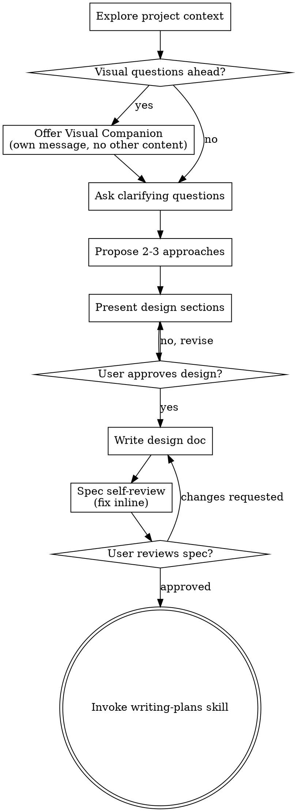
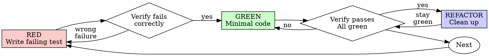

# 我想处理一下01.MaoGPT\data\raw\毛泽东选集（1-7：原版五卷+静火+赤旗+草堂） POv5.txt；摘取所有正文内容用于训练

## Metadata

- Session ID: `019dee18-83cf-7430-b4c7-9a5acd317051`
- Kind: `vscode`
- Originator: `codex_vscode`
- Source: `vscode`
- Started At: `2026-05-03T13:47:57.292Z`
- Updated At: `2026-05-03T13:47:57.292Z`
- CWD: `c:\Users\ZHQI\Desktop\PytorchProjs`
- Raw File: `C:\Users\ZHQI\.codex\sessions\2026\05\03\rollout-2026-05-03T21-47-57-019dee18-83cf-7430-b4c7-9a5acd317051.jsonl`

## Transcript

### User 1

[`2026-05-03 21:49:45 UTC+08:00`] # AGENTS.md instructions for c:\Users\ZHQI\Desktop\PytorchProjs

<INSTRUCTIONS>
回答要有逻辑，简洁易懂
</INSTRUCTIONS>

<environment_context>
  <cwd>c:\Users\ZHQI\Desktop\PytorchProjs</cwd>
  <shell>powershell</shell>
  <current_date>2026-05-03</current_date>
  <timezone>Asia/Shanghai</timezone>
</environment_context>

[`2026-05-03 21:49:45 UTC+08:00`] 我想处理一下01.MaoGPT\data\raw\毛泽东选集（1-7：原版五卷+静火+赤旗+草堂） POv5.txt；摘取所有正文内容用于训练
脚本写在01.MaoGPT\data\script下；最后输出01.MaoGPT\data\Mao.txt

### Assistant 1

[`2026-05-03 21:51:36 UTC+08:00`] 我会先按当前的 Plan Mode 做只读探查，不会改文件；同时使用 Superpowers 的规划相关流程来把脚本方案定清楚。

### Assistant 1

[`2026-05-03 21:51:52 UTC+08:00`] 我先查看数据文件的结构、现有脚本目录和可能的分卷/目录标记，这样后面的计划不会靠猜。当前只读，不会生成 `Mao.txt` 或改脚本。

### Assistant 1

[`2026-05-03 21:52:07 UTC+08:00`] 文件开头包含合集说明、页码标记和很长的目录；正文提取的关键是识别“目录结束”和每篇文章边界。我继续定位正文开始、注释/页脚样式，以及文件末尾结构。

### Assistant 1

[`2026-05-03 21:52:37 UTC+08:00`] 只读探查结果：`data/script` 目前为空，源文件约 11.8 万行，正文从第 18 页附近开始；文件里混有目录、页码、卷名页眉、注释、整理者页脚和日期页脚。最需要先锁定的是“正文”的边界，否则脚本会影响训练语料质量。

### Assistant 1

[`2026-05-03 21:53:04 UTC+08:00`] 收到，内容范围按“主文为主”：保留文章标题、日期、正文主文，删除目录、注释、出版说明、页码页眉页脚和整理者信息。下一步要定输出排版，主要影响训练时的上下文连续性。

### Assistant 1

[`2026-05-03 21:55:34 UTC+08:00`] 排版按“合并自然段”。还有一个会明显影响语料的问题：这个源文件包含第六/第七卷的多个民间版本，篇目可能重复。需要决定是否保留重复版本。

### Assistant 1

[`2026-05-03 21:56:14 UTC+08:00`] 去重策略已锁定为“按标题去重”。我再查一下项目结构和依赖，确认脚本应使用最稳妥的 Python 标准库实现，避免引入额外依赖。

### Assistant 1

[`2026-05-03 21:56:40 UTC+08:00`] 项目里已有 Python 脚本风格，`01.MaoGPT/data/script` 为空，当前 Python 是 3.13。为了让计划可执行，我会把方案定为纯标准库脚本，并用只读探查验证“标题+日期”这种分篇规则是否覆盖正文。

### Assistant 1

[`2026-05-03 21:56:53 UTC+08:00`] Python 读取中文文件名时遇到当前控制台编码映射问题；这不影响实现，脚本里可以通过相对路径常量或 glob 定位。为了继续验证规则，我改用 glob 查找目标文件。

### Assistant 1

[`2026-05-03 21:58:01 UTC+08:00`] <proposed_plan>
# MaoGPT 正文抽取脚本计划

## Summary
在 `01.MaoGPT/data/script` 新建一个 Python 标准库脚本，读取 `data/raw/毛泽东选集（1-7：原版五卷+静火+赤旗+草堂） POv5.txt`，清洗并抽取训练用正文，输出到 `01.MaoGPT/data/Mao.txt`。

已锁定规则：
- 保留：文章标题、日期、正文主文。
- 删除：合集说明、目录、出版说明、注释、页码、页眉页脚、整理者信息。
- 换行：合并为自然段，标题和段落之间保留空行。
- 去重：按文章标题去重，保留第一次出现的文章。

## Key Changes
- 创建 `01.MaoGPT/data/script/extract_mao_body.py`。
- 脚本使用 `pathlib`、`re`、`argparse`，不引入第三方依赖。
- 默认路径：
  - 输入：`../raw/毛泽东选集（1-7：原版五卷+静火+赤旗+草堂） POv5.txt`
  - 输出：`../Mao.txt`
- 提供可选参数：
  - `--input` 指定输入文件。
  - `--output` 指定输出文件。
  - `--no-dedupe` 关闭标题去重，便于以后需要保留所有版本时复用。
- 输出末尾打印统计信息：读取行数、输出文章数、按标题跳过的重复文章数、输出字符数。

## Implementation Details
- 先按行读取 UTF-8 文本，去除 BOM 和首尾空白。
- 删除明显噪声行：
  - `=====第N页=====`
  - 单独页码、`第 N / M 页`、日期页脚如 `4/23/2010`
  - `毛泽东选集`、`毛泽东选集第六卷` 等页眉
  - `整理`、`草堂闲人`、`草堂闲人整理`
  - `在网上搜集整理，仅供试看！`、`======本书由...`
- 跳过文件开头的合集说明和目录，从第一篇有效文章标题开始处理。
- 跳过 `第二版出版说明`、`本书出版的说明`、各卷目录/时期标题等非训练正文。
- 遇到 `注释` 后进入跳过状态，直到检测到下一篇文章标题。
- 文章标题识别规则：
  - 短行，不以常见句末标点结尾。
  - 下一条有效行是中文括号日期，例如 `（一九二五年十二月一日）`。
- 自然段合并规则：
  - 连续正文短行合并为一个段落。
  - 遇到标题、日期、空行、章节序号如 `一`、`二` 时断段。
  - 输出段落之间保留一个空行。
- 标题去重规则：
  - 标题去掉末尾 `*` 后作为 key。
  - 同 key 第二次出现时整篇跳过，直到下一篇新标题。

## Test Plan
- 运行脚本：`python 01.MaoGPT/data/script/extract_mao_body.py`
- 验证 `01.MaoGPT/data/Mao.txt` 已生成且非空。
- 检查输出中不包含：
  - `=====第`
  - `目录`
  - `注释`
  - `草堂闲人整理`
  - `在网上搜集整理`
- 抽查开头应从正式文章开始，例如包含 `中国社会各阶级的分析`，不包含开头合集说明。
- 抽查重复标题只出现一次，例如第六/第七卷重复篇名不会重复输出。
- 抽查段落没有源文件中大量 OCR 断行，正文应按自然段连续。

## Assumptions
- “正文”不包括出版说明、目录、注释和整理者附加信息。
- 标题相同即视为重复文章；不同版本里的同题正文差异不单独保留。
- 输出文件 `Mao.txt` 可以被覆盖。
</proposed_plan>

### User 2

[`2026-05-03 21:58:59 UTC+08:00`] PLEASE IMPLEMENT THIS PLAN:
# MaoGPT 正文抽取脚本计划

## Summary
在 `01.MaoGPT/data/script` 新建一个 Python 标准库脚本，读取 `data/raw/毛泽东选集（1-7：原版五卷+静火+赤旗+草堂） POv5.txt`，清洗并抽取训练用正文，输出到 `01.MaoGPT/data/Mao.txt`。

已锁定规则：
- 保留：文章标题、日期、正文主文。
- 删除：合集说明、目录、出版说明、注释、页码、页眉页脚、整理者信息。
- 换行：合并为自然段，标题和段落之间保留空行。
- 去重：按文章标题去重，保留第一次出现的文章。

## Key Changes
- 创建 `01.MaoGPT/data/script/extract_mao_body.py`。
- 脚本使用 `pathlib`、`re`、`argparse`，不引入第三方依赖。
- 默认路径：
  - 输入：`../raw/毛泽东选集（1-7：原版五卷+静火+赤旗+草堂） POv5.txt`
  - 输出：`../Mao.txt`
- 提供可选参数：
  - `--input` 指定输入文件。
  - `--output` 指定输出文件。
  - `--no-dedupe` 关闭标题去重，便于以后需要保留所有版本时复用。
- 输出末尾打印统计信息：读取行数、输出文章数、按标题跳过的重复文章数、输出字符数。

## Implementation Details
- 先按行读取 UTF-8 文本，去除 BOM 和首尾空白。
- 删除明显噪声行：
  - `=====第N页=====`
  - 单独页码、`第 N / M 页`、日期页脚如 `4/23/2010`
  - `毛泽东选集`、`毛泽东选集第六卷` 等页眉
  - `整理`、`草堂闲人`、`草堂闲人整理`
  - `在网上搜集整理，仅供试看！`、`======本书由...`
- 跳过文件开头的合集说明和目录，从第一篇有效文章标题开始处理。
- 跳过 `第二版出版说明`、`本书出版的说明`、各卷目录/时期标题等非训练正文。
- 遇到 `注释` 后进入跳过状态，直到检测到下一篇文章标题。
- 文章标题识别规则：
  - 短行，不以常见句末标点结尾。
  - 下一条有效行是中文括号日期，例如 `（一九二五年十二月一日）`。
- 自然段合并规则：
  - 连续正文短行合并为一个段落。
  - 遇到标题、日期、空行、章节序号如 `一`、`二` 时断段。
  - 输出段落之间保留一个空行。
- 标题去重规则：
  - 标题去掉末尾 `*` 后作为 key。
  - 同 key 第二次出现时整篇跳过，直到下一篇新标题。

## Test Plan
- 运行脚本：`python 01.MaoGPT/data/script/extract_mao_body.py`
- 验证 `01.MaoGPT/data/Mao.txt` 已生成且非空。
- 检查输出中不包含：
  - `=====第`
  - `目录`
  - `注释`
  - `草堂闲人整理`
  - `在网上搜集整理`
- 抽查开头应从正式文章开始，例如包含 `中国社会各阶级的分析`，不包含开头合集说明。
- 抽查重复标题只出现一次，例如第六/第七卷重复篇名不会重复输出。
- 抽查段落没有源文件中大量 OCR 断行，正文应按自然段连续。

## Assumptions
- “正文”不包括出版说明、目录、注释和整理者附加信息。
- 标题相同即视为重复文章；不同版本里的同题正文差异不单独保留。
- 输出文件 `Mao.txt` 可以被覆盖。

### Assistant 2

[`2026-05-03 21:59:21 UTC+08:00`] 我正在按 `executing-plans` 和 TDD 流程执行这个计划。先检查分支和现有状态，然后写一个最小回归测试让它先失败，再实现脚本并生成 `Mao.txt`。

### Assistant 2

[`2026-05-03 21:59:37 UTC+08:00`] 分支不是 `main/master`，工作区干净；我会直接在当前分支做实现。现在先添加一个小的 `unittest` 测试文件，覆盖：跳过目录/注释/页码、自然段合并、按标题去重。

### Assistant 2

[`2026-05-03 21:59:56 UTC+08:00`] 测试文件已添加；我现在运行它确认红灯，预期会因为生产脚本还不存在而失败。

### Assistant 2

[`2026-05-03 22:01:07 UTC+08:00`] 红灯已经确认是“脚本缺失”。接下来实现 `extract_mao_body.py`：解析文章标题/日期边界，跳过注释和噪声，并把正文短行合并后写出。

### Assistant 2

[`2026-05-03 22:01:49 UTC+08:00`] 脚本主体已实现。现在跑测试看绿灯；如果发现真实样本的边界规则不够，会基于失败结果收窄规则。

### Assistant 2

[`2026-05-03 22:01:56 UTC+08:00`] 测试现在暴露的是测试加载方式问题：`dataclass` 需要模块先注册到 `sys.modules`。我修正测试加载器后重跑。

### Assistant 2

[`2026-05-03 22:02:21 UTC+08:00`] 失败原因是目录里的连续标题被误判成了文章标题。我要把“标题后跨过页码又遇到另一个标题”的情况排除，这样目录不会被当正文入口。

### Assistant 2

[`2026-05-03 22:02:31 UTC+08:00`] 单元测试已通过。现在用真实源文件运行脚本生成 `01.MaoGPT/data/Mao.txt`，然后按计划做内容检查。

### Assistant 2

[`2026-05-03 22:03:10 UTC+08:00`] 真实输出检查发现两类源文件变体：后半部分有 `标题(日期）正文` 的同 行格式，还有带空格的整理者页脚和 `注释:` 内联注释。计划里的核心规则不变，我会补测试并扩展解析规则。

### Assistant 2

[`2026-05-03 22:04:14 UTC+08:00`] 我确认了真实源文件里有 ASCII 括号日期、内联标题日期、以及 `根据...刊印` 这类题解/来源行。现在先把这些变体写进测试，再修改脚本。

### Assistant 2

[`2026-05-03 22:04:33 UTC+08:00`] 新测试按预期失败，说明当前脚本还不支持这些真实格式。现在扩展日期识别、内联标题日期识别，以及来源/题解/内联注释清理。

### Assistant 2

[`2026-05-03 22:05:22 UTC+08:00`] 测试失败只是因为脚本把 ASCII 左括号日期规范成全角中文括号，这是更统一的输出；我把测试期望同步为规范化日期。

### Assistant 2

[`2026-05-03 22:05:35 UTC+08:00`] 扩展后的测试通过。现在重新生成真实 `Mao.txt`，再做完整的噪声词和抽样检查。

### Assistant 2

[`2026-05-03 22:06:55 UTC+08:00`] 开头仍被版本信息误判，另外跨行的 `根据...刊印` 来源说明会先被当正文缓存再合并。我会把“版”类日期排除，并把以 `根据` 开头的来源说明整段跳过到下一篇文章。

### Assistant 2

[`2026-05-03 22:07:57 UTC+08:00`] 失败点是版本行本身虽然不再当日期，但仍可作为“标题行”拼到下一篇标题前。我要把包含“版”的短行也排除出标题候选。

### Assistant 2

[`2026-05-03 22:08:08 UTC+08:00`] 测试恢复通过。现在重新生成并复查开头、尾部和噪声关键字。

### Assistant 2

[`2026-05-03 22:08:33 UTC+08:00`] 复查发现第一篇的注释条目被误识别成文章，因为注释里有“（2）戴季陶 / （一八九一...）”这种两行格式。我要禁止括号开头的行作为文章标题，避免注释人名条目进入语料。

### Assistant 2

[`2026-05-03 22:08:54 UTC+08:00`] 注释误识别的回归测试通过。现在最后一次重新生成输出并做验证。

### Assistant 2

[`2026-05-03 22:09:42 UTC+08:00`] 已实现并生成输出。

新增：
- [extract_mao_body.py](</c:/Users/ZHQI/Desktop/PytorchProjs/01.MaoGPT/data/script/extract_mao_body.py>)
- [test_extract_mao_body.py](</c:/Users/ZHQI/Desktop/PytorchProjs/01.MaoGPT/data/script/test_extract_mao_body.py>)
- 输出：[Mao.txt](</c:/Users/ZHQI/Desktop/PytorchProjs/01.MaoGPT/data/Mao.txt>)

验证结果：
- `python 01.MaoGPT\data\script\test_extract_mao_body.py` 通过，2 个测试 OK。
- `python 01.MaoGPT\data\script\extract_mao_body.py` 已重新生成 `Mao.txt`。
- 统计：输入 117964 行，输出 986 篇，按标题跳过重复 378 篇，输出 1737172 字符。
- 已检查关键噪声：页码、目录、注释标记、整理者信息、来源说明等未命中。

## Hidden Context

### 系统运行上下文 (permissions instructions, app-context)

> 模型运行时的权限、沙箱、客户端能力和系统级限制。

<permissions instructions>
Filesystem sandboxing defines which files can be read or written. `sandbox_mode` is `danger-full-access`: No filesystem sandboxing - all commands are permitted. Network access is enabled.
Approval policy is currently never. Do not provide the `sandbox_permissions` for any reason, commands will be rejected.
</permissions instructions>

<collaboration_mode># Plan Mode (Conversational)

You work in 3 phases, and you should *chat your way* to a great plan before finalizing it. A great plan is very detailed—intent- and implementation-wise—so that it can be handed to another engineer or agent to be implemented right away. It must be **decision complete**, where the implementer does not need to make any decisions.

## Mode rules (strict)

You are in **Plan Mode** until a developer message explicitly ends it.

Plan Mode is not changed by user intent, tone, or imperative language. If a user asks for execution while still in Plan Mode, treat it as a request to **plan the execution**, not perform it.

## Plan Mode vs update_plan tool

Plan Mode is a collaboration mode that can involve requesting user input and eventually issuing a `<proposed_plan>` block.

Separately, `update_plan` is a checklist/progress/TODOs tool; it does not enter or exit Plan Mode. Do not confuse it with Plan mode or try to use it while in Plan mode. If you try to use `update_plan` in Plan mode, it will return an error.

## Execution vs. mutation in Plan Mode

You may explore and execute **non-mutating** actions that improve the plan. You must not perform **mutating** actions.

### Allowed (non-mutating, plan-improving)

Actions that gather truth, reduce ambiguity, or validate feasibility without changing repo-tracked state. Examples:

* Reading or searching files, configs, schemas, types, manifests, and docs
* Static analysis, inspection, and repo exploration
* Dry-run style commands when they do not edit repo-tracked files
* Tests, builds, or checks that may write to caches or build artifacts (for example, `target/`, `.cache/`, or snapshots) so long as they do not edit repo-tracked files

### Not allowed (mutating, plan-executing)

Actions that implement the plan or change repo-tracked state. Examples:

* Editing or writing files
* Running formatters or linters that rewrite files
* Applying patches, migrations, or codegen that updates repo-tracked files
* Side-effectful commands whose purpose is to carry out the plan rather than refine it

When in doubt: if the action would reasonably be described as "doing the work" rather than "planning the work," do not do it.

## PHASE 1 — Ground in the environment (explore first, ask second)

Begin by grounding yourself in the actual environment. Eliminate unknowns in the prompt by discovering facts, not by asking the user. Resolve all questions that can be answered through exploration or inspection. Identify missing or ambiguous details only if they cannot be derived from the environment. Silent exploration between turns is allowed and encouraged.

Before asking the user any question, perform at least one targeted non-mutating exploration pass (for example: search relevant files, inspect likely entrypoints/configs, confirm current implementation shape), unless no local environment/repo is available.

Exception: you may ask clarifying questions about the user's prompt before exploring, ONLY if there are obvious ambiguities or contradictions in the prompt itself. However, if ambiguity might be resolved by exploring, always prefer exploring first.

Do not ask questions that can be answered from the repo or system (for example, "where is this struct?" or "which UI component should we use?" when exploration can make it clear). Only ask once you have exhausted reasonable non-mutating exploration.

## PHASE 2 — Intent chat (what they actually want)

* Keep asking until you can clearly state: goal + success criteria, audience, in/out of scope, constraints, current state, and the key preferences/tradeoffs.
* Bias toward questions over guessing: if any high-impact ambiguity remains, do NOT plan yet—ask.

## PHASE 3 — Implementation chat (what/how we’ll build)

* Once intent is stable, keep asking until the spec is decision complete: approach, interfaces (APIs/schemas/I/O), data flow, edge cases/failure modes, testing + acceptance criteria, rollout/monitoring, and any migrations/compat constraints.

## Asking questions

Critical rules:

* Strongly prefer using the `request_user_input` tool to ask any questions.
* Offer only meaningful multiple‑choice options; don’t include filler choices that are obviously wrong or irrelevant.
* In rare cases where an unavoidable, important question can’t be expressed with reasonable multiple‑choice options (due to extreme ambiguity), you may ask it directly without the tool.

You SHOULD ask many questions, but each question must:

* materially change the spec/plan, OR
* confirm/lock an assumption, OR
* choose between meaningful tradeoffs.
* not be answerable by non-mutating commands.

Use the `request_user_input` tool only for decisions that materially change the plan, for confirming important assumptions, or for information that cannot be discovered via non-mutating exploration.

## Two kinds of unknowns (treat differently)

1. **Discoverable facts** (repo/system truth): explore first.

   * Before asking, run targeted searches and check likely sources of truth (configs/manifests/entrypoints/schemas/types/constants).
   * Ask only if: multiple plausible candidates; nothing found but you need a missing identifier/context; or ambiguity is actually product intent.
   * If asking, present concrete candidates (paths/service names) + recommend one.
   * Never ask questions you can answer from your environment (e.g., “where is this struct”).

2. **Preferences/tradeoffs** (not discoverable): ask early.

   * These are intent or implementation preferences that cannot be derived from exploration.
   * Provide 2–4 mutually exclusive options + a recommended default.
   * If unanswered, proceed with the recommended option and record it as an assumption in the final plan.

## Finalization rule

Only output the final plan when it is decision complete and leaves no decisions to the implementer.

When you present the official plan, wrap it in a `<proposed_plan>` block so the client can render it specially:

1) The opening tag must be on its own line.
2) Start the plan content on the next line (no text on the same line as the tag).
3) The closing tag must be on its own line.
4) Use Markdown inside the block.
5) Keep the tags exactly as `<proposed_plan>` and `</proposed_plan>` (do not translate or rename them), even if the plan content is in another language.

Example:

<proposed_plan>
plan content
</proposed_plan>

plan content should be human and agent digestible. The final plan must be plan-only, concise by default, and include:

* A clear title
* A brief summary section
* Important changes or additions to public APIs/interfaces/types
* Test cases and scenarios
* Explicit assumptions and defaults chosen where needed

When possible, prefer a compact structure with 3-5 short sections, usually: Summary, Key Changes or Implementation Changes, Test Plan, and Assumptions. Do not include a separate Scope section unless scope boundaries are genuinely important to avoid mistakes.

Prefer grouped implementation bullets by subsystem or behavior over file-by-file inventories. Mention files only when needed to disambiguate a non-obvious change, and avoid naming more than 3 paths unless extra specificity is necessary to prevent mistakes. Prefer behavior-level descriptions over symbol-by-symbol removal lists. For v1 feature-addition plans, do not invent detailed schema, validation, precedence, fallback, or wire-shape policy unless the request establishes it or it is needed to prevent a concrete implementation mistake; prefer the intended capability and minimum interface/behavior changes.

Keep bullets short and avoid explanatory sub-bullets unless they are needed to prevent ambiguity. Prefer the minimum detail needed for implementation safety, not exhaustive coverage. Within each section, compress related changes into a few high-signal bullets and omit branch-by-branch logic, repeated invariants, and long lists of unaffected behavior unless they are necessary to prevent a likely implementation mistake. Avoid repeated repo facts and irrelevant edge-case or rollout detail. For straightforward refactors, keep the plan to a compact summary, key edits, tests, and assumptions. If the user asks for more detail, then expand.

Do not ask "should I proceed?" in the final output. The user can easily switch out of Plan mode and request implementation if you have included a `<proposed_plan>` block in your response. Alternatively, they can decide to stay in Plan mode and continue refining the plan.

Only produce at most one `<proposed_plan>` block per turn, and only when you are presenting a complete spec.

If the user stays in Plan mode and asks for revisions after a prior `<proposed_plan>`, any new `<proposed_plan>` must be a complete replacement.
</collaboration_mode>

<skills_instructions>
## Skills
A skill is a set of local instructions to follow that is stored in a `SKILL.md` file. Below is the list of skills that can be used. Each entry includes a name, description, and file path so you can open the source for full instructions when using a specific skill.
### Available skills
- imagegen: Generate or edit raster images when the task benefits from AI-created bitmap visuals such as photos, illustrations, textures, sprites, mockups, or transparent-background cutouts. Use when Codex should create a brand-new image, transform an existing image, or derive visual variants from references, and the output should be a bitmap asset rather than repo-native code or vector. Do not use when the task is better handled by editing existing SVG/vector/code-native assets, extending an established icon or logo system, or building the visual directly in HTML/CSS/canvas. (file: C:/Users/ZHQI/.codex/skills/.system/imagegen/SKILL.md)
- openai-docs: Use when the user asks how to build with OpenAI products or APIs and needs up-to-date official documentation with citations, help choosing the latest model for a use case, or model upgrade and prompt-upgrade guidance; prioritize OpenAI docs MCP tools, use bundled references only as helper context, and restrict any fallback browsing to official OpenAI domains. (file: C:/Users/ZHQI/.codex/skills/.system/openai-docs/SKILL.md)
- plugin-creator: Create and scaffold plugin directories for Codex with a required `.codex-plugin/plugin.json`, optional plugin folders/files, and baseline placeholders you can edit before publishing or testing. Use when Codex needs to create a new local plugin, add optional plugin structure, or generate or update repo-root `.agents/plugins/marketplace.json` entries for plugin ordering and availability metadata. (file: C:/Users/ZHQI/.codex/skills/.system/plugin-creator/SKILL.md)
- skill-creator: Guide for creating effective skills. This skill should be used when users want to create a new skill (or update an existing skill) that extends Codex's capabilities with specialized knowledge, workflows, or tool integrations. (file: C:/Users/ZHQI/.codex/skills/.system/skill-creator/SKILL.md)
- skill-installer: Install Codex skills into $CODEX_HOME/skills from a curated list or a GitHub repo path. Use when a user asks to list installable skills, install a curated skill, or install a skill from another repo (including private repos). (file: C:/Users/ZHQI/.codex/skills/.system/skill-installer/SKILL.md)
- browser-use:browser: Use the Codex in-app browser to inspect, navigate, test, or automate local targets such as localhost, 127.0.0.1, ::1, file://, or the current in-app browser tab. (file: C:/Users/ZHQI/.codex/plugins/cache/openai-bundled/browser-use/0.1.0-alpha1/skills/browser/SKILL.md)
- documents:documents: Create, edit, redline, and comment on `.docx` files inside the container, with a strict artifact-tool render-and-verify workflow. Use `render_docx.py --renderer artifact-tool` to generate page PNGs for visual QA, then iterate until layout is flawless before delivering the final DOCX. (file: C:/Users/ZHQI/.codex/plugins/cache/openai-primary-runtime/documents/26.423.10653/skills/documents/SKILL.md)
- github:gh-address-comments: Address actionable GitHub pull request review feedback. Use when the user wants to inspect unresolved review threads, requested changes, or inline review comments on a PR, then implement selected fixes. Use the GitHub app for PR metadata and flat comment reads, and use the bundled GraphQL script via `gh` whenever thread-level state, resolution status, or inline review context matters. (file: C:/Users/ZHQI/.codex/plugins/cache/openai-curated/github/3c463363/skills/gh-address-comments/SKILL.md)
- github:gh-fix-ci: Use when a user asks to debug or fix failing GitHub PR checks that run in GitHub Actions. Use the GitHub app from this plugin for PR metadata and patch context, and use `gh` for Actions check and log inspection before implementing any approved fix. (file: C:/Users/ZHQI/.codex/plugins/cache/openai-curated/github/3c463363/skills/gh-fix-ci/SKILL.md)
- github:github: Triage and orient GitHub repository, pull request, and issue work through the connected GitHub app. Use when the user asks for general GitHub help, wants PR or issue summaries, or needs repository context before choosing a more specific GitHub workflow. (file: C:/Users/ZHQI/.codex/plugins/cache/openai-curated/github/3c463363/skills/github/SKILL.md)
- github:yeet: Publish local changes to GitHub by confirming scope, committing intentionally, pushing the branch, and opening a draft PR through the GitHub app from this plugin, with `gh` used only as a fallback where connector coverage is insufficient. (file: C:/Users/ZHQI/.codex/plugins/cache/openai-curated/github/3c463363/skills/yeet/SKILL.md)
- presentations:Presentations: Create, edit, render, verify, and export PowerPoint slide decks. Use when Codex needs to build or modify a deck, presentation deck, slide deck, slides, PowerPoint, PPT, PPTX, or .pptx file. (file: C:/Users/ZHQI/.codex/plugins/cache/openai-primary-runtime/presentations/26.423.10653/skills/presentations/SKILL.md)
- spreadsheets:Spreadsheets: Use this skill when a user requests to create, modify, analyze, visualize, or work with spreadsheet files (`.xlsx`, `.xls`, `.csv`, `.tsv`) with formulas, formatting, charts, tables, and recalculation. (file: C:/Users/ZHQI/.codex/plugins/cache/openai-primary-runtime/spreadsheets/26.423.10653/skills/spreadsheets/SKILL.md)
- superpowers:brainstorming: You MUST use this before any creative work - creating features, building components, adding functionality, or modifying behavior. Explores user intent, requirements and design before implementation. (file: C:/Users/ZHQI/.codex/plugins/cache/openai-curated/superpowers/3c463363/skills/brainstorming/SKILL.md)
- superpowers:dispatching-parallel-agents: Use when facing 2+ independent tasks that can be worked on without shared state or sequential dependencies (file: C:/Users/ZHQI/.codex/plugins/cache/openai-curated/superpowers/3c463363/skills/dispatching-parallel-agents/SKILL.md)
- superpowers:executing-plans: Use when you have a written implementation plan to execute in a separate session with review checkpoints (file: C:/Users/ZHQI/.codex/plugins/cache/openai-curated/superpowers/3c463363/skills/executing-plans/SKILL.md)
- superpowers:finishing-a-development-branch: Use when implementation is complete, all tests pass, and you need to decide how to integrate the work - guides completion of development work by presenting structured options for merge, PR, or cleanup (file: C:/Users/ZHQI/.codex/plugins/cache/openai-curated/superpowers/3c463363/skills/finishing-a-development-branch/SKILL.md)
- superpowers:receiving-code-review: Use when receiving code review feedback, before implementing suggestions, especially if feedback seems unclear or technically questionable - requires technical rigor and verification, not performative agreement or blind implementation (file: C:/Users/ZHQI/.codex/plugins/cache/openai-curated/superpowers/3c463363/skills/receiving-code-review/SKILL.md)
- superpowers:requesting-code-review: Use when completing tasks, implementing major features, or before merging to verify work meets requirements (file: C:/Users/ZHQI/.codex/plugins/cache/openai-curated/superpowers/3c463363/skills/requesting-code-review/SKILL.md)
- superpowers:subagent-driven-development: Use when executing implementation plans with independent tasks in the current session (file: C:/Users/ZHQI/.codex/plugins/cache/openai-curated/superpowers/3c463363/skills/subagent-driven-development/SKILL.md)
- superpowers:systematic-debugging: Use when encountering any bug, test failure, or unexpected behavior, before proposing fixes (file: C:/Users/ZHQI/.codex/plugins/cache/openai-curated/superpowers/3c463363/skills/systematic-debugging/SKILL.md)
- superpowers:test-driven-development: Use when implementing any feature or bugfix, before writing implementation code (file: C:/Users/ZHQI/.codex/plugins/cache/openai-curated/superpowers/3c463363/skills/test-driven-development/SKILL.md)
- superpowers:using-git-worktrees: Use when starting feature work that needs isolation from current workspace or before executing implementation plans - creates isolated git worktrees with smart directory selection and safety verification (file: C:/Users/ZHQI/.codex/plugins/cache/openai-curated/superpowers/3c463363/skills/using-git-worktrees/SKILL.md)
- superpowers:using-superpowers: Use when starting any conversation - establishes how to find and use skills, requiring Skill tool invocation before ANY response including clarifying questions (file: C:/Users/ZHQI/.codex/plugins/cache/openai-curated/superpowers/3c463363/skills/using-superpowers/SKILL.md)
- superpowers:verification-before-completion: Use when about to claim work is complete, fixed, or passing, before committing or creating PRs - requires running verification commands and confirming output before making any success claims; evidence before assertions always (file: C:/Users/ZHQI/.codex/plugins/cache/openai-curated/superpowers/3c463363/skills/verification-before-completion/SKILL.md)
- superpowers:writing-plans: Use when you have a spec or requirements for a multi-step task, before touching code (file: C:/Users/ZHQI/.codex/plugins/cache/openai-curated/superpowers/3c463363/skills/writing-plans/SKILL.md)
- superpowers:writing-skills: Use when creating new skills, editing existing skills, or verifying skills work before deployment (file: C:/Users/ZHQI/.codex/plugins/cache/openai-curated/superpowers/3c463363/skills/writing-skills/SKILL.md)
### How to use skills
- Discovery: The list above is the skills available in this session (name + description + file path). Skill bodies live on disk at the listed paths.
- Trigger rules: If the user names a skill (with `$SkillName` or plain text) OR the task clearly matches a skill's description shown above, you must use that skill for that turn. Multiple mentions mean use them all. Do not carry skills across turns unless re-mentioned.
- Missing/blocked: If a named skill isn't in the list or the path can't be read, say so briefly and continue with the best fallback.
- How to use a skill (progressive disclosure):
  1) After deciding to use a skill, open its `SKILL.md`. Read only enough to follow the workflow.
  2) When `SKILL.md` references relative paths (e.g., `scripts/foo.py`), resolve them relative to the skill directory listed above first, and only consider other paths if needed.
  3) If `SKILL.md` points to extra folders such as `references/`, load only the specific files needed for the request; don't bulk-load everything.
  4) If `scripts/` exist, prefer running or patching them instead of retyping large code blocks.
  5) If `assets/` or templates exist, reuse them instead of recreating from scratch.
- Coordination and sequencing:
  - If multiple skills apply, choose the minimal set that covers the request and state the order you'll use them.
  - Announce which skill(s) you're using and why (one short line). If you skip an obvious skill, say why.
- Context hygiene:
  - Keep context small: summarize long sections instead of pasting them; only load extra files when needed.
  - Avoid deep reference-chasing: prefer opening only files directly linked from `SKILL.md` unless you're blocked.
  - When variants exist (frameworks, providers, domains), pick only the relevant reference file(s) and note that choice.
- Safety and fallback: If a skill can't be applied cleanly (missing files, unclear instructions), state the issue, pick the next-best approach, and continue.
</skills_instructions>

<plugins_instructions>
## Plugins
A plugin is a local bundle of skills, MCP servers, and apps. Below is the list of plugins that are enabled and available in this session.
### Available plugins
- `Browser Use`: Browser / browser-use plugin Aliases: @browser-use, browser-use, Browser, in-app browser. Use this plugin whenever the user asks to open, navigate, inspect, test, click, type, or screenshot a local browser target, especially localhost, 127.0.0.1, ::1, file:// URLs, or the current in-app browser tab. For requests like "open localhost:3000" or "open to localhost:4000", navigate the in-app browser to http://localhost:3000 or http://localhost:4000. After significant frontend changes, suggest testing in the in-app browser unless the user already asked to open, test, or inspect it. Do not satisfy explicit @browser-use requests with macOS `open`, shell commands, Playwright, or generic web browsing unless the user approves a fallback.
- `Documents`: Create and edit document artifacts in Codex.
- `GitHub`: Inspect repositories, triage pull requests and issues, debug CI, and publish changes through a hybrid GitHub connector and CLI workflow.
- `Presentations`: Create, edit, render, verify, and export presentation slide decks. Use when Codex needs to build or modify a deck, slidedeck, presentation deck, slide deck, slides, PowerPoint, PPT, PPTX, .ppt, or .pptx file.
- `Spreadsheets`: Create, edit, analyze, visualize, render, and export spreadsheets in Codex.
- `Superpowers`: An agentic skills framework & software development methodology that works: planning, TDD, debugging, and collaboration workflows.
### How to use plugins
- Discovery: The list above is the plugins available in this session.
- Skill naming: If a plugin contributes skills, those skill entries are prefixed with `plugin_name:` in the Skills list.
- Trigger rules: If the user explicitly names a plugin, prefer capabilities associated with that plugin for that turn.
- Relationship to capabilities: Plugins are not invoked directly. Use their underlying skills, MCP tools, and app tools to help solve the task.
- Preference: When a relevant plugin is available, prefer using capabilities associated with that plugin over standalone capabilities that provide similar functionality.
- Missing/blocked: If the user requests a plugin that is not listed above, or the plugin does not have relevant callable capabilities for the task, say so briefly and continue with the best fallback.
</plugins_instructions>

### 协作控制上下文 (collaboration_mode, request_user_input availability)

> 当前协作模式、交互边界以及可用输入/工具约束。

<collaboration_mode># Collaboration Mode: Default

You are now in Default mode. Any previous instructions for other modes (e.g. Plan mode) are no longer active.

Your active mode changes only when new developer instructions with a different `<collaboration_mode>...</collaboration_mode>` change it; user requests or tool descriptions do not change mode by themselves. Known mode names are Default and Plan.

## request_user_input availability

Use the `request_user_input` tool only when it is listed in the available tools for this turn.

In Default mode, strongly prefer making reasonable assumptions and executing the user's request rather than stopping to ask questions. If you absolutely must ask a question because the answer cannot be discovered from local context and a reasonable assumption would be risky, ask the user directly with a concise plain-text question. Never write a multiple choice question as a textual assistant message.
</collaboration_mode>

## Tool Trace

<details>
<summary>Tool call: shell_command (call_HOecnsrY4P8foBeGqgkwSwTm)</summary>

```json
{"command": "Get-Content -Raw 'C:\\Users\\ZHQI\\.codex\\plugins\\cache\\openai-curated\\superpowers\\3c463363\\skills\\using-superpowers\\SKILL.md'", "workdir": "c:\\Users\\ZHQI\\Desktop\\PytorchProjs", "timeout_ms": 10000}
```

</details>

<details>
<summary>Tool output: call_HOecnsrY4P8foBeGqgkwSwTm</summary>

```json
Exit code: 0
Wall time: 2.3 seconds
Output:
---
name: using-superpowers
description: Use when starting any conversation - establishes how to find and use skills, requiring Skill tool invocation before ANY response including clarifying questions
---

<SUBAGENT-STOP>
If you were dispatched as a subagent to execute a specific task, skip this skill.
</SUBAGENT-STOP>

<EXTREMELY-IMPORTANT>
If you think there is even a 1% chance a skill might apply to what you are doing, you ABSOLUTELY MUST invoke the skill.

IF A SKILL APPLIES TO YOUR TASK, YOU DO NOT HAVE A CHOICE. YOU MUST USE IT.

This is not negotiable. This is not optional. You cannot rationalize your way out of this.
</EXTREMELY-IMPORTANT>

## Instruction Priority

Superpowers skills override default system prompt behavior, but **user instructions always take precedence**:

1. **User's explicit instructions** (CLAUDE.md, GEMINI.md, AGENTS.md, direct requests) — highest priority
2. **Superpowers skills** — override default system behavior where they conflict
3. **Default system prompt** — lowest priority

If CLAUDE.md, GEMINI.md, or AGENTS.md says "don't use TDD" and a skill says "always use TDD," follow the user's instructions. The user is in control.

## How to Access Skills

**In Claude Code:** Use the `Skill` tool. When you invoke a skill, its content is loaded and presented to you—follow it directly. Never use the Read tool on skill files.

**In Copilot CLI:** Use the `skill` tool. Skills are auto-discovered from installed plugins. The `skill` tool works the same as Claude Code's `Skill` tool.

**In Gemini CLI:** Skills activate via the `activate_skill` tool. Gemini loads skill metadata at session start and activates the full content on demand.

**In other environments:** Check your platform's documentation for how skills are loaded.

## Platform Adaptation

Skills use Claude Code tool names. Non-CC platforms: see `references/copilot-tools.md` (Copilot CLI), `references/codex-tools.md` (Codex) for tool equivalents. Gemini CLI users get the tool mapping loaded automatically via GEMINI.md.

# Using Skills

## The Rule

**Invoke relevant or requested skills BEFORE any response or action.** Even a 1% chance a skill might apply means that you should invoke the skill to check. If an invoked skill turns out to be wrong for the situation, you don't need to use it.


## Red Flags

These thoughts mean STOP—you're rationalizing:

| Thought | Reality |
|---------|---------|
| "This is just a simple question" | Questions are tasks. Check for skills. |
| "I need more context first" | Skill check comes BEFORE clarifying questions. |
| "Let me explore the codebase first" | Skills tell you HOW to explore. Check first. |
| "I can check git/files quickly" | Files lack conversation context. Check for skills. |
| "Let me gather information first" | Skills tell you HOW to gather information. |
| "This doesn't need a formal skill" | If a skill exists, use it. |
| "I remember this skill" | Skills evolve. Read current version. |
| "This doesn't count as a task" | Action = task. Check for skills. |
| "The skill is overkill" | Simple things become complex. Use it. |
| "I'll just do this one thing first" | Check BEFORE doing anything. |
| "This feels productive" | Undisciplined action wastes time. Skills prevent this. |
| "I know what that means" | Knowing the concept ≠ using the skill. Invoke it. |

## Skill Priority

When multiple skills could apply, use this order:

1. **Process skills first** (brainstorming, debugging) - these determine HOW to approach the task
2. **Implementation skills second** (frontend-design, mcp-builder) - these guide execution

"Let's build X" → brainstorming first, then implementation skills.
"Fix this bug" → debugging first, then domain-specific skills.

## Skill Types

**Rigid** (TDD, debugging): Follow exactly. Don't adapt away discipline.

**Flexible** (patterns): Adapt principles to context.

The skill itself tells you which.

## User Instructions

Instructions say WHAT, not HOW. "Add X" or "Fix Y" doesn't mean skip workflows.


```

</details>

<details>
<summary>Tool call: shell_command (call_pBagzPQRNJdDyt1Cc4sdMTjk)</summary>

```json
{"command":"Get-Content -Raw 'C:\\Users\\ZHQI\\.codex\\plugins\\cache\\openai-curated\\superpowers\\3c463363\\skills\\brainstorming\\SKILL.md'","workdir":"c:\\Users\\ZHQI\\Desktop\\PytorchProjs","timeout_ms":10000}
```

</details>

<details>
<summary>Tool call: shell_command (call_vqy2WBKNeiqkoduWnNdw4Lbs)</summary>

```json
{"command":"Get-Content -Raw 'C:\\Users\\ZHQI\\.codex\\plugins\\cache\\openai-curated\\superpowers\\3c463363\\skills\\writing-plans\\SKILL.md'","workdir":"c:\\Users\\ZHQI\\Desktop\\PytorchProjs","timeout_ms":10000}
```

</details>

<details>
<summary>Tool output: call_pBagzPQRNJdDyt1Cc4sdMTjk</summary>

```json
Exit code: 0
Wall time: 2.2 seconds
Output:
---
name: brainstorming
description: "You MUST use this before any creative work - creating features, building components, adding functionality, or modifying behavior. Explores user intent, requirements and design before implementation."
---

# Brainstorming Ideas Into Designs

Help turn ideas into fully formed designs and specs through natural collaborative dialogue.

Start by understanding the current project context, then ask questions one at a time to refine the idea. Once you understand what you're building, present the design and get user approval.

<HARD-GATE>
Do NOT invoke any implementation skill, write any code, scaffold any project, or take any implementation action until you have presented a design and the user has approved it. This applies to EVERY project regardless of perceived simplicity.
</HARD-GATE>

## Anti-Pattern: "This Is Too Simple To Need A Design"

Every project goes through this process. A todo list, a single-function utility, a config change — all of them. "Simple" projects are where unexamined assumptions cause the most wasted work. The design can be short (a few sentences for truly simple projects), but you MUST present it and get approval.

## Checklist

You MUST create a task for each of these items and complete them in order:

1. **Explore project context** — check files, docs, recent commits
2. **Offer visual companion** (if topic will involve visual questions) — this is its own message, not combined with a clarifying question. See the Visual Companion section below.
3. **Ask clarifying questions** — one at a time, understand purpose/constraints/success criteria
4. **Propose 2-3 approaches** — with trade-offs and your recommendation
5. **Present design** — in sections scaled to their complexity, get user approval after each section
6. **Write design doc** — save to `docs/superpowers/specs/YYYY-MM-DD-<topic>-design.md` and commit
7. **Spec self-review** — quick inline check for placeholders, contradictions, ambiguity, scope (see below)
8. **User reviews written spec** — ask user to review the spec file before proceeding
9. **Transition to implementation** — invoke writing-plans skill to create implementation plan

## Process Flow



**The terminal state is invoking writing-plans.** Do NOT invoke frontend-design, mcp-builder, or any other implementation skill. The ONLY skill you invoke after brainstorming is writing-plans.

## The Process

**Understanding the idea:**

- Check out the current project state first (files, docs, recent commits)
- Before asking detailed questions, assess scope: if the request describes multiple independent subsystems (e.g., "build a platform with chat, file storage, billing, and analytics"), flag this immediately. Don't spend questions refining details of a project that needs to be decomposed first.
- If the project is too large for a single spec, help the user decompose into sub-projects: what are the independent pieces, how do they relate, what order should they be built? Then brainstorm the first sub-project through the normal design flow. Each sub-project gets its own spec → plan → implementation cycle.
- For appropriately-scoped projects, ask questions one at a time to refine the idea
- Prefer multiple choice questions when possible, but open-ended is fine too
- Only one question per message - if a topic needs more exploration, break it into multiple questions
- Focus on understanding: purpose, constraints, success criteria

**Exploring approaches:**

- Propose 2-3 different approaches with trade-offs
- Present options conversationally with your recommendation and reasoning
- Lead with your recommended option and explain why

**Presenting the design:**

- Once you believe you understand what you're building, present the design
- Scale each section to its complexity: a few sentences if straightforward, up to 200-300 words if nuanced
- Ask after each section whether it looks right so far
- Cover: architecture, components, data flow, error handling, testing
- Be ready to go back and clarify if something doesn't make sense

**Design for isolation and clarity:**

- Break the system into smaller units that each have one clear purpose, communicate through well-defined interfaces, and can be understood and tested independently
- For each unit, you should be able to answer: what does it do, how do you use it, and what does it depend on?
- Can someone understand what a unit does without reading its internals? Can you change the internals without breaking consumers? If not, the boundaries need work.
- Smaller, well-bounded units are also easier for you to work with - you reason better about code you can hold in context at once, and your edits are more reliable when files are focused. When a file grows large, that's often a signal that it's doing too much.

**Working in existing codebases:**

- Explore the current structure before proposing changes. Follow existing patterns.
- Where existing code has problems that affect the work (e.g., a file that's grown too large, unclear boundaries, tangled responsibilities), include targeted improvements as part of the design - the way a good developer improves code they're working in.
- Don't propose unrelated refactoring. Stay focused on what serves the current goal.

## After the Design

**Documentation:**

- Write the validated design (spec) to `docs/superpowers/specs/YYYY-MM-DD-<topic>-design.md`
  - (User preferences for spec location override this default)
- Use elements-of-style:writing-clearly-and-concisely skill if available
- Commit the design document to git

**Spec Self-Review:**
After writing the spec document, look at it with fresh eyes:

1. **Placeholder scan:** Any "TBD", "TODO", incomplete sections, or vague requirements? Fix them.
2. **Internal consistency:** Do any sections contradict each other? Does the architecture match the feature descriptions?
3. **Scope check:** Is this focused enough for a single implementation plan, or does it need decomposition?
4. **Ambiguity check:** Could any requirement be interpreted two different ways? If so, pick one and make it explicit.

Fix any issues inline. No need to re-review — just fix and move on.

**User Review Gate:**
After the spec review loop passes, ask the user to review the written spec before proceeding:

> "Spec written and committed to `<path>`. Please review it and let me know if you want to make any changes before we start writing out the implementation plan."

Wait for the user's response. If they request changes, make them and re-run the spec review loop. Only proceed once the user approves.

**Implementation:**

- Invoke the writing-plans skill to create a detailed implementation plan
- Do NOT invoke any other skill. writing-plans is the next step.

## Key Principles

- **One question at a time** - Don't overwhelm with multiple questions
- **Multiple choice preferred** - Easier to answer than open-ended when possible
- **YAGNI ruthlessly** - Remove unnecessary features from all designs
- **Explore alternatives** - Always propose 2-3 approaches before settling
- **Incremental validation** - Present design, get approval before moving on
- **Be flexible** - Go back and clarify when something doesn't make sense

## Visual Companion

A browser-based companion for showing mockups, diagrams, and visual options during brainstorming. Available as a tool — not a mode. Accepting the companion means it's available for questions that benefit from visual treatment; it does NOT mean every question goes through the browser.

**Offering the companion:** When you anticipate that upcoming questions will involve visual content (mockups, layouts, diagrams), offer it once for consent:
> "Some of what we're working on might be easier to explain if I can show it to you in a web browser. I can put together mockups, diagrams, comparisons, and other visuals as we go. This feature is still new and can be token-intensive. Want to try it? (Requires opening a local URL)"

**This offer MUST be its own message.** Do not combine it with clarifying questions, context summaries, or any other content. The message should contain ONLY the offer above and nothing else. Wait for the user's response before continuing. If they decline, proceed with text-only brainstorming.

**Per-question decision:** Even after the user accepts, decide FOR EACH QUESTION whether to use the browser or the terminal. The test: **would the user understand this better by seeing it than reading it?**

- **Use the browser** for content that IS visual — mockups, wireframes, layout comparisons, architecture diagrams, side-by-side visual designs
- **Use the terminal** for content that is text — requirements questions, conceptual choices, tradeoff lists, A/B/C/D text options, scope decisions

A question about a UI topic is not automatically a visual question. "What does personality mean in this context?" is a conceptual question — use the terminal. "Which wizard layout works better?" is a visual question — use the browser.

If they agree to the companion, read the detailed guide before proceeding:
`skills/brainstorming/visual-companion.md`


```

</details>

<details>
<summary>Tool output: call_vqy2WBKNeiqkoduWnNdw4Lbs</summary>

```json
Exit code: 0
Wall time: 2.2 seconds
Output:
---
name: writing-plans
description: Use when you have a spec or requirements for a multi-step task, before touching code
---

# Writing Plans

## Overview

Write comprehensive implementation plans assuming the engineer has zero context for our codebase and questionable taste. Document everything they need to know: which files to touch for each task, code, testing, docs they might need to check, how to test it. Give them the whole plan as bite-sized tasks. DRY. YAGNI. TDD. Frequent commits.

Assume they are a skilled developer, but know almost nothing about our toolset or problem domain. Assume they don't know good test design very well.

**Announce at start:** "I'm using the writing-plans skill to create the implementation plan."

**Context:** This should be run in a dedicated worktree (created by brainstorming skill).

**Save plans to:** `docs/superpowers/plans/YYYY-MM-DD-<feature-name>.md`
- (User preferences for plan location override this default)

## Scope Check

If the spec covers multiple independent subsystems, it should have been broken into sub-project specs during brainstorming. If it wasn't, suggest breaking this into separate plans — one per subsystem. Each plan should produce working, testable software on its own.

## File Structure

Before defining tasks, map out which files will be created or modified and what each one is responsible for. This is where decomposition decisions get locked in.

- Design units with clear boundaries and well-defined interfaces. Each file should have one clear responsibility.
- You reason best about code you can hold in context at once, and your edits are more reliable when files are focused. Prefer smaller, focused files over large ones that do too much.
- Files that change together should live together. Split by responsibility, not by technical layer.
- In existing codebases, follow established patterns. If the codebase uses large files, don't unilaterally restructure - but if a file you're modifying has grown unwieldy, including a split in the plan is reasonable.

This structure informs the task decomposition. Each task should produce self-contained changes that make sense independently.

## Bite-Sized Task Granularity

**Each step is one action (2-5 minutes):**
- "Write the failing test" - step
- "Run it to make sure it fails" - step
- "Implement the minimal code to make the test pass" - step
- "Run the tests and make sure they pass" - step
- "Commit" - step

## Plan Document Header

**Every plan MUST start with this header:**

```markdown
# [Feature Name] Implementation Plan

> **For agentic workers:** REQUIRED SUB-SKILL: Use superpowers:subagent-driven-development (recommended) or superpowers:executing-plans to implement this plan task-by-task. Steps use checkbox (`- [ ]`) syntax for tracking.

**Goal:** [One sentence describing what this builds]

**Architecture:** [2-3 sentences about approach]

**Tech Stack:** [Key technologies/libraries]

---
```

## Task Structure

````markdown
### Task N: [Component Name]

**Files:**
- Create: `exact/path/to/file.py`
- Modify: `exact/path/to/existing.py:123-145`
- Test: `tests/exact/path/to/test.py`

- [ ] **Step 1: Write the failing test**

```python
def test_specific_behavior():
    result = function(input)
    assert result == expected
```

- [ ] **Step 2: Run test to verify it fails**

Run: `pytest tests/path/test.py::test_name -v`
Expected: FAIL with "function not defined"

- [ ] **Step 3: Write minimal implementation**

```python
def function(input):
    return expected
```

- [ ] **Step 4: Run test to verify it passes**

Run: `pytest tests/path/test.py::test_name -v`
Expected: PASS

- [ ] **Step 5: Commit**

```bash
git add tests/path/test.py src/path/file.py
git commit -m "feat: add specific feature"
```
````

## No Placeholders

Every step must contain the actual content an engineer needs. These are **plan failures** — never write them:
- "TBD", "TODO", "implement later", "fill in details"
- "Add appropriate error handling" / "add validation" / "handle edge cases"
- "Write tests for the above" (without actual test code)
- "Similar to Task N" (repeat the code — the engineer may be reading tasks out of order)
- Steps that describe what to do without showing how (code blocks required for code steps)
- References to types, functions, or methods not defined in any task

## Remember
- Exact file paths always
- Complete code in every step — if a step changes code, show the code
- Exact commands with expected output
- DRY, YAGNI, TDD, frequent commits

## Self-Review

After writing the complete plan, look at the spec with fresh eyes and check the plan against it. This is a checklist you run yourself — not a subagent dispatch.

**1. Spec coverage:** Skim each section/requirement in the spec. Can you point to a task that implements it? List any gaps.

**2. Placeholder scan:** Search your plan for red flags — any of the patterns from the "No Placeholders" section above. Fix them.

**3. Type consistency:** Do the types, method signatures, and property names you used in later tasks match what you defined in earlier tasks? A function called `clearLayers()` in Task 3 but `clearFullLayers()` in Task 7 is a bug.

If you find issues, fix them inline. No need to re-review — just fix and move on. If you find a spec requirement with no task, add the task.

## Execution Handoff

After saving the plan, offer execution choice:

**"Plan complete and saved to `docs/superpowers/plans/<filename>.md`. Two execution options:**

**1. Subagent-Driven (recommended)** - I dispatch a fresh subagent per task, review between tasks, fast iteration

**2. Inline Execution** - Execute tasks in this session using executing-plans, batch execution with checkpoints

**Which approach?"**

**If Subagent-Driven chosen:**
- **REQUIRED SUB-SKILL:** Use superpowers:subagent-driven-development
- Fresh subagent per task + two-stage review

**If Inline Execution chosen:**
- **REQUIRED SUB-SKILL:** Use superpowers:executing-plans
- Batch execution with checkpoints for review


```

</details>

<details>
<summary>Tool call: shell_command (call_hAos7YUcTr1DeWpTMDf9S04U)</summary>

```json
{"command":"Get-ChildItem -LiteralPath '01.MaoGPT\\data' -Force | Select-Object Mode,Length,Name","workdir":"c:\\Users\\ZHQI\\Desktop\\PytorchProjs","timeout_ms":10000}
```

</details>

<details>
<summary>Tool call: shell_command (call_oR1lU1vw7bcpO9d5w0RWJQlb)</summary>

```json
{"command":"Get-ChildItem -LiteralPath '01.MaoGPT\\data\\script' -Force | Select-Object Mode,Length,Name","workdir":"c:\\Users\\ZHQI\\Desktop\\PytorchProjs","timeout_ms":10000}
```

</details>

<details>
<summary>Tool call: shell_command (call_jiPC2RRQo2RrYBeUrZCEEuPv)</summary>

```json
{"command":"Get-ChildItem -LiteralPath '01.MaoGPT\\data\\raw' -Force | Select-Object Mode,Length,Name","workdir":"c:\\Users\\ZHQI\\Desktop\\PytorchProjs","timeout_ms":10000}
```

</details>

<details>
<summary>Tool call: shell_command (call_GT0VRgpUjgSrNFqwdE6Kxkkh)</summary>

```json
{"command":"Get-Content -LiteralPath '01.MaoGPT\\data\\raw\\毛泽东选集（1-7：原版五卷+静火+赤旗+草堂） POv5.txt' -TotalCount 120","workdir":"c:\\Users\\ZHQI\\Desktop\\PytorchProjs","timeout_ms":10000}
```

</details>

<details>
<summary>Tool output: call_hAos7YUcTr1DeWpTMDf9S04U</summary>

```json
Exit code: 0
Wall time: 2.4 seconds
Output:

Mode   Length Name  
----   ------ ----  
d-----        raw   
d-----        script


```

</details>

<details>
<summary>Tool output: call_oR1lU1vw7bcpO9d5w0RWJQlb</summary>

```json
Exit code: 0
Wall time: 2.4 seconds
Output:

```

</details>

<details>
<summary>Tool output: call_jiPC2RRQo2RrYBeUrZCEEuPv</summary>

```json
Exit code: 0
Wall time: 2.4 seconds
Output:

Mode    Length Name                             
----    ------ ----                             
-a----     576 readme.md                        
-a---- 3717702 毛泽东选集第1-5卷.txt                   
-a---- 9444577 毛泽东选集（1-7：原版五卷+静火+赤旗+草堂） POv5.txt


```

</details>

<details>
<summary>Tool output: call_GT0VRgpUjgSrNFqwdE6Kxkkh</summary>

```json
Exit code: 0
Wall time: 2.4 seconds
Output:
毛泽东选集
福
=====第1页=====
关于该合集的说明
在鄙人了解到静火版、润之赤旗版、草堂闲人版这三种
知名民间版本后，便在网络上收集到了这三种版本的毛
选。但是并未在网络上找到三合一的全集，索性将这三
版本合一以成此全集。
关于民间三版的创作背景以及内容介绍：
（以下文字摘自“文革与当代史研究网”的用户“长歌夜”发表的帖
子“对《毛泽东选集》版本的说明”）
五卷以后，中国进入改革开放时期，再未有过官方的后
续卷本，然而民间流传出至少三个版本的毛选第六卷、
第七卷。比较有名的有三个版本：润之赤旗、静火和草
堂。
静火版
静火版的文章收录比较讲究，不是所有的文章都收集入
卷，校对和编辑做的很棒，水平在线，所以我首推这个
版本的毛选补充，我收集到的版本是第六卷更新到4.0
版，第七卷更新到2.0版，其实与旧版差别不大，大多是
排版校对的问题。
之前网络比较宽松的时候是可以查到很多关于静火的信
息，很多人对其的称呼都是“静火奶奶”，她在序言中
也自称“老朽”。后来对其身份的猜测有很多，说她是
美国人，也有说她是之前毛的秘书，如果真的是秘书我
倒是觉得不奇怪了，难怪文章选取的好。
润之赤旗版
这个版本与静火版的很相似，所参考的文献大致相同，
但是排版上不同，收录的文章数量极多，远超静火版。
到现在也补充了六、七两卷，可惜的是文章顺序放置的
乱，不怎么顺畅，更像是一个集合
=====第2页=====
不过编者意识到这个问题了，不停地在修改，到现在已
经更新到3.0版了。
这个版本的质量我个人认为略逊于静火，但是瑕不掩
瑜，还是可以阅读的。更重要的是，这个编者在知乎和
B站有账号，自称是一位大学生，按照他的说法推算今
年应该是一位大三学生，是自己独立编纂。我看了他的
主页，发现若真的是学生那么他接触毛选应该从初中
(初三左右）就开始了，后生可畏啊。难得有兴趣和精
力，花时间去自己整理。（如果确实是学生）就凭这份
心思，也对得起广大读者去阅读。
草堂版
这个版本只有第六卷，文章收录数量中等，不多不少。
我只看了目录，排版有待于进步。编者草堂闲人处出不
详，可能确实是民间爱好者编纂，基本上这个版本的文
章上两个版本都有，估计会有相互借鉴相互参考。
本全集包含（按阅读顺序）：
毛泽东选集第一、二、三、四卷（一九九一年版)
毛泽东选集第五卷
叁（一九七七年版）
毛泽东选集第六卷
(静火4.0版）
毛泽东选集第七卷
（静火2.0版）
毛泽东选集第六卷
(润之赤旗3.0版)
毛泽东选集第七卷
(润之赤旗版)
毛泽东选集第六卷
(草堂闲人版)
注：经鄙人考证，本合集中所有版本均为最终版本，作
者们可能不会再更新了，所以诸位不必担心缺少篇目的
问题，请放心阅读！
元
二零二一年八月七日
=====第3页=====
全世界无产者，联合起来！
=====第4页=====
王洋东
=====第5页=====
目录
第一卷
第二版出版说明
本书出版的说明
第一次国内革命战争时期
中国社会各阶级的分析
湖南农民运动考察报告
第二次国内革命战争时期
中国的红色政权为什么能够存在？
井冈山的斗争
关于纠正党内的错误思想
星星之火，可以燎原
反对本本主义
必须注意经济工作
怎样分析农村阶级
我们的经济政策
关心群众生活，注意工作方法
论反对日本帝国主义的策略
中国革命战争的战略问题
关于蒋介石声明的声明
中国共产党在抗日时期的任务
为争取千百万群众进入抗日民族统一战线
而斗争
实践论
矛盾论
第二卷
抗日战争时期（上）
反对日本进攻的方针、办法和前途
为动员一切力量争取抗战胜利而斗争
反对自由主义
国共合作成立后的迫切任务
和英国记者贝特兰的谈话
上海太原失陷以后抗日战争的形势和任务
陕甘宁边区政府、第八路军后方留守处布
告
=====第6页=====
抗日游击战争的战略问题
论持久战
中国共产党在民族战争中的地位
统一战线中的独立自主问题
战争和战略问题
五四运动
青年运动的方向
反对投降活动
必须制裁反动派
关于国际新形势对新华日报记者的谈话
和中央社、扫荡报、新民报三记者的谈话
苏联利益和人类利益的一致
《共产党人》发刊词

```

</details>

<details>
<summary>Tool call: shell_command (call_e6yLx4EkKCGdZO80V96TcEuh)</summary>

```json
{"command":"rg -n \"^(第二版出版说明|本书出版的说明|中国社会各阶级的分析|注释|=====第[0-9]+页=====|目录|毛泽东选集第六卷|毛泽东选集第七卷)\" '01.MaoGPT\\data\\raw\\毛泽东选集（1-7：原版五卷+静火+赤旗+草堂） POv5.txt' | Select-Object -First 120","workdir":"c:\\Users\\ZHQI\\Desktop\\PytorchProjs","timeout_ms":10000}
```

</details>

<details>
<summary>Tool call: shell_command (call_94bWrQX8fMkg2yoGxhZpwKFN)</summary>

```json
{"command":"(Get-Content -LiteralPath '01.MaoGPT\\data\\raw\\毛泽东选集（1-7：原版五卷+静火+赤旗+草堂） POv5.txt' | Measure-Object -Line).Lines","workdir":"c:\\Users\\ZHQI\\Desktop\\PytorchProjs","timeout_ms":20000}
```

</details>

<details>
<summary>Tool call: shell_command (call_mnTeShCtOuJlPuwSUZCODwgx)</summary>

```json
{"command":"Get-Content -LiteralPath '01.MaoGPT\\data\\raw\\毛泽东选集（1-7：原版五卷+静火+赤旗+草堂） POv5.txt' -Tail 160","workdir":"c:\\Users\\ZHQI\\Desktop\\PytorchProjs","timeout_ms":10000}
```

</details>

<details>
<summary>Tool call: shell_command (call_fb1ztJWWoNuJC0n8mzGSs86t)</summary>

```json
{"command":"Get-Content -LiteralPath '01.MaoGPT\\data\\raw\\readme.md' -TotalCount 200","workdir":"c:\\Users\\ZHQI\\Desktop\\PytorchProjs","timeout_ms":10000}
```

</details>

<details>
<summary>Tool output: call_e6yLx4EkKCGdZO80V96TcEuh</summary>

```json
Exit code: 1
Wall time: 2.8 seconds
Output:
3:=====第1页=====
32:=====第2页=====
52:毛泽东选集第六卷
54:毛泽东选集第七卷
56:毛泽东选集第六卷
58:毛泽东选集第七卷
60:毛泽东选集第六卷
67:=====第3页=====
69:=====第4页=====
71:=====第5页=====
72:目录
74:第二版出版说明
75:本书出版的说明
77:中国社会各阶级的分析
107:=====第6页=====
147:=====第7页=====
187:=====第8页=====
229:=====第9页=====
269:=====第10页=====
311:=====第11页=====
352:=====第12页=====
396:=====第13页=====
440:=====第14页=====
486:=====第15页=====
530:=====第16页=====
558:=====第17页=====
561:=====第18页=====
562:第二版出版说明
577:注释中某些错讹的史实和不准确的提法，增补一些新的注释，删去少
584:=====第19页=====
585:本书出版的说明
611:=====第20页=====
613:=====第21页=====
614:中国社会各阶级的分析*
654:=====第22页=====
697:=====第23页=====
739:=====第24页=====
753:注释
792:=====第25页=====
813:=====第26页=====
849:=====第27页=====
889:=====第28页=====
930:=====第29页=====
969:=====第30页=====
1011:=====第31页=====
1051:=====第32页=====
1093:=====第33页=====
1134:=====第34页=====
1176:=====第35页=====
1218:=====第36页=====
1259:=====第37页=====
1301:=====第38页=====
1343:=====第39页=====
1385:=====第40页=====
1427:=====第41页=====
1468:=====第42页=====
1494:注释
1513:=====第43页=====
1565:=====第44页=====
1567:=====第45页=====
1606:=====第46页=====
1648:=====第47页=====
1689:=====第48页=====
1719:注释
1729:=====第49页=====
1781:=====第50页=====
1820:=====第51页=====
1862:=====第52页=====
1903:=====第53页=====
1944:=====第54页=====
1988:=====第55页=====
2030:=====第56页=====
2073:=====第57页=====
2114:=====第58页=====
2154:=====第59页=====
2195:=====第60页=====
2235:=====第61页=====
2276:=====第62页=====
2317:=====第63页=====
2352:注释
2359:=====第64页=====
2419:=====第65页=====
2423:=====第66页=====
2463:=====第67页=====
2505:=====第68页=====
2547:=====第69页=====
2584:=====第70页=====
2626:=====第71页=====
2649:注释
2673:=====第72页=====
2677:=====第73页=====
2717:=====第74页=====
2760:=====第75页=====
2802:=====第76页=====
2843:=====第77页=====
2884:=====第78页=====
2920:注释
2925:=====第79页=====
2962:=====第80页=====
2999:=====第81页=====
3040:=====第82页=====
3082:=====第83页=====
3122:=====第84页=====
3156:注释
3165:=====第85页=====
3174:=====第86页=====
3214:=====第87页=====
3256:=====第88页=====
3298:=====第89页=====
3340:=====第90页=====
3342:注释
3357:=====第91页=====
3393:=====第92页=====
3401:注释
3409:=====第93页=====
3449:=====第94页=====
3491:=====第95页=====
3515:注释
3525:=====第96页=====
3566:=====第97页=====

```

</details>

<details>
<summary>Tool output: call_94bWrQX8fMkg2yoGxhZpwKFN</summary>

```json
Exit code: 0
Wall time: 3 seconds
Output:
117737

```

</details>

<details>
<summary>Tool output: call_mnTeShCtOuJlPuwSUZCODwgx</summary>

```json
Exit code: 0
Wall time: 2.6 seconds
Output:
4/23/2010
第429 / 433
页
=====第3242页=====
毛泽东选集第六卷
的情报工作，公开组织与公开斗争的事先秘密准备等。没有这一方面的工作，
是不能存在于敌人统治区域的，公开工作也失了灵魂。临时中央则不但不愿意
进行公开合法工作，也不愿意认真进行秘密工作，凡事爱暴露，爱显劲，爱称
英雄，爱在明天早上胜利，结果在三年多的时间内，在敌人统治区域把党闹个
精光，一点群众力量也闹个精光。
由此看来，临时中央的所谓“各种形式”，只是一句空话，其实他们只有一
种形式，就是打、闹、叫，此外一点也没有。他们完全不知道中国的特点是武
装斗争与和平斗争的统一，在和平斗争方面，又是公开斗争与秘密斗争的统一。
这是极复杂的政治科学的一整套，中国共产党人如不学会这一整套政治科学，
是无法胜利的。照临时中央的单纯的片面的冒险的干法，怎么能够“使工人阶
级成为反日运动的骨干”，“使无产阶级成为中国民族的领导者与组织者”呢?
不，是使工人阶级成为无用的长物，使无产阶级成为中国民族解放的空唤者与
束手无策者。为什么有些同志连民族二字都不敢提呢？老爷〔2〕们既然提倡打
倒一切，采取极端狭隘的关门主义与极端冒险的盲动主义，还吹什么民族呢?
提了民族二字又有什么用处呢?
三
请问老爷们：为什么分配一切土地给一切人,就叫做“十足机会主义的观
点”，叫做“完全忽视无产阶级领导权”呢？咳，我倒要叫老爷们听训了！你们
一点什么都不懂，根本脱离农民群众，硬把所谓“地主不分田、富农分坏田”
的错误路线强迫推行于苏区，自封为“明确的阶级路线”，而把南方如像江西等
地的农民群众所赞成所拥护的“抽多补少、抽肥补瘦”的土地分配法，名之曰
“富农路线”，“十足机会主义”，强迫取消，是何道理呢？你们也知道吗？地主
不分田者，肉体上消灭地主之谓也，这是出于哪一条马列主义的？你们在理论
上，既不主张破坏地主们的消化器，就得让他们吃饭。听说十月革命后，列宁
曾把一些地主送到西伯利亚搬木头，给他们以劳动与吃饭的机会，这是真正的
列宁主义。我们的“列宁主义者”则不然，既无木头叫地主搬，又不给地主一
份土地去耕种，其结果，便是迫着他们去当绿色游击队，手执武器向苏维埃拼
命，这有什么好处呢？富农分坏田，把富农降到赤贫，让这一部分农民也反对
我们。在民主革命时期，在民主革命还未胜利时期，在强大敌人进攻、革命谁
胜谁负还未决定时期，就要用不分田、分坏田的政策对待地主富农，这是属于
哪一条列宁主义的呢？你们的这一套，就可以叫做领导权吗？否！这是毁灭权，
这是毁灭无产阶级领导作用的办法，这是毁灭革命的办法啊！
在土地问题上，六次党代表大会的决议认为：“在有很多失业和贫苦的农民
的地方，必然发生平分土地’的运动，如果这一口号为大多数农民群众所拥
整理
4/23/2010
第430/ 433
草堂闲人
页
=====第3243页=====
毛泽东选集第六卷
护时，共产党应加以赞助，因为这是彻底肃清一切封建余孽的口号，并且是直
接动摇私有制度的。”这些话大部分是正确的，因为它适合中国这类地少人多的
情况（在北方每人平均只有三亩地，在南方每人平均只有一亩地)。这一段话里，
只有最后一句不妥当，因为“平分土地”的结果，并没有动摇全部私有制，只
动摇了封建主义的私有制，使之变为农民的私有制，而且在农村中仍然摆着走
资本主义道路或走社会主义道路两个前途，更不要说没有动摇城市中民族资产
阶级和小资产阶级的私有制了。六大决议又说，要向农民说明在现时条件下没
有实行真正平等的可能，因此不要把农民引向绝对平均主义（例如侵犯中农利
益，分田后不允许土地买卖，即不允许新富农产生)。临时中央违反六次大会，
发明一条“地主不分田、富农分坏田”的“左”倾机会主义路线，连同政治、
军事、组织路线的错误，结果闹出一场革命的失败，其亦可谓“完全正确”也
已矣。
四
认识世界是为了改造世界,人类历史是人类自己造出的。但不认识世界就不
能改造世界，“没有革命的理论，就没有革命的运动”〔3〕，这一方面，我们的
老爷是茫然了。必然王国之变为自由王国，是必须经过认识与改造两个过程的。
欧洲的旧哲学家〔4〕，已经懂得“自由是必然的认识”这个真理。马克思的贡
献，不是否认这个真理，而是在承认这个真理之后补充了它的不足，加上了根
据对必然的认识而“改造世界”〔5〕这个真理。“自由是必然的认识”——这是
旧哲学家的命题。“自由是必然的认识和世界的改造”——这是马克思主义的命
题。一个马克思主义者如果不懂得从改造世界中去认识世界，又从认识世界中
去改造世界，就不是一个好的马克思主义者。一个中国的马克思主义者，如果
不懂得从改造中国中去认识中国，又从认识中国中去改造中国，就不是一个好
的中国的马克思主义者。马克思说人比蜜蜂不同的地方，就是人在建筑房屋之
前早在思想中有了房屋的图样〔6]。我们要建筑中国革命这个房屋,也须先有中
国革命的图样。不但须有一个大图样，总图样，还须有许多小图样，分图样。
而这些图样不是别的，就是我们在中国革命实践中所得来的关于客观实际情况
的能动的反映（关于国内阶级关系，关于国内民族关系，关于国际各国相互间
的关系，以及关于国际各国与中国相互间的关系等等情况的能动的反映)。我们
的老爷之所以是主观主义者，就是因为他们的一切革命图样，不论是大的和小
的，总的和分的，都不根据于客观实际和不符合于客观实际。他们只有一个改
造世界或改造中国或改造华北或改造城市的主观愿望，而没有一个像样的图样，
他们的图样不是科学的，而是主观随意的，是一塌胡涂的。老爷们既然完全不
认识这个世界，又妄欲改造这个世界，结果不但碰破了自己的脑壳，并引导一
群人也碰破了脑壳。老爷们对于中国革命这个必然性既然是瞎子，却妄欲充当
人们的向导，真是所谓“盲人骑瞎马，夜半临深池”了。
草堂闲人整理
4/23/2010
第431／ 433页
=====第3244页=====
毛泽东选集第六卷
五
从“九一八”至遵义会议的“左”倾机会主义路线领导者们的所谓两条战
不根据于客观实际而仅仅根据于主观愿望，胡乱制造出来的。以机会主义的思
想去衡量别人的思想，于是到处都发现“机会主义”，正如有鬼论者到处见鬼一
样。第二，因为他们看事物的方法是主观主义的，既用这种方法造出了他们自
己的主观主义的政治路线，又用这种方法造出了他们自己的宗派主义的组织路
线，于是对于凡不合他们胃口的一切人都看作是“机会主义者”。他们对于事既
不用唯物的辩证的方法，对于人自然也不用这种方法。而要作两条战线上的斗
争，如果离开了唯物的辩证的方法，就会只是胡闹一顿，决无好结果可言。第
三，他们连什么叫做“两条战线斗争”也是一点不懂得。他们不知道两条战线
斗争，在马克思主义者看来，就是对于在时间与空间中运动着的一定事物的过
去与现在的发展状态加以分析与综合，因而可以肯定它的暂时安定性（即该事
物的本质及其属性）的一种方法。例如为要认识中国现存社会的性质是什么，
就必须对中国社会的过去状况与现在状况加以科学的具体的分析，懂得它既不
同于独立的封建社会(第一条战线上的斗争)，也不同于独立的资本主义社会(第
二条战线上的斗争)，然后才可作出综合的结论，说它是一个半殖民地的（半独
立的）半封建的社会。又如要认识现时中国革命的性质是什么，就必须从中国
社会是特殊的半殖民地半封建的社会这一点出发，加以科学的分析，懂得它既
不同于没有民族压迫只有封建压迫而无产阶级又未觉悟的国家，如像二百年前
的法兰西那样，是由资产阶级领导推翻封建阶级专政、建立资产阶级专政的革
命（第一条战线上的斗争)，也不同于由于无产阶级觉悟而在推翻封建阶级之后
社会条件与政治条件容许实行社会主义制度，如像十月革命时的俄国那样，是
由无产阶级领导推翻资产阶级专政、建立无产阶级专政的革命（第二条战线上
的斗争)，然后才可作出综合的结论，说现时的中国革命是无产阶级领导的反帝
反封建的建立各个革命阶级联合专政的新民主主义的革命。对于每一件具体的
事，每一个具体的人，如果要认识它的性质，就必须使用这种两条战线斗争的
方法，加以具体的分析与综合的调查研究，才能做出肯定的结论。稍一离开这
种方法，稍一不合该事该人的实际，就没有法子做出正确的结论。“左”倾机会
主义路线的领导者们主观地狂妄地采取所谓两条战线的方法，完全离开了具体
的科学的研究工作，故其结论不能不是错误的。“左”倾机会主义路线领导者们
的主观主义的两条战线斗争的方法，把党内对于这个方法的思想弄得极其混乱
与模糊起来了。许多人都晓得要作两条战线上的斗争，但许多人都不晓得究竟
如何做法，成了一句不值钱的口头禅。第四，“左”倾机会主义路线领导者们的
主观主义的两条战线斗争的方法，亦即他们的乱斗法，自然就不能如《联共党
史》〔7〕在其结束语中所说的，既要同“党内机会主义集团——经济主义者’，
4/23/2010
第432/ 433页
草堂闲人整理
=====第3245页=====
毛泽东选集第六卷
孟什维克，托洛茨基分子，布哈林分子，民族主义倾向者”作斗争，并将他们
加以粉碎（结束语第四条)；又要发展批评与自我批评，纠正党与党员在工作中
所犯的错误(结束语第五条)。“左”倾机会主义路线的乱斗法，没有可能将这
二者（对付敌人和对付犯错误的同志）加以区别，而把用于对付敌人的方法来
对付了同志，在党内造成了一种乱斗的习惯，不分青红皂白，大事小事，一律
都是“最坚决无情的斗争”，到处都是“仇恨”与“斗争的积极性”，造成党内
离心离德、惶惶不可终日的局面。这种反科学的小资产阶级主观主义的乱斗法，
如果不肃清，党要达到真正的团结与统一是不可能的。
根据中央档案馆保存的原件刊印。
注释
〔1〕指一九三一年九月根据共产国际远东局提议，在上海成立的中共临时
中央政治局。
[2〕指以王明为代表的“左”倾教条主义者。
〔3〕见列宁《怎么办？》第一章第四节（《列宁选集》第1卷，人民出版
社1972年版，第241页）。
[4]指荷兰唯物主义哲学家斯宾诺莎和德国古典唯心主义哲学家黑格尔等。
〔5]参见马克思《关于费尔巴哈的提纲》（《马克思恩格斯选集》第1卷，
人民出版社1９72年版,第16－1９页)和恩格斯《反杜林论》第一编第十
一节《道德和法。自由和必然》(《马克思恩格斯选集》第3 卷，人民出版社1
972年版，第154页）。
〔6]参见马克思《资本论》第一卷第五章《劳动过程和价值增殖过程》。
原文是：“蜜蜂建筑蜂房的本领使人间的许多建筑师感到惭愧。但是，最蹩脚的
建筑师从一开始就比最灵巧的蜜蜂高明的地方，是他在用蜂蜡建筑蜂房以前，
已经在自己的头脑中把它建成了。”（《马克思恩格斯全集》第23卷，人民出版
社1972年版，第202页）。
[7]即《联共（布）党史简明教程》。
在网上搜集整理，仅供试看！
======本书由【草堂闲人】
第433／ 433页
4/23/2010
整理
草堂闲人
=====第3246页=====

```

</details>

<details>
<summary>Tool output: call_fb1ztJWWoNuJC0n8mzGSs86t</summary>

```json
Exit code: 0
Wall time: 2.5 seconds
Output:
- 毛泽东选集（1-7：原版五卷+静火+赤旗+草堂） POv5.txt
> https://github.com/ProletRevDicta/Prolet/blob/master/A4%20%E6%AF%9B%E6%B3%BD%E4%B8%9C%E4%B8%BB%E5%B8%AD/%E6%AF%9B%E6%B3%BD%E4%B8%9C%E9%80%89%E9%9B%86%EF%BC%881-7%EF%BC%9A%E5%8E%9F%E7%89%88%E4%BA%94%E5%8D%B7%2B%E9%9D%99%E7%81%AB%2B%E8%B5%A4%E6%97%97%2B%E8%8D%89%E5%A0%82%EF%BC%89%20POv5.txt

- 毛泽东选集第1-5卷.txt
> https://github.com/ProletRevDicta/Prolet/blob/master/A4%20%E6%AF%9B%E6%B3%BD%E4%B8%9C%E4%B8%BB%E5%B8%AD/%E6%AF%9B%E6%B3%BD%E4%B8%9C%E9%80%89%E9%9B%86%E7%AC%AC1-5%E5%8D%B7.txt

```

</details>

<details>
<summary>Tool call: shell_command (call_xXR6PwabrMgjyGPwT0wR2exC)</summary>

```json
{"command":"Get-Content -LiteralPath '01.MaoGPT\\data\\raw\\毛泽东选集（1-7：原版五卷+静火+赤旗+草堂） POv5.txt' | Select-Object -Skip 540 -First 120","workdir":"c:\\Users\\ZHQI\\Desktop\\PytorchProjs","timeout_ms":10000}
```

</details>

<details>
<summary>Tool call: shell_command (call_MM2rLYlLgpEoEjQC1pxALeiL)</summary>

```json
{"command":"Get-Content -LiteralPath '01.MaoGPT\\data\\raw\\毛泽东选集（1-7：原版五卷+静火+赤旗+草堂） POv5.txt' | Select-Object -Skip 730 -First 90","workdir":"c:\\Users\\ZHQI\\Desktop\\PytorchProjs","timeout_ms":10000}
```

</details>

<details>
<summary>Tool call: shell_command (call_4jvELRXgGn04GaZkmBYIzt6A)</summary>

```json
{"command":"rg -n \"^(第[一二三四五六七八九十]+卷|毛泽东选集第[一二三四五六七]卷|=====第[0-9]+页=====|整理|草堂闲人|第[0-9０-９]+\\s*[／/]\\s*[0-9０-９]+|[0-9]{1,2}/[0-9]{1,2}/[0-9]{4})$\" '01.MaoGPT\\data\\raw\\毛泽东选集（1-7：原版五卷+静火+赤旗+草堂） POv5.txt' | Select-Object -First 160","workdir":"c:\\Users\\ZHQI\\Desktop\\PytorchProjs","timeout_ms":10000}
```

</details>

<details>
<summary>Tool call: shell_command (call_f0bigkmJuvt4AZhY6lMdEq1c)</summary>

```json
{"command":"rg -n \"^(出版说明|目录|前言|注释|根据.*刊印|来源：|在网上搜集整理|======本书由|\\*\\s*$)\" '01.MaoGPT\\data\\raw\\毛泽东选集（1-7：原版五卷+静火+赤旗+草堂） POv5.txt' | Select-Object -First 160","workdir":"c:\\Users\\ZHQI\\Desktop\\PytorchProjs","timeout_ms":10000}
```

</details>

<details>
<summary>Tool output: call_xXR6PwabrMgjyGPwT0wR2exC</summary>

```json
Exit code: 0
Wall time: 2.5 seconds
Output:
关于理论问题的谈话要点
对在押国民党战犯、党政军特人员一律释
放
要安定团结不要分裂，不要搞阴谋诡计
关于《水浒》的评论
中美关系会一点点好起来
祝贺印度支那三国抗美救国战争取得胜利
走资派还在走，“永不翻案”靠不住
对天安门事件的指示
后事交代
版本信息
第六卷
（润之赤旗版）
第七卷
（润之赤旗版）
第六卷
（草堂闲人版）
=====第17页=====
毛泽东选集
第一卷
=====第18页=====
第二版出版说明
《毛泽东选集》第一至四卷，在五十年代初和六十年代初先后出
版，距今已有三四十年。现在，根据中共中央的决定，对《毛泽东选
集》第一至四卷进行修订，在中国共产党建立七十周年之际出版第二
版。
《毛泽东选集》第一至四卷，是毛泽东同志亲自主持编辑的。第
二版仍保持原有的篇目，只增加《反对本本主义》一篇。这篇著作，
曾一度散失，六十年代初才重新得到，后经毛泽东同志审定，在一九
六四年出版的《毛泽东著作选读》中第一次公开发表。
这次修订，对有些文章误署的写作时间或发表时间，对正文中的
某些史实以及少量错字、漏字等，作了校正。对某些用字，包括少数
生僻难认的地名用字，根据文字规范化的要求，作了更改。对有些题
解，作了少量史实和提法方面的修正；同时，新写了几篇题解。对正
文所作的校订，分别列表附在各卷书末。
《毛泽东选集》第一至四卷的修订工作，主要是校订注释，改正
注释中某些错讹的史实和不准确的提法，增补一些新的注释，删去少
量的注释。注释校订工作是根据毛泽东同志的意见，从一九六二年起
着手进行的，后因“文化大革命”而中断。这次校订，在六十年代工作
的基础上，吸收了近二三十年来史料收集和学术研究的成果，对注释
又作了进一步的修改和增补。
中共中央文献编辑委员会
一九九一年二月
=====第19页=====
本书出版的说明
这部选集，包括了毛泽东同志在中国革命各个时期中的重要著
作。几年前各地方曾经出过几种不同版本的《毛泽东选集》，都是没
有经过著者审查的，体例颇为杂乱，文字亦有错讹，有些重要的著作
又没有收进去。现在的这部选集，是按照中国共产党成立后所经历的
各个历史时期并且按照著作年月次序而编辑的。这部选集尽可能地搜
集了一些为各地方过去印行的集子还没有包括在内的重要著作。选集
中的各篇著作，都经著者校阅过，其中有些地方著者曾作了一些文字
上的修正，也有个别的文章曾作了一些内容上的补充和修改。
下面有几点属于出版事务的声明：
第一，现在出版的这个选集，还是不很完备的。由于国民党反动
派对于革命文献的毁灭，由于在长期战争中革命文献的散失，我们现
在还不能够找到毛泽东同志的全部著作，特别是毛泽东同志所写的许
多书信和电报（这些在毛泽东同志著作中占很大的部分）。
第二，有些曾经流行的著作，例如《农村调查》，遵照著者的意
见，没有编入；又如《经济问题与财政问题》，也遵照著者的意见，
只编进了其中的第一章（即《关于过去工作的基本总结》）。
第三，选集中作了一些注释。其中一部分是属于题解的，附在各
篇第一页的下面；其他部分，有属于政治性质的，有属于技术性质
的，都附在文章的末尾。
第四，本选集有两种装订的本子。一种是各时期的著作合订的一
卷本，另一种是四卷本。四卷本的第一卷包括第一次国内革命战争时
期和第二次国内革命战争时期的著作；第二卷和第三卷包括抗日战争
时期的著作；第四卷包括第三次国内革命战争时期的著作。
中共中央毛泽东选集出版委员会
一九五一年八月二十五日
=====第20页=====
第一次国内革命战争时期
=====第21页=====
中国社会各阶级的分析*
（一九二五年十二月一日）
谁是我们的敌人？谁是我们的朋友？这个问题是革命的首要问
题。中国过去一切革命斗争成效甚少，其基本原因就是因为不能团结
真正的朋友，以攻击真正的敌人。革命党是群众的向导，在革命中未
有革命党领错了路而革命不失败的。我们的革命要有不领错路和一定
成功的把握，不可不注意团结我们的真正的朋友，以攻击我们的真正
的敌人。我们要分辨真正的敌友，不可不将中国社会各阶级的经济地
位及其对于革命的态度，作一个大概的分析。
中国社会各阶级的情况是怎样的呢?
地主阶级和买办阶级。在经济落后的半殖民地的中国，地主阶级
和买办阶级完全是国际资产阶级的附庸，其生存和发展，是附属于帝
国主义的。这些阶级代表中国最落后的和最反动的生产关系，阻碍中
国生产力的发展。他们和中国革命的目的完全不相容。特别是大地主
阶级和大买办阶级，他们始终站在帝国主义一边，是极端的反革命
派。其政治代表是国家主义派和国民党右派。
中产阶级。这个阶级代表中国城乡资本主义的生产关系。中产阶
级主要是指民族资产阶级，他们对于中国革命具有矛盾的态度：他们
在受外资打击、军阀压迫感觉痛苦时，需要革命，赞成反帝国主义反
军阀的革命运动；但是当着革命在国内有本国无产阶级的勇猛参加，
在国外有国际无产阶级的积极援助，对于其欲达到大资产阶级地位的
阶级的发展感觉到威胁时，他们又怀疑革命。其政治主张为实现民族
资产阶级一阶级统治的国家。有一个自称为戴季陶“真实信徒”的，
，
在北京《晨报》上发表议论说：“举起你的左手打倒帝国主义，举
起你的右手打倒共产党。”这两句话，画出了这个阶级的矛盾惶遽状
态。他们反对以阶级斗争学说解释国民党的民生主义，他们反对国民
党联俄和容纳共产党及左派分子。但是这个阶级的企图——实现民
族资产阶级统治的国家，是完全行不通的，因为现在世界上的局面，
是革命和反革命两大势力作最后斗争的局面。这两大势力竖起了两面
大旗：一面是红色的革命的大旗，第三国际高举着，号召全世界一
切被压迫阶级集合于其旗帜之下；一面是白色的反革命的大旗，国际
联盟高举着，号召全世界一切反革命分子集合于其旗帜之下。那些
中间阶级，必定很快地分化，或者向左跑入革命派，或者向右跑入反
革命派，没有他们“独立”的余地。所以，中国的中产阶级，以其本阶
级为主体的“独立”革命思想，仅仅是一个幻想。
小资产阶级。如自耕农，手工业主，小知识阶层———学生界、
中小学教员、小员司、小事务员、小律师，小商人等都属于这一类。
这一个阶级，在人数上，在阶级性上，都值得大大注意。自耕农和手
20
=====第22页=====
工业主所经营的，都是小生产的经济。这个小资产阶级内的各阶层虽
然同处在小资产阶级经济地位，但有三个不同的部分。第一部分是有
余钱剩米的，即用其体力或脑力劳动所得，除自给外，每年有余剩。
这种人发财观念极重，对赵公元帅礼拜最勤，虽不妄想发大财，却
总想爬上中产阶级地位。他们看见那些受人尊敬的小财东，往往垂着
一尺长的涎水。这种人胆子小，他们怕官，也有点怕革命。因为他们

```

</details>

<details>
<summary>Tool output: call_MM2rLYlLgpEoEjQC1pxALeiL</summary>

```json
Exit code: 0
Wall time: 2.5 seconds
Output:
搬运夫和人力车夫占多数，粪夫清道夫等亦属于这一类。他们除双手
外，别无长物，其经济地位和产业工人相似，惟不及产业工人的集中
和在生产上的重要。中国尚少新式的资本主义的农业。所谓农村无产
阶级，是指长工、月工、零工等雇农而言。此等雇农不仅无土地，无
农具，又无丝毫资金，只得营工度日。其劳动时间之长，工资之少，
待遇之薄，职业之不安定，超过其他工人。此种人在乡村中是最感困
难者，在农民运动中和贫农处于同一紧要的地位。
22
=====第24页=====
此外，还有数量不小的游民无产者，为失了土地的农民和失了工
作机会的手工业工人。他们是人类生活中最不安定者。他们在各地都
有秘密组织，如闽粤的“三合会”，湘鄂黔蜀的“哥老会”，皖豫鲁等省
的“大刀会”，直隶及东三省的"在理会”，上海等处的“青帮”，都曾
经是他们的政治和经济斗争的互助团体。处置这一批人，是中国的困
难的问题之一。这一批人很能勇敢奋斗，但有破坏性，如引导得法，
可以变成一种革命力量。
综上所述，可知一切勾结帝国主义的军阀、官僚、买办阶级、大
地主阶级以及附属于他们的一部分反动知识界，是我们的敌人。工业
无产阶级是我们革命的领导力量。一切半无产阶级、小资产阶级，是
我们最接近的朋友。那动摇不定的中产阶级，其右翼可能是我们的敌
人，其左翼可能是我们的朋友——但我们要时常提防他们，不要让他
们扰乱了我们的阵线。
注释
*
_毛泽东此文是为反对当时党内存在着的两种倾向而写的。当时党内的第一种倾向，以陈独秀为代表，
只注意同国民党合作，忘记了农民，这是右倾机会主义。第二种倾向，以张国焘为代表，只注意工人运动，同样忘
记了农民，这是“左”倾机会主义。这两种机会主义都感觉自己力量不足，而不知道到何处去寻找力量，到何处去取
得广大的同盟军。毛泽东指出中国无产阶级的最广大和最忠实的同盟军是农民，这样就解决了中国革命中的最主要
的同盟军问题。毛泽东并且预见到当时的民族资产阶级是一个动摇的阶级，他们在革命高涨时将要分化，其右翼将
要跑到帝国主义方面去。一九二七年所发生的事变，证明了这一点。
（1）国家主义派指中国青年党，当时以其外围组织“中国国家主义青年团”的名义公开进行活动。组织这个
政团的是一些反动政客，他们投靠帝国主义和当权的反动派，把反对中国共产党和苏联当作职业。
（2）戴季陶（一八九一———一九四九），又名传贤，原籍浙江湖州，生于四川广汉。早年参加中国同盟
会，从事过反对清政府和袁世凯的活动。后曾和蒋介石在上海共同经营交易所的投机事业。一九二五年随着孙中山
的逝世和革命高潮的到来，他歪曲孙中山学说的革命内容，散布反对国共合作、反对工农革命运动的谬论，为后来
蒋介石的反共活动作了准备。一九二七年南京国民政府成立后，历任国民政府委员、考试院院长等职。一九四九年
二月，蒋介石的统治即将崩溃，戴季陶感到绝望而自杀。
〔3〕北京《晨报》，初名《晨钟报》，一九一六年八月创刊于北京，一九一八年十二月改名为《晨报》，
一九二八年六月停刊。
（4）一九二二年和一九二三年间，孙中山在共产党人的帮助下，决定改组国民党，实行国共合作，容纳共
产党人参加国民党，并于一九二四年一月在广州召开国民党第一次全国代表大会，实行联俄、联共、扶助农工的三
大政策。李大钊、谭平山、毛泽东、林伯渠、瞿秋白等共产党人参加了这次大会。他们曾经被选为国民党中央执行
委员会的委员或候补委员，担任过国民党的许多领导工作，对于帮助国民党走上革命的道路，起了重大的作用。
（5）第三国际即共产国际，一九一九年三月在列宁领导下成立。一九二二年中国共产党参加共产国际，成
为它的一个支部。一九四三年五月，共产国际执行委员会主席团通过决定，提议解散共产国际，同年六月共产国际
正式宣布解散。
（6）国际联盟简称国联，一九二o年一月正式成立。先后参加的有六十多个国家。国际联盟标榜以“促进国
际合作，维持国际和平与安全”为目的，实际上日益成为帝国主义国家推行侵略政策的工具。第二次世界大战爆发
后无形瓦解，一九四六年四月正式宣布解散。
（7）这里是指中农。
（8）赵公元帅是中国民间传说的财神，叫赵公明。
（9）指一九二五年五月三十日爆发的反帝爱国运动。一九二五年五月间，上海、青岛的日本纱厂先后发生
工人罢工的斗争，遭到日本帝国主义和北洋军阀的镇压。上海内外棉第七厂日本资本家在五月十五日枪杀了工人顾
正红，并伤工人十余人。二十九日青岛工人被反动政府屠杀八人。五月三十日，上海二千余学生分头在公共租界各
马路进行宣传讲演，一百余名遭巡捕（租界内的警察）逮捕，被拘押在南京路老闸巡捕房内，引起了学生和市民的
极大愤慨，有近万人聚集在巡捕房门口，要求释放被捕学生。英帝国主义的巡捕向群众开枪，打死打伤许多人。这
就是震惊中外的五卅惨案。六月，英日等帝国主义在上海和其他地方继续进行屠杀。这些屠杀事件激起了全国人民
的公愤。广大的工人、学生和部分工商业者，在许多城市和县镇举行游行示威和罢工、罢课、罢市，形成了全国规
模的反帝爱国运动高潮。
（10）这里是指自己有一部分土地，同时租种一部分土地，或出卖一部分劳动力，或兼营小商的贫农。
23
=====第25页=====
工于八月五日开始，坚持了三个星期，也得到胜利。
（13）指一九二二年和一九二三年中国共产党领导的各主要铁路线的工人罢工。在罢工过程中，工人群众
的觉悟迅速提高，要求改善生活的经济斗争迅速发展为反对军阀的政治斗争。一九二三年二月四日，京汉铁路工人
为争取组织总工会的自由，举行总罢工。其他许多铁路的工人也纷纷响应。二月七日，英帝国主义支持的北洋军阀
吴佩孚、萧耀南等，残酷地屠杀京汉铁路的工人，造成了二七惨案。
（14）开滦煤矿是直隶省（今河北省）开平、滦县一带煤矿的总称，当时为英帝国主义者所控制。开滦罢
工指一九二二年十月、十一月间矿工三万余人举行的大罢工。英帝国主义者和北洋军阀对这次罢工进行残酷的镇
压，工人死伤很多，但是仍然坚持斗争。最后，英帝国主义者不得不答应给工人增加一部分工资。焦作煤矿，在河
南省北部，当时也为英帝国主义者所控制。焦作罢工指一九二五年七月爆发的罢工。这次罢工是为响应五卅运动而
发动的，前后坚持七个多月。最后，英帝国主义者不得不承认工会有代表工人的权利，并且被迫接受增加工资、不
无故开除工人和补偿工人因罢工所受的损失等项条件。
〔15）沙面当时是英法帝国主义在广州的租界。一九二四年七月，统治沙面的帝国主义者颁布新警律，规
定沙面的中国人出入租界必须携带贴有本人相片的执照，在租界内行动必须受各种苛刻的限制，但是外国人却可以
自由出入活动。沙面工人于七月十五日宣告罢工，抗议这些无理措施。这次沙面罢工迫使英法帝国主义者取消了新
警律。
（16〕指一九二五年六月一日开始的上海大罢工和六月十九日开始的香港大罢工。这两处罢工是当时全国
反帝爱国运动的支柱。前者有二十多万工人参加，坚持了三四个月；后者有二十五万工人参加，坚持了一年零四个
月，是截至当时为止的世界工人运动史中时间最长的一次罢工。
（17）三合会、哥老会、大刀会、在理会、青帮是旧中国的一些民间秘密团体，参加者主要的是破产农
在价值。
=====第26页=====
湖南农民运动考察报告*
（一九二七年三月）
农民问题的严重性
我这回到湖南，实地考察了湘潭、湘乡、衡山、醴陵、长沙五
县的情况。从一月四日起至二月五日止，共三十二天，在乡下，在县
城，召集有经验的农民和农运工作同志开调查会，仔细听他们的报
告，所得材料不少。许多农民运动的道理，和在汉口、长沙从绅士阶

```

</details>

<details>
<summary>Tool output: call_4jvELRXgGn04GaZkmBYIzt6A</summary>

```json
Exit code: 1
Wall time: 2.5 seconds
Output:
3:=====第1页=====
32:=====第2页=====
50:毛泽东选集第五卷
52:毛泽东选集第六卷
54:毛泽东选集第七卷
56:毛泽东选集第六卷
58:毛泽东选集第七卷
60:毛泽东选集第六卷
67:=====第3页=====
69:=====第4页=====
71:=====第5页=====
73:第一卷
97:第二卷
107:=====第6页=====
142:第三卷
147:=====第7页=====
178:第四卷
187:=====第8页=====
229:=====第9页=====
263:第五卷
269:=====第10页=====
311:=====第11页=====
352:=====第12页=====
396:=====第13页=====
437:第七卷
440:=====第14页=====
486:=====第15页=====
530:=====第16页=====
552:第六卷
554:第七卷
556:第六卷
558:=====第17页=====
560:第一卷
561:=====第18页=====
584:=====第19页=====
611:=====第20页=====
613:=====第21页=====
654:=====第22页=====
697:=====第23页=====
739:=====第24页=====
792:=====第25页=====
813:=====第26页=====
849:=====第27页=====
889:=====第28页=====
930:=====第29页=====
969:=====第30页=====
1011:=====第31页=====
1051:=====第32页=====
1093:=====第33页=====
1134:=====第34页=====
1176:=====第35页=====
1218:=====第36页=====
1259:=====第37页=====
1301:=====第38页=====
1343:=====第39页=====
1385:=====第40页=====
1427:=====第41页=====
1468:=====第42页=====
1513:=====第43页=====
1565:=====第44页=====
1567:=====第45页=====
1606:=====第46页=====
1648:=====第47页=====
1689:=====第48页=====
1729:=====第49页=====
1781:=====第50页=====
1820:=====第51页=====
1862:=====第52页=====
1903:=====第53页=====
1944:=====第54页=====
1988:=====第55页=====
2030:=====第56页=====
2073:=====第57页=====
2114:=====第58页=====
2154:=====第59页=====
2195:=====第60页=====
2235:=====第61页=====
2276:=====第62页=====
2317:=====第63页=====
2359:=====第64页=====
2419:=====第65页=====
2423:=====第66页=====
2463:=====第67页=====
2505:=====第68页=====
2547:=====第69页=====
2584:=====第70页=====
2626:=====第71页=====
2673:=====第72页=====
2677:=====第73页=====
2717:=====第74页=====
2760:=====第75页=====
2802:=====第76页=====
2843:=====第77页=====
2884:=====第78页=====
2925:=====第79页=====
2962:=====第80页=====
2999:=====第81页=====
3040:=====第82页=====
3082:=====第83页=====
3122:=====第84页=====
3165:=====第85页=====
3174:=====第86页=====
3214:=====第87页=====
3256:=====第88页=====
3298:=====第89页=====
3340:=====第90页=====
3357:=====第91页=====
3393:=====第92页=====
3409:=====第93页=====
3449:=====第94页=====
3491:=====第95页=====
3525:=====第96页=====
3566:=====第97页=====
3609:=====第98页=====
3652:=====第99页=====
3660:=====第100页=====
3699:=====第101页=====
3741:=====第102页=====
3783:=====第103页=====
3823:=====第104页=====
3866:=====第105页=====
3905:=====第106页=====
3947:=====第107页=====
3988:=====第108页=====
4030:=====第109页=====
4072:=====第110页=====
4114:=====第111页=====
4169:=====第112页=====
4231:=====第113页=====
4291:=====第114页=====
4297:=====第115页=====
4337:=====第116页=====
4379:=====第117页=====
4420:=====第118页=====
4462:=====第119页=====
4506:=====第120页=====
4548:=====第121页=====
4590:=====第122页=====
4632:=====第123页=====
4674:=====第124页=====
4717:=====第125页=====
4757:=====第126页=====
4800:=====第127页=====
4842:=====第128页=====
4884:=====第129页=====
4927:=====第130页=====
4969:=====第131页=====
5011:=====第132页=====
5056:=====第133页=====
5099:=====第134页=====
5141:=====第135页=====
5184:=====第136页=====
5226:=====第137页=====
5266:=====第138页=====
5309:=====第139页=====
5350:=====第140页=====
5392:=====第141页=====
5435:=====第142页=====
5477:=====第143页=====
5519:=====第144页=====

```

</details>

<details>
<summary>Tool output: call_f0bigkmJuvt4AZhY6lMdEq1c</summary>

```json
Exit code: 1
Wall time: 2.5 seconds
Output:
72:目录
264:出版说明
346:出版说明
441:出版说明
577:注释中某些错讹的史实和不准确的提法，增补一些新的注释，删去少
753:注释
754:*
1494:注释
1719:注释
1720:*
2352:注释
2353:*
2649:注释
2920:注释
2921:*
3156:注释
3342:注释
3401:注释
3402:*
3515:注释
3643:注释
4107:注释
4108:*
5890:注释
6117:注释
6474:注释
6792:注释
7184:注释
8116:注释
8117:*
8378:注释
8535:注释
8536:*
8848:注释
9157:注释
9389:注释
9390:*
9529:注释
9530:*
10315:注释
12138:注释
12587:注释
12680:注释
12681:*
13009:注释
13010:*
13137:注释
13335:注释
13336:*
13442:注释
13539:注释
13540:*
13692:注释
13833:注释
14035:注释
14340:注释
14401:注释
14455:注释
15177:注释
15178:*
15308:注释
15354:注释
16458:注释
16586:注释
16587:*
16696:注释
16836:注释
16837:*
16894:注释
16921:注释
16922:*
17126:注释
17127:*
17216:注释
17415:注释
17416:*
17522:注释
17615:注释
17801:注释
17956:注释
18008:注释
18135:注释
18263:注释
18454:注释
18492:注释
18514:注释
18999:注释
19000:*
19388:注释
20111:注释
20220:注释
20221:*
20344:注释
20479:注释
20480:*
20618:注释
20783:注释
20871:注释
21182:注释
21381:注释
21645:注释
22711:注释
22838:注释
22922:注释
22982:注释
22983:*
23145:注释
23146:*
23220:注释
23292:注释
23293:*
24628:*
24629:*
24630:*
24899:注释
25024:注释
25143:注释
25215:注释
25262:注释
25263:*
25283:注释
25315:注释
25316:*
25584:注释
25693:注释
25694:*
25837:注释
25935:注释
26002:注释
26200:注释
26329:注释
26404:注释
26490:注释
26581:注释
26582:*
26626:注释
26627:*
26680:注释
26837:注释
26838:*
26945:注释
26946:*
26999:注释
27138:注释
27139:*
27302:注释
27375:注释
27376:*
27424:注释
27517:注释
27519:*
27635:注释
27636:*
27775:注释
27805:注释
28190:注释
28191:*
28303:注释
28470:注释
28472:*

```

</details>

<details>
<summary>Tool call: request_user_input (call_MOP78MM9rNnnHozYEbBnw67f)</summary>

```json
{"questions":[{"id":"content_scope","header":"内容范围","question":"你希望 `Mao.txt` 保留哪些文本范围？","options":[{"label":"主文为主 (Recommended)","description":"保留文章标题、日期和正文主文；删除合集说明、目录、页码页眉页脚、出版说明、注释和整理者信息，训练语料更干净。"},{"label":"主文+注释","description":"在主文基础上保留每篇文后的注释，适合想保留历史背景但噪声更多。"},{"label":"尽量全保留","description":"只删除明显页码、页眉页脚、目录和整理者信息；出版说明、注释等也保留。"}]}]}
```

</details>

<details>
<summary>Tool output: call_MOP78MM9rNnnHozYEbBnw67f</summary>

```json
{"answers":{"content_scope":{"answers":["主文为主 (Recommended)"]}}}
```

</details>

<details>
<summary>Tool call: request_user_input (call_FlUdWVWwmscFjTQ6zrXThkh2)</summary>

```json
{"questions":[{"id":"line_policy","header":"换行策略","question":"输出 `Mao.txt` 时，你希望怎样处理源文件里的断行？","options":[{"label":"合并自然段 (Recommended)","description":"把 OCR/排版造成的短行合成自然段，标题和段落之间保留空行，更适合语言模型训练。"},{"label":"保留原断行","description":"基本保留源文件每行断法，只清理噪声，便于回溯但训练语料碎。"},{"label":"每句一行","description":"按句号、问号、叹号等切句，一行一句，适合后续句级处理。"}]}]}
```

</details>

<details>
<summary>Tool output: call_FlUdWVWwmscFjTQ6zrXThkh2</summary>

```json
{"answers":{"line_policy":{"answers":["合并自然段 (Recommended)"]}}}
```

</details>

<details>
<summary>Tool call: request_user_input (call_3XgM67rVNPV7ZW5yqX8isVcQ)</summary>

```json
{"questions":[{"id":"duplicate_policy","header":"重复版本","question":"第六卷/第七卷多个民间版本里可能有重复文章，`Mao.txt` 怎么处理？","options":[{"label":"全部保留 (Recommended)","description":"按源文件阅读顺序保留所有版本的主文，不做内容去重，最符合“摘取所有正文内容”。"},{"label":"按标题去重","description":"同标题只保留第一次出现的正文，减少重复训练样本但可能误删不同版本差异。"},{"label":"按内容近似去重","description":"计算相似度去重，语料更紧凑但实现复杂且有误判风险。"}]}]}
```

</details>

<details>
<summary>Tool output: call_3XgM67rVNPV7ZW5yqX8isVcQ</summary>

```json
{"answers":{"duplicate_policy":{"answers":["按标题去重"]}}}
```

</details>

<details>
<summary>Tool call: shell_command (call_7INuGcTyN5wmBmtIvkrBzBJX)</summary>

```json
{"command":"rg --files -g '!*__pycache__*' -g '!*.pt' -g '!*.pth' -g '!*.bin' | Select-Object -First 200","workdir":"c:\\Users\\ZHQI\\Desktop\\PytorchProjs","timeout_ms":10000}
```

</details>

<details>
<summary>Tool call: shell_command (call_Vg8qvMbpILAPklO6jL7DvNUI)</summary>

```json
{"command":"Get-ChildItem -Force | Select-Object Mode,Length,Name","workdir":"c:\\Users\\ZHQI\\Desktop\\PytorchProjs","timeout_ms":10000}
```

</details>

<details>
<summary>Tool call: shell_command (call_A90b8wFf9iub3aCGGZnG1UxI)</summary>

```json
{"command":"git status --short","workdir":"c:\\Users\\ZHQI\\Desktop\\PytorchProjs","timeout_ms":10000}
```

</details>

<details>
<summary>Tool call: shell_command (call_9hLUSDzdGvmGnkrAx5XkWP2b)</summary>

```json
{"command":"python --version","workdir":"c:\\Users\\ZHQI\\Desktop\\PytorchProjs","timeout_ms":10000}
```

</details>

<details>
<summary>Tool output: call_7INuGcTyN5wmBmtIvkrBzBJX</summary>

```json
Exit code: 0
Wall time: 2.6 seconds
Output:
readme.md
00.XuanHuanNameGenerator\mlp.ipynb
00.XuanHuanNameGenerator\mlp3.ipynb
00.XuanHuanNameGenerator\bigram.ipynb
00.XuanHuanNameGenerator\mlp4.ipynb
00.XuanHuanNameGenerator\mlp2.ipynb
00.XuanHuanNameGenerator\src\auto_research\__init__.py
00.XuanHuanNameGenerator\src\auto_research\train.py
00.XuanHuanNameGenerator\src\auto_research\smoke_test.py
00.XuanHuanNameGenerator\src\auto_research\results.tsv
00.XuanHuanNameGenerator\src\auto_research\program.md
00.XuanHuanNameGenerator\src\auto_research\prepare.py
00.XuanHuanNameGenerator\data\output.png
00.XuanHuanNameGenerator\records\output.png
00.XuanHuanNameGenerator\records\mlp4_sample_quality.csv
01.MaoGPT\data\raw\毛泽东选集（1-7：原版五卷+静火+赤旗+草堂） POv5.txt
01.MaoGPT\data\raw\毛泽东选集第1-5卷.txt
01.MaoGPT\data\raw\readme.md
00.XuanHuanNameGenerator\data\PLAN.md
00.XuanHuanNameGenerator\data\names1\pinyin_to_hanzi_names1.txt
00.XuanHuanNameGenerator\data\names1\pinyin_structured_to_hanzi_names1.txt
00.XuanHuanNameGenerator\data\names1\pinyin_components_to_hanzi_names1.txt
00.XuanHuanNameGenerator\data\names1\pinyin_components_to_hanzi_chars1.txt
00.XuanHuanNameGenerator\data\names1\names1_pinyin_structured.txt
00.XuanHuanNameGenerator\data\names1\names1_pinyin_components.txt
00.XuanHuanNameGenerator\data\names1\names1_pinyin.txt
00.XuanHuanNameGenerator\data\names1\names1.txt
00.XuanHuanNameGenerator\data\script_gen\names.txt
00.XuanHuanNameGenerator\data\script_gen\first_names.txt
00.XuanHuanNameGenerator\data\script_gen\names_old.txt
00.XuanHuanNameGenerator\data\script_gen\names_old2.txt
00.XuanHuanNameGenerator\data\script_gen\sample_names.py
00.XuanHuanNameGenerator\data\script_gen\second_names.txt
00.XuanHuanNameGenerator\data\script_gen\special_names.txt
00.XuanHuanNameGenerator\records\loss_get_lr1.png
00.XuanHuanNameGenerator\records\mlp4_generated_names_by_model.csv
00.XuanHuanNameGenerator\records\mlp4_generated_names_compare_wide.csv
00.XuanHuanNameGenerator\data\crawled_character_name_sources.json
00.XuanHuanNameGenerator\data\crawled_character_names.txt
00.XuanHuanNameGenerator\data\names\pinyin_to_hanzi_names.txt
00.XuanHuanNameGenerator\data\names\pinyin_structured_to_hanzi_names.txt
00.XuanHuanNameGenerator\data\names\pinyin_components_to_hanzi_names.txt
00.XuanHuanNameGenerator\data\names\pinyin_components_to_hanzi_chars.txt
00.XuanHuanNameGenerator\data\names\names_pinyin_structured.txt
00.XuanHuanNameGenerator\data\names\names_pinyin_components.txt
00.XuanHuanNameGenerator\data\names\names_pinyin.txt
00.XuanHuanNameGenerator\data\names\names.txt
00.XuanHuanNameGenerator\data\scripts\sample_names.py
00.XuanHuanNameGenerator\data\scripts\generate_xuanhuan_names.py
00.XuanHuanNameGenerator\data\scripts\crawl_xuanhuan_character_names.py
00.XuanHuanNameGenerator\data\scripts\convert_names_to_pinyin.py
00.XuanHuanNameGenerator\docs\superpowers\plans\2026-04-30-natural-xuanhuan-names.md
00.XuanHuanNameGenerator\records\auto_research\latest_samples.csv
00.XuanHuanNameGenerator\records\auto_research\ds_fan.png
00.XuanHuanNameGenerator\records\auto_research\chat3.png
00.XuanHuanNameGenerator\records\auto_research\chat2.png
00.XuanHuanNameGenerator\records\auto_research\chat.png
00.XuanHuanNameGenerator\records\lr_figures\3.png
00.XuanHuanNameGenerator\records\lr_figures\2.png
00.XuanHuanNameGenerator\records\lr_figures\1.png
00.XuanHuanNameGenerator\data\fanren\fanren_names copy.txt
00.XuanHuanNameGenerator\data\fanren\fanren_extracted_titles.txt
00.XuanHuanNameGenerator\data\fanren\fanren_extracted_names.txt
00.XuanHuanNameGenerator\data\fanren\fanren_extracted_names copy.txt
00.XuanHuanNameGenerator\data\fanren\count_fanren_names.py
00.XuanHuanNameGenerator\data\script_gen\scripts\generate_xuanhuan_names.py
00.XuanHuanNameGenerator\data\script_gen\scripts\sample_names.py
00.XuanHuanNameGenerator\data\fanren\fanren_person_name_counts.csv
00.XuanHuanNameGenerator\data\fanren\fanren_names.txt
00.XuanHuanNameGenerator\data\fanren\fanren_person_name_counts.json
00.XuanHuanNameGenerator\data\fanren\fanren_title_counts.csv
00.XuanHuanNameGenerator\data\fanren\fanren_title_counts.json

```

</details>

<details>
<summary>Tool output: call_Vg8qvMbpILAPklO6jL7DvNUI</summary>

```json
Exit code: 0
Wall time: 2.5 seconds
Output:

Mode   Length Name                    
----   ------ ----                    
d--h--        .git                    
d-----        00.XuanHuanNameGenerator
d-----        01.MaoGPT               
-a---- 216    .gitignore              
-a---- 167    readme.md               


```

</details>

<details>
<summary>Tool output: call_A90b8wFf9iub3aCGGZnG1UxI</summary>

```json
Exit code: 0
Wall time: 2.6 seconds
Output:

```

</details>

<details>
<summary>Tool output: call_9hLUSDzdGvmGnkrAx5XkWP2b</summary>

```json
Exit code: 0
Wall time: 2.5 seconds
Output:
Python 3.13.12

```

</details>

<details>
<summary>Tool call: shell_command (call_oKdwiBOCrAl1fUqu6AG8hFot)</summary>

```json
{"command":"@'\nfrom pathlib import Path\nimport re\np = Path(r'01.MaoGPT/data/raw/毛泽东选集（1-7：原版五卷+静火+赤旗+草堂） POv5.txt')\nlines = p.read_text(encoding='utf-8').splitlines()\nnoise = re.compile(r'^(?:=+第\\d+页=+|\\d{1,2}/\\d{1,2}/\\d{4}|第\\s*\\d+\\s*[／/]\\s*\\d+\\s*页?|\\d+\\s*[／/]\\s*\\d+|整理|草堂闲人|草堂闲人整理|毛泽东选集(?:第[一二三四五六七]卷)?)$')\ndate = re.compile(r'^（(?:一|二|三|四|五|六|七|八|九|○|〇|零|十|[0-9]|－|-|—|、|至|年月日|年|月|日|前后|上旬|下旬|中旬|春|夏|秋|冬|初|底|间|以后|以前|左右|晚).*）$')\n# Show likely title/date pairs after line 550.\nfound=[]\nfor i,line in enumerate(lines):\n    s=line.strip()\n    if i < 550 or not s or noise.match(s):\n        continue\n    # title-ish: no sentence punctuation at end, short, not annotation marker\n    if len(s) <= 45 and not re.search(r'[。；：，、？！]$', s) and s not in {'注释'}:\n        nxt=[]\n        for j in range(i+1, min(i+6, len(lines))):\n            t=lines[j].strip()\n            if t and not noise.match(t):\n                nxt.append(t)\n            if len(nxt)>=2: break\n        if nxt and date.match(nxt[0]):\n            found.append((i+1,s,nxt[0]))\nprint('likely title/date pairs:', len(found))\nfor item in found[:40]:\n    print(f'{item[0]}: {item[1]} | {item[2]}')\nprint('...')\nfor item in found[-30:]:\n    print(f'{item[0]}: {item[1]} | {item[2]}')\n'@ | python -","workdir":"c:\\Users\\ZHQI\\Desktop\\PytorchProjs","timeout_ms":20000}
```

</details>

<details>
<summary>Tool output: call_oKdwiBOCrAl1fUqu6AG8hFot</summary>

```json
Exit code: 1
Wall time: 2.1 seconds
Output:
Traceback (most recent call last):
  File "<stdin>", line 4, in <module>
  File "C:\Applications\Miniconda3\Lib\pathlib\_local.py", line 546, in read_text
    return PathBase.read_text(self, encoding, errors, newline)
           ~~~~~~~~~~~~~~~~~~^^^^^^^^^^^^^^^^^^^^^^^^^^^^^^^^^
  File "C:\Applications\Miniconda3\Lib\pathlib\_abc.py", line 632, in read_text
    with self.open(mode='r', encoding=encoding, errors=errors, newline=newline) as f:
         ~~~~~~~~~^^^^^^^^^^^^^^^^^^^^^^^^^^^^^^^^^^^^^^^^^^^^^^^^^^^^^^^^^^^^^
  File "C:\Applications\Miniconda3\Lib\pathlib\_local.py", line 537, in open
    return io.open(self, mode, buffering, encoding, errors, newline)
           ~~~~~~~^^^^^^^^^^^^^^^^^^^^^^^^^^^^^^^^^^^^^^^^^^^^^^^^^^
OSError: [Errno 22] Invalid argument: '01.MaoGPT\\data\\raw\\??????1-7?????+??+??+??? POv5.txt'

```

</details>

<details>
<summary>Tool call: shell_command (call_tcovSIDNBAfOPprwDQDqyh9O)</summary>

```json
{"command":"@'\nfrom pathlib import Path\nimport re\np = next(Path('01.MaoGPT/data/raw').glob('*POv5.txt'))\nlines = p.read_text(encoding='utf-8').splitlines()\nnoise = re.compile(r'^(?:=+第\\d+页=+|\\d{1,2}/\\d{1,2}/\\d{4}|第\\s*\\d+\\s*[／/]\\s*\\d+\\s*页?|\\d+\\s*[／/]\\s*\\d+|整理|草堂闲人|草堂闲人整理|毛泽东选集(?:第[一二三四五六七]卷)?)$')\ndate = re.compile(r'^（(?:一|二|三|四|五|六|七|八|九|○|〇|零|十|[0-9]|－|-|—|、|至|年月日|年|月|日|前后|上旬|下旬|中旬|春|夏|秋|冬|初|底|间|以后|以前|左右|晚).*）$')\nfound=[]\nfor i,line in enumerate(lines):\n    s=line.strip()\n    if i < 550 or not s or noise.match(s):\n        continue\n    if len(s) <= 45 and not re.search(r'[。；：，、？！]$', s) and s not in {'注释'}:\n        nxt=[]\n        for j in range(i+1, min(i+6, len(lines))):\n            t=lines[j].strip()\n            if t and not noise.match(t):\n                nxt.append(t)\n            if len(nxt)>=2: break\n        if nxt and date.match(nxt[0]):\n            found.append((i+1,s,nxt[0]))\nprint('file:', p)\nprint('likely title/date pairs:', len(found))\nfor item in found[:35]:\n    print(f'{item[0]}: {item[1]} | {item[2]}')\nprint('...')\nfor item in found[-25:]:\n    print(f'{item[0]}: {item[1]} | {item[2]}')\n'@ | python -","workdir":"c:\\Users\\ZHQI\\Desktop\\PytorchProjs","timeout_ms":20000}
```

</details>

<details>
<summary>Tool output: call_tcovSIDNBAfOPprwDQDqyh9O</summary>

```json
Exit code: 1
Wall time: 2.3 seconds
Output:
Traceback (most recent call last):
  File "<stdin>", line 5, in <module>
  File "C:\Applications\Miniconda3\Lib\re\__init__.py", line 289, in compile
    return _compile(pattern, flags)
  File "C:\Applications\Miniconda3\Lib\re\__init__.py", line 350, in _compile
    p = _compiler.compile(pattern, flags)
  File "C:\Applications\Miniconda3\Lib\re\_compiler.py", line 748, in compile
    p = _parser.parse(p, flags)
  File "C:\Applications\Miniconda3\Lib\re\_parser.py", line 980, in parse
    p = _parse_sub(source, state, flags & SRE_FLAG_VERBOSE, 0)
  File "C:\Applications\Miniconda3\Lib\re\_parser.py", line 459, in _parse_sub
    itemsappend(_parse(source, state, verbose, nested + 1,
                ~~~~~~^^^^^^^^^^^^^^^^^^^^^^^^^^^^^^^^^^^^
                       not nested and not items))
                       ^^^^^^^^^^^^^^^^^^^^^^^^^
  File "C:\Applications\Miniconda3\Lib\re\_parser.py", line 863, in _parse
    p = _parse_sub(source, state, sub_verbose, nested + 1)
  File "C:\Applications\Miniconda3\Lib\re\_parser.py", line 459, in _parse_sub
    itemsappend(_parse(source, state, verbose, nested + 1,
                ~~~~~~^^^^^^^^^^^^^^^^^^^^^^^^^^^^^^^^^^^^
                       not nested and not items))
                       ^^^^^^^^^^^^^^^^^^^^^^^^^
  File "C:\Applications\Miniconda3\Lib\re\_parser.py", line 686, in _parse
    raise source.error("nothing to repeat",
                       source.tell() - here + len(this))
re.PatternError: nothing to repeat at position 36

```

</details>

<details>
<summary>Tool call: shell_command (call_q8y6xuPTiVdmBOdwHAFqAoCQ)</summary>

```json
{"command":"@'\nfrom pathlib import Path\nimport re\np = next(Path('01.MaoGPT/data/raw').glob('*POv5.txt'))\nlines = p.read_text(encoding='utf-8').splitlines()\npage_marker = re.compile(r'^=+第\\d+页=+$')\ndate = re.compile(r'^（[一二三四五六七八九〇零十0-9年月日－\\-—、至前后上中下旬春夏秋冬初底间以后以前左右晚]+.*）$')\ndef is_noise(s):\n    if page_marker.match(s): return True\n    if re.match(r'^\\d{1,2}/\\d{1,2}/\\d{4}$', s): return True\n    if re.match(r'^第\\s*\\d+\\s*[／/]\\s*\\d+\\s*页?$', s): return True\n    if re.match(r'^\\d+\\s*[／/]\\s*\\d+$', s): return True\n    if s in {'整理','草堂闲人','草堂闲人整理','毛泽东选集'}: return True\n    if re.match(r'^毛泽东选集第[一二三四五六七]卷$', s): return True\n    return False\nfound=[]\nfor i,line in enumerate(lines):\n    s=line.strip()\n    if i < 550 or not s or is_noise(s):\n        continue\n    if len(s) <= 45 and not re.search(r'[。；：，、？！]$', s) and s != '注释':\n        nxt=[]\n        for j in range(i+1, min(i+6, len(lines))):\n            t=lines[j].strip()\n            if t and not is_noise(t):\n                nxt.append(t)\n            if len(nxt)>=2: break\n        if nxt and date.match(nxt[0]):\n            found.append((i+1,s,nxt[0]))\nprint('file:', p)\nprint('likely title/date pairs:', len(found))\nfor item in found[:35]:\n    print(f'{item[0]}: {item[1]} | {item[2]}')\nprint('...')\nfor item in found[-25:]:\n    print(f'{item[0]}: {item[1]} | {item[2]}')\n'@ | python -","workdir":"c:\\Users\\ZHQI\\Desktop\\PytorchProjs","timeout_ms":20000}
```

</details>

<details>
<summary>Tool output: call_q8y6xuPTiVdmBOdwHAFqAoCQ</summary>

```json
Exit code: 1
Wall time: 2.2 seconds
Output:
Traceback (most recent call last):
  File "<stdin>", line 6, in <module>
  File "C:\Applications\Miniconda3\Lib\re\__init__.py", line 289, in compile
    return _compile(pattern, flags)
  File "C:\Applications\Miniconda3\Lib\re\__init__.py", line 350, in _compile
    p = _compiler.compile(pattern, flags)
  File "C:\Applications\Miniconda3\Lib\re\_compiler.py", line 748, in compile
    p = _parser.parse(p, flags)
  File "C:\Applications\Miniconda3\Lib\re\_parser.py", line 980, in parse
    p = _parse_sub(source, state, flags & SRE_FLAG_VERBOSE, 0)
  File "C:\Applications\Miniconda3\Lib\re\_parser.py", line 459, in _parse_sub
    itemsappend(_parse(source, state, verbose, nested + 1,
                ~~~~~~^^^^^^^^^^^^^^^^^^^^^^^^^^^^^^^^^^^^
                       not nested and not items))
                       ^^^^^^^^^^^^^^^^^^^^^^^^^
  File "C:\Applications\Miniconda3\Lib\re\_parser.py", line 686, in _parse
    raise source.error("nothing to repeat",
                       source.tell() - here + len(this))
re.PatternError: nothing to repeat at position 1

```

</details>

<details>
<summary>Tool call: shell_command (call_148pcGKtWEuG0DXFNWvfLYmv)</summary>

```json
{"command":"Get-Content -Raw 'C:\\Users\\ZHQI\\.codex\\plugins\\cache\\openai-curated\\superpowers\\3c463363\\skills\\executing-plans\\SKILL.md'","workdir":"c:\\Users\\ZHQI\\Desktop\\PytorchProjs","timeout_ms":10000}
```

</details>

<details>
<summary>Tool call: shell_command (call_9a4GjDlg18r3ZH4NslPcC635)</summary>

```json
{"command":"Get-Content -Raw 'C:\\Users\\ZHQI\\.codex\\plugins\\cache\\openai-curated\\superpowers\\3c463363\\skills\\test-driven-development\\SKILL.md'","workdir":"c:\\Users\\ZHQI\\Desktop\\PytorchProjs","timeout_ms":10000}
```

</details>

<details>
<summary>Tool call: shell_command (call_BsLOWoUVvq9VcqtwoYU2hFRD)</summary>

```json
{"command":"Get-Content -Raw 'C:\\Users\\ZHQI\\.codex\\plugins\\cache\\openai-curated\\superpowers\\3c463363\\skills\\verification-before-completion\\SKILL.md'","workdir":"c:\\Users\\ZHQI\\Desktop\\PytorchProjs","timeout_ms":10000}
```

</details>

<details>
<summary>Tool output: call_148pcGKtWEuG0DXFNWvfLYmv</summary>

```json
Exit code: 0
Wall time: 2.4 seconds
Output:
---
name: executing-plans
description: Use when you have a written implementation plan to execute in a separate session with review checkpoints
---

# Executing Plans

## Overview

Load plan, review critically, execute all tasks, report when complete.

**Announce at start:** "I'm using the executing-plans skill to implement this plan."

**Note:** Tell your human partner that Superpowers works much better with access to subagents. The quality of its work will be significantly higher if run on a platform with subagent support (such as Claude Code or Codex). If subagents are available, use superpowers:subagent-driven-development instead of this skill.

## The Process

### Step 1: Load and Review Plan
1. Read plan file
2. Review critically - identify any questions or concerns about the plan
3. If concerns: Raise them with your human partner before starting
4. If no concerns: Create TodoWrite and proceed

### Step 2: Execute Tasks

For each task:
1. Mark as in_progress
2. Follow each step exactly (plan has bite-sized steps)
3. Run verifications as specified
4. Mark as completed

### Step 3: Complete Development

After all tasks complete and verified:
- Announce: "I'm using the finishing-a-development-branch skill to complete this work."
- **REQUIRED SUB-SKILL:** Use superpowers:finishing-a-development-branch
- Follow that skill to verify tests, present options, execute choice

## When to Stop and Ask for Help

**STOP executing immediately when:**
- Hit a blocker (missing dependency, test fails, instruction unclear)
- Plan has critical gaps preventing starting
- You don't understand an instruction
- Verification fails repeatedly

**Ask for clarification rather than guessing.**

## When to Revisit Earlier Steps

**Return to Review (Step 1) when:**
- Partner updates the plan based on your feedback
- Fundamental approach needs rethinking

**Don't force through blockers** - stop and ask.

## Remember
- Review plan critically first
- Follow plan steps exactly
- Don't skip verifications
- Reference skills when plan says to
- Stop when blocked, don't guess
- Never start implementation on main/master branch without explicit user consent

## Integration

**Required workflow skills:**
- **superpowers:using-git-worktrees** - REQUIRED: Set up isolated workspace before starting
- **superpowers:writing-plans** - Creates the plan this skill executes
- **superpowers:finishing-a-development-branch** - Complete development after all tasks


```

</details>

<details>
<summary>Tool output: call_9a4GjDlg18r3ZH4NslPcC635</summary>

```json
Exit code: 0
Wall time: 2.4 seconds
Output:
---
name: test-driven-development
description: Use when implementing any feature or bugfix, before writing implementation code
---

# Test-Driven Development (TDD)

## Overview

Write the test first. Watch it fail. Write minimal code to pass.

**Core principle:** If you didn't watch the test fail, you don't know if it tests the right thing.

**Violating the letter of the rules is violating the spirit of the rules.**

## When to Use

**Always:**
- New features
- Bug fixes
- Refactoring
- Behavior changes

**Exceptions (ask your human partner):**
- Throwaway prototypes
- Generated code
- Configuration files

Thinking "skip TDD just this once"? Stop. That's rationalization.

## The Iron Law

```
NO PRODUCTION CODE WITHOUT A FAILING TEST FIRST
```

Write code before the test? Delete it. Start over.

**No exceptions:**
- Don't keep it as "reference"
- Don't "adapt" it while writing tests
- Don't look at it
- Delete means delete

Implement fresh from tests. Period.

## Red-Green-Refactor



### RED - Write Failing Test

Write one minimal test showing what should happen.

<Good>
```typescript
test('retries failed operations 3 times', async () => {
  let attempts = 0;
  const operation = () => {
    attempts++;
    if (attempts < 3) throw new Error('fail');
    return 'success';
  };

  const result = await retryOperation(operation);

  expect(result).toBe('success');
  expect(attempts).toBe(3);
});
```
Clear name, tests real behavior, one thing
</Good>

<Bad>
```typescript
test('retry works', async () => {
  const mock = jest.fn()
    .mockRejectedValueOnce(new Error())
    .mockRejectedValueOnce(new Error())
    .mockResolvedValueOnce('success');
  await retryOperation(mock);
  expect(mock).toHaveBeenCalledTimes(3);
});
```
Vague name, tests mock not code
</Bad>

**Requirements:**
- One behavior
- Clear name
- Real code (no mocks unless unavoidable)

### Verify RED - Watch It Fail

**MANDATORY. Never skip.**

```bash
npm test path/to/test.test.ts
```

Confirm:
- Test fails (not errors)
- Failure message is expected
- Fails because feature missing (not typos)

**Test passes?** You're testing existing behavior. Fix test.

**Test errors?** Fix error, re-run until it fails correctly.

### GREEN - Minimal Code

Write simplest code to pass the test.

<Good>
```typescript
async function retryOperation<T>(fn: () => Promise<T>): Promise<T> {
  for (let i = 0; i < 3; i++) {
    try {
      return await fn();
    } catch (e) {
      if (i === 2) throw e;
    }
  }
  throw new Error('unreachable');
}
```
Just enough to pass
</Good>

<Bad>
```typescript
async function retryOperation<T>(
  fn: () => Promise<T>,
  options?: {
    maxRetries?: number;
    backoff?: 'linear' | 'exponential';
    onRetry?: (attempt: number) => void;
  }
): Promise<T> {
  // YAGNI
}
```
Over-engineered
</Bad>

Don't add features, refactor other code, or "improve" beyond the test.

### Verify GREEN - Watch It Pass

**MANDATORY.**

```bash
npm test path/to/test.test.ts
```

Confirm:
- Test passes
- Other tests still pass
- Output pristine (no errors, warnings)

**Test fails?** Fix code, not test.

**Other tests fail?** Fix now.

### REFACTOR - Clean Up

After green only:
- Remove duplication
- Improve names
- Extract helpers

Keep tests green. Don't add behavior.

### Repeat

Next failing test for next feature.

## Good Tests

| Quality | Good | Bad |
|---------|------|-----|
| **Minimal** | One thing. "and" in name? Split it. | `test('validates email and domain and whitespace')` |
| **Clear** | Name describes behavior | `test('test1')` |
| **Shows intent** | Demonstrates desired API | Obscures what code should do |

## Why Order Matters

**"I'll write tests after to verify it works"**

Tests written after code pass immediately. Passing immediately proves nothing:
- Might test wrong thing
- Might test implementation, not behavior
- Might miss edge cases you forgot
- You never saw it catch the bug

Test-first forces you to see the test fail, proving it actually tests something.

**"I already manually tested all the edge cases"**

Manual testing is ad-hoc. You think you tested everything but:
- No record of what you tested
- Can't re-run when code changes
- Easy to forget cases under pressure
- "It worked when I tried it" ≠ comprehensive

Automated tests are systematic. They run the same way every time.

**"Deleting X hours of work is wasteful"**

Sunk cost fallacy. The time is already gone. Your choice now:
- Delete and rewrite with TDD (X more hours, high confidence)
- Keep it and add tests after (30 min, low confidence, likely bugs)

The "waste" is keeping code you can't trust. Working code without real tests is technical debt.

**"TDD is dogmatic, being pragmatic means adapting"**

TDD IS pragmatic:
- Finds bugs before commit (faster than debugging after)
- Prevents regressions (tests catch breaks immediately)
- Documents behavior (tests show how to use code)
- Enables refactoring (change freely, tests catch breaks)

"Pragmatic" shortcuts = debugging in production = slower.

**"Tests after achieve the same goals - it's spirit not ritual"**

No. Tests-after answer "What does this do?" Tests-first answer "What should this do?"

Tests-after are biased by your implementation. You test what you built, not what's required. You verify remembered edge cases, not discovered ones.

Tests-first force edge case discovery before implementing. Tests-after verify you remembered everything (you didn't).

30 minutes of tests after ≠ TDD. You get coverage, lose proof tests work.

## Common Rationalizations

| Excuse | Reality |
|--------|---------|
| "Too simple to test" | Simple code breaks. Test takes 30 seconds. |
| "I'll test after" | Tests passing immediately prove nothing. |
| "Tests after achieve same goals" | Tests-after = "what does this do?" Tests-first = "what should this do?" |
| "Already manually tested" | Ad-hoc ≠ systematic. No record, can't re-run. |
| "Deleting X hours is wasteful" | Sunk cost fallacy. Keeping unverified code is technical debt. |
| "Keep as reference, write tests first" | You'll adapt it. That's testing after. Delete means delete. |
| "Need to explore first" | Fine. Throw away exploration, start with TDD. |
| "Test hard = design unclear" | Listen to test. Hard to test = hard to use. |
| "TDD will slow me down" | TDD faster than debugging. Pragmatic = test-first. |
| "Manual test faster" | Manual doesn't prove edge cases. You'll re-test every change. |
| "Existing code has no tests" | You're improving it. Add tests for existing code. |

## Red Flags - STOP and Start Over

- Code before test
- Test after implementation
- Test passes immediately
- Can't explain why test failed
- Tests added "later"
- Rationalizing "just this once"
- "I already manually tested it"
- "Tests after achieve the same purpose"
- "It's about spirit not ritual"
- "Keep as reference" or "adapt existing code"
- "Already spent X hours, deleting is wasteful"
- "TDD is dogmatic, I'm being pragmatic"
- "This is different because..."

**All of these mean: Delete code. Start over with TDD.**

## Example: Bug Fix

**Bug:** Empty email accepted

**RED**
```typescript
test('rejects empty email', async () => {
  const result = await submitForm({ email: '' });
  expect(result.error).toBe('Email required');
});
```

**Verify RED**
```bash
$ npm test
FAIL: expected 'Email required', got undefined
```

**GREEN**
```typescript
function submitForm(data: FormData) {
  if (!data.email?.trim()) {
    return { error: 'Email required' };
  }
  // ...
}
```

**Verify GREEN**
```bash
$ npm test
PASS
```

**REFACTOR**
Extract validation for multiple fields if needed.

## Verification Checklist

Before marking work complete:

- [ ] Every new function/method has a test
- [ ] Watched each test fail before implementing
- [ ] Each test failed for expected reason (feature missing, not typo)
- [ ] Wrote minimal code to pass each test
- [ ] All tests pass
- [ ] Output pristine (no errors, warnings)
- [ ] Tests use real code (mocks only if unavoidable)
- [ ] Edge cases and errors covered

Can't check all boxes? You skipped TDD. Start over.

## When Stuck

| Problem | Solution |
|---------|----------|
| Don't know how to test | Write wished-for API. Write assertion first. Ask your human partner. |
| Test too complicated | Design too complicated. Simplify interface. |
| Must mock everything | Code too coupled. Use dependency injection. |
| Test setup huge | Extract helpers. Still complex? Simplify design. |

## Debugging Integration

Bug found? Write failing test reproducing it. Follow TDD cycle. Test proves fix and prevents regression.

Never fix bugs without a test.

## Testing Anti-Patterns

When adding mocks or test utilities, read @testing-anti-patterns.md to avoid common pitfalls:
- Testing mock behavior instead of real behavior
- Adding test-only methods to production classes
- Mocking without understanding dependencies

## Final Rule

```
Production code → test exists and failed first
Otherwise → not TDD
```

No exceptions without your human partner's permission.


```

</details>

<details>
<summary>Tool output: call_BsLOWoUVvq9VcqtwoYU2hFRD</summary>

```json
Exit code: 0
Wall time: 2.4 seconds
Output:
---
name: verification-before-completion
description: Use when about to claim work is complete, fixed, or passing, before committing or creating PRs - requires running verification commands and confirming output before making any success claims; evidence before assertions always
---

# Verification Before Completion

## Overview

Claiming work is complete without verification is dishonesty, not efficiency.

**Core principle:** Evidence before claims, always.

**Violating the letter of this rule is violating the spirit of this rule.**

## The Iron Law

```
NO COMPLETION CLAIMS WITHOUT FRESH VERIFICATION EVIDENCE
```

If you haven't run the verification command in this message, you cannot claim it passes.

## The Gate Function

```
BEFORE claiming any status or expressing satisfaction:

1. IDENTIFY: What command proves this claim?
2. RUN: Execute the FULL command (fresh, complete)
3. READ: Full output, check exit code, count failures
4. VERIFY: Does output confirm the claim?
   - If NO: State actual status with evidence
   - If YES: State claim WITH evidence
5. ONLY THEN: Make the claim

Skip any step = lying, not verifying
```

## Common Failures

| Claim | Requires | Not Sufficient |
|-------|----------|----------------|
| Tests pass | Test command output: 0 failures | Previous run, "should pass" |
| Linter clean | Linter output: 0 errors | Partial check, extrapolation |
| Build succeeds | Build command: exit 0 | Linter passing, logs look good |
| Bug fixed | Test original symptom: passes | Code changed, assumed fixed |
| Regression test works | Red-green cycle verified | Test passes once |
| Agent completed | VCS diff shows changes | Agent reports "success" |
| Requirements met | Line-by-line checklist | Tests passing |

## Red Flags - STOP

- Using "should", "probably", "seems to"
- Expressing satisfaction before verification ("Great!", "Perfect!", "Done!", etc.)
- About to commit/push/PR without verification
- Trusting agent success reports
- Relying on partial verification
- Thinking "just this once"
- Tired and wanting work over
- **ANY wording implying success without having run verification**

## Rationalization Prevention

| Excuse | Reality |
|--------|---------|
| "Should work now" | RUN the verification |
| "I'm confident" | Confidence ≠ evidence |
| "Just this once" | No exceptions |
| "Linter passed" | Linter ≠ compiler |
| "Agent said success" | Verify independently |
| "I'm tired" | Exhaustion ≠ excuse |
| "Partial check is enough" | Partial proves nothing |
| "Different words so rule doesn't apply" | Spirit over letter |

## Key Patterns

**Tests:**
```
✅ [Run test command] [See: 34/34 pass] "All tests pass"
❌ "Should pass now" / "Looks correct"
```

**Regression tests (TDD Red-Green):**
```
✅ Write → Run (pass) → Revert fix → Run (MUST FAIL) → Restore → Run (pass)
❌ "I've written a regression test" (without red-green verification)
```

**Build:**
```
✅ [Run build] [See: exit 0] "Build passes"
❌ "Linter passed" (linter doesn't check compilation)
```

**Requirements:**
```
✅ Re-read plan → Create checklist → Verify each → Report gaps or completion
❌ "Tests pass, phase complete"
```

**Agent delegation:**
```
✅ Agent reports success → Check VCS diff → Verify changes → Report actual state
❌ Trust agent report
```

## Why This Matters

From 24 failure memories:
- your human partner said "I don't believe you" - trust broken
- Undefined functions shipped - would crash
- Missing requirements shipped - incomplete features
- Time wasted on false completion → redirect → rework
- Violates: "Honesty is a core value. If you lie, you'll be replaced."

## When To Apply

**ALWAYS before:**
- ANY variation of success/completion claims
- ANY expression of satisfaction
- ANY positive statement about work state
- Committing, PR creation, task completion
- Moving to next task
- Delegating to agents

**Rule applies to:**
- Exact phrases
- Paraphrases and synonyms
- Implications of success
- ANY communication suggesting completion/correctness

## The Bottom Line

**No shortcuts for verification.**

Run the command. Read the output. THEN claim the result.

This is non-negotiable.


```

</details>

<details>
<summary>Tool call: shell_command (call_D0TnLrRX0MeUEzLLTdxA6pPf)</summary>

```json
{"command":"git branch --show-current","workdir":"c:\\Users\\ZHQI\\Desktop\\PytorchProjs","timeout_ms":10000}
```

</details>

<details>
<summary>Tool call: shell_command (call_PVT6HOlRkbQ7hfgayAuhJomo)</summary>

```json
{"command":"git status --short","workdir":"c:\\Users\\ZHQI\\Desktop\\PytorchProjs","timeout_ms":10000}
```

</details>

<details>
<summary>Tool call: shell_command (call_BrU765hxBXvWME1IKV75cxxn)</summary>

```json
{"command":"Get-Content -Raw 'C:\\Users\\ZHQI\\.codex\\plugins\\cache\\openai-curated\\superpowers\\3c463363\\skills\\finishing-a-development-branch\\SKILL.md'","workdir":"c:\\Users\\ZHQI\\Desktop\\PytorchProjs","timeout_ms":10000}
```

</details>

<details>
<summary>Tool call: shell_command (call_jOEpkp8mnPmRePpIZuSmt6jJ)</summary>

```json
{"command":"Get-ChildItem -LiteralPath '01.MaoGPT\\data\\script' -Force | Select-Object Mode,Length,Name","workdir":"c:\\Users\\ZHQI\\Desktop\\PytorchProjs","timeout_ms":10000}
```

</details>

<details>
<summary>Tool output: call_D0TnLrRX0MeUEzLLTdxA6pPf</summary>

```json
Exit code: 0
Wall time: 2.5 seconds
Output:
autoresearch/may3-xuanhuan

```

</details>

<details>
<summary>Tool output: call_PVT6HOlRkbQ7hfgayAuhJomo</summary>

```json
Exit code: 0
Wall time: 2.5 seconds
Output:

```

</details>

<details>
<summary>Tool output: call_BrU765hxBXvWME1IKV75cxxn</summary>

```json
Exit code: 0
Wall time: 2.5 seconds
Output:
---
name: finishing-a-development-branch
description: Use when implementation is complete, all tests pass, and you need to decide how to integrate the work - guides completion of development work by presenting structured options for merge, PR, or cleanup
---

# Finishing a Development Branch

## Overview

Guide completion of development work by presenting clear options and handling chosen workflow.

**Core principle:** Verify tests → Present options → Execute choice → Clean up.

**Announce at start:** "I'm using the finishing-a-development-branch skill to complete this work."

## The Process

### Step 1: Verify Tests

**Before presenting options, verify tests pass:**

```bash
# Run project's test suite
npm test / cargo test / pytest / go test ./...
```

**If tests fail:**
```
Tests failing (<N> failures). Must fix before completing:

[Show failures]

Cannot proceed with merge/PR until tests pass.
```

Stop. Don't proceed to Step 2.

**If tests pass:** Continue to Step 2.

### Step 2: Determine Base Branch

```bash
# Try common base branches
git merge-base HEAD main 2>/dev/null || git merge-base HEAD master 2>/dev/null
```

Or ask: "This branch split from main - is that correct?"

### Step 3: Present Options

Present exactly these 4 options:

```
Implementation complete. What would you like to do?

1. Merge back to <base-branch> locally
2. Push and create a Pull Request
3. Keep the branch as-is (I'll handle it later)
4. Discard this work

Which option?
```

**Don't add explanation** - keep options concise.

### Step 4: Execute Choice

#### Option 1: Merge Locally

```bash
# Switch to base branch
git checkout <base-branch>

# Pull latest
git pull

# Merge feature branch
git merge <feature-branch>

# Verify tests on merged result
<test command>

# If tests pass
git branch -d <feature-branch>
```

Then: Cleanup worktree (Step 5)

#### Option 2: Push and Create PR

```bash
# Push branch
git push -u origin <feature-branch>

# Create PR
gh pr create --title "<title>" --body "$(cat <<'EOF'
## Summary
<2-3 bullets of what changed>

## Test Plan
- [ ] <verification steps>
EOF
)"
```

Then: Cleanup worktree (Step 5)

#### Option 3: Keep As-Is

Report: "Keeping branch <name>. Worktree preserved at <path>."

**Don't cleanup worktree.**

#### Option 4: Discard

**Confirm first:**
```
This will permanently delete:
- Branch <name>
- All commits: <commit-list>
- Worktree at <path>

Type 'discard' to confirm.
```

Wait for exact confirmation.

If confirmed:
```bash
git checkout <base-branch>
git branch -D <feature-branch>
```

Then: Cleanup worktree (Step 5)

### Step 5: Cleanup Worktree

**For Options 1, 2, 4:**

Check if in worktree:
```bash
git worktree list | grep $(git branch --show-current)
```

If yes:
```bash
git worktree remove <worktree-path>
```

**For Option 3:** Keep worktree.

## Quick Reference

| Option | Merge | Push | Keep Worktree | Cleanup Branch |
|--------|-------|------|---------------|----------------|
| 1. Merge locally | ✓ | - | - | ✓ |
| 2. Create PR | - | ✓ | ✓ | - |
| 3. Keep as-is | - | - | ✓ | - |
| 4. Discard | - | - | - | ✓ (force) |

## Common Mistakes

**Skipping test verification**
- **Problem:** Merge broken code, create failing PR
- **Fix:** Always verify tests before offering options

**Open-ended questions**
- **Problem:** "What should I do next?" → ambiguous
- **Fix:** Present exactly 4 structured options

**Automatic worktree cleanup**
- **Problem:** Remove worktree when might need it (Option 2, 3)
- **Fix:** Only cleanup for Options 1 and 4

**No confirmation for discard**
- **Problem:** Accidentally delete work
- **Fix:** Require typed "discard" confirmation

## Red Flags

**Never:**
- Proceed with failing tests
- Merge without verifying tests on result
- Delete work without confirmation
- Force-push without explicit request

**Always:**
- Verify tests before offering options
- Present exactly 4 options
- Get typed confirmation for Option 4
- Clean up worktree for Options 1 & 4 only

## Integration

**Called by:**
- **subagent-driven-development** (Step 7) - After all tasks complete
- **executing-plans** (Step 5) - After all batches complete

**Pairs with:**
- **using-git-worktrees** - Cleans up worktree created by that skill


```

</details>

<details>
<summary>Tool output: call_jOEpkp8mnPmRePpIZuSmt6jJ</summary>

```json
Exit code: 0
Wall time: 2.4 seconds
Output:

```

</details>

<details>
<summary>Tool call: apply_patch (call_li2pjeNEGHqHdt2aunaXwL8v)</summary>

```json
{"type":"custom_tool_call","status":"completed","call_id":"call_li2pjeNEGHqHdt2aunaXwL8v","name":"apply_patch","input":"*** Begin Patch\n*** Add File: 01.MaoGPT/data/script/test_extract_mao_body.py\n+import importlib.util\n+import tempfile\n+import unittest\n+from pathlib import Path\n+\n+\n+SCRIPT_PATH = Path(__file__).with_name(\"extract_mao_body.py\")\n+\n+\n+def load_module():\n+    spec = importlib.util.spec_from_file_location(\"extract_mao_body\", SCRIPT_PATH)\n+    module = importlib.util.module_from_spec(spec)\n+    spec.loader.exec_module(module)\n+    return module\n+\n+\n+class ExtractMaoBodyTests(unittest.TestCase):\n+    def test_extracts_body_merges_lines_and_deduplicates_titles(self):\n+        module = load_module()\n+        source = \"\\n\".join(\n+            [\n+                \"毛泽东选集\",\n+                \"=====第1页=====\",\n+                \"目录\",\n+                \"第一卷\",\n+                \"中国社会各阶级的分析\",\n+                \"湖南农民运动考察报告\",\n+                \"=====第21页=====\",\n+                \"中国社会各阶级的分析*\",\n+                \"（一九二五年十二月一日）\",\n+                \"谁是我们的敌人？谁是我们的朋友？这个问题是革命的首要问\",\n+                \"题。\",\n+                \"一\",\n+                \"这是第一节的第一\",\n+                \"段。\",\n+                \"注释\",\n+                \"* 这里是注释，应该删除。\",\n+                \"=====第26页=====\",\n+                \"湖南农民运动考察报告*\",\n+                \"（一九二七年三月）\",\n+                \"农民问题的严重性\",\n+                \"我这回到湖南，实地考察了湘潭、湘乡、衡山、醴陵、长沙五\",\n+                \"县的情况。\",\n+                \"注释\",\n+                \"（1）这里是注释。\",\n+                \"=====第100页=====\",\n+                \"中国社会各阶级的分析*\",\n+                \"（一九二五年十二月一日）\",\n+                \"重复文章不应输出。\",\n+                \"\",\n+            ]\n+        )\n+        with tempfile.TemporaryDirectory() as tmp:\n+            input_path = Path(tmp) / \"input.txt\"\n+            output_path = Path(tmp) / \"Mao.txt\"\n+            input_path.write_text(source, encoding=\"utf-8\")\n+\n+            stats = module.extract_file(input_path, output_path, dedupe=True)\n+            result = output_path.read_text(encoding=\"utf-8\")\n+\n+        self.assertEqual(stats.article_count, 2)\n+        self.assertEqual(stats.duplicate_count, 1)\n+        self.assertIn(\"中国社会各阶级的分析\", result)\n+        self.assertIn(\"（一九二五年十二月一日）\", result)\n+        self.assertIn(\"谁是我们的敌人？谁是我们的朋友？这个问题是革命的首要问题。\", result)\n+        self.assertIn(\"这是第一节的第一段。\", result)\n+        self.assertIn(\"湖南农民运动考察报告\", result)\n+        self.assertIn(\"我这回到湖南，实地考察了湘潭、湘乡、衡山、醴陵、长沙五县的情况。\", result)\n+        self.assertNotIn(\"目录\", result)\n+        self.assertNotIn(\"=====第\", result)\n+        self.assertNotIn(\"注释\", result)\n+        self.assertNotIn(\"重复文章不应输出\", result)\n+\n+\n+if __name__ == \"__main__\":\n+    unittest.main()\n*** End Patch\n"}
```

</details>

<details>
<summary>Tool output: call_li2pjeNEGHqHdt2aunaXwL8v</summary>

```json
{"output":"Success. Updated the following files:\nA 01.MaoGPT/data/script/test_extract_mao_body.py\n","metadata":{"exit_code":0,"duration_seconds":0.0}}
```

</details>

<details>
<summary>Tool call: shell_command (call_UqHTK8eTuSWigTejZF3fdRnF)</summary>

```json
{"command":"python '01.MaoGPT\\data\\script\\test_extract_mao_body.py'","workdir":"c:\\Users\\ZHQI\\Desktop\\PytorchProjs","timeout_ms":10000}
```

</details>

<details>
<summary>Tool output: call_UqHTK8eTuSWigTejZF3fdRnF</summary>

```json
Exit code: 1
Wall time: 2.2 seconds
Output:
E
======================================================================
ERROR: test_extracts_body_merges_lines_and_deduplicates_titles (__main__.ExtractMaoBodyTests.test_extracts_body_merges_lines_and_deduplicates_titles)
----------------------------------------------------------------------
Traceback (most recent call last):
  File "C:\Users\ZHQI\Desktop\PytorchProjs\01.MaoGPT\data\script\test_extract_mao_body.py", line 19, in test_extracts_body_merges_lines_and_deduplicates_titles
    module = load_module()
  File "C:\Users\ZHQI\Desktop\PytorchProjs\01.MaoGPT\data\script\test_extract_mao_body.py", line 13, in load_module
    spec.loader.exec_module(module)
    ~~~~~~~~~~~~~~~~~~~~~~~^^^^^^^^
  File "<frozen importlib._bootstrap_external>", line 1019, in exec_module
  File "<frozen importlib._bootstrap_external>", line 1156, in get_code
  File "<frozen importlib._bootstrap_external>", line 1214, in get_data
FileNotFoundError: [Errno 2] No such file or directory: 'C:\\Users\\ZHQI\\Desktop\\PytorchProjs\\01.MaoGPT\\data\\script\\extract_mao_body.py'

----------------------------------------------------------------------
Ran 1 test in 0.001s

FAILED (errors=1)

```

</details>

<details>
<summary>Tool call: apply_patch (call_4vVEUcdL4dnYUSeFMyOXONdM)</summary>

```json
{"type":"custom_tool_call","status":"completed","call_id":"call_4vVEUcdL4dnYUSeFMyOXONdM","name":"apply_patch","input":"*** Begin Patch\n*** Add File: 01.MaoGPT/data/script/extract_mao_body.py\n+\"\"\"Extract clean Mao text for training.\n+\n+The source file is a PDF/OCR-style dump.  This script keeps article titles,\n+dates, and body text while removing tables of contents, page markers, notes,\n+and collector footer/header noise.\n+\"\"\"\n+\n+from __future__ import annotations\n+\n+import argparse\n+import re\n+from dataclasses import dataclass\n+from pathlib import Path\n+\n+\n+SCRIPT_DIR = Path(__file__).resolve().parent\n+DEFAULT_INPUT = SCRIPT_DIR.parent / \"raw\" / \"毛泽东选集（1-7：原版五卷+静火+赤旗+草堂） POv5.txt\"\n+DEFAULT_OUTPUT = SCRIPT_DIR.parent / \"Mao.txt\"\n+\n+\n+PAGE_MARKER_RE = re.compile(r\"^=+第\\d+页=+$\")\n+FOOTER_DATE_RE = re.compile(r\"^\\d{1,2}/\\d{1,2}/\\d{4}$\")\n+PAGE_COUNT_RE = re.compile(r\"^(?:第\\s*)?\\d+\\s*[／/]\\s*\\d+\\s*页?$\")\n+DATE_RE = re.compile(r\"^（[^）]*(?:年|一九|二零|二〇|19|20)[^）]*）$\")\n+SINGLE_ARABIC_NUMBER_RE = re.compile(r\"^\\d+$\")\n+VOLUME_RE = re.compile(r\"^(?:第[一二三四五六七]卷|毛泽东选集第[一二三四五六七]卷)$\")\n+PERIOD_HEADING_RE = re.compile(r\"^[\\u4e00-\\u9fff]+时期(?:（[上下]）)?$\")\n+CHAPTER_NUMBER_RE = re.compile(r\"^[一二三四五六七八九十]+$\")\n+\n+\n+STRUCTURAL_LINES = {\n+    \"毛泽东选集\",\n+    \"目录\",\n+    \"出版说明\",\n+    \"第二版出版说明\",\n+    \"本书出版的说明\",\n+    \"版本信息\",\n+    \"全世界无产者，联合起来！\",\n+    \"王洋东\",\n+    \"福\",\n+    \"元\",\n+    \"整理\",\n+    \"草堂闲人\",\n+    \"草堂闲人整理\",\n+}\n+\n+\n+SENTENCE_ENDINGS = \"。！？；.!?;\"\n+TITLE_ENDINGS = \"。！？；，、：,.!?;:\"\n+\n+\n+@dataclass(frozen=True)\n+class ExtractStats:\n+    input_line_count: int\n+    article_count: int\n+    duplicate_count: int\n+    output_char_count: int\n+\n+\n+@dataclass(frozen=True)\n+class ArticleStart:\n+    title: str\n+    date: str\n+    date_index: int\n+\n+\n+def normalize_line(line: str) -> str:\n+    return line.strip().lstrip(\"\\ufeff\")\n+\n+\n+def clean_title(title: str) -> str:\n+    return title.strip().rstrip(\"*＊\").strip()\n+\n+\n+def title_key(title: str) -> str:\n+    return re.sub(r\"\\s+\", \"\", clean_title(title))\n+\n+\n+def is_noise_line(line: str) -> bool:\n+    if not line:\n+        return True\n+    if PAGE_MARKER_RE.match(line):\n+        return True\n+    if FOOTER_DATE_RE.match(line):\n+        return True\n+    if PAGE_COUNT_RE.match(line):\n+        return True\n+    if SINGLE_ARABIC_NUMBER_RE.match(line):\n+        return True\n+    if line in {\"页\", \"第\"}:\n+        return True\n+    if line.startswith(\"======本书由\"):\n+        return True\n+    if line.startswith(\"在网上搜集整理\"):\n+        return True\n+    return False\n+\n+\n+def is_structural_line(line: str) -> bool:\n+    if line in STRUCTURAL_LINES:\n+        return True\n+    if VOLUME_RE.match(line):\n+        return True\n+    if PERIOD_HEADING_RE.match(line):\n+        return True\n+    if line.startswith(\"本全集包含\"):\n+        return True\n+    return False\n+\n+\n+def is_source_note(line: str) -> bool:\n+    return bool(\n+        re.match(r\"^根据.+刊印。?$\", line)\n+        or line.startswith(\"来源：\")\n+        or line.startswith(\"选自\")\n+    )\n+\n+\n+def is_date_line(line: str) -> bool:\n+    return bool(DATE_RE.match(line))\n+\n+\n+def is_article_title_line(line: str) -> bool:\n+    if is_noise_line(line) or is_structural_line(line) or is_date_line(line):\n+        return False\n+    if line == \"注释\" or is_source_note(line):\n+        return False\n+    if len(line) > 50:\n+        return False\n+    if line.endswith(tuple(TITLE_ENDINGS)):\n+        return False\n+    return True\n+\n+\n+def find_article_start(lines: list[str], index: int) -> ArticleStart | None:\n+    if not is_article_title_line(lines[index]):\n+        return None\n+\n+    title_lines: list[str] = []\n+    cursor = index\n+    scanned = 0\n+    while cursor < len(lines) and scanned < 8:\n+        line = lines[cursor]\n+        scanned += 1\n+\n+        if is_noise_line(line):\n+            cursor += 1\n+            continue\n+\n+        if is_date_line(line):\n+            if title_lines:\n+                title = clean_title(\"\".join(title_lines))\n+                return ArticleStart(title=title, date=line, date_index=cursor)\n+            return None\n+\n+        if is_article_title_line(line) and len(title_lines) < 4:\n+            title_lines.append(clean_title(line))\n+            cursor += 1\n+            continue\n+\n+        return None\n+\n+    return None\n+\n+\n+def is_chapter_number(line: str) -> bool:\n+    return bool(CHAPTER_NUMBER_RE.match(line)) and len(line) <= 3\n+\n+\n+def should_flush_after_line(line: str, paragraph_lines: list[str]) -> bool:\n+    if not line.endswith(tuple(SENTENCE_ENDINGS)):\n+        return False\n+    paragraph = \"\".join(paragraph_lines)\n+    return len(paragraph) >= 80\n+\n+\n+def render_paragraph(paragraph_lines: list[str]) -> str:\n+    return \"\".join(part.strip() for part in paragraph_lines if part.strip())\n+\n+\n+def extract_text(lines: list[str], dedupe: bool = True) -> tuple[str, int, int]:\n+    output: list[str] = []\n+    paragraph_lines: list[str] = []\n+    seen_titles: set[str] = set()\n+    article_count = 0\n+    duplicate_count = 0\n+    in_article = False\n+    skipping_duplicate = False\n+    skipping_notes = False\n+\n+    def flush_paragraph() -> None:\n+        if not in_article or skipping_duplicate or not paragraph_lines:\n+            paragraph_lines.clear()\n+            return\n+        paragraph = render_paragraph(paragraph_lines)\n+        paragraph_lines.clear()\n+        if paragraph:\n+            output.append(paragraph)\n+            output.append(\"\")\n+\n+    def start_article(article: ArticleStart) -> None:\n+        nonlocal article_count, duplicate_count, in_article, skipping_duplicate, skipping_notes\n+        flush_paragraph()\n+        key = title_key(article.title)\n+        skipping_notes = False\n+        in_article = True\n+\n+        if dedupe and key in seen_titles:\n+            duplicate_count += 1\n+            skipping_duplicate = True\n+            return\n+\n+        seen_titles.add(key)\n+        skipping_duplicate = False\n+        article_count += 1\n+        if output and output[-1] != \"\":\n+            output.append(\"\")\n+        output.extend([article.title, \"\", article.date, \"\"])\n+\n+    index = 0\n+    while index < len(lines):\n+        line = lines[index]\n+        article = find_article_start(lines, index)\n+        if article is not None:\n+            start_article(article)\n+            index = article.date_index + 1\n+            continue\n+\n+        if is_noise_line(line):\n+            index += 1\n+            continue\n+\n+        if line == \"注释\":\n+            flush_paragraph()\n+            skipping_notes = True\n+            index += 1\n+            continue\n+\n+        if skipping_notes:\n+            index += 1\n+            continue\n+\n+        if not in_article or skipping_duplicate:\n+            index += 1\n+            continue\n+\n+        if is_structural_line(line) or is_source_note(line):\n+            flush_paragraph()\n+            index += 1\n+            continue\n+\n+        if is_chapter_number(line):\n+            flush_paragraph()\n+            output.append(line)\n+            output.append(\"\")\n+            index += 1\n+            continue\n+\n+        paragraph_lines.append(line)\n+        if should_flush_after_line(line, paragraph_lines):\n+            flush_paragraph()\n+        index += 1\n+\n+    flush_paragraph()\n+    text = \"\\n\".join(output).strip() + \"\\n\"\n+    return text, article_count, duplicate_count\n+\n+\n+def extract_file(input_path: Path, output_path: Path, dedupe: bool = True) -> ExtractStats:\n+    lines = [normalize_line(line) for line in input_path.read_text(encoding=\"utf-8\").splitlines()]\n+    text, article_count, duplicate_count = extract_text(lines, dedupe=dedupe)\n+    output_path.parent.mkdir(parents=True, exist_ok=True)\n+    output_path.write_text(text, encoding=\"utf-8\", newline=\"\\n\")\n+    return ExtractStats(\n+        input_line_count=len(lines),\n+        article_count=article_count,\n+        duplicate_count=duplicate_count,\n+        output_char_count=len(text),\n+    )\n+\n+\n+def parse_args() -> argparse.Namespace:\n+    parser = argparse.ArgumentParser(description=\"Extract Mao body text for training.\")\n+    parser.add_argument(\"--input\", type=Path, default=DEFAULT_INPUT, help=\"source txt path\")\n+    parser.add_argument(\"--output\", type=Path, default=DEFAULT_OUTPUT, help=\"clean output txt path\")\n+    parser.add_argument(\"--no-dedupe\", action=\"store_true\", help=\"keep duplicate article titles\")\n+    return parser.parse_args()\n+\n+\n+def main() -> None:\n+    args = parse_args()\n+    stats = extract_file(args.input, args.output, dedupe=not args.no_dedupe)\n+    print(f\"Input lines: {stats.input_line_count}\")\n+    print(f\"Articles output: {stats.article_count}\")\n+    print(f\"Duplicate titles skipped: {stats.duplicate_count}\")\n+    print(f\"Output chars: {stats.output_char_count}\")\n+    print(f\"Wrote: {args.output}\")\n+\n+\n+if __name__ == \"__main__\":\n+    main()\n*** End Patch\n"}
```

</details>

<details>
<summary>Tool output: call_4vVEUcdL4dnYUSeFMyOXONdM</summary>

```json
{"output":"Success. Updated the following files:\nA 01.MaoGPT/data/script/extract_mao_body.py\n","metadata":{"exit_code":0,"duration_seconds":0.0}}
```

</details>

<details>
<summary>Tool call: shell_command (call_YaFjfMctVvsW8hEQSQeKF79A)</summary>

```json
{"command":"python '01.MaoGPT\\data\\script\\test_extract_mao_body.py'","workdir":"c:\\Users\\ZHQI\\Desktop\\PytorchProjs","timeout_ms":10000}
```

</details>

<details>
<summary>Tool output: call_YaFjfMctVvsW8hEQSQeKF79A</summary>

```json
Exit code: 1
Wall time: 2.1 seconds
Output:
E
======================================================================
ERROR: test_extracts_body_merges_lines_and_deduplicates_titles (__main__.ExtractMaoBodyTests.test_extracts_body_merges_lines_and_deduplicates_titles)
----------------------------------------------------------------------
Traceback (most recent call last):
  File "C:\Users\ZHQI\Desktop\PytorchProjs\01.MaoGPT\data\script\test_extract_mao_body.py", line 19, in test_extracts_body_merges_lines_and_deduplicates_titles
    module = load_module()
  File "C:\Users\ZHQI\Desktop\PytorchProjs\01.MaoGPT\data\script\test_extract_mao_body.py", line 13, in load_module
    spec.loader.exec_module(module)
    ~~~~~~~~~~~~~~~~~~~~~~~^^^^^^^^
  File "<frozen importlib._bootstrap_external>", line 1023, in exec_module
  File "<frozen importlib._bootstrap>", line 488, in _call_with_frames_removed
  File "C:\Users\ZHQI\Desktop\PytorchProjs\01.MaoGPT\data\script\extract_mao_body.py", line 52, in <module>
    @dataclass(frozen=True)
     ~~~~~~~~~^^^^^^^^^^^^^
  File "C:\Applications\Miniconda3\Lib\dataclasses.py", line 1295, in wrap
    return _process_class(cls, init, repr, eq, order, unsafe_hash,
                          frozen, match_args, kw_only, slots,
                          weakref_slot)
  File "C:\Applications\Miniconda3\Lib\dataclasses.py", line 997, in _process_class
    and _is_type(type, cls, dataclasses, dataclasses.KW_ONLY,
        ~~~~~~~~^^^^^^^^^^^^^^^^^^^^^^^^^^^^^^^^^^^^^^^^^^^^^
                 _is_kw_only))):
                 ^^^^^^^^^^^^
  File "C:\Applications\Miniconda3\Lib\dataclasses.py", line 757, in _is_type
    ns = sys.modules.get(cls.__module__).__dict__
         ^^^^^^^^^^^^^^^^^^^^^^^^^^^^^^^^^^^^^^^^
AttributeError: 'NoneType' object has no attribute '__dict__'. Did you mean: '__dir__'?

----------------------------------------------------------------------
Ran 1 test in 0.019s

FAILED (errors=1)

```

</details>

<details>
<summary>Tool call: apply_patch (call_ZJiYHBS56ZKVrnbw34sShHw4)</summary>

```json
{"type":"custom_tool_call","status":"completed","call_id":"call_ZJiYHBS56ZKVrnbw34sShHw4","name":"apply_patch","input":"*** Begin Patch\n*** Update File: 01.MaoGPT/data/script/test_extract_mao_body.py\n@@\n import importlib.util\n+import sys\n import tempfile\n import unittest\n@@\n def load_module():\n     spec = importlib.util.spec_from_file_location(\"extract_mao_body\", SCRIPT_PATH)\n     module = importlib.util.module_from_spec(spec)\n+    sys.modules[spec.name] = module\n     spec.loader.exec_module(module)\n     return module\n*** End Patch\n"}
```

</details>

<details>
<summary>Tool output: call_ZJiYHBS56ZKVrnbw34sShHw4</summary>

```json
{"output":"Success. Updated the following files:\nM 01.MaoGPT/data/script/test_extract_mao_body.py\n","metadata":{"exit_code":0,"duration_seconds":0.0}}
```

</details>

<details>
<summary>Tool call: shell_command (call_TwAJ9tp9kYeaKcj53npXyxKo)</summary>

```json
{"command":"python '01.MaoGPT\\data\\script\\test_extract_mao_body.py'","workdir":"c:\\Users\\ZHQI\\Desktop\\PytorchProjs","timeout_ms":10000}
```

</details>

<details>
<summary>Tool output: call_TwAJ9tp9kYeaKcj53npXyxKo</summary>

```json
Exit code: 1
Wall time: 2.1 seconds
Output:
F
======================================================================
FAIL: test_extracts_body_merges_lines_and_deduplicates_titles (__main__.ExtractMaoBodyTests.test_extracts_body_merges_lines_and_deduplicates_titles)
----------------------------------------------------------------------
Traceback (most recent call last):
  File "C:\Users\ZHQI\Desktop\PytorchProjs\01.MaoGPT\data\script\test_extract_mao_body.py", line 63, in test_extracts_body_merges_lines_and_deduplicates_titles
    self.assertEqual(stats.article_count, 2)
    ~~~~~~~~~~~~~~~~^^^^^^^^^^^^^^^^^^^^^^^^
AssertionError: 3 != 2

----------------------------------------------------------------------
Ran 1 test in 0.020s

FAILED (failures=1)

```

</details>

<details>
<summary>Tool call: apply_patch (call_7n0R5ZwTSqY2QLx0tA2X6Fx0)</summary>

```json
{"type":"custom_tool_call","status":"completed","call_id":"call_7n0R5ZwTSqY2QLx0tA2X6Fx0","name":"apply_patch","input":"*** Begin Patch\n*** Update File: 01.MaoGPT/data/script/extract_mao_body.py\n@@\n     title_lines: list[str] = []\n     cursor = index\n     scanned = 0\n+    crossed_noise_after_title = False\n     while cursor < len(lines) and scanned < 8:\n         line = lines[cursor]\n         scanned += 1\n \n         if is_noise_line(line):\n+            if title_lines:\n+                crossed_noise_after_title = True\n             cursor += 1\n             continue\n@@\n \n         if is_article_title_line(line) and len(title_lines) < 4:\n+            if crossed_noise_after_title:\n+                return None\n             title_lines.append(clean_title(line))\n             cursor += 1\n             continue\n*** End Patch\n"}
```

</details>

<details>
<summary>Tool output: call_7n0R5ZwTSqY2QLx0tA2X6Fx0</summary>

```json
{"output":"Success. Updated the following files:\nM 01.MaoGPT/data/script/extract_mao_body.py\n","metadata":{"exit_code":0,"duration_seconds":0.0}}
```

</details>

<details>
<summary>Tool call: shell_command (call_m1ioDVgap1shXhfgC4vutzFN)</summary>

```json
{"command":"python '01.MaoGPT\\data\\script\\test_extract_mao_body.py'","workdir":"c:\\Users\\ZHQI\\Desktop\\PytorchProjs","timeout_ms":10000}
```

</details>

<details>
<summary>Tool output: call_m1ioDVgap1shXhfgC4vutzFN</summary>

```json
Exit code: 0
Wall time: 2.1 seconds
Output:
.
----------------------------------------------------------------------
Ran 1 test in 0.019s

OK

```

</details>

<details>
<summary>Tool call: shell_command (call_TaKGg7F4eCsWo95ckXh9xo9Z)</summary>

```json
{"command":"python '01.MaoGPT\\data\\script\\extract_mao_body.py'","workdir":"c:\\Users\\ZHQI\\Desktop\\PytorchProjs","timeout_ms":120000}
```

</details>

<details>
<summary>Tool output: call_TaKGg7F4eCsWo95ckXh9xo9Z</summary>

```json
Exit code: 0
Wall time: 3.4 seconds
Output:
Input lines: 117964
Articles output: 658
Duplicate titles skipped: 6
Output chars: 2219140
Wrote: C:\Users\ZHQI\Desktop\PytorchProjs\01.MaoGPT\data\Mao.txt

```

</details>

<details>
<summary>Tool call: shell_command (call_k4RyDF0CtBWD3b7Hu4ecAdND)</summary>

```json
{"command":"rg -n \"=====第|^目录$|^注释$|草堂闲人整理|在网上搜集整理\" '01.MaoGPT\\data\\Mao.txt'","workdir":"c:\\Users\\ZHQI\\Desktop\\PytorchProjs","timeout_ms":10000}
```

</details>

<details>
<summary>Tool call: shell_command (call_L6DIYbqZ9so5eAFxXDegJZdB)</summary>

```json
{"command":"Get-Content -LiteralPath '01.MaoGPT\\data\\Mao.txt' -TotalCount 80","workdir":"c:\\Users\\ZHQI\\Desktop\\PytorchProjs","timeout_ms":10000}
```

</details>

<details>
<summary>Tool call: shell_command (call_JlJvRqJYyFBmO6xdmTV0A1Qq)</summary>

```json
{"command":"Get-Content -LiteralPath '01.MaoGPT\\data\\Mao.txt' -Tail 80","workdir":"c:\\Users\\ZHQI\\Desktop\\PytorchProjs","timeout_ms":10000}
```

</details>

<details>
<summary>Tool call: shell_command (call_9z5Ag9GpOWIoibyp77A21tsg)</summary>

```json
{"command":"(Get-Item -LiteralPath '01.MaoGPT\\data\\Mao.txt').Length","workdir":"c:\\Users\\ZHQI\\Desktop\\PytorchProjs","timeout_ms":10000}
```

</details>

<details>
<summary>Tool output: call_k4RyDF0CtBWD3b7Hu4ecAdND</summary>

```json
Exit code: 1
Wall time: 2.5 seconds
Output:

```

</details>

<details>
<summary>Tool output: call_L6DIYbqZ9so5eAFxXDegJZdB</summary>

```json
Exit code: 0
Wall time: 2.5 seconds
Output:
中国社会各阶级的分析

（一九二五年十二月一日）

谁是我们的敌人？谁是我们的朋友？这个问题是革命的首要问题。中国过去一切革命斗争成效甚少，其基本原因就是因为不能团结真正的朋友，以攻击真正的敌人。革命党是群众的向导，在革命中未有革命党领错了路而革命不失败的。我们的革命要有不领错路和一定成功的把握，不可不注意团结我们的真正的朋友，以攻击我们的真正的敌人。我们要分辨真正的敌友，不可不将中国社会各阶级的经济地位及其对于革命的态度，作一个大概的分析。

中国社会各阶级的情况是怎样的呢?地主阶级和买办阶级。在经济落后的半殖民地的中国，地主阶级和买办阶级完全是国际资产阶级的附庸，其生存和发展，是附属于帝国主义的。这些阶级代表中国最落后的和最反动的生产关系，阻碍中国生产力的发展。他们和中国革命的目的完全不相容。特别是大地主阶级和大买办阶级，他们始终站在帝国主义一边，是极端的反革命派。其政治代表是国家主义派和国民党右派。

中产阶级。这个阶级代表中国城乡资本主义的生产关系。中产阶级主要是指民族资产阶级，他们对于中国革命具有矛盾的态度：他们在受外资打击、军阀压迫感觉痛苦时，需要革命，赞成反帝国主义反军阀的革命运动；但是当着革命在国内有本国无产阶级的勇猛参加，在国外有国际无产阶级的积极援助，对于其欲达到大资产阶级地位的阶级的发展感觉到威胁时，他们又怀疑革命。其政治主张为实现民族资产阶级一阶级统治的国家。有一个自称为戴季陶“真实信徒”的，，在北京《晨报》上发表议论说：“举起你的左手打倒帝国主义，举起你的右手打倒共产党。”这两句话，画出了这个阶级的矛盾惶遽状态。他们反对以阶级斗争学说解释国民党的民生主义，他们反对国民党联俄和容纳共产党及左派分子。但是这个阶级的企图——实现民族资产阶级统治的国家，是完全行不通的，因为现在世界上的局面，是革命和反革命两大势力作最后斗争的局面。这两大势力竖起了两面大旗：一面是红色的革命的大旗，第三国际高举着，号召全世界一切被压迫阶级集合于其旗帜之下；一面是白色的反革命的大旗，国际联盟高举着，号召全世界一切反革命分子集合于其旗帜之下。那些中间阶级，必定很快地分化，或者向左跑入革命派，或者向右跑入反革命派，没有他们“独立”的余地。所以，中国的中产阶级，以其本阶级为主体的“独立”革命思想，仅仅是一个幻想。

小资产阶级。如自耕农，手工业主，小知识阶层———学生界、中小学教员、小员司、小事务员、小律师，小商人等都属于这一类。这一个阶级，在人数上，在阶级性上，都值得大大注意。自耕农和手工业主所经营的，都是小生产的经济。这个小资产阶级内的各阶层虽然同处在小资产阶级经济地位，但有三个不同的部分。第一部分是有余钱剩米的，即用其体力或脑力劳动所得，除自给外，每年有余剩。

这种人发财观念极重，对赵公元帅礼拜最勤，虽不妄想发大财，却总想爬上中产阶级地位。他们看见那些受人尊敬的小财东，往往垂着一尺长的涎水。这种人胆子小，他们怕官，也有点怕革命。因为他们的经济地位和中产阶级颇接近，故对于中产阶级的宣传颇相信，对于革命取怀疑的态度。这一部分人在小资产阶级中占少数，是小资产阶级的右翼。第二部分是在经济上大体上可以自给的。这一部分人比较第一部分人大不相同，他们也想发财，但是赵公元帅总不让他们发财，而且因为近年以来帝国主义、军阀、封建地主、买办大资产阶级的压迫和剥削，他们感觉现在的世界已经不是从前的世界。他们觉得现在如果只使用和从前相等的劳动，就会不能维持生活。必须增加劳动时间，每天起早散晚，对于职业加倍注意，方能维持生活。他们有点骂人了，骂洋人叫“洋鬼子”，骂军阀叫“抢钱司令”，骂土豪劣绅叫“为富不仁”。对于反帝国主义反军阀的运动，仅怀疑其未必成功（理由是：洋人和军阀的来头那么大），不肯贸然参加，取了中立的态度，但是绝不反对革命。这一部分人数甚多，大概占小资产阶级的一半。第三部分是生活下降的。这一部分人好些大概原先是所谓殷实人家，渐渐变得仅仅可以保住，渐渐变得生活下降了。他们每逢年终结账一次，就吃惊一次，说：“咳，又亏了！”这种人因为他们过去过着好日子，后来逐年下降，负债渐多，渐次过着凄凉的日子，“瞻念前途，不寒而栗”。这种人在精神上感觉的痛苦很大，因为他们有一个从前和现在相反的比较。这种人在革命运动中颇要紧，是一个数量不小的群众，是小资产阶级的左翼。以上所说小资产阶级的三部分，对于革命的态度，在平时各不相同；但到战时，即到革命潮流高涨、−可以看得见胜利的曙光时，不但小资产阶级的左派参加革命，中派亦可参加革命，即右派分子受了无产阶级和小资产阶级左派的革命大潮所裹挟，也只得附和着革命。我们从一九二五年的五卅运动和各地农民运动的经验看来，这个断定是不错的。

半无产阶级。此处所谓半无产阶级，包含：（一）绝大部分半自耕农，（二）贫农，（三）小手工业者，（四）店员（，（五）小贩等五种。绝大部分半自耕农和贫农是农村中一个数量极大的群众。所谓农民问题，主要就是他们的问题。半自耕农、贫农和小手工业者所经营的，都是更细小的小生产的经济。绝大部分半自耕农和贫农虽同属半无产阶级，但其经济状况仍有上、中、下三个细别。半自耕农，其生活苦于自耕农，因其食粮每年大约有一半不够，须租别人田地，或者出卖一部分劳动力，或经营小商，以资弥补。春夏之间，青黄不接，高利向别人借债，重价向别人籴粮，较之自耕农的无求于人，自然景遇要苦，但是优于贫农。因为贫农无土地，每年耕种只得收获之一半或不足一半；半自耕农则租于别人的部分虽只收获一半或不足一半，然自有的部分却可全得。故半自耕农的革命性优于自耕农而不及贫农。贫农是农村中的佃农，受地主的剥削。其经济地位又分两部分。一部分贫农有比较充足的农具和相当数量的资金。此种农民，每年劳动结果，自己可得一半。不足部分，可以种杂粮、捞鱼虾、饲鸡豕，或出卖一部分劳动力，勉强维持生活，于艰难竭蹶之中，存聊以卒岁之想。故其生活苦于半自耕农，然较另一部分贫农为优。其革命性，则优于半自耕农而不及另一部分贫农。所谓另一部分贫农，则既无充足的农具，又无资金，肥料不足，土地歉收，送租之外，所得无几，更需要出卖一部分劳动力。荒时暴月，向亲友乞哀告怜，借得几斗几升，敷衍三日五日，债务丛集，如牛负重。他们是农民中极艰苦者，极易接受革命的宣传。小手工业者所以称为半无产阶级，是因为他们虽然自有简单的生产手段，且系一种自由职业，但他们也常常被迫出卖一部分劳动力，其经济地位略与农村中的贫农相当。因其家庭负担之重，工资和生活费用之不相称，时有贫困的压迫和失业的恐慌，和贫农亦大致相同。店员是商店的雇员，以微薄的薪资，供家庭的费用，物价年年增长，薪给往往须数年一增，偶与此辈倾谈，便见叫苦不迭。其地位和贫农及小手工业者不相上下，对于革命宣传极易接受。小贩不论肩挑叫卖，或街畔摊售，总之本小利微，吃着不够。其地位和贫农不相上下，其需要一个变更现状的革命，也和贫农相同。

无产阶级。现代工业无产阶级约二百万人。中国因经济落后，故现代工业无产阶级人数不多。二百万左右的产业工人中，主要为铁路、矿山、海运、纺织、造船五种产业的工人，而其中很大一个数量是在外资产业的奴役下。工业无产阶级人数虽不多，却是中国新的生产力的代表者，是近代中国最进步的阶级，做了革命运动的领导力量。我们看四年以来的罢工运动，如海员罢工(12)、铁路罢工(13)、开滦和焦作煤矿罢工(、沙面罢工(1〕以及“五卅”后上海香港两处的大罢工所表现的力量，就可知工业无产阶级在中国革命中所处地位的重要。他们所以能如此，第一个原因是集中。无论哪种人都不如他们的集中。第二个原因是经济地位低下。他们失了生产手段，剩下两手，绝了发财的望，又受着帝国主义、军阀、资产阶级的极残酷的待遇，所以他们特别能战斗。都市苦力工人的力量也很可注意。以码头搬运夫和人力车夫占多数，粪夫清道夫等亦属于这一类。他们除双手外，别无长物，其经济地位和产业工人相似，惟不及产业工人的集中和在生产上的重要。中国尚少新式的资本主义的农业。所谓农村无产阶级，是指长工、月工、零工等雇农而言。此等雇农不仅无土地，无农具，又无丝毫资金，只得营工度日。其劳动时间之长，工资之少，待遇之薄，职业之不安定，超过其他工人。此种人在乡村中是最感困难者，在农民运动中和贫农处于同一紧要的地位。

此外，还有数量不小的游民无产者，为失了土地的农民和失了工作机会的手工业工人。他们是人类生活中最不安定者。他们在各地都有秘密组织，如闽粤的“三合会”，湘鄂黔蜀的“哥老会”，皖豫鲁等省的“大刀会”，直隶及东三省的"在理会”，上海等处的“青帮”，都曾经是他们的政治和经济斗争的互助团体。处置这一批人，是中国的困难的问题之一。这一批人很能勇敢奋斗，但有破坏性，如引导得法，可以变成一种革命力量。

综上所述，可知一切勾结帝国主义的军阀、官僚、买办阶级、大地主阶级以及附属于他们的一部分反动知识界，是我们的敌人。工业无产阶级是我们革命的领导力量。一切半无产阶级、小资产阶级，是我们最接近的朋友。那动摇不定的中产阶级，其右翼可能是我们的敌人，其左翼可能是我们的朋友——但我们要时常提防他们，不要让他们扰乱了我们的阵线。

湖南农民运动考察报告

（一九二七年三月）

农民问题的严重性我这回到湖南，实地考察了湘潭、湘乡、衡山、醴陵、长沙五县的情况。从一月四日起至二月五日止，共三十二天，在乡下，在县城，召集有经验的农民和农运工作同志开调查会，仔细听他们的报告，所得材料不少。许多农民运动的道理，和在汉口、长沙从绅士阶级那里听得的道理，完全相反。许多奇事，则见所未见，闻所未闻。

我想这些情形，很多地方都有。所有各种反对农民运动的议论，都必须迅速矫正。革命当局对农民运动的各种错误处置，必须迅速变更。这样，才于革命前途有所补益。因为目前农民运动的兴起是一个极大的问题。很短的时间内，将有几万万农民从中国中部、南部和北部各省起来，其势如暴风骤雨，迅猛异常，无论什么大的力量都将压抑不住。他们将冲决一切束缚他们的罗网，朝着解放的路上迅跑。一切帝国主义、军阀、贪官污吏、土豪劣绅，都将被他们葬入坟墓。一切革命的党派、革命的同志，都将在他们面前受他们的检验而决定弃取。

站在他们的前头领导他们呢？还是站在他们的后头指手画脚地批评他们呢？还是站在他们的对面反对他们呢？每个中国人对于这三项都有选择的自由，不过时局将强迫你迅速地选择罢了。

组织起来湖南的农民运动，就湘中、湘南已发达的各县来说，大约分为两个时期。去年一月至九月为第一时期，即组织时期。此时期内，一月至六月为秘密活动时期，七月至九月革命军驱逐赵恒惕，为公开活动时期。此时期内，农会会员的人数总计不过三四十万，能直接领导的群众也不过百余万，在农村中还没有什么斗争，因此各界对它也没有什么批评。因为农会会员能作向导，作侦探，作挑夫，北伐军的军官们还有说几句好话的。十月至今年一月为第二时期，即革命时期。

农会会员激增到二百万，能直接领导的群众增加到一千万。因为农民入农会大多数每家只写一个人的名字，故会员二百万，群众便有约一千万。在湖南农民全数中，差不多组织了一半。如湘潭、湘乡、浏阳、长沙、醴陵、宁乡、平江、湘阴、衡山、衡阳、耒阳、郴县、安化等县，差不多全体农民都集合在农会的组织中，都立在农会领导之下。农民既已有了广大的组织，便开始行动起来，于是在四个月中造成一个空前的农村大革命。

打倒土豪劣绅，一切权力归农会农民的主要攻击目标是土豪劣绅，不法地主，旁及各种宗法的思直是急风暴雨，顺之者存，违之者灭。其结果，把几千年封建地主的特权，打得个落花流水。地主的体面威风，扫地以尽。地主权力既倒，农会便成了唯一的权力机关，真正办到了人们所谓“一切权力归农会”。连两公婆吵架的小事，也要到农民协会去解决。一切事情，农会的人不到场，便不能解决。农会在乡村简直独裁一切，真是“说得出，做得到”。外界的人只能说农会好，不能说农会坏。土豪劣绅，不法地主，则完全被剥夺了发言权，没有人敢说半个不字。在农会威力之下，土豪劣绅们头等的跑到上海，二等的跑到汉口，三等的跑到长沙，四等的跑到县城，五等以下土豪劣绅崽子则在乡里向农会投降。

“我出十块钱，请你们准我进农民协会。”小劣绅说。“嘻！谁要你的臭钱！”农民这样回答。好些中小地主、富农乃至中农，从前反对农会的，此刻求入农会不可得。我到各处，常常遇到这种人，这样向我求情：“请省里来的委员作保！”前清地方造丁口册，有正册、另册二种，好人入正册，匪盗等坏人入另册。现在有些地方的农民便拿了这事吓那些从前反对农会的人：“把他们入另册！”那些人怕入另册，便多方设法求入农会，一心要想把他们的名字写上那农会的册子才放心。但他们往往遭农会严厉拒绝，所以他们总是悬心吊胆地过日子；摈在农会的门外，好像无家可归的样子，乡里话叫做“打零”。总之，四个月前被一般人看不起的所谓“农民会”，现在却变成顶荣耀的东西。从前拜倒在绅士权力下面的人，现在却拜倒在农民权力之下。无论什么人，都承认去年十月以前和十月以后是两个世界。

“糟得很”和“好得很”农民在乡里造反，搅动了绅士们的酣梦。乡里消息传到城里来，城里的绅士立刻大哗。我初到长沙时，会到各方面的人，听到许多的街谈巷议。从中层以上社会至国民党右派，无不一言以蔽之曰：“糟得很。”即使是很革命的人吧，受了那班“糟得很”派的满城风雨的议论的压迫，他闭眼一想乡村的情况，也就气馁起来，没有法子否认这“糟”字。很进步的人也只是说：“这是革命过程中应有的事，虽则是糟。”总而言之，无论什么人都无法完全否认这“糟”字。实在呢，如前所说，乃是广大的农民群众起来完成他们的历史使命，乃是乡村的民主势力起来打翻乡村的封建势力。宗法封建性的土豪劣绅，不法地主阶级，是几千年专制政治的基础，帝国主义、军阀、贪官污吏的墙脚。打翻这个封建势力，乃是国民革命的真正目标。孙中山先生致力国民革命凡四十年，所要做而没有做到的事，农民在几个月内做到了。这是四十年乃至几千年未曾成就过的奇勋。这是好得很。完全没有什么“糟”，完全不是什么“糟得很”。“糟得很”，明明是站在地主利益方面打击农民起来的理论，明明是地主阶级企图保存封建旧秩序，阻碍建设民主新秩序的理论，明明是反革命的理论。每个革命的同志，都不应该跟着瞎说。你若是一个确定了革命观点的人，而且是跑到乡村里去看过一遍的，你必定觉到一种从来未有的痛快。无数万成群的奴隶——农民，在那里打翻他们的吃人的仇敌。农民的举动，完全是对的，他们的举动好得很！“好得很”是农民及其他革命派的理论。一切革命同志须知：国民革命需要一个大的农村变动。辛亥革命③没有这个变动，所以失败了。现在有了这个变动，乃是革命完成的重要因素。一切革命同志都要拥护这个变动，否则他就站到反革命立场上去了。

所谓“过分”的问题又有一般人说：“农会虽要办，但是现在农会的举动未免太过分了。”这是中派的议论。实际怎样呢？的确的，农民在乡里颇有一点子“乱来”。农会权力无上，不许地主说话，把地主的威风扫光。这等于将地主打翻在地，再踏上一只脚。“把你入另册！”向土豪劣绅罚款捐款，打轿子。反对农会的土豪劣绅的家里，一群人涌进去，杀猪出谷。土豪劣绅的小姐少奶奶的牙床上，也可以踏上去滚一滚。动不动捉人戴高帽子游乡，“劣绅！今天认得我们！”为所欲为，一切反常，竟在乡村造成一种恐怖现象。这就是一些人的所谓“过分”，所谓“矫枉过正”，所谓“未免太不成话”。这派议论貌似有理，其实也是错的。第一，上述那些事，都是土豪劣绅、不法地主自己逼出来的。土豪劣绅、不法地主，历来凭借势力称霸，践踏农民，农民才有这种很大的反抗。凡是反抗最力、乱子闹得最大的地方，都是土豪劣绅、不法地主为恶最甚的地方。农民的眼睛，全然没有错的。谁个劣，谁个不劣，谁个最甚，谁个稍次，谁个惩办要严，谁个处罚从轻，农民都有极明白的计算，罚不当罪的极少。第二，革命不是请客吃饭，不是做文章，不是绘画绣花，不能那样雅致，那样从容不迫，文质彬彬，那样温良恭俭让。革命是暴动，是一个阶级推翻一个阶级的暴烈的行动。农村革命是农民阶级推翻封建地主阶级的权力的革命。农民若不用极大的力量，决不能推翻几千年根深蒂固的地主权力。农村中须有一个大的革命热潮，才能鼓动成千成万的群众，形成一个大的力量。

上面所述那些所谓“过分”的举动，都是农民在乡村中由大的革命热潮鼓动出来的力量所造成的。这些举动，在农民运动第二时期（革命时期）是非常之需要的。在第二时期内，必须建立农民的绝对权力。必须不准人恶意地批评农会。必须把一切绅权都打倒，把绅士打在地下，甚至用脚踏上。所有一切所谓“过分”的举动，在第二时期都有革命的意义。质言之，每个农村都必须造成一个短时期的恐怖现象，非如此决不能镇压农村反革命派的活动，决不能打倒绅权。矫枉必须过正，不过正不能矫枉4。这一派的议论，表面上和前一派不同，但其实质则和前一派同站在一个观点上，依然是拥护特权阶级利益的地主理论。这种理论，阻碍农民运动的兴起，其结果破坏了革命，我们不能不坚决地反对。

所谓“痞子运动”国民党右派说：“农民运动是痞子运动，是惰农运动。”这种议论，在长沙颇盛行。我跑到乡下，听见绅士们说：“农民协会可以办，但是现在办事人不行，要换人啦！”这种议论，和右派的话是一个意思，都是说农运可做（因农民运动已起来，无人敢说不可做），但是现在做农运的人不行，尤其痛恨下级农民协会办事人，说他们都是些“痞子”。总而言之，一切从前为绅士们看不起的人，一切被绅士们打在泥沟里，在社会上没有了立足地位，没有了发言权的人，现在居然伸起头来了。不但伸起头，而且掌权了。他们在乡农民协会（农民协会的最下级）称王，乡农民协会在他们手里弄成很凶的东西了。

他们举起他们那粗黑的手，加在绅士们头上了。他们用绳子捆绑了劣绅，给他戴上高帽子，牵着游乡（湘潭、湘乡叫游团，醴陵叫游）。他们那粗重无情的斥责声，每天都有些送进绅士们的耳朵里去。他们发号施令，指挥一切。他们站在一切人之上——从前站在一切人之下，所以叫做反常。

革命先锋对于一件事或一种人，有相反的两种看法，便出来相反的两种议论。“糟得很”和“好得很”，“痞子”和“革命先锋”，都是适例。前面说了农民成就了多年未曾成就的革命事业，农民做了国民革命的重要工作。但是这种革命大业，革命重要工作，是不是农民全体做的呢？不是的。农民中有富农、中农、贫农三种。三种状况不同，对于革命的观感也各别。当第一时期，富农耳里听得的是所谓江西一败如水，蒋介石打伤了脚，坐飞机回广东了。吴佩孚重新占了岳州。农民协会必定立不久，三民主义也兴不起，因为这是所谓从来没有的东西。乡农民协会的办事人（多属所谓“痞子”之类），拿了农会的册子，跨进富农的大门，对富农说：“请你进农民协会。”富农怎样回答呢？“农民协会吗？我在这里住了几十年，种了几十年田，没有见过什么农民协会，也吃饭。我劝你们不办的好！”富农中态度好点的这样说。“什么农民协会，砍脑壳会，莫害人！”富农中态度恶劣的这样说。新奇得很，农民协会居然成立了好几个月，而且敢于反对绅士。邻近的绅士因为不肯缴鸦片枪，被农民协会捉了去游乡。县城里并且杀了大绅士，例如湘潭的晏容秋，宁乡的杨致泽。十月革命纪念大会，反英大会，北伐胜利总庆祝，每乡都有上万的农民举起大小旗帜，杂以扁担锄头，浩浩荡荡，出队示威。这时，富农才开始惶惑起来。在北伐胜利总庆祝中，他们听见说，九江也打开了，蒋介石没有伤脚，吴佩孚究竟打败了。而且“三民主义万岁”，“农民协会万岁”，“农民万岁”等等，明明都写在“红绿告示”（标语）上面。“农民万岁，这些人也算作万岁吗？”富农表示很大的惶惑。农会于是神气十足了。农会的人对富农说：“把你们入另册！”或者说：“再过一个月，入会的每人会费十块钱！”在这样的形势之下，富农才慢慢地进了农会，有些是缴过五角钱或一块钱（本来只要一百钱）入会费的，有些是托人说情才邀了农会允许的。亦有好些顽固党，至今还没有入农会。富农入会，多把他那家里一个六七十岁的老头子到农会去上一个名字，因为他们始终怕“抽丁”。入会后，也并不热心替农会做事。他们的态度始终是消极的。

中农呢？他们的态度是游移的。他们想到革命对他们没有什么大的好处。他们锅里有米煮，没有人半夜里敲门来讨账。他们也根据从来有没有的道理，独自皱着眉头在那里想：“农民协会果然立得起来吗？”“三民主义果然兴得起来吗？”他们的结论是：“怕未必！”他们以为这全决于天意：“办农民会，晓得天意顺不顺咧？”在第一时期内，农会的人拿了册子，进了中农的门，对着中农说道：“请你加入农民协会！”中农回答道：“莫性急啦！”一直到第二时期，农会势力大盛，中农方加入农会。他们在农会的表现比富农好，但暂时还不甚积极，他们还要看一看。农会争取中农入会，向他们多作解释工作，是完全必要的。

乡村中一向苦战奋斗的主要力量是贫农。从秘密时期到公开时期，贫农都在那里积极奋斗。他们最听共产党的领导。他们和土豪劣绅是死对头，他们毫不迟疑地向土豪劣绅营垒进攻。他们对着富农说：“我们早进了农会，你们为什么还迟疑？”富农带着讥笑的声调说道：“你们上无片瓦，下无插针之地，有什么不进农会！”的确，贫农们不怕失掉什么。他们中间有很多人，确实是“上无片瓦，下无插针之地”，他们有什么不进农会？据长沙的调查：乡村人口中，贫农占百分之七十，中农占百分之二十，地主和富农占百分之十。百分之七十的贫农中，又分赤贫、次贫二类。全然无业，即既无土地，又无资金，完全失去生活依据，不得不出外当兵，或出去做工，或打流当乞丐的，都是“赤贫”，占百分之二十。半无业，即略有土地，或略有资金，但吃的多，收的少，终年在劳碌愁苦中过生活的，如手工工人、佃农（富佃除外）、半自耕农等，都是“次贫”，占百分之五十。这个贫农大群众，合共占乡村人口百分之七十，乃是农民协会的中坚，打倒封建势力的先锋，成就那多年未曾成就的革命大业的元勋。没有贫农阶级（照绅士的话说，没有“痞子”），决不能造成现时乡村的革命状态，决不能打倒土豪劣绅，完成民主革命。贫农，因为最革命，员，在第一第二两个时期中，几乎全数是他们（衡山县乡农民协会职员，赤贫阶层占百分之五十，次贫阶层占百分之四十，穷苦知识分子占百分之十）。这个贫农领导，是非常之需要的。没有贫农，便没有革命。若否认他们，便是否认革命。若打击他们，便是打击革命。他们的革命大方向始终没有错。他们损伤了土豪劣绅的体面。他们打翻了大小土豪劣绅在地上，并且踏上一只脚。他们在革命期内的许多所谓“过分”举动，实在正是革命的需要。湖南有些县的县政府、县党部1和县农会，已经做了若干错处，竟有循地主之请，派兵拘捕下级农会职员的。衡山、湘乡二县的监狱里，关了好多个乡农民协会委员长、委员。这个错误非常之大，助长了反动派的气焰。只要看拘捕了农民协会委员长、委员，当地的不法地主们便大高兴，反动空气便大增高，就知道这事是否错误。我们要反对那些所谓“痞子运动”、“惰农运动”的反革命议论，尤其要注意不可做出帮助土豪劣绅打击贫农阶级的错误行动。事实上，贫农领袖中，从前虽有些确是有缺点的，但是现在多数都变好了。他们自己在那里努力禁牌赌，清盗匪。农会势盛地方，牌赌禁绝，盗匪潜踪。有些地方真个道不拾遗，夜不闭户。据衡山的调查，贫农领袖百人中八十五人都变得很好，很能干，很努力。只有百分之十五，尚有些不良习惯。这只能叫做“少数不良分子”，决不能跟着土豪劣绅的口白，笼统地骂“痞子”。要解决这“少数不良分子”的问题，也只能在农会整顿纪律的口号之下，对群众做宣传，对他们本人进行训练，把农会的纪律整好，决不能随便派兵捉人，损害贫农阶级的威信，助长土豪劣绅的气势。这一点是非常要注意的。

十四件大事一般指摘农会的人说农会做了许多坏事。我在前面已经指出，农民打土豪劣绅这件事完全是革命行为，并没有什么可指摘。但是农民所做的事很多，为了答复人们的指摘，我们须得把农民所有的行动过细检查一遍，逐一来看他们的所作所为究竟是怎么样。我把几个月来农民的行动分类总计起来，农民在农民协会领导之下总共作了十四件大事，如下所记。

第一件将农民组织在农会里这是农民所做的第一件大事。像湘潭、湘乡、衡山这样的县，差不多所有的农民都组织起来了，几乎没有哪一只“角暗里”的农民没有起来，这是第一等。有些县，农民组织起来了一大部分，尚有一小部分没有组织，如益阳、华容等县，这是第二等。有些县，农民组织起来了一小部分，大部分尚未组织起来，如城步、零陵等县，这是第三等。湘西一带，在袁祖铭势力之下，农会宣传未到，许多县的农民还全未组织起来，这是第四等。大概以长沙为中心的湘中各县最发展，湘南各县次之，湘西还在开始组织中。据去年十一月省农民协会统计，全省七十五县中，三十七县有了组织，会员人数一百三十六万七千七百二十七人。此数中，约有一百万是去年十月、十一月两个月内农会势力大盛时期组织的，九月以前还不过三四十万人。现又经过十二月、一月两个月，农民运动正大发展。截至一月底止，会员人数至少满了二百万。因入会一家多只登记一人，平均每家以五口计，群众便约有一千万。这种惊人的加速度的发展，是所以使一切土豪劣绅贪官污吏孤立，使社会惊为前后两个世界，使农村造成大革命的原因。这是农民在农民协会领导之下所做的第一件大事。

第二件政治上打击地主农民有了组织之后，第一个行动，便是从政治上把地主阶级特别是土豪劣绅的威风打下去，即是从农村的社会地位上把地主权力打下去，把农民权力长上来。这是一个极严重极紧要的斗争。这个斗争是第二时期即革命时期的中心斗争。这个斗争不胜利，一切减租减息，要求土地及其他生产手段等等的经济斗争，决无胜利之可能。湖南许多地方，像湘乡、衡山、湘潭等县，地主权力完全推翻，形成了农民的独一权力，自无问题。但是醴陵等县，尚有一部分地方（如醴陵之西南两区），表面上地主权力低于农民权力，实际上因为政治斗争不激烈，地主权力还隐隐和农民权力对抗。这些地方，还不能说农民已得了政治的胜利，还须加劲作政治斗争，至地主权力被农民完全打下去为止。综计农民从政治上打击地主的方法有如下各项：清算。土豪劣绅经手地方公款，多半从中侵蚀，账目不清。这回农民拿了清算的题目，打翻了很多的土豪劣绅。好多地方组织了清算委员会，专门向土豪劣绅算账，土豪劣绅看了这样的机关就打颤。这样的清算运动，在农民运动起来的各县做得很普遍，意义不重在追回款子，重在宣布土豪劣绅的罪状，把土豪劣绅的政治地位和社会地位打下去。

罚款。清算结果，发现舞弊，或从前有鱼肉农民的劣迹，或现在有破坏农会的行为，或违禁牌赌，或不缴烟枪。在这些罪名之下，农民议决，某土豪罚款若干，某劣绅罚款若干，自数十元至数千元不等。被农民罚过的人，自然体面扫地。

捐款。向为富不仁的地主捐款救济贫民，办合作社，办农民贷款所，或作他用。捐款也是一种惩罚，不过较罚款为轻。地主为免祸计，自动地捐款给农会的，亦颇不少。小质问。遇有破坏农会的言论行动而罪状较轻的，则邀集多人涌入其家，提出比较不甚严重的质问。结果，多要写个“休息字”，写明从此终止破坏农会名誉的言论行动了事。

一万五千群众向六个劣绅问罪，延时四日，杀猪百三十余个的事。示威的结果，多半要罚款。戴高帽子游乡。这种事各地做得很多。把土豪劣绅戴上一顶纸扎的高帽子，在那帽子上面写上土豪某某或劣绅某某字样。用绳子牵着，前后簇拥着一大群人。也有敲打铜锣，高举旗帜，引人注目的。

。这种处罚，最使土豪劣绅颤栗。戴过一次高帽子的，从此颜面扫地，做不起人。故有钱的多愿罚款，不愿戴高帽子。但农民不依时，还是要戴。有一个乡农会很巧妙，捉了一个劣绅来，声言今天要给他戴高帽子。劣绅于是吓黑了脸。但是，农会议决，今天不给他戴高帽子。

因为今天给他戴过了，这劣绅横了心，不畏罪了，不如放他回去，等日再戴。那劣绅不知何日要戴高帽子，每日在家放心不下，坐卧不宁。关进县监狱。这是比戴高帽子更重的罪。把土豪劣绅捉了，送进知事公署的监狱，关起来，要知事办他的罪。现在监狱里关人和从前两样，从前是绅士送农民来关，现在是农民送绅士来关。

驱逐。土豪劣绅中罪恶昭著的，农民不是要驱逐，而是要捉他们，或杀他们。他们怕捉怕杀，逃跑出外。重要的土豪劣绅，在农民运动发达县份，几乎都跑光了，结果等于被驱逐。他们中间，头等的跑到上海，次等的跑到汉口，三等的跑到长沙，四等的跑到县城。这些逃跑的土豪劣绅，以逃到上海的为最安全。逃到汉口的，如华容的三个劣绅，终被捉回。逃到长沙的，更随时有被各县旅省学生捕获之虞，我在长沙就亲眼看见捕获两个。逃到县城的，资格已是第四等了，农民耳目甚多，发觉甚易。湖南政府财政困难，财政当局曾归咎于农民驱逐阔人，以致筹款不易，亦可见土豪劣绅不容于乡里之一斑。

枪毙。这必是很大的土豪劣绅，农民和各界民众共同做的。例如宁乡的杨致泽，岳阳的周嘉淦，华容的傅道南、孙伯助，是农民和各界人民督促政府枪毙的。湘潭的晏容秋，则是农民和各界人民强迫县长同意从监狱取出，由农民自己动手枪毙的。宁乡的刘昭，是农民直接打死的。醴陵的彭志蕃，益阳的周天爵、曹云，则正待“审判土豪劣绅特别法庭”判罪处决。这样的大劣绅、大土豪，枪毙一个，全县震动，于肃清封建余孽，极有效力。这样的大土豪劣绅，各县多的有几十个，少的也有几个，每县至少要把几个罪大恶极的处决了，才是镇压反动派的有效方法。土豪劣绅势盛时，杀农民真是杀人不眨眼。

长沙新康镇团防局长何迈泉，办团十年，在他手里杀死的贫苦农民将近一千人，美其名曰“杀匪”。我的家乡湘潭县银田镇团防局长汤峻岩、罗叔林二人，民国二年以来十四年间，杀人五十多，活埋四人。

被杀的五十多人中，最先被杀的两人是完全无罪的乞丐。汤峻岩说：“杀两个叫化子开张！”这两个叫化子就是这样一命呜呼了。以前土豪劣绅的残忍，土豪劣绅造成的农村白色恐怖是这样，现在农民起来枪毙几个土豪劣绅，造成一点小小的镇压反革命派的恐怖现象，有什么理由说不应该?


```

</details>

<details>
<summary>Tool output: call_JlJvRqJYyFBmO6xdmTV0A1Qq</summary>

```json
Exit code: 0
Wall time: 2.6 seconds
Output:

中苏两个伟大兄弟国家的人民有着共同的利益和共同的斗争目标。从根本上说来，只要我们采取马克思列宁主义的立场，以美国为首的帝国主义和各国反动派，就决不会放松他们的反苏、反华、反共、反革命、反人民的政策。

我们坚决相信，由于我们两国人民的要求，由于全世界各国革命人民的要求，中苏两党、两国和我们的人民，在反对帝国主义和各国反动派，坚持马克思列宁主义和无产阶级国际主义，维护社会主义阵营团结和国际共产主义运动团结，支持全世界被压迫人民和被压迫民族的革命运动，维护世界和平的斗争中，从长远看来，总是要紧密地团结起来的。

草堂闲人 整理

尽管目前我们同你们之间存在着关系到马克思列宁主义一系列原则问题的分歧，存在着不团结的状态，但是，我们坚决相信，这只是暂时的。一旦世界发生重大事变，中苏两党、两国和我们的人民就会站在一起，共同对敌。

让帝国主义和各国反动派，在我们的团结面前颤抖吧，他们总是会失败的。中苏两国人民的伟大团结和友谊万岁！战无不胜的革命的马克思列宁主义万岁！中国共产党中央委员会主席毛泽东中华人民共和国主席刘少奇全国人民代表大会常务委员会委员长朱德中华人民共和国国务院总理周恩来一九六四年四月十六日

革命单搞军事不行(1964年5月25日）革命单搞军事不行，如不建立根据地，跟群众没有密切联系，不建立正确的党，没有正确的统战工作，单有军队，单会打仗是不行的。打仗没有什么巧妙，简单说就是两句话，打得赢就打，打不赢就走。打得赢就是集中优势兵力消灭敌人，集中五个指头割他一个指头。割掉一个，他就少一个，事物是可以分割的，以后有机会又可以割一个，又少一个，只剩八个了，然后有机会再割一个，总之要割掉。所谓割掉指头，就是把敌人搞过来，除打死打伤之外，把官兵、枪枝、弹药都夺取过来，这就叫打得赢就打。那么打不赢呢？就走，走得远一点，使敌人不知你到哪里去了。

重要的是政治、根据地、人民群众、党、统战工作，只有会做政治工作的人才会打仗，不懂政治的人就不会打仗。无产阶级革命军队跟资产阶级军队不同，它是人民的军队。

马克思主义的三个来源和三个组成部分

（1963年1月6日）

▲ 马克思本人也不是天生的马克思主义者。他本来是观念论者，接受唯心论。以后接受青年黑格尔和唯物主义费尔巴哈的学说。阶级斗争的实践使他和恩格斯一起，创造了马克思主义，把整个资产阶级的社会学改造过来。经过了哲学的革命、经济学的革命、社会学的革命，形成了阶级斗争的学说。马克思主义的核心就是阶级斗争的学说。阶级社会是人压迫人、人剥削人的社会。以这样的观点来解释历史，就变成阶级斗争的历史，也就是历史唯物论。在旧社会，接受旧社会的遗产，加以改造，使唯心辩证法变成唯物辩证法，形而上学的唯物论变成辨证唯物论，唯心论的历史观变成唯物辩证法的历史观。经济学也是如此，由资产阶级的古典经济学，变成马克思主义的政治经济学。社会主义也是如此，接受空想社会主义的好的内容，如法国和英国的空想社会主义，加以改造，变成阶级斗争的学说，即以阶级斗争为手段，进行无产阶级革命和无产阶级专政，建立政党。这是常识，全体共产党员都知道。但是现在几十个党的修正主义者不讲这些，讲阶级调和、和平过渡、全民的党、没有阶级性的自由、平等、博爱和超阶级的、实际上是资产阶级的全民政府等。哪一个资产阶级的政党都说自己是全民的党、全民的国家。这是资产阶级的口号。孙中山和蒋介石也都是这样说的。美国反动派也说自己是全民的。日本也是如此，垄断资本说他自己代表全民。

只有共产主义者从来不隐讳自己的观点，从来不说他代表全民。他代表无产阶级、劳动人民，不代表资产阶级，甚至也不代表小资产阶级。他代表无产阶级，引导城市和农村的小资产阶级走向社会主义的道路。如果不是这样，就会变成农民的党或小资产阶级的党。我党在很长期间，一直被美国资产阶级认为代表农民，托派也这样说。其实马克思主义政党是无产阶级的代表，它的哲

学、政治经济学和社会科学也只能是无产阶级的。▲真正代表工人阶级、劳动人民和绝大多数人口的是共产党，不是社会党，更不是自由民主党。(1963年1月6日同日共中央代表团的谈话摘要）注释:1963年1月6日下午五时至六时半，毛主席在杭州同日共中央政治局委员、书记处书记裤田里见等谈话。日方参加者有：日共中央书记处书记伊井弥四郎、冈正芳，中央委员、日共北海道委员会委员长西馆仁，中央委员、中央宣传教育文化部副部长冈本博之，中央委员平苇信行。中方参加者有：廖承志、伍修权、赵毅敏、江华等。

对中央宣传部关于全国文联和各协会整风情况报告的批示(1964年6月27日)此件〔1〕送刘、周、邓、彭、康生、定一、周扬、吴冷西、陈伯达〔2】同志阅。阅后退毛。这些协会和他们所掌握的刊物的大多数(据说有少数几个好的)，十五年来，基本上（不是一切人）不执行党的政策，做官当老爷，不去接近工农兵，不去反映社会主义的革命和建设，最近几年，竟然跌到了修正主义的边缘。如不认真改造，势必在将来的某一天，要变成像匈牙利裴多菲俱乐部那样的团体〔3]。

毛泽东19６4年６月2７日

我们很欣赏法国这种独立政策

（1964年9月10日）

戴高乐总统七月二十三日批评了西德[1]。我看这个批评相当好，也让西德考虑一下，就是听美国话太多啦。还有英国，我看也值得批评一下，它跟美国太靠拢了。几个大国手里拿着核武器，口里也讲和平。你们也有了核武器，但不多，刚开始有。我们还没有核武器，但谁吓唬我们是不行的，我们从来就不接受强大力量的威胁。不接受这样的威胁，在我们力量再小的时候也是如此。

我们很欣赏法国这种独立政策。不能跟着少数大国转，它们说什么就跟着说什么。把英国算在美国那边也可以，但是英国保守党里也有人不赞成英国政府的政策。世界在变化，不是一两个大国所能管住的。各国的事情应由各国人民来管，不能允许任何外国人干涉。你们说我们也参加了对东南亚的干涉，但到现在为止，我们还是用“空话”来干涉，就是鼓励和支持那里反美的游击战争。这不是秘密，是公开的。全世界任何地方有反对美国帝国主义以及那里的压迫者的游击战争，我们都毫不掩饰地支持。

*这是毛泽东同法国技术展览会负责人谈话的一部分。注释:[1]一九六四年七月二十三日，法国总统戴高乐在记者招待会上指责美国破坏日内瓦协议，干涉印度支那事务，并批评联邦德国政府当时奉行的外交政策不是“欧洲的和独立的政策”。

我们希望阿拉伯国家团结起来

(1965年3月23日）亚洲所有的革命者和政党应当团结起来，反对帝国主义。一两个国家的力量是不够的，团结起来，力量就大了。整个阿拉伯世界都在同帝国主义对抗，我们希望你们阿拉伯国家团结起来。

美国的手比我们长，到处侵略。一九五八年美国军队在黎巴嫩登陆，英国军队在约旦登陆，造成局势紧张。在世界舆论的压力下，美、英军队才被迫撤走。后来，黎巴嫩还发生了内战。在你们地中海有美国的第六舰队，在我们周围有美国的第七舰队。美国总共有四个舰队：第七舰队最大；其次是第六舰队;

第二舰队分布在美国西海岸，是第七舰队的后备；第一舰队在美国东海岸，是第六舰队的后备。另外，美国在摩洛哥和利比亚等地有军事基地，英国在亚丁和波斯湾也有军事基地。打日本帝国主义的时候，我们是同美、英、法合作的。日本降后，美国帮助蒋介石发动内战打我们，当时英、法已经没有力量来管我们的事情了。美国没有直接参战，它在中国沿海港口驻扎了一些军队，当我们消灭了蒋介石数百万军队，快要解放那些港口时，它的军队撤走了。后来，我们在朝鲜战场上遇见了美国军队，打了三年。现在，越南人民也遇见了美国军队。看来，美国是喜欢打仗的。朝鲜和越南离美国那么远，它还要派兵来。

我们两国都受过殖民主义的压迫。你们过去是法国管的，我们过去是受好几个帝国主义管的。帝国主义在中国划分势力范围，法国一块，英国一块，日本一块，后来都被我们赶走了。日本同我们在中国东北打了十四年，在中国其他地方打了八年。日本帝国主义对我们有帮助，使中国团结起来反对它，促进了中国的革命。现在美国军队占领我们的台湾，还占领南朝鲜和日本的许多地方，并在越南打仗，美国这种做法实际上是在教育我们亚洲人民团结起来，坚决斗争。比如越南人民，从前不知道怎么打仗，现在学会了。这就是帝国主义给我们的好处。帝国主义也会有好处，你们信不信?

帝国主义有时通过它的走狗教育人民，如中国的蒋介石。我们这些人就是受过蒋介石教育的，他用内战的办法教会我们打仗。像我这样的一个人，从前并不会打仗，甚至连想也没有想到过要打仗，可是帝国主义的走狗强迫我拿起武器。现在，非洲正在发生战争，如刚果[1]、安哥拉和葡属几内亚[2]等地。

阿尔及利亚打了八年仗，才取得独立。在苏伊士运河也打过仗[3]。你们是在第二次世界大战期间，因为法国人被迫退却而取得了独立的，是这样的吗?

我们在外表上样子不同，宗教信仰也不一样。我应当说明我是不信教的，但是这并不妨碍我们的合作。我小时候信过多神教，长大后就不信了。中国也有上帝，但是同你们的上帝不同，穿的是中国服装。我们互相帮助，互相支持，互不损害对方。我们不颠覆你们，你们也不颠覆我们。我们是友好国家，有共同目标，第一是反对帝国主义，第二是建设国家。

哪个地方发生革命，我们就支持。帝国主义非常恨我们，说我们好战。其实，任何国家的问题，只有当地人民起来革命，才能解决。外界支持是必要的，但是它只占第二位。比如南越，人口只有一千四百万，可是人民打得很好。

阿拉伯民族是有战斗性的，如果你们团结起来，帝国主义的阴谋就不可能得逞。应当说，各个民族都是有战斗性的，团结斗争，就能胜利，只是个时间问题。我们国家革命胜利经历了二十二年战争，先同国内敌人作战，并进行了长征，后同日本帝国主义作战，最后同美国支持的蒋介石反动派作战。这期间，我们自己也犯错误，犯过右倾机会主义错误和“左”倾机会主义错误。纠正了错误，我们就胜利。人总是要犯错误的，一个政党同一个人一样，完全不犯错误是不可能的。

许多例子证明帝国主义是可以打败的，革命是可以胜利的。

*这是毛泽东同叙利亚访华友好代表团谈话的主要部分。注释：[1]刚果，今扎伊尔。[2]葡属几内亚，今几内亚比绍共和国。[3]指苏伊士运河事件。苏伊士运河位于埃及的东北部，是连接地中海和红海的国际通航运河。它处于欧、亚、非三洲交界地带的要冲，战略地位十分重要。一八六九年正式通航后，英、法两国垄断了苏伊士运河公司的绝大部分股份，每年从中获得巨额利润，英国还在运河地区建立了海外最大的军事基地。

第二次世界大战后，埃及人民为收回苏伊士运河的主权进行了不懈的斗争。一九五六年七月二十六日，埃及政府宣布将苏伊士运河公司收归国有。中国政府及世界许多国家的政府和领导人发表声明，支持埃及的正义行动。同年十月，英、法和以色列发动侵略埃及的战争，妄图重新夺取运河，结果遭到失败。

把医疗卫生的重点放到农村去(1965年6月26日）告诉卫生部，卫生部的工作只给全国人口的百分之十五工作，而且这百分之十五中主要还是老爷。广大农民得不到医疗，一无医院，二无药。卫生部不是人民的卫生部，改成城市卫生部、或老爷卫生部、或城市老爷卫生部好了。

医学教育要改革，根本用不着读那么多书。华陀读的是几年制？明朝李时珍读的是几年制？医学教育用不着收什么高中生、初中生，高小毕业生学三年就够了。主要在实践中学习提高。这样的医生放到农村去，就算本事不大，总比骗人的巫医要好，而且农村也养得起。书读得越多越蠢。现在医院那套检查治疗方法，根本不符合农村。培养医生的方法，也是为了城市。可是中国有五亿多人是农民。

脱离群众。把大量的人力、物力放在研究高、深、难的疾病上，所谓尖端。对于一些常见病、多发病、普遍存在的病，怎样预防？怎样改进治疗？不管或放的力量很小。尖端问题不是不要，只是应该放少量的人力、物力，大量的人力、物力应该放在群众最需要解决的问题上去。

还有一件怪事，医生检查一定要戴口罩，不管什么病都戴，是怕自己有病传染给别人？我看主要是怕别人传染给自己！要分别对待嘛！什么都戴，这肯定造成医生与病人之间的隔阂。

城市里的医院应该留下一些毕业一两年本事不大的医生，其余的都到农村去。四清到××年就扫尾，基本结束了。可是四清结束，农村的医疗卫生工作没有结束呀！把医疗卫生的重点放到农村去嘛！

（根据毛泽东的这些意见，卫生部党委在1965年8月11日呈送给毛泽东并中央《关于把卫生工作重点转向农村的报告》。其中统计：1964年，在卫生技术人员分布上，高级卫生技术人员69%在城市，31%在农村（县及县以下，下同)，其中县以下占10%。中级卫生技术人员城市占57%，农村占43%，其中县以下占27%。全年卫生事业费9.3亿元，其中用于公费医疗2.8亿元，占30%；用于农村2.5亿元，占27%，其中用于县以下占16%。也就是说830万享受公费医疗人员的经费，比用于5亿农民的还多。《报告》说，今后要作到经常保持三分之一

的城市医药卫生技术人员和行政人员到农村，大力加强农村卫生工作。1965年9月1日，《人民日报》在头版头条发表了题为《切实把医疗卫生工作的重点放到农村去》的社论。)关于办好学校问题的意见(1965年8月8日）办教育也要看干部。一个学校办得好不好，要看学校的校长和党委究竟是怎么样，他们的政治水平如何来决定。

学校的校长、教员是为学生服务的，不是学生为校长、教员服务的。

```

</details>

<details>
<summary>Tool output: call_9z5Ag9GpOWIoibyp77A21tsg</summary>

```json
Exit code: 0
Wall time: 2.5 seconds
Output:
6584725

```

</details>

<details>
<summary>Tool call: shell_command (call_eVdu7XN1BL38ZYmOET9eeP6n)</summary>

```json
{"command":"rg -n \"革命单搞军事不行|我们希望阿拉伯国家团结起来|把医疗卫生的重点放到农村去|关于办好学校问题|草堂闲人\\s*整理|注释:\" '01.MaoGPT\\data\\raw\\毛泽东选集（1-7：原版五卷+静火+赤旗+草堂） POv5.txt' | Select-Object -First 80","workdir":"c:\\Users\\ZHQI\\Desktop\\PytorchProjs","timeout_ms":10000}
```

</details>

<details>
<summary>Tool call: shell_command (call_tbm3VzMYz5Zw64qkigUZ4H0r)</summary>

```json
{"command":"rg -n \"^\\*这是|^（根据|^\\(根据|注释[:：]\" '01.MaoGPT\\data\\raw\\毛泽东选集（1-7：原版五卷+静火+赤旗+草堂） POv5.txt' | Select-Object -First 80","workdir":"c:\\Users\\ZHQI\\Desktop\\PytorchProjs","timeout_ms":10000}
```

</details>

<details>
<summary>Tool output: call_eVdu7XN1BL38ZYmOET9eeP6n</summary>

```json
Exit code: 0
Wall time: 2.2 seconds
Output:
431:我们希望阿拉伯国家团结起来
68315:我们希望阿拉伯国家团结起来
102859:草堂闲人整理
102898:革命单搞军事不行
102908:我们希望阿拉伯国家团结起来
102909:草堂闲人整理
102914:把医疗卫生的重点放到农村去
102915:关于办好学校问题的意见
102945:草堂闲人整理
102984:草堂闲人整理
103021:草堂闲人整理
103058:草堂闲人整理
103094:草堂闲人整理
103131:草堂闲人整理
103167:草堂闲人整理
103206:草堂闲人整理
103242:草堂闲人整理
103281:草堂闲人整理
103319:草堂闲人整理
103472:草堂闲人整理
103547:草堂闲人整理
103587:草堂闲人整理
103627:草堂闲人整理
103663:草堂闲人整理
103699:草堂闲人整理
103778:草堂闲人整理
103809:草堂闲人整理
103844:草堂闲人整理
103912:草堂闲人整理
103944:草堂闲人整理
104090:草堂闲人整理
104159:草堂闲人整理
104229:草堂闲人整理
104336:草堂闲人整理
104373:草堂闲人整理
104428:注释:
104466:草堂闲人整理
104504:草堂闲人整理
104511:注释:
104539:草堂闲人整理
104572:草堂闲人整理
104611:草堂闲人整理
104699:草堂闲人整理
104813:草堂闲人整理
104853:草堂闲人整理
104893:草堂闲人整理
104936:草堂闲人整理
104973:草堂闲人整理
105011:草堂闲人整理
105082:草堂闲人整理
105119:草堂闲人整理
105157:草堂闲人整理
105232:草堂闲人整理
105271:草堂闲人整理
105309:草堂闲人整理
105498:草堂闲人整理
105538:草堂闲人整理
105615:草堂闲人整理
105685:草堂闲人整理
105722:草堂闲人整理
105759:草堂闲人整理
105790:草堂闲人整理
105826:草堂闲人整理
105863:草堂闲人整理
106041:草堂闲人整理
106111:草堂闲人整理
106147:草堂闲人整理
106182:草堂闲人整理
106256:草堂闲人整理
106287:草堂闲人整理
106389:草堂闲人整理
106496:草堂闲人整理
106527:草堂闲人整理
106600:草堂闲人整理
106634:草堂闲人整理
106667:草堂闲人整理
106701:草堂闲人整理
106769:草堂闲人整理
106808:草堂闲人整理
106879:草堂闲人整理

```

</details>

<details>
<summary>Tool output: call_tbm3VzMYz5Zw64qkigUZ4H0r</summary>

```json
Exit code: 1
Wall time: 2.2 seconds
Output:
2650:*这是毛泽东为中国共产党红军第四军第九次代表大会写的决议的第一部分。中国人民军队的建设，是
3343:*这是毛泽东在一九三三年八月十二日至十五日召开的中央革命根据地南部十七县经济建设大会上所作
3516:*这是毛泽东在一九三四年一月二十二日至二月一日在江西瑞金召开的第二次全国工农兵代表大会上的
3644:*这是毛泽东在一九三四年一月二十二日至二月一日在江西瑞金召开的第二次全国工农兵代表大会上所
6475:*这是毛泽东在一九三七年五月二日至十四日在延安召开的中国共产党全国代表会议上的报告。
12139:*这是毛泽东一九三八年五月二十六日至六月三日在延安抗日战争研究会的讲演。
12588:*这是毛泽东在中国共产党第六届中央委员会扩大的第六次全体会议上的政治报告《论新阶段》的一部
13138:*这是毛泽东为延安出版的中共中央机关报《解放》写的纪念五四运动二十周年的文章。
13443:*这是毛泽东为纪念抗日战争两周年写的文章。
14402:*这是毛泽东为中共中央起草的决定。
16459:*这是毛泽东一九四〇年一月九日在陕甘宁边区文化协会第一次代表大会上的讲演，原题为《新民主主
16697:*这是毛泽东在延安民众讨汪大会上所作的讲演。
17217:*这是毛泽东为中共中央起草的对党内的指示。
17523:*这是毛泽东为中共中央起草的给中共中央东南局的指示。在毛泽东为中央起草这个指示的时期，中共
17616:*这是毛泽东为延安《新中华报》写的纪念抗日战争三周年的文章。
17802:*这是毛泽东为中共中央起草的对党内的指示。
18010:*这是毛泽东为中共中央起草的对党内的指示。
18136:*这是毛泽东为中共中央起草的对党内的指示。
18455:*这是毛泽东在延安干部会上所作的报告。这篇报告和《整顿党的作风》、《反对党八股》，是毛泽东
18493:*这是毛泽东为中共中央写的对党内的指示。
18515:*这是毛泽东为中共中央写的对党内的指示。
19389:*这是毛泽东在延安干部会上的讲演。
20345:*这是毛泽东为延安《解放日报》写的社论。
20619:*这是毛泽东为中共中央所写的决定。
20784:*这是毛泽东为延安《解放日报》写的社论。
20873:*这是毛泽东为中共中央写的对党内的指示。
21382:*这是毛泽东在中共中央招待陕甘宁边区劳动英雄大会上的讲话。
22839:*这是毛泽东在中共中央警备团追悼张思德的会上的讲演。
22923:*这是毛泽东为新华社写的评论。
23221:*这是毛泽东为延安《解放日报》写的社论。
24900:*这是毛泽东在中国共产党第七次全国代表大会上的政治报告。
24981:*这是毛泽东在中国共产党第七次全国代表大会上的闭幕词。
25144:*这是毛泽东为延安《解放日报》写的社论。
25216:*这是毛泽东为新华社写的评论。
25585:*这是毛泽东在延安干部会议上的讲演。这篇讲演根据马克思列宁主义的阶级分析的方法，深刻地分析
25936:*这是毛泽东为新华社写的一篇评论。
26003:*这是毛泽东在去重庆同蒋介石进行和平谈判的前两天为中共中央起草的对党内的通知。由于中国共产
26201:*这是毛泽东从重庆回到延安以后，在延安干部会上的报告。
26330:*这是毛泽东以中共发言人的名义发表的谈话。这时蒋介石已经撕毁《双十协定》，进攻解放区的内战
26405:*这是毛泽东为中共中央起草的对党内的指示。
26491:*这是毛泽东为中共中央起草的对党内的指示。
26681:*这是毛泽东为中共中央起草的对党内的指示。一九四五年《双十协定》签订后蒋介石就不断地破坏这
27303:*这是毛泽东为中共中央起草的对党内的指示。
27425:*这是毛泽东给西北野战兵团（一九四七年七月改称西北野战军）的电报。西北战场的人民解放军，是
27776:*这是毛泽东为中国人民解放军总部所起草的政治宣言。在这个宣言里，分析了当时的国内政治形势，
28304:*这是毛泽东为中共中央起草的对党内的指示。这个指示中所规定的报告制度，是中共中央坚持民主集
28503:*这是毛泽东为中共中央军事委员会起草的对党内的指示。
28550:*这是毛泽东给刘少奇的一封电报。
28600:*这是毛泽东为中共中央起草的对党内的指示。
28638:*这是毛泽东为中共中央起草的对党内的指示。
28683:*这是毛泽东为中共中央起草的对党内的指示。
29051:*这是毛泽东为中共中央写的对党内的通报。在这以后，中共中央就离开陕甘宁边区，经晋绥解放区进
29532:*这是毛泽东给邓小平的电报。
29654:*这是毛泽东为中共中央起草的对党内的指示。
29726:*这是毛泽东为中共中央军事委员会起草的给林彪、罗荣桓等的电报。毛泽东在这里提出的关于辽沈战
30268:*这是毛泽东为中共中央军事委员会起草的给林彪、罗荣桓等的电报。平津战役是中国人民解放战争中
30322:*这是毛泽东为中原、华东两人民解放军司令部写的一个广播稿。
31836:*这是毛泽东在中国共产党第七届中央委员会第二次全体会议上所作的结论的一部分。
33573:*这是毛泽东同志在中国人民政治协商会议第一届全体会议上的开幕词。
33637:*这是毛泽东同志为人民英雄纪念碑起草的碑文。
33980:*这是毛泽东同志在中国人民政治协商会议第一届全国委员会第二次会议上的闭幕词。
34047:*这是毛泽东同志给中国人民志愿军的指示。
34134:*这是毛泽东同志为中共中央起草的党内通报。
34197:*这是毛泽东同志修改第三次全国公安会议决议时写的几段指示。
34307:*这是毛泽东同志为《人民日报》写的社论的节录。
34537:*这是毛泽东同志为中共中央起草的一些重要指示。
34547:*这是毛泽东同志为批驳刘少奇反对农业合作化而起草的具有重大历史意义的党内通知。一九五一年七
34761:*这是毛泽东同志为中共中央和中央军委起草的给中国人民志愿军负责人的指示。
34812:*这是毛泽东同志为中共中央起草的党内指示。
34836:*这是毛泽东同志为中共中央起草的党内指示。
34894:*这是毛泽东同志为中共中央起草的党内指示。
34942:*这是毛泽东同志在中共中央政治局会议上的讲话的一部分。在讲话中，毛泽东同志批判了刘少奇等人
35077:*这是毛泽东同志在一九五三年夏季全国财经工作会议的一个文件上的批语。
35273:*这是毛泽东同志在一九五三年夏季全国财经工作会议上的讲话。
35475:*这是毛泽东同志在中央人民政府委员会第二十四次会议上的讲话。
36051:*这是毛泽东同志在中央人民政府委员会第三十次会议上的讲话。
36123:*这是毛泽东同志写给中共中央政治局的同志和其他有关同志的一封信。
36645:*这是毛泽东同志为批判胡风反革命集团而写的一篇文章。
37401:*这是毛泽东同志为中共中央起草的党内指示。
38923:*这是毛泽东同志为中共中央起草的给上海局，各省委、自治区党委的通知。

```

</details>

<details>
<summary>Tool call: shell_command (call_0domW2BWXxsIq4zDlJKtrV3N)</summary>

```json
{"command":"Get-Content -LiteralPath '01.MaoGPT\\data\\raw\\毛泽东选集（1-7：原版五卷+静火+赤旗+草堂） POv5.txt' | Select-Object -Skip 102880 -First 60","workdir":"c:\\Users\\ZHQI\\Desktop\\PytorchProjs","timeout_ms":10000}
```

</details>

<details>
<summary>Tool output: call_0domW2BWXxsIq4zDlJKtrV3N</summary>

```json
Exit code: 0
Wall time: 2.5 seconds
Output:
祝贺野坂参三七十寿辰的电报
对邓子恢关于农村工作政策意见的批评
凡是要推翻一个政权，总要先做意识形态方面的工作
1963-1965
为学习雷锋题词
受压迫的人民总是要起来的
革命和建设都要靠自己
对周扬《哲学社会科学工作者的战斗任务》讲话稿的批语和修改
现代修正主义的社会基础
把我国建设成为社会主义的现代化强国
学习马克思主义的认识论和辩证法
赫鲁晓夫的日子不好过
中法之间有共同点
在徐冰《关于中央统战部几年来若干政策理论性问题的检查总结》上加写的一段话
关于教育革命的谈话
中央关于在全党组织干部宣讲队伍把全党全民的社会主义教育运动进行到底的指示
毛泽东等祝贺赫鲁晓夫七十寿辰的电报
革命单搞军事不行
反对外来干涉，实行八项原则
培养无产阶级的革命接班人
支持被压迫人民反对帝国主义的战争
马克思主义的三个来源和三个组成部分
对中央宣传部关于全国文联和各协会整风情况报告的批示
教育制度要改革
从历史来看亚非拉人民斗争的前途
世界人民是反对用原子弹杀人的
我们很欣赏法国这种独立政策
我们希望阿拉伯国家团结起来
草堂闲人整理
4/23/2010
第2/ 433页
=====第2815页=====
毛泽东选集第六卷
把医疗卫生的重点放到农村去
关于办好学校问题的意见
胜利的信念是从斗争中得来的
要把美国帝国主义分子同美国人民划分清楚
附：1949 年以前
关于十五年来党的路线和传统问题
驳第三次“左”倾路线（节选)
在莫斯科共产党和工人党代表会议上的讲话
(1957年11月14日、16日、18日)
我想谈一谈“以苏联为首”的问题。我们这里这么多人，这么多党，总要
有一个首。就我们阵营的内部事务说，互相调节，合作互助，召集会议，需要
一个首。就我们阵营的外部情况说，更需要一个首。我们面前有相当强大的帝
国主义阵营，它们是有一个首的。如果我们是散的，我们就没有力量。即使党
的一个小组，如果不举出一个小组长，那么这个小组也就开不成会。我们面前
摆着强大的敌人。世界范围内的谁胜谁负的问题没有解决。还有严重的斗争，
还有战争的危险。要防备疯子。当然，世界上常人多，疯子少，但是有疯子。
偶然出那么一个疯子，他用原子弹打来了你怎么办？所以，我们必须有那么一
个国家，有那么一个党，它随时可以召集会议。为首同召集会议差不多是一件
事。既然需要一个首，那么，谁为首呢？苏联不为首哪一个为首？按照字母?
阿尔巴尼亚？越南，胡志明〔2〕同志?
其他国家？我们中国是为不了首的，没有这个资格。我们经验少，我们有
革命的经验，没有建设的经验。我们在人口上是个大国，在经济上是个小国。
我们半个卫星都也没有抛上去。这样为首就很困难，召集会议人家不听。苏联
共产党是一个有四十年经验的党，它的经验最完全。它的经验分两部分：最大
的基本的部分是正确的；一部分是错误的。
这两部分都算经验，都有益于全人类。有人说，只有好的经验就好，坏的
经验就无用。我觉得这样看不妥。缺点作为教训对各国也很有帮助。有些同志

```

</details>

<details>
<summary>Tool call: shell_command (call_aD0hqxBJvDDzauS6ZgqeqoTJ)</summary>

```json
{"command":"rg -n \"^革命单搞军事不行|^把医疗卫生的重点放到农村去|^关于办好学校问题的意见|^我们希望阿拉伯国家团结起来|^\\(1965年|^（1965年|1965年6月26日\" '01.MaoGPT\\data\\raw\\毛泽东选集（1-7：原版五卷+静火+赤旗+草堂） POv5.txt' | Select-Object -First 120","workdir":"c:\\Users\\ZHQI\\Desktop\\PytorchProjs","timeout_ms":10000}
```

</details>

<details>
<summary>Tool output: call_aD0hqxBJvDDzauS6ZgqeqoTJ</summary>

```json
Exit code: 0
Wall time: 2.2 seconds
Output:
431:我们希望阿拉伯国家团结起来
68315:我们希望阿拉伯国家团结起来
102898:革命单搞军事不行
102908:我们希望阿拉伯国家团结起来
102914:把医疗卫生的重点放到农村去
102915:关于办好学校问题的意见
116648:革命单搞军事不行
116650:革命单搞军事不行，如不建立根据地，跟群众没有密切联系，不建立正确
117344:我们希望阿拉伯国家团结起来
117351:(1965年3月23日）
117422:把医疗卫生的重点放到农村去
117423:(1965年6月26日）
117458:关于办好学校问题的意见
117459:(1965年8月8日）
117469:(1965年10月20日）
117558:(1965年11月25日）

```

</details>

<details>
<summary>Tool call: shell_command (call_UQi2pBvYSGcfPih5cyDVrxVC)</summary>

```json
{"command":"Get-Content -LiteralPath '01.MaoGPT\\data\\raw\\毛泽东选集（1-7：原版五卷+静火+赤旗+草堂） POv5.txt' | Select-Object -Skip 116630 -First 40","workdir":"c:\\Users\\ZHQI\\Desktop\\PytorchProjs","timeout_ms":10000}
```

</details>

<details>
<summary>Tool output: call_UQi2pBvYSGcfPih5cyDVrxVC</summary>

```json
Exit code: 0
Wall time: 2.7 seconds
Output:
毛泽东选集第六卷
尽管目前我们同你们之间存在着关系到马克思列宁主义一系列原则问题的
分歧，存在着不团结的状态，但是，我们坚决相信，这只是暂时的。一旦世界
发生重大事变，中苏两党、两国和我们的人民就会站在一起，共同对敌。
让帝国主义和各国反动派，在我们的团结面前颤抖吧，他们总是会失败的。
中苏两国人民的伟大团结和友谊万岁！
战无不胜的革命的马克思列宁主义万岁！
中国共产党中央委员会主席
毛泽东
中华人民共和国主席
刘少奇
全国人民代表大会常务委员会委员长
朱德
中华人民共和国国务院总理
周恩来
一九六四年四月十六日
根据一九六四年四月十七日《人民日报》刊印。
革命单搞军事不行
(1964年5月25日）
革命单搞军事不行，如不建立根据地，跟群众没有密切联系，不建立正确
的党，没有正确的统战工作，单有军队，单会打仗是不行的。打仗没有什么巧
妙，简单说就是两句话，打得赢就打，打不赢就走。打得赢就是集中优势兵力
消灭敌人，集中五个指头割他一个指头。割掉一个，他就少一个，事物是可以
分割的，以后有机会又可以割一个，又少一个，只剩八个了，然后有机会再割
一个，总之要割掉。所谓割掉指头，就是把敌人搞过来，除打死打伤之外，把
官兵、枪枝、弹药都夺取过来，这就叫打得赢就打。那么打不赢呢？就走，走
得远一点，使敌人不知你到哪里去了。
第397／433页
整理
4/23/2010
草堂闲人
=====第3210页=====
毛泽东选集第六卷
重要的是政治、根据地、人民群众、党、统战工作，只有会做政治工作的
人才会打仗，不懂政治的人就不会打仗。无产阶级革命军队跟资产阶级军队不
同，它是人民的军队。
根据中央档案馆保存的铅印件刊印。
注释
[1]
这是毛泽东会见外宾时谈话的节录。

```

</details>

<details>
<summary>Tool call: shell_command (call_2C6fODjJj7bPRt5XJvKPZQRb)</summary>

```json
{"command":"rg -n \"^[^（）()]{2,60}\\([0-9一二三四五六七八九〇零十].*年.*[）)]\" '01.MaoGPT\\data\\raw\\毛泽东选集（1-7：原版五卷+静火+赤旗+草堂） POv5.txt' | Select-Object -First 40","workdir":"c:\\Users\\ZHQI\\Desktop\\PytorchProjs","timeout_ms":10000}
```

</details>

<details>
<summary>Tool output: call_2C6fODjJj7bPRt5XJvKPZQRb</summary>

```json
Exit code: 0
Wall time: 2.2 seconds
Output:
3813:的我们的转移(2²)。今年三月，川陕边区的红军也开始转移(23)。这三
14618:争，一八五七年的英法联军战争(18)，一八八四年的中法战争(119)，一
69272:谈学生健康问题(一九五八年一月三十日）
69344:群众的检举很有作用(一九五八年七月八日)
69667:谈中印关系(一九五九年五月十三日）
69804:谈世界观和方法论(一九五九年八月十一日）
69845:对彭德怀信的批语(一九五九年九月九日）
69861:争取比较长的和平时间是可能的(一九五九年十月十八日)
69953:在上海会议[36]上对四个文件的批语(一九六年六月十五日)
70017:主观主义害死人(一九六一年五月十四日)
70024:调查成灾一例(一九六一年五月三十日)
70533:工业部门学解放军(一九六三年十二月十六日）
70760:不能怕麻烦(一九六五年九月十四日）
70773:对林彪同志一封来信的批语(一九六五年十二月二日）
71225:[8]即胡乔木(1912年6月1日——1992年9月28日)，本名胡鼎新，“乔木”是笔名。江
73309:[11]邓子恢(1896年-1972年)，又名绍箕，福建龙岩新罗区人，是闽西革命根据地和苏区
73382:[22]曾希圣(1904年~1968年），时任安徽省委第一书记。
74638:[10]潘复生(1908年—1980年），原名刘开浚，又名刘巨川。山东文登县人。曾任中共河
76630:6赵尔陆(1905年6月4日～1967年2月2日)，山西省崞县（今原平）北三泉村人。时
88358:同毛远新[1]同志的谈话纪要(一九六四年二月)
92001:危害革命的错误领导应当坚决抵制(一九六六年八月五日）
92064:组织外地来京革命师生进行政治军事训练(一九六六年十月）
92559:认真看书学习，弄通马克思主义(一九七年十二月二十九日)
92770:[4]彭真(1902年10月12日——1997年4月26日)，原名傅懋恭，山西省曲沃县人。时任
102819:介绍一个合作社(1958年4月15日）
104348:和国(一九六三年后改称南斯拉夫社会主义联邦共和国)。一九五五年任南斯拉
109034:到1962年谷物的产量要达到25000万吨(1957年计划为18160万吨)，皮棉为
109035:240万吨(1957年计划为160万吨)，猪的总头数要达到25000万头，比1957年
111660:[2]见列宁《论欧洲联邦口号》(一九一五年八月)：“社会主义可能首先在
114164:星照耀中国》(一九三八年复社出版中译本时将书名改为《西行漫记》)。新中国

```

</details>

<details>
<summary>Tool call: apply_patch (call_8uipfsRSkm3AqlReYDE8ckfY)</summary>

```json
{"type":"custom_tool_call","status":"completed","call_id":"call_8uipfsRSkm3AqlReYDE8ckfY","name":"apply_patch","input":"*** Begin Patch\n*** Update File: 01.MaoGPT/data/script/test_extract_mao_body.py\n@@\n     def test_extracts_body_merges_lines_and_deduplicates_titles(self):\n@@\n         self.assertNotIn(\"注释\", result)\n         self.assertNotIn(\"重复文章不应输出\", result)\n+\n+    def test_handles_ascii_dates_inline_titles_and_source_notes(self):\n+        module = load_module()\n+        source = \"\\n\".join(\n+            [\n+                \"前一篇文章\",\n+                \"(1964年4月16日）\",\n+                \"这是一段正文。\",\n+                \"根据一九六四年四月十七日《人民日报》刊印。\",\n+                \"革命单搞军事不行\",\n+                \"(1964年5月25日）\",\n+                \"革命单搞军事不行，如不建立根据地，跟群众没有密切联系。\",\n+                \"草堂闲人 整理\",\n+                \"注释:\",\n+                \"[1] 这条注释应删除。\",\n+                \"谈学生健康问题(一九五八年一月三十日）要使学生身体好。\",\n+                \"*这是题解，应删除。注释：[1] 注释也应删除。\",\n+                \"\",\n+            ]\n+        )\n+        with tempfile.TemporaryDirectory() as tmp:\n+            input_path = Path(tmp) / \"input.txt\"\n+            output_path = Path(tmp) / \"Mao.txt\"\n+            input_path.write_text(source, encoding=\"utf-8\")\n+\n+            stats = module.extract_file(input_path, output_path, dedupe=True)\n+            result = output_path.read_text(encoding=\"utf-8\")\n+\n+        self.assertEqual(stats.article_count, 3)\n+        self.assertIn(\"前一篇文章\", result)\n+        self.assertIn(\"(1964年4月16日）\", result)\n+        self.assertIn(\"革命单搞军事不行\", result)\n+        self.assertIn(\"(1964年5月25日）\", result)\n+        self.assertIn(\"谈学生健康问题\", result)\n+        self.assertIn(\"（一九五八年一月三十日）\", result)\n+        self.assertIn(\"要使学生身体好。\", result)\n+        self.assertNotIn(\"根据一九六四年四月十七日\", result)\n+        self.assertNotIn(\"草堂闲人 整理\", result)\n+        self.assertNotIn(\"注释\", result)\n+        self.assertNotIn(\"这条注释应删除\", result)\n+        self.assertNotIn(\"题解\", result)\n*** End Patch\n"}
```

</details>

<details>
<summary>Tool output: call_8uipfsRSkm3AqlReYDE8ckfY</summary>

```json
{"output":"Success. Updated the following files:\nM 01.MaoGPT/data/script/test_extract_mao_body.py\n","metadata":{"exit_code":0,"duration_seconds":0.0}}
```

</details>

<details>
<summary>Tool call: shell_command (call_5jD15HPJYWhYtNjK1tLgIg6o)</summary>

```json
{"command":"python '01.MaoGPT\\data\\script\\test_extract_mao_body.py'","workdir":"c:\\Users\\ZHQI\\Desktop\\PytorchProjs","timeout_ms":10000}
```

</details>

<details>
<summary>Tool output: call_5jD15HPJYWhYtNjK1tLgIg6o</summary>

```json
Exit code: 1
Wall time: 2.1 seconds
Output:
.F
======================================================================
FAIL: test_handles_ascii_dates_inline_titles_and_source_notes (__main__.ExtractMaoBodyTests.test_handles_ascii_dates_inline_titles_and_source_notes)
----------------------------------------------------------------------
Traceback (most recent call last):
  File "C:\Users\ZHQI\Desktop\PytorchProjs\01.MaoGPT\data\script\test_extract_mao_body.py", line 103, in test_handles_ascii_dates_inline_titles_and_source_notes
    self.assertEqual(stats.article_count, 3)
    ~~~~~~~~~~~~~~~~^^^^^^^^^^^^^^^^^^^^^^^^
AssertionError: 0 != 3

----------------------------------------------------------------------
Ran 2 tests in 0.019s

FAILED (failures=1)

```

</details>

<details>
<summary>Tool call: apply_patch (call_QQ6DrWt0FXXzynZeCIfyIas4)</summary>

```json
{"type":"custom_tool_call","status":"completed","call_id":"call_QQ6DrWt0FXXzynZeCIfyIas4","name":"apply_patch","input":"*** Begin Patch\n*** Update File: 01.MaoGPT/data/script/extract_mao_body.py\n@@\n-DATE_RE = re.compile(r\"^（[^）]*(?:年|一九|二零|二〇|19|20)[^）]*）$\")\n+DATE_RE = re.compile(r\"^[（(][^）)]*(?:年|一九|二零|二〇|19|20)[^）)]*[）)]$\")\n+INLINE_ARTICLE_RE = re.compile(r\"^(.{1,60}?)([（(][^）)]*(?:年|一九|二零|二〇|19|20)[^）)]*[）)])(.*)$\")\n@@\n @dataclass(frozen=True)\n class ArticleStart:\n     title: str\n     date: str\n     date_index: int\n+    body_after_date: str = \"\"\n@@\n def clean_title(title: str) -> str:\n     return title.strip().rstrip(\"*＊\").strip()\n+\n+\n+def normalize_date(date: str) -> str:\n+    date = date.strip()\n+    if date.startswith(\"(\") and date.endswith(\"）\"):\n+        return \"（\" + date[1:]\n+    if date.startswith(\"（\") and date.endswith(\")\"):\n+        return date[:-1] + \"）\"\n+    if date.startswith(\"(\") and date.endswith(\")\"):\n+        return \"（\" + date[1:-1] + \"）\"\n+    return date\n@@\n def is_noise_line(line: str) -> bool:\n     if not line:\n         return True\n+    compact = re.sub(r\"\\s+\", \"\", line)\n     if PAGE_MARKER_RE.match(line):\n         return True\n@@\n-    if line in {\"页\", \"第\"}:\n+    if line in {\"页\", \"第\"}:\n         return True\n+    if compact in {\"整理\", \"草堂闲人\", \"草堂闲人整理\"}:\n+        return True\n     if line.startswith(\"======本书由\"):\n         return True\n@@\n def is_source_note(line: str) -> bool:\n     return bool(\n         re.match(r\"^根据.+刊印。?$\", line)\n         or line.startswith(\"来源：\")\n         or line.startswith(\"选自\")\n+        or line.startswith(\"（根据\")\n+        or line.startswith(\"(根据\")\n+        or line.startswith(\"*这是\")\n     )\n@@\n def is_article_title_line(line: str) -> bool:\n@@\n     if line == \"注释\" or is_source_note(line):\n         return False\n+    if line[0] in \"[〔0123456789\":\n+        return False\n     if len(line) > 50:\n         return False\n@@\n def find_article_start(lines: list[str], index: int) -> ArticleStart | None:\n-    if not is_article_title_line(lines[index]):\n+    inline = find_inline_article_start(lines[index], index)\n+    if inline is not None:\n+        return inline\n+\n+    if not is_article_title_line(lines[index]):\n         return None\n@@\n         if is_date_line(line):\n             if title_lines:\n                 title = clean_title(\"\".join(title_lines))\n-                return ArticleStart(title=title, date=line, date_index=cursor)\n+                return ArticleStart(title=title, date=normalize_date(line), date_index=cursor)\n             return None\n@@\n     return None\n+\n+\n+def find_inline_article_start(line: str, index: int) -> ArticleStart | None:\n+    match = INLINE_ARTICLE_RE.match(line)\n+    if match is None:\n+        return None\n+\n+    title = clean_title(match.group(1))\n+    if not is_article_title_line(title):\n+        return None\n+\n+    body_after_date = match.group(3).strip()\n+    return ArticleStart(\n+        title=title,\n+        date=normalize_date(match.group(2)),\n+        date_index=index,\n+        body_after_date=body_after_date,\n+    )\n*** End Patch\n"}
```

</details>

<details>
<summary>Tool output: call_QQ6DrWt0FXXzynZeCIfyIas4</summary>

```json
{"output":"Success. Updated the following files:\nM 01.MaoGPT/data/script/extract_mao_body.py\n","metadata":{"exit_code":0,"duration_seconds":0.0}}
```

</details>

<details>
<summary>Tool call: apply_patch (call_bl9QwZhbCXCc1vKetpniQ5qM)</summary>

```json
{"type":"custom_tool_call","status":"completed","call_id":"call_bl9QwZhbCXCc1vKetpniQ5qM","name":"apply_patch","input":"*** Begin Patch\n*** Update File: 01.MaoGPT/data/script/extract_mao_body.py\n@@\n     def start_article(article: ArticleStart) -> None:\n-        nonlocal article_count, duplicate_count, in_article, skipping_duplicate, skipping_notes\n+        nonlocal article_count, duplicate_count, in_article, skipping_duplicate, skipping_notes\n         flush_paragraph()\n         key = title_key(article.title)\n         skipping_notes = False\n@@\n         skipping_duplicate = False\n         article_count += 1\n         if output and output[-1] != \"\":\n             output.append(\"\")\n         output.extend([article.title, \"\", article.date, \"\"])\n+        if article.body_after_date and not is_source_note(article.body_after_date):\n+            paragraph_lines.append(article.body_after_date)\n@@\n-        if line == \"注释\":\n+        if line == \"注释\" or line.startswith((\"注释:\", \"注释：\")):\n             flush_paragraph()\n             skipping_notes = True\n             index += 1\n             continue\n@@\n-        if is_structural_line(line) or is_source_note(line):\n+        if \"注释:\" in line or \"注释：\" in line:\n+            before_note = re.split(r\"注释[:：]\", line, maxsplit=1)[0].strip()\n+            if before_note and not is_source_note(before_note):\n+                paragraph_lines.append(before_note)\n+            flush_paragraph()\n+            skipping_notes = True\n+            index += 1\n+            continue\n+\n+        if is_structural_line(line) or is_source_note(line):\n             flush_paragraph()\n+            if is_source_note(line):\n+                skipping_notes = True\n             index += 1\n             continue\n*** End Patch\n"}
```

</details>

<details>
<summary>Tool output: call_bl9QwZhbCXCc1vKetpniQ5qM</summary>

```json
{"output":"Success. Updated the following files:\nM 01.MaoGPT/data/script/extract_mao_body.py\n","metadata":{"exit_code":0,"duration_seconds":0.0}}
```

</details>

<details>
<summary>Tool call: shell_command (call_PufBUqgpXBApj1MkAbMNcTPO)</summary>

```json
{"command":"python '01.MaoGPT\\data\\script\\test_extract_mao_body.py'","workdir":"c:\\Users\\ZHQI\\Desktop\\PytorchProjs","timeout_ms":10000}
```

</details>

<details>
<summary>Tool output: call_PufBUqgpXBApj1MkAbMNcTPO</summary>

```json
Exit code: 1
Wall time: 2.2 seconds
Output:
.F
======================================================================
FAIL: test_handles_ascii_dates_inline_titles_and_source_notes (__main__.ExtractMaoBodyTests.test_handles_ascii_dates_inline_titles_and_source_notes)
----------------------------------------------------------------------
Traceback (most recent call last):
  File "C:\Users\ZHQI\Desktop\PytorchProjs\01.MaoGPT\data\script\test_extract_mao_body.py", line 105, in test_handles_ascii_dates_inline_titles_and_source_notes
    self.assertIn("(1964年4月16日）", result)
    ~~~~~~~~~~~~~^^^^^^^^^^^^^^^^^^^^^^^^^^^^
AssertionError: '(1964年4月16日）' not found in '前一篇文章\n\n（1964年4月16日）\n\n这是一段正文。\n\n革命单搞军事不行\n\n（1964年5月25日）\n\n革命单搞军事不行，如不建立根据地，跟群众没有密切联系。\n\n谈学生健康问题\n\n（一九五八年一月三十日）\n\n要使学生身体好。\n'

----------------------------------------------------------------------
Ran 2 tests in 0.027s

FAILED (failures=1)

```

</details>

<details>
<summary>Tool call: apply_patch (call_EXRiFerZJE4kWLnOIY0Qdarz)</summary>

```json
{"type":"custom_tool_call","status":"completed","call_id":"call_EXRiFerZJE4kWLnOIY0Qdarz","name":"apply_patch","input":"*** Begin Patch\n*** Update File: 01.MaoGPT/data/script/test_extract_mao_body.py\n@@\n         self.assertEqual(stats.article_count, 3)\n         self.assertIn(\"前一篇文章\", result)\n-        self.assertIn(\"(1964年4月16日）\", result)\n+        self.assertIn(\"（1964年4月16日）\", result)\n         self.assertIn(\"革命单搞军事不行\", result)\n-        self.assertIn(\"(1964年5月25日）\", result)\n+        self.assertIn(\"（1964年5月25日）\", result)\n*** End Patch\n"}
```

</details>

<details>
<summary>Tool output: call_EXRiFerZJE4kWLnOIY0Qdarz</summary>

```json
{"output":"Success. Updated the following files:\nM 01.MaoGPT/data/script/test_extract_mao_body.py\n","metadata":{"exit_code":0,"duration_seconds":0.0}}
```

</details>

<details>
<summary>Tool call: shell_command (call_cLIqr2zTOhbxcSY7mWJ9qJYu)</summary>

```json
{"command":"python '01.MaoGPT\\data\\script\\test_extract_mao_body.py'","workdir":"c:\\Users\\ZHQI\\Desktop\\PytorchProjs","timeout_ms":10000}
```

</details>

<details>
<summary>Tool output: call_cLIqr2zTOhbxcSY7mWJ9qJYu</summary>

```json
Exit code: 0
Wall time: 2.1 seconds
Output:
..
----------------------------------------------------------------------
Ran 2 tests in 0.016s

OK

```

</details>

<details>
<summary>Tool call: shell_command (call_mADxtX449hlNh3ASHdn9Izgx)</summary>

```json
{"command":"python '01.MaoGPT\\data\\script\\extract_mao_body.py'","workdir":"c:\\Users\\ZHQI\\Desktop\\PytorchProjs","timeout_ms":120000}
```

</details>

<details>
<summary>Tool output: call_mADxtX449hlNh3ASHdn9Izgx</summary>

```json
Exit code: 0
Wall time: 4.3 seconds
Output:
Input lines: 117964
Articles output: 1344
Duplicate titles skipped: 247
Output chars: 2375599
Wrote: C:\Users\ZHQI\Desktop\PytorchProjs\01.MaoGPT\data\Mao.txt

```

</details>

<details>
<summary>Tool call: shell_command (call_lAhXj4tfZPAIQ8qriDR8DINM)</summary>

```json
{"command":"rg -n \"=====第|^目录$|^注释$|注释[:：]|草堂闲人\\s*整理|在网上搜集整理|^根据.+刊印|^\\*这是|^（根据|^\\(根据\" '01.MaoGPT\\data\\Mao.txt' | Select-Object -First 80","workdir":"c:\\Users\\ZHQI\\Desktop\\PytorchProjs","timeout_ms":10000}
```

</details>

<details>
<summary>Tool call: shell_command (call_Yz9o2MtHXaXpCkuVM4MO5tdF)</summary>

```json
{"command":"Get-Content -LiteralPath '01.MaoGPT\\data\\Mao.txt' -TotalCount 40","workdir":"c:\\Users\\ZHQI\\Desktop\\PytorchProjs","timeout_ms":10000}
```

</details>

<details>
<summary>Tool call: shell_command (call_sL51M4tbtKgRGhMkfbHNintW)</summary>

```json
{"command":"Get-Content -LiteralPath '01.MaoGPT\\data\\Mao.txt' -Tail 80","workdir":"c:\\Users\\ZHQI\\Desktop\\PytorchProjs","timeout_ms":10000}
```

</details>

<details>
<summary>Tool call: shell_command (call_eWas3FglDJXcaXQQ4E54xzno)</summary>

```json
{"command":"rg -n \"^革命单搞军事不行$|^把医疗卫生的重点放到农村去$|^关于办好学校问题的意见$|^谈学生健康问题$\" '01.MaoGPT\\data\\Mao.txt'","workdir":"c:\\Users\\ZHQI\\Desktop\\PytorchProjs","timeout_ms":10000}
```

</details>

<details>
<summary>Tool output: call_lAhXj4tfZPAIQ8qriDR8DINM</summary>

```json
Exit code: 0
Wall time: 2.5 seconds
Output:
28251:根据中央文献出版社、世界知识出版社一九九四年出版的《毛泽东外交文选》刊印。
28891:根据中央文献出版社、世界知识出版社一九九四年出版的《毛泽东外交文选》刊印。
28947:根据中央文献出版社、世界知识出版社一九九四年出版的《毛泽东外交文选》刊印。

```

</details>

<details>
<summary>Tool output: call_Yz9o2MtHXaXpCkuVM4MO5tdF</summary>

```json
Exit code: 0
Wall time: 2.5 seconds
Output:
毛泽东选集第一、二、三、四卷

（一九九一年版）

叁

（一九七七年版）

(静火4.0版）

（静火2.0版）

(润之赤旗3.0版)

(润之赤旗版)

(草堂闲人版)注：经鄙人考证，本合集中所有版本均为最终版本，作者们可能不会再更新了，所以诸位不必担心缺少篇目的问题，请放心阅读！

二零二一年八月七日

中国社会各阶级的分析湖南农民运动考察报告

中国的红色政权为什么能够存在？井冈山的斗争关于纠正党内的错误思想星星之火，可以燎原反对本本主义必须注意经济工作怎样分析农村阶级我们的经济政策关心群众生活，注意工作方法论反对日本帝国主义的策略中国革命战争的战略问题关于蒋介石声明的声明中国共产党在抗日时期的任务为争取千百万群众进入抗日民族统一战线而斗争实践论矛盾论

反对日本进攻的方针、办法和前途为动员一切力量争取抗战胜利而斗争反对自由主义国共合作成立后的迫切任务和英国记者贝特兰的谈话上海太原失陷以后抗日战争的形势和任务陕甘宁边区政府、第八路军后方留守处布告抗日游击战争的战略问题论持久战中国共产党在民族战争中的地位统一战线中的独立自主问题战争和战略问题五四运动青年运动的方向反对投降活动必须制裁反动派关于国际新形势对新华日报记者的谈话和中央社、扫荡报、新民报三记者的谈话苏联利益和人类利益的一致《共产党人》发刊词目前形势和党的任务大量吸收知识分子中国革命和中国共产党斯大林是中国人民的朋友纪念白求恩新民主主义论克服投降危险，力争时局好转团结一切抗日力量，反对反共顽固派向国民党的十点要求《中国工人》发刊词必须强调团结和进步新民主主义的宪政抗日根据地的政权问题目前抗日统一战线中的策略问题放手发展抗日力量，抵抗反共顽固派的进攻团结到底论政策为皖南事变发表的命令和谈话打退第二次反共高潮后的时局关于打退第二次反共高潮的总结

《农村调查》的序言和跋改造我们的学习揭破远东慕尼黑的阴谋关于反法西斯的国际统一战线在陕甘宁边区参议会的演说整顿党的作风反对党八股在延安文艺座谈会上的讲话一个极其重要的政策第二次世界大战的转折点祝十月革命二十五周年抗日时期的经济问题和财政问题关于领导方法的若干问题质问国民党开展根据地的减租、生产和拥政爱民运动评国民党十一中全会和三届二次国民参政会组织起来学习和时局为人民服务评蒋介石在双十节的演说文化工作中的统一战线必须学会做经济工作游击区也能够进行生产两个中国之命运论联合政府愚公移山论军队生产自给，兼论整风和生产两大运动的重要性赫尔利和蒋介石的双簧已经破产评赫尔利政策的危险给福斯特同志的电报对日寇的最后一战

抗日战争胜利后的时局和我们的方针蒋介石在挑动内战第十八集团军总司令给蒋介石的两个电报评蒋介石发言人谈话中共中央关于同国民党进行和平谈判的通知关于重庆谈判国民党进攻的真相减租和生产是保卫解放区的两件大事一九四六年解放区工作的方针建立巩固的东北根据地关于目前国际形势的几点估计以自卫战争粉碎蒋介石的进攻和美国记者安娜·路易斯·斯特朗的谈话集中优势兵力，各个歼灭敌人美国“调解”真相和中国内战前途三个月总结迎接中国革命的新高潮中共中央关于暂时放弃延安和保卫陕甘宁边区的两个文件关于西北战场的作战方针蒋介石政府已处在全民的包围中解放战争第二年的战略方针中国人民解放军宣言中国人民解放军总部关于重行颁布三大纪律八项注意的训令目前形势和我们的任务关于建立报告制度关于目前党的政策中的几个重要问题军队内部的民主运动在不同地区实施土地法的不同策略纠正土地改革宣传中的“左"倾错误新解放区土地改革要点关于工商业政策关于民族资产阶级和开明绅士问题评西北大捷兼论解放军的新式整军运动关于情况的通报在晋绥干部会议上的讲话对晋绥日报编辑人员的谈话再克洛阳后给洛阳前线指挥部的电报新解放区农村工作的策略问题一九四八年的土地改革工作和整党工作关于辽沈战役的作战方针关于健全党委制中共中央关于九月会议的通知关于淮海战役的的作战方针全世界革命力量团结起来，反对帝国主义的侵略中国军事形势的重大变化关于平津战役的作战方针敦促杜聿明等投降书将革命进行到底评战犯求和中共中央毛泽东主席关于时局的声明中共发言人评南京行政院的决议中共发言人关于命令国民党反动政府重新逮捕前日本侵华军总司令冈村宁次和逮捕国民党内战罪犯的谈话中共发言人关于和平条件必须包括惩办日本战犯和国民党战犯的声明把军队变为工作队四分五裂的反动派为什么还要空喊“全面和平”?

国民党反动派由“呼吁和平”变为呼吁战争评国民党对战争责任问题的几种答案在中国共产党第七届中央委员会第二次全体会议上的报告党委会的工作方法南京政府向何处去？向全国进军的命令中国人民解放军布告中国人民解放军总部发言人为英国军舰暴行发表的声明在新政治协商会议筹备会上的讲话论人民民主专政丢掉幻想，准备斗争别了，司徒雷登为什么要讨论白皮书？

“友谊”，还是侵略？唯心历史观的破产

社会主义革命和社会主义建设时期（一）中国人民站起来了中国人民大团结万岁人民英雄们永垂不朽永远保持艰苦奋斗的作风征询对待富农策略问题的意见为争取国家财政经济状况的基本好转而斗争不要四面出击做一个完全的革命派你们是全民族的模范人物给中国人民志愿军的命令中国人民志愿军要爱护朝鲜的一山一水一草一木中共中央政治局扩大会议决议要点镇压反革命必须实行党的群众路线镇压反革命必须打得稳，打得准，打得狠应当重视电影《武训传》的讨论三大运动的伟大胜利关于“三反”“五反”的斗争把农业互助合作当作一件大事去做元旦祝词中共中央关于西藏工作方针的指示工人阶级与资产阶级的矛盾是国内的主要矛盾团结起来，划清敌我界限祝贺中国人民志愿军的重大胜利反对官僚主义、命令主义和违法乱纪批判大汉族主义解决“五多”问题对刘少奇、杨尚昆破坏纪律擅自以中央名义发出文件的批评批判离开总路线的右倾观点青年团的工作要照顾青年的特点关于国家资本主义党在过渡时期的总路线反对党内的资产阶级思想改造资本主义工商业的必经之路抗美援朝的伟大胜利和今后的任务批判梁漱溟的反动思想关于农业互助合作的两次谈话关于中华人民共和国宪法草案为建设一个伟大的社会主义国家而奋斗关于《红楼梦》研究问题的信原子弹吓不倒中国人民在中国共产党全国代表会议上的讲话驳“舆论一律”《关于胡风反革命集团的材料》的序言和按语关于农业合作化问题农业合作化必须依靠党团员和贫农下中农农业合作化的一场辩论和当前的阶级斗争《中国农村的社会主义高潮》的序言《中国农村的社会主义高潮》的按语征询对农业十七条的意见加快手工业的社会主义改造论十大关系美帝国主义是纸老虎增强党的团结，继承党的传统我们党的—些历史经验纪念孙中山先生在中国共产党第八届中央委员会第二次全体会议上的讲话在省市自治区党委书记会议上的讲话关于正确处理人民内部矛盾的问题在中国共产党全国宣传工作会议上的讲话坚持艰苦奋斗，密切联系群众事情正在起变化中国共产党是全中国人民的领导核心组织力量反击右派分子的猖狂进攻文汇报的资产阶级方向应当批判打退资产阶级右派的进攻一九五七年夏季的形势做革命的促进派坚定地相信群众的大多数党内团结的辩证方法一切反动派都是纸老虎第六卷（静火版）

靜火有言社会主义革命和社会主义建设时期（二）关于中国人民志愿军撤出朝鲜问题工作方法六十条（草案）在成都会议上的讲话干部要以普通劳动者的姿态出现要搞一点原子弹氢弹西藏要准备对付那里的可能的全局叛乱介绍一封信同苏联驻华大使尤金的谈话关于国际形势问题中华人民共和国国防部告台湾同胞书中华人民共和国国防部命令中华人民共和国国防部再告台湾同胞书关于社会主义商品生产问题记者头脑要冷静在武昌会议上的讲话关于帝国主义和一切反动派是不是真老虎的问题在八届六中全会上的讲话马列主义基本原理至今未变，个别结论可以改变在第二次郑州会议上的讲话党内通信建议召开县五级干部大会关于西藏平叛党內通信致六级干部的公开信关于西藏问题和台湾问题经济建设是科学，要老老实实学习要政治家办报如实公开报道灾情庐山会议讨论的十八个问题在庐山会议上的多次讲话、批语对彭德怀九月九日信的批示争取比较长的和平时间是可能的同澳共总书记夏基的谈话读苏联《政治经济学教科书》的谈话坚决制止重刮“共产风"等违法乱纪行为同蒙哥马利的谈话十年总结同斯诺的谈话-中国人的精神面貌改变了彻底纠正“五风”永远不许一平二调坚决退赔，刹住“共产风”大兴调查研究之风要做系统的由历史到现状的调查研究总结经验，教育干部中国在联合国只能有一个代表在七千人大会上的讲话一—关于党的民主集中制在北戴河中央工作会议中心小组会上的讲话在八届十中全会上的讲话干部参加劳动的伟大意义人的正确思想是从哪里来的？

论反对官僚主义支持美国黑人反对种族歧视斗争的声明受压迫的人民总是要起来的革命和建设都要靠自己关于文艺工作的批示加强相互学习，克服固步自封、骄傲自满不搞科学技术，生产力无法提高我国还可能要走一段资本主义复辟的道路中法之间有共同点关于教育革命的谈话以农业为基础，以工业为主导支持被压迫人民反对帝国主义的战争和王海蓉同志的谈话哪里有压迫哪里就有反抗接见日本社会党人士的谈话关于九评苏共中央的公开信的节录中华人民共和国政府声明打破核垄断，消灭核武器中国的大跃进同斯诺的谈话—关于越南战争官僚主义者阶级是革命对象我们希望阿拉伯国家团结起来把医疗卫生工作的重点放到农村去人民给政府饭吃，吃了饭就要为人民服务胜利的信念是从斗争中得来的突出政治，反对折衷主义上面要靠党的领导，下面要靠广大群众


```

</details>

<details>
<summary>Tool output: call_sL51M4tbtKgRGhMkfbHNintW</summary>

```json
Exit code: 0
Wall time: 2.5 seconds
Output:

办教育也要看干部。一个学校办得好不好，要看学校的校长和党委究竟是怎么样，他们的政治水平如何来决定。学校的校长、教员是为学生服务的，不是学生为校长、教员服务的。

关于十五年来党的路线和传统问题

（1937年6月5日）

关于党的路线党的路线是否正确呢？我以为必须承认下面的论断：党在十五年中英勇坚决地领导了中国的革命，有了它的伟大的成绩。这是

第一点。党在今后还要并且能够继续与发展过去的英勇坚决的精神，领导中国革命走到胜利的目标，我们有此自信心。这是第二点。党曾经犯过右的与“左”的总路线上的错误，使革命受到损失，这是不能否认与不应否认的事实。这是第一方面。但还有另一方面，从这一方面说，第一不是全体都是错误的。党员群众与广大干部始终没有犯过总路线上的错误，这是没有使党受致命伤及能够迅速纠正错误的最主要的原因。总路线错误只在最高领导机关中发生与推行出去，有部分的干部与党员真心附和着，其他都是被纪律强迫去做的。就在最高领导机关中，也只是占了统治地位的人员负主要的责任，其他人员则不负主要责任（半被迫的)，或不负责任（完全被迫的）。

第二只在几个极短的时期中犯过总路线的错误。在历史上只有两个时期（大革命末期与立三时代)〔2]，就是说我们把错误迅速地纠正了。这是第三点。党在领导革命中获得伟大成绩的原因，第一是党的领导机关，党的大多数干部与大多数党员接受了马克思列宁主义，有了马克思列宁的政治路线，并在国际的指导下英勇坚决地实行了。没有这个条件是根本不成功的。第二是领导机关大多数干部与党员还学习了学会了为实现上述任务起见而需要的党与党员率领群众同敌人作战的战术，这包括斗争策略、宣传教育方法、党内关系等等，没有这个条件，也不能说到成绩。这是第四点。

党除在个别时期犯了“左”右倾路线错误之外，还在差不多一切时期中犯了若干个别问题的“左”右倾原则上的错误，这在斗争策略问题、宣传教育问题、党内关系问题上都有过，有些并在现在还存在着，在将来也会不能免。这些错误不断地发生，也不断地被克服，有些则至今还没有彻底克服。党就从历来有过的各种“左”右倾原则错误的发生与克服的斗争中锻炼出来，成长壮大起来，也因此得到革命的成绩。如果没有（这是不可能的）或少些（这是可能的）大的小的带原则性的错误，成绩当然不只今天这样，这是以后的殷鉴。而这些错误都是不符合于马克思列宁主义的原则的，要纠正或要避免，必须借助于对马克思列宁主义这种革命的科学之真正深刻的了解。这是第五点。

总起来说，党是英勇坚决地领导了中国的革命，并且得到伟大的成绩，今后还要领导革命达于彻底的胜利，这是由于党有了马克思主义的政治路线与斗争方法而得来的。党在过去犯过许多大的、小的、“左”的、右的、不合于马克思主义原则性的错误，党也从对这些错误的斗争中锻炼得更强些，革命成绩也从克服错误的斗争中得出来。现在还存在着的将来也会要发生的错误，必须根据马克思主义的原则性给以解决与给以防止。这就是我们党的理论与实际的发

展观。关于党的传统党内是否有某种错误的传统？两种答案：（甲）没有（只是“表面上看来好像有”)；（乙）有，三个人〔3〕说法不同，但都承认是有的。我是同意后者的，理由如次:党在十五年中造成与造成着革命的与布尔什维克的传统，这是我们党的正统，包括政治上的、组织上的、工作作风上的一切好的东西，这是不能否认的。

没有这个传统，就不能说明为什么能够维持党，团结党，巩固党，克服党内错误，并同敌人作坚决战斗而得到革命的成绩，造成阶级及人民信任的大政党的地位。但是还有若干不良的习惯。这表现在群众斗争战术上的“左”的关门主义与冒险主义、高慢的宗派主义；也还表现在宣传教育上的高傲态度、不深刻与普遍地联结于实际、党八股等等的作风上；再则还表现在党内关系上，也存在着高傲态度、里手主义、风头主义、派别观点、命令主义与惩办主义的作风。

在这些问题上，我们党内确实存在着许多不良习惯，这是千真万确的事实。否认这种事实是不妥当的，说党毫无不良习惯是不应该的，也不可能的，事实依旧是事实。这就是所谓“某种错误的传统”。在这一点，我是同少奇、凯丰、罗迈、伯渠〔4〕同志的意见大体相同的。

为什么只是“左”的传统？这是由于几种原因：（一）民族与社会的双重压迫，造成群众生活与党的环境的极端困难，这些困难压迫着我们（这是“左”比右总要好些的观点的来源)。（二）党内小资产阶级与幼年无产阶级成分的存在且占大的数目。（三）党还只有十五年历史，马克思主义的理论与实际的传统还不十分深厚，解决问题还不能样样带马克思主义原则性，还没有很早及人人都学好唯物辩证法。（四）在克服错误路线时（主要在克服立三路线时)，在斗争策略、宣传教育、党内关系这三个问题上的错误，没有得到彻底的克服，有些一时是进步，过后又发作起来。这三个问题上的错误，在一个长时期中没有彻底地提出并解决过。由于这四个原因，所以我们党内还存在着若干表现“左”的不良的习惯或传统。至于右的东西，则因为环境不容许这种东西的存在，又克服得比较彻底，所以不成其为错误传统或不良习惯。

有了正确的传统习惯，是否还容许有若干问题上的错误的传统习惯呢？这是容许的。正确的东西中间可能包含错误的东西，只是多一些少一些之别罢了，

因为社会有黑暗面，党内往往也有黑暗面。会要长期如此吗？不会长期如此的。随着环境与任务的变更，随着对唯物辩证法了解的进步，已有的黑暗的东西会被驱逐出去，基本上去掉这三个问题上的“左”的传统。将来又会有新的错误东西发生，但可以不使它成为传统。

这个传统是一切领导机关与一切干部、党员都有的吗？不是的。一般说来它是部分领导机关（主要由中央负责)，部分干部与党员的。为什么某些不良习惯相当普遍呢？这是由于部分的人一定要这样做（而这些人在第一领导机关中占多数)，其他的人也被迫着或半被迫着这样做。有些则知道错误并发生不满，又说不出充足的理由来，或竟不准他们说，因此他们就不敢说。这是实在的情形。部分的人中间也有他的变化，在某一时期不犯这种错误的（如在大革命)，在另一时期（如在国民党反动时期）他就变得犯错误了；在某一时期他不满意人家的高慢态度，在另一时期他又以高慢态度对付人家了；在失败时容易变得谨慎小心，在成功时容易变得骄傲放纵。这是常见的事。路线正确是可能犯个别错误的，遵义会议的一篇，就是证据。一个好人是可能同时带着病的，害疥疮、伤风就是证据。

为洛甫指出党在四中全会后犯了六个个别原则问题上的错误:（一）没有估计部分资产阶级的变动；（二）对革命持久性、复杂性、不平衡性估计不充分;(三)战争中“左”的及右的错误；（四）群众斗争中的关门主义、宗派主义的错误，及对此错误斗争的不够；（五）不会利用敌人的间隙；（六）思想斗争与干部政策上的严重错误。这些错误在全党内，就在今天说还是没有全部彻底去掉的，其中有些也不只中央犯了，而是许多地方机关与许多干部、党员都犯了的，其中有些错误（例如不完全了解中国革命的特点)，也不是原在四中全会后犯了，而是以前也犯了的。这是由于唯物辩证法思想在党内还没有普及与深入的原故。试问有了这些错误的存在,怎能不形成“左”倾习惯?又怎能彻底地克服“左”倾习惯？要克服这个传统，在于普及与深入马克思主义的方法论（唯物辩证法）于多数干部中。要指出，洛甫分析的六个错误，在现在的中央业已是基本上纠正了的。

结论: 我们党内存在着某种错误的传统，这就是群众工作问题上，宣传教育问题上，党内关系问题上的“左”的关门主义、宗派主义、冒险主义、公式主义、命令主义、惩办主义的方式方法与不良习惯的存在，这在全党还没有克服得干净，有些还正在开始系统地提出来解决。新的环境与任务迫切要求对这个问题来一个彻底的转变，我们也正在转变它。

驳第三次“左”倾路线（节选）

（1941年）

据我们历来的想法，所谓对于情况的估计，就是根据我们对于客观地存在着的实际情况，加以调查研究，而后反映于我们脑子中的关于客观情况的内部联系，这种内部联系是独立地存在于人的主观之外而不能由我们随意承认或否认的。它有利于我们也好，不利于我们也好，能够动员群众也好，不能动员也好，我们都不得不调查它，考虑它，注意它。如果我们还想改变客观情况的话，那就可以根据这种真实地反映了客观情况内部联系的估计，规定行动方针，转过去影响客观情况，把它加以改造。这时，如果客观情况是有利于我们前进的，我们就向群众说：你们前进吧！如果是不利于我们前进的，我们就向群众说:你们暂停吧(近乎“等待主义”)，或说：你们退却吧（大有“机会主义”嫌疑)据我想，这就叫做马克思主义的起码观点呢！

二

必须明白,在日本人与国民党有巩固统治的一切地方(这种地方占全国十分之九以上的区域)，绝对不能采取流血的武装斗争形式，而只能采用不流血的和平斗争形式。和平斗争也有两种，一种是合法的公开的斗争，又一种是非法的秘密的斗争，但都是不流血的、不暴动的、非武装的斗争形式，二者统一起来，就是在敌人统治区域的策略路线。

一切日本人及国民党有巩固统治的区域都必须采取合法的公开的斗争形式。中国虽然不是民主的法治的国家，人民没有政治自由，尤其在日本统治区域对人民压迫得更厉害；但是政府的法律、社会的习惯，依然有很多地方可以利用，有很多矛盾、间隙、漏洞是可以被我们利用的。必须采取合法的能够公开的各种各色的斗争形式，才有人来，才能一般地避免政府的逮捕与解散，才能保全力量与积蓄力量。临时中央〔1〕却是拼命反对这种形式。有许多本来是非法的斗争，也要采用公开合法的形式才有胜利可能。例如罢工，是非法的，如果我们要争取胜利，避免失败，就必须利用当时当地各种经济的政治的社会的条件，可罢则罢之，不可罢则已之，罢而不胜则停之。做得入情入理，实行有理有利有节的原则，才能存在与胜利。而临时中央则不管三七二十一，只是下令“用一切力量组织反日罢工”。又如反日，是非法的，但亦可以利用社会的舆论与各种政治间隙去进行某些工作。临时中央却只是高叫一顿，乱撞一顿，结果是任何稍为广大的、稍为持久的反日运动也做不起来。

公开工作之外，还要有秘密工作与之相配合，这就是党的秘密组织工作，群众的秘密组织工作（作为群众公开组织的核心)，党派的秘密联合行动，秘密

的情报工作，公开组织与公开斗争的事先秘密准备等。没有这一方面的工作，是不能存在于敌人统治区域的，公开工作也失了灵魂。临时中央则不但不愿意进行公开合法工作，也不愿意认真进行秘密工作，凡事爱暴露，爱显劲，爱称英雄，爱在明天早上胜利，结果在三年多的时间内，在敌人统治区域把党闹个精光，一点群众力量也闹个精光。

由此看来，临时中央的所谓“各种形式”，只是一句空话，其实他们只有一种形式，就是打、闹、叫，此外一点也没有。他们完全不知道中国的特点是武装斗争与和平斗争的统一，在和平斗争方面，又是公开斗争与秘密斗争的统一。

这是极复杂的政治科学的一整套，中国共产党人如不学会这一整套政治科学，是无法胜利的。照临时中央的单纯的片面的冒险的干法，怎么能够“使工人阶级成为反日运动的骨干”，“使无产阶级成为中国民族的领导者与组织者”呢?

不，是使工人阶级成为无用的长物，使无产阶级成为中国民族解放的空唤者与束手无策者。为什么有些同志连民族二字都不敢提呢？老爷〔2〕们既然提倡打倒一切，采取极端狭隘的关门主义与极端冒险的盲动主义，还吹什么民族呢?

提了民族二字又有什么用处呢?

三

请问老爷们：为什么分配一切土地给一切人,就叫做“十足机会主义的观点”，叫做“完全忽视无产阶级领导权”呢？咳，我倒要叫老爷们听训了！你们一点什么都不懂，根本脱离农民群众，硬把所谓“地主不分田、富农分坏田”的错误路线强迫推行于苏区，自封为“明确的阶级路线”，而把南方如像江西等地的农民群众所赞成所拥护的“抽多补少、抽肥补瘦”的土地分配法，名之曰“富农路线”，“十足机会主义”，强迫取消，是何道理呢？你们也知道吗？地主不分田者，肉体上消灭地主之谓也，这是出于哪一条马列主义的？你们在理论上，既不主张破坏地主们的消化器，就得让他们吃饭。听说十月革命后，列宁曾把一些地主送到西伯利亚搬木头，给他们以劳动与吃饭的机会，这是真正的列宁主义。我们的“列宁主义者”则不然，既无木头叫地主搬，又不给地主一份土地去耕种，其结果，便是迫着他们去当绿色游击队，手执武器向苏维埃拼命，这有什么好处呢？富农分坏田，把富农降到赤贫，让这一部分农民也反对我们。在民主革命时期，在民主革命还未胜利时期，在强大敌人进攻、革命谁胜谁负还未决定时期，就要用不分田、分坏田的政策对待地主富农，这是属于哪一条列宁主义的呢？你们的这一套，就可以叫做领导权吗？否！这是毁灭权，这是毁灭无产阶级领导作用的办法，这是毁灭革命的办法啊！

在土地问题上，六次党代表大会的决议认为：“在有很多失业和贫苦的农民的地方，必然发生平分土地’的运动，如果这一口号为大多数农民群众所拥

护时，共产党应加以赞助，因为这是彻底肃清一切封建余孽的口号，并且是直接动摇私有制度的。”这些话大部分是正确的，因为它适合中国这类地少人多的情况（在北方每人平均只有三亩地，在南方每人平均只有一亩地)。这一段话里，只有最后一句不妥当，因为“平分土地”的结果，并没有动摇全部私有制，只动摇了封建主义的私有制，使之变为农民的私有制，而且在农村中仍然摆着走资本主义道路或走社会主义道路两个前途，更不要说没有动摇城市中民族资产阶级和小资产阶级的私有制了。六大决议又说，要向农民说明在现时条件下没有实行真正平等的可能，因此不要把农民引向绝对平均主义（例如侵犯中农利益，分田后不允许土地买卖，即不允许新富农产生)。临时中央违反六次大会，发明一条“地主不分田、富农分坏田”的“左”倾机会主义路线，连同政治、军事、组织路线的错误，结果闹出一场革命的失败，其亦可谓“完全正确”也已矣。

四

认识世界是为了改造世界,人类历史是人类自己造出的。但不认识世界就不能改造世界，“没有革命的理论，就没有革命的运动”〔3〕，这一方面，我们的老爷是茫然了。必然王国之变为自由王国，是必须经过认识与改造两个过程的。

欧洲的旧哲学家〔4〕，已经懂得“自由是必然的认识”这个真理。马克思的贡献，不是否认这个真理，而是在承认这个真理之后补充了它的不足，加上了根据对必然的认识而“改造世界”〔5〕这个真理。“自由是必然的认识”——这是旧哲学家的命题。“自由是必然的认识和世界的改造”——这是马克思主义的命题。一个马克思主义者如果不懂得从改造世界中去认识世界，又从认识世界中去改造世界，就不是一个好的马克思主义者。一个中国的马克思主义者，如果不懂得从改造中国中去认识中国，又从认识中国中去改造中国，就不是一个好的中国的马克思主义者。马克思说人比蜜蜂不同的地方，就是人在建筑房屋之前早在思想中有了房屋的图样〔6]。我们要建筑中国革命这个房屋,也须先有中国革命的图样。不但须有一个大图样，总图样，还须有许多小图样，分图样。

而这些图样不是别的，就是我们在中国革命实践中所得来的关于客观实际情况的能动的反映（关于国内阶级关系，关于国内民族关系，关于国际各国相互间的关系，以及关于国际各国与中国相互间的关系等等情况的能动的反映)。我们的老爷之所以是主观主义者，就是因为他们的一切革命图样，不论是大的和小的，总的和分的，都不根据于客观实际和不符合于客观实际。他们只有一个改造世界或改造中国或改造华北或改造城市的主观愿望，而没有一个像样的图样，他们的图样不是科学的，而是主观随意的，是一塌胡涂的。老爷们既然完全不认识这个世界，又妄欲改造这个世界，结果不但碰破了自己的脑壳，并引导一群人也碰破了脑壳。老爷们对于中国革命这个必然性既然是瞎子，却妄欲充当人们的向导，真是所谓“盲人骑瞎马，夜半临深池”了。

五

从“九一八”至遵义会议的“左”倾机会主义路线领导者们的所谓两条战不根据于客观实际而仅仅根据于主观愿望，胡乱制造出来的。以机会主义的思想去衡量别人的思想，于是到处都发现“机会主义”，正如有鬼论者到处见鬼一样。第二，因为他们看事物的方法是主观主义的，既用这种方法造出了他们自己的主观主义的政治路线，又用这种方法造出了他们自己的宗派主义的组织路线，于是对于凡不合他们胃口的一切人都看作是“机会主义者”。他们对于事既不用唯物的辩证的方法，对于人自然也不用这种方法。而要作两条战线上的斗争，如果离开了唯物的辩证的方法，就会只是胡闹一顿，决无好结果可言。第三，他们连什么叫做“两条战线斗争”也是一点不懂得。他们不知道两条战线斗争，在马克思主义者看来，就是对于在时间与空间中运动着的一定事物的过去与现在的发展状态加以分析与综合，因而可以肯定它的暂时安定性（即该事物的本质及其属性）的一种方法。例如为要认识中国现存社会的性质是什么，就必须对中国社会的过去状况与现在状况加以科学的具体的分析，懂得它既不同于独立的封建社会(第一条战线上的斗争)，也不同于独立的资本主义社会(第二条战线上的斗争)，然后才可作出综合的结论，说它是一个半殖民地的（半独立的）半封建的社会。又如要认识现时中国革命的性质是什么，就必须从中国社会是特殊的半殖民地半封建的社会这一点出发，加以科学的分析，懂得它既不同于没有民族压迫只有封建压迫而无产阶级又未觉悟的国家，如像二百年前的法兰西那样，是由资产阶级领导推翻封建阶级专政、建立资产阶级专政的革命（第一条战线上的斗争)，也不同于由于无产阶级觉悟而在推翻封建阶级之后社会条件与政治条件容许实行社会主义制度，如像十月革命时的俄国那样，是由无产阶级领导推翻资产阶级专政、建立无产阶级专政的革命（第二条战线上的斗争)，然后才可作出综合的结论，说现时的中国革命是无产阶级领导的反帝反封建的建立各个革命阶级联合专政的新民主主义的革命。对于每一件具体的事，每一个具体的人，如果要认识它的性质，就必须使用这种两条战线斗争的方法，加以具体的分析与综合的调查研究，才能做出肯定的结论。稍一离开这种方法，稍一不合该事该人的实际，就没有法子做出正确的结论。“左”倾机会主义路线的领导者们主观地狂妄地采取所谓两条战线的方法，完全离开了具体的科学的研究工作，故其结论不能不是错误的。“左”倾机会主义路线领导者们的主观主义的两条战线斗争的方法，把党内对于这个方法的思想弄得极其混乱与模糊起来了。许多人都晓得要作两条战线上的斗争，但许多人都不晓得究竟如何做法，成了一句不值钱的口头禅。第四，“左”倾机会主义路线领导者们的主观主义的两条战线斗争的方法，亦即他们的乱斗法，自然就不能如《联共党史》〔7〕在其结束语中所说的，既要同“党内机会主义集团——经济主义者’，

孟什维克，托洛茨基分子，布哈林分子，民族主义倾向者”作斗争，并将他们加以粉碎（结束语第四条)；又要发展批评与自我批评，纠正党与党员在工作中所犯的错误(结束语第五条)。“左”倾机会主义路线的乱斗法，没有可能将这二者（对付敌人和对付犯错误的同志）加以区别，而把用于对付敌人的方法来对付了同志，在党内造成了一种乱斗的习惯，不分青红皂白，大事小事，一律都是“最坚决无情的斗争”，到处都是“仇恨”与“斗争的积极性”，造成党内离心离德、惶惶不可终日的局面。这种反科学的小资产阶级主观主义的乱斗法，如果不肃清，党要达到真正的团结与统一是不可能的。

```

</details>

<details>
<summary>Tool output: call_eWas3FglDJXcaXQQ4E54xzno</summary>

```json
Exit code: 0
Wall time: 2.5 seconds
Output:
16091:谈学生健康问题
28835:革命单搞军事不行
28967:把医疗卫生的重点放到农村去

```

</details>

<details>
<summary>Tool call: shell_command (call_ICEZFQrcGovIHKoC1pfrEpNB)</summary>

```json
{"command":"Get-Content -LiteralPath '01.MaoGPT\\data\\Mao.txt' | Select-Object -Skip 28244 -First 14","workdir":"c:\\Users\\ZHQI\\Desktop\\PytorchProjs","timeout_ms":10000}
```

</details>

<details>
<summary>Tool output: call_ICEZFQrcGovIHKoC1pfrEpNB</summary>

```json
Exit code: 0
Wall time: 2.3 seconds
Output:
美帝国主义是中日两国人民的共同敌人，是亚洲、非洲和拉丁美洲人民的共同敌人，是全世界爱好和平人民的共同敌人。帝国主义在许多国家培养它的走狗，这些走狗是本国人民所不喜欢的。日本的岸信介[3]政府就是这样的政府，日本自由民主党的有识爱国之士，也对岸信介的反动政策表示不满。目前日本人民正在展开规模宏大的斗争，反对日美军事同盟条约。日本人民在反对日美军事同盟条约的斗争中，觉悟一天天提高，觉悟的人越来越多。日本人民是很有希望的。中国人民过去、现在和将来都坚决支持日本人民的爱国正义斗争。

古巴和拉丁美洲人民支持日本人民的斗争，日本人民也支持古巴和拉丁美洲人民的斗争。最近美国派U-2型飞机侵入苏联，进行间谍活动，被苏联击落，苏联人做得很正确。这件事再一次暴露出美帝国主义在虚伪和平的幌子下所进行的准备侵略战争的真面目，进一步向全世界证明了这样的真理:对帝国主义不应当存有不切实际的幻想。曾经有些人把艾森豪威尔[4]说成是一个十分爱好和平的人，我希望这些人能够从这样一些事实中觉悟起来。

我们支持首脑会议[5]的召开，不管这种会议有无成就和成就的大小。但是世界和平的取得，主要应当依靠各国人民的坚决斗争。帝国主义最怕的是亚洲、非洲、拉丁美洲人民觉悟，怕世界各国人民的觉悟。我们要团结起来把美帝国主义从亚洲、非洲、拉丁美洲赶回它的老家去。

根据中央文献出版社、世界知识出版社一九九四年出版的《毛泽东外交文选》刊印。

被压迫的人民就是要不屈服

（1960年5月17日）

前几天，我看到古巴朋友，他们胜利较快，两年多就胜利了。开始时只有八十二人从墨西哥坐一条船到古巴，不会打仗，打冒险的仗，结果八十二人就给搞掉七十人，剩下十二人，菲德尔·卡斯特罗[1]就是其中之一。十二个人怎么办呢?他们就转入山区，改变了策略，这样就发展起来了。后来也还有些挫折，挫折教育了他们，最后取得了胜利。古巴人口比阿尔及利亚少，只有六百万人。


```

</details>

<details>
<summary>Tool call: shell_command (call_aMdPH2OrHfyatG5Npel3s9eT)</summary>

```json
{"command":"python - <<'PY'\nimport importlib.util, sys\nfrom pathlib import Path\np=Path('01.MaoGPT/data/script/extract_mao_body.py')\nspec=importlib.util.spec_from_file_location('m',p); m=importlib.util.module_from_spec(spec); sys.modules['m']=m; spec.loader.exec_module(m)\nline='根据中央文献出版社、世界知识出版社一九九四年出版的《毛泽东外交文选》刊印。'\nprint(m.is_source_note(line))\nprint(m.DATE_RE.match('（一九九一年版）'))\nPY","workdir":"c:\\Users\\ZHQI\\Desktop\\PytorchProjs","timeout_ms":10000}
```

</details>

<details>
<summary>Tool output: call_aMdPH2OrHfyatG5Npel3s9eT</summary>

```json
Exit code: 1
Wall time: 2.2 seconds
Output:
At line:2 char:11
+ python - <<'PY'
+           ~
Missing file specification after redirection operator.
At line:2 char:10
+ python - <<'PY'
+          ~
The '<' operator is reserved for future use.
At line:2 char:11
+ python - <<'PY'
+           ~
The '<' operator is reserved for future use.
At line:4 char:1
+ from pathlib import Path
+ ~~~~
The 'from' keyword is not supported in this version of the language.
At line:6 char:49
+ spec=importlib.util.spec_from_file_location('m',p); m=importlib.util. ...
+                                                 ~
Missing expression after ','.
At line:6 char:49
+ spec=importlib.util.spec_from_file_location('m',p); m=importlib.util. ...
+                                                 ~
Unexpected token 'p' in expression or statement.
At line:6 char:49
+ spec=importlib.util.spec_from_file_location('m',p); m=importlib.util. ...
+                                                 ~
Missing closing ')' in expression.
At line:6 char:50
+ spec=importlib.util.spec_from_file_location('m',p); m=importlib.util. ...
+                                                  ~
Unexpected token ')' in expression or statement.
    + CategoryInfo          : ParserError: (:) [], ParentContainsErrorRecordException
    + FullyQualifiedErrorId : MissingFileSpecification
 

```

</details>

<details>
<summary>Tool call: shell_command (call_ezKFXqkD5umlCa0ybseJEkEs)</summary>

```json
{"command":"@'\nimport importlib.util, sys\nfrom pathlib import Path\np=Path('01.MaoGPT/data/script/extract_mao_body.py')\nspec=importlib.util.spec_from_file_location('m',p)\nm=importlib.util.module_from_spec(spec)\nsys.modules['m']=m\nspec.loader.exec_module(m)\nline='根据中央文献出版社、世界知识出版社一九九四年出版的《毛泽东外交文选》刊印。'\nprint(m.is_source_note(line))\nprint(bool(m.DATE_RE.match('（一九九一年版）')))\n'@ | python -","workdir":"c:\\Users\\ZHQI\\Desktop\\PytorchProjs","timeout_ms":10000}
```

</details>

<details>
<summary>Tool output: call_ezKFXqkD5umlCa0ybseJEkEs</summary>

```json
Exit code: 0
Wall time: 2.2 seconds
Output:
False
False

```

</details>

<details>
<summary>Tool call: shell_command (call_Ic65yHGTDcKJVjzASZPMBUd2)</summary>

```json
{"command":"@'\nline='根据中央文献出版社、世界知识出版社一九九四年出版的《毛泽东外交文选》刊印。'\nprint(repr(line[:2]))\n'@ | python -","workdir":"c:\\Users\\ZHQI\\Desktop\\PytorchProjs","timeout_ms":10000}
```

</details>

<details>
<summary>Tool output: call_Ic65yHGTDcKJVjzASZPMBUd2</summary>

```json
Exit code: 0
Wall time: 2.1 seconds
Output:
'??'

```

</details>

<details>
<summary>Tool call: apply_patch (call_FxX1WpmP45YaQJp9oR98sYis)</summary>

```json
{"type":"custom_tool_call","status":"completed","call_id":"call_FxX1WpmP45YaQJp9oR98sYis","name":"apply_patch","input":"*** Begin Patch\n*** Update File: 01.MaoGPT/data/script/test_extract_mao_body.py\n@@\n                 \"前一篇文章\",\n                 \"(1964年4月16日）\",\n                 \"这是一段正文。\",\n-                \"根据一九六四年四月十七日《人民日报》刊印。\",\n+                \"根据中央文献出版社、世界知识出版社一九九四年出版的\",\n+                \"《毛泽东外交文选》刊印。\",\n+                \"毛泽东选集第一、二、三、四卷（一九九一年版)\",\n                 \"革命单搞军事不行\",\n@@\n         self.assertNotIn(\"根据一九六四年四月十七日\", result)\n+        self.assertNotIn(\"毛泽东选集第一、二、三、四卷\", result)\n         self.assertNotIn(\"草堂闲人 整理\", result)\n*** End Patch\n"}
```

</details>

<details>
<summary>Tool output: call_FxX1WpmP45YaQJp9oR98sYis</summary>

```json
{"output":"Success. Updated the following files:\nM 01.MaoGPT/data/script/test_extract_mao_body.py\n","metadata":{"exit_code":0,"duration_seconds":0.0}}
```

</details>

<details>
<summary>Tool call: apply_patch (call_FBc4JyEbzijVgR8Z5PzqQBZi)</summary>

```json
{"type":"custom_tool_call","status":"completed","call_id":"call_FBc4JyEbzijVgR8Z5PzqQBZi","name":"apply_patch","input":"*** Begin Patch\n*** Update File: 01.MaoGPT/data/script/extract_mao_body.py\n@@\n def is_source_note(line: str) -> bool:\n     return bool(\n-        re.match(r\"^根据.+刊印。?$\", line)\n+        line.startswith(\"根据\")\n+        or re.match(r\"^根据.+刊印。?$\", line)\n         or line.startswith(\"来源：\")\n         or line.startswith(\"选自\")\n         or line.startswith(\"（根据\")\n@@\n def is_date_line(line: str) -> bool:\n+    if \"版\" in line:\n+        return False\n     return bool(DATE_RE.match(line))\n@@\n     match = INLINE_ARTICLE_RE.match(line)\n     if match is None:\n         return None\n \n     title = clean_title(match.group(1))\n+    date = match.group(2)\n+    if \"版\" in date:\n+        return None\n     if not is_article_title_line(title):\n         return None\n \n     body_after_date = match.group(3).strip()\n     return ArticleStart(\n         title=title,\n-        date=normalize_date(match.group(2)),\n+        date=normalize_date(date),\n*** End Patch\n"}
```

</details>

<details>
<summary>Tool output: call_FBc4JyEbzijVgR8Z5PzqQBZi</summary>

```json
{"output":"Success. Updated the following files:\nM 01.MaoGPT/data/script/extract_mao_body.py\n","metadata":{"exit_code":0,"duration_seconds":0.0}}
```

</details>

<details>
<summary>Tool call: shell_command (call_Y1dwH3fuOFvIBYgLiS2FmYiU)</summary>

```json
{"command":"python '01.MaoGPT\\data\\script\\test_extract_mao_body.py'","workdir":"c:\\Users\\ZHQI\\Desktop\\PytorchProjs","timeout_ms":10000}
```

</details>

<details>
<summary>Tool output: call_Y1dwH3fuOFvIBYgLiS2FmYiU</summary>

```json
Exit code: 1
Wall time: 2.1 seconds
Output:
.F
======================================================================
FAIL: test_handles_ascii_dates_inline_titles_and_source_notes (__main__.ExtractMaoBodyTests.test_handles_ascii_dates_inline_titles_and_source_notes)
----------------------------------------------------------------------
Traceback (most recent call last):
  File "C:\Users\ZHQI\Desktop\PytorchProjs\01.MaoGPT\data\script\test_extract_mao_body.py", line 114, in test_handles_ascii_dates_inline_titles_and_source_notes
    self.assertNotIn("毛泽东选集第一、二、三、四卷", result)
    ~~~~~~~~~~~~~~~~^^^^^^^^^^^^^^^^^^^^^^^^^^^^^^^^^^^^^^^^
AssertionError: '毛泽东选集第一、二、三、四卷' unexpectedly found in '前一篇文章\n\n（1964年4月16日）\n\n这是一段正文。\n\n毛泽东选集第一、二、三、四卷（一九九一年版)革命单搞军事不行\n\n（1964年5月25日）\n\n革命单搞军事不行，如不建立根据地，跟群众没有密切联系。\n\n谈学生健康问题\n\n（一九五八年一月三十日）\n\n要使学生身体好。\n'

----------------------------------------------------------------------
Ran 2 tests in 0.029s

FAILED (failures=1)

```

</details>

<details>
<summary>Tool call: shell_command (call_mU5876bzy7gBx7L3gWfvgCDr)</summary>

```json
{"command":"Select-String -Path '01.MaoGPT\\data\\script\\extract_mao_body.py' -Pattern 'startswith\\(\"根据' -Context 0,1","workdir":"c:\\Users\\ZHQI\\Desktop\\PytorchProjs","timeout_ms":10000}
```

</details>

<details>
<summary>Tool output: call_mU5876bzy7gBx7L3gWfvgCDr</summary>

```json
Exit code: 0
Wall time: 2.1 seconds
Output:

> 01.MaoGPT\data\script\extract_mao_body.py:129:        line.startswith("根据")
  01.MaoGPT\data\script\extract_mao_body.py:130:        or re.match(r"^根据.+刊印。?$", line)


```

</details>

<details>
<summary>Tool call: shell_command (call_adB0tu4BQfFnYCq1g2AVhSsW)</summary>

```json
{"command":"@'\nimport importlib.util, sys\nfrom pathlib import Path\np=Path('01.MaoGPT/data/script/extract_mao_body.py')\nspec=importlib.util.spec_from_file_location('m',p)\nm=importlib.util.module_from_spec(spec); sys.modules['m']=m; spec.loader.exec_module(m)\nline='\\u6839\\u636e\\u4e2d\\u592e\\u6587\\u732e\\u51fa\\u7248\\u793e\\u3001\\u4e16\\u754c\\u77e5\\u8bc6\\u51fa\\u7248\\u793e\\u4e00\\u4e5d\\u4e5d\\u56db\\u5e74\\u51fa\\u7248\\u7684'\nprint(line)\nprint(m.is_source_note(line), m.is_article_title_line(line))\n'@ | python -","workdir":"c:\\Users\\ZHQI\\Desktop\\PytorchProjs","timeout_ms":10000}
```

</details>

<details>
<summary>Tool output: call_adB0tu4BQfFnYCq1g2AVhSsW</summary>

```json
Exit code: 0
Wall time: 2.2 seconds
Output:
根据中央文献出版社、世界知识出版社一九九四年出版的
True False

```

</details>

<details>
<summary>Tool call: apply_patch (call_cJwxObtxMAM7WjwJjKLaucEr)</summary>

```json
{"type":"custom_tool_call","status":"completed","call_id":"call_cJwxObtxMAM7WjwJjKLaucEr","name":"apply_patch","input":"*** Begin Patch\n*** Update File: 01.MaoGPT/data/script/extract_mao_body.py\n@@\n     if line == \"注释\" or is_source_note(line):\n         return False\n+    if \"版\" in line:\n+        return False\n     if line[0] in \"[〔0123456789\":\n         return False\n*** End Patch\n"}
```

</details>

<details>
<summary>Tool output: call_cJwxObtxMAM7WjwJjKLaucEr</summary>

```json
{"output":"Success. Updated the following files:\nM 01.MaoGPT/data/script/extract_mao_body.py\n","metadata":{"exit_code":0,"duration_seconds":0.0}}
```

</details>

<details>
<summary>Tool call: shell_command (call_yIYsrKXQOMBtmEvjIf7UvSK9)</summary>

```json
{"command":"python '01.MaoGPT\\data\\script\\test_extract_mao_body.py'","workdir":"c:\\Users\\ZHQI\\Desktop\\PytorchProjs","timeout_ms":10000}
```

</details>

<details>
<summary>Tool output: call_yIYsrKXQOMBtmEvjIf7UvSK9</summary>

```json
Exit code: 0
Wall time: 2.1 seconds
Output:
..
----------------------------------------------------------------------
Ran 2 tests in 0.019s

OK

```

</details>

<details>
<summary>Tool call: shell_command (call_cT923FA9EloIG1tvYWD4hqX4)</summary>

```json
{"command":"python '01.MaoGPT\\data\\script\\extract_mao_body.py'","workdir":"c:\\Users\\ZHQI\\Desktop\\PytorchProjs","timeout_ms":120000}
```

</details>

<details>
<summary>Tool output: call_cT923FA9EloIG1tvYWD4hqX4</summary>

```json
Exit code: 0
Wall time: 4.3 seconds
Output:
Input lines: 117964
Articles output: 1131
Duplicate titles skipped: 401
Output chars: 1794168
Wrote: C:\Users\ZHQI\Desktop\PytorchProjs\01.MaoGPT\data\Mao.txt

```

</details>

<details>
<summary>Tool call: shell_command (call_h8QslM0zDTGzB1ZkwQage13T)</summary>

```json
{"command":"rg -n \"=====第|^目录$|^注释$|注释[:：]|草堂闲人\\s*整理|在网上搜集整理|^根据|^\\*这是|^（根据|^\\(根据|毛泽东选集第一、二、三、四卷\" '01.MaoGPT\\data\\Mao.txt' | Select-Object -First 80","workdir":"c:\\Users\\ZHQI\\Desktop\\PytorchProjs","timeout_ms":10000}
```

</details>

<details>
<summary>Tool call: shell_command (call_gETDfVqLIGC9PZAZauYMJdud)</summary>

```json
{"command":"Get-Content -LiteralPath '01.MaoGPT\\data\\Mao.txt' -TotalCount 50","workdir":"c:\\Users\\ZHQI\\Desktop\\PytorchProjs","timeout_ms":10000}
```

</details>

<details>
<summary>Tool call: shell_command (call_I0YgJzAMRc0UrYCVyvgBLiy5)</summary>

```json
{"command":"Get-Content -LiteralPath '01.MaoGPT\\data\\Mao.txt' -Tail 60","workdir":"c:\\Users\\ZHQI\\Desktop\\PytorchProjs","timeout_ms":10000}
```

</details>

<details>
<summary>Tool call: shell_command (call_5PMF7uN2iXIKCg4G2nUvoSsW)</summary>

```json
{"command":"rg -n \"^中国社会各阶级的分析$|^革命单搞军事不行$|^把医疗卫生的重点放到农村去$|^关于办好学校问题的意见$|^谈学生健康问题$\" '01.MaoGPT\\data\\Mao.txt'","workdir":"c:\\Users\\ZHQI\\Desktop\\PytorchProjs","timeout_ms":10000}
```

</details>

<details>
<summary>Tool output: call_h8QslM0zDTGzB1ZkwQage13T</summary>

```json
Exit code: 1
Wall time: 2.5 seconds
Output:

```

</details>

<details>
<summary>Tool output: call_gETDfVqLIGC9PZAZauYMJdud</summary>

```json
Exit code: 0
Wall time: 2.5 seconds
Output:
中国社会各阶级的分析

（一九二五年十二月一日）

谁是我们的敌人？谁是我们的朋友？这个问题是革命的首要问题。中国过去一切革命斗争成效甚少，其基本原因就是因为不能团结真正的朋友，以攻击真正的敌人。革命党是群众的向导，在革命中未有革命党领错了路而革命不失败的。我们的革命要有不领错路和一定成功的把握，不可不注意团结我们的真正的朋友，以攻击我们的真正的敌人。我们要分辨真正的敌友，不可不将中国社会各阶级的经济地位及其对于革命的态度，作一个大概的分析。

中国社会各阶级的情况是怎样的呢?地主阶级和买办阶级。在经济落后的半殖民地的中国，地主阶级和买办阶级完全是国际资产阶级的附庸，其生存和发展，是附属于帝国主义的。这些阶级代表中国最落后的和最反动的生产关系，阻碍中国生产力的发展。他们和中国革命的目的完全不相容。特别是大地主阶级和大买办阶级，他们始终站在帝国主义一边，是极端的反革命派。其政治代表是国家主义派和国民党右派。

中产阶级。这个阶级代表中国城乡资本主义的生产关系。中产阶级主要是指民族资产阶级，他们对于中国革命具有矛盾的态度：他们在受外资打击、军阀压迫感觉痛苦时，需要革命，赞成反帝国主义反军阀的革命运动；但是当着革命在国内有本国无产阶级的勇猛参加，在国外有国际无产阶级的积极援助，对于其欲达到大资产阶级地位的阶级的发展感觉到威胁时，他们又怀疑革命。其政治主张为实现民族资产阶级一阶级统治的国家。有一个自称为戴季陶“真实信徒”的，，在北京《晨报》上发表议论说：“举起你的左手打倒帝国主义，举起你的右手打倒共产党。”这两句话，画出了这个阶级的矛盾惶遽状态。他们反对以阶级斗争学说解释国民党的民生主义，他们反对国民党联俄和容纳共产党及左派分子。但是这个阶级的企图——实现民族资产阶级统治的国家，是完全行不通的，因为现在世界上的局面，是革命和反革命两大势力作最后斗争的局面。这两大势力竖起了两面大旗：一面是红色的革命的大旗，第三国际高举着，号召全世界一切被压迫阶级集合于其旗帜之下；一面是白色的反革命的大旗，国际联盟高举着，号召全世界一切反革命分子集合于其旗帜之下。那些中间阶级，必定很快地分化，或者向左跑入革命派，或者向右跑入反革命派，没有他们“独立”的余地。所以，中国的中产阶级，以其本阶级为主体的“独立”革命思想，仅仅是一个幻想。

小资产阶级。如自耕农，手工业主，小知识阶层———学生界、中小学教员、小员司、小事务员、小律师，小商人等都属于这一类。这一个阶级，在人数上，在阶级性上，都值得大大注意。自耕农和手工业主所经营的，都是小生产的经济。这个小资产阶级内的各阶层虽然同处在小资产阶级经济地位，但有三个不同的部分。第一部分是有余钱剩米的，即用其体力或脑力劳动所得，除自给外，每年有余剩。

这种人发财观念极重，对赵公元帅礼拜最勤，虽不妄想发大财，却总想爬上中产阶级地位。他们看见那些受人尊敬的小财东，往往垂着一尺长的涎水。这种人胆子小，他们怕官，也有点怕革命。因为他们的经济地位和中产阶级颇接近，故对于中产阶级的宣传颇相信，对于革命取怀疑的态度。这一部分人在小资产阶级中占少数，是小资产阶级的右翼。第二部分是在经济上大体上可以自给的。这一部分人比较第一部分人大不相同，他们也想发财，但是赵公元帅总不让他们发财，而且因为近年以来帝国主义、军阀、封建地主、买办大资产阶级的压迫和剥削，他们感觉现在的世界已经不是从前的世界。他们觉得现在如果只使用和从前相等的劳动，就会不能维持生活。必须增加劳动时间，每天起早散晚，对于职业加倍注意，方能维持生活。他们有点骂人了，骂洋人叫“洋鬼子”，骂军阀叫“抢钱司令”，骂土豪劣绅叫“为富不仁”。对于反帝国主义反军阀的运动，仅怀疑其未必成功（理由是：洋人和军阀的来头那么大），不肯贸然参加，取了中立的态度，但是绝不反对革命。这一部分人数甚多，大概占小资产阶级的一半。第三部分是生活下降的。这一部分人好些大概原先是所谓殷实人家，渐渐变得仅仅可以保住，渐渐变得生活下降了。他们每逢年终结账一次，就吃惊一次，说：“咳，又亏了！”这种人因为他们过去过着好日子，后来逐年下降，负债渐多，渐次过着凄凉的日子，“瞻念前途，不寒而栗”。这种人在精神上感觉的痛苦很大，因为他们有一个从前和现在相反的比较。这种人在革命运动中颇要紧，是一个数量不小的群众，是小资产阶级的左翼。以上所说小资产阶级的三部分，对于革命的态度，在平时各不相同；但到战时，即到革命潮流高涨、−可以看得见胜利的曙光时，不但小资产阶级的左派参加革命，中派亦可参加革命，即右派分子受了无产阶级和小资产阶级左派的革命大潮所裹挟，也只得附和着革命。我们从一九二五年的五卅运动和各地农民运动的经验看来，这个断定是不错的。

半无产阶级。此处所谓半无产阶级，包含：（一）绝大部分半自耕农，（二）贫农，（三）小手工业者，（四）店员（，（五）小贩等五种。绝大部分半自耕农和贫农是农村中一个数量极大的群众。所谓农民问题，主要就是他们的问题。半自耕农、贫农和小手工业者所经营的，都是更细小的小生产的经济。绝大部分半自耕农和贫农虽同属半无产阶级，但其经济状况仍有上、中、下三个细别。半自耕农，其生活苦于自耕农，因其食粮每年大约有一半不够，须租别人田地，或者出卖一部分劳动力，或经营小商，以资弥补。春夏之间，青黄不接，高利向别人借债，重价向别人籴粮，较之自耕农的无求于人，自然景遇要苦，但是优于贫农。因为贫农无土地，每年耕种只得收获之一半或不足一半；半自耕农则租于别人的部分虽只收获一半或不足一半，然自有的部分却可全得。故半自耕农的革命性优于自耕农而不及贫农。贫农是农村中的佃农，受地主的剥削。其经济地位又分两部分。一部分贫农有比较充足的农具和相当数量的资金。此种农民，每年劳动结果，自己可得一半。不足部分，可以种杂粮、捞鱼虾、饲鸡豕，或出卖一部分劳动力，勉强维持生活，于艰难竭蹶之中，存聊以卒岁之想。故其生活苦于半自耕农，然较另一部分贫农为优。其革命性，则优于半自耕农而不及另一部分贫农。所谓另一部分贫农，则既无充足的农具，又无资金，肥料不足，土地歉收，送租之外，所得无几，更需要出卖一部分劳动力。荒时暴月，向亲友乞哀告怜，借得几斗几升，敷衍三日五日，债务丛集，如牛负重。他们是农民中极艰苦者，极易接受革命的宣传。小手工业者所以称为半无产阶级，是因为他们虽然自有简单的生产手段，且系一种自由职业，但他们也常常被迫出卖一部分劳动力，其经济地位略与农村中的贫农相当。因其家庭负担之重，工资和生活费用之不相称，时有贫困的压迫和失业的恐慌，和贫农亦大致相同。店员是商店的雇员，以微薄的薪资，供家庭的费用，物价年年增长，薪给往往须数年一增，偶与此辈倾谈，便见叫苦不迭。其地位和贫农及小手工业者不相上下，对于革命宣传极易接受。小贩不论肩挑叫卖，或街畔摊售，总之本小利微，吃着不够。其地位和贫农不相上下，其需要一个变更现状的革命，也和贫农相同。

无产阶级。现代工业无产阶级约二百万人。中国因经济落后，故现代工业无产阶级人数不多。二百万左右的产业工人中，主要为铁路、矿山、海运、纺织、造船五种产业的工人，而其中很大一个数量是在外资产业的奴役下。工业无产阶级人数虽不多，却是中国新的生产力的代表者，是近代中国最进步的阶级，做了革命运动的领导力量。我们看四年以来的罢工运动，如海员罢工(12)、铁路罢工(13)、开滦和焦作煤矿罢工(、沙面罢工(1〕以及“五卅”后上海香港两处的大罢工所表现的力量，就可知工业无产阶级在中国革命中所处地位的重要。他们所以能如此，第一个原因是集中。无论哪种人都不如他们的集中。第二个原因是经济地位低下。他们失了生产手段，剩下两手，绝了发财的望，又受着帝国主义、军阀、资产阶级的极残酷的待遇，所以他们特别能战斗。都市苦力工人的力量也很可注意。以码头搬运夫和人力车夫占多数，粪夫清道夫等亦属于这一类。他们除双手外，别无长物，其经济地位和产业工人相似，惟不及产业工人的集中和在生产上的重要。中国尚少新式的资本主义的农业。所谓农村无产阶级，是指长工、月工、零工等雇农而言。此等雇农不仅无土地，无农具，又无丝毫资金，只得营工度日。其劳动时间之长，工资之少，待遇之薄，职业之不安定，超过其他工人。此种人在乡村中是最感困难者，在农民运动中和贫农处于同一紧要的地位。

此外，还有数量不小的游民无产者，为失了土地的农民和失了工作机会的手工业工人。他们是人类生活中最不安定者。他们在各地都有秘密组织，如闽粤的“三合会”，湘鄂黔蜀的“哥老会”，皖豫鲁等省的“大刀会”，直隶及东三省的"在理会”，上海等处的“青帮”，都曾经是他们的政治和经济斗争的互助团体。处置这一批人，是中国的困难的问题之一。这一批人很能勇敢奋斗，但有破坏性，如引导得法，可以变成一种革命力量。

综上所述，可知一切勾结帝国主义的军阀、官僚、买办阶级、大地主阶级以及附属于他们的一部分反动知识界，是我们的敌人。工业无产阶级是我们革命的领导力量。一切半无产阶级、小资产阶级，是我们最接近的朋友。那动摇不定的中产阶级，其右翼可能是我们的敌人，其左翼可能是我们的朋友——但我们要时常提防他们，不要让他们扰乱了我们的阵线。

（2）戴季陶

（一八九一———一九四九）

，又名传贤，原籍浙江湖州，生于四川广汉。早年参加中国同盟会，从事过反对清政府和袁世凯的活动。后曾和蒋介石在上海共同经营交易所的投机事业。一九二五年随着孙中山的逝世和革命高潮的到来，他歪曲孙中山学说的革命内容，散布反对国共合作、反对工农革命运动的谬论，为后来蒋介石的反共活动作了准备。一九二七年南京国民政府成立后，历任国民政府委员、考试院院长等职。一九四九年二月，蒋介石的统治即将崩溃，戴季陶感到绝望而自杀。

〔3〕北京《晨报》，初名《晨钟报》，一九一六年八月创刊于北京，一九一八年十二月改名为《晨报》，一九二八年六月停刊。（4）一九二二年和一九二三年间，孙中山在共产党人的帮助下，决定改组国民党，实行国共合作，容纳共产党人参加国民党，并于一九二四年一月在广州召开国民党第一次全国代表大会，实行联俄、联共、扶助农工的三大政策。李大钊、谭平山、毛泽东、林伯渠、瞿秋白等共产党人参加了这次大会。他们曾经被选为国民党中央执行委员会的委员或候补委员，担任过国民党的许多领导工作，对于帮助国民党走上革命的道路，起了重大的作用。

（5）第三国际即共产国际，一九一九年三月在列宁领导下成立。一九二二年中国共产党参加共产国际，成为它的一个支部。一九四三年五月，共产国际执行委员会主席团通过决定，提议解散共产国际，同年六月共产国际正式宣布解散。

（6）国际联盟简称国联，一九二o年一月正式成立。先后参加的有六十多个国家。国际联盟标榜以“促进国际合作，维持国际和平与安全”为目的，实际上日益成为帝国主义国家推行侵略政策的工具。第二次世界大战爆发后无形瓦解，一九四六年四月正式宣布解散。

（7）这里是指中农。（8）赵公元帅是中国民间传说的财神，叫赵公明。（9）指一九二五年五月三十日爆发的反帝爱国运动。一九二五年五月间，上海、青岛的日本纱厂先后发生工人罢工的斗争，遭到日本帝国主义和北洋军阀的镇压。上海内外棉第七厂日本资本家在五月十五日枪杀了工人顾正红，并伤工人十余人。二十九日青岛工人被反动政府屠杀八人。五月三十日，上海二千余学生分头在公共租界各马路进行宣传讲演，一百余名遭巡捕（租界内的警察）逮捕，被拘押在南京路老闸巡捕房内，引起了学生和市民的极大愤慨，有近万人聚集在巡捕房门口，要求释放被捕学生。英帝国主义的巡捕向群众开枪，打死打伤许多人。这就是震惊中外的五卅惨案。六月，英日等帝国主义在上海和其他地方继续进行屠杀。这些屠杀事件激起了全国人民的公愤。广大的工人、学生和部分工商业者，在许多城市和县镇举行游行示威和罢工、罢课、罢市，形成了全国规模的反帝爱国运动高潮。

（10）这里是指自己有一部分土地，同时租种一部分土地，或出卖一部分劳动力，或兼营小商的贫农。工于八月五日开始，坚持了三个星期，也得到胜利。（13）指一九二二年和一九二三年中国共产党领导的各主要铁路线的工人罢工。在罢工过程中，工人群众的觉悟迅速提高，要求改善生活的经济斗争迅速发展为反对军阀的政治斗争。一九二三年二月四日，京汉铁路工人为争取组织总工会的自由，举行总罢工。其他许多铁路的工人也纷纷响应。二月七日，英帝国主义支持的北洋军阀吴佩孚、萧耀南等，残酷地屠杀京汉铁路的工人，造成了二七惨案。

（14）开滦煤矿是直隶省（今河北省）开平、滦县一带煤矿的总称，当时为英帝国主义者所控制。开滦罢工指一九二二年十月、十一月间矿工三万余人举行的大罢工。英帝国主义者和北洋军阀对这次罢工进行残酷的镇压，工人死伤很多，但是仍然坚持斗争。最后，英帝国主义者不得不答应给工人增加一部分工资。焦作煤矿，在河南省北部，当时也为英帝国主义者所控制。焦作罢工指一九二五年七月爆发的罢工。这次罢工是为响应五卅运动而发动的，前后坚持七个多月。最后，英帝国主义者不得不承认工会有代表工人的权利，并且被迫接受增加工资、不无故开除工人和补偿工人因罢工所受的损失等项条件。

〔15）沙面当时是英法帝国主义在广州的租界。一九二四年七月，统治沙面的帝国主义者颁布新警律，规定沙面的中国人出入租界必须携带贴有本人相片的执照，在租界内行动必须受各种苛刻的限制，但是外国人却可以自由出入活动。沙面工人于七月十五日宣告罢工，抗议这些无理措施。这次沙面罢工迫使英法帝国主义者取消了新警律。

（16〕指一九二五年六月一日开始的上海大罢工和六月十九日开始的香港大罢工。这两处罢工是当时全国反帝爱国运动的支柱。前者有二十多万工人参加，坚持了三四个月；后者有二十五万工人参加，坚持了一年零四个月，是截至当时为止的世界工人运动史中时间最长的一次罢工。

（17）三合会、哥老会、大刀会、在理会、青帮是旧中国的一些民间秘密团体，参加者主要的是破产农在价值。

湖南农民运动考察报告

（一九二七年三月）


```

</details>

<details>
<summary>Tool output: call_I0YgJzAMRc0UrYCVyvgBLiy5</summary>

```json
Exit code: 0
Wall time: 2.5 seconds
Output:

在这些问题上，我们党内确实存在着许多不良习惯，这是千真万确的事实。否认这种事实是不妥当的，说党毫无不良习惯是不应该的，也不可能的，事实依旧是事实。这就是所谓“某种错误的传统”。在这一点，我是同少奇、凯丰、罗迈、伯渠〔4〕同志的意见大体相同的。

为什么只是“左”的传统？这是由于几种原因：（一）民族与社会的双重压迫，造成群众生活与党的环境的极端困难，这些困难压迫着我们（这是“左”比右总要好些的观点的来源)。（二）党内小资产阶级与幼年无产阶级成分的存在且占大的数目。（三）党还只有十五年历史，马克思主义的理论与实际的传统还不十分深厚，解决问题还不能样样带马克思主义原则性，还没有很早及人人都学好唯物辩证法。（四）在克服错误路线时（主要在克服立三路线时)，在斗争策略、宣传教育、党内关系这三个问题上的错误，没有得到彻底的克服，有些一时是进步，过后又发作起来。这三个问题上的错误，在一个长时期中没有彻底地提出并解决过。由于这四个原因，所以我们党内还存在着若干表现“左”的不良的习惯或传统。至于右的东西，则因为环境不容许这种东西的存在，又克服得比较彻底，所以不成其为错误传统或不良习惯。

有了正确的传统习惯，是否还容许有若干问题上的错误的传统习惯呢？这是容许的。正确的东西中间可能包含错误的东西，只是多一些少一些之别罢了，

因为社会有黑暗面，党内往往也有黑暗面。会要长期如此吗？不会长期如此的。随着环境与任务的变更，随着对唯物辩证法了解的进步，已有的黑暗的东西会被驱逐出去，基本上去掉这三个问题上的“左”的传统。将来又会有新的错误东西发生，但可以不使它成为传统。

这个传统是一切领导机关与一切干部、党员都有的吗？不是的。一般说来它是部分领导机关（主要由中央负责)，部分干部与党员的。为什么某些不良习惯相当普遍呢？这是由于部分的人一定要这样做（而这些人在第一领导机关中占多数)，其他的人也被迫着或半被迫着这样做。有些则知道错误并发生不满，又说不出充足的理由来，或竟不准他们说，因此他们就不敢说。这是实在的情形。部分的人中间也有他的变化，在某一时期不犯这种错误的（如在大革命)，在另一时期（如在国民党反动时期）他就变得犯错误了；在某一时期他不满意人家的高慢态度，在另一时期他又以高慢态度对付人家了；在失败时容易变得谨慎小心，在成功时容易变得骄傲放纵。这是常见的事。路线正确是可能犯个别错误的，遵义会议的一篇，就是证据。一个好人是可能同时带着病的，害疥疮、伤风就是证据。

为洛甫指出党在四中全会后犯了六个个别原则问题上的错误:（一）没有估计部分资产阶级的变动；（二）对革命持久性、复杂性、不平衡性估计不充分;(三)战争中“左”的及右的错误；（四）群众斗争中的关门主义、宗派主义的错误，及对此错误斗争的不够；（五）不会利用敌人的间隙；（六）思想斗争与干部政策上的严重错误。这些错误在全党内，就在今天说还是没有全部彻底去掉的，其中有些也不只中央犯了，而是许多地方机关与许多干部、党员都犯了的，其中有些错误（例如不完全了解中国革命的特点)，也不是原在四中全会后犯了，而是以前也犯了的。这是由于唯物辩证法思想在党内还没有普及与深入的原故。试问有了这些错误的存在,怎能不形成“左”倾习惯?又怎能彻底地克服“左”倾习惯？要克服这个传统，在于普及与深入马克思主义的方法论（唯物辩证法）于多数干部中。要指出，洛甫分析的六个错误，在现在的中央业已是基本上纠正了的。

结论: 我们党内存在着某种错误的传统，这就是群众工作问题上，宣传教育问题上，党内关系问题上的“左”的关门主义、宗派主义、冒险主义、公式主义、命令主义、惩办主义的方式方法与不良习惯的存在，这在全党还没有克服得干净，有些还正在开始系统地提出来解决。新的环境与任务迫切要求对这个问题来一个彻底的转变，我们也正在转变它。

驳第三次“左”倾路线（节选）

（1941年）

据我们历来的想法，所谓对于情况的估计，就是根据我们对于客观地存在着的实际情况，加以调查研究，而后反映于我们脑子中的关于客观情况的内部联系，这种内部联系是独立地存在于人的主观之外而不能由我们随意承认或否认的。它有利于我们也好，不利于我们也好，能够动员群众也好，不能动员也好，我们都不得不调查它，考虑它，注意它。如果我们还想改变客观情况的话，那就可以根据这种真实地反映了客观情况内部联系的估计，规定行动方针，转过去影响客观情况，把它加以改造。这时，如果客观情况是有利于我们前进的，我们就向群众说：你们前进吧！如果是不利于我们前进的，我们就向群众说:你们暂停吧(近乎“等待主义”)，或说：你们退却吧（大有“机会主义”嫌疑)据我想，这就叫做马克思主义的起码观点呢！

二

必须明白,在日本人与国民党有巩固统治的一切地方(这种地方占全国十分之九以上的区域)，绝对不能采取流血的武装斗争形式，而只能采用不流血的和平斗争形式。和平斗争也有两种，一种是合法的公开的斗争，又一种是非法的秘密的斗争，但都是不流血的、不暴动的、非武装的斗争形式，二者统一起来，就是在敌人统治区域的策略路线。

一切日本人及国民党有巩固统治的区域都必须采取合法的公开的斗争形式。中国虽然不是民主的法治的国家，人民没有政治自由，尤其在日本统治区域对人民压迫得更厉害；但是政府的法律、社会的习惯，依然有很多地方可以利用，有很多矛盾、间隙、漏洞是可以被我们利用的。必须采取合法的能够公开的各种各色的斗争形式，才有人来，才能一般地避免政府的逮捕与解散，才能保全力量与积蓄力量。临时中央〔1〕却是拼命反对这种形式。有许多本来是非法的斗争，也要采用公开合法的形式才有胜利可能。例如罢工，是非法的，如果我们要争取胜利，避免失败，就必须利用当时当地各种经济的政治的社会的条件，可罢则罢之，不可罢则已之，罢而不胜则停之。做得入情入理，实行有理有利有节的原则，才能存在与胜利。而临时中央则不管三七二十一，只是下令“用一切力量组织反日罢工”。又如反日，是非法的，但亦可以利用社会的舆论与各种政治间隙去进行某些工作。临时中央却只是高叫一顿，乱撞一顿，结果是任何稍为广大的、稍为持久的反日运动也做不起来。

公开工作之外，还要有秘密工作与之相配合，这就是党的秘密组织工作，群众的秘密组织工作（作为群众公开组织的核心)，党派的秘密联合行动，秘密

的情报工作，公开组织与公开斗争的事先秘密准备等。没有这一方面的工作，是不能存在于敌人统治区域的，公开工作也失了灵魂。临时中央则不但不愿意进行公开合法工作，也不愿意认真进行秘密工作，凡事爱暴露，爱显劲，爱称英雄，爱在明天早上胜利，结果在三年多的时间内，在敌人统治区域把党闹个精光，一点群众力量也闹个精光。

由此看来，临时中央的所谓“各种形式”，只是一句空话，其实他们只有一种形式，就是打、闹、叫，此外一点也没有。他们完全不知道中国的特点是武装斗争与和平斗争的统一，在和平斗争方面，又是公开斗争与秘密斗争的统一。

这是极复杂的政治科学的一整套，中国共产党人如不学会这一整套政治科学，是无法胜利的。照临时中央的单纯的片面的冒险的干法，怎么能够“使工人阶级成为反日运动的骨干”，“使无产阶级成为中国民族的领导者与组织者”呢?

不，是使工人阶级成为无用的长物，使无产阶级成为中国民族解放的空唤者与束手无策者。为什么有些同志连民族二字都不敢提呢？老爷〔2〕们既然提倡打倒一切，采取极端狭隘的关门主义与极端冒险的盲动主义，还吹什么民族呢?

提了民族二字又有什么用处呢?

三

请问老爷们：为什么分配一切土地给一切人,就叫做“十足机会主义的观点”，叫做“完全忽视无产阶级领导权”呢？咳，我倒要叫老爷们听训了！你们一点什么都不懂，根本脱离农民群众，硬把所谓“地主不分田、富农分坏田”的错误路线强迫推行于苏区，自封为“明确的阶级路线”，而把南方如像江西等地的农民群众所赞成所拥护的“抽多补少、抽肥补瘦”的土地分配法，名之曰“富农路线”，“十足机会主义”，强迫取消，是何道理呢？你们也知道吗？地主不分田者，肉体上消灭地主之谓也，这是出于哪一条马列主义的？你们在理论上，既不主张破坏地主们的消化器，就得让他们吃饭。听说十月革命后，列宁曾把一些地主送到西伯利亚搬木头，给他们以劳动与吃饭的机会，这是真正的列宁主义。我们的“列宁主义者”则不然，既无木头叫地主搬，又不给地主一份土地去耕种，其结果，便是迫着他们去当绿色游击队，手执武器向苏维埃拼命，这有什么好处呢？富农分坏田，把富农降到赤贫，让这一部分农民也反对我们。在民主革命时期，在民主革命还未胜利时期，在强大敌人进攻、革命谁胜谁负还未决定时期，就要用不分田、分坏田的政策对待地主富农，这是属于哪一条列宁主义的呢？你们的这一套，就可以叫做领导权吗？否！这是毁灭权，这是毁灭无产阶级领导作用的办法，这是毁灭革命的办法啊！

在土地问题上，六次党代表大会的决议认为：“在有很多失业和贫苦的农民的地方，必然发生平分土地’的运动，如果这一口号为大多数农民群众所拥

护时，共产党应加以赞助，因为这是彻底肃清一切封建余孽的口号，并且是直接动摇私有制度的。”这些话大部分是正确的，因为它适合中国这类地少人多的情况（在北方每人平均只有三亩地，在南方每人平均只有一亩地)。这一段话里，只有最后一句不妥当，因为“平分土地”的结果，并没有动摇全部私有制，只动摇了封建主义的私有制，使之变为农民的私有制，而且在农村中仍然摆着走资本主义道路或走社会主义道路两个前途，更不要说没有动摇城市中民族资产阶级和小资产阶级的私有制了。六大决议又说，要向农民说明在现时条件下没有实行真正平等的可能，因此不要把农民引向绝对平均主义（例如侵犯中农利益，分田后不允许土地买卖，即不允许新富农产生)。临时中央违反六次大会，发明一条“地主不分田、富农分坏田”的“左”倾机会主义路线，连同政治、军事、组织路线的错误，结果闹出一场革命的失败，其亦可谓“完全正确”也已矣。

四

认识世界是为了改造世界,人类历史是人类自己造出的。但不认识世界就不能改造世界，“没有革命的理论，就没有革命的运动”〔3〕，这一方面，我们的老爷是茫然了。必然王国之变为自由王国，是必须经过认识与改造两个过程的。

欧洲的旧哲学家〔4〕，已经懂得“自由是必然的认识”这个真理。马克思的贡献，不是否认这个真理，而是在承认这个真理之后补充了它的不足，加上了根据对必然的认识而“改造世界”〔5〕这个真理。“自由是必然的认识”——这是旧哲学家的命题。“自由是必然的认识和世界的改造”——这是马克思主义的命题。一个马克思主义者如果不懂得从改造世界中去认识世界，又从认识世界中去改造世界，就不是一个好的马克思主义者。一个中国的马克思主义者，如果不懂得从改造中国中去认识中国，又从认识中国中去改造中国，就不是一个好的中国的马克思主义者。马克思说人比蜜蜂不同的地方，就是人在建筑房屋之前早在思想中有了房屋的图样〔6]。我们要建筑中国革命这个房屋,也须先有中国革命的图样。不但须有一个大图样，总图样，还须有许多小图样，分图样。

而这些图样不是别的，就是我们在中国革命实践中所得来的关于客观实际情况的能动的反映（关于国内阶级关系，关于国内民族关系，关于国际各国相互间的关系，以及关于国际各国与中国相互间的关系等等情况的能动的反映)。我们的老爷之所以是主观主义者，就是因为他们的一切革命图样，不论是大的和小的，总的和分的，都不根据于客观实际和不符合于客观实际。他们只有一个改造世界或改造中国或改造华北或改造城市的主观愿望，而没有一个像样的图样，他们的图样不是科学的，而是主观随意的，是一塌胡涂的。老爷们既然完全不认识这个世界，又妄欲改造这个世界，结果不但碰破了自己的脑壳，并引导一群人也碰破了脑壳。老爷们对于中国革命这个必然性既然是瞎子，却妄欲充当人们的向导，真是所谓“盲人骑瞎马，夜半临深池”了。

五

从“九一八”至遵义会议的“左”倾机会主义路线领导者们的所谓两条战不根据于客观实际而仅仅根据于主观愿望，胡乱制造出来的。以机会主义的思想去衡量别人的思想，于是到处都发现“机会主义”，正如有鬼论者到处见鬼一样。第二，因为他们看事物的方法是主观主义的，既用这种方法造出了他们自己的主观主义的政治路线，又用这种方法造出了他们自己的宗派主义的组织路线，于是对于凡不合他们胃口的一切人都看作是“机会主义者”。他们对于事既不用唯物的辩证的方法，对于人自然也不用这种方法。而要作两条战线上的斗争，如果离开了唯物的辩证的方法，就会只是胡闹一顿，决无好结果可言。第三，他们连什么叫做“两条战线斗争”也是一点不懂得。他们不知道两条战线斗争，在马克思主义者看来，就是对于在时间与空间中运动着的一定事物的过去与现在的发展状态加以分析与综合，因而可以肯定它的暂时安定性（即该事物的本质及其属性）的一种方法。例如为要认识中国现存社会的性质是什么，就必须对中国社会的过去状况与现在状况加以科学的具体的分析，懂得它既不同于独立的封建社会(第一条战线上的斗争)，也不同于独立的资本主义社会(第二条战线上的斗争)，然后才可作出综合的结论，说它是一个半殖民地的（半独立的）半封建的社会。又如要认识现时中国革命的性质是什么，就必须从中国社会是特殊的半殖民地半封建的社会这一点出发，加以科学的分析，懂得它既不同于没有民族压迫只有封建压迫而无产阶级又未觉悟的国家，如像二百年前的法兰西那样，是由资产阶级领导推翻封建阶级专政、建立资产阶级专政的革命（第一条战线上的斗争)，也不同于由于无产阶级觉悟而在推翻封建阶级之后社会条件与政治条件容许实行社会主义制度，如像十月革命时的俄国那样，是由无产阶级领导推翻资产阶级专政、建立无产阶级专政的革命（第二条战线上的斗争)，然后才可作出综合的结论，说现时的中国革命是无产阶级领导的反帝反封建的建立各个革命阶级联合专政的新民主主义的革命。对于每一件具体的事，每一个具体的人，如果要认识它的性质，就必须使用这种两条战线斗争的方法，加以具体的分析与综合的调查研究，才能做出肯定的结论。稍一离开这种方法，稍一不合该事该人的实际，就没有法子做出正确的结论。“左”倾机会主义路线的领导者们主观地狂妄地采取所谓两条战线的方法，完全离开了具体的科学的研究工作，故其结论不能不是错误的。“左”倾机会主义路线领导者们的主观主义的两条战线斗争的方法，把党内对于这个方法的思想弄得极其混乱与模糊起来了。许多人都晓得要作两条战线上的斗争，但许多人都不晓得究竟如何做法，成了一句不值钱的口头禅。第四，“左”倾机会主义路线领导者们的主观主义的两条战线斗争的方法，亦即他们的乱斗法，自然就不能如《联共党史》〔7〕在其结束语中所说的，既要同“党内机会主义集团——经济主义者’，

孟什维克，托洛茨基分子，布哈林分子，民族主义倾向者”作斗争，并将他们加以粉碎（结束语第四条)；又要发展批评与自我批评，纠正党与党员在工作中所犯的错误(结束语第五条)。“左”倾机会主义路线的乱斗法，没有可能将这二者（对付敌人和对付犯错误的同志）加以区别，而把用于对付敌人的方法来对付了同志，在党内造成了一种乱斗的习惯，不分青红皂白，大事小事，一律都是“最坚决无情的斗争”，到处都是“仇恨”与“斗争的积极性”，造成党内离心离德、惶惶不可终日的局面。这种反科学的小资产阶级主观主义的乱斗法，如果不肃清，党要达到真正的团结与统一是不可能的。

```

</details>

<details>
<summary>Tool output: call_5PMF7uN2iXIKCg4G2nUvoSsW</summary>

```json
Exit code: 0
Wall time: 2.5 seconds
Output:
1:中国社会各阶级的分析
14429:谈学生健康问题
22163:革命单搞军事不行
22291:把医疗卫生的重点放到农村去

```

</details>

<details>
<summary>Tool call: apply_patch (call_5ISVjohXz2ZyCJFdSIyvO7Wa)</summary>

```json
{"type":"custom_tool_call","status":"completed","call_id":"call_5ISVjohXz2ZyCJFdSIyvO7Wa","name":"apply_patch","input":"*** Begin Patch\n*** Update File: 01.MaoGPT/data/script/test_extract_mao_body.py\n@@\n                 \"注释\",\n                 \"* 这里是注释，应该删除。\",\n+                \"（2）戴季陶\",\n+                \"（一八九一———一九四九）\",\n+                \"注释人名不应输出。\",\n                 \"=====第26页=====\",\n@@\n         self.assertNotIn(\"注释\", result)\n+        self.assertNotIn(\"戴季陶\", result)\n+        self.assertNotIn(\"注释人名不应输出\", result)\n         self.assertNotIn(\"重复文章不应输出\", result)\n*** End Patch\n"}
```

</details>

<details>
<summary>Tool output: call_5ISVjohXz2ZyCJFdSIyvO7Wa</summary>

```json
{"output":"Success. Updated the following files:\nM 01.MaoGPT/data/script/test_extract_mao_body.py\n","metadata":{"exit_code":0,"duration_seconds":0.0}}
```

</details>

<details>
<summary>Tool call: apply_patch (call_Sw1Pp1HpOCbss99unX5pV6KR)</summary>

```json
{"type":"custom_tool_call","status":"completed","call_id":"call_Sw1Pp1HpOCbss99unX5pV6KR","name":"apply_patch","input":"*** Begin Patch\n*** Update File: 01.MaoGPT/data/script/extract_mao_body.py\n@@\n-    if line[0] in \"[〔0123456789\":\n+    if line[0] in \"[〔(（0123456789\":\n         return False\n*** End Patch\n"}
```

</details>

<details>
<summary>Tool output: call_Sw1Pp1HpOCbss99unX5pV6KR</summary>

```json
{"output":"Success. Updated the following files:\nM 01.MaoGPT/data/script/extract_mao_body.py\n","metadata":{"exit_code":0,"duration_seconds":0.0}}
```

</details>

<details>
<summary>Tool call: shell_command (call_Mvjukgqirxl1RLRG3aDiFp3m)</summary>

```json
{"command":"python '01.MaoGPT\\data\\script\\test_extract_mao_body.py'","workdir":"c:\\Users\\ZHQI\\Desktop\\PytorchProjs","timeout_ms":10000}
```

</details>

<details>
<summary>Tool output: call_Mvjukgqirxl1RLRG3aDiFp3m</summary>

```json
Exit code: 0
Wall time: 2.2 seconds
Output:
..
----------------------------------------------------------------------
Ran 2 tests in 0.025s

OK

```

</details>

<details>
<summary>Tool call: shell_command (call_X8Po6Tf9a34nqSI5lsLIdh20)</summary>

```json
{"command":"python '01.MaoGPT\\data\\script\\extract_mao_body.py'","workdir":"c:\\Users\\ZHQI\\Desktop\\PytorchProjs","timeout_ms":120000}
```

</details>

<details>
<summary>Tool output: call_X8Po6Tf9a34nqSI5lsLIdh20</summary>

```json
Exit code: 0
Wall time: 4.1 seconds
Output:
Input lines: 117964
Articles output: 986
Duplicate titles skipped: 378
Output chars: 1737172
Wrote: C:\Users\ZHQI\Desktop\PytorchProjs\01.MaoGPT\data\Mao.txt

```

</details>

<details>
<summary>Tool call: shell_command (call_VeiAZD2KO8ygId5kGsBSRrhM)</summary>

```json
{"command":"python '01.MaoGPT\\data\\script\\test_extract_mao_body.py'","workdir":"c:\\Users\\ZHQI\\Desktop\\PytorchProjs","timeout_ms":10000}
```

</details>

<details>
<summary>Tool call: shell_command (call_8R3g6ZI0dSSw8TDV8blaJi50)</summary>

```json
{"command":"rg -n \"=====第|^目录$|^注释$|注释[:：]|草堂闲人\\s*整理|在网上搜集整理|^根据|^\\*这是|^（根据|^\\(根据|毛泽东选集第一、二、三、四卷|^（[0-9一二三四五六七八九十]+）\" '01.MaoGPT\\data\\Mao.txt' | Select-Object -First 80","workdir":"c:\\Users\\ZHQI\\Desktop\\PytorchProjs","timeout_ms":10000}
```

</details>

<details>
<summary>Tool call: shell_command (call_PPo8mL0UID3NMbr6ur0uAtCc)</summary>

```json
{"command":"Get-Content -LiteralPath '01.MaoGPT\\data\\Mao.txt' -TotalCount 35","workdir":"c:\\Users\\ZHQI\\Desktop\\PytorchProjs","timeout_ms":10000}
```

</details>

<details>
<summary>Tool call: shell_command (call_ZWJ0VvcYyT79lIb8hVYtZhAm)</summary>

```json
{"command":"Get-Content -LiteralPath '01.MaoGPT\\data\\Mao.txt' -Tail 40","workdir":"c:\\Users\\ZHQI\\Desktop\\PytorchProjs","timeout_ms":10000}
```

</details>

<details>
<summary>Tool output: call_VeiAZD2KO8ygId5kGsBSRrhM</summary>

```json
Exit code: 0
Wall time: 2.6 seconds
Output:
..
----------------------------------------------------------------------
Ran 2 tests in 0.017s

OK

```

</details>

<details>
<summary>Tool output: call_8R3g6ZI0dSSw8TDV8blaJi50</summary>

```json
Exit code: 1
Wall time: 2.4 seconds
Total output lines: 80
Output:
95:（二）承审员没有案子。湖南的司法制度，还是知事兼理司法，承审员助知事审案。知事及其僚佐要发财，全靠经手钱粮捐派，办兵差和在民刑诉讼上颠倒敲诈这几件事，尤以后一件为经常可靠的财源。几个月来，土豪劣绅倒了，没有了讼棍。农民的大小事，又一概在各级农会里处理。所以，县公署的承审员，简直没有事做。湘乡的承审员告诉我：“没有农民协会以前，县公署平均每日可收六十件民刑诉讼禀帖；有农会后，平均每日只有四五件了。”于是知事及其僚佐们的荷包，只好空着。
97:（三）警备队、警察、差役，一概敛迹，不敢下乡敲诈。从前乡里人怕城里人，现在城里人怕乡里人。尤其是县政府豢养的警察、警备队、差役这班恶狗，他们怕下乡，下乡也不敢再敲诈。他们看见农民的梭镖就发抖。
117:（20）
291:（3）经过一年多的时间，创造了富有斗争经验的地方武装，这是十分难得的；这个地方武装的力量，加上红军第四军的力量，是任凭什么敌人也不能消灭的。（4）有很好的军事根据地———井冈山，地方武装的根据地则各县都有。（5）影响两省，且能影响两省的下游，比较湘南赣南等处只影响一省，且在一省的上游和僻地者，政治意义大不相同。中段的缺点，是因割据已久，“围剿”军多，经济问题，特别是现金问题，十分困难。
305:（二）以为红军的任务也和白军相仿佛，只是单纯地打仗的。不知道中国的红军是一个执行革命的政治任务的武装集团。特别是现在，红军决不是单纯地打仗的，它除了打仗消灭敌人军事力量之外，还要负担宣传群众、组织群众、武装群众、帮助群众建立革命政权以至于建立共产党的组织等项重大的任务。红军的打仗，不是单纯地为了打仗而打仗，而是为了宣传群众、组织群众、武装群众，并帮助群众建设革命政权才去打仗的，离了对群众的宣传、组织、武装和建设革命政权等项目标，就是失去了打仗的意义，也就是失去了红军存在的意义。
307:（三）因此，在组织上，把红军的政治工作机关隶属于军事工作机关，提出“司令部对外”的口号。这种思想如果发展下去，便有走到脱离群众、以军队控制政权、离开无产阶级领导的危险，如像国民党军队所走的军阀主义的道路一样。
309:（四）同时，在宣传工作上，忽视宣传队的重要性。在群众组织上，忽视军队士兵会的组织和对地方工农群众的组织。结果，宣传和组织工作，都成了被取消的状态。（五）打胜仗就骄傲，打败仗就消极。
311:（六）本位主义，一切只知道为四军打算，不知道武装地方群众是红军的重要任务之一。这是一种放大了的小团体主义。。（七)有少数同志囿于四军的局部环境，以为除此就没有别的革命势力了。因此，保存实力、避免斗争的思想非常浓厚。这是机会主义的残余。
313:（八）不顾主客观条件，犯着革命的急性病，不愿意艰苦地做细小严密的群众工作，只想大干，充满着幻想。这是盲动主义的残余b。单纯军事观点的来源：（一）政治水平低。因此不认识军队中政治领导的作用，不认识红军和白军是根本不同的。
315:（二）雇佣军队的思想。因为历次作战俘虏兵甚多，此种分子加入红军，带来了浓厚的雇佣军队的思想，使单纯军事观点有了下层基础。（三）因有以上两个原因，便发生第三个原因，就是过分相信军事力量，而不相信人民群众的力量。
317:（四）党对于军事工作没有积极的注意和讨论，也是形成一部分同志的单纯军事观点的原因。纠正的方法：（一）从教育上提高党内的政治水平，肃清单纯军事观点的理论根源，认清红军和白军的根本区别。同时，还要肃清机会主义和盲动主义的残余，打破四军本位主义。
319:（二）加紧官兵的政治训练，特别是对俘虏成分的教育要加紧。同时，尽可能由地方政权机关选派有斗争经验的工农分子，加入红军，从组织上削弱以至去掉单纯军事观点的根源。（三）发动地方党对红军党的批评和群众政权机关对红军的批评，以影响红军的党和红军的官兵。
321:（四）党对于军事工作要有积极的注意和讨论。一切工作，在党的讨论和决议之后，再经过群众去执行。（五）编制红军法规，明白地规定红军的任务，军事工作系统和政治工作系统的关系，红军和人民群众的关系，士兵会的权能及其和军事政治机关的关系。
327:（二）在组织上，厉行集中指导下的民主生活。其路线是：1党的领导机关要有正确的指导路线，遇事要拿出办法，以建立领导的中枢。−2上级机关要明了下级机关的情况和群众生活的情况，成为正确指导的客观基础。
335:（二）党的纪律之一是少数服从多数。少数人在自己的意见被否决之后，必须拥护多数人所通过的决议。除必要时得在下一次会议再提出讨论外，不得在行动上有任何反对的表示。乙非组织的批评：（一）党内批评是坚强党的组织、增加党的战斗力的武器。但是红军党内的批评有些不是这样，变成了攻击个人。其结果，不但毁坏了个人，也毁坏了党的组织。这是小资产阶级个人主义的表现。纠正的方法，在于使党员明白批评的目的是增加党的战斗力以达到阶级斗争的胜利，不应当利用批评去做攻击个人的工具。
337:（二）许多党员不在党内批评而在党外去批评。这是因为一般党员还不懂得党的组织（会议等）的重要，以为批评在组织内或在组织外没有什么分别。纠正的方法，就是要教育党员懂得党的组织的重要性，对党委或同志有所批评应当在党的会议上提出。
351:（二）小团体主义。只注意自己小团体的利益，不注意整体的利益，表面上不是为个人，实际上包含了极狭隘的个人主义，同样地具有很大的销蚀作用和离心作用。红军中历来小团体风气很盛，经过批评现在是好些了，但其残余依然存在，还须努力克服。
355:（四）享乐主义。个人主义见于享乐方面的，在红军中也有不少的人。他们总是希望队伍开到大城市去。他们要到大城市不是为了去工作，而是为了去享乐。他们最不乐意的是在生活艰难的红色区域里工作。
357:（五）消极怠工。稍不遂意，就消极起来，不做工作。其原因主要是缺乏教育，但也有是领导者处理问题、分配工作或执行纪律不适当。（六）离队思想。在红军工作的人要求脱离队伍调地方工作的与日俱增。其原因，也不完全是个人的，尚有一，红军物质生活过差；
365:（四）从斗争的工农群众中创造出新的红军部队。关于盲动主义残余红军党内对盲动主义已经做了斗争，但尚不充分。因此，红军中还有盲动主义思想的残余存在着。其表现如：一，不顾主观和客观条件的盲干。二，城市政策执行得不充分，不坚决。三，军纪松懈，特别是打败仗时。四，还有某些部队有烧屋行为。五，枪毙逃兵的制度和肉刑制度，也是带着盲动主义性质的。盲动主义的社会来源是流氓无产者的思想和小资产阶级的思想的综合。
377:（二）一九二七年革命失败以后，革命的主观力量确实大为削弱了。剩下的一点小小的力量，若仅依据某些现象来看，自然要使同志们（作这样看法的同志们）发生悲观的念头。但若从实质上看，便大大不然。这里用得着中国的一句老话：“星星之火，可以燎原。”这就是说，现在虽只有一点小小的力量，但是它的发展会是很快的。它在中国的环境里不仅是具备了发展的可能性，简直是具备了发展的必然性，这在五卅运动及其以后的大革命运动已经得了充分的证明。我们看事情必须要看它的实质，而把它的现象只看作入门的向导，一进了门就要抓住它的实质，这才是可靠的科学的分析方法。
379:（三）对反革命力量的估量也是这样，决不可只看它的现象，要去看它的实质。当湘赣边界割据的初期，有些同志真正相信了当时湖南省委的不正确的估量，把阶级敌人看得一钱不值；到现在还传为笑谈的所谓“十分动摇”、“恐慌万状”两句话，就是那时（一九二八年五月至六月）湖南省委估量湖南的统治者鲁涤平的形容词。在这种估量之下，就必然要产生政治上的盲动主义。但是到了同年十一月至去年二月（蒋桂战争尚未爆发之前）约四个月期间内，敌人的第三次“会剿”临到了井冈山的时候，一部分同志又有“红旗到底打得多久”的疑问提出来了。其实，那时英、美、日在中国的斗争已到十分露骨的地步，蒋桂冯混战的形势业已形成，实质上是反革命潮流开始下落，革命潮流开始复兴的时候。但是在那个时候，不但红军和地方党内有一种悲观的思想，就是中央那时也不免为那种表面上的情况所迷惑，而发生了悲观的论调。中央二月来信就是代表那时候党内悲观分析的证据。
381:（四）现时的客观情况，还是容易给只观察当前表面现象不观察实质的同志们以迷惑。特别是我们在红军中工作的人，一遇到败仗，或四面被围，或强敌跟追的时候，往往不自觉地把这种一时的特殊的小的环境，一般化扩大化起来，仿佛全国全世界的形势概属未可乐观，革命胜利的前途未免渺茫得很。所以有这种抓住表面抛弃实质的观察，是因为他们对于一般情况的实质并没有科学地加以分析。如问中国革命高潮是否快要到来，只有详细地去察看引起革命高潮的各种矛盾是否真正向前发展了，才能作决定。既然国际上帝国主义相互之间、帝国主义和殖民地之间、帝国主义和它们本国的无产阶级之间的矛盾是发展了，帝国主义争夺中国的需要就更迫切了。帝国主义争夺中国一迫切，帝国主义和整个中国的矛盾，帝国主义者相互间的矛盾，就同时在中国境内发展起来，因此就造成中国各派反动统治者之间的一天天扩大、一天天激烈的混战，中国各派反动统治者之间的矛盾，就日益发展起来。伴随各派反动统治者之间的矛盾——军阀混战而来的，是赋税的加重，这样就会促令广大的负担赋税者和反动统治者之间的矛盾日益发展。伴随着帝国主义和中国民族工业的矛盾而来的，是中国民族工业得不到帝国主义的让步的事实，这就发展了中国资产阶级和中国工人阶级之间的矛盾，中国资本家从拚命压榨工人找出路，中国工人则给以抵抗。伴随着帝国主义的商品侵略、中国商业资本的剥蚀和政府的赋税加重等项情况，便使地主阶级和农民的矛盾更加深刻化，即地租和高利贷的剥削更加重了，农民则更加仇恨地主。因为外货的压迫、广大工农群众购买力的枯竭和政府赋税的加重，使得国货商人和独立生产者日益走上破产的道路。因为反动政府在粮饷不足的条件之下无限制地增加军队，并因此而使战争一天多于一天，使得士兵群众经常处在困苦的环境之中。因为国家的赋税加重，地主的租息加重和战祸的日广一日，造成了普遍于全国的灾荒和匪祸，使得广大的农民和城市贫民走上求生不得的道路。因为无钱开学，许多在学学生有失学之忧；因为生产落后，许多毕业学生无就业之望。如果我们认识了以上这些矛盾，就知道中国是处在怎样一种皇皇不可终日的局面之下，处在怎样一种混乱状态之下。就知道反帝反军阀反地主的革命高潮，是怎样不可避免，而且是很快会要到来。中国是全国都布满了干柴，很快就会燃成烈火。“星火燎原”的话，正是时局发展的适当的描写。只要看一看许多地方工人罢工、农民暴动、士兵哗变、学生罢课的发展，就知道这个“星星之火”，距“燎原”的时期，毫无疑义地是不远了。
399:（19）
445:（2）调查会到些什么人？要是能深切明了社会经济情况的人。以年龄说，老年人最好，因为他们有丰富的经验，不但懂得现状，而且明白因果。有斗争经验的青年人也要，因为他们有进步的思想，有锐利的观察。以职业说，工人也要，农民也要，商人也要，知识分子也要，有时兵士也要，流氓也要。自然，调查某个问题时，和那个问题无关的人不必在座，如调查商业时，工农学各业不必在座。
447:（3）开调查会人多好还是人少好?看调查人的指挥能力。那种善于指挥的，可以多到十几个人或者二十几个人。人多有人多的好处，就是在做统计时（如征询贫农占农民总数的百分之几），在做结论时（如征询土地分配平均分好还是差别分好），能得到比较正确的回答。自然人多也有人多的坏处，指挥能力欠缺的人会无法使会场得到安静。究竟人多人少，要依调查人的情况决定。但是至少需要三人，不然会囿于见闻，不符合真实情况。
449:（4）要定调查纲目纲目要事先准备，调查人按照纲目发问，会众口说。不明了的，有疑义的，提起辩论。所谓“调查纲目”，要有大纲，还要有细目，如“商业”是个大纲，“布匹”，“粮食”，“杂货”，“药材”都是细目，布匹下再分“洋布”，“土布”，“绸缎”各项细目。
451:（5）要亲身出马凡担负指导工作的人，从乡政府主席到全国中央政府主席，从大队长到总司令，从支部书记到总书记，一定都要亲身从事社会经济的实际调查，不能单靠书面报告，因为二者是两回事。
453:（6）要深入初次从事调查工作的人，要作一两回深入的调查工作，就是要了解一处地方（例如一个农村、一个城市），或者一个问题（例如粮食问题、货币问题）的底里。深切地了解一处地方或者一个问题了，往后调查别处地方、别个问题，便容易找到门路了。
455:（7）要自己做记录调查不但要自己当主席，适当地指挥调查会的到会人，而且要自己做记录，把调查的结果记下来。假手于人是不行的。
745:（二）全国人民的抗日怒潮的高涨；（三）国民党左派势力的发展；（四）各省实力派的抗日救国的要求；（五）共产党的抗日民族统一战线的主张；（六）世界和平阵线的发展。这些都是无可讳言的事实。蒋氏所说的“反动派”，不是别的，就是这些势力，不过人们叫作革命派，蒋氏则叫作“反动派”罢了。蒋氏在西安曾说了将要认真抗日的话，当不至一出西安又肆力攻击革命势力，因为不但信义问题关系蒋氏及其一派的政治生命，而且在实际的政治道路上，在蒋氏及其一派面前横着一种已经膨胀起来而不利于他们的势力，这就是在西安事变中欲置蒋氏于死地的所谓讨伐派。因此，我们劝蒋氏将其政治字典修改一下，将“反动派”三字改为革命派三字，改得名副其实，较为妥当。
759:（二）中国很久以来就是处在两种剧烈的基本的矛盾中——帝国主义和中国之间的矛盾，封建制度和人民大众之间的矛盾。一九二七年以国民党为代表的资产阶级叛变革命，出卖民族利益于帝国主义，造成了工农政权和国民党政权尖锐对立，以及民族和民主革命的任务不能不由中国共产党单独负担的局面。
761:（三）一九三一年九一八事变特别是一九三五年华北事变以来的形势，使这些矛盾发生了如下的变化：甲、由一般帝国主义和中国的矛盾，变为特别突出特别尖锐的日本帝国主义和中国的矛盾。日本帝国主义实行了完全征服中国的政策。因此，便把若干其他帝国主义和中国的矛盾推入次要的地位，而在这些帝国主义和日本帝国主义之间，扩大了矛盾的裂口。因此，便在中国共产党和中国人民面前提出了中国的抗日民族统一战线和世界的和平阵线相结合的任务。这就是说，中国不但应当和中国人民的始终一贯的良友苏联相联合，而且应当按照可能，和那些在现时愿意保持和平而反对新的侵略战争的帝国主义国家建立共同反对日本帝国主义的关系。我们的统一战线应当以抗日为目的，不是同时反对一切帝国主义。
771:（四）从一九三五年十二月九日开始的中国革命新时期的第一阶段，至一九三七年二月国民党三中全会时，告一段落。此阶段内的重大事变，是学生界、文化界、舆论界的救亡运动，红军的进入西北，共产党的抗日民族统一战线政策的宣传和组织工作，上海和青岛的反日罢工2)，英国对日政策之趋向比较的强硬(13)，两广事变(14)，绥远战争和援绥运动(15)，南京在中日谈判中的比较强硬的态度(16)，西安事变，最后是南京国民党的三中全会。这些事变，统统都是围绕着中国和日本对立这一基本矛盾的，都是直接围绕着建立抗日民族统一战线这个历史要求的。这一阶段的革命基本任务，是争取国内和平，停止国内的武装冲突，以便团结一致，共同抗日。共产党在此阶段内提出了“停止内战，一致抗日”的号召，这一号召是基本上实现了，这就构成了抗日民族统一战线实际组成上的第一个必要条件。
773:（五）国民党的三中全会，由于其内部有亲日派的存在，没有表示它的政策的明确和彻底的转变，没有具体地解决问题。然而由于人民的逼迫和国民党内部的变动，国民党不能不开始转变它过去十年的错误政策，这即是由内战、独裁和对日不抵抗的政策，向着和平、民主和抗日的方向转变，而开始接受抗日民族统一战线政策，这种初步转变，在国民党三中全会上是表现出来了。今后的要求是国民党政策的彻底转变。这就需要我们和全国人民更大地发展抗日和民主的运动，进一步地批评、推动和督促国民党，团结国民党内的主张和平、民主、抗日的分子，推动动摇犹豫分子，排除亲日分子，才能达到目的。
775:（六）目前的阶段，是新时期的第二个阶段。前一阶段和这一阶段都是走上全国性对日武装抗战的过渡阶段。如果前一阶段的任务主要地是争取和平，则这一阶段的任务主要地是争取民主。必须知道，为了建立真正的坚实的抗日民族统一战线，没有国内和平固然不行，中心一环。看不清民主任务的重要性，降低对于争取民主的努力，我们将不能达到真正的坚实的抗日民族统一战线的建立。
779:（八）政治上、军事上、经济上、教育上的国防准备…2176 tokens truncated…，中国无产阶级政党应该力争这后一个前途。
921:（7）参见列宁《黑格尔〈逻辑学〉一书摘要》：“要理解，就必须从经验开始理解、研究，从经验上升到一般。”（《列宁全集》第55卷，人民出版社1990年版，第175页）（8）见列宁《俄国社会民主党人的任务》（《列宁全集》第2卷，人民出版社1984年版，第443页）；并见列宁《怎么办？》第一章第四节（《列宁全集》第6卷，人民出版社1986年版，第23页）。
923:（9）见列宁《唯物主义和经验批判主义》第二章第六节（《列宁全集》第18卷，人民出版社1988年版，第144页）。（10）见斯大林《论列宁主义基础》第三部分《理论》。新的译文是：“离开革命实践的理论是空洞的理论，而不以革命理论为指南的实践是盲目的实践。”（《斯大林选集》上卷，人民出版社1979年版，第199—200页）（11）参见列宁《唯物主义和经验批判主义》第二章第五节。原文是：“人类思维按其本性是能够给我们提供并且正在提供由相对真理的总和所构成的绝对真理的。”（《列宁全集》第18卷，人民出版社1988年版，第135页）
1003:（二）冀察行政组织不容任何不合法之改变；（三）中央所派地方官吏不能任人要求撤换；（四）第二十九军现在所驻地区不能受任何约束。”该谈话的结语说：“政府对于卢沟桥事件，已确定始终一贯的方针和立场。我们知道全国应战以后之局势，就只有牺牲到底，无丝毫侥幸求免之理。如果战端一开，那就地无分南北，人无分老幼，无论何人皆有守土抗战之责任。”这就是方针问题。
1017:（二）全国人民的总动员。开放爱国运动，释放政治犯，取消《危害民国紧急治罪法》和《新闻检查条例》，承认现有爱国团体的合法地位，扩大爱国团体的组织于工农商学各界，武装民众实行自卫，并配合军队作战。一句话，给人民以爱国的自由。民力和军力相结合，将给日本帝国主义以致命的打击。民族战争而不依靠人民大众，毫无疑义将不能取得胜利。阿比西尼亚的覆辙，前车可鉴。如果坚决抗战出于真心，就不能忽略这一条。
1019:（三）改革政治机构。容纳各党各派和人民领袖共同管理国事，清除政府中暗藏的亲日派和汉奸分子，使政府和人民相结合。抗日是一件大事，少数人断乎干不了。勉强干去，只有贻误。政府如果是真正的国防政府，它就一定要依靠民众，要实行民主集中制。它是民主的，又是集中的；最有力量的政府是这样的政府。国民大会要是真正代表人民的，要是最高权力机关，要掌管国家的大政方针，决定抗日救亡的政策和计划。
1021:（四）抗日的外交。不能给日本帝国主义者以任何利益和便利，相反，没收其财产，废除其债权，肃清其走狗，驱逐其侦探。立刻和苏联订立军事政治同盟，紧密地联合这个最可靠最有力量最能够帮助中国抗日的国家。争取英、美、法同情我们抗日，在不丧失领土主权的条件下争取他们的援助。战胜日寇主要依靠自己的力量；但外援是不可少的，孤立政策是有利于敌人的。
1023:（五）宣布改良人民生活的纲领，并立即开始实行。苛捐杂税的取消，地租的减少，高利贷的限制，工人待遇的改善，士兵和下级军官的生活的改善，小职员的生活的改善，灾荒的救济：从这些起码之点做起。这些新政将使人民的购买力提高，市场繁荣，金融活泼，决不会如一些人所说将使国家财政不得了。这些新政将使抗日力量无限地提高，巩固政府的基础。
1025:（六）国防教育。根本改革过去的教育方针和教育制度。不急之务和不合理的办法，一概废弃。新闻纸、出版事业、电影、戏剧、文艺，一切使合于国防的利益。禁止汉奸的宣传。（七）抗日的财政经济政策。财政政策放在有钱出钱和没收日本帝国主义者和汉奸的财产的原则上，经济政策放在抵制日货和提倡国货的原则上，一切为了抗日。穷是错误办法产生出来的，在有了合乎人民利益的新政策之后决不会穷。如此广土众民的国家而说财政经济无办法，真是没有道理的话。
1027:（八）全中国人民、政府和军队团结起来，筑成民族统一战线的坚固的长城。执行抗战的方针和上述各项政策，依靠这个联合阵线。中心关键在国共两党的亲密合作。政府、军队、全国各党派、全国人民，在这个两党合作的基础之上团结起来。“精诚团结，共赴国难”这个口号，不应该只是讲得好听，还应该做得好看。团结要是真正的团结，尔诈我虞是不行的。办事要大方一点，手笔要伸畅一点。打小算盘，弄小智术，官僚主义，阿Q主义，实际上毫无用处。这些东西，用以对付敌人都不行，用以对付同胞，简直未免可笑。事情有大要是在团结两个字上不生长些诚意，他即使不被人唾骂，也当清夜扪心，有点儿羞愧。
1185:（三）拆散世界各国援助中国的阵线。现在的和平空气，不过是施放和平烟幕弹的开始而已。危险是在中国居然有些动摇分子正在准备去上敌人的钓钩，汉奸卖国贼从而穿插其间，散布种种谣言，企图使中国投降日寇。
1215:（二）但是我们早就指出（今年四月延安党的活动分子会议，五月党的全国代表会议，八月中央政治局的决议）：不要人民群众参加的单纯政府的片面抗战，是一定要失败的。因为它不是完全的民族革命战争，因为它不是群众战争。
1217:（三）我们主张全国人民总动员的完全的民族革命战争，或者叫作全面抗战。因为只有这种抗战，才是群众战争，才能达到保卫祖国的目的。（四）国民党主张的片面抗战，虽然也是民族战争，虽然也带着革命性，但其革命性很不完全。片面抗战是一定要引导战争趋于失败的，是决然不能保卫祖国的。
1219:（五）这是共产党的抗战主张和现时国民党的抗战主张的原则分歧。如果共产党员忘记了这个原则性，他们就不能正确地指导抗日战争，他们就将无力克服国民党的片面性，就把共产主义者降低到无原则的地位，把共产党降低到国民党。他们就是对于神圣的民族革命战争和保卫祖国的任务犯了罪过。
1221:（六）在完全的民族革命战争或全面抗战中，必须执行共产党提出的抗日救国十大纲领，必须有一个完全执行这个纲领的政府和军队。（七）上海太原失陷后的形势是这样的：1、在华北，以国民党为主体的正规战争已经结束，以共产党为主体的游击战争进入主要地位。在江浙，国民党的战线已被击破，日寇正向南京和长江流域进攻。国民党的片面抗战已表现不能持久。
1229:（九）在此期间，中国的片面抗战可能向三个方向发展：第一个方向，结束片面抗战，代以全面抗战。这是国内大多数人的要求，但是国民党还没有下决心。第二个方向，结束抗战，代以投降。这是日寇、汉奸和亲日派的要求，但是遭到了中国大多数人的反对。
1235:（十一）因此，从片面抗战转变到全面抗战的前途是存在的。争取这个前途，是一切中国共产党员、一切中国国民党的进步分子和一切中国人民的共同的迫切的任务。（十二）中国抗日民族革命战争现在是处在严重的危机中。危机也许将延长，也许将较快地被克服。决定的因素，在中国内部是国共两党的合作和在这一合作的基础上的国民党政策的转变，是工农群众的力量；在中国外部是苏联的援助。
1237:（十三）国民党有在其政治上组织上加以改造的必要，也有这种可能。这主要地是因为日本的压迫，中国共产党的统一战线政策，中国人民的要求，国民党内部新生力量的增长。我们的任务是争取它实现这一改造，以便作为改造政府和改造军队的基础。这一改造无疑须得到国民党中央的同意，我们是站在建议的地位。
1239:（十四）改造政府。我们提出了召集临时国民大会的方针，这也是必要的和可能的。这一改造也无疑须得到国民党的同意。（十五）改造军队的任务是建立新军和改造旧军。如能在半年到一年内建立二十五万到三十万具有新的政治精神的军队，则抗日战场上必能开始看到转机。这种新军将影响并团结一切旧军。这是抗日战争转入战略反攻的军事基础。这一改造，同样须得到国民党的同意。
1243:（十七）关于党的抗日民族统一战线的路线，在卢沟桥事变以前，党内的主要危险倾向是“左”倾机会主义，即关门主义。这主要是因为国民党还没有抗日的缘故。（十八）在卢沟桥事变以后，党内的主要危险倾向，已经不是“左”倾关门主义，而转变到右倾机会主义，即投降主义方面了。这主要是因为国民党已经抗日了的缘故。
1245:（十九）还在四月延安党的活动分子会议时，又在五月党的全国代表会议时，特别是在八月中央政治局会议（洛川会议）时，我们就提出了这样的问题：在统一战线中，是无产阶级领导资产阶级呢，还是资产阶级领导无产阶级？是国民党吸引共产党呢，还是共产党吸引国民党？在当前的具体的政治任务中，这个问题即是说：把国民党提高到共产党所主张的抗日救国十大纲领和全面抗战呢，还是把共产党降低到国民党的地主资产阶级专政和片面抗战?
1247:（二十）为什么要这样尖锐地提出问题呢？这是因为：一方面，中国资产阶级的妥协性，国民党实力上的优势，国民党三中全会的宣言和决议对于共产党的污蔑和侮辱以及所谓“停止阶级斗争”的叫嚣，国民党关于“共产党投降”的衷心愿望和广泛宣传，蒋介石关于统制共产党的企图，国民党对于红军的限制和削弱的政策，国民党对于抗日民主根据地的限制和削弱的政策，国民党七月庐山训练班提出的“在抗日战争中削弱共产党力量五分之二”的阴谋计划，国民党对共产党干部所施行的升官发财酒色逸乐的引诱，某些小资产阶级急进分子在政治上的投降举动（以章乃器为代表（®），等等情况。
1261:（3）何鸣危险（被国民党包围缴械的危险）的警戒。在《解放周刊》(15}，坚持了严正的批评态度。。（二十二）为了坚持抗战和争取最后胜利，为了变片面抗战为全面抗战，必须坚持抗日民族统一战线的路线，必须扩大和巩固统一战线。任何破裂国共两党的统一战线的主张是不许可的。“左”倾关门主义仍然要防止。但是在同时，在一切统一战线工作中必须密切地联系到独立自主的原则。我们和国民党及其他任何派别的统一战线，是在实行一定纲领这个基础上面的统一战线。离开了这个基础，就没有任何的统一战线，这样的合作就变成无原则的行动，就是投降主义的表现了。因此，“统一战线中的独立自主”这个原则的说明、实践和坚持，是把抗日民族革命战争引向胜利之途的中心一环。
1263:（二十三）我们这样做的目的何在呢？一方面是在保持自己已经取得的阵地。这是我们的战略出发地，丧失了这个阵地就一切无从说起了。但是主要的目的还在另一方面，这就是为了发展阵地，为了实现“动员千百万群众进入抗日民族统一战线，打倒日本帝国主义”这个积极的目的。保持阵地和发展阵地是不可分离的。几个月来，更广大的小资产阶级的左翼群众是在我们的影响下团结起来了，国民党营垒中的新生力量是在增长中，山西的群众斗争是发展了，党的组织在许多地方也发展了。
1265:（二十四）但是必须清楚地懂得，党的组织力量，在全国，一般地说来还是微弱的。全国的群众力量也还是很薄弱，全国工农基本群众还没有组织起来。所有这些，一方面由于国民党的控制和压迫的政策，另一方面则是由于我们自己的没有工作或工作不足。这是我党在现时抗日民族革命战争中的最基本的弱点。不克服这个弱点，是不能战胜日本帝国主义的。要达到这个目的，一定要实行“统一战线中的独立自主”这个原则，一定要克服投降主义或迁就主义。
1271:（二十六）抗日民族统一战线的左翼集团是共产党率领的群众，包括无产阶级、农民和城市小资产阶级群众。我们的任务，是用一切努力去扩大和巩固这个集团。这一任务的完成，是改造国民党、改造政府、改造军队的基本条件，是统一的民主共和国建立起来的基本条件，是变片面抗战为全面抗战的基本条件，是打倒日本帝国主义的基本条件。
1273:（二十七）抗日民族统一战线的中间集团是民族资产阶级和上层小资产阶级。上海各大报所代表的成分是左倾了(6；复兴社中有一部分人是开始动摇了，CC团中也有一部分人在动摇中{)。抗战的军队是得到了严重的教训，其中某些成分是开始了或准备着改造。我们的任务，是争取中间集团的进步和转变。
1275:（二十八）抗日民族统一战线的右翼集团是大地主和大资产阶级，这是民族投降主义的大本营。一方面害怕战争对于他们的财产的破坏，另一方面害怕民众的起来，他们的投降倾向是必然的。他们中间，许多人已经是汉奸，许多人已经是亲日派，许多人是准备作亲日派，许多人在动摇中，仅仅个别有特殊情况的分子是坚决的。他们中间有些人之所以暂时加入民族统一战线，是被迫的和勉强的。一般地说来，他们之从抗日民族统一战线中分裂出去是为期不远的。目前大地主和大资产阶级中的许多最坏的分子，正在策动分裂抗日民族统一战线。他们是谣言的制造厂，“共产党暴动”、“八路军退却”一类的谣言，今后将要与日俱增。我们的任务是坚决地反对民族投降主义，并且在这个斗争中，扩大和巩固左翼集团，争取中间集团的进步和转变。
1285:（二）凡在国内和平开始时已经建立及在其后按照抗日民族统一战线原则实行改进和发展的军事、政治、经济、文化等组织及其他民众团体，本府本处当保护其活动，促进其发展，制止一切阴谋破坏之行为。
1287:（三）凡属有利抗日救国的事业，本府本处在坚决执行《抗战建国纲领》的原则下，无不乐于推行。对于善意协助的各界人士，一律表示欢迎。但是凡未经本府或本处同意并取得本府或本处的证明文件，而从外面进入边区境内停留活动之人，不论其活动的事务属于何项，一律禁止，以防假冒，而杜奸宄。
1399:（三）抗战以前，存在着许多亡国论的议论。例如说：“中国武器不如人，战必败。”“如果抗战，必会作阿比西尼亚2。”抗战以后，公开的亡国论没有了，但暗地是有的，而且很多。例如妥协的空气时起时伏，主张妥协者的根据就是“再战必亡”“。有个学生从湖南写信来说：“在乡下一切都感到困难。单独一个人作宣传工作，只好随时随地找人谈话。对象都不是无知无识的愚民，他们多少也懂得一点，他们对我的谈话很有兴趣。可是碰了我那几位亲戚，他们总说：'中国打不胜，会亡。'讨厌极了。好在他们还不去宣传，不然真糟。农民对他们的信仰当然要大些啊！”这类中国必亡论者，是妥协倾向的社会基础。这类人中国各地都有，因此，抗日阵线中随时可能发生的妥协问题，恐怕终战争之局也不会消灭的。当此徐州失守武汉紧张的时候，给这种亡国论痛驳一驳，我想不是无益的。
1401:（四）抗战十个月以来，各种表现急性病的意见也发生了。例如在抗战初起时，许多人有一种毫无根据的乐观倾向，他们把日本估计过低，甚至以为日本不能打到山西。有些人轻视抗日战争中游击战争的战略地位，他们对于“在全体上，运动战是主要的，游击战是辅助的；在部分上，游击战是主要的，运动战是辅助的”这个提法，表示怀疑。他们不赞成八路军这样的战略方针：“基本的是游击战，但不放松有利条件下的运动战。”认为这是“机械的”观点4。上海战争时，有些人说：“只要打三个月，国际局势一定变化，苏联一定出兵，战争就可解决。”把抗战的前途主要地寄托在外国援助上面〕。
1405:（五）于是问题是：中国会亡吗？答复：不会亡，最后胜利是中国的。中国能够速胜吗？答复：不能速胜，抗日战争是持久战。（六）这些问题的主要论点，还在两年之前我们就一般地指出了。还在一九三六年七月十六日，即在西安事变前五个月，卢沟桥事变前十二个月，我同美国记者斯诺先生的谈话中，就已经一般地估计了中日战争的形势，并提出了争取胜利的各种方针。为备忘计，不妨抄录几段如下：问：在什么条件下，中国能战胜并消灭日本帝国主义的实力呢？
1425:（七）还在卢沟桥事变发生后一个多月，即一九三七年八月二十五日，中国共产党中央就在它的《关于目前形势与党的任务的决定》中，清楚地指出：卢沟桥的挑战和平津的占领，不过是日寇大举进攻中国本部的开始。日寇已经开始了全国的战时动员。他们的所谓“不求扩大”的宣传，不过是掩护其进攻的烟幕弹。
1571:（4）见本书第一卷《论反对日本帝国主义的策略》注（36）。（5）见本书第一卷《矛盾论》注（22）。（6）见本卷《论持久战》注（12）。（7）见本书第一卷《论反对日本帝国主义的策略》注（37）。
1573:（8）见本书第一卷《湖南农民运动考察报告》注（3）。（9）指一九二七年蒋介石在上海、南京和汪精卫在武汉所发动的反革命政变。（10）指本卷《五四运动》。（11）见本书第一卷《湖南农民运动考察报告》注（8）。
1751:（一）帝国主义世界大战的爆发，是由于各帝国主义国家企图解脱新的经济危机和政治危机。战争的性质，无论在德国或英法方面，都是非正义的掠夺的帝国主义战争。全世界共产党都应该坚决反对这种战争，反对社会民主党拥护这种战争叛卖无产阶级的罪恶行为。社会主义的苏联依然坚持其和平政策，对战争的双方严守中立，用出兵波兰的行动制止德国侵略势力向东扩展，巩固东欧和平，解放被波兰统治者所压迫的西部乌克兰和白俄罗斯的兄弟民族。苏联和其周围各国订立了各种条约，以预防国际反动势力的可能的袭击，并为世界和平的恢复而奋斗。

```

</details>

<details>
<summary>Tool output: call_PPo8mL0UID3NMbr6ur0uAtCc</summary>

```json
Exit code: 0
Wall time: 2.4 seconds
Output:
中国社会各阶级的分析

（一九二五年十二月一日）

谁是我们的敌人？谁是我们的朋友？这个问题是革命的首要问题。中国过去一切革命斗争成效甚少，其基本原因就是因为不能团结真正的朋友，以攻击真正的敌人。革命党是群众的向导，在革命中未有革命党领错了路而革命不失败的。我们的革命要有不领错路和一定成功的把握，不可不注意团结我们的真正的朋友，以攻击我们的真正的敌人。我们要分辨真正的敌友，不可不将中国社会各阶级的经济地位及其对于革命的态度，作一个大概的分析。

中国社会各阶级的情况是怎样的呢?地主阶级和买办阶级。在经济落后的半殖民地的中国，地主阶级和买办阶级完全是国际资产阶级的附庸，其生存和发展，是附属于帝国主义的。这些阶级代表中国最落后的和最反动的生产关系，阻碍中国生产力的发展。他们和中国革命的目的完全不相容。特别是大地主阶级和大买办阶级，他们始终站在帝国主义一边，是极端的反革命派。其政治代表是国家主义派和国民党右派。

中产阶级。这个阶级代表中国城乡资本主义的生产关系。中产阶级主要是指民族资产阶级，他们对于中国革命具有矛盾的态度：他们在受外资打击、军阀压迫感觉痛苦时，需要革命，赞成反帝国主义反军阀的革命运动；但是当着革命在国内有本国无产阶级的勇猛参加，在国外有国际无产阶级的积极援助，对于其欲达到大资产阶级地位的阶级的发展感觉到威胁时，他们又怀疑革命。其政治主张为实现民族资产阶级一阶级统治的国家。有一个自称为戴季陶“真实信徒”的，，在北京《晨报》上发表议论说：“举起你的左手打倒帝国主义，举起你的右手打倒共产党。”这两句话，画出了这个阶级的矛盾惶遽状态。他们反对以阶级斗争学说解释国民党的民生主义，他们反对国民党联俄和容纳共产党及左派分子。但是这个阶级的企图——实现民族资产阶级统治的国家，是完全行不通的，因为现在世界上的局面，是革命和反革命两大势力作最后斗争的局面。这两大势力竖起了两面大旗：一面是红色的革命的大旗，第三国际高举着，号召全世界一切被压迫阶级集合于其旗帜之下；一面是白色的反革命的大旗，国际联盟高举着，号召全世界一切反革命分子集合于其旗帜之下。那些中间阶级，必定很快地分化，或者向左跑入革命派，或者向右跑入反革命派，没有他们“独立”的余地。所以，中国的中产阶级，以其本阶级为主体的“独立”革命思想，仅仅是一个幻想。

小资产阶级。如自耕农，手工业主，小知识阶层———学生界、中小学教员、小员司、小事务员、小律师，小商人等都属于这一类。这一个阶级，在人数上，在阶级性上，都值得大大注意。自耕农和手工业主所经营的，都是小生产的经济。这个小资产阶级内的各阶层虽然同处在小资产阶级经济地位，但有三个不同的部分。第一部分是有余钱剩米的，即用其体力或脑力劳动所得，除自给外，每年有余剩。

这种人发财观念极重，对赵公元帅礼拜最勤，虽不妄想发大财，却总想爬上中产阶级地位。他们看见那些受人尊敬的小财东，往往垂着一尺长的涎水。这种人胆子小，他们怕官，也有点怕革命。因为他们的经济地位和中产阶级颇接近，故对于中产阶级的宣传颇相信，对于革命取怀疑的态度。这一部分人在小资产阶级中占少数，是小资产阶级的右翼。第二部分是在经济上大体上可以自给的。这一部分人比较第一部分人大不相同，他们也想发财，但是赵公元帅总不让他们发财，而且因为近年以来帝国主义、军阀、封建地主、买办大资产阶级的压迫和剥削，他们感觉现在的世界已经不是从前的世界。他们觉得现在如果只使用和从前相等的劳动，就会不能维持生活。必须增加劳动时间，每天起早散晚，对于职业加倍注意，方能维持生活。他们有点骂人了，骂洋人叫“洋鬼子”，骂军阀叫“抢钱司令”，骂土豪劣绅叫“为富不仁”。对于反帝国主义反军阀的运动，仅怀疑其未必成功（理由是：洋人和军阀的来头那么大），不肯贸然参加，取了中立的态度，但是绝不反对革命。这一部分人数甚多，大概占小资产阶级的一半。第三部分是生活下降的。这一部分人好些大概原先是所谓殷实人家，渐渐变得仅仅可以保住，渐渐变得生活下降了。他们每逢年终结账一次，就吃惊一次，说：“咳，又亏了！”这种人因为他们过去过着好日子，后来逐年下降，负债渐多，渐次过着凄凉的日子，“瞻念前途，不寒而栗”。这种人在精神上感觉的痛苦很大，因为他们有一个从前和现在相反的比较。这种人在革命运动中颇要紧，是一个数量不小的群众，是小资产阶级的左翼。以上所说小资产阶级的三部分，对于革命的态度，在平时各不相同；但到战时，即到革命潮流高涨、−可以看得见胜利的曙光时，不但小资产阶级的左派参加革命，中派亦可参加革命，即右派分子受了无产阶级和小资产阶级左派的革命大潮所裹挟，也只得附和着革命。我们从一九二五年的五卅运动和各地农民运动的经验看来，这个断定是不错的。

半无产阶级。此处所谓半无产阶级，包含：（一）绝大部分半自耕农，（二）贫农，（三）小手工业者，（四）店员（，（五）小贩等五种。绝大部分半自耕农和贫农是农村中一个数量极大的群众。所谓农民问题，主要就是他们的问题。半自耕农、贫农和小手工业者所经营的，都是更细小的小生产的经济。绝大部分半自耕农和贫农虽同属半无产阶级，但其经济状况仍有上、中、下三个细别。半自耕农，其生活苦于自耕农，因其食粮每年大约有一半不够，须租别人田地，或者出卖一部分劳动力，或经营小商，以资弥补。春夏之间，青黄不接，高利向别人借债，重价向别人籴粮，较之自耕农的无求于人，自然景遇要苦，但是优于贫农。因为贫农无土地，每年耕种只得收获之一半或不足一半；半自耕农则租于别人的部分虽只收获一半或不足一半，然自有的部分却可全得。故半自耕农的革命性优于自耕农而不及贫农。贫农是农村中的佃农，受地主的剥削。其经济地位又分两部分。一部分贫农有比较充足的农具和相当数量的资金。此种农民，每年劳动结果，自己可得一半。不足部分，可以种杂粮、捞鱼虾、饲鸡豕，或出卖一部分劳动力，勉强维持生活，于艰难竭蹶之中，存聊以卒岁之想。故其生活苦于半自耕农，然较另一部分贫农为优。其革命性，则优于半自耕农而不及另一部分贫农。所谓另一部分贫农，则既无充足的农具，又无资金，肥料不足，土地歉收，送租之外，所得无几，更需要出卖一部分劳动力。荒时暴月，向亲友乞哀告怜，借得几斗几升，敷衍三日五日，债务丛集，如牛负重。他们是农民中极艰苦者，极易接受革命的宣传。小手工业者所以称为半无产阶级，是因为他们虽然自有简单的生产手段，且系一种自由职业，但他们也常常被迫出卖一部分劳动力，其经济地位略与农村中的贫农相当。因其家庭负担之重，工资和生活费用之不相称，时有贫困的压迫和失业的恐慌，和贫农亦大致相同。店员是商店的雇员，以微薄的薪资，供家庭的费用，物价年年增长，薪给往往须数年一增，偶与此辈倾谈，便见叫苦不迭。其地位和贫农及小手工业者不相上下，对于革命宣传极易接受。小贩不论肩挑叫卖，或街畔摊售，总之本小利微，吃着不够。其地位和贫农不相上下，其需要一个变更现状的革命，也和贫农相同。

无产阶级。现代工业无产阶级约二百万人。中国因经济落后，故现代工业无产阶级人数不多。二百万左右的产业工人中，主要为铁路、矿山、海运、纺织、造船五种产业的工人，而其中很大一个数量是在外资产业的奴役下。工业无产阶级人数虽不多，却是中国新的生产力的代表者，是近代中国最进步的阶级，做了革命运动的领导力量。我们看四年以来的罢工运动，如海员罢工(12)、铁路罢工(13)、开滦和焦作煤矿罢工(、沙面罢工(1〕以及“五卅”后上海香港两处的大罢工所表现的力量，就可知工业无产阶级在中国革命中所处地位的重要。他们所以能如此，第一个原因是集中。无论哪种人都不如他们的集中。第二个原因是经济地位低下。他们失了生产手段，剩下两手，绝了发财的望，又受着帝国主义、军阀、资产阶级的极残酷的待遇，所以他们特别能战斗。都市苦力工人的力量也很可注意。以码头搬运夫和人力车夫占多数，粪夫清道夫等亦属于这一类。他们除双手外，别无长物，其经济地位和产业工人相似，惟不及产业工人的集中和在生产上的重要。中国尚少新式的资本主义的农业。所谓农村无产阶级，是指长工、月工、零工等雇农而言。此等雇农不仅无土地，无农具，又无丝毫资金，只得营工度日。其劳动时间之长，工资之少，待遇之薄，职业之不安定，超过其他工人。此种人在乡村中是最感困难者，在农民运动中和贫农处于同一紧要的地位。

此外，还有数量不小的游民无产者，为失了土地的农民和失了工作机会的手工业工人。他们是人类生活中最不安定者。他们在各地都有秘密组织，如闽粤的“三合会”，湘鄂黔蜀的“哥老会”，皖豫鲁等省的“大刀会”，直隶及东三省的"在理会”，上海等处的“青帮”，都曾经是他们的政治和经济斗争的互助团体。处置这一批人，是中国的困难的问题之一。这一批人很能勇敢奋斗，但有破坏性，如引导得法，可以变成一种革命力量。

综上所述，可知一切勾结帝国主义的军阀、官僚、买办阶级、大地主阶级以及附属于他们的一部分反动知识界，是我们的敌人。工业无产阶级是我们革命的领导力量。一切半无产阶级、小资产阶级，是我们最接近的朋友。那动摇不定的中产阶级，其右翼可能是我们的敌人，其左翼可能是我们的朋友——但我们要时常提防他们，不要让他们扰乱了我们的阵线。

湖南农民运动考察报告

（一九二七年三月）

农民问题的严重性我这回到湖南，实地考察了湘潭、湘乡、衡山、醴陵、长沙五县的情况。从一月四日起至二月五日止，共三十二天，在乡下，在县城，召集有经验的农民和农运工作同志开调查会，仔细听他们的报告，所得材料不少。许多农民运动的道理，和在汉口、长沙从绅士阶级那里听得的道理，完全相反。许多奇事，则见所未见，闻所未闻。

我想这些情形，很多地方都有。所有各种反对农民运动的议论，都必须迅速矫正。革命当局对农民运动的各种错误处置，必须迅速变更。这样，才于革命前途有所补益。因为目前农民运动的兴起是一个极大的问题。很短的时间内，将有几万万农民从中国中部、南部和北部各省起来，其势如暴风骤雨，迅猛异常，无论什么大的力量都将压抑不住。他们将冲决一切束缚他们的罗网，朝着解放的路上迅跑。一切帝国主义、军阀、贪官污吏、土豪劣绅，都将被他们葬入坟墓。一切革命的党派、革命的同志，都将在他们面前受他们的检验而决定弃取。

站在他们的前头领导他们呢？还是站在他们的后头指手画脚地批评他们呢？还是站在他们的对面反对他们呢？每个中国人对于这三项都有选择的自由，不过时局将强迫你迅速地选择罢了。

组织起来湖南的农民运动，就湘中、湘南已发达的各县来说，大约分为两个时期。去年一月至九月为第一时期，即组织时期。此时期内，一月至六月为秘密活动时期，七月至九月革命军驱逐赵恒惕，为公开活动时期。此时期内，农会会员的人数总计不过三四十万，能直接领导的群众也不过百余万，在农村中还没有什么斗争，因此各界对它也没有什么批评。因为农会会员能作向导，作侦探，作挑夫，北伐军的军官们还有说几句好话的。十月至今年一月为第二时期，即革命时期。

农会会员激增到二百万，能直接领导的群众增加到一千万。因为农民入农会大多数每家只写一个人的名字，故会员二百万，群众便有约一千万。在湖南农民全数中，差不多组织了一半。如湘潭、湘乡、浏阳、长沙、醴陵、宁乡、平江、湘阴、衡山、衡阳、耒阳、郴县、安化等县，差不多全体农民都集合在农会的组织中，都立在农会领导之下。农民既已有了广大的组织，便开始行动起来，于是在四个月中造成一个空前的农村大革命。

```

</details>

<details>
<summary>Tool output: call_ZWJ0VvcYyT79lIb8hVYtZhAm</summary>

```json
Exit code: 0
Wall time: 2.4 seconds
Output:

二

必须明白,在日本人与国民党有巩固统治的一切地方(这种地方占全国十分之九以上的区域)，绝对不能采取流血的武装斗争形式，而只能采用不流血的和平斗争形式。和平斗争也有两种，一种是合法的公开的斗争，又一种是非法的秘密的斗争，但都是不流血的、不暴动的、非武装的斗争形式，二者统一起来，就是在敌人统治区域的策略路线。

一切日本人及国民党有巩固统治的区域都必须采取合法的公开的斗争形式。中国虽然不是民主的法治的国家，人民没有政治自由，尤其在日本统治区域对人民压迫得更厉害；但是政府的法律、社会的习惯，依然有很多地方可以利用，有很多矛盾、间隙、漏洞是可以被我们利用的。必须采取合法的能够公开的各种各色的斗争形式，才有人来，才能一般地避免政府的逮捕与解散，才能保全力量与积蓄力量。临时中央〔1〕却是拼命反对这种形式。有许多本来是非法的斗争，也要采用公开合法的形式才有胜利可能。例如罢工，是非法的，如果我们要争取胜利，避免失败，就必须利用当时当地各种经济的政治的社会的条件，可罢则罢之，不可罢则已之，罢而不胜则停之。做得入情入理，实行有理有利有节的原则，才能存在与胜利。而临时中央则不管三七二十一，只是下令“用一切力量组织反日罢工”。又如反日，是非法的，但亦可以利用社会的舆论与各种政治间隙去进行某些工作。临时中央却只是高叫一顿，乱撞一顿，结果是任何稍为广大的、稍为持久的反日运动也做不起来。

公开工作之外，还要有秘密工作与之相配合，这就是党的秘密组织工作，群众的秘密组织工作（作为群众公开组织的核心)，党派的秘密联合行动，秘密

的情报工作，公开组织与公开斗争的事先秘密准备等。没有这一方面的工作，是不能存在于敌人统治区域的，公开工作也失了灵魂。临时中央则不但不愿意进行公开合法工作，也不愿意认真进行秘密工作，凡事爱暴露，爱显劲，爱称英雄，爱在明天早上胜利，结果在三年多的时间内，在敌人统治区域把党闹个精光，一点群众力量也闹个精光。

由此看来，临时中央的所谓“各种形式”，只是一句空话，其实他们只有一种形式，就是打、闹、叫，此外一点也没有。他们完全不知道中国的特点是武装斗争与和平斗争的统一，在和平斗争方面，又是公开斗争与秘密斗争的统一。

这是极复杂的政治科学的一整套，中国共产党人如不学会这一整套政治科学，是无法胜利的。照临时中央的单纯的片面的冒险的干法，怎么能够“使工人阶级成为反日运动的骨干”，“使无产阶级成为中国民族的领导者与组织者”呢?

不，是使工人阶级成为无用的长物，使无产阶级成为中国民族解放的空唤者与束手无策者。为什么有些同志连民族二字都不敢提呢？老爷〔2〕们既然提倡打倒一切，采取极端狭隘的关门主义与极端冒险的盲动主义，还吹什么民族呢?

提了民族二字又有什么用处呢?

三

请问老爷们：为什么分配一切土地给一切人,就叫做“十足机会主义的观点”，叫做“完全忽视无产阶级领导权”呢？咳，我倒要叫老爷们听训了！你们一点什么都不懂，根本脱离农民群众，硬把所谓“地主不分田、富农分坏田”的错误路线强迫推行于苏区，自封为“明确的阶级路线”，而把南方如像江西等地的农民群众所赞成所拥护的“抽多补少、抽肥补瘦”的土地分配法，名之曰“富农路线”，“十足机会主义”，强迫取消，是何道理呢？你们也知道吗？地主不分田者，肉体上消灭地主之谓也，这是出于哪一条马列主义的？你们在理论上，既不主张破坏地主们的消化器，就得让他们吃饭。听说十月革命后，列宁曾把一些地主送到西伯利亚搬木头，给他们以劳动与吃饭的机会，这是真正的列宁主义。我们的“列宁主义者”则不然，既无木头叫地主搬，又不给地主一份土地去耕种，其结果，便是迫着他们去当绿色游击队，手执武器向苏维埃拼命，这有什么好处呢？富农分坏田，把富农降到赤贫，让这一部分农民也反对我们。在民主革命时期，在民主革命还未胜利时期，在强大敌人进攻、革命谁胜谁负还未决定时期，就要用不分田、分坏田的政策对待地主富农，这是属于哪一条列宁主义的呢？你们的这一套，就可以叫做领导权吗？否！这是毁灭权，这是毁灭无产阶级领导作用的办法，这是毁灭革命的办法啊！

在土地问题上，六次党代表大会的决议认为：“在有很多失业和贫苦的农民的地方，必然发生平分土地’的运动，如果这一口号为大多数农民群众所拥

护时，共产党应加以赞助，因为这是彻底肃清一切封建余孽的口号，并且是直接动摇私有制度的。”这些话大部分是正确的，因为它适合中国这类地少人多的情况（在北方每人平均只有三亩地，在南方每人平均只有一亩地)。这一段话里，只有最后一句不妥当，因为“平分土地”的结果，并没有动摇全部私有制，只动摇了封建主义的私有制，使之变为农民的私有制，而且在农村中仍然摆着走资本主义道路或走社会主义道路两个前途，更不要说没有动摇城市中民族资产阶级和小资产阶级的私有制了。六大决议又说，要向农民说明在现时条件下没有实行真正平等的可能，因此不要把农民引向绝对平均主义（例如侵犯中农利益，分田后不允许土地买卖，即不允许新富农产生)。临时中央违反六次大会，发明一条“地主不分田、富农分坏田”的“左”倾机会主义路线，连同政治、军事、组织路线的错误，结果闹出一场革命的失败，其亦可谓“完全正确”也已矣。

四

认识世界是为了改造世界,人类历史是人类自己造出的。但不认识世界就不能改造世界，“没有革命的理论，就没有革命的运动”〔3〕，这一方面，我们的老爷是茫然了。必然王国之变为自由王国，是必须经过认识与改造两个过程的。

欧洲的旧哲学家〔4〕，已经懂得“自由是必然的认识”这个真理。马克思的贡献，不是否认这个真理，而是在承认这个真理之后补充了它的不足，加上了根据对必然的认识而“改造世界”〔5〕这个真理。“自由是必然的认识”——这是旧哲学家的命题。“自由是必然的认识和世界的改造”——这是马克思主义的命题。一个马克思主义者如果不懂得从改造世界中去认识世界，又从认识世界中去改造世界，就不是一个好的马克思主义者。一个中国的马克思主义者，如果不懂得从改造中国中去认识中国，又从认识中国中去改造中国，就不是一个好的中国的马克思主义者。马克思说人比蜜蜂不同的地方，就是人在建筑房屋之前早在思想中有了房屋的图样〔6]。我们要建筑中国革命这个房屋,也须先有中国革命的图样。不但须有一个大图样，总图样，还须有许多小图样，分图样。

而这些图样不是别的，就是我们在中国革命实践中所得来的关于客观实际情况的能动的反映（关于国内阶级关系，关于国内民族关系，关于国际各国相互间的关系，以及关于国际各国与中国相互间的关系等等情况的能动的反映)。我们的老爷之所以是主观主义者，就是因为他们的一切革命图样，不论是大的和小的，总的和分的，都不根据于客观实际和不符合于客观实际。他们只有一个改造世界或改造中国或改造华北或改造城市的主观愿望，而没有一个像样的图样，他们的图样不是科学的，而是主观随意的，是一塌胡涂的。老爷们既然完全不认识这个世界，又妄欲改造这个世界，结果不但碰破了自己的脑壳，并引导一群人也碰破了脑壳。老爷们对于中国革命这个必然性既然是瞎子，却妄欲充当人们的向导，真是所谓“盲人骑瞎马，夜半临深池”了。

五

从“九一八”至遵义会议的“左”倾机会主义路线领导者们的所谓两条战不根据于客观实际而仅仅根据于主观愿望，胡乱制造出来的。以机会主义的思想去衡量别人的思想，于是到处都发现“机会主义”，正如有鬼论者到处见鬼一样。第二，因为他们看事物的方法是主观主义的，既用这种方法造出了他们自己的主观主义的政治路线，又用这种方法造出了他们自己的宗派主义的组织路线，于是对于凡不合他们胃口的一切人都看作是“机会主义者”。他们对于事既不用唯物的辩证的方法，对于人自然也不用这种方法。而要作两条战线上的斗争，如果离开了唯物的辩证的方法，就会只是胡闹一顿，决无好结果可言。第三，他们连什么叫做“两条战线斗争”也是一点不懂得。他们不知道两条战线斗争，在马克思主义者看来，就是对于在时间与空间中运动着的一定事物的过去与现在的发展状态加以分析与综合，因而可以肯定它的暂时安定性（即该事物的本质及其属性）的一种方法。例如为要认识中国现存社会的性质是什么，就必须对中国社会的过去状况与现在状况加以科学的具体的分析，懂得它既不同于独立的封建社会(第一条战线上的斗争)，也不同于独立的资本主义社会(第二条战线上的斗争)，然后才可作出综合的结论，说它是一个半殖民地的（半独立的）半封建的社会。又如要认识现时中国革命的性质是什么，就必须从中国社会是特殊的半殖民地半封建的社会这一点出发，加以科学的分析，懂得它既不同于没有民族压迫只有封建压迫而无产阶级又未觉悟的国家，如像二百年前的法兰西那样，是由资产阶级领导推翻封建阶级专政、建立资产阶级专政的革命（第一条战线上的斗争)，也不同于由于无产阶级觉悟而在推翻封建阶级之后社会条件与政治条件容许实行社会主义制度，如像十月革命时的俄国那样，是由无产阶级领导推翻资产阶级专政、建立无产阶级专政的革命（第二条战线上的斗争)，然后才可作出综合的结论，说现时的中国革命是无产阶级领导的反帝反封建的建立各个革命阶级联合专政的新民主主义的革命。对于每一件具体的事，每一个具体的人，如果要认识它的性质，就必须使用这种两条战线斗争的方法，加以具体的分析与综合的调查研究，才能做出肯定的结论。稍一离开这种方法，稍一不合该事该人的实际，就没有法子做出正确的结论。“左”倾机会主义路线的领导者们主观地狂妄地采取所谓两条战线的方法，完全离开了具体的科学的研究工作，故其结论不能不是错误的。“左”倾机会主义路线领导者们的主观主义的两条战线斗争的方法，把党内对于这个方法的思想弄得极其混乱与模糊起来了。许多人都晓得要作两条战线上的斗争，但许多人都不晓得究竟如何做法，成了一句不值钱的口头禅。第四，“左”倾机会主义路线领导者们的主观主义的两条战线斗争的方法，亦即他们的乱斗法，自然就不能如《联共党史》〔7〕在其结束语中所说的，既要同“党内机会主义集团——经济主义者’，

孟什维克，托洛茨基分子，布哈林分子，民族主义倾向者”作斗争，并将他们加以粉碎（结束语第四条)；又要发展批评与自我批评，纠正党与党员在工作中所犯的错误(结束语第五条)。“左”倾机会主义路线的乱斗法，没有可能将这二者（对付敌人和对付犯错误的同志）加以区别，而把用于对付敌人的方法来对付了同志，在党内造成了一种乱斗的习惯，不分青红皂白，大事小事，一律都是“最坚决无情的斗争”，到处都是“仇恨”与“斗争的积极性”，造成党内离心离德、惶惶不可终日的局面。这种反科学的小资产阶级主观主义的乱斗法，如果不肃清，党要达到真正的团结与统一是不可能的。

```

</details>

<details>
<summary>Tool call: shell_command (call_F49QiLDa90TuzFcPS8ejMaeG)</summary>

```json
{"command":"rg -n \"戴季陶|第三国际即|国际联盟简称|赵公元帅是|这条注释应删除|注释人名不应输出\" '01.MaoGPT\\data\\Mao.txt' | Select-Object -First 40","workdir":"c:\\Users\\ZHQI\\Desktop\\PytorchProjs","timeout_ms":10000}
```

</details>

<details>
<summary>Tool call: shell_command (call_ND8Ih49CtTDotNQYLdcZAkRZ)</summary>

```json
{"command":"rg -n \"=====第|^目录$|^注释$|注释[:：]|草堂闲人\\s*整理|在网上搜集整理|^根据|^\\*这是|^（根据|^\\(根据|毛泽东选集第一、二、三、四卷\" '01.MaoGPT\\data\\Mao.txt' | Select-Object -First 40","workdir":"c:\\Users\\ZHQI\\Desktop\\PytorchProjs","timeout_ms":10000}
```

</details>

<details>
<summary>Tool call: shell_command (call_d3XP2wOaml81wNdH8qf9ATM1)</summary>

```json
{"command":"(Get-Item -LiteralPath '01.MaoGPT\\data\\Mao.txt').Length","workdir":"c:\\Users\\ZHQI\\Desktop\\PytorchProjs","timeout_ms":10000}
```

</details>

<details>
<summary>Tool call: shell_command (call_LaMKsGqQoaeudDM0lUykDPCC)</summary>

```json
{"command":"git status --short","workdir":"c:\\Users\\ZHQI\\Desktop\\PytorchProjs","timeout_ms":10000}
```

</details>

<details>
<summary>Tool output: call_F49QiLDa90TuzFcPS8ejMaeG</summary>

```json
Exit code: 0
Wall time: 2.5 seconds
Output:
9:中产阶级。这个阶级代表中国城乡资本主义的生产关系。中产阶级主要是指民族资产阶级，他们对于中国革命具有矛盾的态度：他们在受外资打击、军阀压迫感觉痛苦时，需要革命，赞成反帝国主义反军阀的革命运动；但是当着革命在国内有本国无产阶级的勇猛参加，在国外有国际无产阶级的积极援助，对于其欲达到大资产阶级地位的阶级的发展感觉到威胁时，他们又怀疑革命。其政治主张为实现民族资产阶级一阶级统治的国家。有一个自称为戴季陶“真实信徒”的，，在北京《晨报》上发表议论说：“举起你的左手打倒帝国主义，举起你的右手打倒共产党。”这两句话，画出了这个阶级的矛盾惶遽状态。他们反对以阶级斗争学说解释国民党的民生主义，他们反对国民党联俄和容纳共产党及左派分子。但是这个阶级的企图——实现民族资产阶级统治的国家，是完全行不通的，因为现在世界上的局面，是革命和反革命两大势力作最后斗争的局面。这两大势力竖起了两面大旗：一面是红色的革命的大旗，第三国际高举着，号召全世界一切被压迫阶级集合于其旗帜之下；一面是白色的反革命的大旗，国际联盟高举着，号召全世界一切反革命分子集合于其旗帜之下。那些中间阶级，必定很快地分化，或者向左跑入革命派，或者向右跑入反革命派，没有他们“独立”的余地。所以，中国的中产阶级，以其本阶级为主体的“独立”革命思想，仅仅是一个幻想。

```

</details>

<details>
<summary>Tool output: call_ND8Ih49CtTDotNQYLdcZAkRZ</summary>

```json
Exit code: 1
Wall time: 2.4 seconds
Output:

```

</details>

<details>
<summary>Tool output: call_d3XP2wOaml81wNdH8qf9ATM1</summary>

```json
Exit code: 0
Wall time: 2.3 seconds
Output:
5145754

```

</details>

<details>
<summary>Tool output: call_LaMKsGqQoaeudDM0lUykDPCC</summary>

```json
Exit code: 0
Wall time: 2.3 seconds
Output:
?? 00.XuanHuanNameGenerator/records/2026-05-03-0926_vscode_019ded29-2629-70a1-85a4-185f917c5544_00-XuanHuanNameGenerator-mlp4-ipynb-https-github-com-karpath/
?? 00.XuanHuanNameGenerator/records/index.md
?? 01.MaoGPT/data/Mao.txt
?? 01.MaoGPT/data/script/

```

</details>
